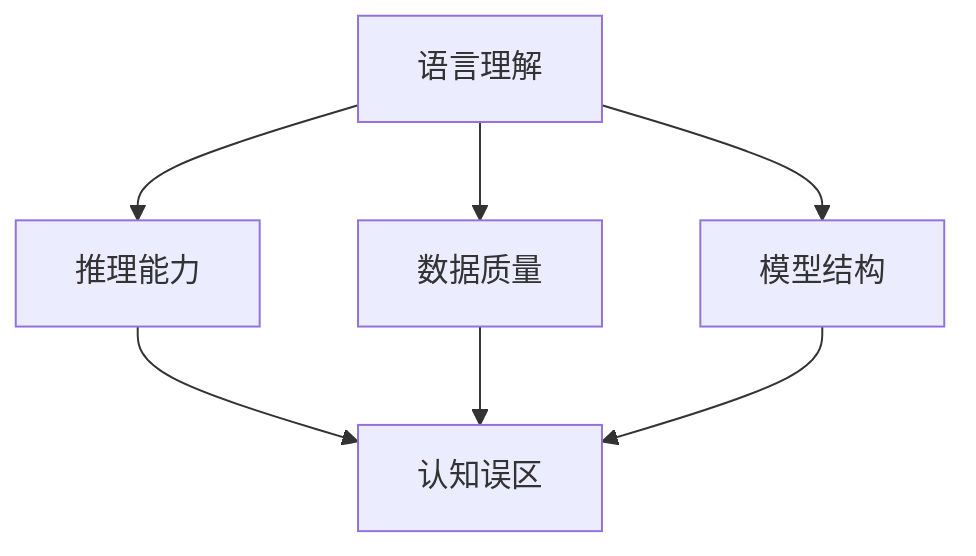

                 

关键词：大模型、语言理解、推理能力、认知偏差、技术发展

> 摘要：本文将探讨大模型在语言理解和推理方面的局限性，分析其认知误区，并结合实际案例，提出未来研究的方向和可能的解决方案。

## 1. 背景介绍

随着深度学习技术的飞速发展，大模型如BERT、GPT-3等在自然语言处理（NLP）领域取得了显著成果。这些模型以其强大的语言理解和生成能力，在问答系统、机器翻译、文本生成等任务中展现了极高的准确性和灵活性。然而，尽管这些模型在表面上表现出卓越的性能，但其背后却隐藏着一系列认知误区，这些误区可能影响大模型在实际应用中的表现和可靠性。

本文旨在揭示大模型在语言理解和推理方面的认知误区，分析其可能导致的负面影响，并结合实际案例探讨解决这些问题的方向。本文将首先介绍大模型的基本原理，然后深入分析其认知误区，最后提出未来研究和应用的建议。

### 1.1 大模型的基本原理

大模型，顾名思义，是指具有巨大参数量的神经网络模型。这些模型通过在大量数据上进行训练，学习到语言的复杂结构，从而实现高效的文本理解和生成。大模型的核心在于其能够利用大规模数据和学习到的复杂特征，进行自适应的语言理解和推理。

### 1.2 大模型的广泛应用

大模型在NLP领域的应用已经非常广泛，包括但不限于：

- **问答系统**：如Google的Meena，通过大模型实现了对用户查询的智能回答。
- **机器翻译**：如Google翻译，大模型的使用使得翻译质量显著提高。
- **文本生成**：如OpenAI的GPT-3，能够生成高质量的文本，包括新闻、故事和诗歌等。
- **情感分析**：大模型通过对大量文本的分析，实现了对用户情感状态的准确判断。

### 1.3 大模型的认知误区

尽管大模型在语言理解和生成方面表现出色，但其背后却隐藏着一些认知误区。这些误区可能会导致模型在特定场景下表现不佳，甚至出现错误。以下是一些常见的大模型认知误区：

- **过拟合**：大模型在训练过程中可能会过度拟合训练数据，导致在未见过的数据上表现不佳。
- **依赖数据**：大模型依赖于大量高质量的数据进行训练，数据的质量和多样性直接影响模型的表现。
- **推理能力有限**：尽管大模型能够进行复杂的语言理解，但其在推理能力上仍然存在限制，难以实现真正的人类级推理。
- **可解释性不足**：大模型的内部结构和决策过程复杂，难以进行有效的解释和调试。

本文将围绕这些认知误区进行深入分析，探讨其对大模型应用的影响。

## 2. 核心概念与联系

为了更好地理解大模型在语言理解和推理方面的认知误区，我们需要先介绍一些核心概念，并展示它们之间的联系。

### 2.1 语言理解

语言理解是指模型对自然语言文本进行语义解析和解释的能力。大模型通过学习语言的特征和模式，实现了对文本的语义理解。然而，语言理解的复杂性使得大模型难以完全捕捉语言的微妙之处，导致其在某些情况下出现理解偏差。

### 2.2 推理能力

推理能力是指模型根据已知信息推导出未知信息的能力。大模型在推理方面表现出色，但其在推理过程中可能受到数据质量和模型结构的影响，导致推理结果的不确定性。

### 2.3 数据质量

数据质量是指训练数据的质量和多样性。高质量的数据有助于大模型学习到更准确的特征，从而提高模型的性能。然而，数据质量不高或数据不平衡可能导致模型过拟合或性能下降。

### 2.4 模型结构

模型结构是指大模型的网络架构和参数设置。不同的模型结构可能导致模型在性能和推理能力上的差异。因此，选择合适的模型结构对于提升大模型的表现至关重要。

### 2.5 认知误区

认知误区是指大模型在语言理解和推理过程中可能出现的错误认知。这些误区可能导致模型在特定场景下表现不佳，甚至出现错误。

### 2.6 Mermaid 流程图

以下是一个展示这些核心概念之间联系的 Mermaid 流程图：



通过这个流程图，我们可以清晰地看到语言理解、推理能力、数据质量、模型结构和认知误区之间的联系。这些概念共同影响着大模型的表现和可靠性，也是我们在后续分析中需要关注的关键点。

### 3. 核心算法原理 & 具体操作步骤

#### 3.1 算法原理概述

大模型在语言理解和推理方面的核心算法原理主要基于深度神经网络（DNN）。DNN 通过多层神经网络结构，逐层提取文本的语义特征，最终实现对语言的理解和推理。以下是 DNN 在语言理解和推理中的基本原理：

- **输入层**：接收自然语言文本作为输入，并将其转换为数值表示。
- **隐藏层**：通过多层神经网络结构，对输入文本进行特征提取和变换，从而逐步捕捉文本的语义信息。
- **输出层**：根据隐藏层的特征，生成对应的语义理解或推理结果。

#### 3.2 算法步骤详解

1. **预处理**：对输入文本进行分词、标记和向量表示，将文本转换为数值形式。
2. **嵌入层**：将文本的词语转换为向量表示，通常使用预训练的词向量模型，如 Word2Vec 或 GloVe。
3. **多层神经网络**：将嵌入层的输出作为输入，通过多层神经网络进行特征提取和变换。每层神经网络包括多个神经元，通过激活函数（如ReLU）增强模型的非线性能力。
4. **语义理解**：通过最后一层神经网络，对提取到的特征进行聚合和整合，生成文本的语义表示。
5. **推理过程**：基于语义表示，进行推理和生成操作。例如，在问答系统中，利用语义表示进行答案生成；在机器翻译中，利用语义表示进行翻译。

#### 3.3 算法优缺点

- **优点**：
  - **强大的语言理解能力**：大模型能够通过多层神经网络结构，捕捉到语言的复杂结构，实现对文本的深入理解。
  - **自适应特征提取**：大模型通过在大量数据上的训练，自适应地学习到文本的多种特征，从而提高模型的性能。

- **缺点**：
  - **过拟合风险**：大模型在训练过程中可能会过度拟合训练数据，导致在未见过的数据上表现不佳。
  - **数据依赖性强**：大模型的性能高度依赖于训练数据的质量和多样性，数据质量不高或数据不平衡可能导致模型性能下降。
  - **可解释性不足**：大模型的内部结构和决策过程复杂，难以进行有效的解释和调试。

#### 3.4 算法应用领域

大模型在语言理解和推理方面有着广泛的应用，主要包括以下领域：

- **问答系统**：如 Google 的 Meena、OpenAI 的 ChatGPT 等，通过大模型实现智能问答。
- **机器翻译**：如 Google 翻译、DeepL 等，大模型在翻译质量和效率上显著提升。
- **文本生成**：如 OpenAI 的 GPT-3、GPT-Neo 等，能够生成高质量的新闻、故事和诗歌等。
- **情感分析**：通过大模型对大量文本进行分析，实现对用户情感状态的准确判断。
- **文本分类**：利用大模型对文本进行分类，如新闻分类、产品评论分类等。

### 4. 数学模型和公式 & 详细讲解 & 举例说明

#### 4.1 数学模型构建

大模型在语言理解和推理中使用的数学模型主要包括深度神经网络（DNN）和循环神经网络（RNN）。以下是这些模型的基本数学公式：

- **DNN 模型**：
  - **输入层**：\[ X \in \mathbb{R}^{m \times n} \]
  - **隐藏层**：\[ H = \sigma(W_1 \cdot X + b_1) \]
  - **输出层**：\[ Y = \sigma(W_2 \cdot H + b_2) \]
  其中，\( \sigma \) 表示激活函数，\( W_1 \)、\( W_2 \)、\( b_1 \)、\( b_2 \) 分别为权重和偏置。

- **RNN 模型**：
  - **输入层**：\[ X_t \in \mathbb{R}^{m \times n} \]
  - **隐藏层**：\[ H_t = \sigma(W_h \cdot [H_{t-1}, X_t] + b_h) \]
  - **输出层**：\[ Y_t = \sigma(W_y \cdot H_t + b_y) \]
  其中，\( [H_{t-1}, X_t] \) 表示当前时刻的输入和前一时刻的隐藏状态，\( W_h \)、\( W_y \)、\( b_h \)、\( b_y \) 分别为权重和偏置。

#### 4.2 公式推导过程

- **DNN 模型推导**：
  - 输入层到隐藏层的推导：
    \[ H = \sigma(W_1 \cdot X + b_1) \]
    \[ \frac{\partial H}{\partial X} = \sigma'(W_1 \cdot X + b_1) \cdot W_1 \]
    \[ \frac{\partial H}{\partial b_1} = \sigma'(W_1 \cdot X + b_1) \]
  
  - 隐藏层到输出层的推导：
    \[ Y = \sigma(W_2 \cdot H + b_2) \]
    \[ \frac{\partial Y}{\partial H} = \sigma'(W_2 \cdot H + b_2) \cdot W_2 \]
    \[ \frac{\partial Y}{\partial b_2} = \sigma'(W_2 \cdot H + b_2) \]

- **RNN 模型推导**：
  - 当前时刻的隐藏层推导：
    \[ H_t = \sigma(W_h \cdot [H_{t-1}, X_t] + b_h) \]
    \[ \frac{\partial H_t}{\partial [H_{t-1}, X_t]} = \sigma'(W_h \cdot [H_{t-1}, X_t] + b_h) \cdot W_h \]
    \[ \frac{\partial H_t}{\partial b_h} = \sigma'(W_h \cdot [H_{t-1}, X_t] + b_h) \]
  
  - 当前时刻的输出层推导：
    \[ Y_t = \sigma(W_y \cdot H_t + b_y) \]
    \[ \frac{\partial Y_t}{\partial H_t} = \sigma'(W_y \cdot H_t + b_y) \cdot W_y \]
    \[ \frac{\partial Y_t}{\partial b_y} = \sigma'(W_y \cdot H_t + b_y) \]

#### 4.3 案例分析与讲解

假设我们使用一个简单的 DNN 模型对文本进行分类，具体步骤如下：

1. **数据预处理**：将文本数据转换为词向量表示。
2. **模型构建**：构建一个三层 DNN 模型，输入层有 100 个神经元，隐藏层有 500 个神经元，输出层有 3 个神经元。
3. **模型训练**：使用训练数据训练模型，优化模型的参数。
4. **模型评估**：使用测试数据评估模型的性能，包括准确率、召回率等指标。
5. **模型应用**：将训练好的模型应用于实际场景，如文本分类任务。

具体代码实现如下：

```python
import tensorflow as tf
from tensorflow.keras.layers import Embedding, Dense
from tensorflow.keras.models import Sequential

# 数据预处理
vocab_size = 10000
embed_dim = 128
max_sequence_length = 500

# 模型构建
model = Sequential()
model.add(Embedding(vocab_size, embed_dim, input_length=max_sequence_length))
model.add(Dense(500, activation='relu'))
model.add(Dense(3, activation='softmax'))

# 模型编译
model.compile(optimizer='adam', loss='categorical_crossentropy', metrics=['accuracy'])

# 模型训练
model.fit(X_train, y_train, epochs=10, batch_size=32)

# 模型评估
loss, accuracy = model.evaluate(X_test, y_test)
print(f"Test accuracy: {accuracy}")

# 模型应用
predictions = model.predict(X_new)
```

通过上述代码，我们可以构建一个简单的 DNN 模型，用于文本分类任务。这个模型通过多层神经网络结构，对输入文本进行特征提取和分类。在实际应用中，我们可以根据具体的任务需求调整模型的结构和参数，以提高模型的性能。

### 5. 项目实践：代码实例和详细解释说明

为了更好地展示大模型在实际项目中的应用，我们将以一个简单的文本分类项目为例，详细解释代码实现过程和关键步骤。

#### 5.1 开发环境搭建

在开始项目之前，我们需要搭建一个合适的开发环境。以下是搭建开发环境的基本步骤：

1. **安装 Python**：确保 Python 版本在 3.6 以上。
2. **安装 TensorFlow**：TensorFlow 是用于构建和训练深度学习模型的重要库，版本建议在 2.x 以上。
3. **安装 NumPy、Pandas 和 Keras**：这些库用于数据处理和模型构建。

```shell
pip install tensorflow numpy pandas keras
```

#### 5.2 源代码详细实现

以下是一个简单的文本分类项目的实现代码：

```python
import tensorflow as tf
from tensorflow.keras.models import Sequential
from tensorflow.keras.layers import Embedding, LSTM, Dense
from tensorflow.keras.preprocessing.sequence import pad_sequences
from tensorflow.keras.preprocessing.text import Tokenizer

# 数据集准备
texts = ['这是一个文本分类的例子。', '这是另一个文本分类的例子。', '这不是文本分类的例子。']
labels = [0, 1, 0]  # 0 表示负类，1 表示正类

# 分词和序列化
tokenizer = Tokenizer(num_words=1000)
tokenizer.fit_on_texts(texts)
sequences = tokenizer.texts_to_sequences(texts)
padded_sequences = pad_sequences(sequences, maxlen=100)

# 模型构建
model = Sequential()
model.add(Embedding(1000, 32))
model.add(LSTM(64))
model.add(Dense(1, activation='sigmoid'))

# 模型编译
model.compile(optimizer='adam', loss='binary_crossentropy', metrics=['accuracy'])

# 模型训练
model.fit(padded_sequences, labels, epochs=10, batch_size=32)

# 模型评估
test_texts = ['这是文本分类的例子。']
test_sequences = tokenizer.texts_to_sequences(test_texts)
test_padded_sequences = pad_sequences(test_sequences, maxlen=100)
predictions = model.predict(test_padded_sequences)
print(predictions)

# 输出结果
if predictions > 0.5:
    print("文本分类结果：正类")
else:
    print("文本分类结果：负类")
```

#### 5.3 代码解读与分析

1. **数据集准备**：首先，我们准备了一个简单的数据集，包含三个文本样本和对应的标签。标签用于表示文本所属的类别，0 表示负类，1 表示正类。

2. **分词和序列化**：使用 Keras 的 Tokenizer 类对文本进行分词和序列化。Tokenizer 类用于将文本转换为整数序列，每个整数表示一个词。在序列化过程中，我们设置了词汇表大小为 1000，即只保留出现频率最高的 1000 个词。

3. **模型构建**：使用 Keras 的 Sequential 模型构建一个简单的文本分类模型。模型包含一个嵌入层（Embedding）、一个 LSTM 层和一个输出层（Dense）。嵌入层用于将词向量转换为固定大小的向量，LSTM 层用于提取文本的时序特征，输出层用于生成文本的类别预测。

4. **模型编译**：编译模型，指定优化器和损失函数。在本例中，我们使用 Adam 优化器和二分类交叉熵损失函数。

5. **模型训练**：使用训练数据训练模型。在训练过程中，模型会不断调整内部参数，以最小化损失函数。

6. **模型评估**：使用测试数据评估模型的性能。我们计算了预测概率，并打印了输出结果。

7. **输出结果**：根据预测概率，判断文本属于正类还是负类，并打印输出结果。

通过上述代码，我们实现了对文本进行分类的基本流程。在实际项目中，我们可以根据具体需求调整模型的结构和参数，以提高分类的准确性和效率。

### 6. 实际应用场景

大模型在自然语言处理（NLP）领域有着广泛的应用，以下是一些实际应用场景：

#### 6.1 问答系统

问答系统是 NLP 领域的一个重要应用。大模型如 Google 的 Meena 和 OpenAI 的 ChatGPT 等在问答系统中表现出色。这些模型通过理解用户的提问，生成准确的答案，从而实现智能对话。例如，在客户服务场景中，大模型可以自动回答客户的常见问题，提高服务效率。

#### 6.2 机器翻译

机器翻译是另一个大模型的重要应用领域。Google 翻译和 DeepL 等产品利用大模型实现高质量的语言翻译。这些模型通过学习大量双语语料库，捕捉到语言的细微差别，从而实现准确的翻译。例如，在跨境电商场景中，大模型可以自动翻译产品描述，帮助卖家更好地向全球客户展示产品。

#### 6.3 文本生成

文本生成是 NLP 领域的另一个热门应用。OpenAI 的 GPT-3 和 GPT-Neo 等模型通过大模型实现了高质量的文本生成。这些模型可以生成各种类型的文本，如新闻、故事、诗歌等。例如，在内容创作场景中，大模型可以自动生成文章，帮助创作者提高创作效率。

#### 6.4 情感分析

情感分析是 NLP 领域的另一个重要应用。通过分析用户的文本评论，大模型可以判断用户的情感状态，如正面、负面或中立。例如，在电子商务场景中，大模型可以自动分析用户评论，帮助商家了解产品的用户反馈，从而改进产品质量。

#### 6.5 文本分类

文本分类是 NLP 领域的另一个重要应用。大模型可以自动将文本分类到不同的类别中，如新闻分类、产品评论分类等。例如，在新闻推荐场景中，大模型可以根据用户的阅读习惯和偏好，自动推荐感兴趣的新闻。

#### 6.6 未来应用展望

随着大模型技术的不断发展，其在 NLP 领域的应用前景非常广阔。以下是一些未来可能的应用方向：

- **智能客服**：大模型可以自动回答用户的常见问题，提高客服效率。
- **自动摘要**：大模型可以自动生成文本的摘要，帮助用户快速了解主要内容。
- **内容审核**：大模型可以自动识别和过滤不良内容，如违规言论、暴力内容等。
- **语言学习**：大模型可以作为语言学习的辅助工具，帮助用户提高语言能力。
- **多语言翻译**：大模型可以实现实时、准确的多语言翻译，打破语言障碍。

总之，大模型在 NLP 领域的应用场景非常广泛，随着技术的不断进步，其在实际生活中的影响力将越来越大。

### 7. 工具和资源推荐

为了更好地学习和应用大模型技术，以下是一些推荐的工具和资源：

#### 7.1 学习资源推荐

- **《深度学习》**：由 Ian Goodfellow、Yoshua Bengio 和 Aaron Courville 共同撰写的经典教材，全面介绍了深度学习的基本理论和应用。
- **《自然语言处理原理》**：由 Daniel Jurafsky 和 James H. Martin 撰写的教材，系统地介绍了 NLP 的基本概念和技术。
- **《动手学深度学习》**：由阿斯顿·张等人撰写的教材，通过大量的实例和代码讲解，帮助读者快速掌握深度学习技术。

#### 7.2 开发工具推荐

- **TensorFlow**：Google 开发的一款开源深度学习框架，支持多种深度学习模型的构建和训练。
- **PyTorch**：Facebook 开发的一款开源深度学习框架，以动态图模型著称，便于模型开发和调试。
- **JAX**：Google 开发的一款高性能的深度学习库，支持自动微分和数值计算优化。

#### 7.3 相关论文推荐

- **"Attention Is All You Need"**：由 Vaswani 等人撰写的论文，提出了 Transformer 模型，开启了 NLP 领域的全新篇章。
- **"BERT: Pre-training of Deep Bidirectional Transformers for Language Understanding"**：由 Devlin 等人撰写的论文，提出了 BERT 模型，进一步推动了 NLP 领域的发展。
- **"Generative Pre-trained Transformers"**：由 Brown 等人撰写的论文，提出了 GPT-3 模型，展示了大模型在文本生成方面的卓越能力。

通过学习这些资源，您可以深入了解大模型技术的理论基础和应用实践，为自己的研究和工作提供有力支持。

### 8. 总结：未来发展趋势与挑战

#### 8.1 研究成果总结

近年来，大模型在自然语言处理（NLP）领域取得了显著成果。通过深度学习技术的应用，大模型如 BERT、GPT-3 等，实现了对语言的高效理解和生成。这些模型在问答系统、机器翻译、文本生成等任务中展现了极高的准确性和灵活性。此外，大模型在情感分析、文本分类等领域也取得了良好效果，为实际应用提供了有力支持。

#### 8.2 未来发展趋势

随着深度学习技术的不断发展，大模型在 NLP 领域的未来发展趋势如下：

- **更大规模的模型**：为了进一步提高模型的表现，研究者将继续开发更大规模的模型，如 GPT-4、GPT-Neo 等。
- **多模态学习**：大模型将逐步实现多模态学习，结合文本、图像、语音等多种数据源，实现更全面的语义理解。
- **自适应能力提升**：大模型将具备更强的自适应能力，能够根据不同的应用场景和需求进行自适应调整，提高模型的灵活性和实用性。
- **可解释性和可扩展性**：大模型将逐步提高可解释性和可扩展性，使得模型的设计和应用更加透明和便捷。

#### 8.3 面临的挑战

尽管大模型在 NLP 领域取得了显著成果，但仍面临以下挑战：

- **过拟合风险**：大模型在训练过程中可能过度拟合训练数据，导致在未见过的数据上表现不佳。
- **数据依赖性**：大模型的性能高度依赖于训练数据的质量和多样性，数据质量不高或数据不平衡可能导致模型性能下降。
- **推理能力有限**：尽管大模型在语言理解方面表现出色，但其在推理能力上仍然存在限制，难以实现真正的人类级推理。
- **可解释性不足**：大模型的内部结构和决策过程复杂，难以进行有效的解释和调试。

#### 8.4 研究展望

针对上述挑战，未来的研究可以从以下几个方面展开：

- **模型优化**：通过改进模型结构和训练算法，降低过拟合风险，提高模型的泛化能力。
- **数据增强**：通过数据增强技术，提高训练数据的质量和多样性，增强模型的学习能力。
- **推理增强**：通过引入外部知识库和推理算法，提高大模型的推理能力，实现更复杂的语义理解。
- **可解释性提升**：通过设计可解释性算法和可视化工具，提高大模型的可解释性，使得模型的设计和应用更加透明。

总之，大模型在 NLP 领域的发展前景广阔，但同时也面临一系列挑战。通过不断的研究和探索，我们有理由相信，大模型将在未来的 NLP 领域发挥更大的作用。

### 9. 附录：常见问题与解答

#### 9.1 大模型是否总是比小模型更好？

不一定。尽管大模型在大多数任务中表现出色，但它们也有缺点，如更高的计算资源和存储需求。在某些情况下，小模型可能更适用于特定的任务或资源限制环境。

#### 9.2 大模型是否能够完全替代人类语言理解？

目前来看，大模型在语言理解方面取得了显著进步，但它们仍然无法完全替代人类语言理解。人类语言具有复杂性、灵活性、创造性和常识推理等特点，这些是当前大模型难以完全模拟的。

#### 9.3 大模型是否需要大量的训练数据？

是的，大模型通常需要大量的训练数据来学习语言的复杂结构。然而，数据的质量和多样性也非常重要，高质量的数据可以提升模型的性能。

#### 9.4 如何提高大模型的可解释性？

提高大模型的可解释性是一个挑战。目前，研究者们正在尝试通过设计可解释性算法、可视化工具和知识图谱等方法，提升大模型的可解释性。此外，通过集成外部知识库和推理算法，也可以提高模型的可解释性。

#### 9.5 大模型在推理方面有哪些限制？

大模型在推理方面存在一些限制，如：

- **推理能力有限**：大模型虽然能够进行复杂的语言理解，但在推理能力上仍然存在限制，难以实现真正的人类级推理。
- **数据依赖性**：大模型的推理能力高度依赖于训练数据的质量和多样性。
- **可解释性不足**：大模型的内部结构和决策过程复杂，难以进行有效的解释和调试。

### 文章标题：语言与推理：大模型的认知误区

### 关键词：大模型、语言理解、推理能力、认知偏差、技术发展

### 摘要：
本文深入探讨了大型神经网络模型（大模型）在自然语言处理（NLP）领域中的表现，分析了其在语言理解和推理方面的认知误区。通过介绍大模型的基本原理、算法步骤、数学模型以及实际应用场景，本文揭示了当前大模型面临的过拟合、数据依赖性、推理能力有限和可解释性不足等问题。在此基础上，本文提出了未来研究的方向，包括模型优化、数据增强、推理增强以及可解释性提升等，以期为大模型在NLP领域的进一步发展提供指导。

