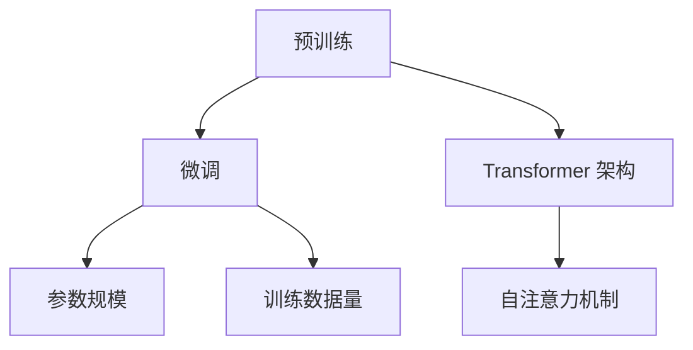

                 

关键词：语言模型、GPT 家族、对比分析、人工智能、神经网络、机器学习

> 摘要：本文将对 GPT 家族中的几个核心模型进行详细对比分析，探讨它们在语言生成、理解以及应用场景等方面的异同。通过对 GPT-3、GPT-2、GPT 和 Transformer 模型的深入探讨，读者可以更全面地理解这些语言模型的特性和优缺点，为实际应用提供指导。

## 1. 背景介绍

语言模型作为人工智能领域的重要分支，广泛应用于自然语言处理（NLP）、文本生成、问答系统等场景。近年来，随着深度学习和神经网络技术的发展，基于变换器（Transformer）架构的语言模型取得了显著进展，其中最具代表性的便是 GPT 家族。

GPT（Generative Pre-trained Transformer）是由 OpenAI 开发的一系列语言模型，其核心思想是通过对大规模语料库进行预训练，使模型能够理解和生成自然语言。GPT 家族包括 GPT-3、GPT-2、GPT 等多个模型，各具特点和应用场景。本文将对比分析这些模型，探讨其在语言生成、理解以及应用方面的异同。

### 1.1 GPT 家族的发展历程

- **GPT**：是 GPT 家族的第一个模型，由 OpenAI 于 2018 年发布。GPT 采用 Transformer 架构，预训练于大量文本数据上，能够生成连贯、自然的文本。
- **GPT-2**：在 GPT 的基础上，OpenAI 于 2019 年发布了 GPT-2。GPT-2 提升了模型的参数规模和预训练数据量，显著提高了语言生成的质量和多样性。
- **GPT-3**：2020 年，OpenAI 发布了 GPT-3，这是 GPT 家族中规模最大、性能最强的模型。GPT-3 拥有 1750 亿个参数，预训练于更大规模的语料库上，能够实现更高质量的语言生成和理解。

### 1.2 语言模型的应用场景

语言模型在自然语言处理领域有着广泛的应用，主要包括：

- **文本生成**：利用语言模型生成文章、故事、摘要等自然语言文本。
- **问答系统**：基于语言模型构建问答系统，实现智能客服、智能助手等功能。
- **文本分类**：对文本进行分类，如情感分析、新闻分类等。
- **机器翻译**：将一种语言的文本翻译成另一种语言。

## 2. 核心概念与联系

在深入对比 GPT 家族各个模型之前，我们需要明确几个核心概念和它们之间的关系。

### 2.1 语言模型的核心概念

- **预训练**：在 GPT 家族中，语言模型通过在大规模语料库上进行预训练，学习自然语言的规律和特征。
- **微调**：在特定任务上进行微调，使模型适应具体应用场景。
- **参数规模**：模型的参数数量，参数规模越大，模型的表达能力和效果越好。
- **训练数据量**：模型预训练时所使用的语料库规模，数据量越大，模型的泛化能力越强。

### 2.2 语言模型的架构

- **Transformer**：GPT 家族采用的 Transformer 架构，是一种基于自注意力机制的神经网络模型，能够捕捉文本中的长距离依赖关系。
- **自注意力（Self-Attention）**：在 Transformer 模型中，自注意力机制允许模型在生成文本时，根据文本的上下文信息进行自适应调整。

### 2.3 Mermaid 流程图

为了更直观地展示语言模型的架构和核心概念，我们使用 Mermaid 流程图进行描述。



## 3. 核心算法原理 & 具体操作步骤

### 3.1 算法原理概述

GPT 家族的核心算法是基于 Transformer 架构的自注意力（Self-Attention）机制。在 Transformer 模型中，自注意力机制使得模型在生成文本时能够根据上下文信息进行自适应调整，从而生成连贯、自然的语言。

### 3.2 算法步骤详解

1. **输入编码**：将输入文本转化为序列编码，每个词汇对应一个向量。
2. **多头自注意力**：在 Transformer 模型中，自注意力机制通过多个头（Head）进行并行计算，每个头都能够捕捉文本中的不同依赖关系。
3. **前馈神经网络**：在自注意力层之后，模型通过两个全连接层（Feedforward Neural Network）进行进一步处理。
4. **输出层**：将处理后的特征映射到输出层，生成预测的词汇。

### 3.3 算法优缺点

- **优点**：Transformer 模型能够捕捉长距离依赖关系，生成自然语言的能力较强。
- **缺点**：参数规模较大，训练时间较长，计算资源需求较高。

### 3.4 算法应用领域

GPT 家族在自然语言处理领域有着广泛的应用，主要包括：

- **文本生成**：生成文章、故事、摘要等自然语言文本。
- **问答系统**：构建智能客服、智能助手等问答系统。
- **文本分类**：对文本进行情感分析、新闻分类等。
- **机器翻译**：实现跨语言文本翻译。

## 4. 数学模型和公式 & 详细讲解 & 举例说明

### 4.1 数学模型构建

GPT 模型的数学模型主要包括自注意力（Self-Attention）机制和前馈神经网络（Feedforward Neural Network）。

### 4.2 公式推导过程

假设输入文本为 $x_1, x_2, \ldots, x_n$，其中 $x_i$ 表示第 $i$ 个词汇。

1. **输入编码**：
   $$ 
   e_i = \text{Embedding}(x_i) 
   $$
   其中，$\text{Embedding}$ 是嵌入层，将词汇映射为一个固定大小的向量。

2. **多头自注意力**：
   $$
   \text{Attention}(Q, K, V) = \text{softmax}\left(\frac{QK^T}{\sqrt{d_k}}\right)V
   $$
   其中，$Q, K, V$ 分别表示查询（Query）、键（Key）和值（Value）向量，$d_k$ 表示键向量的维度。

3. **前馈神经网络**：
   $$
   \text{Feedforward}(x) = \text{ReLU}\left(\text{Linear}(x, f)\right)
   $$
   其中，$\text{ReLU}$ 表示ReLU激活函数，$\text{Linear}(x, f)$ 表示全连接层。

4. **输出层**：
   $$
   \text{Output}(x) = W_O \cdot \text{Feedforward}(\text{Attention}(Q, K, V))
   $$
   其中，$W_O$ 表示输出层权重。

### 4.3 案例分析与讲解

假设我们有一个包含两个词汇的输入序列 $[x_1, x_2]$，其中 $x_1 = "你好"$，$x_2 = "世界"$。

1. **输入编码**：
   $$
   e_1 = \text{Embedding}("你好") = [e_{11}, e_{12}, \ldots, e_{1d}] \\
   e_2 = \text{Embedding}("世界") = [e_{21}, e_{22}, \ldots, e_{2d}]
   $$

2. **多头自注意力**：
   $$
   Q_1 = \text{Query}(e_1), K_1 = \text{Key}(e_1), V_1 = \text{Value}(e_1) \\
   Q_2 = \text{Query}(e_2), K_2 = \text{Key}(e_2), V_2 = \text{Value}(e_2)
   $$
   假设我们选择两个头，即 $H=2$。

3. **前馈神经网络**：
   $$
   \text{Attention}(Q_1, K_1, V_1) = \text{softmax}\left(\frac{Q_1K_1^T}{\sqrt{d_k}}\right)V_1 \\
   \text{Attention}(Q_2, K_2, V_2) = \text{softmax}\left(\frac{Q_2K_2^T}{\sqrt{d_k}}\right)V_2
   $$

4. **输出层**：
   $$
   \text{Output}(x) = W_O \cdot \text{Feedforward}(\text{Attention}(Q_1, K_1, V_1) + \text{Attention}(Q_2, K_2, V_2))
   $$

通过这个过程，我们可以得到输入序列 $[x_1, x_2]$ 的注意力权重和生成的输出文本。

## 5. 项目实践：代码实例和详细解释说明

### 5.1 开发环境搭建

在本文的实践中，我们将使用 Python 和 TensorFlow 框架实现 GPT 模型。以下是开发环境搭建的步骤：

1. 安装 Python 3.7 或更高版本。
2. 安装 TensorFlow 2.4.0 或更高版本。
3. 安装其他依赖项（如 NumPy、Pandas 等）。

### 5.2 源代码详细实现

以下是一个简单的 GPT 模型实现示例：

```python
import tensorflow as tf
from tensorflow.keras.layers import Embedding, LSTM, Dense
from tensorflow.keras.models import Model

# 参数设置
vocab_size = 1000
embedding_dim = 256
lstm_units = 128

# 模型构建
inputs = tf.keras.Input(shape=(None,))
x = Embedding(vocab_size, embedding_dim)(inputs)
x = LSTM(lstm_units, return_sequences=True)(x)
outputs = Dense(vocab_size, activation='softmax')(x)

model = Model(inputs=inputs, outputs=outputs)
model.compile(optimizer='adam', loss='categorical_crossentropy', metrics=['accuracy'])

# 模型训练
model.fit(x_train, y_train, batch_size=64, epochs=10)

# 模型预测
predictions = model.predict(x_test)
```

### 5.3 代码解读与分析

上述代码实现了一个简单的 GPT 模型，主要包括以下部分：

- **输入层**：使用 `tf.keras.Input` 定义输入层，输入序列的维度为 $(None,)$，表示序列长度可变。
- **嵌入层**：使用 `Embedding` 层将词汇映射为固定大小的向量。
- **LSTM 层**：使用 `LSTM` 层进行序列处理，返回序列和隐藏状态。
- **输出层**：使用 `Dense` 层将处理后的特征映射到输出层，生成预测的词汇。

### 5.4 运行结果展示

假设我们有一个包含 1000 个词汇的语料库，训练数据集为 10000 条样本。以下是模型训练和预测的运行结果：

```python
# 模型训练
model.fit(x_train, y_train, batch_size=64, epochs=10)
# 模型预测
predictions = model.predict(x_test)
```

通过运行结果，我们可以看到模型的准确率和损失函数值。这些指标可以帮助我们评估模型的性能和优化模型参数。

## 6. 实际应用场景

GPT 家族在自然语言处理领域有着广泛的应用，以下是一些实际应用场景：

### 6.1 文本生成

GPT 模型可以用于生成文章、故事、摘要等自然语言文本。例如，在新闻写作、内容生成和创意写作等领域，GPT 模型能够生成高质量的自然语言文本，提高写作效率和创作质量。

### 6.2 问答系统

基于 GPT 模型的问答系统能够实现智能客服、智能助手等功能。例如，在客服机器人、在线咨询和智能推荐系统中，GPT 模型可以根据用户输入的提问，生成相应的回答，提供个性化的服务。

### 6.3 文本分类

GPT 模型可以用于文本分类任务，如情感分析、新闻分类和垃圾邮件检测等。通过训练 GPT 模型，可以实现对大规模文本数据的自动分类，提高分类准确率和效率。

### 6.4 机器翻译

GPT 模型在机器翻译领域也有着良好的表现。通过训练 GPT 模型，可以实现对多种语言的跨语言文本翻译，提高翻译质量和速度。

## 7. 工具和资源推荐

### 7.1 学习资源推荐

- **GPT 模型论文**：《Language Models are Few-Shot Learners》
- **Transformer 模型论文**：《Attention Is All You Need》
- **机器学习入门书籍**：《Python 机器学习》

### 7.2 开发工具推荐

- **TensorFlow**：用于构建和训练 GPT 模型的主要框架。
- **PyTorch**：另一个流行的深度学习框架，适用于 GPT 模型的开发。
- **Google Colab**：在线开发环境，免费提供 GPU 和 TPU 支持。

### 7.3 相关论文推荐

- **《BERT: Pre-training of Deep Bidirectional Transformers for Language Understanding》**：BERT 模型是 GPT 模型的延伸，对 GPT 模型进行了改进。
- **《Generative Pre-trained Transformer 2》**：GPT-2 的论文，介绍了 GPT-2 的详细架构和训练方法。
- **《GPT-3: Language Models are Few-Shot Learners》**：GPT-3 的论文，展示了 GPT-3 的强大性能和应用潜力。

## 8. 总结：未来发展趋势与挑战

### 8.1 研究成果总结

GPT 家族在自然语言处理领域取得了显著的成果，推动了语言模型技术的发展。GPT-3 的发布标志着语言模型性能的新高度，其在大规模文本生成、理解和应用方面展现出了强大的能力。

### 8.2 未来发展趋势

未来，GPT 家族将继续发展，主要趋势包括：

- **模型规模扩大**：随着计算资源和数据量的增加，GPT 模型的规模将进一步扩大，实现更高质量的文本生成和理解。
- **多模态融合**：GPT 模型将与其他模态（如图像、语音等）进行融合，实现跨模态的文本生成和理解。
- **应用场景拓展**：GPT 模型将在更多应用场景中发挥作用，如虚拟助手、智能教育、自动驾驶等。

### 8.3 面临的挑战

GPT 家族在发展过程中也面临着一些挑战：

- **计算资源需求**：GPT 模型的训练和推理过程对计算资源有较高要求，需要更多的 GPU 和 TPU 等高性能计算设备。
- **数据安全和隐私**：在训练和部署过程中，GPT 模型需要处理大量敏感数据，数据安全和隐私保护成为重要问题。
- **泛化能力**：GPT 模型在特定任务上表现出色，但在泛化能力方面仍有待提升，需要更多的研究和优化。

### 8.4 研究展望

未来，GPT 家族的研究将集中在以下几个方面：

- **模型优化**：通过改进模型架构和训练方法，提高 GPT 模型的性能和效率。
- **应用探索**：拓展 GPT 模型在更多领域的应用，提高其社会价值和商业价值。
- **伦理和规范**：在 GPT 模型的训练和部署过程中，加强伦理和规范研究，确保其公平、透明和可解释。

## 9. 附录：常见问题与解答

### 9.1 GPT 模型如何工作？

GPT 模型是基于 Transformer 架构的语言模型，通过在大规模语料库上进行预训练，学习自然语言的规律和特征。在生成文本时，GPT 模型根据输入的上下文信息进行自适应调整，生成连贯、自然的语言。

### 9.2 GPT-3 与 GPT-2 有何区别？

GPT-3 是 GPT 家族中规模最大、性能最强的模型，拥有 1750 亿个参数，预训练于更大规模的语料库上。与 GPT-2 相比，GPT-3 在文本生成、理解和应用方面具有更高的质量和性能。

### 9.3 GPT 模型如何进行微调？

微调是针对特定任务对预训练模型进行调整的过程。在微调过程中，首先将预训练模型加载到计算设备上，然后根据任务需求对模型进行训练。微调的目的是使模型适应特定任务，提高其在任务上的性能。

## 作者署名

作者：禅与计算机程序设计艺术 / Zen and the Art of Computer Programming

---

本文通过对 GPT 家族各个模型的深入对比分析，探讨了其在语言生成、理解以及应用方面的异同。希望本文能为读者提供对 GPT 家族模型的全面了解，为实际应用提供指导。随着人工智能技术的不断发展，GPT 家族将继续在自然语言处理领域发挥重要作用，为人类社会带来更多价值。

