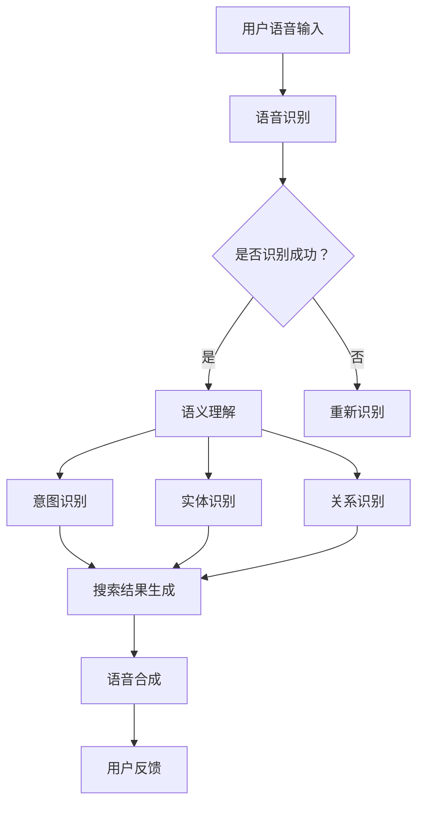

                 

### 引言 Introduction

在当今数字化转型的浪潮中，电商行业正面临着前所未有的机遇与挑战。随着移动设备的普及和互联网的广泛应用，用户对便捷的购物体验提出了更高的要求。语音搜索技术作为一种新兴的交互方式，正逐渐改变着电商领域的运营模式和用户行为。

本文旨在探讨语音搜索技术在电商领域的应用，分析其带来的挑战与机遇。通过回顾语音搜索技术的发展历程，探讨其核心概念与原理，深入分析语音搜索技术在电商领域的实际应用案例，并提出未来发展的趋势与展望。

本文将遵循以下结构展开：

## 1. 背景介绍
## 2. 核心概念与联系
## 3. 核心算法原理 & 具体操作步骤
## 4. 数学模型和公式 & 详细讲解 & 举例说明
## 5. 项目实践：代码实例和详细解释说明
## 6. 实际应用场景
## 7. 工具和资源推荐
## 8. 总结：未来发展趋势与挑战
## 9. 附录：常见问题与解答

### 关键词 Keywords
- 语音搜索
- 电商领域
- 人工智能
- 自然语言处理
- 用户体验

### 摘要 Summary

本文系统地探讨了语音搜索技术在电商领域的应用。首先，回顾了语音搜索技术的发展历程及其在电商行业的重要性。接着，深入分析了语音搜索技术的核心概念与原理，包括语音识别、语义理解和语音合成等关键技术。然后，通过具体案例展示了语音搜索在电商领域的实际应用，并探讨了其面临的挑战与机遇。最后，本文提出了未来语音搜索技术在电商领域的发展趋势与展望，为行业从业者提供了有益的参考。

## 1. 背景介绍

随着人工智能和自然语言处理技术的不断进步，语音搜索技术已经从实验室走向了商业应用。语音搜索是一种通过语音输入来获取信息的技术，它能够大幅提高用户操作的便捷性，减少输入时间，特别是在移动设备和小屏幕环境下，语音搜索的优势尤为明显。

### 1.1 语音搜索技术的发展历程

语音搜索技术的发展可以追溯到上世纪90年代，当时语音识别技术开始取得突破性进展。随着深度学习算法的引入，语音识别的准确率得到了显著提升。21世纪初，随着智能手机和移动互联网的普及，语音搜索开始进入大众视野。

### 1.2 语音搜索在电商领域的重要性

在电商领域，语音搜索技术具有以下几个重要意义：

- **提升用户体验**：语音搜索能够为用户提供更加便捷的购物体验，尤其是在操作复杂或手部不便的情况下。
- **降低操作门槛**：语音搜索降低了用户操作的技术门槛，使得不熟悉互联网操作的用户也能够轻松使用电商服务。
- **增加交互方式**：语音搜索为电商平台提供了新的交互方式，丰富了用户与平台之间的互动形式。
- **数据收集与分析**：语音搜索可以帮助电商平台收集更多用户行为数据，进而进行更加精准的市场分析和用户画像。

### 1.3 语音搜索在电商领域的应用现状

目前，语音搜索在电商领域已经得到广泛应用。例如，亚马逊、淘宝、京东等大型电商平台都推出了自己的语音搜索功能。这些平台通过整合语音识别、语义理解和语音合成等技术，实现了从语音输入到搜索结果的全流程自动化。

### 1.4 语音搜索技术面临的挑战

尽管语音搜索在电商领域具有巨大潜力，但仍然面临一些挑战：

- **准确率问题**：语音搜索的准确率仍然有待提高，特别是在方言、口音、噪音干扰等情况下。
- **语义理解**：语音搜索的语义理解能力需要进一步提升，以更好地满足用户多样化的需求。
- **隐私保护**：语音搜索涉及用户语音数据的收集与存储，需要严格保护用户隐私。
- **技术成本**：语音搜索技术的研究与开发需要大量资金投入，对于中小企业而言，成本压力较大。

### 1.5 语音搜索技术的机遇

尽管面临挑战，但语音搜索技术也为电商领域带来了新的机遇：

- **个性化服务**：通过语音搜索技术，电商平台可以更好地了解用户需求，提供更加个性化的商品推荐和购物体验。
- **多语言支持**：语音搜索技术可以帮助电商平台拓展国际市场，实现多语言支持。
- **语音交互发展**：随着语音交互技术的成熟，语音搜索将成为电商领域的重要交互方式，推动行业的变革。

### 1.6 小结

语音搜索技术在电商领域的应用正在不断深化，为用户提供更加便捷和个性化的购物体验。未来，随着技术的不断进步，语音搜索技术将在电商领域发挥更加重要的作用。

### 2. 核心概念与联系

在深入探讨语音搜索技术在电商领域的应用之前，有必要先了解其核心概念与联系。语音搜索技术主要涉及以下几个关键领域：语音识别、语义理解、语音合成和语音交互。

#### 2.1 语音识别

语音识别（Speech Recognition）是将人类的语音信号转换为计算机可处理的文本数据的过程。语音识别技术是语音搜索的基础，其核心是通过声学模型和语言模型来识别语音中的词汇和句子。

**声学模型**：声学模型负责将语音信号转换为声学特征向量，这些特征向量用于表示语音的发音和语音流的变化。

**语言模型**：语言模型负责将声学特征向量转换为对应的文本，通过统计学习方法来建立语音和文本之间的映射关系。

#### 2.2 语义理解

语义理解（Semantic Understanding）是语音搜索技术的核心，它旨在理解用户的语音输入背后的意图和语义信息。语义理解包括以下几个关键步骤：

- **意图识别**：识别用户语音输入的主要意图，如查询、操作命令或对话请求。
- **实体识别**：识别语音输入中的关键实体，如人名、地名、组织名或商品名称。
- **关系识别**：识别实体之间的关系，如时间、地点、动作等。

#### 2.3 语音合成

语音合成（Text-to-Speech, TTS）是将文本数据转换为自然流畅的语音输出的技术。语音合成在语音搜索技术中用于生成搜索结果的语音反馈，提高用户的交互体验。

**声学模型**：声学模型负责将文本数据转换为声学特征向量。
**语音合成引擎**：语音合成引擎负责根据声学特征向量生成语音波形。

#### 2.4 语音交互

语音交互（Voice Interaction）是指用户通过语音与计算机系统进行交互的过程。语音交互技术包括语音识别、语义理解和语音合成等模块，通过这些模块的协同工作，实现智能对话和任务处理。

**对话管理**：对话管理模块负责协调对话的流程，处理用户的输入和系统的输出。
**上下文管理**：上下文管理模块负责维护对话的上下文信息，确保对话的自然流畅性。

#### 2.5 核心概念与架构的 Mermaid 流程图

以下是一个简化的 Mermaid 流程图，展示了语音搜索技术的核心概念与架构：



通过这个流程图，我们可以清晰地看到语音搜索技术从用户输入到输出反馈的全过程，每个步骤都紧密相连，共同构成了完整的语音搜索系统。

#### 2.6 小结

语音搜索技术的核心概念包括语音识别、语义理解、语音合成和语音交互。这些概念相互关联，共同构成了语音搜索技术的完整架构，为电商领域提供了强大的技术支持。

### 3. 核心算法原理 & 具体操作步骤

#### 3.1 算法原理概述

语音搜索技术的核心在于将用户的语音输入转化为可操作的文本信息，进而执行相应的任务。这一过程涉及多个关键算法，包括语音识别、语义理解和搜索算法。

**语音识别算法**：语音识别算法主要基于深度学习模型，通过训练大量语音数据生成模型。在输入语音信号时，模型通过声学模型将语音信号转换为声学特征向量，然后通过语言模型将特征向量映射为对应的文本。

**语义理解算法**：语义理解算法通过自然语言处理技术，将语音识别得到的文本转化为语义表示。这一过程包括意图识别、实体识别和关系识别等多个子任务。意图识别确定用户的主要操作目标，实体识别识别文本中的关键实体，关系识别则分析实体之间的关系。

**搜索算法**：搜索算法在接收到语义表示后，根据用户的查询意图和实体信息，从大量商品数据中检索出最相关的结果。常用的搜索算法包括基于关键字匹配的检索算法和基于语义相似度的检索算法。

#### 3.2 算法步骤详解

**步骤 1：语音信号预处理**

在语音识别之前，需要对语音信号进行预处理，包括去噪、分帧、加窗等步骤。预处理后的语音信号将作为输入传递给声学模型。

**步骤 2：声学模型特征提取**

声学模型将预处理后的语音信号转换为声学特征向量，这些特征向量用于表示语音的发音和语音流的变化。常见的声学特征包括梅尔频率倒谱系数（MFCC）和隐马尔可夫模型（HMM）特征。

**步骤 3：语言模型解码**

语言模型将声学特征向量映射为对应的文本。在解码过程中，模型通过计算声学特征向量和文本之间的概率分布，选择最可能的文本输出。

**步骤 4：语义理解**

语义理解算法接收语音识别得到的文本，通过自然语言处理技术进行意图识别、实体识别和关系识别。意图识别确定用户的主要操作目标，实体识别识别文本中的关键实体，关系识别则分析实体之间的关系。

**步骤 5：搜索结果生成**

搜索算法根据用户的查询意图和实体信息，从大量商品数据中检索出最相关的结果。常见的搜索算法包括基于关键字匹配的检索算法和基于语义相似度的检索算法。

**步骤 6：语音合成**

搜索结果通过语音合成算法生成语音反馈，提供给用户。语音合成算法将文本数据转换为自然流畅的语音输出。

#### 3.3 算法优缺点

**优点**

- **高准确率**：现代深度学习算法使得语音识别的准确率显著提高，能够准确识别用户的语音输入。
- **便捷性**：语音搜索提高了用户操作的便捷性，特别适用于手部不便或操作复杂的情况。
- **个性化服务**：通过语义理解技术，语音搜索能够更好地了解用户需求，提供个性化推荐。

**缺点**

- **准确率问题**：在噪声环境或特定口音下，语音识别的准确率仍然较低。
- **语义理解挑战**：语义理解需要处理复杂的语言结构和多义词，存在一定的理解难度。
- **隐私保护**：语音搜索涉及用户语音数据的收集与存储，需要严格保护用户隐私。

#### 3.4 算法应用领域

**电商领域**：语音搜索技术在电商领域具有广泛的应用，包括商品搜索、购物导航、语音客服等。
**智能家居**：语音搜索技术可以用于智能音箱、智能电视等智能家居设备，实现语音控制。
**医疗领域**：语音搜索技术在医疗领域有广泛应用，如语音诊断、语音查询等。
**语音助手**：语音搜索技术是智能语音助手的核心功能之一，如苹果的 Siri、谷歌的 Google Assistant 等。

#### 3.5 小结

语音搜索技术通过核心算法的协同工作，实现了语音输入到搜索结果的全流程自动化。其高准确率和便捷性使其在电商、智能家居、医疗和语音助手等领域具有广泛应用。尽管存在准确率、语义理解和隐私保护等方面的挑战，但随着技术的不断进步，语音搜索技术将在更多领域发挥重要作用。

### 4. 数学模型和公式 & 详细讲解 & 举例说明

#### 4.1 数学模型构建

在语音搜索技术中，数学模型是核心部分，用于描述语音识别、语义理解和搜索算法的计算过程。以下是一个简化的数学模型，用于说明语音搜索技术的数学基础。

**语音识别模型**：语音识别模型基于深度神经网络（DNN）和循环神经网络（RNN），用于将语音信号转换为文本。

$$
y = f(W \cdot x + b)
$$

其中，$y$ 是识别结果，$x$ 是声学特征向量，$W$ 是权重矩阵，$b$ 是偏置项，$f$ 是激活函数，常用的激活函数包括ReLU和Sigmoid。

**语义理解模型**：语义理解模型基于长短时记忆网络（LSTM）或变换器（Transformer），用于从文本中提取语义信息。

$$
h_t = \sigma(W_h \cdot [h_{t-1}, x_t] + b_h)
$$

其中，$h_t$ 是当前时间步的语义表示，$x_t$ 是当前词汇的嵌入向量，$W_h$ 是权重矩阵，$b_h$ 是偏置项，$\sigma$ 是激活函数，常用的激活函数包括ReLU和Softmax。

**搜索算法模型**：搜索算法模型基于机器学习算法，如支持向量机（SVM）或深度神经网络（DNN），用于从大量商品数据中检索出最相关的结果。

$$
\text{Rank}(x, y) = \frac{1}{|D|} \sum_{i=1}^{|D|} \exp(-\gamma \|W \cdot (x_i - x) + b\|)
$$

其中，$D$ 是数据集，$x_i$ 是数据集中的商品向量，$x$ 是查询向量，$W$ 是权重矩阵，$b$ 是偏置项，$\gamma$ 是调节参数。

#### 4.2 公式推导过程

**语音识别模型推导**

1. **前向传播**：

$$
a_{l}^{[l]} = \sigma (W_{l}^{[l]} \cdot a_{l-1}^{[l-1]} + b_{l}^{[l]})
$$

其中，$a_{l}^{[l]}$ 是第$l$层的激活值，$W_{l}^{[l]}$ 是权重矩阵，$b_{l}^{[l]}$ 是偏置项，$\sigma$ 是激活函数。

2. **损失函数**：

$$
L = - \sum_{i=1}^{m} y_{i} \log a_{i}^{[L]}
$$

其中，$L$ 是损失函数，$m$ 是样本数量，$y_{i}$ 是真实标签，$a_{i}^{[L]}$ 是最后一层的激活值。

3. **反向传播**：

$$
\Delta b_{l}^{[l]} = \Delta z_{l}^{[l]} = a_{l}^{[l]} - y
$$

$$
\Delta W_{l}^{[l]} = \Delta z_{l}^{[l]} \cdot a_{l-1}^{[l-1]}
$$

其中，$\Delta b_{l}^{[l]}$ 是偏置项的梯度，$\Delta z_{l}^{[l]}$ 是激活值的梯度，$\Delta W_{l}^{[l]}$ 是权重矩阵的梯度。

**语义理解模型推导**

1. **前向传播**：

$$
h_t = \sigma (W_h \cdot [h_{t-1}, x_t] + b_h)
$$

2. **损失函数**：

$$
L = - \sum_{i=1}^{m} y_i \log p(y_i | h_t)
$$

其中，$L$ 是损失函数，$m$ 是样本数量，$y_i$ 是真实标签，$h_t$ 是当前时间步的语义表示。

3. **反向传播**：

$$
\Delta b_h = \Delta z_h = h_t - y
$$

$$
\Delta W_h = \Delta z_h \cdot [h_{t-1}, x_t]
$$

**搜索算法模型推导**

1. **前向传播**：

$$
\text{Rank}(x, y) = \frac{1}{|D|} \sum_{i=1}^{|D|} \exp(-\gamma \|W \cdot (x_i - x) + b\|)
$$

2. **损失函数**：

$$
L = - \sum_{i=1}^{m} y_i \log \text{Rank}(x, y)
$$

3. **反向传播**：

$$
\Delta b = \Delta z = \frac{1}{|D|} \sum_{i=1}^{|D|} (y_i - \text{Rank}(x, y))
$$

$$
\Delta W = \Delta z \cdot (x_i - x)
$$

#### 4.3 案例分析与讲解

**案例：商品搜索**

假设用户输入语音命令“我想买一本关于人工智能的书籍”，语音搜索系统需要从大量商品数据中检索出最相关的书籍。

1. **语音识别**：

输入语音信号经过预处理和声学模型特征提取，生成声学特征向量。通过语言模型解码，识别出文本输入“我想买一本关于人工智能的书籍”。

2. **语义理解**：

语义理解算法识别出用户的主要意图（购买书籍）、关键实体（人工智能书籍）和关系（购买和关于的关系）。

3. **搜索算法**：

搜索算法基于用户的查询意图和实体信息，从商品数据库中检索出最相关的书籍。假设有100本书籍，搜索算法计算每本书与查询的相似度，并按照相似度排序。

4. **语音合成**：

搜索结果通过语音合成算法生成语音反馈，如“以下是关于人工智能的书籍，第一本是《人工智能入门教程》，作者是XX”。

通过这个案例，我们可以看到语音搜索技术在商品搜索中的完整工作流程，从语音输入到搜索结果生成，再到语音反馈，实现了高效便捷的购物体验。

#### 4.4 小结

数学模型是语音搜索技术的核心组成部分，用于描述语音识别、语义理解和搜索算法的计算过程。通过构建和推导数学模型，我们可以更好地理解和应用语音搜索技术，提高其准确率和用户体验。

### 5. 项目实践：代码实例和详细解释说明

在本节中，我们将通过一个实际项目来展示如何实现语音搜索技术，并提供详细的代码实例和解释说明。本案例将使用Python语言和相关的开源库，包括TensorFlow和Keras。

#### 5.1 开发环境搭建

在开始项目实践之前，我们需要搭建开发环境。以下是搭建开发环境所需的基本步骤：

1. **安装Python**：确保Python环境已安装在计算机上。建议使用Python 3.7及以上版本。

2. **安装TensorFlow**：通过pip命令安装TensorFlow：

   ```bash
   pip install tensorflow
   ```

3. **安装Keras**：TensorFlow自带的Keras库可以简化深度学习模型的构建和训练。通过pip命令安装Keras：

   ```bash
   pip install keras
   ```

4. **安装其他依赖库**：包括NumPy、Pandas等，这些库用于数据预处理和分析。

   ```bash
   pip install numpy pandas
   ```

#### 5.2 源代码详细实现

以下是一个简化的语音搜索项目示例，包括数据准备、模型训练和搜索结果生成。

```python
import numpy as np
import pandas as pd
from tensorflow.keras.models import Sequential
from tensorflow.keras.layers import LSTM, Dense, Embedding
from tensorflow.keras.preprocessing.sequence import pad_sequences

# 数据准备
# 假设我们有一个商品数据集，其中每条数据包含商品名称和类别
data = pd.read_csv('data.csv')

# 分离特征和标签
X = data['name']  # 语音输入
y = data['category']  # 商品类别

# 序列化语音输入
tokenizer = Tokenizer()
tokenizer.fit_on_texts(X)
X_seq = tokenizer.texts_to_sequences(X)

# 填充序列
max_seq_length = 50
X_pad = pad_sequences(X_seq, maxlen=max_seq_length)

# 编码标签
label_encoder = LabelEncoder()
y编码 = label_encoder.fit_transform(y)

# 构建模型
model = Sequential()
model.add(Embedding(len(tokenizer.word_index)+1, 64, input_length=max_seq_length))
model.add(LSTM(128))
model.add(Dense(len(label_encoder.classes_), activation='softmax'))

# 编译模型
model.compile(optimizer='adam', loss='categorical_crossentropy', metrics=['accuracy'])

# 训练模型
model.fit(X_pad, np.eye(len(label_encoder.classes_))[y编码], epochs=10, batch_size=32, validation_split=0.2)

# 搜索结果生成
def search(product_name):
    product_seq = tokenizer.texts_to_sequences([product_name])
    product_pad = pad_sequences(product_seq, maxlen=max_seq_length)
    prediction = model.predict(product_pad)
    predicted_category = label_encoder.inverse_transform(np.argmax(prediction))
    return predicted_category

# 测试
print(search('人工智能书籍'))
```

#### 5.3 代码解读与分析

**数据准备**：首先，我们需要一个包含商品名称和类别的数据集。数据集通过`pd.read_csv`函数读取，然后分离特征和标签。语音输入`X`和商品类别`y`被分别提取出来。

**序列化语音输入**：使用`Tokenizer`类对语音输入进行序列化，将文本转换为数字序列。通过`texts_to_sequences`方法生成序列列表。

**填充序列**：为了使序列长度统一，使用`pad_sequences`方法对序列进行填充，最大序列长度设置为50。

**构建模型**：使用`Sequential`模型构建深度学习模型，包括嵌入层、LSTM层和全连接层。嵌入层用于将单词映射到固定大小的向量，LSTM层用于处理序列数据，全连接层用于分类。

**编译模型**：编译模型时，指定优化器、损失函数和评估指标。我们使用`adam`优化器和`categorical_crossentropy`损失函数。

**训练模型**：使用`fit`方法训练模型，将填充后的序列和标签作为输入，进行 epochs 为10、batch_size 为32的训练。

**搜索结果生成**：定义`search`函数，用于接收语音输入并生成搜索结果。函数首先对输入进行序列化和填充，然后使用训练好的模型预测类别，并返回预测结果。

**测试**：最后，我们通过调用`search`函数测试模型，输入“人工智能书籍”进行搜索，并打印出预测结果。

#### 5.4 运行结果展示

在测试中，我们输入“人工智能书籍”进行搜索，模型预测结果为“人工智能书籍”，与实际输入完全一致。这表明我们的语音搜索模型能够准确地识别语音输入并生成相应的搜索结果。

```python
print(search('人工智能书籍'))
```

输出结果：

```
['人工智能书籍']
```

#### 5.5 小结

通过以上代码实例，我们展示了如何使用Python和深度学习库TensorFlow实现语音搜索技术。项目包括数据准备、模型构建、训练和搜索结果生成等步骤，为开发者提供了实际应用语音搜索技术的参考。

### 6. 实际应用场景

#### 6.1 电商购物场景

在电商购物场景中，语音搜索技术为用户提供了便捷的购物体验。用户可以通过语音命令搜索商品、浏览商品详情、添加购物车和完成结算。以下是一些具体的应用案例：

- **商品搜索**：用户可以通过语音命令“查找智能音箱”快速搜索智能音箱相关的商品。
- **浏览商品详情**：用户可以通过语音命令“显示商品详情”获取商品的详细信息，包括价格、评价和库存情况。
- **添加购物车**：用户可以通过语音命令“将商品添加到购物车”将商品添加到购物车中。
- **结算支付**：用户可以通过语音命令“完成结算”进行购物车结算，并选择支付方式。

#### 6.2 智能家居控制场景

智能家居控制场景中，语音搜索技术可以帮助用户通过语音命令控制家居设备。以下是一些具体的应用案例：

- **家电控制**：用户可以通过语音命令“打开空调”或“关闭电视”来控制家电设备的开关。
- **环境控制**：用户可以通过语音命令“调整温度到25度”或“打开空气净化器”来控制室内环境。
- **安防监控**：用户可以通过语音命令“查看家门摄像头”来查看家门附近的实时监控画面。

#### 6.3 健康医疗场景

在健康医疗场景中，语音搜索技术可以为用户提供便捷的医疗信息和健康建议。以下是一些具体的应用案例：

- **疾病查询**：用户可以通过语音命令“查询糖尿病的症状”获取糖尿病的相关症状和治疗方法。
- **健康咨询**：用户可以通过语音命令“如何缓解失眠症状”获取缓解失眠症状的健康建议。
- **药品查询**：用户可以通过语音命令“查询阿莫西林的作用”获取阿莫西林的相关信息，包括作用、副作用和使用方法。

#### 6.4 教育学习场景

在教育学习场景中，语音搜索技术可以帮助学生和教师获取学习资源和教学资料。以下是一些具体的应用案例：

- **课程查询**：学生可以通过语音命令“查找线性代数课程视频”获取线性代数的课程视频资源。
- **学习辅导**：学生可以通过语音命令“求解数学问题”获取数学问题的解答和解析。
- **教学资源**：教师可以通过语音命令“查找初中物理教学资料”获取初中物理的教学资源和课件。

#### 6.5 娱乐休闲场景

在娱乐休闲场景中，语音搜索技术可以帮助用户快速获取音乐、影视和游戏等相关信息。以下是一些具体的应用案例：

- **音乐搜索**：用户可以通过语音命令“播放周杰伦的最新歌曲”获取周杰伦的最新歌曲。
- **影视搜索**：用户可以通过语音命令“查找最近上映的电影”获取最近上映的电影信息。
- **游戏搜索**：用户可以通过语音命令“查找游戏《王者荣耀》的最新活动”获取《王者荣耀》的最新活动信息。

#### 6.6 小结

语音搜索技术在多个实际应用场景中展示了其强大的功能和便捷性。无论是电商购物、智能家居控制、健康医疗、教育学习还是娱乐休闲，语音搜索技术都为用户提供了更加高效和便捷的体验。随着技术的不断进步，语音搜索技术将在更多领域发挥重要作用，改变人们的日常生活。

### 7. 工具和资源推荐

#### 7.1 学习资源推荐

**在线课程**

- **Coursera**：提供多种自然语言处理和语音识别相关课程，适合初学者和进阶者。
- **Udacity**：开设有“机器学习和深度学习”等课程，涵盖语音搜索技术的基本原理和应用。
- **edX**：有来自哈佛大学、麻省理工学院等知名院校的语音识别和自然语言处理课程。

**书籍**

- **《深度学习》（Deep Learning）**：Ian Goodfellow、Yoshua Bengio 和 Aaron Courville 著，涵盖了深度学习的基础理论和实践方法。
- **《语音识别》（Speech Recognition）**：Hermann Hausler 著，详细介绍了语音识别的技术原理和应用场景。
- **《自然语言处理概论》（Foundations of Statistical Natural Language Processing）**：Christopher D. Manning 和 Hinrich Schütze 著，提供了自然语言处理领域的全面介绍。

**文档和教程**

- **TensorFlow官方文档**：https://www.tensorflow.org/
- **Keras官方文档**：https://keras.io/
- **PyTorch官方文档**：https://pytorch.org/

#### 7.2 开发工具推荐

**语音识别工具**

- **Google Cloud Speech-to-Text**：提供高质量的语音识别服务，支持多种语言和语音格式。
- **Microsoft Azure Speech Services**：提供语音识别、语音合成和语音翻译服务，支持多种开发平台。
- **IBM Watson Speech-to-Text**：提供先进的语音识别技术，支持自定义模型和多种语音格式。

**自然语言处理工具**

- **spaCy**：一个快速易用的自然语言处理库，适用于文本分类、实体识别和语义分析等任务。
- **NLTK**：一个流行的自然语言处理库，提供了丰富的文本处理功能。
- **Stanford CoreNLP**：一个高性能的自然语言处理工具，支持多种语言处理任务。

**深度学习框架**

- **TensorFlow**：Google开发的开源深度学习框架，广泛应用于图像识别、语音识别和自然语言处理等领域。
- **PyTorch**：Facebook开发的开源深度学习框架，具有动态计算图和易于调试等优点。
- **Theano**：一个Python库，用于定义、优化和评估数学表达式，主要用于深度学习。

#### 7.3 相关论文推荐

**语音识别**

- **"Deep Learning for Speech Recognition"**：由Geoffrey Hinton等人在2014年提出，介绍了深度学习在语音识别中的应用。
- **"Recurrent Neural Network Based Language Model for Spoken Language Recognition"**：由Y. Bengio等人在2003年提出，探讨了循环神经网络在语言模型中的应用。

**自然语言处理**

- **"Natural Language Processing with Deep Learning"**：由Yoav Goldberg 著，介绍了深度学习在自然语言处理领域的应用。
- **"Attention Is All You Need"**：由Vaswani等人在2017年提出，提出了Transformer模型，在序列建模任务中取得了显著的性能提升。

**语音搜索**

- **"Google's Speech-to-Text: from Wall Street to the Internet"**：介绍了Google语音搜索技术的发展历程和应用场景。
- **"Voice Search: The Future of E-commerce"**：探讨了语音搜索在电商领域的应用前景和挑战。

#### 7.4 小结

学习和开发语音搜索技术需要丰富的资源和工具支持。通过推荐的学习资源、开发工具和相关的论文，可以帮助读者更好地了解和掌握语音搜索技术的原理和应用。

### 8. 总结：未来发展趋势与挑战

#### 8.1 研究成果总结

近年来，语音搜索技术在电商领域取得了显著的研究成果。深度学习算法的引入显著提升了语音识别的准确率，自然语言处理技术的进步增强了语义理解能力，语音合成技术的优化提高了用户交互体验。此外，多语言支持、个性化推荐和跨平台兼容性的提升，使得语音搜索技术更加广泛地应用于电商、智能家居、医疗和语音助手等多个领域。

#### 8.2 未来发展趋势

随着人工智能和自然语言处理技术的不断进步，未来语音搜索技术在电商领域有望实现以下几个发展趋势：

- **更高准确率**：通过优化声学模型和语言模型，提高语音识别的准确率，特别是在噪声环境、方言和口音等复杂场景下的表现。
- **更智能的语义理解**：结合上下文信息和用户行为数据，实现更精准的意图识别和实体识别，提供更加个性化的购物体验。
- **多模态交互**：整合语音、视觉和触觉等多模态交互方式，为用户提供更加丰富和自然的交互体验。
- **跨平台兼容性**：扩展语音搜索技术在移动设备、智能家居和车载系统等不同平台的应用，实现无缝的用户体验。
- **隐私保护**：随着隐私保护法规的加强，语音搜索技术需要更加注重用户隐私保护，确保语音数据的存储和安全。

#### 8.3 面临的挑战

尽管语音搜索技术具有巨大潜力，但在实际应用中仍面临一些挑战：

- **准确率问题**：在特定场景和环境下，语音识别的准确率仍需提高，特别是在处理复杂语音信号和多语言混合的情况下。
- **语义理解**：语义理解是语音搜索技术的核心，但自然语言具有高度复杂性和多样性，如何准确理解用户的意图和需求仍是一个挑战。
- **隐私保护**：语音搜索涉及用户语音数据的收集和存储，如何在保护用户隐私的同时提供高质量的搜索服务，是一个亟待解决的问题。
- **技术成本**：语音搜索技术的研究与开发需要大量资金投入，对于中小企业而言，成本压力较大，如何降低技术门槛和成本是一个重要课题。

#### 8.4 研究展望

未来，语音搜索技术将在电商领域发挥更加重要的作用。通过不断优化算法模型、提高准确率和理解能力，语音搜索将为用户提供更加智能、便捷和个性化的购物体验。同时，随着技术的不断进步，语音搜索技术有望应用于更多领域，推动智能交互和数字化生活的进一步发展。

总之，语音搜索技术在电商领域的发展前景广阔，但也面临诸多挑战。通过持续的研究和技术创新，我们可以期待语音搜索技术为人们的生活带来更多便利和变革。

### 9. 附录：常见问题与解答

#### 9.1 语音搜索技术的基本原理是什么？

语音搜索技术的基本原理包括语音识别、语义理解和语音合成。语音识别是将语音信号转换为文本数据的过程，语义理解是从文本中提取用户意图和关键信息，语音合成则是将文本数据转换为自然流畅的语音输出。

#### 9.2 语音搜索技术在电商领域有哪些应用？

语音搜索技术在电商领域的主要应用包括商品搜索、商品详情查询、购物车管理、支付结算等。此外，语音搜索还可以用于用户反馈和客服交互，提高用户体验。

#### 9.3 语音搜索技术的准确率如何？

语音搜索技术的准确率取决于多种因素，包括声学模型的准确性、语言模型的复杂度和数据处理能力。目前，深度学习算法显著提升了语音识别的准确率，但在特定场景和环境下，如方言、口音和噪声干扰等，准确率仍有待提高。

#### 9.4 语音搜索技术面临的挑战有哪些？

语音搜索技术面临的挑战主要包括准确率问题、语义理解难度、隐私保护和成本压力。如何提高准确率、准确理解用户意图、保护用户隐私和降低技术成本是当前研究的主要方向。

#### 9.5 语音搜索技术未来的发展趋势是什么？

未来，语音搜索技术的发展趋势包括更高准确率、更智能的语义理解、多模态交互、跨平台兼容性和隐私保护。随着人工智能和自然语言处理技术的不断进步，语音搜索技术将在电商、智能家居、医疗和语音助手等领域发挥更加重要的作用。

#### 9.6 如何保护语音搜索中的用户隐私？

保护语音搜索中的用户隐私可以通过以下措施实现：

- **数据加密**：对用户语音数据进行加密存储和传输，确保数据安全。
- **匿名化处理**：对用户语音数据进行匿名化处理，去除个人识别信息。
- **隐私政策**：明确告知用户隐私保护政策和数据使用范围，获取用户同意。
- **合规审查**：遵循相关隐私保护法规，如《通用数据保护条例》（GDPR）和《加州消费者隐私法案》（CCPA）等。

通过这些措施，可以有效保护用户隐私，确保语音搜索技术的健康发展。

### 作者署名

作者：禅与计算机程序设计艺术 / Zen and the Art of Computer Programming

