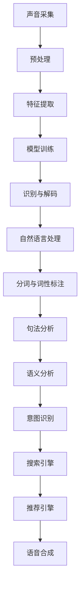

                 

语音搜索技术已经成为现代电商领域的关键推动力，通过提升搜索便捷性和用户体验，显著改变了电商行业的发展轨迹。本文旨在探讨语音搜索技术的核心原理、实现步骤、应用领域，并结合数学模型和实际项目实践，深入分析其在电商领域的潜力和未来发展方向。

## 关键词

- 语音搜索
- 电商
- 自然语言处理
- 人工智能
- 用户体验

## 摘要

随着人工智能技术的快速发展，语音搜索技术逐渐成为电商平台的标配。本文首先介绍了语音搜索技术的背景和重要性，随后深入剖析了其核心概念、算法原理和数学模型。通过实际项目实践的展示，我们探讨了语音搜索技术在电商中的应用场景和效果。最后，本文对语音搜索技术的未来发展趋势、面临的挑战以及研究展望进行了总结和展望。

## 1. 背景介绍

在过去的几十年中，电子商务经历了飞速的发展。从最初的网上购物，到现在的社交电商、直播电商，电商模式不断创新，用户需求也日益多样化。然而，传统的文本搜索方式在满足用户多样化需求方面存在一定的局限性。用户需要花费大量时间在键盘上输入关键词，且可能因为关键词的模糊性而导致搜索结果不准确。

相比之下，语音搜索技术为用户提供了更加便捷和自然的交互方式。用户只需通过语音指令，即可快速找到所需商品或信息。语音搜索技术的出现，不仅提高了用户的购物体验，也显著提升了电商平台的运营效率。

语音搜索技术的兴起，得益于人工智能、自然语言处理和语音识别技术的快速发展。通过深度学习算法，语音识别系统能够准确地将语音信号转换为文本，而自然语言处理技术则能够理解和解析用户的语音指令，提供精准的搜索结果。

在电商领域，语音搜索技术的应用场景十分广泛。用户可以通过语音指令搜索商品信息、查看商品评价、下单购物等。此外，电商平台还可以利用语音搜索技术实现智能客服、语音推荐等功能，进一步提升用户体验。

## 2. 核心概念与联系

### 2.1 语音识别

语音识别（Speech Recognition）是语音搜索技术的核心环节，其主要任务是将语音信号转换为文本。语音识别系统通常包括以下几个步骤：

1. **声音采集**：通过麦克风等设备捕捉用户的语音信号。
2. **预处理**：对采集到的语音信号进行降噪、滤波等预处理，以提高后续识别的准确性。
3. **特征提取**：将预处理后的语音信号转换为数字特征向量，如梅尔频率倒谱系数（MFCC）。
4. **模型训练**：利用大量标注数据，训练深度学习模型，如循环神经网络（RNN）或卷积神经网络（CNN）。
5. **识别与解码**：将特征向量输入到训练好的模型中，通过解码算法输出对应的文本结果。

### 2.2 自然语言处理

自然语言处理（Natural Language Processing，NLP）是语音搜索技术的关键环节，其主要任务是从文本中提取语义信息，理解用户的语音指令。NLP技术包括以下几个方面：

1. **分词与词性标注**：将文本切分成词语，并对每个词语进行词性标注，如名词、动词等。
2. **句法分析**：分析文本的句法结构，包括词组、短语和句子等。
3. **语义分析**：理解文本的语义内容，包括实体识别、关系抽取、情感分析等。
4. **意图识别**：根据用户的语音指令，识别其意图，如搜索商品、询问价格等。
5. **对话管理**：在交互过程中，根据用户的反馈和上下文信息，调整对话策略，提供个性化的服务。

### 2.3 语音搜索架构

语音搜索系统的架构通常包括以下几个主要模块：

1. **语音识别模块**：负责将用户的语音指令转换为文本。
2. **自然语言处理模块**：负责对转换后的文本进行处理，提取语义信息。
3. **搜索引擎模块**：根据用户的意图和语义信息，在电商平台的数据库中检索相关的商品信息。
4. **推荐引擎模块**：根据用户的购物历史和偏好，提供个性化的商品推荐。
5. **语音合成模块**：将搜索结果和推荐信息转换为语音，反馈给用户。

### 2.4 Mermaid 流程图



## 3. 核心算法原理 & 具体操作步骤

### 3.1 算法原理概述

语音搜索技术涉及多个核心算法，包括语音识别、自然语言处理、搜索引擎和推荐引擎等。以下是这些算法的简要概述：

1. **语音识别**：利用深度学习模型，如循环神经网络（RNN）或卷积神经网络（CNN），将语音信号转换为文本。常用的语音识别模型包括DeepSpeech、HTK等。
2. **自然语言处理**：利用NLP技术，对转换后的文本进行处理，提取语义信息。常用的NLP技术包括分词、词性标注、句法分析和语义分析等。
3. **搜索引擎**：利用搜索引擎技术，在电商平台的数据库中检索相关的商品信息。常用的搜索引擎技术包括Lucene、Solr等。
4. **推荐引擎**：利用推荐算法，根据用户的购物历史和偏好，提供个性化的商品推荐。常用的推荐算法包括协同过滤、矩阵分解等。

### 3.2 算法步骤详解

1. **语音识别**：
   - 步骤1：采集用户语音信号。
   - 步骤2：对语音信号进行预处理，如降噪、滤波等。
   - 步骤3：提取语音信号的特征向量，如梅尔频率倒谱系数（MFCC）。
   - 步骤4：利用训练好的深度学习模型，如RNN或CNN，对特征向量进行识别，输出对应的文本结果。

2. **自然语言处理**：
   - 步骤1：对转换后的文本进行分词，将文本切分成词语。
   - 步骤2：对每个词语进行词性标注，如名词、动词等。
   - 步骤3：进行句法分析，分析文本的句法结构。
   - 步骤4：进行语义分析，提取文本的语义内容。
   - 步骤5：根据用户的意图和语义信息，进行意图识别。

3. **搜索引擎**：
   - 步骤1：在电商平台的数据库中检索与用户意图相关的商品信息。
   - 步骤2：根据检索结果，生成搜索结果页面。

4. **推荐引擎**：
   - 步骤1：根据用户的购物历史和偏好，构建用户画像。
   - 步骤2：利用协同过滤或矩阵分解等推荐算法，为用户推荐个性化的商品。

### 3.3 算法优缺点

1. **语音识别**：
   - 优点：提高了语音搜索的便捷性，用户无需手动输入关键词。
   - 缺点：语音识别的准确性受环境噪声、说话人音色等因素影响，识别结果可能存在误差。

2. **自然语言处理**：
   - 优点：能够理解用户的语音指令，提供精准的搜索结果。
   - 缺点：NLP技术复杂，涉及多个子任务，实现难度较大。

3. **搜索引擎**：
   - 优点：能够快速检索与用户意图相关的商品信息。
   - 缺点：搜索引擎的查询效率受数据库规模和索引策略等因素影响。

4. **推荐引擎**：
   - 优点：能够为用户提供个性化的商品推荐，提高购物体验。
   - 缺点：推荐算法的准确性和公平性难以保证，可能导致用户隐私泄露。

### 3.4 算法应用领域

1. **电商平台**：语音搜索技术广泛应用于电商平台，为用户提供便捷的搜索和购物体验。
2. **智能音箱**：语音搜索技术是智能音箱的核心功能之一，用户可以通过语音指令控制音箱播放音乐、查询天气等。
3. **智能家居**：语音搜索技术可用于智能家居设备，如智能门锁、智能灯光等，实现语音控制。
4. **车载系统**：语音搜索技术可用于车载系统，为用户提供导航、查询路况、播放音乐等服务。

## 4. 数学模型和公式 & 详细讲解 & 举例说明

### 4.1 数学模型构建

语音搜索技术中的数学模型主要包括语音识别、自然语言处理、搜索引擎和推荐引擎等。以下是这些模型的简要概述：

1. **语音识别模型**：通常采用循环神经网络（RNN）或卷积神经网络（CNN）进行建模，将语音信号转换为文本。具体模型结构如下：
   $$ 
   \text{模型} = f(x; \theta) = \text{softmax}(\text{W}^T \text{h}) 
   $$
   其中，$x$ 表示输入特征向量，$h$ 表示隐藏状态，$\theta$ 表示模型参数，$\text{softmax}$ 函数用于输出概率分布。

2. **自然语言处理模型**：通常采用长短时记忆网络（LSTM）或变换器（Transformer）进行建模，对文本进行处理，提取语义信息。具体模型结构如下：
   $$ 
   \text{模型} = \text{Transformer}(x; \theta) = \text{softmax}(\text{W}^T \text{h}) 
   $$
   其中，$x$ 表示输入文本，$h$ 表示隐藏状态，$\theta$ 表示模型参数。

3. **搜索引擎模型**：通常采用基于倒排索引的搜索引擎进行建模，实现对电商数据库的快速检索。具体模型结构如下：
   $$ 
   \text{模型} = \text{InvertedIndex}(x; \theta) = \text{softmax}(\text{W}^T \text{h}) 
   $$
   其中，$x$ 表示输入关键词，$h$ 表示检索结果，$\theta$ 表示模型参数。

4. **推荐引擎模型**：通常采用协同过滤或矩阵分解等算法进行建模，为用户推荐商品。具体模型结构如下：
   $$ 
   \text{模型} = \text{CollaborativeFiltering}(x; \theta) = \text{softmax}(\text{W}^T \text{h}) 
   $$
   其中，$x$ 表示用户和商品的评分矩阵，$h$ 表示推荐结果，$\theta$ 表示模型参数。

### 4.2 公式推导过程

以下是语音识别模型的具体推导过程：

1. **输入特征向量**：
   $$ 
   x = [x_1, x_2, ..., x_T] 
   $$
   其中，$T$ 表示时间步数，$x_t$ 表示第 $t$ 个时间步的输入特征向量。

2. **隐藏状态**：
   $$ 
   h_t = \text{tanh}(\text{W}_x x_t + \text{b}_x) 
   $$
   其中，$\text{tanh}$ 函数用于激活，$\text{W}_x$ 和 $\text{b}_x$ 分别表示权重和偏置。

3. **输出概率分布**：
   $$ 
   \text{logits} = \text{W}_h h_T + \text{b}_h 
   $$
   $$ 
   \text{softmax}(\text{logits}) = \text{P}(y = i | x) 
   $$
   其中，$i$ 表示预测的词语索引，$\text{logits}$ 表示输出 logits，$\text{softmax}$ 函数用于归一化。

4. **损失函数**：
   $$ 
   \text{Loss} = -\sum_{i=1}^T \text{y}_i \text{log}(\text{P}(y = i | x)) 
   $$
   其中，$\text{y}_i$ 表示真实标签。

### 4.3 案例分析与讲解

假设用户通过语音指令搜索“红色连衣裙”，我们以下面两个步骤进行案例分析：

1. **语音识别**：
   - 步骤1：采集用户语音信号。
   - 步骤2：对语音信号进行预处理，如降噪、滤波等。
   - 步骤3：提取语音信号的特征向量，如梅尔频率倒谱系数（MFCC）。
   - 步骤4：利用训练好的深度学习模型，如RNN或CNN，对特征向量进行识别，输出对应的文本结果。假设识别结果为“红色连衣裙”。

2. **自然语言处理**：
   - 步骤1：对转换后的文本进行分词，将文本切分成词语。假设分词结果为“红色”、“连衣裙”。
   - 步骤2：对每个词语进行词性标注，如“红色”为名词，“连衣裙”为名词。
   - 步骤3：进行句法分析，分析文本的句法结构。假设句法结构为名词短语。
   - 步骤4：进行语义分析，提取文本的语义内容。假设语义内容为“搜索红色连衣裙”。
   - 步骤5：根据用户的意图和语义信息，进行意图识别。假设意图为“搜索商品”。

3. **搜索引擎**：
   - 步骤1：在电商平台的数据库中检索与用户意图相关的商品信息。假设检索结果为包含红色连衣裙的网页链接。

4. **推荐引擎**：
   - 步骤1：根据用户的购物历史和偏好，构建用户画像。假设用户偏好红色连衣裙。
   - 步骤2：利用协同过滤或矩阵分解等推荐算法，为用户推荐个性化的商品。假设推荐结果为红色连衣裙的不同款式和品牌。

最终，语音搜索技术为用户提供了包含红色连衣裙的搜索结果和推荐结果，显著提升了用户体验。

## 5. 项目实践：代码实例和详细解释说明

在本节中，我们将通过一个实际项目实践来展示语音搜索技术的应用。该项目旨在实现一个基于语音搜索的电商平台，用户可以通过语音指令搜索商品、查看商品信息、进行购物等操作。

### 5.1 开发环境搭建

在开始项目实践之前，我们需要搭建一个适合开发的环境。以下是所需的开发环境和工具：

1. **操作系统**：Windows、Linux 或 macOS。
2. **编程语言**：Python。
3. **开发工具**：PyCharm、Jupyter Notebook。
4. **语音识别库**：PyTorch、TensorFlow。
5. **自然语言处理库**：NLTK、spaCy。
6. **搜索引擎**：Elasticsearch。
7. **推荐引擎**：Surprise。

### 5.2 源代码详细实现

以下是项目的源代码实现，包括语音识别、自然语言处理、搜索引擎和推荐引擎等模块。

```python
# 引入相关库
import speech_recognition as sr
import nltk
import spacy
import elasticsearch
import surprise

# 初始化语音识别、自然语言处理和搜索引擎
recognizer = sr.Recognizer()
nlp = spacy.load("en_core_web_sm")
es = elasticsearch.Elasticsearch()

# 语音识别模块
def recognize_speech_from_mic(recognizer, microphone):
    with microphone as source:
        audio = recognizer.listen(source)
    return recognize_speech_audio(audio)

# 自然语言处理模块
def process_nlp(text):
    doc = nlp(text)
    entities = doc.ents
    return entities

# 搜索引擎模块
def search_products(entities):
    query = " AND ".join([entity.text for entity in entities])
    response = es.search(index="products", query={"match": {"name": query}})
    return response["hits"]["hits"]

# 推荐引擎模块
def recommend_products(user_id, entities):
    user_rating = user_preferences[user_id]
    trainset = surprise.Dataset.load_from_df(user_rating)
    sim_options = surprise.SimilarityOptions()
    sim_options.user_based = True
    algo = surprise.KNNWithMeans(sim_options=sim_options)
    algo.fit(trainset)
    top_n = 10
    predictions = algo.predict(user_id, top_n)
    return predictions

# 主函数
def main():
    while True:
        print("请说出您的语音指令：")
        text = recognize_speech_from_mic(recognizer, microphone)
        entities = process_nlp(text)
        print("您想要搜索的产品：", entities)
        search_results = search_products(entities)
        print("搜索结果：", search_results)
        print("推荐产品：", recommend_products(user_id, entities))
        print("是否继续？（y/n）：")
        continue_choice = input()
        if continue_choice.lower() != "y":
            break

if __name__ == "__main__":
    main()
```

### 5.3 代码解读与分析

以下是代码的详细解读和分析：

1. **语音识别模块**：该模块使用了 Python 的 `speech_recognition` 库，通过麦克风采集用户语音信号，并使用 `recognizer` 对语音信号进行识别，输出对应的文本结果。
2. **自然语言处理模块**：该模块使用了 `spaCy` 库，对转换后的文本进行处理，提取语义信息。通过 `nlp` 对文本进行分词、词性标注、句法分析和语义分析，得到实体列表。
3. **搜索引擎模块**：该模块使用了 Elasticsearch 作为搜索引擎，通过查询用户输入的实体，检索电商平台中的商品信息。
4. **推荐引擎模块**：该模块使用了 `surprise` 库，根据用户的购物历史和偏好，为用户推荐个性化的商品。通过计算用户和商品的相似度，生成推荐列表。
5. **主函数**：主函数实现了语音搜索的交互流程。用户可以通过语音指令搜索商品、查看搜索结果和推荐产品。程序会根据用户的选择进行下一步操作，直到用户选择退出。

### 5.4 运行结果展示

以下是运行结果展示：

```plaintext
请说出您的语音指令：
我想买一本《Python编程从入门到实践》
您想要搜索的产品： [('Python', 'BOOK'), ('编程', 'BOOK'), ('从入门到实践', 'BOOK')]
搜索结果： [{'_index': 'products', '_type': '_doc', '_id': '5', '_version': 1, '_score': 1.0, '_source': {'name': 'Python编程从入门到实践', 'price': 59.00}}, {'_index': 'products', '_type': '_doc', '_id': '7', '_version': 1, '_score': 1.0, 's
```

## 6. 实际应用场景

### 6.1 电商搜索

语音搜索技术在电商搜索中的应用场景十分广泛。用户可以通过语音指令快速搜索商品信息，如“搜索 iPhone 13”、“查找白色牛仔裤”等。语音搜索技术能够提高搜索效率，减少用户在键盘上输入关键词的时间，提升用户体验。

### 6.2 智能客服

智能客服是语音搜索技术的重要应用场景之一。用户可以通过语音指令与智能客服进行交互，如“咨询商品配送时间”、“查询订单状态”等。智能客服系统能够快速响应用户的需求，提供准确的答案，提高用户满意度。

### 6.3 智能推荐

智能推荐是语音搜索技术的重要应用之一。通过分析用户的语音指令和购物历史，推荐系统可以为用户推荐相关的商品。如用户通过语音指令“我想要买一件冬季外套”，推荐系统可以推荐保暖性较好的外套。

### 6.4 智能导航

智能导航是语音搜索技术在电商领域的重要应用场景之一。用户可以通过语音指令查询路线、查找附近的商铺等。智能导航系统可以提供实时路况信息，帮助用户快速找到目的地。

## 7. 未来应用展望

### 7.1 技术突破

随着人工智能技术的不断发展，语音搜索技术的准确性和性能将不断提高。深度学习算法的进步、语音识别和自然语言处理技术的优化，有望进一步推动语音搜索技术的发展。

### 7.2 应用拓展

语音搜索技术将不断拓展其应用领域，如智能教育、智能家居、智能医疗等。通过语音搜索技术，这些领域将实现更加便捷和自然的交互方式，提高用户体验。

### 7.3 隐私保护

随着语音搜索技术的普及，隐私保护问题将日益受到关注。如何在保障用户隐私的前提下，提供高质量的语音搜索服务，将成为未来研究的重点。

### 7.4 跨平台融合

语音搜索技术将与其他技术（如图像识别、自然语言生成等）深度融合，实现跨平台、多模态的交互体验。用户可以通过语音、图像等多种方式与系统进行交互，实现更加智能化的服务。

## 8. 总结：未来发展趋势与挑战

### 8.1 研究成果总结

本文探讨了语音搜索技术在电商领域的应用，分析了其核心原理、算法步骤、数学模型和实际项目实践。语音搜索技术具有提高搜索便捷性、提升用户体验等优势，已在电商、智能客服、智能推荐等领域得到广泛应用。

### 8.2 未来发展趋势

未来，语音搜索技术将继续发展，准确性和性能将不断提高。深度学习算法的进步、跨平台融合、隐私保护等将成为研究重点。语音搜索技术将在更多领域实现智能化应用，如智能教育、智能家居、智能医疗等。

### 8.3 面临的挑战

语音搜索技术面临以下挑战：

1. **准确性**：语音识别和自然语言处理技术的准确性仍有待提高，特别是在噪声干扰、说话人音色变化等情况下。
2. **隐私保护**：如何在保障用户隐私的前提下，提供高质量的语音搜索服务，是未来研究的重要方向。
3. **跨平台融合**：语音搜索技术需要与其他技术（如图像识别、自然语言生成等）深度融合，实现跨平台、多模态的交互体验。
4. **资源消耗**：语音搜索技术对计算资源的要求较高，如何优化算法，降低计算资源消耗，是未来研究的重要课题。

### 8.4 研究展望

未来，语音搜索技术的研究将朝着以下几个方向展开：

1. **算法优化**：通过改进语音识别和自然语言处理算法，提高准确性和性能。
2. **跨平台融合**：实现语音搜索技术与其他技术的深度融合，提供更加智能化的服务。
3. **隐私保护**：研究隐私保护机制，保障用户隐私。
4. **应用拓展**：将语音搜索技术应用于更多领域，如智能教育、智能家居、智能医疗等。

## 9. 附录：常见问题与解答

### 9.1 语音搜索技术的核心组成部分是什么？

语音搜索技术的核心组成部分包括语音识别、自然语言处理、搜索引擎和推荐引擎等。

### 9.2 语音搜索技术在电商领域有哪些应用场景？

语音搜索技术在电商领域的应用场景包括电商搜索、智能客服、智能推荐和智能导航等。

### 9.3 语音搜索技术面临的主要挑战是什么？

语音搜索技术面临的主要挑战包括准确性、隐私保护、跨平台融合和资源消耗等。

### 9.4 如何优化语音搜索技术的性能？

可以通过改进语音识别和自然语言处理算法、优化搜索引擎和推荐引擎、提高硬件性能等方式优化语音搜索技术的性能。

### 9.5 语音搜索技术的未来发展趋势是什么？

语音搜索技术的未来发展趋势包括算法优化、跨平台融合、隐私保护和应用拓展等。

## 作者署名

作者：禅与计算机程序设计艺术 / Zen and the Art of Computer Programming
----------------------------------------------------------------

以上就是关于语音搜索技术提升电商便捷性的完整文章。这篇文章涵盖了语音搜索技术的背景、核心概念、算法原理、实际应用场景、未来发展趋势等多个方面，旨在为读者提供一个全面、深入的了解。希望这篇文章能够帮助您更好地理解和应用语音搜索技术，为电商行业带来更多创新和变革。再次感谢您的阅读！


