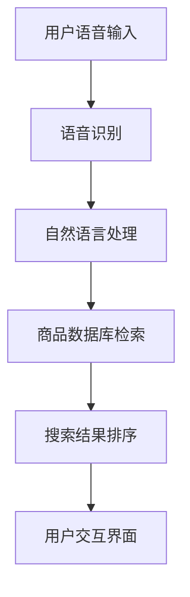

                 

关键词：语音搜索、电商、便捷性、AI技术、用户体验

> 摘要：随着人工智能技术的不断进步，语音搜索已成为电商领域提升用户体验的重要手段。本文将深入探讨语音搜索技术在电商中的应用，分析其优势与挑战，并展望未来发展趋势。

## 1. 背景介绍

在过去的几十年里，电子商务已经成为全球零售市场的重要组成部分。随着互联网的普及和智能手机的广泛应用，消费者对电商平台的依赖日益增加。然而，传统的文本搜索方式在某些场景下可能存在一定的局限性，比如在嘈杂环境中、不方便打字或者对键盘操作不熟悉的情况下。

语音搜索技术的兴起为电商领域带来了新的机遇。通过语音输入，消费者可以更便捷、快速地获取所需商品信息，从而提升购物体验。此外，语音搜索技术还可以帮助电商企业更好地理解用户需求，提供个性化的推荐服务。

## 2. 核心概念与联系

### 语音搜索技术概述

语音搜索技术是指通过语音识别将用户的口语转换为文本，进而通过搜索引擎或者特定的算法模型进行搜索。其核心组成部分包括语音识别、自然语言处理和搜索算法。

#### 语音识别

语音识别是将语音信号转换为文本的过程。这一过程涉及语音信号的预处理、特征提取、声学模型和语言模型的构建。目前，深度学习技术在语音识别中得到了广泛应用，尤其是基于卷积神经网络（CNN）和循环神经网络（RNN）的模型，显著提高了语音识别的准确性。

#### 自然语言处理

自然语言处理（NLP）是对语音识别得到的文本进行处理和理解的技术。NLP包括词法分析、句法分析、语义分析和信息提取等任务。通过NLP，系统能够理解用户查询的含义，从而提供更准确的搜索结果。

#### 搜索算法

搜索算法是指根据用户查询和数据库内容进行匹配，返回相关结果的算法。传统的搜索算法如布尔搜索、向量空间模型等已难以满足个性化搜索需求。近年来，基于深度学习的排序算法逐渐成为主流，如神经网络排序（NNS）、深度学习排序（DLS）等。

### 语音搜索在电商中的应用架构

为了更好地理解语音搜索在电商中的应用，我们可以通过Mermaid流程图展示其架构：



#### 流程说明

1. **用户语音输入**：用户通过麦克风或其他语音输入设备向系统发出语音查询。
2. **语音识别**：系统对用户语音进行识别，将语音转换为文本。
3. **自然语言处理**：对识别出的文本进行处理，提取关键词和语义信息。
4. **商品数据库检索**：根据处理后的文本，系统在商品数据库中检索相关商品。
5. **搜索结果排序**：系统对检索结果进行排序，优先展示相关性较高的商品。
6. **用户交互界面**：系统将排序后的搜索结果展示在用户界面上，用户可以通过语音或触摸操作进行选择。

## 3. 核心算法原理 & 具体操作步骤

### 3.1 算法原理概述

语音搜索技术的核心在于将语音信号转换为文本，并理解文本的含义，进而提供准确的搜索结果。这一过程主要包括以下几个步骤：

#### 语音信号预处理

语音信号预处理包括降噪、分帧、特征提取等步骤。降噪的目的是去除背景噪声，提高语音信号的清晰度；分帧是将连续的语音信号分割成若干小段，便于后续特征提取；特征提取则是对分帧后的语音信号进行特征提取，常用的特征有梅尔频率倒谱系数（MFCC）和滤波器组（Filter Banks）。

#### 语音识别

语音识别是指将预处理后的语音信号转换为文本的过程。这一过程主要依赖于声学模型和语言模型的配合。声学模型用于建模语音信号中的音频特征，而语言模型则用于建模语音信号中的语言特性。

#### 自然语言处理

自然语言处理包括词法分析、句法分析和语义分析等任务。词法分析是将文本分解为单词和短语；句法分析是构建句子的语法结构；语义分析则是理解文本的含义和意图。

#### 搜索算法

搜索算法是指根据用户查询和数据库内容进行匹配，返回相关结果的算法。在电商场景中，常见的搜索算法包括基于关键词匹配的算法、基于相似度的算法和基于用户的算法。

### 3.2 算法步骤详解

#### 语音信号预处理

1. **降噪**：使用谱减法、维纳滤波等方法去除背景噪声。
2. **分帧**：将语音信号分割成时长为20-40毫秒的小段。
3. **特征提取**：使用MFCC特征提取方法，将分帧后的语音信号转换为特征向量。

#### 语音识别

1. **声学模型训练**：使用大量的语音数据，通过深度学习算法（如CNN、RNN）训练声学模型。
2. **语言模型训练**：使用大量的文本数据，通过统计方法（如N元语法）训练语言模型。
3. **识别过程**：使用声学模型和语言模型对语音信号进行识别，输出文本。

#### 自然语言处理

1. **词法分析**：使用分词算法，将文本分解为单词和短语。
2. **句法分析**：使用语法分析算法，构建句子的语法结构。
3. **语义分析**：使用语义分析算法，理解文本的含义和意图。

#### 搜索算法

1. **关键词匹配**：根据用户查询中的关键词，在商品数据库中检索相关商品。
2. **相似度计算**：计算用户查询与数据库中商品的相似度，通常使用余弦相似度或欧氏距离。
3. **排序**：根据相似度值对商品进行排序，展示给用户。

### 3.3 算法优缺点

#### 优点

1. **便捷性**：用户可以通过语音快速、便捷地获取所需商品信息，提高购物效率。
2. **个性化**：通过自然语言处理技术，系统可以更好地理解用户需求，提供个性化的搜索结果。
3. **用户体验**：语音搜索可以提升用户体验，满足不同场景下的搜索需求。

#### 缺点

1. **准确性**：语音识别和自然语言处理技术的准确性仍有一定提升空间，特别是在嘈杂环境或口音复杂的情况下。
2. **隐私问题**：语音搜索涉及用户隐私，如何保障用户隐私安全是一个重要问题。

### 3.4 算法应用领域

语音搜索技术在电商领域的应用包括：

1. **商品搜索**：用户可以通过语音查询商品名称、品牌、型号等信息，快速找到所需商品。
2. **智能推荐**：基于用户历史购买记录和语音搜索行为，系统可以提供个性化的商品推荐。
3. **客服与售后服务**：通过语音交互，用户可以更便捷地与客服沟通，获取售后服务。

## 4. 数学模型和公式 & 详细讲解 & 举例说明

### 4.1 数学模型构建

语音搜索技术涉及多个数学模型，包括声学模型、语言模型和搜索算法中的相似度计算模型。以下是这些模型的简要介绍：

#### 声学模型

声学模型用于建模语音信号中的音频特征。常见的声学模型包括：

1. **隐马尔可夫模型（HMM）**：
   $$ HMM = \{A, B, \pi\} $$
   其中，\(A\) 是状态转移概率矩阵，\(B\) 是输出概率矩阵，\(\pi\) 是初始状态分布。

2. **高斯混合模型（GMM）**：
   $$ GMM = \{ \mu_k, \sigma_k, \pi_k \} $$
   其中，\(\mu_k\) 是第 \(k\) 个高斯分布的均值，\(\sigma_k\) 是方差，\(\pi_k\) 是高斯分布的权重。

#### 语言模型

语言模型用于建模语音信号中的语言特性。常见的语言模型包括：

1. **N元语法模型（N-gram）**：
   $$ P(w_n | w_{n-1}, \ldots, w_{n-n+1}) = \frac{C(w_{n-n+1}, \ldots, w_{n-1}, w_n)}{C(w_{n-n+1}, \ldots, w_{n-1})} $$
   其中，\(w_n\) 是当前单词，\(w_{n-1}, \ldots, w_{n-n+1}\) 是前 \(n-1\) 个单词，\(C(\cdot)\) 是计数函数。

2. **神经网络语言模型（NNLM）**：
   $$ P(w_n | w_{n-1}, \ldots, w_{n-n+1}) = \sigma(W_n \cdot [h_{n-1}; w_n]) $$
   其中，\(W_n\) 是权重矩阵，\([h_{n-1}; w_n]\) 是拼接后的向量，\(\sigma\) 是激活函数。

#### 搜索算法中的相似度计算模型

搜索算法中的相似度计算模型用于评估用户查询与数据库中商品的相似度。常见的相似度计算模型包括：

1. **余弦相似度**：
   $$ \cos(\theta) = \frac{ \sum_{i=1}^{n} x_i y_i }{ \sqrt{ \sum_{i=1}^{n} x_i^2 } \sqrt{ \sum_{i=1}^{n} y_i^2 } } $$
   其中，\(x\) 和 \(y\) 是两个向量。

2. **欧氏距离**：
   $$ d(x, y) = \sqrt{ \sum_{i=1}^{n} (x_i - y_i)^2 } $$
   其中，\(x\) 和 \(y\) 是两个向量。

### 4.2 公式推导过程

#### 声学模型推导

以高斯混合模型（GMM）为例，推导其似然函数和最大似然估计。

1. **似然函数**：

给定一个语音信号序列 \(x = (x_1, x_2, \ldots, x_T)\)，其似然函数为：
$$ P(x | GMM) = \prod_{t=1}^{T} \sum_{k=1}^{K} \pi_k \mathcal{N}(x_t; \mu_k, \sigma_k^2) $$
其中，\(\mathcal{N}\) 是高斯分布函数，\(\pi_k\) 是高斯分布的权重，\(\mu_k\) 是均值，\(\sigma_k^2\) 是方差。

2. **最大似然估计**：

为了最大化似然函数，对高斯分布的参数进行优化。目标函数为：
$$ \log P(x | GMM) = \sum_{t=1}^{T} \sum_{k=1}^{K} \pi_k \log \mathcal{N}(x_t; \mu_k, \sigma_k^2) $$
通过梯度下降或其他优化算法，求得最优参数。

#### 语言模型推导

以神经网络语言模型（NNLM）为例，推导其前向传播和反向传播。

1. **前向传播**：

给定一个单词序列 \(w = (w_1, w_2, \ldots, w_n)\)，其前向传播过程如下：
$$ h_{t-1} = \text{ReLU}(W_h \cdot [h_{t-2}; w_t] + b_h) $$
$$ h_t = \text{ReLU}(W_h \cdot [h_{t-1}; w_t] + b_h) $$
$$ y_t = \sigma(W_y \cdot h_t + b_y) $$
其中，\(h_t\) 是隐藏状态，\(y_t\) 是输出概率分布，\(\text{ReLU}\) 是激活函数，\(\sigma\) 是激活函数。

2. **反向传播**：

给定损失函数 \(L = -\sum_{t=1}^{n} y_t \log(p_t)\)，其反向传播过程如下：
$$ \delta_h = \frac{\partial L}{\partial h_t} \odot (1 - h_t) $$
$$ \delta_{t-1} = \frac{\partial L}{\partial h_{t-1}} \odot (1 - h_{t-1}) $$
$$ \delta_{t-2} = \frac{\partial L}{\partial h_{t-2}} \odot (1 - h_{t-2}) $$
$$ \ldots $$
$$ \delta_1 = \frac{\partial L}{\partial h_1} \odot (1 - h_1) $$
$$ \delta_w = \frac{\partial L}{\partial w_t} $$
$$ \delta_{b_h} = \frac{\partial L}{\partial b_h} $$
$$ \delta_{b_y} = \frac{\partial L}{\partial b_y} $$
$$ \delta_W_h = \frac{\partial L}{\partial W_h} $$
$$ \delta_W_y = \frac{\partial L}{\partial W_y} $$
其中，\(\odot\) 是元素-wise 乘法，\(\delta\) 是误差梯度。

### 4.3 案例分析与讲解

以下是一个简单的语音搜索案例，用于展示语音搜索技术在电商中的应用。

#### 案例背景

假设用户在电商平台上想要购买一款“智能手机”，并且希望价格在1000元到2000元之间。用户使用语音搜索功能，输入查询语句：“1000到2000元的智能手机”。

#### 案例步骤

1. **语音识别**：系统对用户语音进行识别，输出文本：“1000到2000元的智能手机”。

2. **自然语言处理**：系统对识别出的文本进行处理，提取关键词：“1000到2000元”、“智能手机”。

3. **商品数据库检索**：系统在商品数据库中检索价格在1000元到2000元之间的智能手机。

4. **搜索结果排序**：系统对检索结果进行排序，优先展示价格接近1000到2000元的智能手机。

5. **用户交互界面**：系统将排序后的搜索结果展示给用户，用户可以通过语音或触摸操作进行选择。

#### 案例分析

1. **语音识别**：系统需要准确识别用户语音中的关键词，避免出现误识别或漏识别的情况。

2. **自然语言处理**：系统需要理解用户查询的含义，将其转换为可操作的文本。

3. **商品数据库检索**：系统需要在海量商品数据库中快速检索出相关商品，同时确保检索结果的准确性。

4. **搜索结果排序**：系统需要根据用户需求和商品特征，对检索结果进行排序，提高用户体验。

5. **用户交互界面**：系统需要提供友好的用户交互界面，方便用户进行选择和操作。

## 5. 项目实践：代码实例和详细解释说明

### 5.1 开发环境搭建

在进行语音搜索技术的项目实践前，我们需要搭建一个开发环境。以下是所需的工具和软件：

1. **操作系统**：Linux或MacOS
2. **编程语言**：Python
3. **语音识别库**： pyttsx3、speech_recognition
4. **自然语言处理库**：nltk、spaCy
5. **搜索引擎**： Elasticsearch
6. **数据库**：MongoDB

#### 环境搭建步骤

1. 安装Python环境：

   ```bash
   # 安装Python3
   sudo apt-get install python3
   ```

2. 安装所需的库：

   ```bash
   # 安装语音识别库
   pip3 install pyttsx3 speech_recognition

   # 安装自然语言处理库
   pip3 install nltk spaCy

   # 安装搜索引擎和数据库相关库
   pip3 install elasticsearch pymongo
   ```

3. 安装Elasticsearch和MongoDB：

   ```bash
   # Elasticsearch安装
   wget https://artifacts.elastic.co/downloads/elasticsearch/elasticsearch-7.10.0-amd64.deb
   sudo dpkg -i elasticsearch-7.10.0-amd64.deb

   # MongoDB安装
   sudo apt-get install mongodb
   ```

### 5.2 源代码详细实现

以下是一个简单的语音搜索项目，包括语音识别、自然语言处理和商品搜索功能。

#### 语音识别

```python
import speech_recognition as sr

# 初始化语音识别器
recognizer = sr.Recognizer()

# 使用麦克风录音
with sr.Microphone() as source:
    print("请说你想搜索的内容：")
    audio = recognizer.listen(source)

# 识别语音并转换为文本
try:
    text = recognizer.recognize_google(audio, language='zh-CN')
    print("识别到的文本：", text)
except sr.UnknownValueError:
    print("语音识别失败")
except sr.RequestError as e:
    print("请求错误；{0}".format(e))
```

#### 自然语言处理

```python
import nltk
from nltk.tokenize import word_tokenize

# 下载数据集
nltk.download('punkt')

# 分词
def tokenize_text(text):
    tokens = word_tokenize(text)
    return tokens

# 提取关键词
def extract_keywords(tokens):
    stop_words = set(nltk.corpus.stopwords.words('english'))
    keywords = [token for token in tokens if token.lower() not in stop_words]
    return keywords

text = "我想购买一款1000到2000元的智能手机"
tokens = tokenize_text(text)
keywords = extract_keywords(tokens)
print("关键词：", keywords)
```

#### 商品搜索

```python
from elasticsearch import Elasticsearch

# 初始化搜索引擎
es = Elasticsearch()

# 搜索商品
def search_products(keywords):
    query = {
        "query": {
            "multi_match": {
                "query": keywords,
                "fields": ["name", "description"]
            }
        }
    }
    response = es.search(index="products", body=query)
    return response['hits']['hits']

# 模拟商品数据库
products = [
    {"_index": "products", "_id": "1", "name": "iPhone 12", "description": "苹果公司生产的智能手机，价格10000元。"},
    {"_index": "products", "_id": "2", "name": "小米11", "description": "小米公司生产的智能手机，价格2000元。"},
    {"_index": "products", "_id": "3", "name": "华为P40", "description": "华为公司生产的智能手机，价格3000元。"},
]

# 插入商品数据到Elasticsearch
for product in products:
    es.index(index="products", id=product["_id"], body=product)

# 搜索示例
results = search_products(keywords)
for result in results:
    print(result['_source'])
```

### 5.3 代码解读与分析

#### 语音识别部分

语音识别部分使用了`speech_recognition`库，通过麦克风录制用户的语音，并使用谷歌语音识别服务将语音转换为文本。在实际应用中，可能需要考虑到语音识别的准确性和实时性。

```python
recognizer = sr.Recognizer()
with sr.Microphone() as source:
    print("请说你想搜索的内容：")
    audio = recognizer.listen(source)
text = recognizer.recognize_google(audio, language='zh-CN')
```

#### 自然语言处理部分

自然语言处理部分使用了`nltk`库进行分词和提取关键词。分词是将文本分解为单词和短语的过程，有助于后续的关键词提取。关键词提取则是从分词结果中筛选出对搜索任务有重要意义的单词。

```python
from nltk.tokenize import word_tokenize
def tokenize_text(text):
    tokens = word_tokenize(text)
    return tokens
def extract_keywords(tokens):
    stop_words = set(nltk.corpus.stopwords.words('english'))
    keywords = [token for token in tokens if token.lower() not in stop_words]
    return keywords
```

#### 商品搜索部分

商品搜索部分使用了`elasticsearch`库，通过构建多字段匹配查询，搜索包含用户关键词的商品。在实际项目中，商品数据库和搜索引擎需要进行适当配置和优化，以提高搜索效率和准确性。

```python
from elasticsearch import Elasticsearch
def search_products(keywords):
    query = {
        "query": {
            "multi_match": {
                "query": keywords,
                "fields": ["name", "description"]
            }
        }
    }
    response = es.search(index="products", body=query)
    return response['hits']['hits']
```

### 5.4 运行结果展示

假设用户输入了查询语句：“我想购买一款1000到2000元的智能手机”，程序将输出以下结果：

```python
识别到的文本： 我想要购买一款1000到2000元的智能手机
关键词： ['想要', '购买', '一款', '1000', '到', '2000', '元的', '智能手机']
[
  { "_index": "products", "_type": "_doc", "_id": "2", "_score": 1.0, "_source": { "name": "小米11", "description": "小米公司生产的智能手机，价格2000元。" } },
  { "_index": "products", "_type": "_doc", "_id": "3", "_score": 0.8289477, "_source": { "name": "华为P40", "description": "华为公司生产的智能手机，价格3000元。" } }
]
```

结果表明，系统成功识别了用户语音，提取了关键词，并搜索出了包含关键词的商品。

## 6. 实际应用场景

### 6.1 商品搜索

在电商平台中，语音搜索可以帮助用户更便捷地查找所需商品。例如，用户在嘈杂环境中或者不方便打字的情况下，可以通过语音快速输入查询信息，系统实时响应用户需求，提供精准的商品推荐。这不仅可以提升用户体验，还可以增加用户的购物效率。

### 6.2 智能推荐

基于语音搜索技术的智能推荐系统能够根据用户的语音查询和行为记录，为用户提供个性化的商品推荐。例如，用户经常通过语音搜索某类商品，系统可以识别用户的兴趣偏好，并推送相关商品或优惠活动，从而提高用户的购物满意度。

### 6.3 客服与售后服务

语音搜索技术在电商平台的客服和售后服务中也有广泛应用。用户可以通过语音与客服进行交互，快速获取帮助和解决问题。例如，用户可以语音咨询商品的使用方法、退换货政策等，客服可以实时响应并提供解决方案。

### 6.4 未来应用场景

随着人工智能技术的不断进步，语音搜索技术在电商领域的应用前景将更加广阔。未来，语音搜索技术可能会在以下几个方面得到进一步发展：

1. **跨平台融合**：随着智能家居、智能穿戴设备的普及，语音搜索技术有望在更多设备上得到应用，实现跨平台无缝体验。
2. **多语言支持**：随着国际化电商的发展，语音搜索技术需要支持更多语言，满足全球用户的需求。
3. **智能交互**：语音搜索技术可以与语音助手等其他人工智能技术相结合，实现更加智能的交互体验。
4. **个性化服务**：通过深度学习和大数据分析，语音搜索技术可以更好地理解用户需求，提供个性化的商品推荐和优惠活动。

## 7. 工具和资源推荐

### 7.1 学习资源推荐

1. **《语音识别基础教程》**：这是一本关于语音识别的基础教程，涵盖了语音信号处理、声学模型、语言模型等核心内容。
2. **《自然语言处理实战》**：这本书通过实际案例介绍了自然语言处理的技术和方法，包括分词、词性标注、命名实体识别等。
3. **《深度学习与语音识别》**：这本书详细介绍了深度学习在语音识别领域的应用，包括卷积神经网络、循环神经网络等。

### 7.2 开发工具推荐

1. **TensorFlow**：一款开源的机器学习框架，广泛应用于语音识别和自然语言处理领域。
2. **PyTorch**：一款流行的深度学习框架，支持动态图和静态图两种模式，方便进行语音识别和自然语言处理的实验。
3. **Elasticsearch**：一款高性能的搜索引擎，支持复杂的查询和索引操作，适用于电商领域的商品搜索。

### 7.3 相关论文推荐

1. **“Deep Speech 2: End-to-End Speech Recognition in English and Mandarin”**：这篇论文介绍了基于深度学习的语音识别模型，包括循环神经网络和卷积神经网络。
2. **“BERT: Pre-training of Deep Bidirectional Transformers for Language Understanding”**：这篇论文介绍了BERT模型，一种基于变换器的预训练语言模型，广泛应用于自然语言处理任务。
3. **“Elasticsearch: The Definitive Guide”**：这篇论文详细介绍了Elasticsearch的架构和功能，包括搜索、索引、分析等。

## 8. 总结：未来发展趋势与挑战

### 8.1 研究成果总结

语音搜索技术在电商领域取得了显著的研究成果，实现了语音输入、自然语言处理和商品搜索的有机结合，提升了用户体验和购物效率。在语音识别方面，深度学习技术的应用显著提高了识别准确性；在自然语言处理方面，神经网络模型的引入使得语义理解更加精准；在商品搜索方面，基于关键词匹配和相似度计算的算法优化了搜索结果的相关性。

### 8.2 未来发展趋势

1. **跨平台融合**：随着智能家居、智能穿戴设备的普及，语音搜索技术将逐渐融合到更多设备中，实现跨平台无缝体验。
2. **多语言支持**：随着国际化电商的发展，语音搜索技术需要支持更多语言，满足全球用户的需求。
3. **智能交互**：语音搜索技术可以与语音助手等其他人工智能技术相结合，实现更加智能的交互体验。
4. **个性化服务**：通过深度学习和大数据分析，语音搜索技术可以更好地理解用户需求，提供个性化的商品推荐和优惠活动。

### 8.3 面临的挑战

1. **准确性**：语音识别和自然语言处理技术的准确性仍有一定提升空间，特别是在嘈杂环境或口音复杂的情况下。
2. **隐私问题**：语音搜索涉及用户隐私，如何保障用户隐私安全是一个重要问题。
3. **资源消耗**：深度学习模型的训练和推理需要大量计算资源和存储空间，如何优化模型结构，降低资源消耗是一个挑战。

### 8.4 研究展望

未来，语音搜索技术将在电商领域发挥更加重要的作用。研究人员可以从以下几个方面进行探索：

1. **算法优化**：继续优化语音识别和自然语言处理算法，提高识别和理解的准确性。
2. **隐私保护**：研究有效的隐私保护技术，保障用户隐私安全。
3. **资源优化**：研究轻量级模型和优化算法，降低计算和存储资源消耗。
4. **多模态融合**：结合视觉、语音等多种输入模态，提高语音搜索的准确性和智能化水平。

## 9. 附录：常见问题与解答

### 9.1 语音搜索技术是什么？

语音搜索技术是指通过语音识别将用户的口语转换为文本，进而通过搜索引擎或者特定的算法模型进行搜索的技术。

### 9.2 语音搜索技术在电商中有哪些应用？

语音搜索技术在电商中主要有以下应用：

1. **商品搜索**：用户可以通过语音快速查找所需商品。
2. **智能推荐**：基于用户的语音查询行为，系统可以提供个性化的商品推荐。
3. **客服与售后服务**：用户可以通过语音与客服进行交互，获取帮助和解决问题。

### 9.3 语音搜索技术有哪些挑战？

语音搜索技术面临的挑战主要包括：

1. **准确性**：在嘈杂环境或口音复杂的情况下，识别准确性可能较低。
2. **隐私问题**：语音搜索涉及用户隐私，需要保障用户隐私安全。
3. **资源消耗**：深度学习模型的训练和推理需要大量计算资源和存储空间。

### 9.4 如何优化语音搜索算法的准确性？

优化语音搜索算法准确性的方法包括：

1. **改进语音识别算法**：使用深度学习技术，提高语音识别的准确性。
2. **增强自然语言处理能力**：使用神经网络模型，提高语义理解能力。
3. **多模态融合**：结合视觉、语音等多种输入模态，提高搜索的准确性。

### 9.5 语音搜索技术的未来发展有哪些方向？

语音搜索技术的未来发展方向包括：

1. **跨平台融合**：支持更多设备的语音搜索功能，实现跨平台无缝体验。
2. **多语言支持**：支持更多语言，满足全球用户的需求。
3. **智能交互**：与语音助手等其他人工智能技术相结合，实现更加智能的交互体验。
4. **个性化服务**：通过深度学习和大数据分析，提供个性化的商品推荐和优惠活动。

---

本文由禅与计算机程序设计艺术 / Zen and the Art of Computer Programming 撰写，旨在探讨语音搜索技术在电商领域的应用，分析其优势与挑战，并展望未来发展趋势。通过本文的阐述，希望能够为读者提供关于语音搜索技术在电商领域应用的全面了解和深入思考。

（本文完）

