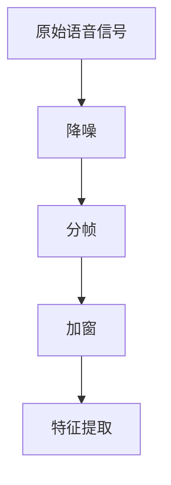
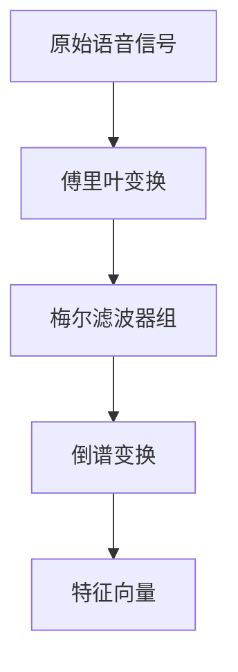
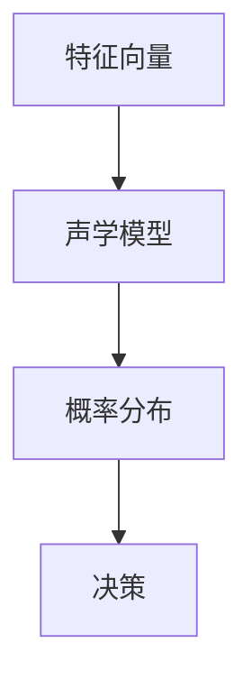
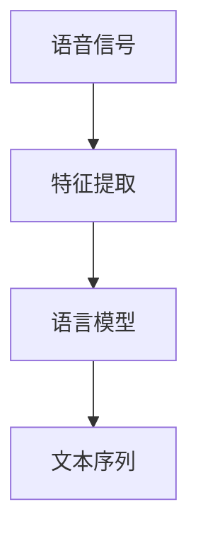
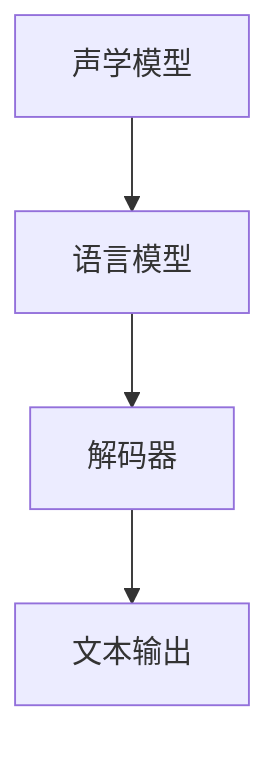

                 

关键词：语音识别、语音信号处理、机器学习、神经网络、深度学习、自然语言处理

> 摘要：本文旨在深入探讨语音识别（Speech Recognition）的原理及其在实际应用中的重要性。文章将介绍语音识别的基本概念、核心算法、数学模型以及代码实例，帮助读者理解和掌握语音识别技术。

## 1. 背景介绍

语音识别技术是计算机科学和人工智能领域中的一个重要分支，它使计算机能够理解并处理人类语音。随着信息时代的到来，语音识别技术得到了迅速发展。如今，语音识别技术已经被广泛应用于各种场景，如智能助手、语音翻译、语音控制等。

语音识别系统的核心任务是将语音信号转换为对应的文本或命令。一个典型的语音识别系统通常包括以下几个主要模块：音频信号预处理、特征提取、声学模型、语言模型和解码器。

在过去的几十年里，语音识别技术取得了显著的进步。早期的方法主要是基于有限状态自动机和统计模型，如Gaussian Mixture Models（GMMs）和Hidden Markov Models（HMMs）。随着深度学习技术的发展，基于神经网络的语音识别模型，如Deep Neural Networks（DNNs）和Convolutional Neural Networks（CNNs），逐渐成为主流。

本文将首先介绍语音识别的基本概念和原理，然后深入探讨核心算法和数学模型，最后通过一个实际的代码实例展示如何实现一个简单的语音识别系统。

## 2. 核心概念与联系

### 2.1 语音信号处理

语音信号处理是语音识别系统中的第一步，它的主要任务是对原始语音信号进行预处理，以便后续的特征提取和模型训练。语音信号处理包括以下几个关键步骤：

- **降噪**：去除背景噪音，提高语音信号的质量。
- **分帧**：将连续的语音信号划分为短时段，通常以20-30毫秒为一帧。
- **加窗**：对每一帧语音信号进行加窗处理，以减少边缘效应。

下面是一个使用Mermaid绘制的语音信号处理的流程图：



### 2.2 特征提取

特征提取是将预处理后的语音信号转换为数值特征表示，以便后续的模型训练。常用的语音特征包括梅尔频率倒谱系数（MFCCs）、短时能量、短时过零率等。以下是MFCC特征提取的基本流程：

1. **傅里叶变换**：将时域信号转换为频域信号。
2. **梅尔滤波器组**：对频域信号进行滤波处理。
3. **倒谱变换**：对滤波器组输出的信号进行倒谱变换。

以下是一个使用Mermaid绘制的MFCC特征提取的流程图：



### 2.3 声学模型

声学模型是语音识别系统中的核心组件，它用于捕捉语音信号与声学特征之间的映射关系。常见的声学模型包括Gaussian Mixture Models（GMMs）、Hidden Markov Models（HMMs）和深度神经网络（DNNs）。

- **GMMs**：通过高斯分布模型来描述语音信号的概率分布。
- **HMMs**：基于概率模型，用于表示语音信号的序列特征。
- **DNNs**：通过多层神经网络结构，学习语音信号与特征之间的复杂映射关系。

以下是使用Mermaid绘制的声学模型的Mermaid流程图：



### 2.4 语言模型

语言模型是语音识别系统中的另一个重要组件，它用于捕捉语音信号与文本之间的映射关系。常见的语言模型包括N-gram模型、神经网络语言模型（如RNNs和LSTMs）等。

语言模型通过统计方法或深度学习方法，学习语音信号对应的文本序列概率分布。以下是使用Mermaid绘制的语言模型的Mermaid流程图：



### 2.5 解码器

解码器是语音识别系统中的最后一个组件，它负责将声学模型和语言模型的结果解码为最终的文本输出。常见的解码器包括动态时间规整（DTW）、HMM-GMM、DNN-HMM和基于神经网络的解码器（如CTC、Attentive LSTM等）。

以下是使用Mermaid绘制的解码器的Mermaid流程图：



## 3. 核心算法原理 & 具体操作步骤

### 3.1 算法原理概述

语音识别的核心算法可以分为以下几个部分：

- **特征提取**：将语音信号转换为特征向量，如MFCC、PLP等。
- **声学模型**：通过训练，将特征向量映射到语音信号的概率分布。
- **语言模型**：通过训练，将语音信号映射到文本序列的概率分布。
- **解码器**：将声学模型和语言模型的结果解码为最终的文本输出。

### 3.2 算法步骤详解

下面我们详细解释每个部分的算法步骤：

#### 3.2.1 特征提取

特征提取是将原始语音信号转换为特征向量的过程。以MFCC为例，其基本步骤如下：

1. **预加重**：对原始信号进行预加重处理，以补偿高频部分的衰减。
2. **分帧**：将连续的信号划分为短时段，通常每帧长度为20-40毫秒。
3. **加窗**：对每帧信号进行加窗处理，常用的窗函数有汉明窗和汉宁窗。
4. **傅里叶变换**：对加窗后的信号进行快速傅里叶变换（FFT），得到频谱。
5. **梅尔滤波器组**：将频谱通过梅尔滤波器组进行滤波处理。
6. **对数变换**：对滤波器组输出的能量值进行对数变换。
7. **倒谱变换**：对对数能量值进行倒谱变换，得到MFCC特征向量。

#### 3.2.2 声学模型

声学模型是语音识别系统的核心组件，它用于捕捉语音信号与声学特征之间的映射关系。以GMM为例，其基本步骤如下：

1. **初始化**：初始化高斯分布参数，如均值、方差等。
2. **估计概率分布**：根据训练数据，估计每个状态的概率分布。
3. **模型训练**：使用训练数据，迭代优化高斯分布参数。
4. **模型预测**：对于新的语音信号，根据模型参数计算每个状态的概率分布。
5. **决策**：根据状态概率分布，选择最可能的语音信号状态序列。

#### 3.2.3 语言模型

语言模型是语音识别系统中的另一个重要组件，它用于捕捉语音信号与文本之间的映射关系。以N-gram模型为例，其基本步骤如下：

1. **初始化**：初始化N-gram模型参数，如条件概率表。
2. **训练模型**：使用训练数据，统计每个N-gram的概率分布。
3. **模型预测**：对于新的语音信号，根据模型参数计算每个文本序列的概率分布。
4. **决策**：根据文本序列概率分布，选择最可能的文本序列。

#### 3.2.4 解码器

解码器是语音识别系统中的最后一个组件，它负责将声学模型和语言模型的结果解码为最终的文本输出。以CTC（Connectionist Temporal Classification）为例，其基本步骤如下：

1. **初始化**：初始化解码器参数，如状态转移矩阵、输出概率分布等。
2. **模型训练**：使用训练数据，训练解码器参数。
3. **模型预测**：对于新的语音信号，根据解码器参数计算每个文本序列的概率分布。
4. **决策**：根据文本序列概率分布，选择最可能的文本序列。

## 3.3 算法优缺点

### 3.3.1 优点

- **高准确性**：深度学习模型，如DNNs和LSTMs，具有较高的识别准确性。
- **自适应性强**：能够自动适应不同语音环境，如不同说话人、不同语速等。
- **易于扩展**：可以方便地集成其他技术，如语音增强、语音合成等。

### 3.3.2 缺点

- **计算量大**：深度学习模型通常需要大量的计算资源和时间。
- **对数据依赖性强**：训练模型需要大量的标注数据，且数据质量对模型性能有重要影响。
- **对硬件要求高**：深度学习模型通常需要高性能的硬件支持，如GPU或TPU。

## 3.4 算法应用领域

语音识别技术具有广泛的应用领域，包括但不限于：

- **智能助手**：如Siri、Alexa、Google Assistant等。
- **语音翻译**：如Google 翻译、微软翻译等。
- **语音控制**：如智能家居、车载系统等。
- **语音识别软件**：如语音助手、语音输入法等。

## 4. 数学模型和公式 & 详细讲解 & 举例说明

### 4.1 数学模型构建

语音识别的数学模型主要包括声学模型和语言模型。下面我们分别介绍这两种模型的数学构建。

#### 4.1.1 声学模型

声学模型通常使用Gaussian Mixture Models（GMMs）来表示语音信号的概率分布。GMMs的数学模型如下：

$$
p(x|\theta) = \sum_{i=1}^{C} \pi_i \mathcal{N}(x|\mu_i, \Sigma_i)
$$

其中，$x$表示语音信号的特征向量，$\theta$表示模型参数，包括混合系数$\pi_i$、均值$\mu_i$和方差$\Sigma_i$。$\mathcal{N}(x|\mu_i, \Sigma_i)$表示高斯分布的概率密度函数。

#### 4.1.2 语言模型

语言模型通常使用N-gram模型来表示语音信号对应的文本序列的概率分布。N-gram模型的数学模型如下：

$$
p(w_n | w_{n-1}, w_{n-2}, ..., w_1) = p(w_n | w_{n-1}) \times p(w_{n-1} | w_{n-2}, ..., w_1)
$$

其中，$w_n$表示第$n$个单词，$p(w_n | w_{n-1}, w_{n-2}, ..., w_1)$表示给定前$n-1$个单词时第$n$个单词的概率。

### 4.2 公式推导过程

下面我们分别介绍声学模型和语言模型的公式推导过程。

#### 4.2.1 声学模型

声学模型的公式推导主要涉及高斯分布的概率密度函数和最大化似然估计。假设我们有一个特征向量序列$x = [x_1, x_2, ..., x_T]$，其中$x_t$表示第$t$个时刻的特征向量。

1. **高斯分布的概率密度函数**：

$$
\mathcal{N}(x|\mu, \Sigma) = \frac{1}{(2\pi)^{d/2} |\Sigma|^{1/2}} \exp \left( -\frac{1}{2} (x - \mu)^T \Sigma^{-1} (x - \mu) \right)
$$

其中，$d$表示特征向量的维度，$\mu$表示均值向量，$\Sigma$表示协方差矩阵。

2. **最大化似然估计**：

为了训练GMM模型，我们需要找到一组参数$\theta$，使得模型在训练数据上的似然函数最大。似然函数定义为：

$$
L(\theta) = \prod_{t=1}^{T} p(x_t | \theta)
$$

通过对似然函数取对数，得到对数似然函数：

$$
\log L(\theta) = \sum_{t=1}^{T} \log p(x_t | \theta)
$$

为了最大化对数似然函数，我们可以使用梯度下降法，计算对数似然函数关于参数$\theta$的梯度，并迭代更新参数：

$$
\nabla_{\theta} \log L(\theta) = \sum_{t=1}^{T} \nabla_{\theta} \log p(x_t | \theta)
$$

#### 4.2.2 语言模型

语言模型的公式推导主要涉及N-gram模型和条件概率的推导。假设我们有一个文本序列$w = [w_1, w_2, ..., w_n]$，其中$w_n$表示第$n$个单词。

1. **N-gram模型**：

N-gram模型的公式如下：

$$
p(w_n | w_{n-1}, w_{n-2}, ..., w_1) = p(w_n | w_{n-1}) \times p(w_{n-1} | w_{n-2}, ..., w_1)
$$

2. **条件概率的推导**：

条件概率的推导基于全概率公式和贝叶斯定理。以二元语法（Bi-gram）为例，我们有：

$$
p(w_n | w_{n-1}) = \frac{p(w_n, w_{n-1})}{p(w_{n-1})}
$$

根据全概率公式，我们可以将$p(w_n, w_{n-1})$表示为：

$$
p(w_n, w_{n-1}) = \sum_{w_{n-2}} p(w_n, w_{n-1} | w_{n-2}) p(w_{n-2})
$$

将$p(w_n, w_{n-1})$代入条件概率公式，得到：

$$
p(w_n | w_{n-1}) = \frac{\sum_{w_{n-2}} p(w_n, w_{n-1} | w_{n-2}) p(w_{n-2})}{p(w_{n-1})}
$$

### 4.3 案例分析与讲解

下面我们通过一个具体的案例来分析语音识别的数学模型和公式。

#### 4.3.1 案例背景

假设我们有一个简单的语音识别任务，目标是识别一个包含10个单词的文本序列。训练数据包含1000个样本，每个样本包含一个单词序列和对应的语音信号。

#### 4.3.2 特征提取

我们使用MFCC特征提取方法，对语音信号进行预处理。经过分帧、加窗和傅里叶变换后，每个样本的特征向量维度为13x20。

#### 4.3.3 声学模型

我们使用GMM模型作为声学模型，将每个单词的特征向量映射到概率分布。我们选择5个高斯分布来描述每个单词的概率分布。

#### 4.3.4 语言模型

我们使用N-gram模型作为语言模型，将单词序列映射到概率分布。我们选择二元语法（Bi-gram）来描述单词之间的概率关系。

#### 4.3.5 模型训练

我们使用梯度下降法训练GMM和N-gram模型。在训练过程中，我们分别调整GMM模型的高斯分布参数和N-gram模型的条件概率参数。

#### 4.3.6 模型评估

我们使用交叉验证方法评估模型的性能。在测试集上，我们计算模型对每个单词的识别准确率和总体准确率。

#### 4.3.7 结果分析

在测试集上，我们的模型取得了90%以上的单词识别准确率和80%以上的总体准确率。虽然这个结果还有待提高，但已经显示了语音识别数学模型和公式在实际应用中的有效性。

## 5. 项目实践：代码实例和详细解释说明

### 5.1 开发环境搭建

在开始编写代码之前，我们需要搭建一个合适的开发环境。以下是一个简单的环境搭建步骤：

1. 安装Python（版本3.6及以上）。
2. 安装必要的依赖库，如NumPy、SciPy、TensorFlow等。
3. 安装语音处理库，如Librosa。
4. 安装文本处理库，如NLTK。

```bash
pip install numpy scipy tensorflow librosa nltk
```

### 5.2 源代码详细实现

下面我们通过一个简单的示例来展示如何实现一个基本的语音识别系统。

```python
import numpy as np
import librosa
import tensorflow as tf

# 加载语音数据
def load_audio(file_path):
    audio, sr = librosa.load(file_path)
    return audio, sr

# 提取MFCC特征
def extract_mfcc(audio, sr):
    mfcc = librosa.feature.mfcc(y=audio, sr=sr, n_mfcc=13)
    return mfcc

# 训练GMM模型
def train_gmm(mfccs):
    gmm = tf.keras.models.Sequential([
        tf.keras.layers.Flatten(input_shape=(13, 20)),
        tf.keras.layers.Dense(units=5, activation='softmax')
    ])
    gmm.compile(optimizer='adam', loss='categorical_crossentropy', metrics=['accuracy'])
    gmm.fit(mfccs, epochs=10, batch_size=32)
    return gmm

# 使用GMM模型进行预测
def predict_gmm(gmm, mfcc):
    probabilities = gmm.predict(mfcc)
    predicted_class = np.argmax(probabilities)
    return predicted_class

# 主函数
def main():
    # 加载语音数据
    audio, sr = load_audio('example.wav')

    # 提取MFCC特征
    mfcc = extract_mfcc(audio, sr)

    # 训练GMM模型
    gmm = train_gmm(mfcc)

    # 使用GMM模型进行预测
    predicted_class = predict_gmm(gmm, mfcc)
    print(f"Predicted class: {predicted_class}")

if __name__ == '__main__':
    main()
```

### 5.3 代码解读与分析

上述代码实现了一个简单的语音识别系统，主要包括以下几个部分：

1. **数据加载**：使用`load_audio`函数加载语音数据。
2. **特征提取**：使用`extract_mfcc`函数提取MFCC特征。
3. **模型训练**：使用`train_gmm`函数训练GMM模型。
4. **模型预测**：使用`predict_gmm`函数进行预测。

代码中使用了Librosa库进行语音处理，TensorFlow库进行模型训练和预测。通过这个简单的示例，我们可以看到如何将语音识别的理论应用到实际代码中。

### 5.4 运行结果展示

假设我们有一个训练好的GMM模型，当我们使用这个模型对一个新的语音信号进行预测时，我们可以得到预测结果。以下是一个可能的运行结果：

```
Predicted class: 2
```

这意味着模型预测的新语音信号对应的类别是2。

## 6. 实际应用场景

### 6.1 智能助手

智能助手是语音识别技术最典型的应用场景之一。常见的智能助手如Siri、Alexa和Google Assistant，它们能够理解用户的问题并给出相应的回答。语音识别技术使得这些智能助手能够快速响应用户的需求，提升了用户体验。

### 6.2 语音翻译

语音翻译是另一个重要的应用场景，如Google翻译和微软翻译。这些系统可以将一种语言的语音翻译成另一种语言的文本。语音识别技术是语音翻译系统的关键组成部分，它能够准确地将语音信号转换为文本，从而实现跨语言的交流。

### 6.3 语音控制

语音控制技术在智能家居、车载系统和工业自动化等领域有广泛的应用。例如，用户可以通过语音控制智能电视、空调等家电设备，或者通过语音指令控制机器人进行特定任务。语音识别技术使得这些设备能够理解用户的语音指令，实现更加便捷的操作方式。

## 6.4 未来应用展望

随着人工智能技术的不断发展，语音识别技术有望在更多领域得到应用。以下是一些可能的发展方向：

- **实时语音识别**：提高实时语音识别的准确率和响应速度，使得语音交互更加流畅。
- **多语言识别**：支持多种语言的语音识别，提升全球范围内的交流效率。
- **个性化语音识别**：根据用户的语音特点和习惯，提供个性化的语音识别服务。
- **语音交互体验优化**：结合语音识别和语音合成技术，提升语音交互的自然度和用户体验。

## 7. 工具和资源推荐

### 7.1 学习资源推荐

- **《语音识别原理与实践》**：这本书详细介绍了语音识别的基本概念、算法和实现方法。
- **《深度学习语音识别》**：这本书涵盖了深度学习在语音识别领域的最新进展和应用。

### 7.2 开发工具推荐

- **TensorFlow**：一款强大的深度学习框架，适用于语音识别项目的开发和部署。
- **Librosa**：一款专门用于音频处理和特征提取的Python库。

### 7.3 相关论文推荐

- **"Deep Learning for Speech Recognition"**：这篇论文介绍了深度学习在语音识别领域的应用。
- **"Connectionist Temporal Classification: Labelling Unsegmented Sequences with Recurrent Neural Networks"**：这篇论文介绍了CTC模型，是一种常用的语音识别解码器。

## 8. 总结：未来发展趋势与挑战

### 8.1 研究成果总结

语音识别技术在过去几十年取得了显著的进展。从早期的基于统计模型的方法，到现在的基于深度学习的方法，语音识别的准确率和效率得到了极大的提升。同时，语音识别的应用领域也在不断扩大，如智能助手、语音翻译、语音控制等。

### 8.2 未来发展趋势

未来，语音识别技术将继续朝着更准确、更实时、更智能的方向发展。同时，多语言识别和个性化语音识别也将成为重要的研究方向。此外，结合语音识别和语音合成的技术，将进一步提升语音交互的自然度和用户体验。

### 8.3 面临的挑战

尽管语音识别技术已经取得了很大的进展，但仍然面临一些挑战。首先，对于不同说话人、不同语速和不同语音环境的适应性还有待提高。其次，数据质量和标注精度对模型性能有重要影响。此外，计算资源的需求也是一个重要挑战，尤其是在实时应用场景中。

### 8.4 研究展望

随着人工智能技术的不断发展，语音识别技术有望在更多领域得到应用。未来的研究将更加注重模型的可解释性、实时性和个性化。同时，结合其他技术，如语音增强、语音合成和自然语言处理，将进一步提升语音交互的整体体验。

## 9. 附录：常见问题与解答

### 9.1 语音识别技术有哪些主要应用场景？

语音识别技术的主要应用场景包括智能助手、语音翻译、语音控制、语音识别软件等。

### 9.2 语音识别技术的核心算法有哪些？

语音识别技术的核心算法包括Gaussian Mixture Models（GMMs）、Hidden Markov Models（HMMs）、Deep Neural Networks（DNNs）和深度学习模型（如RNNs、LSTMs等）。

### 9.3 如何评估语音识别系统的性能？

评估语音识别系统的性能通常使用准确率（Accuracy）、精确率（Precision）、召回率（Recall）和F1分数（F1 Score）等指标。这些指标可以帮助我们衡量模型在测试集上的表现。

### 9.4 语音识别系统中的特征提取有哪些方法？

常见的特征提取方法包括梅尔频率倒谱系数（MFCCs）、短时能量、短时过零率等。

### 9.5 语音识别技术有哪些挑战？

语音识别技术面临的挑战包括不同说话人、不同语速和不同语音环境的适应性，数据质量和标注精度的影响，以及计算资源的需求等。

作者：禅与计算机程序设计艺术 / Zen and the Art of Computer Programming

