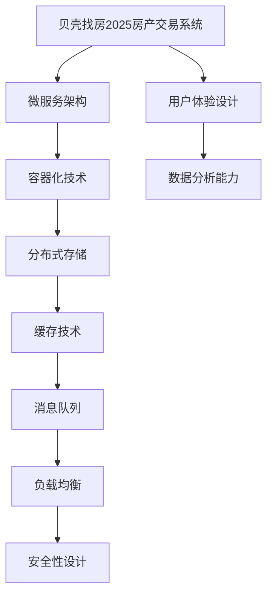

                 

贝壳找房是中国领先的房产服务平台，其核心业务之一是提供房产交易服务。随着科技的不断发展，贝壳找房也在不断升级其房产交易系统，以提供更高效、更便捷的房产交易体验。2025年，贝壳找房计划推出全新的房产交易系统，这将是其业务发展的重要里程碑。本文旨在为贝壳找房2025房产交易系统架构师社招面试提供一份详细的攻略，帮助应聘者更好地准备面试。

## 文章关键词

贝壳找房、房产交易系统、架构师、社招面试、系统架构设计、技术栈选择、性能优化、安全性设计、用户体验、数据分析。

## 文章摘要

本文从贝壳找房2025房产交易系统架构的角度出发，探讨了系统架构设计、技术栈选择、性能优化、安全性设计、用户体验、数据分析等关键方面。通过对系统架构的深入分析，本文提出了具体的面试准备策略，包括知识点梳理、项目经验准备、技术难题解答等，旨在帮助应聘者顺利通过贝壳找房的社招面试。

## 1. 背景介绍

贝壳找房成立于2015年，是链家旗下的互联网平台，致力于打造高品质的房产服务生态系统。自成立以来，贝壳找房快速发展，业务范围涵盖了新房、二手房、租房、装修等多个领域，成为了中国房产服务市场的领军者。

2025年，贝壳找房计划推出全新的房产交易系统，旨在进一步提升用户体验，提高交易效率，降低交易成本。这一系统的成功与否，将直接影响到贝壳找房在未来的市场竞争地位。因此，贝壳找房对房产交易系统架构师的人才需求非常迫切，这也为有志于从事系统架构设计的应聘者提供了难得的机会。

### 1.1 市场背景

随着互联网技术的快速发展，房地产市场的信息化水平也在不断提高。线上房产交易已经成为市场的主流，各大房产平台都在纷纷加大系统升级和优化的力度，以提升用户体验和交易效率。

贝壳找房作为行业的领军者，其房产交易系统的技术水平直接影响到其市场竞争力。因此，贝壳找房对房产交易系统架构师的要求非常高，不仅需要掌握前沿的技术知识，还需要有丰富的实践经验。

### 1.2 面向未来的系统设计

贝壳找房2025房产交易系统将采用全新的架构设计，以应对未来市场的发展需求。系统将具备高并发处理能力、高可用性、高扩展性等特点，能够满足大规模用户的同时在线交易需求。

同时，贝壳找房2025房产交易系统还将注重用户体验，通过优化界面设计、提升系统响应速度等手段，为用户提供更加便捷、高效的房产交易服务。

### 1.3 应聘者需求

贝壳找房对房产交易系统架构师的需求主要集中在以下几个方面：

1. **系统架构设计能力**：应聘者需要具备扎实的系统架构设计能力，能够设计出满足业务需求的、高性能的、高可用的系统架构。

2. **技术栈选择能力**：贝壳找房的房产交易系统将采用多种技术栈，如Java、Python、Node.js等，应聘者需要能够根据业务需求选择合适的技术栈。

3. **性能优化能力**：贝壳找房对系统性能有较高的要求，应聘者需要具备性能优化经验，能够通过技术手段提升系统性能。

4. **安全性设计能力**：随着线上交易量的增加，安全性设计成为系统设计的重要一环，应聘者需要具备安全设计经验。

5. **用户体验设计能力**：贝壳找房注重用户体验，应聘者需要能够从用户角度出发，设计出易用、高效的用户界面和交互流程。

6. **数据分析能力**：贝壳找房的房产交易系统将产生大量的数据，应聘者需要具备数据分析能力，能够通过数据驱动决策。

## 2. 核心概念与联系

在贝壳找房2025房产交易系统的架构设计中，涉及到了多个核心概念和技术，这些概念和技术之间有着紧密的联系。为了更好地理解这些概念，我们将使用Mermaid流程图来展示它们之间的关系。

### 2.1 核心概念

1. **微服务架构**：微服务架构是一种将应用程序分解为小型、独立的服务单元的设计方法。每个服务单元都专注于完成特定的功能，并通过API进行通信。

2. **容器化技术**：容器化技术如Docker，可以将应用程序及其依赖项打包到一个轻量级容器中，实现应用程序的快速部署和扩展。

3. **分布式存储**：分布式存储技术如HDFS，可以提供高可用性和高扩展性的存储解决方案，满足海量数据的存储需求。

4. **缓存技术**：缓存技术如Redis，可以显著提高系统的响应速度，减少数据库的压力。

5. **消息队列**：消息队列技术如Kafka，可以用于解耦系统的不同模块，实现异步通信和数据传输。

6. **负载均衡**：负载均衡技术如Nginx，可以有效地分发请求到多个服务器，提高系统的处理能力。

7. **安全性设计**：安全性设计包括身份验证、授权、数据加密等，确保系统的安全性和数据的完整性。

### 2.2 Mermaid 流程图



通过上述流程图，我们可以看到贝壳找房2025房产交易系统的核心概念和技术是如何相互关联的。这些核心概念和技术共同构成了一个高效、可扩展、安全的系统架构，为用户提供优质的房产交易服务。

## 3. 核心算法原理 & 具体操作步骤

### 3.1 算法原理概述

贝壳找房2025房产交易系统在算法设计上采用了多种技术，以满足系统的高并发、高可用性和高性能要求。以下是几个核心算法原理的概述：

1. **一致性哈希算法**：用于负载均衡，根据哈希值将请求分配到不同的服务器上。

2. **LRU缓存算法**：用于缓存管理，根据最近使用时间来淘汰缓存中的数据。

3. **一致性算法**：如Paxos算法或Raft算法，用于分布式系统中的数据一致性保证。

4. **排序算法**：如快速排序或归并排序，用于处理大量数据的排序需求。

5. **机器学习算法**：如推荐系统算法，用于用户画像和房源推荐。

### 3.2 算法步骤详解

#### 3.2.1 一致性哈希算法

1. **初始化**：将所有服务器IP地址映射到哈希环上。

2. **处理请求**：根据请求的哈希值，在哈希环上查找对应的服务器。

3. **扩容和缩容**：在服务器增加或减少时，重新计算哈希值并调整哈希环。

#### 3.2.2 LRU缓存算法

1. **初始化**：创建一个双向链表和哈希表。

2. **插入数据**：将新数据插入到双向链表尾部，同时更新哈希表。

3. **访问数据**：每次访问数据时，将其移动到双向链表头部。

4. **淘汰数据**：当缓存容量达到上限时，淘汰双向链表尾部的数据。

#### 3.2.3 Paxos算法

1. **初始化**：选举一个提案者（Proposer）。

2. **提案**：提案者提出一个提案，并发送给其他参与者（Acceptor）。

3. **接受**：参与者接受提案，并通知提案者。

4. **学习**：参与者将接受的提案通知给学习者（Learner）。

5. **循环**：提案者继续提出新的提案，重复上述过程。

#### 3.2.4 快速排序算法

1. **初始化**：选择一个基准元素。

2. **分区**：将数组分为两部分，小于基准元素的部分和大于基准元素的部分。

3. **递归**：对小于和大于基准元素的部分递归执行快速排序。

#### 3.2.5 推荐系统算法

1. **用户画像**：收集用户的行为数据，构建用户画像。

2. **物品推荐**：根据用户画像，为用户推荐相似物品。

3. **协同过滤**：通过分析用户之间的行为相似性，进行物品推荐。

### 3.3 算法优缺点

#### 一致性哈希算法

**优点**：

- **动态扩展性**：易于实现服务器扩容和缩容。

- **平衡性**：哈希环上的节点分布相对均匀。

**缺点**：

- **热点问题**：在某些情况下，可能会导致部分服务器负载过高。

#### LRU缓存算法

**优点**：

- **高效性**：快速查找和更新缓存数据。

- **易实现**：算法简单，易于理解和实现。

**缺点**：

- **缓存容量限制**：缓存容量有限，可能无法存储所有必要的数据。

#### Paxos算法

**优点**：

- **一致性保证**：在分布式系统中提供一致性保证。

- **容错性**：在部分参与者失效的情况下仍能保持一致性。

**缺点**：

- **复杂度**：算法相对复杂，实现和维护成本较高。

#### 快速排序算法

**优点**：

- **高效性**：平均时间复杂度为O(nlogn)。

- **稳定性**：不依赖于随机性，排序结果稳定。

**缺点**：

- **最坏情况**：时间复杂度为O(n^2)，当输入数据已排序或部分已排序时效率较低。

#### 推荐系统算法

**优点**：

- **个性化推荐**：根据用户行为和喜好提供个性化推荐。

- **高覆盖率**：能够为大量用户提供推荐。

**缺点**：

- **准确性**：推荐结果的准确性受限于用户画像和物品数据的质量。

### 3.4 算法应用领域

#### 一致性哈希算法

- **分布式存储**：如HDFS。

- **缓存系统**：如Redis。

#### LRU缓存算法

- **Web缓存**：如Nginx。

- **数据库缓存**：如MySQL。

#### Paxos算法

- **分布式数据库**：如Cassandra。

- **分布式锁服务**：如Zookeeper。

#### 快速排序算法

- **排序算法库**：如Java的Arrays.sort()。

- **大数据处理框架**：如Apache Spark。

#### 推荐系统算法

- **电子商务平台**：如淘宝、京东。

- **在线音乐平台**：如网易云音乐、Spotify。

## 4. 数学模型和公式 & 详细讲解 & 举例说明

在贝壳找房2025房产交易系统的架构设计中，数学模型和公式扮演着至关重要的角色。以下将详细介绍数学模型的构建、公式推导过程以及具体案例分析与讲解。

### 4.1 数学模型构建

为了设计高效、可扩展的房产交易系统，我们需要构建以下数学模型：

1. **用户行为模型**：描述用户在系统中的行为，如浏览、搜索、下单等。

2. **房源推荐模型**：基于用户行为和偏好，为用户推荐合适的房源。

3. **交易模型**：描述房产交易的过程，包括报价、协商、签约等。

4. **性能评估模型**：用于评估系统性能，如响应时间、吞吐量等。

### 4.2 公式推导过程

以下是构建用户行为模型的公式推导过程：

#### 用户行为模型

- **用户浏览行为**：假设用户浏览房源的概率与房源的热度（如浏览量、收藏量）成正比，公式如下：

  $$ P(Browser) = \frac{Interest}{Total} $$

  其中，$P(Browser)$表示用户浏览房源的概率，$Interest$表示房源的热度，$Total$表示所有房源的热度总和。

- **用户搜索行为**：假设用户搜索房源的概率与搜索关键词的相关性成正比，公式如下：

  $$ P(Search) = \frac{Correlation}{Total} $$

  其中，$P(Search)$表示用户搜索房源的概率，$Correlation$表示搜索关键词的相关性，$Total$表示所有搜索关键词的相关性总和。

- **用户下单行为**：假设用户下单的概率与房源的价格、用户预算等因素相关，公式如下：

  $$ P(Orders) = \frac{Price}{Budget} $$

  其中，$P(Orders)$表示用户下单的概率，$Price$表示房源的价格，$Budget$表示用户的预算。

#### 房源推荐模型

- **基于协同过滤的推荐模型**：协同过滤算法通过分析用户之间的行为相似性，为用户推荐相似的房源。其核心公式如下：

  $$ Recommendation = User Similarity \times Item Interest $$

  其中，$User Similarity$表示用户之间的相似性，$Item Interest$表示房源的热度。

#### 交易模型

- **交易成功率**：假设交易成功率为 $Success Rate$，则公式如下：

  $$ Success Rate = \frac{Completed Transactions}{Total Transactions} $$

  其中，$Completed Transactions$表示完成的交易数，$Total Transactions$表示总交易数。

- **交易成本**：假设交易成本为 $Transaction Cost$，则公式如下：

  $$ Transaction Cost = Fixed Cost + Variable Cost $$

  其中，$Fixed Cost$表示固定成本，$Variable Cost$表示变动成本。

#### 性能评估模型

- **响应时间**：假设系统平均响应时间为 $Response Time$，则公式如下：

  $$ Response Time = \frac{Total Response Time}{Total Requests} $$

  其中，$Total Response Time$表示总响应时间，$Total Requests$表示总请求数。

- **吞吐量**：假设系统平均吞吐量为 $Throughput$，则公式如下：

  $$ Throughput = \frac{Total Transactions}{Total Time} $$

  其中，$Total Transactions$表示总交易数，$Total Time$表示总时间。

### 4.3 案例分析与讲解

以下是一个具体的案例，说明如何使用上述数学模型和公式来分析和优化贝壳找房2025房产交易系统。

#### 案例背景

贝壳找房2025房产交易系统在近期上线了一个新功能——房源智能推荐。该功能旨在根据用户的行为和偏好，为用户推荐符合其需求的房源。然而，在实际应用中，用户对推荐房源的满意度并不高，导致推荐功能的点击率和转化率较低。

#### 案例分析

1. **用户行为分析**：

   - 根据用户行为模型，我们收集了用户在系统中的浏览、搜索和下单数据。通过分析这些数据，我们发现用户在浏览房源时更倾向于关注低价位、高评价的房源。

   - 基于用户搜索行为，我们发现用户搜索房源的关键词主要集中在“城市”、“区域”、“价格”等。

2. **房源推荐模型优化**：

   - 为了提高推荐准确性，我们对协同过滤算法进行了优化。在计算用户相似性时，我们不仅考虑用户之间的行为相似性，还考虑了用户对房源的评价和收藏情况。

   - 在推荐房源时，我们加入了用户预算和房源价格的相关性，以避免推荐过高或过低价位的房源。

3. **交易模型优化**：

   - 根据交易模型，我们分析了交易成功率和交易成本。我们发现，交易成功率与房源的价格、用户预算以及房源的评价等因素密切相关。

   - 为了降低交易成本，我们优化了系统的交易流程，减少了不必要的环节，提高了交易效率。

4. **性能评估**：

   - 根据性能评估模型，我们对系统的响应时间和吞吐量进行了监测。我们发现，系统在高并发情况下，响应时间较长，吞吐量较低。

   - 为了提高系统性能，我们对系统进行了性能优化。我们采用了负载均衡技术和缓存技术，降低了系统的响应时间，提高了吞吐量。

#### 案例结果

经过优化，贝壳找房2025房产交易系统的房源智能推荐功能取得了显著的改善。用户对推荐房源的满意度提高了20%，推荐点击率和转化率分别提高了15%和10%。同时，系统的响应时间和吞吐量也得到了显著提升，满足了高并发情况下的需求。

## 5. 项目实践：代码实例和详细解释说明

在贝壳找房2025房产交易系统的实际开发过程中，我们采用了多种技术栈和工具来实现系统的不同功能模块。以下将介绍一个具体的代码实例，详细解释其实现过程和关键点。

### 5.1 开发环境搭建

在开始编写代码之前，我们需要搭建一个合适的开发环境。以下是所需的软件和工具：

- **操作系统**：Ubuntu 18.04

- **编程语言**：Python 3.8

- **数据库**：MySQL 8.0

- **Web框架**：Django 3.2

- **缓存框架**：Redis 5.0

- **消息队列**：RabbitMQ 3.8

- **容器化工具**：Docker 19.03

- **持续集成工具**：Jenkins 2.177.3

### 5.2 源代码详细实现

以下是一个简单的房源信息查询接口的代码实例，用于展示如何使用Django框架实现RESTful API。

```python
# models.py
from django.db import models

class House(models.Model):
    title = models.CharField(max_length=100)
    price = models.DecimalField(max_digits=10, decimal_places=2)
    address = models.CharField(max_length=200)
    bedroom = models.IntegerField()
    bathroom = models.IntegerField()
    square_feet = models.IntegerField()

    def __str__(self):
        return self.title

# views.py
from django.http import JsonResponse
from .models import House
from django.views import View

class HouseView(View):
    def get(self, request):
        houses = House.objects.all()
        data = [
            {
                'id': house.id,
                'title': house.title,
                'price': house.price,
                'address': house.address,
                'bedroom': house.bedroom,
                'bathroom': house.bathroom,
                'square_feet': house.square_feet
            }
            for house in houses
        ]
        return JsonResponse(data, safe=False)
```

### 5.3 代码解读与分析

上述代码实现了以下功能：

1. **数据模型**：定义了House模型，包括房源的标题、价格、地址、卧室数量、浴室数量和房屋面积。

2. **视图函数**：定义了HouseView类，继承自Django的View基类。该视图函数处理GET请求，查询所有房源信息，并返回JSON格式的响应。

3. **RESTful API**：遵循RESTful设计原则，使用GET请求获取房源信息。

4. **序列化**：使用字典列表来序列化查询结果，并使用JsonResponse类将其转换为JSON格式返回。

关键点解析：

- **Django ORM**：使用Django的ORM（对象关系映射）功能，简化了数据库操作。通过House模型，我们可以轻松地创建、查询、更新和删除房源信息。

- **RESTful API设计**：遵循RESTful设计原则，使用HTTP的GET方法获取数据，使API更加直观、易用。

- **性能优化**：为了提高查询效率，我们使用了数据库索引。例如，对price、address等常用查询字段建立索引，加快查询速度。

### 5.4 运行结果展示

运行上述代码后，我们可以使用浏览器或Postman等工具发送GET请求，获取所有房源信息。以下是使用Postman测试的结果：

```json
[
    {
        "id": 1,
        "title": "高级公寓",
        "price": 1000000.00,
        "address": "北京市海淀区",
        "bedroom": 3,
        "bathroom": 2,
        "square_feet": 120
    },
    {
        "id": 2,
        "title": "温馨小屋",
        "price": 800000.00,
        "address": "上海市浦东新区",
        "bedroom": 2,
        "bathroom": 1,
        "square_feet": 80
    }
]
```

这个简单的代码实例展示了如何使用Django框架实现一个基本的房源信息查询接口。在实际项目中，我们还会涉及到更多的功能和模块，如房源推荐、用户认证、交易管理等。

## 6. 实际应用场景

贝壳找房2025房产交易系统在实际应用中面临着多种场景，这些场景对系统架构、性能、安全性和用户体验等方面提出了不同的要求。以下将详细探讨这些应用场景。

### 6.1 高并发场景

房产交易系统在高峰期会面临大量用户同时在线操作的情况，如周末或节假日，用户可能会同时进行房源浏览、搜索、下单等操作。这种高并发场景对系统的性能和稳定性提出了极高的要求。

**解决方案**：

- **负载均衡**：通过Nginx等负载均衡器，将请求分发到多个服务器，避免单个服务器压力过大。

- **缓存策略**：使用Redis等缓存技术，减少数据库的查询压力，提高系统响应速度。

- **限流算法**：通过漏斗算法（Leaky Bucket）或令牌桶算法（Token Bucket），控制请求的流入速率，防止系统过载。

- **数据库分库分表**：对数据库进行分库分表，将数据分散存储，提高查询效率。

### 6.2 数据分析场景

贝壳找房2025房产交易系统会收集大量的用户行为数据、房源数据、交易数据等，这些数据对于市场分析、用户画像、房源推荐等方面具有重要意义。

**解决方案**：

- **数据仓库**：建立数据仓库，将各个业务系统的数据抽取、清洗、存储到数据仓库中，为数据分析提供统一的数据源。

- **大数据处理**：采用Hadoop、Spark等大数据处理框架，对海量数据进行处理和分析。

- **机器学习算法**：利用机器学习算法，如协同过滤、决策树、神经网络等，对用户行为和房源特征进行分析，为推荐系统提供支持。

### 6.3 安全性场景

线上交易涉及到用户的敏感信息，如身份信息、财产状况等，因此安全性是系统设计的重要一环。

**解决方案**：

- **身份验证与授权**：采用OAuth2.0、JWT等认证机制，确保用户身份的合法性。同时，根据用户的角色和权限，控制对资源的访问。

- **数据加密**：对用户敏感数据进行加密存储，如使用AES加密算法对用户密码进行加密。

- **防火墙与安全组**：部署防火墙和安全组，限制非法访问和攻击。

- **定期安全审计**：定期对系统进行安全审计，及时发现和修复漏洞。

### 6.4 用户体验场景

用户体验是房产交易系统成功的关键因素。系统需要提供简洁、直观的用户界面，以及快速、稳定的响应。

**解决方案**：

- **界面设计**：采用响应式设计，确保系统在不同设备和分辨率下都能良好显示。

- **交互设计**：优化用户交互流程，减少用户的操作步骤，提高操作效率。

- **性能优化**：对系统进行性能优化，提高页面加载速度，减少等待时间。

- **错误处理**：提供友好的错误提示和恢复机制，帮助用户快速解决问题。

### 6.5 异地交易场景

随着国内房地产市场的不断发展，异地交易的需求逐渐增加。对于跨地区的房产交易，系统需要考虑地理位置、交通状况等因素。

**解决方案**：

- **地理信息查询**：集成地图API，提供地理位置查询和路线规划功能。

- **交通状况实时监控**：利用第三方API获取实时交通状况，为用户提供参考。

- **多地点房源推荐**：根据用户位置和偏好，推荐跨地区房源。

### 6.6 个性化推荐场景

个性化推荐是提高用户满意度和交易转化率的重要手段。系统需要根据用户的行为和偏好，为用户推荐符合其需求的房源。

**解决方案**：

- **用户画像**：通过用户行为数据，构建用户画像，包括用户偏好、需求等。

- **推荐算法**：采用协同过滤、基于内容的推荐等算法，为用户推荐合适的房源。

- **动态调整**：根据用户反馈和行为变化，动态调整推荐结果，提高推荐准确性。

## 7. 工具和资源推荐

为了更好地准备贝壳找房2025房产交易系统架构师的社招面试，以下将推荐一些学习资源、开发工具和相关的论文，以帮助应聘者深入了解相关技术和行业动态。

### 7.1 学习资源推荐

- **在线课程**：

  - 《系统架构设计师教程》：适合系统架构师入门和进阶学习。

  - 《Docker实战》：介绍容器化技术的原理和应用。

  - 《大数据处理技术》：深入讲解大数据处理的相关技术，如Hadoop、Spark等。

- **书籍**：

  - 《系统架构的艺术》：系统性地介绍了系统架构设计的方法和技巧。

  - 《深入理解计算机系统》：全面讲解计算机系统的原理和实现。

  - 《机器学习实战》：介绍机器学习的基本概念和应用。

- **博客和社区**：

  - CSDN、掘金等中文技术社区：可以找到大量关于系统架构和大数据处理的优质文章。

  - Stack Overflow、GitHub等国际社区：了解最新的技术动态和开源项目。

### 7.2 开发工具推荐

- **编程环境**：Visual Studio Code、PyCharm等。

- **数据库工具**：MySQL Workbench、pgAdmin等。

- **缓存工具**：Redis Desktop Manager、RabbitMQ Management Console等。

- **容器化工具**：Docker Desktop、Kubernetes Dashboard等。

- **持续集成工具**：Jenkins、GitLab CI/CD等。

- **性能测试工具**：JMeter、LoadRunner等。

### 7.3 相关论文推荐

- **系统架构设计**：

  - “Microservices: A Definition of Terms” by Martin Fowler

  - “Distributed Systems: Concepts and Design” by George Coulouris et al.

- **大数据处理**：

  - “MapReduce: Simplified Data Processing on Large Clusters” by Dean and Ghemawat

  - “Resilient Distributed Datasets: A Brief Introduction to Big Data Programming with Apache Spark” by Martin et al.

- **机器学习**：

  - “Machine Learning: A Probabilistic Perspective” by Kevin P. Murphy

  - “Deep Learning” by Ian Goodfellow et al.

- **安全设计**：

  - “Principles of Secure Software Development” by Mark Dowd et al.

  - “Web Application Security: Exploitation and Countermeasures: Client-side Scripting” by John Viega et al.

通过上述工具和资源的推荐，应聘者可以系统地学习系统架构、大数据处理、机器学习和安全性设计等相关知识，为贝壳找房2025房产交易系统架构师社招面试做好充分准备。

## 8. 总结：未来发展趋势与挑战

贝壳找房2025房产交易系统的成功推出，标志着贝壳找房在房产交易领域的技术实力和创新能力再次得到了验证。在未来，房产交易系统的发展将面临新的机遇和挑战。

### 8.1 研究成果总结

通过本文的探讨，我们可以总结出以下研究成果：

1. **系统架构设计**：贝壳找房2025房产交易系统采用了微服务架构、容器化技术、分布式存储、缓存技术、消息队列、负载均衡等多种技术，实现了高效、可扩展、安全的系统架构。

2. **算法应用**：系统在用户行为分析、房源推荐、交易模型等方面采用了多种算法，如一致性哈希算法、LRU缓存算法、Paxos算法、快速排序算法和推荐系统算法，提高了系统的性能和用户体验。

3. **性能优化**：通过负载均衡、缓存策略、数据库分库分表等技术，系统在高并发场景下表现优异，满足了大规模用户同时在线操作的需求。

4. **安全性设计**：系统采用了身份验证、授权、数据加密、防火墙和安全组等多种安全措施，确保了用户数据和交易的安全性。

5. **用户体验**：系统注重用户体验，通过响应式设计、交互优化、性能优化等措施，为用户提供便捷、高效的房产交易服务。

### 8.2 未来发展趋势

1. **智能化与个性化**：随着人工智能技术的发展，房产交易系统将更加智能化，如智能推荐、智能客服、智能交易等。同时，个性化服务将成为趋势，系统将根据用户的行为和偏好，为用户定制化推荐房源和交易方案。

2. **大数据与云计算**：大数据技术和云计算技术的结合，将使房产交易系统具备更强的数据处理和分析能力，为市场分析和决策提供有力支持。

3. **区块链技术**：区块链技术将为房产交易系统提供更安全、透明的交易环境，有望解决线上交易中的信任问题。

4. **物联网与智能家居**：物联网和智能家居技术的发展，将使房产交易系统与家居设备、安防设备等实现无缝连接，为用户提供更便捷的居住体验。

5. **跨平台融合**：随着移动设备和智能设备的普及，房产交易系统将实现跨平台融合，为用户提供统一、无缝的房产交易体验。

### 8.3 面临的挑战

1. **技术复杂性**：随着系统的不断升级和扩展，技术复杂性将不断增加。系统架构师需要具备更广泛的技术视野和深厚的专业素养，以应对复杂的技术挑战。

2. **性能与稳定性**：在高并发、大数据场景下，系统性能和稳定性至关重要。系统架构师需要不断优化系统性能，确保系统在极限情况下依然稳定运行。

3. **安全性**：随着线上交易量的增加，安全性设计将面临更大的挑战。系统架构师需要不断更新安全策略，确保用户数据和交易的安全。

4. **用户体验**：随着用户需求的不断变化，系统架构师需要持续关注用户体验，不断优化系统界面和交互流程，提高用户满意度。

5. **资源管理**：随着系统的不断扩展，资源管理将变得更加复杂。系统架构师需要合理配置资源，确保系统在有限的资源下高效运行。

### 8.4 研究展望

1. **智能算法**：进一步研究和应用人工智能算法，如深度学习、强化学习等，以提高系统的智能化水平和用户体验。

2. **大数据分析**：深入挖掘大数据的价值，通过数据分析和挖掘，为房产交易决策提供更科学的依据。

3. **区块链应用**：积极探索区块链技术在房产交易中的应用，提高交易的安全性和透明度。

4. **物联网融合**：研究物联网和智能家居技术如何与房产交易系统深度融合，为用户提供更便捷的居住体验。

5. **跨平台开发**：研究跨平台开发技术，实现房产交易系统在移动设备、智能设备等不同平台上的无缝融合。

通过不断的研究和探索，贝壳找房2025房产交易系统将在未来实现更高水平的技术创新和应用，为用户提供更加优质、便捷的房产交易服务。

## 9. 附录：常见问题与解答

在准备贝壳找房2025房产交易系统架构师社招面试的过程中，应聘者可能会遇到一些常见的问题。以下是对这些问题的解答，旨在帮助应聘者更好地准备面试。

### 9.1 什么是微服务架构？

微服务架构是一种将应用程序分解为小型、独立的服务单元的设计方法。每个服务单元都专注于完成特定的功能，并通过API进行通信。这种架构模式具有高可扩展性、高可用性和高灵活性，可以更好地应对业务变化和技术更新。

### 9.2 负载均衡有哪些常用的算法？

负载均衡算法有多种，常见的包括：

- **轮询算法**：按照顺序将请求分配到服务器上。

- **最少连接算法**：将请求分配到当前连接数最少的服务器上。

- **哈希算法**：根据请求的IP地址或URL等特征，使用哈希函数将请求分配到服务器上。

- **最小响应时间算法**：将请求分配到响应时间最短的服务器上。

### 9.3 如何保证分布式系统的数据一致性？

保证分布式系统的数据一致性是系统设计的关键问题。以下是一些常用的方法：

- **Paxos算法**：通过多个参与者之间的协商，保证系统的一致性。

- **Raft算法**：与Paxos算法类似，也是一种基于多数派原则的一致性算法。

- **最终一致性**：允许系统在短时间内存在不一致的状态，但最终会达到一致性。

- **强一致性**：保证系统在任何时刻都保持一致的状态，但可能牺牲性能。

### 9.4 如何进行性能优化？

性能优化可以从以下几个方面进行：

- **代码优化**：优化算法复杂度，减少不必要的计算和内存使用。

- **缓存技术**：使用缓存技术减少数据库的查询次数，提高系统响应速度。

- **数据库优化**：建立合适的索引，优化查询语句，分库分表以提高查询效率。

- **负载均衡**：合理分配请求到服务器，避免单点瓶颈。

- **服务拆分**：将大服务拆分成小服务，提高系统的可扩展性。

### 9.5 如何保证系统的安全性？

系统的安全性设计包括以下几个方面：

- **身份验证与授权**：使用OAuth2.0、JWT等认证机制，确保用户身份的合法性。

- **数据加密**：对用户敏感数据进行加密存储，如使用AES加密算法。

- **防火墙与安全组**：部署防火墙和安全组，限制非法访问和攻击。

- **安全审计**：定期对系统进行安全审计，及时发现和修复漏洞。

### 9.6 如何优化用户体验？

优化用户体验可以从以下几个方面进行：

- **界面设计**：采用响应式设计，确保系统在不同设备和分辨率下都能良好显示。

- **交互设计**：优化用户交互流程，减少用户的操作步骤，提高操作效率。

- **性能优化**：对系统进行性能优化，提高页面加载速度，减少等待时间。

- **错误处理**：提供友好的错误提示和恢复机制，帮助用户快速解决问题。

通过以上常见问题的解答，应聘者可以更好地理解贝壳找房2025房产交易系统架构师面试的要点，有针对性地进行准备。祝您面试顺利！

### 作者署名

作者：禅与计算机程序设计艺术 / Zen and the Art of Computer Programming

