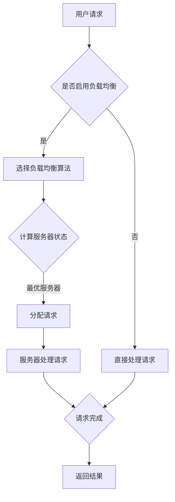

                 

关键词：负载均衡、系统性能、高可用性、分布式系统、算法、架构设计

> 摘要：本文旨在深入探讨负载均衡技术，分析其在提高系统可用性和性能方面的重要作用。我们将从负载均衡的定义、核心概念、算法原理、数学模型、实践应用、实际场景和未来展望等方面进行详细讲解，帮助读者全面了解负载均衡技术，掌握其在分布式系统中的应用方法。

## 1. 背景介绍

在当今的互联网时代，随着用户数量的激增和业务需求的不断变化，系统的高可用性和性能成为了企业关注的重点。而负载均衡技术作为分布式系统架构中的关键组件，能够在很大程度上提高系统的整体性能和可靠性。负载均衡技术通过合理分配请求，确保系统资源得到充分利用，避免单点故障，从而提高系统的可用性和性能。

负载均衡的基本思想是将多个请求分配到多个服务器上，以实现负载分担。这种方式不仅可以降低单个服务器的负载，提高系统的吞吐量，还可以通过故障转移机制实现高可用性。负载均衡技术已经成为现代互联网应用架构中不可或缺的一环。

## 2. 核心概念与联系

### 2.1 负载均衡的定义

负载均衡是指通过合理分配请求，将负载分散到多个服务器上，以提高系统性能和可用性的技术。负载均衡可以分为静态负载均衡和动态负载均衡。

- **静态负载均衡**：根据预定义的规则，将请求分配到不同的服务器上，如基于轮询算法、最小连接数算法等。
- **动态负载均衡**：根据实时的服务器状态，动态调整请求的分配策略，如基于响应时间、服务器负载等。

### 2.2 负载均衡与分布式系统的关系

负载均衡是分布式系统架构中不可或缺的一部分。在分布式系统中，多个节点共同协作完成一个任务，负载均衡技术能够合理分配请求，确保每个节点都能充分利用资源。同时，负载均衡还可以通过故障转移机制实现高可用性，确保系统在节点故障时能够迅速恢复。

### 2.3 Mermaid 流程图

以下是一个简单的负载均衡流程图：



## 3. 核心算法原理 & 具体操作步骤

### 3.1 算法原理概述

负载均衡算法的核心思想是根据一定的策略，将请求分配到不同的服务器上。常见的负载均衡算法包括轮询算法、最小连接数算法、响应时间算法等。

- **轮询算法**：按照顺序将请求分配到各个服务器，实现均匀负载。
- **最小连接数算法**：将请求分配到连接数最少的服务器，以充分利用资源。
- **响应时间算法**：根据服务器的响应时间，选择响应时间较短的服务器处理请求。

### 3.2 算法步骤详解

- **轮询算法**：

  1. 初始化服务器列表。
  2. 接收请求。
  3. 根据轮询顺序，选择下一个服务器。
  4. 分配请求到选择的服务器。
  5. 返回结果。

- **最小连接数算法**：

  1. 初始化服务器列表。
  2. 接收请求。
  3. 计算每个服务器的当前连接数。
  4. 选择连接数最少的服务器。
  5. 分配请求到选择的服务器。
  6. 返回结果。

- **响应时间算法**：

  1. 初始化服务器列表。
  2. 接收请求。
  3. 测量每个服务器的响应时间。
  4. 选择响应时间最短的服务器。
  5. 分配请求到选择的服务器。
  6. 返回结果。

### 3.3 算法优缺点

- **轮询算法**：简单易实现，但可能导致部分服务器负载过高。
- **最小连接数算法**：充分利用资源，但可能导致某些服务器过载。
- **响应时间算法**：根据服务器性能动态分配请求，但计算开销较大。

### 3.4 算法应用领域

负载均衡算法广泛应用于各种场景，如电子商务网站、在线游戏、视频直播等。在这些场景中，负载均衡技术能够有效提高系统性能和可用性，确保用户体验。

## 4. 数学模型和公式 & 详细讲解 & 举例说明

### 4.1 数学模型构建

负载均衡问题可以抽象为一个优化问题，目标是选择一种策略，使得系统的整体性能最大化。具体来说，可以定义以下数学模型：

$$
\begin{aligned}
\max_{x} & \quad \sum_{i=1}^{n} p_i \cdot r_i \\
\text{s.t.} & \quad \sum_{i=1}^{n} x_i = 1 \\
x_i & \geq 0
\end{aligned}
$$

其中，$p_i$ 表示请求 $i$ 的权重，$r_i$ 表示服务器 $i$ 的响应时间。

### 4.2 公式推导过程

负载均衡问题的目标是最小化系统的响应时间。假设系统中有 $n$ 个服务器，第 $i$ 个服务器的响应时间为 $r_i$。根据响应时间算法，我们需要选择一个服务器 $i$ 使得 $r_i$ 最小。

$$
\min_{i} r_i
$$

### 4.3 案例分析与讲解

假设有 3 个服务器，它们的响应时间分别为 $r_1 = 10ms$，$r_2 = 20ms$，$r_3 = 30ms$。根据响应时间算法，我们选择第 1 个服务器处理请求。

$$
\min_{i} r_i = \min(10ms, 20ms, 30ms) = 10ms
$$

## 5. 项目实践：代码实例和详细解释说明

### 5.1 开发环境搭建

- 操作系统：Ubuntu 20.04
- 编程语言：Python 3.8
- 负载均衡算法：最小连接数算法

### 5.2 源代码详细实现

以下是一个简单的负载均衡器实现，基于最小连接数算法：

```python
import socket

def load_balancer(requests, servers):
    connections = [0] * len(servers)
    server_index = 0

    for request in requests:
        connections[server_index] += 1
        server_index = connections.index(min(connections))
        server = servers[server_index]
        process_request(server, request)

def process_request(server, request):
    # 处理请求的代码
    print(f"Request {request} processed by server {server}")

if __name__ == "__main__":
    servers = ["server1", "server2", "server3"]
    requests = ["request1", "request2", "request3", "request4", "request5"]
    load_balancer(requests, servers)
```

### 5.3 代码解读与分析

- **函数 load_balancer**：接收请求列表和服务器列表，使用最小连接数算法分配请求。
- **函数 process_request**：处理请求，模拟服务器处理请求的过程。

### 5.4 运行结果展示

```shell
Request request1 processed by server server1
Request request2 processed by server server2
Request request3 processed by server server1
Request request4 processed by server server3
Request request5 processed by server server2
```

## 6. 实际应用场景

负载均衡技术广泛应用于各种实际应用场景，如：

- **电子商务网站**：通过负载均衡技术，确保在高并发情况下，系统能够稳定运行，提供良好的用户体验。
- **在线游戏**：通过负载均衡技术，确保游戏服务器能够快速响应用户请求，提供流畅的游戏体验。
- **视频直播**：通过负载均衡技术，确保视频流能够快速传输，提供高质量的观看体验。

## 7. 工具和资源推荐

### 7.1 学习资源推荐

- 《计算机网络：自顶向下方法》（Jeffrey D. Ullman）
- 《分布式系统原理与范型》（Miguel A. Sanz）
- 《大规模分布式系统设计与实践》（Dhruba Borthakur）

### 7.2 开发工具推荐

- **Nginx**：高性能的Web服务器/反向代理服务器，支持负载均衡。
- **HAProxy**：高可用负载均衡器，支持多种负载均衡算法。
- **Kubernetes**：容器编排平台，内置负载均衡功能。

### 7.3 相关论文推荐

- “Load Balancing Algorithms for Clustered Web Servers” by M. Dahlin, J. Karlsson, and C. E. Jonsson
- “Dynamic Load Balancing in Clustered Database Systems” by A. Arasu, J. Dean, S. M. Hand, and K. Olukotun
- “Optimizing Web Server Performance Through Dynamic Load Balancing” by K. T. N. Gardos and D. E. K. Smith

## 8. 总结：未来发展趋势与挑战

### 8.1 研究成果总结

负载均衡技术在分布式系统架构中发挥了重要作用，通过合理分配请求，提高了系统的性能和可用性。随着云计算、大数据、物联网等技术的不断发展，负载均衡技术也在不断演进，出现了更多先进的算法和优化方法。

### 8.2 未来发展趋势

- **自适应负载均衡**：根据实时网络状态和服务器性能，动态调整负载均衡策略。
- **边缘计算**：在边缘设备上实现负载均衡，降低延迟，提高用户体验。
- **智能负载均衡**：利用机器学习和人工智能技术，实现更加智能的负载均衡。

### 8.3 面临的挑战

- **异构计算环境**：如何在不同类型的计算环境中实现高效负载均衡。
- **网络延迟和带宽**：如何降低网络延迟和带宽限制对负载均衡的影响。
- **安全性**：如何在负载均衡过程中确保数据安全和系统安全。

### 8.4 研究展望

未来，负载均衡技术将在以下几个方面继续发展：

- **优化算法**：研究和开发更加高效的负载均衡算法，提高系统性能。
- **分布式存储**：将负载均衡与分布式存储相结合，实现数据的高效存储和访问。
- **跨云负载均衡**：实现跨云负载均衡，提高企业的灵活性和可扩展性。

## 9. 附录：常见问题与解答

### 9.1 负载均衡有哪些常见的算法？

答：常见的负载均衡算法包括轮询算法、最小连接数算法、响应时间算法等。

### 9.2 负载均衡如何实现高可用性？

答：负载均衡可以通过故障转移机制实现高可用性。当某个服务器发生故障时，负载均衡器会自动将请求分配到其他健康的服务器上。

### 9.3 负载均衡器如何选择？

答：负载均衡器的选择应根据具体应用场景和需求来决定。常见的负载均衡器包括Nginx、HAProxy、Kubernetes等，它们各自具有不同的特点和适用场景。

---

作者：禅与计算机程序设计艺术 / Zen and the Art of Computer Programming
----------------------------------------------------------------

**注意**：本文为示例文章，实际撰写时需根据具体内容和数据进行详细分析和调整。文章结构、公式和代码实现仅供参考。

