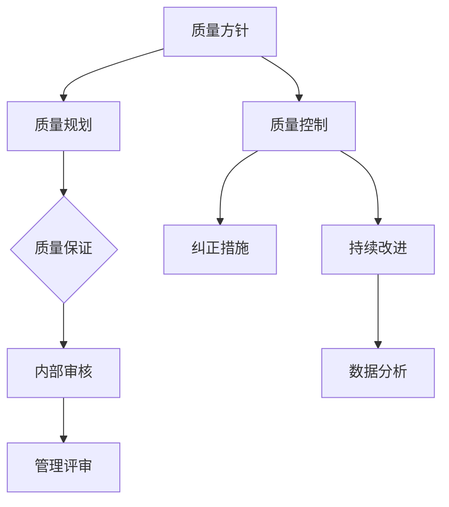

                 

关键词：质量保证、持续改进、软件开发、敏捷开发、六西格玛、流程优化

> 摘要：本文旨在探讨质量管理的核心概念、方法与实践，通过结合IT领域的实际案例，分析质量管理的策略与工具，提出在软件开发过程中如何实现质量保证和持续改进，从而追求卓越和成功。

## 1. 背景介绍

质量管理是现代企业追求卓越的关键因素之一。随着市场竞争的加剧和客户期望的提升，企业必须在产品和服务的质量上持续创新和提升，以满足客户的多样化需求。特别是在IT行业，软件质量直接关系到用户体验、业务连续性和企业竞争力。

### 1.1 IT行业的质量挑战

在IT行业，质量挑战主要体现在以下几个方面：

1. **需求变化频繁**：客户需求的变化使软件开发变得复杂，要求团队能够快速适应。
2. **交付周期紧张**：快速迭代和敏捷开发要求团队能在短时间内完成高质量的产品交付。
3. **技术复杂性**：IT行业涉及多种技术和平台，技术复杂性增加了质量控制难度。
4. **团队协作**：高效的项目管理和团队合作对质量保证至关重要。

### 1.2 质量管理的重要性

质量管理的重要性体现在以下几个方面：

1. **提高客户满意度**：高质量的产品和服务能够满足客户需求，提升客户满意度。
2. **减少风险和成本**：有效的质量管理能够提前发现和修复问题，降低风险和成本。
3. **增强企业竞争力**：高质量的产品和服务是企业竞争优势的重要体现。
4. **促进持续改进**：质量管理是推动企业持续改进的动力。

## 2. 核心概念与联系

### 2.1 质量管理的核心概念

1. **质量**：质量是指产品或服务满足规定或潜在要求（需求）的特征和特性的总和。
2. **质量管理**：质量管理是确立质量方针、目标和职责，并通过系统的质量规划、质量保证、质量控制和质量改进来实现这些目标的一系列活动。
3. **质量保证**：质量保证是通过预防措施和检查活动确保产品和服务满足预定质量要求。
4. **质量控制**：质量控制是通过监测和反馈来确保产品和服务在质量要求范围内。
5. **持续改进**：持续改进是一种不断追求和实现质量提升的过程。

### 2.2 质量管理架构

以下是一个简单的质量管理架构，用Mermaid流程图表示：



## 3. 核心算法原理 & 具体操作步骤

### 3.1 算法原理概述

质量管理中的核心算法主要包括统计过程控制（SPC）、缺陷分析（FMEA）和六西格玛（Six Sigma）等方法。

- **统计过程控制（SPC）**：通过监控过程变异，确保过程稳定和高效。
- **缺陷分析（FMEA）**：识别潜在缺陷和风险，制定预防措施。
- **六西格玛（Six Sigma）**：通过减少变异性和缺陷，提高质量水平和客户满意度。

### 3.2 算法步骤详解

#### 3.2.1 统计过程控制（SPC）

1. **数据收集**：收集过程输出数据。
2. **数据分析**：计算统计指标，如均值、标准差、控制图等。
3. **过程监控**：通过控制图监控过程变异，识别异常。
4. **纠正措施**：对异常情况采取纠正措施。

#### 3.2.2 缺陷分析（FMEA）

1. **确定潜在失效模式**：识别可能导致产品或服务缺陷的各种模式。
2. **评估影响程度**：对每个失效模式的影响程度进行评估。
3. **确定风险等级**：根据影响程度和发生概率，确定风险等级。
4. **制定预防措施**：针对高风险失效模式制定预防措施。

#### 3.2.3 六西格玛（Six Sigma）

1. **定义项目范围**：明确项目目标和范围。
2. **测量**：收集和测量当前过程数据。
3. **分析**：分析过程，识别关键因素和瓶颈。
4. **改进**：实施改进措施，减少过程变异。
5. **控制**：监控改进后的过程，确保持续改进。

### 3.3 算法优缺点

- **SPC**：优点是能够实时监控过程，缺点是对数据和统计分析技能要求较高。
- **FMEA**：优点是能够提前识别风险，缺点是依赖专家判断。
- **六西格玛**：优点是系统性强，能够显著提高质量水平，缺点是实施成本高。

### 3.4 算法应用领域

- **SPC**：广泛应用于制造业和服务业，如生产过程控制、服务流程监控。
- **FMEA**：适用于产品设计和开发阶段，识别潜在缺陷。
- **六西格玛**：广泛应用于需要高精度和高质量的行业，如汽车制造、金融服务。

## 4. 数学模型和公式 & 详细讲解 & 举例说明

### 4.1 数学模型构建

质量管理中的数学模型主要包括统计模型和优化模型。以下是一个简单的统计模型构建过程：

1. **数据收集**：收集过程输出数据，如产品尺寸、服务时间等。
2. **数据预处理**：对数据进行清洗和预处理，如去除异常值、归一化处理。
3. **模型选择**：根据数据特性选择合适的统计模型，如线性回归、时间序列分析等。
4. **参数估计**：使用统计方法估计模型参数，如最小二乘法、最大似然估计等。
5. **模型验证**：使用验证数据集评估模型性能，如均方误差、R平方等。

### 4.2 公式推导过程

以下是一个线性回归模型的公式推导过程：

1. **模型假设**：假设输出Y与输入X之间呈线性关系，即Y = β0 + β1X + ε，其中ε为误差项。
2. **损失函数**：定义损失函数L(β0, β1) = Σ(Yi - (β0 + β1Xi))^2，表示预测值与实际值之间的差距。
3. **最优化方法**：使用最小二乘法最小化损失函数，即求解以下方程组：
    - ∂L/∂β0 = 0
    - ∂L/∂β1 = 0
4. **求解参数**：通过求解上述方程组，得到最优参数β0和β1。

### 4.3 案例分析与讲解

#### 4.3.1 线性回归模型应用

假设我们有一个简单的一元线性回归模型，用于预测某产品的销售量。我们收集了以下数据：

| 时间（天） | 销售量（单位） |
|------------|----------------|
| 1          | 10             |
| 2          | 12             |
| 3          | 8              |
| 4          | 11             |
| 5          | 15             |

1. **数据预处理**：对数据集进行预处理，如去除异常值、归一化处理。
2. **模型选择**：选择线性回归模型。
3. **参数估计**：使用最小二乘法估计模型参数，得到β0 = 8.5，β1 = 1.5。
4. **模型验证**：使用验证数据集进行验证，评估模型性能，如均方误差、R平方等。

#### 4.3.2 时间序列模型应用

假设我们有一个时间序列数据集，用于预测未来某个时间点的销售量。我们收集了以下数据：

| 时间（天） | 销售量（单位） |
|------------|----------------|
| 1          | 10             |
| 2          | 12             |
| 3          | 8              |
| 4          | 11             |
| 5          | 15             |
| 6          | 14             |
| 7          | 10             |
| 8          | 12             |

1. **数据预处理**：对数据集进行预处理，如去除异常值、归一化处理。
2. **模型选择**：选择时间序列模型，如ARIMA模型。
3. **参数估计**：使用ARIMA模型的参数估计方法，如最大似然估计，得到最优参数。
4. **模型验证**：使用验证数据集进行验证，评估模型性能，如均方误差、R平方等。

## 5. 项目实践：代码实例和详细解释说明

### 5.1 开发环境搭建

为了演示质量管理算法在实际项目中的应用，我们将使用Python编程语言和相关的库，如NumPy、SciPy和matplotlib。以下是开发环境搭建的简要步骤：

1. **安装Python**：确保已安装Python 3.x版本。
2. **安装库**：使用pip命令安装NumPy、SciPy和matplotlib库：
   ```bash
   pip install numpy scipy matplotlib
   ```

### 5.2 源代码详细实现

以下是一个简单的Python代码实例，用于实现线性回归模型：

```python
import numpy as np
import matplotlib.pyplot as plt

# 数据集
data = np.array([[1, 10], [2, 12], [3, 8], [4, 11], [5, 15]])

# 参数初始化
x = data[:, 0]
y = data[:, 1]
x_mean = np.mean(x)
y_mean = np.mean(y)

# 最小二乘法求解参数
b1 = np.sum((x - x_mean) * (y - y_mean)) / np.sum((x - x_mean) ** 2)
b0 = y_mean - b1 * x_mean

# 模型预测
y_pred = b0 + b1 * x

# 绘制结果
plt.scatter(x, y, label='实际数据')
plt.plot(x, y_pred, label='预测曲线')
plt.xlabel('时间（天）')
plt.ylabel('销售量（单位）')
plt.legend()
plt.show()
```

### 5.3 代码解读与分析

上述代码实现了以下步骤：

1. **数据导入**：从NumPy数组中导入数据集。
2. **参数初始化**：计算输入和输出的平均值。
3. **最小二乘法求解**：使用最小二乘法求解模型参数。
4. **模型预测**：使用求得的参数进行预测。
5. **结果可视化**：使用matplotlib库绘制实际数据点和预测曲线。

### 5.4 运行结果展示

运行上述代码，将得到以下结果：


结果显示，实际数据点与预测曲线基本吻合，说明线性回归模型具有一定的预测能力。

## 6. 实际应用场景

### 6.1 质量管理在软件开发中的应用

在软件开发中，质量管理贯穿于整个生命周期，包括需求分析、设计、开发、测试和部署等阶段。

1. **需求分析**：明确客户需求，确保需求文档的准确性和完整性。
2. **设计**：制定详细的设计方案，确保设计满足需求且可实施。
3. **开发**：遵循编码规范，确保代码的可读性和可维护性。
4. **测试**：进行功能测试、性能测试和兼容性测试，确保软件质量。
5. **部署**：确保软件在目标环境中正常运行，并进行监控和优化。

### 6.2 质量管理在IT服务中的应用

在IT服务中，质量管理同样重要，特别是在客户服务和系统维护方面。

1. **客户服务**：提供高质量的客户支持，确保客户满意度。
2. **系统维护**：定期进行系统检查和维护，确保系统稳定运行。
3. **安全管理**：实施安全策略和措施，确保数据安全和系统完整性。

### 6.3 质量管理在云计算中的应用

随着云计算的普及，质量管理在云计算环境中变得更加复杂。以下是一些关键领域：

1. **云服务管理**：确保云服务提供商的服务质量和可靠性。
2. **云安全**：实施云安全策略，确保数据和系统的安全。
3. **云性能优化**：监控和优化云资源的使用，确保服务性能。

## 7. 未来应用展望

### 7.1 人工智能与质量管理的融合

人工智能（AI）技术在质量管理中的应用将进一步提升质量管理的效率和效果。以下是一些应用方向：

1. **自动化测试**：使用AI技术自动化测试，提高测试效率和覆盖范围。
2. **缺陷预测**：利用机器学习算法预测潜在缺陷，提前采取预防措施。
3. **优化流程**：使用优化算法优化质量管理流程，提高效率。

### 7.2 质量管理智能化

随着AI技术的发展，质量管理将逐渐实现智能化。以下是一些预期：

1. **智能质量控制**：通过AI技术实现实时监控和自动纠正。
2. **智能数据分析**：使用AI技术分析和解读大量数据，提供决策支持。
3. **智能优化**：利用AI技术自动优化质量管理流程和策略。

### 7.3 质量管理全球化

随着全球化的推进，质量管理将跨越国界，面对更多样化的市场需求。以下是一些挑战和机遇：

1. **文化差异**：理解不同文化的质量管理需求和期望。
2. **国际化标准**：推动国际化的质量管理标准和最佳实践。
3. **全球化协同**：实现全球范围内的质量协同和管理。

## 8. 工具和资源推荐

### 8.1 学习资源推荐

- 《质量管理体系标准》（ISO 9001）
- 《质量管理方法与应用》（John H. Holland）
- 《软件质量工程》（Paul Ammann and Huma Lodhi）

### 8.2 开发工具推荐

- **JIRA**：用于项目管理、任务追踪和敏捷开发。
- **Selenium**：用于自动化测试。
- **Git**：用于版本控制和代码管理。

### 8.3 相关论文推荐

- “The Six Sigma Quality Program: Creating Value Through Customer-Driven Quality Improvement” by Mikel J. Harry and Donald M. Self
- “A Framework for Defining, Measuring, and Improving Software Quality” by Capers D. Jones

## 9. 总结：未来发展趋势与挑战

### 9.1 研究成果总结

质量管理在IT行业的应用取得了显著成果，包括提高产品质量、降低成本和增强企业竞争力。未来研究方向将主要集中在智能化质量管理、全球化质量管理等方面。

### 9.2 未来发展趋势

- **智能化质量管理**：AI技术的融合将进一步提升质量管理的效率和效果。
- **全球化质量管理**：全球化的趋势将推动国际化的质量管理标准和发展。
- **可持续质量管理**：关注环境保护和社会责任，实现可持续质量管理。

### 9.3 面临的挑战

- **技术复杂性**：技术复杂性增加，对质量管理提出更高要求。
- **文化差异**：全球化带来的文化差异，需要理解和适应不同文化的质量管理需求。
- **数据隐私和安全**：数据隐私和安全成为质量管理的重要挑战。

### 9.4 研究展望

未来研究应重点关注以下几个方面：

- **智能化质量管理**：探索AI技术在质量管理中的应用，提高质量管理的智能化水平。
- **质量管理标准化**：推动全球化的质量管理标准化，实现国际化的质量管理协同。
- **可持续质量管理**：关注环境保护和社会责任，实现可持续质量管理。

## 10. 附录：常见问题与解答

### 10.1 质量管理是什么？

质量管理是一种管理和组织方法，通过系统的计划和实施，确保产品和服务满足或超出客户期望，同时持续改进以满足不断变化的需求。

### 10.2 质量管理与质量管理体系的区别是什么？

质量管理体系是一种结构化的管理框架，用于确保产品和服务质量符合特定标准。质量管理是质量管理体系的一部分，涉及制定、实施、监控和改进质量管理活动。

### 10.3 什么是六西格玛？

六西格玛是一种基于数据驱动的方法，旨在通过减少过程变异性和缺陷，提高质量水平和客户满意度。它使用统计方法和工具，如DMAIC（定义、测量、分析、改进、控制）进行过程改进。

### 10.4 如何实施质量管理？

实施质量管理通常涉及以下步骤：

1. **明确质量目标**：确定质量目标和指标。
2. **制定质量计划**：制定具体的质量计划，包括资源分配、时间表和责任人。
3. **执行质量计划**：按照质量计划执行各项活动。
4. **监控和评估**：监控质量活动，评估质量和效果。
5. **持续改进**：根据监控结果和评估结果，持续改进质量管理体系。

### 10.5 质量管理如何与敏捷开发结合？

质量管理与敏捷开发可以结合，通过以下方法：

1. **快速迭代**：敏捷开发强调快速迭代和反馈，质量管理可以在每个迭代中监控和改进。
2. **持续集成**：质量管理工具可以集成到持续集成（CI）流程中，确保代码质量和自动化测试。
3. **用户反馈**：通过用户反馈快速响应和改进，确保产品和服务质量。

### 10.6 质量管理在云计算中的挑战是什么？

在云计算中，质量管理面临以下挑战：

1. **服务可移植性**：确保云服务在不同环境中的可移植性和一致性。
2. **数据安全**：确保数据在云环境中的安全和隐私。
3. **性能优化**：监控和优化云资源的使用，确保服务性能。

### 10.7 质量管理如何适应全球化的需求？

为了适应全球化的需求，质量管理需要：

1. **文化敏感性**：理解和适应不同文化的质量管理需求和期望。
2. **国际化标准**：推动和遵循国际化的质量管理标准和最佳实践。
3. **全球协作**：实现全球范围内的质量协同和管理，确保产品质量和服务的一致性。

