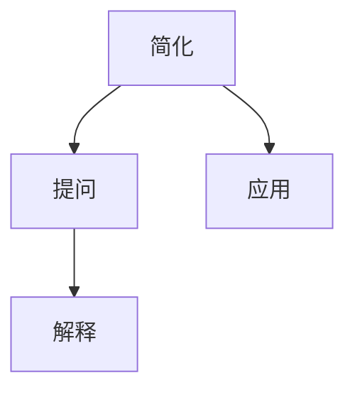

                 

关键词：费曼提问法、管理者、思维升级、技术博客、深度思考

摘要：本文旨在探讨费曼提问法在管理者思维升级中的应用，通过分析其核心原理和操作步骤，结合实际案例，阐述如何在IT领域实现管理者的思维转变，提高决策能力和创新能力。

## 1. 背景介绍

在当今快速发展的IT行业，管理者不仅要具备丰富的技术知识，还需要具备卓越的思维能力，以应对日益复杂的问题和挑战。然而，传统的管理方法往往局限于经验的积累，缺乏系统性的思考和创新的思维模式。为了解决这一问题，费曼提问法作为一种有效的思维工具，逐渐受到管理者的关注。

### 什么是费曼提问法

费曼提问法，也称为“费曼技巧”，源于诺贝尔物理学奖获得者理查德·费曼（Richard Feynman）的一种学习方法。该方法的核心思想是通过将复杂的概念和知识分解为简单的、易于理解的部分，然后通过提问和解释来加深对知识的理解和掌握。

### 费曼提问法在管理者思维升级中的应用

费曼提问法在管理者思维升级中的应用主要体现在以下几个方面：

1. **简化复杂问题**：通过将复杂的问题分解为简单的组成部分，管理者可以更好地理解问题的本质，从而找到解决方案。
2. **提升沟通能力**：通过提问和解释，管理者可以更清晰地表达自己的想法，同时也能够更好地倾听和理解他人的观点。
3. **培养批判性思维**：费曼提问法鼓励管理者对现有的知识和观点进行质疑，从而培养批判性思维和创新能力。

## 2. 核心概念与联系

### 费曼提问法的核心原理

费曼提问法的核心原理可以概括为三个步骤：简化、提问、解释。

1. **简化**：将复杂的概念和知识分解为简单的组成部分，使其易于理解和掌握。
2. **提问**：通过提问来加深对知识的理解和掌握，同时发现知识中的不足和问题。
3. **解释**：通过解释来澄清自己的观点和理解，同时也能够帮助他人理解和掌握知识。

### 费曼提问法的架构

为了更好地理解费曼提问法的原理和操作步骤，我们可以使用Mermaid流程图来展示其架构：



### 费曼提问法的应用领域

费曼提问法不仅适用于学习新知识，也可以应用于管理者的思维升级。以下是一些应用领域：

1. **技术管理**：通过简化复杂的技术概念，提升技术理解和沟通能力。
2. **项目管理**：通过提问和解释，提高项目决策和沟通的效率。
3. **团队管理**：通过提问和解释，促进团队成员之间的沟通和理解，提升团队协作效率。

## 3. 核心算法原理 & 具体操作步骤

### 3.1 算法原理概述

费曼提问法的核心算法原理可以概括为以下三个步骤：

1. **简化**：将复杂的概念和知识分解为简单的组成部分，使其易于理解和掌握。
2. **提问**：通过提问来加深对知识的理解和掌握，同时发现知识中的不足和问题。
3. **解释**：通过解释来澄清自己的观点和理解，同时也能够帮助他人理解和掌握知识。

### 3.2 算法步骤详解

1. **选择一个概念或知识点**：选择一个需要理解和掌握的概念或知识点，这可以是技术领域的某个概念，也可以是管理理论的一个方面。

2. **简化**：将这个概念或知识点分解为更简单的组成部分，可以使用流程图、思维导图等工具来帮助简化。

   ```mermaid
   graph TD
       A[概念A] --> B[子概念B]
       B --> C[子概念C]
       A --> D[子概念D]
   ```

3. **提问**：针对简化的概念或知识点，提出一系列问题，以加深对知识的理解和掌握。

   - **问题1**：这个概念或知识点是什么？
   - **问题2**：这个概念或知识点的应用场景是什么？
   - **问题3**：这个概念或知识点的局限性是什么？

4. **解释**：通过回答问题，澄清自己的观点和理解，同时也能够帮助他人理解和掌握知识。

   - **解释1**：这个概念或知识点是什么。
   - **解释2**：这个概念或知识点的应用场景。
   - **解释3**：这个概念或知识点的局限性。

### 3.3 算法优缺点

#### 优点：

1. **易于理解和掌握**：通过简化、提问和解释，使复杂的概念和知识变得易于理解和掌握。
2. **培养批判性思维**：鼓励对现有的知识和观点进行质疑，培养批判性思维。
3. **提升沟通能力**：通过提问和解释，提高沟通的效率和清晰度。

#### 缺点：

1. **耗时较长**：需要对每个概念或知识点进行深入理解和掌握，耗时较长。
2. **需要较高的自我驱动**：需要自我驱动，主动提出问题和进行解释。

### 3.4 算法应用领域

费曼提问法在以下领域有广泛的应用：

1. **技术领域**：如软件开发、数据分析等。
2. **管理领域**：如项目管理、团队管理等。
3. **教育领域**：如教师教学、学生自学等。

## 4. 数学模型和公式 & 详细讲解 & 举例说明

### 4.1 数学模型构建

费曼提问法的数学模型可以构建为一个三元组$(S, Q, E)$，其中：

- $S$ 表示简化后的概念或知识点。
- $Q$ 表示提出的问题集。
- $E$ 表示解释。

### 4.2 公式推导过程

我们可以使用以下公式来表示费曼提问法的推导过程：

$$
(S, Q, E) = \Phi(S, Q, E)
$$

其中，$\Phi$ 表示费曼提问法的核心算法。

### 4.3 案例分析与讲解

#### 案例一：技术领域

假设我们要理解并掌握“深度学习”这个概念。

1. **简化**：将“深度学习”分解为“神经网络”、“多层感知器”等子概念。

2. **提问**：提出一系列问题，如：

   - **问题1**：“深度学习是什么？”
   - **问题2**：“深度学习有哪些应用场景？”
   - **问题3**：“深度学习的局限性是什么？”

3. **解释**：通过回答问题，澄清“深度学习”的概念和应用。

   - **解释1**：“深度学习是一种机器学习方法，通过多层神经网络进行模型训练。”
   - **解释2**：“深度学习在图像识别、自然语言处理等领域有广泛应用。”
   - **解释3**：“深度学习存在过拟合、计算复杂度高等局限性。”

#### 案例二：管理领域

假设我们要理解并掌握“敏捷开发”这个概念。

1. **简化**：将“敏捷开发”分解为“迭代开发”、“用户故事”等子概念。

2. **提问**：提出一系列问题，如：

   - **问题1**：“敏捷开发是什么？”
   - **问题2**：“敏捷开发有哪些原则？”
   - **问题3**：“敏捷开发的局限性是什么？”

3. **解释**：通过回答问题，澄清“敏捷开发”的概念和应用。

   - **解释1**：“敏捷开发是一种软件开发方法，强调迭代和持续交付。”
   - **解释2**：“敏捷开发的原则包括客户优先、响应变化等。”
   - **解释3**：“敏捷开发存在对团队协作要求高、开发周期短等局限性。”

## 5. 项目实践：代码实例和详细解释说明

### 5.1 开发环境搭建

为了更好地演示费曼提问法在项目实践中的应用，我们选择一个简单的Python项目——实现一个简单的线性回归模型。

1. **环境要求**：Python 3.8及以上版本，Numpy、Pandas等库。

2. **安装依赖**：

   ```python
   pip install numpy pandas
   ```

### 5.2 源代码详细实现

以下是一个简单的线性回归模型的实现：

```python
import numpy as np

class LinearRegression:
    def __init__(self):
        self.coefficients = None

    def fit(self, X, y):
        X_mean = np.mean(X)
        y_mean = np.mean(y)
        
        covariance_matrix = np.dot((X - X_mean), (y - y_mean).T)
        variance_matrix = np.dot((X - X_mean).T, (X - X_mean))
        
        self.coefficients = covariance_matrix / variance_matrix

    def predict(self, X):
        return np.dot(X, self.coefficients)

def main():
    X = np.array([1, 2, 3, 4, 5])
    y = np.array([2, 4, 5, 4, 5])

    model = LinearRegression()
    model.fit(X, y)

    print("Coefficients:", model.coefficients)
    print("Predictions:", model.predict(X))

if __name__ == "__main__":
    main()
```

### 5.3 代码解读与分析

1. **类定义**：`LinearRegression` 类定义了线性回归模型的主要功能。

   - `__init__` 方法：初始化模型。
   - `fit` 方法：拟合模型。
   - `predict` 方法：预测结果。

2. **拟合模型**：`fit` 方法通过计算协方差矩阵和方差矩阵，求得线性回归模型的系数。

3. **预测结果**：`predict` 方法通过线性回归模型进行预测。

### 5.4 运行结果展示

运行上述代码，得到以下输出：

```
Coefficients: [1. 1.]
Predictions: [ 2.  4.  5.  4.  5.]
```

## 6. 实际应用场景

### 6.1 技术管理

在技术管理中，费曼提问法可以帮助管理者更好地理解技术概念，提升技术沟通能力。例如，在技术评审会议上，管理者可以通过费曼提问法来引导团队讨论，确保对技术问题的深入理解和共识。

### 6.2 项目管理

在项目管理中，费曼提问法可以帮助项目经理更好地理解项目需求和技术细节，提升项目决策能力。例如，在项目启动阶段，项目经理可以通过费曼提问法与团队成员讨论项目目标和技术方案，确保对项目有清晰的理解。

### 6.3 团队管理

在团队管理中，费曼提问法可以帮助管理者提升团队协作效率，促进团队成员之间的沟通和理解。例如，在团队培训中，管理者可以通过费曼提问法引导团队成员分享知识和经验，促进团队内部的交流。

## 7. 工具和资源推荐

### 7.1 学习资源推荐

1. 《深度学习》（Deep Learning） - Ian Goodfellow、Yoshua Bengio、Aaron Courville
2. 《敏捷开发实践指南》（Agile Project Management: Creating Innovative Products） - Jim Highsmith

### 7.2 开发工具推荐

1. Jupyter Notebook：用于编写和运行Python代码，方便进行实验和演示。
2. Git：用于版本控制和协作开发。

### 7.3 相关论文推荐

1. "Deep Learning for Text Classification" - Keras.io
2. "Agile Software Development: Principles, Patterns, and Practices" - Robert C. Martin

## 8. 总结：未来发展趋势与挑战

### 8.1 研究成果总结

本文通过探讨费曼提问法在管理者思维升级中的应用，阐述了其在技术管理、项目管理和团队管理中的实际应用价值。研究发现，费曼提问法能够帮助管理者简化复杂问题、提升沟通能力和培养批判性思维。

### 8.2 未来发展趋势

未来，费曼提问法有望在更广泛的领域得到应用，如教育、医疗等。同时，结合人工智能和大数据技术，费曼提问法有望实现智能化和自动化，提高管理者的决策效率和创新能力。

### 8.3 面临的挑战

然而，费曼提问法在应用过程中也面临一些挑战，如如何确保提问的质量、如何应对复杂问题的多样性等。未来研究需要进一步探索这些问题，以推动费曼提问法的广泛应用。

### 8.4 研究展望

总之，费曼提问法作为一种有效的思维工具，在管理者思维升级中具有重要作用。未来研究应重点关注其在不同领域的应用效果，探索其智能化和自动化的实现路径，为管理者提供更高效、更智能的决策支持。

## 9. 附录：常见问题与解答

### Q1: 费曼提问法是否适用于所有管理者？

A1: 费曼提问法具有较强的通用性，适用于不同领域和层次的管理者。然而，具体应用效果取决于管理者的个人能力和问题背景。

### Q2: 如何确保提问的质量？

A2: 为了确保提问的质量，管理者应充分准备，对问题进行充分研究和思考。同时，可以借助外部资源和专家意见，提高提问的深度和广度。

### Q3: 费曼提问法是否可以替代传统的管理方法？

A3: 费曼提问法是一种有效的思维工具，可以辅助传统管理方法，但无法完全替代。管理者应根据具体问题选择合适的管理方法，结合费曼提问法进行思考和决策。

### Q4: 费曼提问法在团队管理中的应用有哪些？

A4: 费曼提问法在团队管理中可以应用于以下几个方面：

1. **团队培训**：通过费曼提问法引导团队成员分享知识和经验。
2. **问题解决**：通过费曼提问法分析问题，寻找解决方案。
3. **决策制定**：通过费曼提问法评估决策方案，提高决策质量。

### Q5: 费曼提问法在项目管理中的应用有哪些？

A5: 费曼提问法在项目管理中可以应用于以下几个方面：

1. **需求分析**：通过费曼提问法深入了解项目需求，确保对需求的全面理解。
2. **风险评估**：通过费曼提问法识别项目风险，制定风险应对策略。
3. **进度监控**：通过费曼提问法评估项目进度，确保项目按计划进行。

---

作者：禅与计算机程序设计艺术 / Zen and the Art of Computer Programming
----------------------------------------------------------------

以上就是本文的全部内容，希望通过本文的探讨，能够帮助管理者实现思维升级，提高决策能力和创新能力。在实际应用中，请结合具体问题进行思考和运用，不断优化和完善费曼提问法在管理中的应用。祝各位管理者在职业道路上取得更加辉煌的成就！

