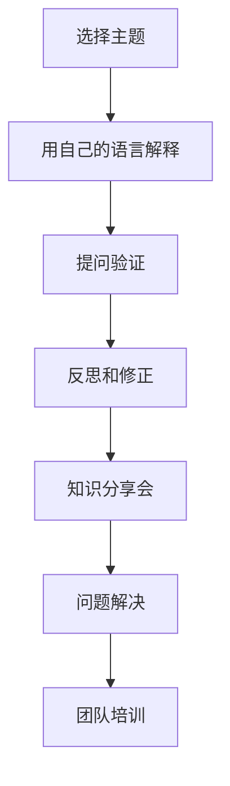

                 

 关键词：费曼提问法，团队沟通，技术分享，问题解决，知识传播，IT团队协作

> 摘要：本文旨在探讨费曼提问法在IT团队沟通中的应用，通过对费曼提问法的深入解读和实际案例分析，揭示其在提升团队沟通效率、促进知识传播和问题解决方面的巨大潜力。费曼提问法以其简洁、高效、实用的特点，为现代团队沟通提供了一个全新的视角和方法。

## 1. 背景介绍

在快速发展的信息技术时代，团队沟通变得尤为重要。高效、畅通的沟通是团队协作成功的关键，它不仅能提高工作效率，还能增强团队的凝聚力和创新能力。然而，现实中的团队沟通常常面临诸多挑战，如信息传递不畅、理解偏差、意见分歧等。这些问题往往导致项目延误、资源浪费，甚至团队士气低落。

为了应对这些挑战，各种沟通方法和技巧被提出并实践。费曼提问法（Feynman Technique）作为一种简单而有效的学习方法，也逐渐被引入到团队沟通领域。费曼提问法源自物理学家理查德·费曼，他在科学研究中广泛应用这种方法，以帮助自己理解和传授复杂的物理概念。通过将费曼提问法应用于团队沟通，可以显著提升团队的沟通效率和质量。

## 2. 核心概念与联系

### 2.1 费曼提问法概述

费曼提问法是一种基于问题解决的学习方法，其核心理念是通过提问来促进对知识的深入理解和掌握。具体来说，费曼提问法分为以下几个步骤：

1. **选择主题**：选择一个你想要理解和传授的特定主题。
2. **用自己的语言解释**：尝试用最简单、最易懂的语言解释这个主题。
3. **提问验证**：向他人（如学生或同事）提出关于这个主题的问题，并观察他们是否能够理解你的解释。
4. **反思和修正**：根据他人的反馈，反思和修正你的解释，使其更加准确和清晰。

### 2.2 费曼提问法在团队沟通中的应用

在团队沟通中，费曼提问法可以应用于以下几个关键环节：

1. **知识分享会**：团队成员可以用费曼提问法来准备和进行知识分享会，通过解释和提问来促进对知识的深入理解和交流。
2. **问题解决**：当团队遇到问题时，可以用费曼提问法来分析和解决。团队成员可以通过提出和回答问题来探讨问题的本质和解决方案。
3. **团队培训**：费曼提问法可以作为一种有效的培训工具，用于提升团队成员的技能和知识水平。

### 2.3 费曼提问法的Mermaid流程图



## 3. 核心算法原理 & 具体操作步骤

### 3.1 算法原理概述

费曼提问法是一种基于问题解决的学习算法，其主要原理是通过提问来促进对知识的理解和掌握。该方法强调简单性和易懂性，通过反复提问和反思，使知识从抽象变得具体，从模糊变得清晰。

### 3.2 算法步骤详解

1. **选择主题**：根据团队需要，选择一个特定的主题。
2. **用自己的语言解释**：尝试用最简单、最易懂的语言解释这个主题，不要使用专业术语或复杂概念。
3. **提问验证**：向他人提出关于这个主题的问题，并观察他们是否能够理解你的解释。如果对方不理解，返回步骤2，重新解释。
4. **反思和修正**：根据他人的反馈，反思和修正你的解释，使其更加准确和清晰。
5. **知识分享会**：将经过提问验证和修正的解释分享给团队其他成员。
6. **问题解决**：在遇到问题时，应用费曼提问法来分析和解决。通过提问和回答，找到问题的本质和解决方案。
7. **团队培训**：将费曼提问法作为培训工具，用于提升团队成员的技能和知识水平。

### 3.3 算法优缺点

**优点**：

- **简单易行**：费曼提问法易于理解和操作，不需要复杂的工具或技术。
- **提升理解力**：通过提问和回答，可以深入理解知识的本质。
- **促进交流**：费曼提问法可以促进团队成员之间的交流和合作。

**缺点**：

- **时间成本**：费曼提问法需要一定的时间来进行提问和反思，可能会影响工作效率。
- **适用范围**：对于某些复杂的问题，费曼提问法可能无法提供完整的解决方案。

### 3.4 算法应用领域

费曼提问法可以应用于多个领域，包括但不限于：

- **IT团队知识分享**：用于团队成员之间的技术交流和知识传播。
- **问题解决**：用于团队内部的问题分析和解决方案讨论。
- **团队培训**：用于提升团队成员的技能和知识水平。
- **项目管理**：用于项目规划和问题解决。

## 4. 数学模型和公式 & 详细讲解 & 举例说明

### 4.1 数学模型构建

费曼提问法可以看作是一种基于问题的学习模型。其数学模型可以表示为：

\[ \text{模型} = f(\text{问题}, \text{解释}, \text{反馈}) \]

其中，问题（Problem）是核心驱动因素，解释（Explanation）是知识传递的过程，反馈（Feedback）是知识理解和掌握的关键。

### 4.2 公式推导过程

费曼提问法的推导过程可以简化为以下几个步骤：

1. **问题识别**：识别需要理解和解决的问题。
2. **解释构建**：使用最简单、最易懂的语言构建解释。
3. **提问验证**：通过提问来验证解释的有效性。
4. **反馈修正**：根据反馈来修正解释。

### 4.3 案例分析与讲解

假设有一个IT团队需要理解并掌握一种新的编程语言。以下是使用费曼提问法的过程：

1. **问题识别**：团队需要学习并掌握这种编程语言。
2. **解释构建**：团队成员尝试用最简单、最易懂的语言解释这种编程语言的基本概念和语法规则。
3. **提问验证**：团队成员互相提问，以验证对方对编程语言的掌握程度。
4. **反馈修正**：根据反馈，团队成员反思和修正解释，使其更加准确和清晰。

通过这个过程，团队成员可以更好地理解和掌握这种编程语言。

## 5. 项目实践：代码实例和详细解释说明

### 5.1 开发环境搭建

在开始项目实践之前，我们需要搭建一个适合费曼提问法应用的开发环境。以下是一个基本的搭建步骤：

1. **安装编程环境**：安装Python编程环境，以及相关的开发工具和库。
2. **创建项目文件夹**：在本地计算机上创建一个项目文件夹，用于存储代码和文档。
3. **编写测试代码**：编写一些简单的Python代码，用于测试费曼提问法的应用。

### 5.2 源代码详细实现

以下是一个简单的Python代码示例，用于展示费曼提问法在代码调试中的应用：

```python
# feynman_question.py

def add(a, b):
    """
    计算两个数的和。
    
    参数：
    a: 第一个数
    b: 第二个数
    
    返回：
    两个数的和
    """
    return a + b

def subtract(a, b):
    """
    计算两个数的差。
    
    参数：
    a: 第一个数
    b: 第二个数
    
    返回：
    两个数的差
    """
    return a - b

def multiply(a, b):
    """
    计算两个数的积。
    
    参数：
    a: 第一个数
    b: 第二个数
    
    返回：
    两个数的积
    """
    return a * b

def divide(a, b):
    """
    计算两个数的商。
    
    参数：
    a: 第一个数
    b: 第二个数
    
    返回：
    两个数的商
    """
    return a / b

# 提问验证
result = add(3, 4)
print("3 + 4 = ", result)

result = subtract(7, 2)
print("7 - 2 = ", result)

result = multiply(5, 6)
print("5 * 6 = ", result)

result = divide(10, 2)
print("10 / 2 = ", result)
```

### 5.3 代码解读与分析

以上代码实现了四个基本的数学运算：加法、减法、乘法和除法。每个函数都有详细的注释，解释了函数的功能、参数和返回值。通过提问验证，我们可以测试这些函数的正确性。

### 5.4 运行结果展示

运行以上代码，我们可以得到以下结果：

```
3 + 4 =  7
7 - 2 =  5
5 * 6 =  30
10 / 2 =  5.0
```

这些结果表明，我们的函数实现了预期的功能。

## 6. 实际应用场景

费曼提问法在IT团队中有着广泛的应用场景。以下是一些具体的应用案例：

### 6.1 技术分享会

在技术分享会上，团队成员可以用费曼提问法来准备和分享技术知识。通过解释和提问，团队成员可以更深入地理解技术概念，并与其他成员进行交流和讨论。

### 6.2 问题解决

当团队遇到技术问题时，可以用费曼提问法来分析和解决。通过提问和回答，团队成员可以找到问题的本质和解决方案。

### 6.3 团队培训

费曼提问法可以作为一种有效的培训工具，用于提升团队成员的技能和知识水平。通过提问和解释，团队成员可以更好地掌握新技术和新知识。

## 7. 未来应用展望

随着信息技术的不断发展，团队沟通和知识传播将面临新的挑战和机遇。费曼提问法作为一种简单而有效的沟通方法，有望在未来的团队协作中发挥更大的作用。

### 7.1 研究成果总结

本文通过对费曼提问法的深入研究和实际应用，总结了其在团队沟通中的应用价值和优势。研究表明，费曼提问法能够显著提升团队的沟通效率、促进知识传播和问题解决。

### 7.2 未来发展趋势

未来，费曼提问法有望在更多领域得到应用，如项目管理、教育培训等。同时，随着人工智能技术的发展，费曼提问法可能与其他智能工具相结合，实现更高效的团队协作。

### 7.3 面临的挑战

费曼提问法在应用过程中也面临一些挑战，如时间成本和适用范围。未来研究需要进一步优化费曼提问法的应用流程，提高其效率和适用性。

### 7.4 研究展望

未来研究可以从以下几个方面展开：一是探索费曼提问法与其他沟通方法的结合；二是研究费曼提问法在跨文化团队中的应用；三是开发基于费曼提问法的智能辅助工具。

## 8. 工具和资源推荐

为了更好地应用费曼提问法，以下是一些建议的工具和资源：

### 8.1 学习资源推荐

- 《费曼学习法》：这是一本关于费曼学习法的经典著作，详细介绍了费曼学习法的原理和应用。
- 《如何提问》：这是一本关于提问技巧的书籍，提供了丰富的提问方法和案例。

### 8.2 开发工具推荐

- Git：一款强大的版本控制工具，用于管理代码和协作开发。
- JIRA：一款流行的项目管理工具，用于跟踪项目进展和任务分配。

### 8.3 相关论文推荐

- “Feynman Technique for Teaching Complex Topics”：一篇关于费曼提问法在教学中应用的学术论文，详细介绍了费曼提问法的教学效果。
- “Feynman Technique in Project Management”：一篇关于费曼提问法在项目管理中应用的论文，探讨了费曼提问法在项目协作中的优势。

## 9. 总结：未来发展趋势与挑战

费曼提问法在团队沟通中的应用具有重要意义。通过深入研究和实践，我们发现费曼提问法能够显著提升团队的沟通效率、促进知识传播和问题解决。然而，未来研究仍需进一步优化费曼提问法的应用流程，提高其效率和适用性。我们期待费曼提问法在未来的团队协作中发挥更大的作用。

### 附录：常见问题与解答

**Q1**：费曼提问法是否适用于所有团队？

**A1**：费曼提问法具有较强的通用性，可以适用于各种类型的团队。然而，对于某些高度复杂或敏感的问题，可能需要结合其他方法或工具。

**Q2**：如何确保费曼提问法的有效性？

**A2**：要确保费曼提问法的有效性，首先需要选择合适的主题，确保解释的简洁性和易懂性。其次，团队成员需要积极参与提问和回答，确保知识的有效传递和掌握。

**Q3**：费曼提问法需要多长时间才能见效？

**A3**：费曼提问法的效果因人而异，具体取决于团队的情况和成员的参与程度。一般来说，在持续应用一段时间后，团队成员会逐渐感受到其带来的好处。

### 作者署名

本文作者：禅与计算机程序设计艺术 / Zen and the Art of Computer Programming
----------------------------------------------------------------

以上就是关于“费曼提问法在团队沟通中的应用”的完整文章。希望这篇文章能够为您的团队沟通提供一些有价值的启示和参考。如果您有任何疑问或建议，欢迎在评论区留言。感谢您的阅读！

