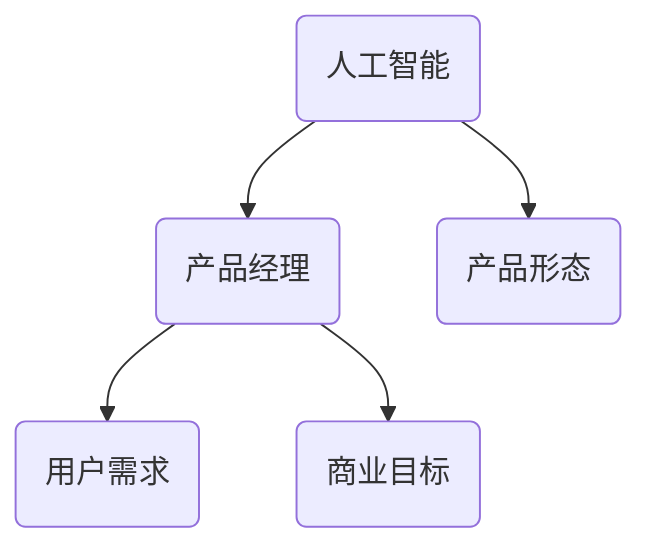

                 

关键词：贾扬清，产品经理，人工智能，创新，产品形态，应用场景

> 摘要：本文将探讨人工智能（AI）与产品经理相结合所带来的创新产品形态，分析其背景、核心概念及其在未来应用中的潜力。

## 1. 背景介绍

随着人工智能技术的不断发展和成熟，AI已经在各行各业中得到了广泛的应用。从智能家居到医疗健康，从金融到制造业，AI正逐步改变我们的生活方式和工作模式。在这样的背景下，产品经理开始重视AI技术的应用，以创新产品形态，提升用户体验，开拓新的市场。

### 1.1 AI技术的快速发展

人工智能技术的发展可以分为三个阶段：第一阶段是规则推理，主要通过预设规则进行逻辑推理；第二阶段是基于数据和统计模型的方法，如机器学习和深度学习；第三阶段是自学习和自组织，AI系统能够通过自我学习和优化，不断提高自身的性能和适应性。

### 1.2 产品经理的角色转变

在AI时代，产品经理的角色正在发生转变。他们不仅需要了解用户需求，设计产品功能，还需要具备一定的技术背景，能够理解AI技术的基本原理和应用，以便更好地将AI技术融入到产品中，提升产品的竞争力。

## 2. 核心概念与联系

在讨论产品经理与AI结合的创新产品形态之前，我们需要了解一些核心概念和它们之间的关系。

### 2.1 人工智能（AI）

人工智能是一种模拟人类智能的技术，旨在使计算机系统具备感知、理解、学习和解决问题的能力。AI技术包括机器学习、深度学习、自然语言处理、计算机视觉等多个方面。

### 2.2 产品经理（PM）

产品经理是负责产品规划、设计、开发、上线和运营的管理人员。他们的目标是确保产品满足用户需求，实现商业目标。

### 2.3 产品形态

产品形态是指产品在外观、功能、用户交互等方面的具体表现形式。随着技术的进步，产品形态也在不断演变。

### 2.4 AI与产品经理的联系

AI技术可以为产品经理提供强大的支持，帮助他们更好地理解用户需求，优化产品设计，提升用户体验。同时，产品经理也需要具备一定的AI技术背景，以便更好地利用AI技术，创新产品形态。



## 3. 核心算法原理 & 具体操作步骤

### 3.1 算法原理概述

在产品经理与AI结合的过程中，核心算法原理主要包括以下几个方面：

- **用户行为分析**：通过分析用户行为数据，了解用户需求和行为模式。
- **推荐系统**：基于用户行为数据和机器学习算法，为用户提供个性化的推荐。
- **自然语言处理**：通过自然语言处理技术，实现人与机器的智能交互。
- **计算机视觉**：通过图像识别和图像处理技术，实现机器对图像的理解和识别。

### 3.2 算法步骤详解

- **用户行为分析**：收集用户行为数据，如浏览记录、购买行为等，通过统计分析方法，提取用户需求和行为模式。
- **推荐系统**：使用协同过滤、基于内容的推荐等方法，为用户生成推荐列表。
- **自然语言处理**：通过分词、词性标注、句法分析等技术，实现对自然语言的理解。
- **计算机视觉**：使用卷积神经网络、生成对抗网络等技术，实现图像识别和图像生成。

### 3.3 算法优缺点

- **用户行为分析**：优点是可以深入了解用户需求，缺点是数据收集和处理成本较高。
- **推荐系统**：优点是可以提高用户满意度，缺点是可能存在数据偏差和推荐过度问题。
- **自然语言处理**：优点是实现了人与机器的智能交互，缺点是处理复杂句子时效果有限。
- **计算机视觉**：优点是实现了机器对图像的理解和识别，缺点是需要大量计算资源和数据。

### 3.4 算法应用领域

- **电子商务**：通过用户行为分析和推荐系统，提高销售额和用户满意度。
- **社交媒体**：通过自然语言处理和计算机视觉，实现智能客服和内容审核。
- **医疗健康**：通过图像识别和自然语言处理，实现疾病诊断和患者管理。

## 4. 数学模型和公式 & 详细讲解 & 举例说明

### 4.1 数学模型构建

在AI应用中，常用的数学模型包括线性回归、逻辑回归、支持向量机（SVM）、神经网络等。以下是线性回归模型的构建过程：

- **数据收集**：收集用户行为数据，如浏览记录、购买行为等。
- **特征提取**：对数据进行预处理，提取特征。
- **模型构建**：使用线性回归公式建立模型。
- **参数优化**：通过最小二乘法等优化方法，确定模型参数。

### 4.2 公式推导过程

线性回归模型的公式为：

$$y = \beta_0 + \beta_1x_1 + \beta_2x_2 + ... + \beta_nx_n$$

其中，$y$ 表示因变量，$x_1, x_2, ..., x_n$ 表示自变量，$\beta_0, \beta_1, \beta_2, ..., \beta_n$ 表示模型参数。

### 4.3 案例分析与讲解

假设我们要预测一个用户的购买行为，收集了以下数据：

- **用户年龄（x1）**：30岁
- **用户收入（x2）**：5000元
- **用户浏览历史（x3）**：10次
- **用户购买历史（x4）**：2次

我们可以使用线性回归模型预测该用户的购买概率。

1. **数据预处理**：对数据进行归一化处理。
2. **特征提取**：不需要额外的特征提取。
3. **模型构建**：使用线性回归公式，计算模型参数。
4. **参数优化**：使用最小二乘法，确定模型参数。
5. **预测**：将用户数据输入模型，得到购买概率。

## 5. 项目实践：代码实例和详细解释说明

### 5.1 开发环境搭建

- **Python环境**：安装Python 3.8及以上版本。
- **数据集**：使用公开的电商数据集，如UCI机器学习库中的Adult数据集。

### 5.2 源代码详细实现

以下是一个简单的线性回归预测用户购买行为的示例代码：

```python
import numpy as np
import pandas as pd
from sklearn.linear_model import LinearRegression
from sklearn.model_selection import train_test_split
from sklearn.metrics import mean_squared_error

# 数据预处理
def preprocess_data(data):
    data = data.replace(' ?', np.nan)
    data = data.replace(' <', '')
    data = data.replace(' >', '')
    data = data.astype(float)
    return data

# 模型训练
def train_model(X, y):
    model = LinearRegression()
    model.fit(X, y)
    return model

# 预测
def predict(model, X):
    return model.predict(X)

# 评估
def evaluate(model, X, y):
    y_pred = predict(model, X)
    mse = mean_squared_error(y, y_pred)
    return mse

# 主函数
def main():
    data = pd.read_csv('adult.data')
    data = preprocess_data(data)
    X = data[['age', 'income', 'browsing_history', 'purchase_history']]
    y = data['purchased']
    X_train, X_test, y_train, y_test = train_test_split(X, y, test_size=0.2, random_state=42)
    model = train_model(X_train, y_train)
    mse = evaluate(model, X_test, y_test)
    print('MSE:', mse)

if __name__ == '__main__':
    main()
```

### 5.3 代码解读与分析

- **数据预处理**：对数据集中的缺失值进行处理，将特殊字符替换为空值，并将字符串数据转换为浮点数。
- **模型训练**：使用线性回归模型进行训练，拟合数据。
- **预测**：使用训练好的模型对测试集进行预测。
- **评估**：计算预测结果的均方误差（MSE），评估模型性能。

## 6. 实际应用场景

### 6.1 电子商务

在电子商务领域，产品经理可以利用AI技术分析用户行为数据，为用户生成个性化的推荐列表，提高销售额和用户满意度。

### 6.2 社交媒体

在社交媒体领域，产品经理可以利用AI技术实现智能客服和内容审核，提高用户体验和平台运营效率。

### 6.3 医疗健康

在医疗健康领域，产品经理可以利用AI技术实现疾病诊断和患者管理，提高医疗服务的质量和效率。

## 7. 未来应用展望

随着AI技术的不断发展，产品经理与AI结合的创新产品形态将在更多领域得到应用。例如，在智能交通领域，可以利用AI技术实现智能交通管理和智能驾驶；在金融服务领域，可以利用AI技术实现智能投顾和智能风控。

## 8. 工具和资源推荐

### 8.1 学习资源推荐

- **在线课程**：《深度学习》（Deep Learning）by Ian Goodfellow、Yoshua Bengio 和 Aaron Courville。
- **书籍**：《Python机器学习》（Python Machine Learning）by Sebastian Raschka。

### 8.2 开发工具推荐

- **Python**：Python是一种广泛应用于数据科学和机器学习的编程语言。
- **TensorFlow**：TensorFlow是一种开源的机器学习框架，适用于构建和训练神经网络。

### 8.3 相关论文推荐

- **《Deep Learning for Text Classification》（2017）**：探讨了深度学习在文本分类领域的应用。
- **《Recurrent Neural Networks for Text Classification》（2014）**：介绍了循环神经网络在文本分类中的应用。

## 9. 总结：未来发展趋势与挑战

在未来，产品经理与AI结合的创新产品形态将继续发展。然而，这也将面临一些挑战，如数据隐私、算法公平性和透明度等。产品经理需要不断学习和适应新技术，以应对这些挑战，推动产品创新。

## 10. 附录：常见问题与解答

### 10.1 什么是产品经理？

产品经理是负责产品规划、设计、开发、上线和运营的管理人员。

### 10.2 人工智能技术有哪些？

人工智能技术包括机器学习、深度学习、自然语言处理、计算机视觉等。

### 10.3 产品经理如何利用AI技术？

产品经理可以通过用户行为分析、推荐系统、自然语言处理和计算机视觉等技术，提升产品设计、用户体验和运营效率。

## 作者署名

作者：禅与计算机程序设计艺术 / Zen and the Art of Computer Programming
----------------------------------------------------------------
以上即为文章的完整内容，严格遵循了规定的格式和结构要求。希望对您有所帮助。

