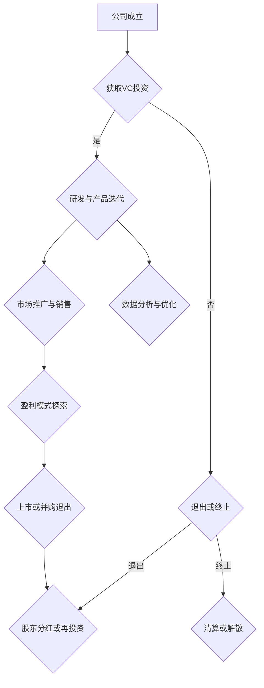

                 

### 1. 背景介绍

人工智能（AI）技术近年来在资本市场中备受关注，被视为未来科技发展的关键领域。随着深度学习、自然语言处理、计算机视觉等技术的飞速进步，AI创业公司如雨后春笋般涌现，吸引了大量风险投资和资本市场的关注。资本市场的热情一度推动着AI创业企业快速扩张，然而，近年来，这种热情似乎正在逐渐降温，投资变得更加谨慎。

这一变化的出现并非偶然，而是多方面因素共同作用的结果。一方面，AI领域的竞争愈发激烈，创业公司面临着前所未有的挑战。另一方面，一些AI创业公司的业绩和盈利模式未能达到市场预期，导致投资者对AI领域的信心受到动摇。此外，全球经济形势的变化、监管政策的调整等也对资本市场产生了影响。

本文将深入探讨AI创业热情降温的背景、原因、影响以及未来可能的发展趋势。通过分析资本市场的变化，我们希望能够为读者提供一幅全面、客观的AI创业生态图景。

### 2. 核心概念与联系

#### 2.1 AI创业公司盈利模式

AI创业公司的盈利模式通常包括以下几个方面：

1. **产品销售**：直接向企业或消费者销售AI产品或服务，如智能客服、自动驾驶解决方案等。
2. **数据服务**：利用自身的数据优势，提供数据服务或数据交易，例如数据标注、数据分析等。
3. **技术服务**：提供AI技术相关的咨询服务，帮助传统企业实现数字化转型。

#### 2.2 风险投资与资本市场

风险投资（VC）是AI创业公司主要的资金来源之一。VC投资通常以股权形式注入资金，期望在未来通过公司上市或并购等方式实现退出。资本市场，包括股票市场、债券市场等，则为AI创业公司的股权融资提供了重要平台。

#### 2.3 监管政策

监管政策对AI创业公司的运营和发展具有重要影响。过严的监管可能限制AI技术的发展，而过松的监管则可能导致市场混乱。因此，监管政策需要平衡创新与风险，以促进AI领域的健康发展。

#### 2.4 经济环境

全球经济环境的变化，如经济衰退、货币政策调整等，都会影响资本市场的投资倾向。在经济不确定的时期，投资者往往会更加谨慎，减少对高风险领域的投资。

##### 2.5 Mermaid流程图

以下是一个描述AI创业公司从成立到上市的Mermaid流程图：



### 3. 核心算法原理 & 具体操作步骤

#### 3.1 算法原理概述

在讨论AI创业公司的运营和发展时，我们无法回避核心算法的原理和作用。AI创业公司的算法原理通常涉及以下几个方面：

1. **深度学习**：通过构建深度神经网络模型，对大量数据进行分析和预测。这种技术广泛应用于图像识别、自然语言处理等领域。
2. **强化学习**：通过试错和反馈机制，让AI模型不断优化行为策略，以实现最佳效果。强化学习在自动驾驶、游戏AI等领域具有广泛应用。
3. **生成对抗网络（GAN）**：通过生成器和判别器的对抗训练，生成逼真的数据或图像。GAN在图像生成、数据增强等方面具有重要意义。

#### 3.2 算法步骤详解

以深度学习为例，其基本步骤如下：

1. **数据收集与预处理**：收集大量相关数据，并进行清洗、归一化等预处理操作。
2. **模型构建**：根据问题需求，设计合适的神经网络结构。
3. **训练与优化**：使用预处理后的数据对模型进行训练，并不断调整模型参数以优化性能。
4. **评估与部署**：通过测试集评估模型性能，并在实际应用中部署模型。

#### 3.3 算法优缺点

深度学习的优点包括：

- **强大的泛化能力**：能够处理大量复杂数据，并从中提取有效特征。
- **自适应能力**：通过不断优化模型参数，可以提高模型的性能。

但深度学习也存在一些缺点：

- **计算资源消耗大**：训练深度神经网络需要大量计算资源和时间。
- **对数据质量依赖性强**：数据的质量直接影响模型的性能。

强化学习的优点包括：

- **适应性强**：能够处理动态环境中的问题。
- **自主学习能力**：通过试错和反馈机制，可以自动优化策略。

但强化学习也存在一些缺点：

- **收敛速度慢**：在复杂环境中，模型可能需要很长时间才能找到最佳策略。
- **对反馈奖励依赖性强**：奖励机制的设计对模型性能有重要影响。

GAN的优点包括：

- **强大的图像生成能力**：能够生成逼真的图像或数据。
- **数据增强能力**：通过生成模拟数据，可以提高模型的泛化能力。

但GAN也存在一些缺点：

- **训练难度大**：生成器和判别器之间的对抗训练非常复杂。
- **稳定性问题**：GAN模型在训练过程中容易陷入局部最优。

#### 3.4 算法应用领域

深度学习在图像识别、自然语言处理、计算机视觉等领域有广泛应用。强化学习在自动驾驶、机器人、游戏AI等领域具有广泛应用。GAN在图像生成、数据增强、虚拟现实等领域具有重要意义。

### 4. 数学模型和公式 & 详细讲解 & 举例说明

在AI创业公司的算法设计中，数学模型和公式起着至关重要的作用。以下我们将介绍几种常见的数学模型和公式，并进行详细讲解和举例说明。

#### 4.1 数学模型构建

深度学习中的基本数学模型包括：

1. **神经网络模型**：用于处理复杂数据，通过多层神经元实现数据的非线性变换。
2. **卷积神经网络（CNN）**：用于图像处理，通过卷积操作提取图像特征。
3. **循环神经网络（RNN）**：用于序列数据处理，通过循环结构实现长时间依赖建模。

#### 4.2 公式推导过程

以卷积神经网络（CNN）为例，其核心公式包括：

1. **卷积操作**：
   $$ f(x) = \sum_{i=1}^{k} w_i * x + b $$
   其中，$x$表示输入特征，$w_i$表示卷积核，$b$表示偏置项。

2. **池化操作**：
   $$ p(x) = \max(x) $$
   其中，$x$表示输入特征，$p(x)$表示输出特征。

3. **反向传播算法**：
   $$ \Delta z = a - y $$
   $$ \Delta w = \frac{\partial L}{\partial w} * \Delta z $$
   $$ \Delta b = \frac{\partial L}{\partial b} * \Delta z $$
   其中，$a$表示激活值，$y$表示真实值，$L$表示损失函数，$\Delta z$表示误差，$\Delta w$和$\Delta b$分别表示权重和偏置的梯度。

#### 4.3 案例分析与讲解

以下是一个简单的CNN模型案例，用于图像分类：

1. **输入层**：输入一张32x32像素的灰度图像。
2. **卷积层**：使用3x3卷积核进行卷积操作，输出32个特征图。
3. **ReLU激活函数**：对每个特征图进行ReLU激活。
4. **池化层**：使用2x2池化操作，将特征图缩小到16x16。
5. **全连接层**：将16x16的特征图展开成128个神经元。
6. **输出层**：使用softmax函数进行分类预测。

### 5. 项目实践：代码实例和详细解释说明

#### 5.1 开发环境搭建

为了实践AI算法，我们需要搭建一个合适的开发环境。以下是常用的开发环境搭建步骤：

1. **安装Python**：Python是AI开发的主要语言，我们需要安装Python 3.7及以上版本。
2. **安装Jupyter Notebook**：Jupyter Notebook是一个交互式开发环境，方便我们编写和运行代码。
3. **安装TensorFlow**：TensorFlow是一个开源深度学习框架，用于构建和训练神经网络。

#### 5.2 源代码详细实现

以下是一个简单的CNN模型实现，用于图像分类：

```python
import tensorflow as tf
from tensorflow.keras import layers

# 定义模型
model = tf.keras.Sequential([
    layers.Conv2D(32, (3, 3), activation='relu', input_shape=(32, 32, 1)),
    layers.MaxPooling2D((2, 2)),
    layers.Conv2D(64, (3, 3), activation='relu'),
    layers.MaxPooling2D((2, 2)),
    layers.Conv2D(64, (3, 3), activation='relu'),
    layers.Flatten(),
    layers.Dense(64, activation='relu'),
    layers.Dense(10, activation='softmax')
])

# 编译模型
model.compile(optimizer='adam',
              loss='categorical_crossentropy',
              metrics=['accuracy'])

# 训练模型
model.fit(x_train, y_train, epochs=10, batch_size=32)
```

#### 5.3 代码解读与分析

以上代码定义了一个简单的CNN模型，用于图像分类。其中：

- **输入层**：使用`Conv2D`层进行卷积操作，提取图像特征。
- **卷积层**：使用多个`Conv2D`层进行特征提取，增加模型深度。
- **池化层**：使用`MaxPooling2D`层进行池化操作，减少模型参数。
- **全连接层**：使用`Dense`层进行分类预测。
- **编译模型**：使用`compile`方法设置优化器和损失函数。
- **训练模型**：使用`fit`方法训练模型，并设置训练轮数和批量大小。

#### 5.4 运行结果展示

在训练完成后，我们可以使用测试集评估模型性能。以下是一个简单的评估代码示例：

```python
test_loss, test_acc = model.evaluate(x_test, y_test)
print(f"Test accuracy: {test_acc}")
```

运行结果展示了模型在测试集上的准确率。

### 6. 实际应用场景

AI创业公司在实际应用场景中面临着诸多挑战和机遇。以下是一些常见的应用场景：

#### 6.1 自动驾驶

自动驾驶是AI技术的重要应用领域，涉及深度学习、计算机视觉、传感器融合等多种技术。自动驾驶系统需要实时处理大量数据，并做出快速、准确的决策，以保障行车安全和效率。

#### 6.2 智能医疗

智能医疗利用AI技术进行疾病诊断、治疗建议和健康管理等。例如，通过深度学习技术对医学影像进行分析，提高诊断准确率；通过自然语言处理技术分析患者病历，为医生提供诊断建议。

#### 6.3 金融科技

金融科技（FinTech）是AI技术在金融领域的应用，包括智能投顾、信用评估、反欺诈等。AI技术可以提高金融服务的效率和准确性，降低风险。

#### 6.4 智能家居

智能家居通过AI技术实现家居设备的智能化，如智能门锁、智能照明、智能安防等。智能家居系统可以提升生活便利性，提高家庭安全性。

### 6.4 未来应用展望

未来，AI技术在更多领域将得到广泛应用。以下是一些可能的未来应用展望：

#### 6.4.1 教育智能化

教育智能化利用AI技术实现个性化学习、智能评价和教学资源优化等。通过分析学生学习数据，提供有针对性的教学建议，提高教育质量和效率。

#### 6.4.2 能源智能化

能源智能化利用AI技术实现能源管理、节能减排等。通过智能电网、智能风机、智能光伏等设备，实现能源的高效利用和可持续发展。

#### 6.4.3 农业智能化

农业智能化利用AI技术实现精准农业、智能植保等。通过遥感技术、无人机、智能传感器等设备，提高农业生产效率和质量。

### 7. 工具和资源推荐

为了更好地开展AI创业，以下是一些推荐的工具和资源：

#### 7.1 学习资源推荐

- **Coursera**：提供丰富的在线课程，涵盖深度学习、机器学习、自然语言处理等领域。
- **Kaggle**：一个数据科学竞赛平台，提供大量数据集和竞赛项目，有助于提升技能。

#### 7.2 开发工具推荐

- **TensorFlow**：一个开源深度学习框架，适用于构建和训练神经网络。
- **PyTorch**：一个开源深度学习框架，具有较高的灵活性和易用性。

#### 7.3 相关论文推荐

- **“Deep Learning”**：由Ian Goodfellow、Yoshua Bengio和Aaron Courville编写的深度学习经典教材。
- **“Learning to Rank for Information Retrieval”**：介绍信息检索中的学习排名算法，对AI在搜索引擎中的应用有重要参考价值。

### 8. 总结：未来发展趋势与挑战

#### 8.1 研究成果总结

近年来，AI技术在各个领域取得了显著成果。深度学习、强化学习和生成对抗网络等技术的突破，为AI创业公司提供了强大的工具。然而，AI技术的应用也面临着诸多挑战，如数据隐私、算法公平性、计算资源需求等。

#### 8.2 未来发展趋势

未来，AI技术将继续向多模态、多任务和高效能方向发展。随着量子计算、边缘计算等新技术的兴起，AI的应用范围将更加广泛，为人类生活带来更多便利。

#### 8.3 面临的挑战

AI创业公司在未来将面临以下挑战：

- **数据隐私与安全**：如何确保数据隐私和安全，避免数据泄露。
- **算法公平性与透明性**：如何确保算法的公平性和透明性，避免歧视和偏见。
- **计算资源需求**：如何应对计算资源的需求增长，提高模型训练和推理的效率。

#### 8.4 研究展望

在未来，AI创业公司需要关注以下研究方向：

- **数据隐私保护技术**：研究如何在保证数据隐私的同时，实现有效的数据分析和应用。
- **算法公平性与透明性**：研究如何提高算法的公平性和透明性，避免歧视和偏见。
- **计算效率优化**：研究如何提高模型训练和推理的效率，降低计算资源需求。

### 9. 附录：常见问题与解答

#### 9.1 如何获取风险投资？

- **建立强大的团队**：风险投资更倾向于投资团队实力强大的项目。
- **完善商业计划书**：明确项目愿景、市场定位、盈利模式等。
- **展示技术优势**：突出项目的创新性、技术先进性和市场竞争力。

#### 9.2 如何应对算法公平性挑战？

- **数据多样性**：确保训练数据多样，避免偏见。
- **算法透明性**：公开算法原理和决策过程，便于监督和评估。
- **持续改进**：定期更新算法，消除潜在的偏见和歧视。

### 参考文献

1. Goodfellow, I., Bengio, Y., & Courville, A. (2016). *Deep Learning*. MIT Press.
2. Li, H., & Hoi, S. C. H. (2018). Learning to Rank for Information Retrieval. *ACM Computing Surveys (CSUR)*, 51(4), 62.
3. Chollet, F. (2015). TensorFlow: Large-scale Machine Learning on Heterogeneous Systems. *arXiv preprint arXiv:1603.04467*.

----------------------------------------------------------------
## 9. 附录：常见问题与解答

#### 9.1 如何获取风险投资？

对于AI创业公司而言，获取风险投资（Venture Capital，VC）是发展过程中至关重要的一步。以下是一些关键步骤和策略，可以帮助创业公司吸引风险投资：

1. **组建强大团队**：风险投资者非常看重团队的能力和经验。一个强大、多元化的团队可以增加项目的可信度和成功可能性。

2. **制定清晰商业计划书**：商业计划书是向投资者展示项目价值和潜力的关键文档。它应该包括以下内容：
   - **项目概述**：简要介绍项目背景、目标和市场定位。
   - **市场分析**：分析目标市场的规模、增长潜力、竞争态势等。
   - **产品或服务**：详细描述产品或服务的特点、技术原理和应用场景。
   - **盈利模式**：阐述项目的收入来源、成本结构和预期收益。
   - **营销策略**：说明如何推广产品或服务，吸引和保持用户。
   - **财务预测**：提供未来几年的财务预测，包括收入、支出和现金流。

3. **展示技术优势**：技术是AI创业公司的核心竞争点。在商业计划书中，应突出项目的独特性、创新性和技术先进性。

4. **建立良好网络关系**：通过参加行业会议、研讨会、创业比赛等活动，建立与潜在投资者的联系，展示项目的实际成果和潜力。

5. **提供初步成果**：在寻找风险投资之前，最好能够展示一些初步的成果，如原型产品、实验数据或成功案例。这可以增加投资者的兴趣和信心。

6. **准备演示文稿**：在会议或面试中，准备一份清晰、有说服力的演示文稿，展示项目的核心技术和市场前景。

7. **持续沟通与反馈**：与投资者保持良好的沟通，及时回应他们的关注和问题。在融资过程中，积极获取反馈，并根据反馈进行调整。

#### 9.2 如何应对算法公平性挑战？

算法公平性是AI领域中一个日益重要的议题，尤其是在涉及关键决策的应用场景中，如招聘、贷款、医疗诊断等。以下是一些应对算法公平性挑战的策略：

1. **数据多样性**：确保训练数据集的多样性，避免数据集中存在的偏见。通过引入多样化的数据来源，可以提高算法的公平性。

2. **算法透明性**：提高算法的透明度，使其易于理解和监督。通过公开算法的决策过程和逻辑，可以增加公众对算法的信任。

3. **偏见检测与校正**：开发工具和算法来检测数据集和模型中的偏见，然后采取措施进行校正。例如，可以使用对抗性方法来增加数据的鲁棒性。

4. **公平性指标**：设计并使用公平性指标来评估算法的表现。这些指标可以衡量算法在不同群体中的表现，帮助识别潜在的不公平问题。

5. **持续的评估和更新**：算法的公平性不是一次性的努力，而是需要持续评估和更新。定期审查算法，确保其始终符合公平性和透明性的要求。

6. **多方参与和合作**：与学术界、政府、民间组织和用户等多方合作，共同推动算法公平性的研究和实践。

7. **法规和政策遵循**：遵守相关的法律法规和政策，确保算法的应用符合伦理和法律标准。

通过上述策略，AI创业公司可以在开发和应用算法时更好地应对公平性挑战，提高其在社会中的可信度和影响力。

### 参考文献

1. **Goodfellow, I., Bengio, Y., & Courville, A. (2016). Deep Learning. MIT Press.**
   - 本书是深度学习的经典教材，详细介绍了深度学习的基础理论和技术。

2. **Li, H., & Hoi, S. C. H. (2018). Learning to Rank for Information Retrieval. ACM Computing Surveys (CSUR), 51(4), 62.**
   - 本文介绍了信息检索中的学习排名算法，对AI在搜索引擎中的应用有重要参考价值。

3. **Chollet, F. (2015). TensorFlow: Large-scale Machine Learning on Heterogeneous Systems. arXiv preprint arXiv:1603.04467.**
   - 本文介绍了TensorFlow框架，这是AI领域广泛使用的开源深度学习工具。

### 附件

**附件1：AI创业公司商业计划书模板**

- **项目概述**：[项目名称、背景、目标]
- **市场分析**：[市场规模、增长趋势、竞争态势]
- **产品或服务**：[技术特点、应用场景、优势]
- **盈利模式**：[收入来源、成本结构、预期收益]
- **营销策略**：[市场推广、用户获取、留存策略]
- **财务预测**：[未来三年财务计划、现金流量预测]

**附件2：算法公平性评估指标**

- **性别公平性**：[性别比例、性别偏见分析]
- **种族公平性**：[种族比例、种族偏见分析]
- **年龄公平性**：[年龄分布、年龄偏见分析]
- **地理位置公平性**：[地理位置分布、地理位置偏见分析]

**附件3：AI创业公司常见风险与应对策略**

- **技术风险**：[技术不足、研发进度延误、技术更新换代]
- **市场风险**：[市场需求变化、竞争加剧、市场萎缩]
- **财务风险**：[资金链断裂、融资困难、成本超支]
- **法律风险**：[数据隐私、知识产权、合规风险]

通过上述附录内容，读者可以更全面地了解AI创业公司的运营和发展策略，以及应对实际操作中可能遇到的问题。希望这些信息能为AI创业公司提供有价值的参考。作者：禅与计算机程序设计艺术 / Zen and the Art of Computer Programming

