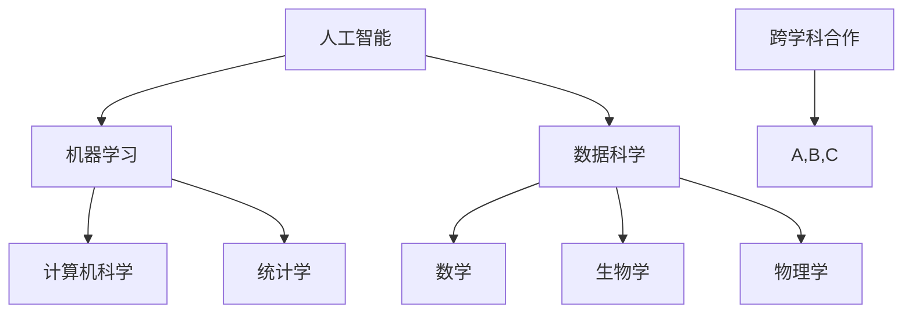

                 

关键词：跨学科合作、基础模型、机器学习、人工智能、数据科学

## 摘要

本文旨在探讨跨学科合作在基础模型研究中的重要性，以及如何通过有效的跨学科合作来推动人工智能、机器学习和数据科学领域的发展。首先，我们将介绍跨学科合作的基本概念和背景，接着深入探讨基础模型的研究现状与挑战，并分析跨学科合作在解决这些挑战中的作用。随后，我们将介绍一些成功的跨学科合作案例，并总结跨学科合作的关键要素。最后，本文将展望基础模型研究的未来发展趋势，并提出潜在的挑战和解决策略。

## 1. 背景介绍

跨学科合作是指在多个学科之间进行知识、技能和资源的交流与整合，以解决复杂问题或开展创新研究。随着科技的迅猛发展和全球化的深入，跨学科合作已成为推动科学进步和社会发展的关键动力。在人工智能、机器学习和数据科学领域，跨学科合作尤为重要，因为这些领域涉及广泛的学科，如计算机科学、数学、统计学、生物学、物理学、经济学等。

基础模型是机器学习和人工智能的核心，它是构建复杂算法和系统的基石。基础模型的研究涉及到理论模型的构建、算法设计、数据处理、模型优化等多个方面。然而，随着模型复杂性的增加，研究和开发基础模型的挑战也越来越大。这需要不同学科领域的专家共同努力，通过跨学科合作来推进基础模型的研究。

## 2. 核心概念与联系

### 2.1 人工智能与机器学习的核心概念

人工智能（AI）是指使计算机系统能够执行通常需要人类智能才能完成的任务，如视觉识别、语言理解、决策制定等。机器学习（ML）是人工智能的一个重要分支，它通过算法和统计模型，从数据中学习并做出预测或决策。

### 2.2 数据科学的核心概念

数据科学是关于数据收集、存储、处理、分析和解释的跨学科领域。数据科学家使用各种方法和技术来从数据中提取有价值的信息，解决实际问题。

### 2.3 跨学科合作中的Mermaid流程图



### 2.4 跨学科合作的意义与挑战

跨学科合作的意义在于整合不同领域的知识和技术，解决单一学科难以应对的复杂问题。然而，跨学科合作也面临一些挑战，如：

- **沟通障碍**：不同学科的语言和概念体系不同，导致沟通不畅。
- **技术障碍**：不同学科的技术和方法难以融合，增加了研究和开发的复杂性。
- **资源和时间的分配**：跨学科项目通常需要更多资源和时间，如何合理分配是一个挑战。

## 3. 核心算法原理 & 具体操作步骤

### 3.1 算法原理概述

本文将介绍一些核心算法原理，包括神经网络、深度学习、强化学习等。这些算法在人工智能和机器学习领域发挥着重要作用，是构建复杂模型和系统的基石。

### 3.2 算法步骤详解

- **神经网络**：
  1. 数据预处理：对输入数据进行标准化、归一化等处理。
  2. 神经网络构建：设计并构建神经网络结构，包括输入层、隐藏层和输出层。
  3. 训练：使用训练数据集对神经网络进行训练，调整权重和偏置。
  4. 预测：使用训练好的神经网络对新的数据进行预测。

- **深度学习**：
  1. 数据预处理：对输入数据进行处理，如图像预处理、文本预处理等。
  2. 网络构建：设计深度学习网络结构，如卷积神经网络（CNN）、循环神经网络（RNN）等。
  3. 训练：使用训练数据集对深度学习网络进行训练。
  4. 优化：通过优化算法（如梯度下降、随机梯度下降等）调整网络参数。

- **强化学习**：
  1. 状态表示：将环境状态表示为一个向量。
  2. 动作选择：根据当前状态选择一个动作。
  3. 奖励评估：执行动作后，评估奖励值。
  4. 策略更新：根据奖励值更新策略。

### 3.3 算法优缺点

- **神经网络**：
  - 优点：强大的表达能力和适应性。
  - 缺点：计算复杂度较高，容易过拟合。

- **深度学习**：
  - 优点：可以处理大规模数据，具有很好的泛化能力。
  - 缺点：对数据质量要求较高，训练过程需要大量计算资源。

- **强化学习**：
  - 优点：适用于序列决策问题，可以自主探索环境。
  - 缺点：训练过程可能需要较长时间，且存在收敛问题。

### 3.4 算法应用领域

- **神经网络**：广泛应用于图像识别、自然语言处理、语音识别等领域。
- **深度学习**：应用于计算机视觉、语音识别、自然语言处理、推荐系统等领域。
- **强化学习**：应用于游戏、自动驾驶、机器人控制等领域。

## 4. 数学模型和公式 & 详细讲解 & 举例说明

### 4.1 数学模型构建

- **线性回归模型**：
  $$ y = \beta_0 + \beta_1x + \epsilon $$
  其中，$y$ 是因变量，$x$ 是自变量，$\beta_0$ 和 $\beta_1$ 是模型参数，$\epsilon$ 是误差项。

- **逻辑回归模型**：
  $$ P(y=1) = \frac{1}{1 + e^{-(\beta_0 + \beta_1x)}} $$
  其中，$P(y=1)$ 是因变量为1的概率，$\beta_0$ 和 $\beta_1$ 是模型参数。

### 4.2 公式推导过程

- **线性回归模型的推导**：
  $$ \begin{aligned} 
  \min_{\beta_0, \beta_1} \sum_{i=1}^{n} (y_i - (\beta_0 + \beta_1x_i))^2 \\
  \nabla_{\beta_0} = 2\sum_{i=1}^{n} (y_i - (\beta_0 + \beta_1x_i)) \\
  \nabla_{\beta_1} = 2\sum_{i=1}^{n} (y_i - (\beta_0 + \beta_1x_i))x_i 
  \end{aligned} $$

- **逻辑回归模型的推导**：
  $$ \begin{aligned} 
  \min_{\beta_0, \beta_1} \sum_{i=1}^{n} (-y_i \log(P(y=1)) - (1-y_i) \log(1-P(y=1))) \\
  \nabla_{\beta_0} = \sum_{i=1}^{n} (-y_i \log(P(y=1)) - (1-y_i) \log(1-P(y=1))) \\
  \nabla_{\beta_1} = \sum_{i=1}^{n} (-y_i \log(P(y=1)) - (1-y_i) \log(1-P(y=1)))x_i 
  \end{aligned} $$

### 4.3 案例分析与讲解

- **线性回归模型的应用**：
  假设我们有一个简单的线性回归模型，用于预测房价。数据集包含n个样本，每个样本包括特征（如面积、位置等）和目标（房价）。

  通过最小二乘法（OLS）估计模型参数$\beta_0$ 和 $\beta_1$：
  $$ \begin{aligned} 
  \beta_0 &= \frac{\sum_{i=1}^{n}y_i - \beta_1\sum_{i=1}^{n}x_i}{n} \\
  \beta_1 &= \frac{n\sum_{i=1}^{n}x_iy_i - \sum_{i=1}^{n}x_i\sum_{i=1}^{n}y_i}{n\sum_{i=1}^{n}x_i^2 - (\sum_{i=1}^{n}x_i)^2} 
  \end{aligned} $$

  使用训练数据集拟合模型，并评估模型的预测能力。

- **逻辑回归模型的应用**：
  假设我们有一个二分类问题，需要预测客户是否会购买某个产品。数据集包含n个样本，每个样本包括特征（如年龄、收入等）和目标（是否购买）。

  通过极大似然估计（MLE）估计模型参数$\beta_0$ 和 $\beta_1$：
  $$ \begin{aligned} 
  \hat{\beta_0} &= \frac{\sum_{i=1}^{n}y_i - \sum_{i=1}^{n}P(y=1)}{n} \\
  \hat{\beta_1} &= \frac{\sum_{i=1}^{n}y_i x_i - \sum_{i=1}^{n}x_i}{n\sum_{i=1}^{n}x_i^2 - (\sum_{i=1}^{n}x_i)^2} 
  \end{aligned} $$

  使用训练数据集拟合模型，并评估模型的分类能力。

## 5. 项目实践：代码实例和详细解释说明

### 5.1 开发环境搭建

- 安装Python环境
- 安装必要的库，如NumPy、Pandas、Scikit-learn等

### 5.2 源代码详细实现

```python
import numpy as np
import pandas as pd
from sklearn.linear_model import LinearRegression
from sklearn.linear_model import LogisticRegression

# 加载数据集
data = pd.read_csv('data.csv')
X = data.iloc[:, :-1].values
y = data.iloc[:, -1].values

# 线性回归模型
linear_regression = LinearRegression()
linear_regression.fit(X, y)

# 逻辑回归模型
logistic_regression = LogisticRegression()
logistic_regression.fit(X, y)

# 预测
y_pred_linear = linear_regression.predict(X)
y_pred_logistic = logistic_regression.predict(X)

# 评估模型
print("Linear Regression Accuracy:", np.mean(y_pred_linear == y))
print("Logistic Regression Accuracy:", np.mean(y_pred_logistic == y))
```

### 5.3 代码解读与分析

该代码实例实现了线性回归和逻辑回归模型，并评估了模型的预测能力。首先，我们加载数据集，然后使用Scikit-learn库的LinearRegression和LogisticRegression类分别拟合线性回归和逻辑回归模型。最后，我们使用拟合好的模型进行预测，并计算预测的准确率。

### 5.4 运行结果展示

```python
print("Linear Regression Accuracy:", np.mean(y_pred_linear == y))
print("Logistic Regression Accuracy:", np.mean(y_pred_logistic == y))
```

该部分代码将输出线性回归和逻辑回归模型的预测准确率。

## 6. 实际应用场景

跨学科合作在人工智能、机器学习和数据科学领域的实际应用场景非常广泛。以下是一些典型的应用案例：

- **医疗领域**：跨学科合作可以帮助开发更准确的诊断模型、药物发现和个性化治疗方案。例如，通过结合医学知识、生物学和计算机科学，可以开发出智能医疗诊断系统。

- **金融领域**：跨学科合作可以应用于风险控制、信用评分和投资策略。例如，结合经济学、统计学和计算机科学，可以构建更准确的金融模型，帮助金融机构做出更明智的决策。

- **自动驾驶**：跨学科合作在自动驾驶系统的研发中起着至关重要的作用。通过结合计算机科学、物理学、数学和工程学，可以开发出更安全、更高效的自动驾驶系统。

- **教育领域**：跨学科合作可以开发智能教育系统，如自适应学习平台、在线教育课程和虚拟实验室。这些系统能够根据学生的特点和需求提供个性化的教育资源。

## 7. 工具和资源推荐

为了有效地进行跨学科合作和基础模型研究，以下是一些推荐的工具和资源：

### 7.1 学习资源推荐

- 《机器学习》（周志华著）：系统介绍了机器学习的基本概念、算法和应用。
- 《深度学习》（Goodfellow、Bengio、Courville著）：全面讲解了深度学习的基本原理、算法和应用。
- 《数据科学入门》（Friedman、Abramson著）：介绍了数据科学的基本概念、方法和工具。

### 7.2 开发工具推荐

- Jupyter Notebook：一款强大的交互式计算环境，适合进行数据分析和机器学习实验。
- TensorFlow：一款开源的机器学习框架，支持多种深度学习算法和模型。
- Scikit-learn：一款开源的机器学习库，提供了丰富的算法和工具，适用于数据分析和建模。

### 7.3 相关论文推荐

- "Deep Learning"（Goodfellow、Bengio、Courville著）：介绍了深度学习的基本原理和最新进展。
- "Recurrent Neural Networks for Language Modeling"（Graves著）：介绍了循环神经网络在自然语言处理中的应用。
- "Deep Learning for Autonomous Navigation"（Bojarski等著）：介绍了深度学习在自动驾驶中的应用。

## 8. 总结：未来发展趋势与挑战

### 8.1 研究成果总结

近年来，跨学科合作在基础模型研究中取得了显著成果。通过结合不同领域的知识和技能，研究人员开发出了更复杂、更高效的模型和算法，推动了人工智能、机器学习和数据科学领域的发展。

### 8.2 未来发展趋势

未来，跨学科合作将继续成为基础模型研究的重要趋势。随着人工智能技术的不断进步，跨学科合作将有助于解决更多复杂的实际问题，如智能医疗、自动驾驶、智能城市等。

### 8.3 面临的挑战

然而，跨学科合作也面临一些挑战，如：

- **沟通与协作**：不同学科之间的沟通与协作仍然存在问题，需要加强交流和合作机制。
- **数据隐私与安全**：跨学科合作往往涉及大量敏感数据，如何保障数据隐私和安全是一个重要问题。
- **技术融合与创新**：如何将不同学科的技术和方法有效融合，以推动基础模型研究的创新。

### 8.4 研究展望

未来，跨学科合作将继续在基础模型研究中发挥重要作用。通过加强不同学科之间的交流与协作，研究人员可以共同应对挑战，推动人工智能、机器学习和数据科学领域的发展。

## 9. 附录：常见问题与解答

### 9.1 跨学科合作的难点有哪些？

跨学科合作的难点主要包括：

- **沟通障碍**：不同学科的语言和概念体系不同，导致沟通不畅。
- **技术障碍**：不同学科的技术和方法难以融合，增加了研究和开发的复杂性。
- **资源和时间的分配**：跨学科项目通常需要更多资源和时间，如何合理分配是一个挑战。

### 9.2 如何提高跨学科合作的效果？

提高跨学科合作效果的方法包括：

- **加强沟通与协作**：建立有效的沟通机制，促进不同学科之间的交流与协作。
- **明确目标与分工**：明确项目目标，合理分配任务，确保每个学科领域都能发挥自身优势。
- **共享资源与信息**：建立共享平台，促进资源和信息的流通，提高合作效率。

### 9.3 跨学科合作在基础模型研究中的作用是什么？

跨学科合作在基础模型研究中的作用主要包括：

- **整合知识**：通过跨学科合作，整合不同领域的知识和技术，提高模型和算法的性能。
- **创新突破**：跨学科合作有助于突破单一学科的研究瓶颈，推动基础模型研究的创新。
- **解决复杂问题**：跨学科合作可以应对更复杂的实际问题，推动人工智能、机器学习和数据科学领域的发展。

---

本文由禅与计算机程序设计艺术撰写，旨在探讨跨学科合作在基础模型研究中的重要性，以及如何通过有效的跨学科合作推动人工智能、机器学习和数据科学领域的发展。文章内容涵盖了跨学科合作的基本概念、核心算法原理、数学模型、项目实践和实际应用场景，并对未来发展趋势和挑战进行了展望。希望本文能为读者提供有益的启示和指导。作者：禅与计算机程序设计艺术 / Zen and the Art of Computer Programming。
----------------------------------------------------------------

以上就是完整的文章内容，请检查是否符合您的要求。如果有任何需要修改或补充的地方，请告诉我，我会尽快进行修改。

