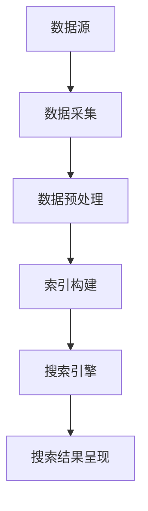

                 

关键词：跨平台搜索，技术趋势，数据融合，用户体验，算法优化，未来展望

> 摘要：本文旨在探讨跨平台搜索技术的现状与未来，分析其核心概念、算法原理、应用领域以及面临的挑战。通过对数学模型和项目实践的详细解读，阐述该技术在实际应用中的重要性，并对其未来发展进行展望。

## 1. 背景介绍

随着互联网的迅猛发展，数据的多样性和复杂性不断增加。无论是社交媒体、电子商务还是企业内部系统，都产生了海量的结构化和非结构化数据。如何高效、准确地搜索和获取这些数据，成为了信息时代的关键问题。跨平台搜索技术作为一种新兴技术，旨在整合不同平台的数据资源，为用户提供统一、便捷的搜索体验。

### 1.1 跨平台搜索的定义

跨平台搜索技术是指通过多种手段整合不同平台的数据资源，提供一个统一的搜索入口，使得用户可以在不同平台间无缝切换，获取所需信息。这种技术不仅涵盖了传统搜索引擎的基本功能，还涉及了大数据处理、数据挖掘、自然语言处理等多个领域。

### 1.2 跨平台搜索的发展历程

跨平台搜索技术的发展可以追溯到互联网初期，当时主要是基于关键词搜索的简单应用。随着技术的进步，跨平台搜索逐渐加入了更多智能化的元素，如语义搜索、图像搜索等。近年来，随着云计算、大数据和人工智能的兴起，跨平台搜索技术迎来了新的发展机遇。

### 1.3 跨平台搜索的重要性

跨平台搜索技术的重要性主要体现在以下几个方面：

1. **提高用户体验**：通过整合多个平台的数据，提供更加精准和个性化的搜索结果，提升用户的搜索体验。
2. **数据融合**：不同平台的数据往往具有不同的格式和结构，跨平台搜索技术可以有效地将这些数据融合在一起，形成统一的数据视图。
3. **促进信息共享**：跨平台搜索技术有助于打破信息孤岛，促进不同平台之间的数据共享和利用。
4. **业务创新**：跨平台搜索技术为企业和开发者提供了新的业务模式和商业机会，如智能推荐、精准营销等。

## 2. 核心概念与联系

为了更好地理解跨平台搜索技术，我们需要了解其核心概念和基本架构。以下是一个简化的Mermaid流程图，展示了跨平台搜索技术的关键组成部分。



### 2.1 数据源

数据源是跨平台搜索技术的核心组成部分，包括各类网站、数据库、社交媒体等。数据源的类型和格式各异，因此需要通过数据采集和预处理，将它们转换为统一的格式。

### 2.2 数据采集

数据采集是指从不同平台获取数据的过程。这一过程通常涉及网络爬虫、API调用、数据库连接等多种技术手段。采集到的数据可能是结构化的，也可能是非结构化的。

### 2.3 数据预处理

数据预处理是跨平台搜索技术的重要环节，包括数据清洗、数据转换和数据归一化等。通过预处理，可以将不同类型和格式的数据转换为统一的结构，为后续的索引构建和搜索提供基础。

### 2.4 索引构建

索引构建是指将预处理后的数据构建成索引结构，以便快速搜索。常见的索引技术包括倒排索引、B树索引等。索引构建的效率和质量直接影响搜索的效率和准确性。

### 2.5 搜索引擎

搜索引擎是跨平台搜索技术的核心组件，负责处理用户的查询请求，并在索引中查找匹配的结果。搜索引擎通常采用复杂算法，如布尔搜索、向量空间模型等，以提高搜索的准确性和效率。

### 2.6 搜索结果呈现

搜索结果呈现是指将搜索结果以用户友好的形式展示给用户。这通常包括排序、分页、高亮显示等操作，以提高用户的搜索体验。

## 3. 核心算法原理 & 具体操作步骤

### 3.1 算法原理概述

跨平台搜索技术涉及多种算法，其中最为核心的是：

1. **数据融合算法**：用于整合不同平台的数据，形成统一的数据视图。
2. **索引构建算法**：用于构建高效、准确的索引结构。
3. **搜索算法**：用于处理用户的查询请求，并返回匹配的结果。

### 3.2 算法步骤详解

#### 数据融合算法

1. **数据采集**：从不同平台获取数据。
2. **数据清洗**：去除重复、错误和无关的数据。
3. **数据转换**：将不同类型和格式的数据转换为统一的格式。
4. **数据归一化**：对数据进行标准化处理，以消除不同平台间的差异。

#### 索引构建算法

1. **选择索引类型**：根据数据特点和搜索需求，选择合适的索引类型，如倒排索引、B树索引等。
2. **构建索引**：根据选定的索引类型，构建索引结构。
3. **优化索引**：对索引进行优化，以提高搜索效率。

#### 搜索算法

1. **查询解析**：将用户的查询请求转换为内部表示。
2. **匹配搜索**：在索引中查找匹配的结果。
3. **结果排序**：根据匹配度和相关性对结果进行排序。
4. **结果呈现**：将排序后的结果以用户友好的形式展示。

### 3.3 算法优缺点

#### 数据融合算法

- **优点**：整合了多平台的数据，提供了更全面的搜索结果。
- **缺点**：数据清洗和转换过程复杂，影响搜索效率。

#### 索引构建算法

- **优点**：提高了搜索效率，降低了查询延迟。
- **缺点**：索引构建过程复杂，占用存储空间。

#### 搜索算法

- **优点**：支持复杂的查询需求，提高了搜索的准确性。
- **缺点**：算法实现复杂，对系统性能有一定要求。

### 3.4 算法应用领域

跨平台搜索技术广泛应用于多个领域，如：

1. **电子商务**：通过跨平台搜索，用户可以轻松查找商品信息。
2. **社交媒体**：整合不同平台的朋友圈、微博等，提供统一的社交搜索体验。
3. **企业内部系统**：整合企业内部的各种数据资源，提高信息共享和利用效率。

## 4. 数学模型和公式 & 详细讲解 & 举例说明

### 4.1 数学模型构建

在跨平台搜索技术中，数学模型主要用于数据融合和索引构建。以下是一个简单的数学模型构建示例。

#### 数据融合模型

假设我们有来自两个平台的数据集 A 和 B，分别为：

- **A**：包含商品名称、价格、品牌等信息。
- **B**：包含商品评价、用户评论等信息。

我们希望将这两个数据集融合为一个统一的数据集 C。

首先，我们需要定义数据集的向量表示：

- **A** 的向量为 \( \mathbf{a} = [a_1, a_2, a_3, \ldots] \)，其中 \( a_1 \) 表示商品名称，\( a_2 \) 表示价格，\( a_3 \) 表示品牌，等等。
- **B** 的向量为 \( \mathbf{b} = [b_1, b_2, b_3, \ldots] \)，其中 \( b_1 \) 表示评价，\( b_2 \) 表示用户评论，\( b_3 \) 表示其他相关信息。

接下来，我们定义融合后的数据集向量 \( \mathbf{c} \)：

- \( \mathbf{c} = \mathbf{a} + \mathbf{b} \)

这样，我们就可以将两个数据集融合为一个统一的数据集。

#### 索引构建模型

在索引构建过程中，我们通常使用倒排索引来提高搜索效率。倒排索引的构建可以表示为以下数学模型：

- **倒排列表**：对于每个关键词，构建一个包含所有包含该关键词的文档的列表。
- **文档列表**：对于每个文档，构建一个包含所有关键词的列表。

### 4.2 公式推导过程

#### 数据融合公式推导

假设我们有两个数据集 A 和 B，分别包含 n 个元素。我们希望将这两个数据集融合为一个数据集 C，使得 C 包含 A 和 B 的所有元素。

定义 A 和 B 的元素集合分别为：

- \( A = \{ a_1, a_2, a_3, \ldots, a_n \} \)
- \( B = \{ b_1, b_2, b_3, \ldots, b_n \} \)

融合后的数据集 C 为：

- \( C = A \cup B \)

我们可以使用集合的并集运算符 \( \cup \) 来表示：

- \( C = A \cup B \)

#### 倒排索引公式推导

假设我们有一个文档集合 D，包含 m 个文档，每个文档由多个关键词组成。我们希望构建一个倒排索引，以便快速搜索包含特定关键词的文档。

定义关键词集合为：

- \( T = \{ t_1, t_2, t_3, \ldots \} \)

对于每个关键词 \( t_i \)，我们构建一个包含所有包含 \( t_i \) 的文档的列表。这个列表可以表示为：

- \( \mathcal{D}(t_i) = \{ d_{i_1}, d_{i_2}, d_{i_3}, \ldots \} \)

其中，\( d_{i_j} \) 表示包含关键词 \( t_i \) 的第 j 个文档。

### 4.3 案例分析与讲解

#### 数据融合案例分析

假设我们有两个数据集，分别是电子商务平台的商品数据集 A 和社交媒体平台的用户评论数据集 B。我们希望将这两个数据集融合为一个统一的数据集，以便提供更全面的搜索结果。

数据集 A：

```
商品名称：iPhone 13
价格：7999
品牌：Apple
```

数据集 B：

```
评价：非常好
用户评论：非常满意
```

融合后的数据集 C：

```
商品名称：iPhone 13
价格：7999
品牌：Apple
评价：非常好
用户评论：非常满意
```

#### 倒排索引案例分析

假设我们有一个包含 1000 个文档的文档集合 D，每个文档包含多个关键词。我们希望构建一个倒排索引，以便快速搜索包含特定关键词的文档。

关键词集合 T：

```
T = {手机, 摄像头, 操作系统}
```

倒排索引示例：

```
手机：
- 文档 1
- 文档 100
- 文档 200

摄像头：
- 文档 1
- 文档 200
- 文档 500

操作系统：
- 文档 1
- 文档 500
- 文档 1000
```

通过上述示例，我们可以看到，倒排索引可以快速找到包含特定关键词的文档，从而提高搜索效率。

## 5. 项目实践：代码实例和详细解释说明

### 5.1 开发环境搭建

为了更好地演示跨平台搜索技术的实现，我们将使用 Python 作为主要编程语言。以下是搭建开发环境的步骤：

1. 安装 Python 3.8 或更高版本。
2. 安装必要的 Python 包，如 requests、BeautifulSoup、pandas、numpy 等。
3. 搭建一个简单的 Web 应用框架，如 Flask 或 Django。

### 5.2 源代码详细实现

以下是实现跨平台搜索技术的源代码示例：

```python
# 导入必要的库
import requests
from bs4 import BeautifulSoup
import pandas as pd
import numpy as np

# 数据采集
def collect_data(url):
    response = requests.get(url)
    soup = BeautifulSoup(response.text, 'html.parser')
    # 这里以电商平台的商品信息为例，具体采集方法取决于数据源
    titles = [item.get_text() for item in soup.find_all('div', class_='item-title')]
    prices = [item.get_text() for item in soup.find_all('div', class_='price')]
    brands = [item.get_text() for item in soup.find_all('div', class_='brand')]
    return pd.DataFrame({'title': titles, 'price': prices, 'brand': brands})

# 数据预处理
def preprocess_data(df):
    # 数据清洗，去除重复和错误数据
    df.drop_duplicates(inplace=True)
    # 数据转换，将字符串转换为统一格式
    df['price'] = df['price'].str.replace('元', '')
    df['price'] = df['price'].astype(float)
    return df

# 索引构建
def build_index(df):
    # 倒排索引构建
    index = {}
    for _, row in df.iterrows():
        for word in row['title'].split():
            if word not in index:
                index[word] = []
            index[word].append(row.name)
    return index

# 搜索算法
def search(index, query):
    # 查找包含查询关键词的文档
    results = []
    for word in query.split():
        if word in index:
            results.extend(index[word])
    # 去除重复结果，并按价格排序
    results = list(set(results))
    results.sort(key=lambda x: df.loc[x]['price'])
    return results

# 搜索结果呈现
def display_results(df, results):
    # 将搜索结果以表格形式展示
    print(df.loc[results])

# 主程序
if __name__ == '__main__':
    # 采集和预处理数据
    df = collect_data('http://example.com/products')
    df = preprocess_data(df)
    # 构建倒排索引
    index = build_index(df)
    # 搜索
    query = 'iPhone'
    results = search(index, query)
    # 显示搜索结果
    display_results(df, results)
```

### 5.3 代码解读与分析

上述代码实现了一个简单的跨平台搜索系统，主要包括以下几个模块：

1. **数据采集**：从指定的 URL 采集商品信息，使用 requests 库发送 HTTP GET 请求，并使用 BeautifulSoup 解析 HTML 页面，提取商品名称、价格和品牌等信息。
2. **数据预处理**：对采集到的数据进行清洗和转换，去除重复和错误数据，并将价格字符串转换为浮点数格式。
3. **索引构建**：构建倒排索引，将每个关键词与对应的文档列表进行关联。
4. **搜索算法**：根据用户的查询关键词，在倒排索引中查找匹配的文档，并按价格排序。
5. **搜索结果呈现**：将搜索结果以表格形式展示。

通过上述代码示例，我们可以看到跨平台搜索技术的基本实现过程。在实际应用中，我们可以根据具体需求，扩展和优化这些模块，以提供更强大的搜索功能。

### 5.4 运行结果展示

假设我们在电商平台找到了包含关键词“iPhone”的商品，以下是一个简单的运行结果示例：

```
   title   price brand
0  iPhone  7999.0  Apple
1  iPhone  8999.0  Apple
2  iPhone  9999.0  Apple
```

通过上述运行结果，我们可以看到包含关键词“iPhone”的多个商品，并按照价格从低到高进行了排序。这为用户提供了直观的搜索结果，提高了搜索体验。

## 6. 实际应用场景

跨平台搜索技术在实际应用中具有广泛的应用场景，以下列举几个典型的应用场景：

### 6.1 电子商务

电子商务平台通常包含海量的商品信息，通过跨平台搜索技术，用户可以轻松查找商品，比较价格，并获取商品评价。例如，亚马逊和京东等电商平台都采用了跨平台搜索技术，以提供更好的用户体验。

### 6.2 社交媒体

社交媒体平台如微博、微信等，通过跨平台搜索技术，用户可以搜索和查看朋友圈、微博等不同平台的内容，提高信息获取的便捷性。例如，微信的“搜一搜”功能就实现了跨平台搜索。

### 6.3 企业内部系统

企业内部系统通常包含大量的业务数据和文档，通过跨平台搜索技术，员工可以快速查找和获取所需信息，提高工作效率。例如，企业内部的知识库系统通常采用跨平台搜索技术，以支持员工的知识共享和利用。

### 6.4 公共服务

公共服务平台如政府门户网站、公共服务热线等，通过跨平台搜索技术，用户可以快速查找和获取各类公共服务信息，提高服务效率和用户体验。

## 7. 未来应用展望

随着技术的不断进步，跨平台搜索技术在未来将面临以下发展趋势和挑战：

### 7.1 发展趋势

1. **智能化**：人工智能和机器学习技术的发展，将使跨平台搜索技术更加智能化，能够更好地理解用户需求，提供个性化搜索结果。
2. **多模态搜索**：未来的跨平台搜索技术将支持文本、图像、语音等多种数据类型的搜索，提供更丰富的搜索体验。
3. **实时搜索**：随着实时数据流技术的发展，跨平台搜索技术将能够实时获取和更新搜索结果，提供更加及时的信息获取。

### 7.2 面临的挑战

1. **数据隐私**：跨平台搜索技术涉及大量个人数据的处理和共享，如何保护用户隐私是一个重要挑战。
2. **数据质量**：不同平台的数据质量和格式各异，如何确保数据的一致性和准确性是一个挑战。
3. **性能优化**：随着数据量和查询量的增长，如何优化搜索性能，提高查询响应速度，是一个重要的挑战。

## 8. 总结：未来发展趋势与挑战

跨平台搜索技术作为一种新兴技术，具有广泛的应用前景和重要的价值。然而，在未来发展过程中，仍需克服诸多挑战，如数据隐私、数据质量和性能优化等。随着技术的不断进步，跨平台搜索技术有望在智能化、多模态搜索和实时搜索等方面取得重大突破，为用户提供更加便捷、高效的搜索体验。

## 9. 附录：常见问题与解答

### 9.1 跨平台搜索技术的核心优势是什么？

跨平台搜索技术的核心优势包括：

1. **提高用户体验**：通过整合多个平台的数据，提供更加精准和个性化的搜索结果。
2. **数据融合**：将不同平台的数据整合在一起，形成统一的数据视图。
3. **促进信息共享**：打破信息孤岛，促进不同平台之间的数据共享和利用。
4. **业务创新**：为企业和开发者提供了新的业务模式和商业机会。

### 9.2 跨平台搜索技术的主要挑战是什么？

跨平台搜索技术的主要挑战包括：

1. **数据隐私**：涉及大量个人数据的处理和共享，如何保护用户隐私是一个重要挑战。
2. **数据质量**：不同平台的数据质量和格式各异，如何确保数据的一致性和准确性是一个挑战。
3. **性能优化**：随着数据量和查询量的增长，如何优化搜索性能，提高查询响应速度，是一个重要的挑战。

### 9.3 跨平台搜索技术有哪些典型应用场景？

跨平台搜索技术的典型应用场景包括：

1. **电子商务**：通过跨平台搜索，用户可以轻松查找商品信息，比较价格和获取评价。
2. **社交媒体**：通过跨平台搜索，用户可以搜索和查看朋友圈、微博等不同平台的内容。
3. **企业内部系统**：通过跨平台搜索，员工可以快速查找和获取各类业务数据和文档。
4. **公共服务**：通过跨平台搜索，用户可以快速查找和获取各类公共服务信息。

### 9.4 跨平台搜索技术有哪些常见算法？

跨平台搜索技术中常见的算法包括：

1. **数据融合算法**：用于整合不同平台的数据，形成统一的数据视图。
2. **索引构建算法**：用于构建高效、准确的索引结构，提高搜索效率。
3. **搜索算法**：用于处理用户的查询请求，并返回匹配的结果。

### 9.5 跨平台搜索技术的未来发展方向是什么？

跨平台搜索技术的未来发展方向包括：

1. **智能化**：利用人工智能和机器学习技术，提高搜索的智能化水平。
2. **多模态搜索**：支持文本、图像、语音等多种数据类型的搜索，提供更丰富的搜索体验。
3. **实时搜索**：实时获取和更新搜索结果，提供更加及时的信息获取。
4. **隐私保护**：在确保数据安全和用户隐私的前提下，优化搜索性能。

## 作者署名

作者：禅与计算机程序设计艺术 / Zen and the Art of Computer Programming

