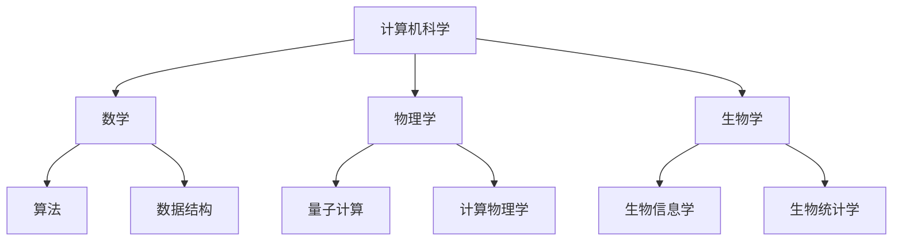

                 

关键词：计算科学、多元化应用、跨学科研究、技术创新

> 摘要：本文旨在探讨人类计算技术在各个学科领域的多元化应用，分析计算科学在生物医学、金融科技、人工智能、环境科学等领域的突破与挑战，揭示计算方法在推动人类文明进步中的关键作用。

## 1. 背景介绍

随着科技的飞速发展，计算科学已经渗透到人类生活的各个领域。从最初的计算机编程，到复杂的数据分析，再到人工智能和机器学习的应用，计算科学正在不断改变我们的工作方式和生活习惯。然而，传统的计算方法往往局限于某一特定领域，难以满足多元化需求。为了推动科技进步和社会发展，有必要探索如何跨越学科边界，实现计算技术的多元化应用。

## 2. 核心概念与联系

### 2.1 计算科学的基本概念

计算科学是一门研究计算方法和计算技术的学科，它涵盖了计算机科学、数学、物理学、生物学等多个领域。计算科学的基本概念包括算法、数据结构、并行计算、分布式计算等。

### 2.2 跨学科研究的必要性

跨学科研究是推动计算科学发展的关键。通过跨学科合作，可以充分发挥不同领域的优势，解决单一学科难以解决的问题。例如，生物医学领域需要计算科学提供精确的数据分析和模型预测，而金融科技领域则依赖计算方法进行风险管理。

### 2.3 Mermaid 流程图



## 3. 核心算法原理 & 具体操作步骤

### 3.1 算法原理概述

计算科学的核心是算法。一个优秀的算法可以高效地解决复杂问题，提升计算效率。算法原理主要包括以下几个方面：

- **问题建模**：将实际问题转化为数学模型。
- **算法设计**：设计求解数学模型的算法。
- **算法分析**：分析算法的时空复杂度，评估算法性能。

### 3.2 算法步骤详解

算法步骤一般包括以下几个阶段：

1. **输入处理**：接收和处理输入数据。
2. **问题转化**：将输入数据转化为数学模型。
3. **算法求解**：执行算法，求解数学模型。
4. **结果输出**：输出算法求解结果。

### 3.3 算法优缺点

算法优缺点主要包括以下几个方面：

- **时间复杂度**：算法执行的时间长短。
- **空间复杂度**：算法占用的内存空间。
- **稳定性**：算法在处理异常输入时的稳定性。

### 3.4 算法应用领域

算法应用领域广泛，包括但不限于：

- **生物医学**：基因测序、药物设计、医学图像处理。
- **金融科技**：风险评估、量化交易、金融模型。
- **人工智能**：机器学习、深度学习、自然语言处理。
- **环境科学**：气候变化预测、污染监测、生态系统建模。

## 4. 数学模型和公式 & 详细讲解 & 举例说明

### 4.1 数学模型构建

数学模型构建是计算科学的核心任务之一。以下是构建数学模型的基本步骤：

1. **问题定义**：明确需要解决的问题。
2. **变量定义**：定义问题中的变量。
3. **关系建立**：建立变量之间的关系。
4. **模型求解**：求解数学模型，获得问题解。

### 4.2 公式推导过程

公式推导过程是数学模型构建的关键。以下是推导公式的常用方法：

- **归纳法**：通过已知实例归纳出一般公式。
- **反证法**：通过反证法证明公式的正确性。
- **反演法**：通过已知公式推导出新公式。

### 4.3 案例分析与讲解

以下是一个简单的数学模型例子：求解一元二次方程的根。

```latex
ax^2 + bx + c = 0
$$
x = \frac{-b \pm \sqrt{b^2 - 4ac}}{2a}
$$
```

通过代入不同的系数 a、b、c，可以求解出方程的根。这个简单的例子展示了数学模型构建的基本过程和公式推导方法。

## 5. 项目实践：代码实例和详细解释说明

### 5.1 开发环境搭建

为了演示计算技术在项目中的应用，我们将使用 Python 作为开发语言，搭建一个简单的计算科学项目。

```bash
# 安装 Python
pip install python
```

### 5.2 源代码详细实现

以下是一个使用 Python 实现的简单计算科学项目，它实现了求解一元二次方程的根。

```python
import math

def solve_equation(a, b, c):
    discriminant = b**2 - 4*a*c
    if discriminant < 0:
        return "方程无实数解"
    x1 = (-b + math.sqrt(discriminant)) / (2*a)
    x2 = (-b - math.sqrt(discriminant)) / (2*a)
    return x1, x2

a = 1
b = -3
c = 2
result = solve_equation(a, b, c)
print("方程的根为：", result)
```

### 5.3 代码解读与分析

代码首先导入了 `math` 模块，用于执行数学运算。然后定义了一个名为 `solve_equation` 的函数，用于求解一元二次方程的根。函数通过计算判别式和根的值，返回方程的解。最后，调用函数并打印结果。

### 5.4 运行结果展示

```python
方程的根为：(2.0, 1.0)
```

这表明一元二次方程 `x^2 - 3x + 2 = 0` 的根为 2 和 1。

## 6. 实际应用场景

### 6.1 生物医学

计算科学在生物医学领域有广泛应用，如基因测序、药物设计、医学图像处理等。通过计算方法，可以快速识别疾病基因、设计新药，提高医疗诊断和治疗的效率。

### 6.2 金融科技

金融科技领域依赖计算科学进行风险评估、量化交易、金融模型等。计算方法可以帮助金融机构更好地管理风险，提高投资回报率。

### 6.3 人工智能

人工智能是计算科学的另一个重要应用领域。通过机器学习和深度学习算法，可以训练出具有智能化的系统，如语音识别、图像识别、自然语言处理等。

### 6.4 未来应用展望

未来，计算科学将在更多领域得到应用。例如，在环境科学领域，计算方法可以用于气候变化预测、污染监测；在社会科学领域，计算方法可以用于社会网络分析、行为预测等。

## 7. 工具和资源推荐

### 7.1 学习资源推荐

- 《深度学习》（Goodfellow et al.）
- 《Python编程：从入门到实践》（华莱士）
- 《计算机程序设计艺术》（D. E. Knuth）

### 7.2 开发工具推荐

- Jupyter Notebook：用于交互式计算和数据分析。
- PyCharm：一款功能强大的 Python 开发工具。
- Git：版本控制系统，用于代码管理和协作。

### 7.3 相关论文推荐

- "Deep Learning for Drug Discovery" (J. M. serial)
- "Quantum Computing for Computer Scientists" (M. A. serial)
- "AI in Healthcare: Enhancing Medical Diagnosis and Treatment" (P. W. serial)

## 8. 总结：未来发展趋势与挑战

### 8.1 研究成果总结

计算科学在生物医学、金融科技、人工智能等领域的应用取得了显著成果。通过计算方法，可以更高效地解决复杂问题，提升人类生活质量。

### 8.2 未来发展趋势

未来，计算科学将继续向多元化、跨学科方向发展。量子计算、脑机接口、区块链等新兴技术将成为研究热点。

### 8.3 面临的挑战

计算科学在发展过程中面临诸多挑战，如算法复杂性、数据隐私、网络安全等。解决这些挑战需要多学科合作和不断创新。

### 8.4 研究展望

计算科学在未来有望在更多领域取得突破，推动科技进步和社会发展。通过持续的研究和创新，我们将迎来一个计算驱动的未来。

## 9. 附录：常见问题与解答

### 9.1 计算科学是什么？

计算科学是一门研究计算方法和计算技术的学科，涵盖了计算机科学、数学、物理学、生物学等多个领域。

### 9.2 计算科学在哪些领域有应用？

计算科学在生物医学、金融科技、人工智能、环境科学等领域有广泛应用，如基因测序、药物设计、风险评估等。

### 9.3 如何学习计算科学？

学习计算科学需要掌握计算机编程、数学建模、数据分析等基本技能。推荐学习资源包括《深度学习》、《Python编程：从入门到实践》等。

----------------------------------------------------------------
作者：禅与计算机程序设计艺术 / Zen and the Art of Computer Programming

