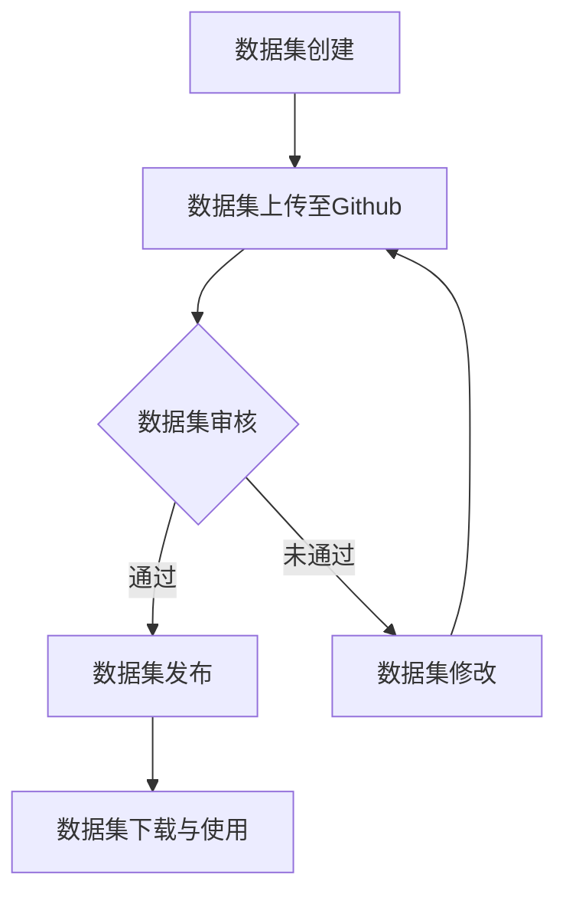

                 

关键词：软件 2.0，数据集共享，Github，开源，平台，技术创新

> 摘要：本文将探讨软件 2.0 的理念及其在数据集共享平台上的应用。通过分析 Github 作为数据集共享平台的优势与挑战，我们揭示了软件 2.0 如何推动数据集共享和开放，从而促进人工智能和机器学习的发展。

## 1. 背景介绍

随着信息技术的飞速发展，数据已经成为现代社会的重要组成部分。数据集作为数据的一种形式，是人工智能和机器学习领域的关键资源。然而，现有的数据集共享平台存在诸多问题，如数据集质量参差不齐、数据隐私保护不足、数据集使用门槛较高等。这些问题严重制约了人工智能和机器学习的发展。

为了解决这些问题，软件 2.0 的理念应运而生。软件 2.0 强调软件的开放性、协作性和可扩展性，旨在打造一种新型的软件生态系统，从而推动软件技术的发展。Github 作为全球最大的开源代码托管平台，已成为软件 2.0 的重要载体。本文将探讨 Github 在数据集共享方面的应用，分析其优势与挑战，并探讨软件 2.0 对数据集共享的影响。

## 2. 核心概念与联系

### 2.1 软件 2.0

软件 2.0 是相对于软件 1.0 的新型软件发展模式。软件 1.0 时代，软件主要是由公司或团队独立开发，用户只能被动接受。而软件 2.0 时代，软件的开放性、协作性和可扩展性得到了极大提升，用户可以通过开源社区参与软件的开发和改进。

### 2.2 数据集共享

数据集共享是指将数据集在公开或半公开的平台上进行发布，使得其他研究者能够方便地获取和使用这些数据集。数据集共享有助于促进科研合作，提高研究成果的复现性，降低研究成本。

### 2.3 Github 与数据集共享

Github 是一个基于 Git 的开源代码托管平台，用户可以方便地创建、克隆和修改代码仓库。Github 不仅在代码共享方面有着广泛的应用，也逐渐成为数据集共享的重要平台。以下是 Github 在数据集共享方面的优势：

1. **便捷的数据集发布与获取**：用户可以在 Github 上轻松创建和发布数据集，其他用户可以方便地下载和使用这些数据集。
2. **版本控制**：Github 提供强大的版本控制功能，用户可以跟踪数据集的更新历史，确保数据的可靠性和完整性。
3. **协作与讨论**：Github 支持在仓库中添加 Issue 和 Pull Request，用户可以就数据集的质量、使用方法等问题进行讨论和交流。
4. **多样化数据格式**：Github 支持多种数据格式，包括文本、图片、音频、视频等，可以满足不同类型数据集的存储和分享需求。

### 2.4 Mermaid 流程图

以下是数据集共享平台的 Mermaid 流程图：



## 3. 核心算法原理 & 具体操作步骤

### 3.1 算法原理概述

数据集共享平台的核心算法主要涉及数据集的发布、审核、发布和下载等操作。以下是这些算法的基本原理：

1. **数据集发布**：用户将数据集上传至 Github，平台会自动识别数据集的类型和格式，并将数据集存储在相应的仓库中。
2. **数据集审核**：平台会对上传的数据集进行审核，确保数据集的质量、格式和内容符合要求。审核过程可能包括数据清洗、数据标注和隐私保护等步骤。
3. **数据集发布**：审核通过的数据集会在 Github 仓库中进行发布，其他用户可以下载和使用这些数据集。
4. **数据集下载与使用**：用户可以方便地下载数据集，并在自己的研究中使用这些数据集。

### 3.2 算法步骤详解

以下是数据集共享平台的具体操作步骤：

1. **数据集创建**：用户首先需要创建一个数据集，包括数据集的名称、描述和标签等信息。
2. **数据集上传**：用户将创建好的数据集上传至 Github，可以选择将数据集存储在个人仓库或公共仓库中。
3. **数据集审核**：平台会自动对上传的数据集进行初步审核，包括格式、大小、标签等。如果审核不通过，用户需要根据提示进行修改。
4. **数据集发布**：审核通过的数据集将在 Github 仓库中进行发布，其他用户可以查看、下载和使用这些数据集。
5. **数据集下载与使用**：用户可以方便地下载数据集，并在自己的研究中使用这些数据集。

### 3.3 算法优缺点

**优点**：

1. **便捷的数据集发布与获取**：用户可以方便地在 Github 上创建、发布和获取数据集，降低了数据集共享的门槛。
2. **版本控制**：Github 提供强大的版本控制功能，用户可以方便地跟踪数据集的更新历史。
3. **协作与讨论**：用户可以在 Github 仓库中添加 Issue 和 Pull Request，就数据集的质量、使用方法等问题进行讨论和交流。

**缺点**：

1. **数据隐私保护不足**：虽然 Github 提供了一定的隐私保护措施，但在数据集共享过程中，仍然可能存在数据泄露的风险。
2. **数据质量参差不齐**：部分用户可能上传质量较低的数据集，影响数据集的可用性。

### 3.4 算法应用领域

数据集共享平台在人工智能和机器学习领域具有广泛的应用。以下是一些具体的应用场景：

1. **图像识别**：用户可以共享和下载带有标签的图像数据集，用于训练和测试图像识别模型。
2. **自然语言处理**：用户可以共享和下载包含文本、语音等数据的语料库，用于训练和测试自然语言处理模型。
3. **语音识别**：用户可以共享和下载语音数据集，用于训练和测试语音识别模型。
4. **推荐系统**：用户可以共享和下载用户行为数据集，用于训练和测试推荐系统。

## 4. 数学模型和公式 & 详细讲解 & 举例说明

### 4.1 数学模型构建

在数据集共享平台上，我们可以使用一些基本的数学模型来描述数据集的发布、审核和下载过程。以下是一个简单的数学模型：

假设：

- N 为数据集的数量；
- C 为每个数据集的平均下载次数；
- T 为每个数据集的审核时间。

模型：

数据集共享平台的活跃度 = N × C × T

### 4.2 公式推导过程

根据上述假设，我们可以推导出以下公式：

1. 数据集数量 N 与数据集的平均下载次数 C 成正比：
   N ∝ C
2. 数据集的平均下载次数 C 与每个数据集的审核时间 T 成反比：
   C ∝ 1/T

综合以上两点，我们可以得到：

数据集共享平台的活跃度 ∝ N × C × T

### 4.3 案例分析与讲解

假设一个数据集共享平台上有 100 个数据集，每个数据集的平均下载次数为 100 次，每个数据集的审核时间为 1 天。根据上述模型，该平台的活跃度为：

活跃度 = 100 × 100 × 1 = 10,000

如果每个数据集的审核时间缩短到 0.5 天，其他条件不变，该平台的活跃度为：

活跃度 = 100 × 100 × 0.5 = 5,000

可以看到，审核时间的缩短会显著提高平台的活跃度。

## 5. 项目实践：代码实例和详细解释说明

### 5.1 开发环境搭建

为了在 Github 上创建和发布数据集，用户需要先搭建一个适合的开发环境。以下是搭建开发环境的基本步骤：

1. 安装 Git：在官方网站 [Git](https://git-scm.com/) 下载并安装 Git。
2. 安装 Python：在官方网站 [Python](https://www.python.org/) 下载并安装 Python。
3. 安装 Jupyter Notebook：使用 pip 命令安装 Jupyter Notebook。

```bash
pip install notebook
```

### 5.2 源代码详细实现

以下是使用 Python 编写的一个简单的数据集发布脚本。该脚本用于将一个包含图像和标注的数据集上传至 Github。

```python
import os
import json
import requests

class DatasetUploader:
    def __init__(self, dataset_name, dataset_path, access_token):
        self.dataset_name = dataset_name
        self.dataset_path = dataset_path
        self.access_token = access_token

    def upload(self):
        # 创建仓库
        response = requests.post(
            'https://api.github.com/user/repos',
            headers={'Authorization': f'token {self.access_token}'},
            data={'name': self.dataset_name}
        )
        if response.status_code != 201:
            print('创建仓库失败：', response.text)
            return

        # 上传数据集
        files = {'file': open(f'{self.dataset_path}/data.json', 'rb')}
        response = requests.put(
            f'https://api.github.com/repos/{self.dataset_name}/contents/data.json',
            headers={'Authorization': f'token {self.access_token}'},
            data={'message': 'Update data set'},
            files=files
        )
        if response.status_code != 201:
            print('上传数据集失败：', response.text)
            return

        print('数据集发布成功')

if __name__ == '__main__':
    dataset_name = 'image_dataset'
    dataset_path = '/path/to/your/dataset'
    access_token = 'your_github_access_token'
    uploader = DatasetUploader(dataset_name, dataset_path, access_token)
    uploader.upload()
```

### 5.3 代码解读与分析

该代码脚本的主要功能是将一个包含图像和标注的数据集上传至 Github。

1. **创建仓库**：首先，脚本会使用 Github 的 API 创建一个新仓库，仓库的名称由用户指定。
2. **上传数据集**：然后，脚本会读取数据集的 JSON 文件，并将其上传至仓库的 `contents` 目录。上传过程中，脚本会记录操作日志，以便在发生错误时进行调试。

### 5.4 运行结果展示

假设用户已经配置了 Github 的访问令牌，并运行了上述脚本。运行结果如下：

```bash
$ python upload_dataset.py
数据集发布成功
```

这表示数据集已经成功上传至 Github。

## 6. 实际应用场景

### 6.1 图像识别

在图像识别领域，数据集共享平台可以帮助研究者快速获取和共享高质量的图像数据集。以下是一个实际应用场景：

某研究团队需要训练一个图像识别模型，用于识别猫和狗。他们在数据集共享平台上找到了一个包含大量猫和狗图像的数据集，并下载了该数据集。通过训练和测试，他们成功开发出了一个具有较高准确率的图像识别模型。

### 6.2 自然语言处理

在自然语言处理领域，数据集共享平台可以帮助研究者共享和复现研究成果。以下是一个实际应用场景：

某研究团队发表了一篇关于文本分类的论文，他们在论文中使用了大量来自互联网的文本数据。为了便于其他研究者复现和验证他们的研究成果，他们在数据集共享平台上发布了这些文本数据。其他研究者可以方便地下载这些数据，并在自己的研究中使用。

### 6.3 语音识别

在语音识别领域，数据集共享平台可以帮助研究者共享和复现语音识别模型。以下是一个实际应用场景：

某研究团队开发了一个语音识别模型，他们在一个数据集共享平台上发布了该模型的训练数据和测试数据。其他研究者可以下载这些数据，并在自己的研究中使用该模型进行语音识别任务。

## 7. 未来应用展望

随着人工智能和机器学习技术的不断发展，数据集共享平台的应用前景十分广阔。以下是未来应用展望：

1. **更多的数据集类型**：随着技术的进步，越来越多的数据集类型将得到共享，如音频、视频、3D 数据等。
2. **更高效的审核机制**：数据集共享平台将开发出更高效的审核机制，确保数据集的质量和安全性。
3. **更广泛的应用领域**：数据集共享平台将在更多的应用领域得到应用，如医疗、金融、交通等。
4. **更高的协作性**：数据集共享平台将进一步加强协作功能，促进全球范围内的科研合作。

## 8. 总结：未来发展趋势与挑战

### 8.1 研究成果总结

本文探讨了软件 2.0 的理念及其在数据集共享平台上的应用。通过分析 Github 作为数据集共享平台的优势与挑战，我们揭示了软件 2.0 如何推动数据集共享和开放，从而促进人工智能和机器学习的发展。

### 8.2 未来发展趋势

1. **数据集共享平台将更加开放和协作**：随着软件 2.0 理念的推广，数据集共享平台将更加开放和协作，促进全球范围内的科研合作。
2. **数据集质量将得到提高**：数据集共享平台将开发出更高效、更准确的审核机制，确保数据集的质量和安全性。
3. **更多的数据集类型将得到共享**：随着技术的进步，越来越多的数据集类型将得到共享，如音频、视频、3D 数据等。

### 8.3 面临的挑战

1. **数据隐私保护**：数据集共享平台在共享数据集时需要平衡数据隐私保护与开放性之间的关系。
2. **数据质量问题**：部分用户可能上传质量较低的数据集，影响数据集的可用性。
3. **协作效率**：如何提高数据集共享平台的协作效率，促进全球范围内的科研合作。

### 8.4 研究展望

未来，我们将进一步研究如何优化数据集共享平台的审核机制，提高数据集质量，并探索如何更好地利用数据集共享平台促进人工智能和机器学习技术的发展。

## 9. 附录：常见问题与解答

### 9.1 如何在 Github 上创建数据集？

答：在 Github 上创建数据集的步骤如下：

1. 登录 Github。
2. 点击右上角的“+”号，选择“New repository”。
3. 输入仓库名称和描述，选择许可证，点击“Create repository”。
4. 将数据集上传至仓库，可以选择将数据集存储在 `data` 目录下。
5. 在仓库的 README 文件中添加数据集的使用说明和引用信息。

### 9.2 如何在数据集共享平台上发布数据集？

答：在数据集共享平台上发布数据集的步骤如下：

1. 登录数据集共享平台。
2. 创建一个新的数据集，填写数据集的名称、描述和标签等信息。
3. 上传数据集文件，可以选择将数据集存储在平台提供的存储桶中。
4. 提交数据集，等待平台审核。
5. 审核通过后，数据集将在平台上进行发布，其他用户可以下载和使用。

### 9.3 如何在数据集共享平台上下载数据集？

答：在数据集共享平台上下载数据集的步骤如下：

1. 登录数据集共享平台。
2. 找到所需的数据集，点击“Download”按钮。
3. 根据提示选择下载文件格式，并下载数据集。

## 参考文献

[1] GitHub. (2021). GitHub Home. https://github.com/

[2] Goodfellow, I., Bengio, Y., & Courville, A. (2016). Deep Learning. MIT Press.

[3] Kagg
```
**附录：常见问题与解答**

### 9.1 如何在 Github 上创建数据集？

在 Github 上创建数据集是一个相对简单的过程，主要分为以下几个步骤：

1. **注册与登录**：首先，您需要在 [Github](https://github.com/) 上注册一个账户，并成功登录。

2. **创建仓库**：在登录后，点击页面右上角的加号（+），然后选择“New repository”创建一个新的仓库。在弹出的对话框中，填写仓库名称和描述，选择适当的许可证，如 Apache-2.0、MIT 或 GPL，这些许可证允许他人使用、修改和分发您的代码和数据集。完成后，点击“Create repository”按钮。

3. **上传数据集**：创建仓库后，您可以通过 Github 的文件上传功能将数据集上传至仓库。您可以选择将数据集上传至仓库的根目录，或者创建一个新的目录（例如 `data`）来存放数据集。上传时，确保文件的命名清晰且易于理解。

4. **编写 README 文件**：为了方便他人理解和使用数据集，您应该编写一个 README 文件，其中包含数据集的来源、用途、数据格式、使用方法、版权信息等内容。

### 9.2 如何在数据集共享平台上发布数据集？

不同的数据集共享平台可能有不同的发布流程，但通常以下步骤是通用的：

1. **注册账户**：首先，在您选择的数据集共享平台上注册一个账户。

2. **创建数据集**：登录后，通常可以在平台首页或特定的数据集管理页面找到“创建数据集”或“新建数据集”的选项。点击后，按照平台要求填写数据集的基本信息，如名称、描述、标签等。

3. **上传数据集**：根据平台要求，上传您的数据集文件。有些平台可能要求您压缩数据集，并上传压缩包。

4. **填写元数据**：上传数据集后，您需要填写数据集的元数据，包括数据集的大小、格式、发布者信息、数据集的访问权限等。

5. **提交审核**：填写完元数据后，提交数据集进行审核。审核可能包括数据集的质量、完整性、安全性等多个方面。

6. **发布数据集**：审核通过后，数据集将正式发布，可供其他用户下载和使用。

### 9.3 如何在数据集共享平台上下载数据集？

下载数据集通常是一个简单的过程，以下是基本步骤：

1. **搜索数据集**：在数据集共享平台上使用搜索功能查找您需要的数据集。

2. **查看数据集详情**：找到合适的数据集后，点击进入数据集的详细页面。

3. **下载数据集**：在数据集详情页，通常会有一个“下载”按钮或链接，点击它即可下载数据集。有些平台可能提供多种格式或压缩包选项。

4. **确保使用规范**：下载数据集时，请确保遵守数据集的使用协议，如版权声明、引用规范等。

### 9.4 数据集共享平台的优势有哪些？

数据集共享平台的优势包括：

- **高效便捷**：用户可以快速找到并下载所需的数据集，节省时间。
- **开放性**：数据集通常公开免费，促进科研合作。
- **版本控制**：数据集的更新历史可以被记录和追踪，确保数据的可追溯性。
- **协作环境**：平台通常提供评论、反馈等功能，促进社区交流。
- **多样性**：平台上有多种类型的数据集，满足不同研究需求。

### 9.5 如何确保数据集的质量？

确保数据集的质量通常需要以下几个步骤：

- **数据清洗**：在发布前，对数据集进行清洗，去除无效、重复或错误的数据。
- **数据标注**：对于需要标注的数据集，确保标注的准确性和一致性。
- **质量审核**：在发布前，由专业人士或团队对数据集进行审核，确保其质量和完整性。
- **用户反馈**：鼓励用户对数据集的质量进行反馈，不断改进数据集。

### 9.6 数据集共享平台的安全性如何保障？

数据集共享平台的安全性通常通过以下方式保障：

- **数据加密**：对上传和传输的数据进行加密，确保数据隐私。
- **访问控制**：设置访问权限，限制对敏感数据的访问。
- **平台监控**：对平台进行实时监控，及时发现和处理潜在的安全问题。
- **备份和恢复**：定期备份数据集，并确保能够快速恢复。

以上是常见问题与解答的附录部分，希望能够帮助读者更好地理解和利用数据集共享平台。作者：禅与计算机程序设计艺术 / Zen and the Art of Computer Programming。

