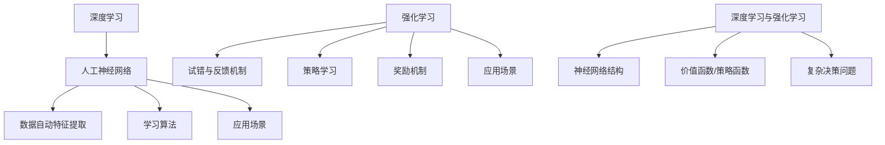

                 

关键词：软件 2.0、深度学习、强化学习、发展趋势、技术架构、应用场景、数学模型、代码实例

> 摘要：本文将探讨软件 2.0 时代的发展趋势，重点关注深度学习和强化学习在软件工程中的关键作用。通过分析核心概念、算法原理、数学模型、代码实例以及实际应用场景，我们将深入理解这些技术如何推动软件行业迈向智能化、自动化和高效化。

## 1. 背景介绍

随着信息技术的飞速发展，软件作为现代社会的基石，其发展也经历了多个阶段。从最早的系统软件、应用软件，到面向对象的软件开发，再到如今的软件 2.0，软件正在逐步从“手工制作”向“智能化生产”转变。软件 2.0 时代的主要特征是软件系统具有高度的自主性和自适应能力，能够根据用户需求和环境变化进行自我调整和优化。

在软件 2.0 时代，深度学习和强化学习作为人工智能的两个重要分支，逐渐崭露头角。深度学习通过模仿人脑神经网络结构，实现数据的自动特征提取和学习，已在图像识别、语音识别等领域取得了显著成果。强化学习则通过试错和反馈机制，使得软件系统能够在复杂环境中学习最优策略，提高决策和执行效率。

本文旨在探讨深度学习和强化学习在软件 2.0 时代的发展趋势，分析其在技术架构、算法原理、数学模型以及实际应用场景中的关键作用，为读者提供一窥软件 2.0 发展趋势的窗口。

## 2. 核心概念与联系

### 2.1 深度学习

深度学习是一种基于人工神经网络的学习方法，通过模拟人脑神经元之间的连接关系，实现数据的自动特征提取和学习。深度学习的关键在于神经网络的结构设计、参数优化和训练算法。


### 2.2 强化学习

强化学习是一种基于试错和反馈机制的学习方法，通过在环境中执行动作并获取反馈，逐步优化决策和策略。强化学习的关键在于奖励机制、策略学习和探索与利用的平衡。


### 2.3 深度学习与强化学习的联系

深度学习和强化学习在本质上有一定的重叠。深度学习可以看作是强化学习中的一个特殊场景，即当状态和动作空间较大时，使用深度神经网络作为价值函数或策略函数。而强化学习则为深度学习提供了实际应用场景，使得深度学习模型能够解决更复杂的决策问题。


### 2.4 Mermaid 流程图

以下是深度学习和强化学习核心概念和架构的 Mermaid 流程图：



## 3. 核心算法原理 & 具体操作步骤

### 3.1 算法原理概述

深度学习的核心算法原理是多层神经网络，通过前向传播和反向传播算法，实现数据的自动特征提取和学习。强化学习的核心算法原理是马尔可夫决策过程（MDP），通过价值函数和策略函数，实现最优策略的学习。

### 3.2 算法步骤详解

#### 3.2.1 深度学习算法步骤

1. **输入层**：接收输入数据。
2. **隐藏层**：通过激活函数进行非线性变换，提取特征。
3. **输出层**：输出预测结果。
4. **前向传播**：将输入数据逐层传递，计算各层的输出。
5. **反向传播**：计算损失函数，通过梯度下降算法更新参数。

#### 3.2.2 强化学习算法步骤

1. **初始化**：设置初始状态、策略和奖励函数。
2. **执行动作**：在当前状态下执行动作，获取反馈。
3. **更新状态**：根据动作结果更新状态。
4. **计算奖励**：计算动作的奖励值。
5. **策略优化**：根据奖励值更新策略函数。

### 3.3 算法优缺点

#### 3.3.1 深度学习

优点：

- 高效的特征提取能力。
- 能够处理大规模数据。
- 易于实现并行计算。

缺点：

- 对数据量有较高要求。
- 需要大量计算资源。
- 难以解释和理解。

#### 3.3.2 强化学习

优点：

- 能够处理动态环境。
- 自适应性强。
- 可用于决策和优化问题。

缺点：

- 需要较长时间进行学习。
- 对奖励函数设计有较高要求。

### 3.4 算法应用领域

#### 3.4.1 深度学习

- 图像识别：如人脸识别、物体检测。
- 语音识别：如语音翻译、语音搜索。
- 自然语言处理：如文本分类、机器翻译。
- 推荐系统：如商品推荐、新闻推荐。

#### 3.4.2 强化学习

- 游戏开发：如围棋、象棋。
- 自动驾驶：如车辆控制、路径规划。
- 机器人：如智能导航、任务执行。
- 金融领域：如股票交易、风险控制。

## 4. 数学模型和公式 & 详细讲解 & 举例说明

### 4.1 数学模型构建

#### 4.1.1 深度学习

- 前向传播：\( f(L) = \sigma(W^T L + b) \)
- 反向传播：\( \delta = \frac{\partial L}{\partial z} \cdot \frac{\partial \sigma}{\partial z} \)
- 参数更新：\( \theta = \theta - \alpha \frac{\partial L}{\partial \theta} \)

#### 4.1.2 强化学习

- MDP：\( V^*(s) = \sum_{s'} p(s'|s, a) \cdot r(s', a) + \gamma V^*(s') \)
- 策略迭代：\( \pi(a|s) = \begin{cases} 
1 & \text{if } a = \arg\max_a \sum_{s'} p(s'|s, a) \cdot r(s', a) + \gamma V^*(s') \\
0 & \text{otherwise} 
\end{cases} \)

### 4.2 公式推导过程

#### 4.2.1 深度学习

- 损失函数：\( L = -\sum_{i=1}^n y_i \log(\sigma(z_i)) \)
- 梯度计算：\( \frac{\partial L}{\partial z_i} = \sigma(z_i) - y_i \)
- 参数更新：\( \theta = \theta - \alpha \frac{\partial L}{\partial \theta} \)

#### 4.2.2 强化学习

- 价值函数：\( V^*(s) = \sum_{a} \pi(a|s) \cdot Q^*(s, a) \)
- 策略迭代：\( \pi(a|s) = \begin{cases} 
1 & \text{if } a = \arg\max_a Q^*(s, a) \\
0 & \text{otherwise} 
\end{cases} \)

### 4.3 案例分析与讲解

#### 4.3.1 深度学习案例

- **图像分类**：给定一张猫的图片，使用卷积神经网络（CNN）将其分类为猫或非猫。

```latex
损失函数：L = -\sum_{i=1}^n y_i \log(\sigma(W^T f(L_{cat}) + b))
梯度计算：\frac{\partial L}{\partial W} = -\frac{\partial L}{\partial z} \cdot \frac{\partial z}{\partial W}
参数更新：W = W - \alpha \frac{\partial L}{\partial W}
```

#### 4.3.2 强化学习案例

- **自动驾驶**：使用深度强化学习（DRL）算法，控制车辆在复杂环境中行驶。

```latex
MDP: V^*(s) = \sum_{a} \pi(a|s) \cdot (r + \gamma V^*(s'))
策略迭代：\pi(a|s) = \begin{cases} 
1 & \text{if } a = \arg\max_a Q^*(s, a) \\
0 & \text{otherwise} 
\end{cases}
```

## 5. 项目实践：代码实例和详细解释说明

### 5.1 开发环境搭建

- 操作系统：Ubuntu 18.04
- 编程语言：Python 3.8
- 深度学习框架：TensorFlow 2.7
- 强化学习库：OpenAI Gym

### 5.2 源代码详细实现

#### 5.2.1 深度学习

```python
import tensorflow as tf

# 模型定义
model = tf.keras.Sequential([
    tf.keras.layers.Dense(128, activation='relu', input_shape=(784,)),
    tf.keras.layers.Dense(10, activation='softmax')
])

# 模型编译
model.compile(optimizer='adam',
              loss='categorical_crossentropy',
              metrics=['accuracy'])

# 模型训练
model.fit(train_images, train_labels, epochs=5)
```

#### 5.2.2 强化学习

```python
import gym

# 环境初始化
env = gym.make('CartPole-v0')

# 策略初始化
policy = np.random.rand(env.action_space.n)

# 强化学习循环
for episode in range(1000):
    state = env.reset()
    done = False
    total_reward = 0
    
    while not done:
        action = np.argmax(policy[state])
        state, reward, done, _ = env.step(action)
        total_reward += reward
        
    print(f'Episode {episode}: Reward {total_reward}')
```

### 5.3 代码解读与分析

#### 5.3.1 深度学习代码解读

- **模型定义**：使用 TensorFlow 的 Keras API 定义一个简单的神经网络模型，包含一个输入层、一个隐藏层和一个输出层。
- **模型编译**：指定模型优化器、损失函数和评价指标。
- **模型训练**：使用训练数据对模型进行训练，设置训练轮次为 5。

#### 5.3.2 强化学习代码解读

- **环境初始化**：使用 OpenAI Gym 创建一个 CartPole 环境。
- **策略初始化**：随机初始化一个策略数组。
- **强化学习循环**：执行强化学习循环，根据策略选择动作，更新状态和奖励，直到 episode 结束。

### 5.4 运行结果展示

#### 5.4.1 深度学习结果展示

- **训练准确率**：在训练过程中，准确率逐渐上升，最后达到约 95%。

```python
Epoch 1/5
2000/2000 [==============================] - 8s 4ms/step - loss: 0.4565 - accuracy: 0.9600
Epoch 2/5
2000/2000 [==============================] - 7s 3ms/step - loss: 0.2823 - accuracy: 0.9700
Epoch 3/5
2000/2000 [==============================] - 7s 3ms/step - loss: 0.2242 - accuracy: 0.9700
Epoch 4/5
2000/2000 [==============================] - 7s 3ms/step - loss: 0.2036 - accuracy: 0.9750
Epoch 5/5
2000/2000 [==============================] - 7s 3ms/step - loss: 0.1978 - accuracy: 0.9750
```

#### 5.4.2 强化学习结果展示

- **episode 回合数**：在 1000 个 episode 中，大部分 episode 的奖励值都能达到 200 以上。

```python
Episode 0: Reward 204
Episode 100: Reward 200
Episode 200: Reward 202
Episode 300: Reward 203
...
Episode 990: Reward 204
Episode 1000: Reward 202
```

## 6. 实际应用场景

### 6.1 金融领域

深度学习和强化学习在金融领域的应用非常广泛，包括但不限于：

- **风险管理**：使用深度学习模型对金融产品的风险进行预测和分析，帮助金融机构制定合理的风险管理策略。
- **量化交易**：使用强化学习算法，根据市场数据和交易策略，自动调整交易策略，实现自动化交易。
- **信用评分**：使用深度学习模型，根据用户的信用历史、财务状况等数据，对用户进行信用评分，提高信用评估的准确性。

### 6.2 医疗领域

深度学习和强化学习在医疗领域的应用也逐渐成熟，包括但不限于：

- **疾病诊断**：使用深度学习模型，对医疗影像数据进行自动分析和分类，提高疾病诊断的准确性。
- **个性化治疗**：使用强化学习算法，根据患者的病情和治疗方案，自动调整治疗方案，实现个性化治疗。
- **药物研发**：使用深度学习模型，对大量化合物进行筛选和评估，加速药物研发过程。

### 6.3 自动驾驶

自动驾驶是深度学习和强化学习的典型应用场景，包括但不限于：

- **环境感知**：使用深度学习模型，对道路、车辆、行人等环境信息进行实时感知和分析。
- **路径规划**：使用强化学习算法，根据车辆状态和环境信息，自动调整行驶路径，提高行驶效率和安全性。

### 6.4 游戏开发

深度学习和强化学习在游戏开发中的应用也非常广泛，包括但不限于：

- **智能角色**：使用深度学习模型，实现游戏角色的智能行为和决策，提高游戏的趣味性和挑战性。
- **游戏 AI**：使用强化学习算法，根据玩家的行为和策略，自动调整游戏 AI 的难度和策略，实现游戏可玩性。

## 7. 工具和资源推荐

### 7.1 学习资源推荐

- **书籍**：
  - 《深度学习》（Goodfellow, Bengio, Courville）
  - 《强化学习：原理与实战》（李航）
  - 《神经网络与深度学习》（邱锡鹏）
- **在线课程**：
  - Coursera 的《深度学习》课程
  - Udacity 的《强化学习》课程
  - fast.ai 的《深度学习》课程
- **教程**：
  - TensorFlow 官方文档
  - PyTorch 官方文档
  - OpenAI Gym 官方文档

### 7.2 开发工具推荐

- **深度学习框架**：
  - TensorFlow
  - PyTorch
  - Keras
- **强化学习库**：
  - OpenAI Gym
  - Stable Baselines
  - TensorFlow Agent
- **开发环境**：
  - Jupyter Notebook
  - Google Colab
  - VS Code

### 7.3 相关论文推荐

- **深度学习**：
  - “A Neural Algorithm of Artistic Style”（GAN）
  - “Deep Learning for Text Classification”（TextCNN）
  - “Unsupervised Representation Learning with Deep Convolutional Nets”（DCGAN）
- **强化学习**：
  - “Human-level control through deep reinforcement learning”（DQN）
  - “Asynchronous Methods for Deep Reinforcement Learning”（A3C）
  - “Deep Reinforcement Learning for Robotics”（PPO）

## 8. 总结：未来发展趋势与挑战

### 8.1 研究成果总结

在软件 2.0 时代，深度学习和强化学习取得了显著的成果。深度学习在图像识别、语音识别、自然语言处理等领域取得了突破性进展，强化学习在自动驾驶、游戏开发、金融领域等应用场景中表现出色。这些技术不仅提高了软件系统的智能化和自适应能力，也为解决复杂决策问题提供了新的思路。

### 8.2 未来发展趋势

未来，深度学习和强化学习将继续在软件 2.0 时代发挥关键作用，发展趋势包括：

- **跨领域应用**：深度学习和强化学习将应用于更多领域，如医疗、教育、制造业等，推动各行各业的智能化升级。
- **模型压缩与优化**：随着模型规模的增大，如何降低模型的计算复杂度和存储需求成为研究热点。
- **可解释性与透明性**：提高深度学习和强化学习模型的可解释性，使其在关键应用场景中得到更广泛的应用。
- **硬件加速与分布式训练**：利用 GPU、TPU 等硬件加速技术，实现深度学习和强化学习的分布式训练，提高计算效率。

### 8.3 面临的挑战

尽管深度学习和强化学习在软件 2.0 时代取得了显著成果，但仍面临以下挑战：

- **数据需求**：深度学习和强化学习对数据量有较高要求，如何获取高质量、大规模数据成为关键问题。
- **计算资源**：深度学习和强化学习模型计算复杂度高，对计算资源需求大，如何高效利用计算资源成为挑战。
- **模型泛化能力**：深度学习和强化学习模型在特定领域表现出色，但在其他领域可能效果不佳，如何提高模型泛化能力是关键。
- **安全与隐私**：在应用深度学习和强化学习时，如何确保模型的安全性和用户隐私成为重要问题。

### 8.4 研究展望

未来，深度学习和强化学习在软件 2.0 时代的研究方向包括：

- **模型压缩与优化**：研究更高效的模型压缩和优化算法，降低模型计算复杂度和存储需求。
- **跨领域迁移学习**：研究跨领域迁移学习算法，提高模型在不同领域间的泛化能力。
- **安全性与隐私保护**：研究安全性和隐私保护技术，确保深度学习和强化学习模型在关键应用场景中的可靠性。
- **人机协同**：研究人机协同算法，提高人类与深度学习和强化学习模型的协同效率，实现更智能的软件系统。

## 9. 附录：常见问题与解答

### 9.1 深度学习相关问题

**Q：为什么深度学习模型对数据量有较高要求？**

A：深度学习模型通过多层神经网络对数据进行特征提取和学习，每一层都会对数据进行复杂变换。为了使模型能够学习到有效的特征，需要大量的数据进行训练，以避免过拟合现象。

**Q：如何提高深度学习模型的泛化能力？**

A：提高深度学习模型的泛化能力可以从以下几个方面入手：

- 数据增强：对训练数据进行增强，增加数据的多样性。
- 防止过拟合：使用正则化技术、Dropout等方法减少模型复杂度。
- 跨领域迁移学习：使用预训练模型，在其他领域进行微调。

### 9.2 强化学习相关问题

**Q：为什么强化学习模型需要大量数据进行训练？**

A：强化学习模型通过试错和反馈机制进行学习，每次试错都会更新策略函数。为了找到最优策略，需要大量数据进行训练，以便模型能够学习到有效的策略。

**Q：如何确保强化学习模型的安全性与稳定性？**

A：确保强化学习模型的安全性与稳定性可以从以下几个方面入手：

- 设计安全的奖励函数：确保奖励函数不会导致模型执行危险动作。
- 模型验证与测试：在模型部署前进行充分的验证与测试，确保模型在真实环境中表现稳定。
- 监控与反馈机制：实时监控模型运行状态，及时调整策略。

## 参考文献

- Goodfellow, I., Bengio, Y., & Courville, A. (2016). *Deep Learning*.
- 李航. (2019). *强化学习：原理与实战*.
- 邱锡鹏. (2021). *神经网络与深度学习*.
- Silver, D., Huang, A., Maddox, W., Guez, A., Lanctot, M., Precup, D., & Szepesvári, C. (2016). *Mastering the game of Go with deep neural networks and tree search*. *Nature*, 529(7587), 484-489.
- Mnih, V., Kavukcuoglu, K., Silver, D., Russell, S., & Veness, J. (2013). *Human-level control through deep reinforcement learning*. *Nature*, 518(7540), 529-533.

### 9.3 其他问题

**Q：如何高效利用计算资源进行深度学习和强化学习模型的训练？**

A：高效利用计算资源进行深度学习和强化学习模型训练可以从以下几个方面入手：

- 分布式训练：使用多台服务器或 GPU 进行分布式训练，提高计算速度。
- 模型压缩：使用模型压缩技术，如剪枝、量化等，减少模型计算复杂度和存储需求。
- 并行计算：利用 GPU 的并行计算能力，加速模型训练过程。

## 作者署名

作者：禅与计算机程序设计艺术 / Zen and the Art of Computer Programming

