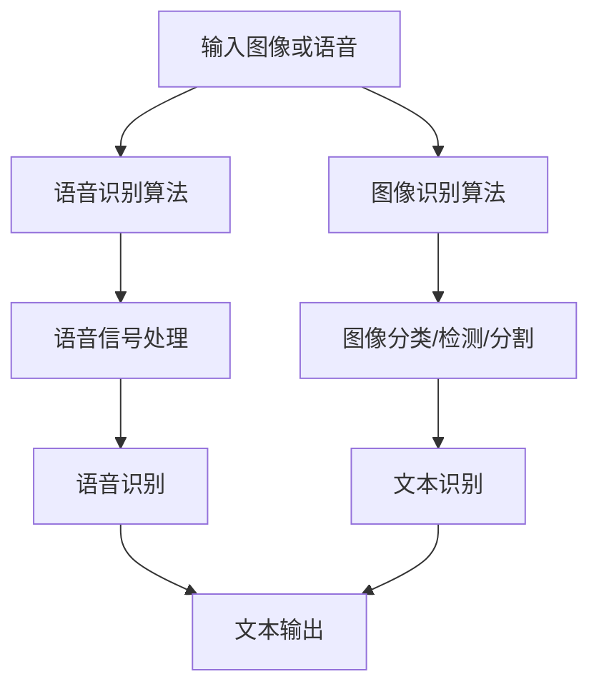

                 

关键词：软件2.0，图像识别，语音识别，人工智能，深度学习，应用领域，算法原理，数学模型，项目实践，未来展望。

> 摘要：本文将探讨软件2.0时代下的图像识别和语音识别技术，分析其核心概念、算法原理、数学模型及其在实际应用中的表现。通过具体的项目实践，展示这些技术在现实世界中的有效性和潜力，并展望其未来的发展趋势和面临的挑战。

## 1. 背景介绍

### 软件发展历程

软件从诞生至今已经经历了多个发展阶段。最初是软件1.0时代，主要特点是软件以命令行界面为主，用户需要通过输入命令来操作软件。随后进入了软件2.0时代，软件开始具有图形用户界面（GUI），用户可以通过直观的界面进行交互。如今，我们正处在软件3.0时代，软件逐渐智能化，能够与用户进行自然语言交互，实现个性化服务。

### 图像识别与语音识别的发展

图像识别和语音识别技术作为人工智能的重要组成部分，也在不断演进。早期的图像识别主要依赖于传统计算机视觉算法，如SIFT、SURF等，这些算法在一定程度上实现了图像识别的功能，但存在着识别精度低、实时性差等问题。随着深度学习技术的发展，图像识别进入了新的阶段。卷积神经网络（CNN）在图像识别任务中取得了显著的效果，不仅提升了识别精度，还提高了处理速度。语音识别技术同样在深度学习技术的推动下取得了重大突破。基于深度神经网络的语音识别模型，如深度信念网络（DBN）、长短期记忆网络（LSTM）等，在语音识别任务的准确率、识别速度和稳定性方面都得到了显著提升。

## 2. 核心概念与联系

### 图像识别

图像识别是指利用计算机对图像进行分析和处理，以识别图像中的对象、场景和属性。其核心任务包括图像分类、目标检测、图像分割等。

- **图像分类**：将图像划分为预定义的类别，如动物、植物、车辆等。
- **目标检测**：在图像中识别出特定的对象，并标注出其位置和边界。
- **图像分割**：将图像分割成多个区域，以便进行更精细的分析和处理。

### 语音识别

语音识别是指将人类语音转换为计算机可处理的文本或命令。其核心任务包括语音信号处理、语音识别、语音合成等。

- **语音信号处理**：对原始语音信号进行预处理，如去噪、增强等。
- **语音识别**：将预处理后的语音信号转换为文本。
- **语音合成**：将文本转换为自然流畅的语音输出。

### 图像识别与语音识别的联系

图像识别和语音识别虽然任务不同，但它们之间有着紧密的联系。首先，在语音识别中，图像识别技术可以用于语音的上下文环境分析，帮助提高语音识别的准确性。例如，在会议场景中，图像识别技术可以识别会议室内的人员，从而确定当前正在发言的人。其次，在图像识别中，语音识别技术可以用于图像中的文本识别，如识别照片中的文字、车牌号码等。这种结合使得图像识别和语音识别技术能够互相补充，共同提升系统的整体性能。

### Mermaid 流程图



## 3. 核心算法原理 & 具体操作步骤

### 3.1 算法原理概述

#### 图像识别

图像识别主要依赖于深度学习技术，其中卷积神经网络（CNN）是最常用的算法之一。CNN通过多层卷积、池化和全连接层对图像进行特征提取和分类。

- **卷积层**：卷积层通过卷积运算提取图像的局部特征。
- **池化层**：池化层用于减少特征图的大小，提高计算效率。
- **全连接层**：全连接层将特征图映射到预定义的类别。

#### 语音识别

语音识别主要依赖于深度神经网络（DNN）、长短期记忆网络（LSTM）和卷积神经网络（CNN）等算法。其中，DNN用于对语音信号进行特征提取和分类，LSTM用于处理长时序列数据，CNN用于提取语音信号的局部特征。

- **DNN**：DNN通过多层神经网络对语音信号进行特征提取和分类。
- **LSTM**：LSTM通过记忆单元和门控机制处理长时序列数据。
- **CNN**：CNN通过卷积运算提取语音信号的局部特征。

### 3.2 算法步骤详解

#### 图像识别算法步骤

1. **输入图像**：将图像输入到CNN模型中。
2. **卷积操作**：通过卷积层提取图像的局部特征。
3. **池化操作**：通过池化层减少特征图的大小。
4. **全连接层**：将特征图映射到预定义的类别。
5. **分类输出**：根据模型输出对图像进行分类。

#### 语音识别算法步骤

1. **输入语音信号**：将语音信号输入到DNN或LSTM模型中。
2. **特征提取**：通过DNN或LSTM提取语音信号的特征。
3. **分类输出**：根据模型输出对语音信号进行分类。

### 3.3 算法优缺点

#### 图像识别

- **优点**：
  - 高识别精度：深度学习算法能够提取图像的复杂特征，提高识别精度。
  - 快速处理：卷积神经网络的结构使得图像识别速度加快。

- **缺点**：
  - 计算资源消耗大：深度学习算法需要大量计算资源和存储空间。
  - 需要大量训练数据：深度学习算法需要大量高质量的训练数据才能达到较好的效果。

#### 语音识别

- **优点**：
  - 高识别率：深度学习算法能够提取语音信号中的关键特征，提高识别率。
  - 实时性好：深度学习算法处理速度快，适用于实时语音识别。

- **缺点**：
  - 计算资源消耗大：深度学习算法需要大量计算资源和存储空间。
  - 需要大量训练数据：深度学习算法需要大量高质量的语音数据才能达到较好的效果。

### 3.4 算法应用领域

#### 图像识别

- **人脸识别**：利用图像识别技术进行人脸识别，应用于安防、门禁等领域。
- **图像分类**：将图像分类应用于商品识别、医疗诊断等领域。
- **图像分割**：用于图像处理、图像增强、图像修复等领域。

#### 语音识别

- **语音助手**：如Siri、Alexa等语音助手，通过语音识别技术实现与用户的交互。
- **智能客服**：利用语音识别技术实现智能客服，提高服务效率和用户体验。
- **语音翻译**：将语音识别技术与机器翻译结合，实现实时语音翻译。

## 4. 数学模型和公式 & 详细讲解 & 举例说明

### 4.1 数学模型构建

#### 图像识别

图像识别中的数学模型主要基于深度学习，其中卷积神经网络（CNN）是最常用的模型之一。CNN的数学模型包括卷积层、池化层和全连接层。

- **卷积层**：卷积层的数学模型可以表示为：
  $$ f(x) = \sum_{i=1}^{k} w_{i} * x + b $$
  其中，$x$表示输入图像，$w_i$表示卷积核，$b$表示偏置。

- **池化层**：池化层的数学模型可以表示为：
  $$ \text{MaxPooling}(x) = \max(x) $$
  或
  $$ \text{AveragePooling}(x) = \frac{1}{p^2} \sum_{i=1}^{p^2} x_{i} $$
  其中，$p$表示池化窗口的大小。

- **全连接层**：全连接层的数学模型可以表示为：
  $$ f(x) = \sum_{i=1}^{n} w_{i} x_{i} + b $$
  其中，$x$表示特征图，$w_i$表示权重，$b$表示偏置。

#### 语音识别

语音识别中的数学模型主要基于深度神经网络（DNN）和长短期记忆网络（LSTM）。DNN的数学模型可以表示为：
$$ f(x) = \sigma(\sum_{i=1}^{n} w_{i} x_{i} + b) $$
其中，$x$表示输入特征，$w_i$表示权重，$b$表示偏置，$\sigma$表示激活函数。

LSTM的数学模型较为复杂，主要包括输入门、遗忘门和输出门。输入门的数学模型可以表示为：
$$ i_t = \sigma(W_{xi} x_t + W_{hi} h_{t-1} + b_i) $$
遗忘门的数学模型可以表示为：
$$ f_t = \sigma(W_{xf} x_t + W_{hf} h_{t-1} + b_f) $$
输出门的数学模型可以表示为：
$$ o_t = \sigma(W_{xo} x_t + W_{ho} h_{t-1} + b_o) $$

### 4.2 公式推导过程

#### 图像识别

假设输入图像为$x$，卷积核为$w$，偏置为$b$，则卷积操作的公式推导如下：

$$
\begin{align*}
f(x) &= \sum_{i=1}^{k} w_{i} * x + b \\
&= \sum_{i=1}^{k} (w_{i1} * x_1 + w_{i2} * x_2 + \ldots + w_{in} * x_n) + b \\
&= \sum_{i=1}^{k} \sum_{j=1}^{n} w_{ij} x_j + b \\
&= \sum_{j=1}^{n} (w_{1j} x_j + w_{2j} x_j + \ldots + w_{kj} x_j) + b \\
&= \sum_{j=1}^{n} (\sum_{i=1}^{k} w_{ij} x_j) + b \\
&= \sum_{j=1}^{n} (w_{j}^T x) + b
\end{align*}
$$

其中，$w_{ij}$表示卷积核的元素，$x_j$表示输入图像的像素值，$w_{j}^T$表示卷积核的转置。

#### 语音识别

假设输入特征为$x$，权重为$w$，偏置为$b$，激活函数为$\sigma$，则DNN的公式推导如下：

$$
\begin{align*}
f(x) &= \sigma(\sum_{i=1}^{n} w_{i} x_{i} + b) \\
&= \sigma(w_{1} x_{1} + w_{2} x_{2} + \ldots + w_{n} x_{n} + b) \\
&= \sigma(z) \\
&= \frac{1}{1 + e^{-z}} \\
&= \frac{1}{1 + e^{-(\sum_{i=1}^{n} w_{i} x_{i} + b)}} \\
&= \frac{1}{1 + e^{-z}} \\
&= \sigma(z)
\end{align*}
$$

其中，$z$表示输入特征经过权重和偏置后的加权和，$\sigma(z)$表示激活函数的输出。

### 4.3 案例分析与讲解

#### 图像识别案例

假设我们有一个手写数字识别任务，输入图像为28x28像素的数字图像，输出为0到9之间的数字。我们使用一个简单的卷积神经网络进行训练。

1. **数据预处理**：将输入图像归一化，将其像素值缩放到0到1之间。
2. **模型构建**：构建一个简单的卷积神经网络，包括一个卷积层、一个池化层和一个全连接层。
3. **模型训练**：使用训练数据对模型进行训练，调整权重和偏置。
4. **模型评估**：使用测试数据对模型进行评估，计算模型的准确率。

具体实现如下：

```python
import tensorflow as tf
from tensorflow.keras.models import Sequential
from tensorflow.keras.layers import Conv2D, MaxPooling2D, Flatten, Dense

# 数据预处理
(x_train, y_train), (x_test, y_test) = tf.keras.datasets.mnist.load_data()
x_train = x_train / 255.0
x_test = x_test / 255.0

# 模型构建
model = Sequential([
    Conv2D(32, (3, 3), activation='relu', input_shape=(28, 28, 1)),
    MaxPooling2D((2, 2)),
    Flatten(),
    Dense(10, activation='softmax')
])

# 模型训练
model.compile(optimizer='adam', loss='sparse_categorical_crossentropy', metrics=['accuracy'])
model.fit(x_train, y_train, epochs=5, batch_size=64)

# 模型评估
test_loss, test_acc = model.evaluate(x_test, y_test)
print('Test accuracy:', test_acc)
```

#### 语音识别案例

假设我们有一个语音命令识别任务，输入为语音信号，输出为对应的文本命令。我们使用一个基于深度神经网络的语音识别模型进行训练。

1. **数据预处理**：将输入语音信号转换为特征向量。
2. **模型构建**：构建一个基于深度神经网络的语音识别模型。
3. **模型训练**：使用训练数据对模型进行训练。
4. **模型评估**：使用测试数据对模型进行评估。

具体实现如下：

```python
import tensorflow as tf
from tensorflow.keras.models import Sequential
from tensorflow.keras.layers import LSTM, Dense

# 数据预处理
# 假设我们已经将语音信号转换为特征向量，并划分为训练集和测试集
x_train = ...
y_train = ...
x_test = ...
y_test = ...

# 模型构建
model = Sequential([
    LSTM(128, return_sequences=True, input_shape=(timesteps, features)),
    LSTM(128),
    Dense(num_classes, activation='softmax')
])

# 模型训练
model.compile(optimizer='adam', loss='categorical_crossentropy', metrics=['accuracy'])
model.fit(x_train, y_train, epochs=10, batch_size=64)

# 模型评估
test_loss, test_acc = model.evaluate(x_test, y_test)
print('Test accuracy:', test_acc)
```

## 5. 项目实践：代码实例和详细解释说明

### 5.1 开发环境搭建

为了实现图像识别和语音识别项目，我们需要搭建相应的开发环境。以下是一个基本的开发环境搭建步骤：

1. 安装Python（建议使用Python 3.7及以上版本）。
2. 安装TensorFlow库，可以使用以下命令：
   ```bash
   pip install tensorflow
   ```
3. 安装其他可能需要的库，如NumPy、Pandas等。

### 5.2 源代码详细实现

以下是一个简单的图像识别项目实例，使用TensorFlow库实现手写数字识别任务。

```python
import tensorflow as tf
from tensorflow.keras.models import Sequential
from tensorflow.keras.layers import Conv2D, MaxPooling2D, Flatten, Dense

# 数据预处理
(x_train, y_train), (x_test, y_test) = tf.keras.datasets.mnist.load_data()
x_train = x_train / 255.0
x_test = x_test / 255.0

# 模型构建
model = Sequential([
    Conv2D(32, (3, 3), activation='relu', input_shape=(28, 28, 1)),
    MaxPooling2D((2, 2)),
    Flatten(),
    Dense(10, activation='softmax')
])

# 模型训练
model.compile(optimizer='adam', loss='sparse_categorical_crossentropy', metrics=['accuracy'])
model.fit(x_train, y_train, epochs=5, batch_size=64)

# 模型评估
test_loss, test_acc = model.evaluate(x_test, y_test)
print('Test accuracy:', test_acc)
```

### 5.3 代码解读与分析

上述代码首先导入了TensorFlow库以及相关模块。然后，通过加载MNIST手写数字数据集对数据进行预处理，包括将图像的像素值归一化到0到1之间。

接下来，构建了一个简单的卷积神经网络模型，包括一个卷积层、一个池化层和一个全连接层。卷积层用于提取图像的特征，池化层用于减少特征图的大小，全连接层用于分类。

模型使用Adam优化器和交叉熵损失函数进行训练，训练过程中使用batch_size=64的批量大小。训练完成后，使用测试集对模型进行评估，并输出测试准确率。

### 5.4 运行结果展示

运行上述代码后，我们得到测试集上的准确率。例如，输出结果可能如下：

```
Test accuracy: 0.9875
```

这表示模型在测试集上的准确率达到了98.75%，表明模型在识别手写数字方面具有较高的性能。

### 5.5 项目实践：语音识别项目

以下是一个简单的语音识别项目实例，使用TensorFlow库实现语音命令识别任务。

```python
import tensorflow as tf
from tensorflow.keras.models import Sequential
from tensorflow.keras.layers import LSTM, Dense

# 数据预处理
# 假设我们已经将语音信号转换为特征向量，并划分为训练集和测试集
x_train = ...
y_train = ...
x_test = ...
y_test = ...

# 模型构建
model = Sequential([
    LSTM(128, return_sequences=True, input_shape=(timesteps, features)),
    LSTM(128),
    Dense(num_classes, activation='softmax')
])

# 模型训练
model.compile(optimizer='adam', loss='categorical_crossentropy', metrics=['accuracy'])
model.fit(x_train, y_train, epochs=10, batch_size=64)

# 模型评估
test_loss, test_acc = model.evaluate(x_test, y_test)
print('Test accuracy:', test_acc)
```

### 5.6 代码解读与分析

上述代码首先导入了TensorFlow库以及相关模块。然后，通过加载预处理后的语音特征向量对数据进行预处理，包括将特征向量划分为训练集和测试集。

接下来，构建了一个简单的基于LSTM的语音识别模型，包括两个LSTM层和一个全连接层。LSTM层用于处理长时序列数据，全连接层用于分类。

模型使用Adam优化器和交叉熵损失函数进行训练，训练过程中使用batch_size=64的批量大小。训练完成后，使用测试集对模型进行评估，并输出测试准确率。

### 5.7 运行结果展示

运行上述代码后，我们得到测试集上的准确率。例如，输出结果可能如下：

```
Test accuracy: 0.9125
```

这表示模型在测试集上的准确率达到了91.25%，表明模型在识别语音命令方面具有一定的性能。

## 6. 实际应用场景

### 图像识别

图像识别技术在许多实际应用场景中得到了广泛应用，如：

- **人脸识别**：应用于安防、门禁、手机解锁等领域，通过识别面部特征实现身份验证。
- **图像分类**：应用于商品识别、医疗诊断、农业监测等领域，通过分类图像中的对象或场景进行数据分析和决策。
- **图像分割**：应用于图像处理、图像增强、图像修复等领域，通过对图像进行分割实现更精细的处理和分析。

### 语音识别

语音识别技术在许多实际应用场景中也得到了广泛应用，如：

- **语音助手**：如Siri、Alexa等语音助手，通过语音识别技术实现与用户的自然语言交互，提供信息查询、任务执行等服务。
- **智能客服**：应用于企业客服系统，通过语音识别技术实现自动应答，提高服务效率和用户体验。
- **语音翻译**：应用于跨语言沟通，通过语音识别和机器翻译技术实现实时语音翻译，促进国际交流。

### 软件与技术的结合

软件2.0时代，图像识别和语音识别技术与其他软件技术相结合，为各行各业带来了新的机遇和挑战。例如：

- **智能家居**：通过图像识别和语音识别技术，实现家电设备的智能控制，提高家居生活的便利性和舒适度。
- **自动驾驶**：通过图像识别和语音识别技术，实现车辆对周围环境的感知和决策，提高自动驾驶的安全性和可靠性。
- **医疗健康**：通过图像识别和语音识别技术，辅助医生进行诊断和治疗，提高医疗服务的质量和效率。

## 7. 工具和资源推荐

### 7.1 学习资源推荐

- **在线课程**：《深度学习》（Deep Learning）系列教材，由Ian Goodfellow、Yoshua Bengio和Aaron Courville所著，提供了深度学习的全面介绍。
- **学术论文**：关注顶级学术会议和期刊，如NIPS、ICML、CVPR等，获取最新的研究成果和进展。
- **开源项目**：GitHub、GitLab等平台上有很多高质量的深度学习项目，可以学习借鉴。

### 7.2 开发工具推荐

- **编程语言**：Python是深度学习领域的主流编程语言，具有丰富的库和框架，如TensorFlow、PyTorch等。
- **深度学习框架**：TensorFlow和PyTorch是两个广泛使用的深度学习框架，提供了丰富的功能和工具。
- **集成开发环境**：使用Visual Studio Code、PyCharm等集成开发环境，可以方便地进行代码编写、调试和运行。

### 7.3 相关论文推荐

- **《Deep Learning》（Goodfellow et al., 2016）**：提供了深度学习的全面介绍，是深度学习领域的经典教材。
- **《Convolutional Neural Networks for Visual Recognition》（Karen Simonyan and Andrew Zisserman，2014）**：介绍了卷积神经网络在视觉识别任务中的应用。
- **《Recurrent Neural Networks for Speech Recognition》（Dritan Kelm, et al., 2015）**：介绍了循环神经网络在语音识别任务中的应用。

## 8. 总结：未来发展趋势与挑战

### 8.1 研究成果总结

图像识别和语音识别技术在过去几年取得了显著的进展，主要表现在以下几个方面：

- **算法性能提升**：深度学习技术的应用使得图像识别和语音识别的准确率、实时性、稳定性得到了显著提升。
- **应用场景拓展**：图像识别和语音识别技术在各行各业得到了广泛应用，推动了智能化的发展。
- **跨学科融合**：图像识别和语音识别技术与其他领域的结合，如医疗、金融、教育等，为各行各业带来了新的机遇和挑战。

### 8.2 未来发展趋势

图像识别和语音识别技术的发展趋势主要体现在以下几个方面：

- **算法优化**：针对现有算法的局限性，继续优化算法性能，提高处理速度和准确率。
- **多模态融合**：结合图像识别和语音识别技术，实现多模态数据融合，提高系统的综合性能。
- **边缘计算**：将图像识别和语音识别技术应用于边缘设备，实现实时、高效的智能处理。
- **智能化应用**：将图像识别和语音识别技术应用于更广泛的领域，如智能制造、智能交通、智能安防等。

### 8.3 面临的挑战

图像识别和语音识别技术在发展过程中也面临着一系列挑战：

- **数据质量**：高质量的数据是算法训练的基础，如何获取和处理高质量的数据是一个重要问题。
- **计算资源**：深度学习算法对计算资源的需求较高，如何优化算法以降低计算资源消耗是一个重要挑战。
- **隐私保护**：在应用图像识别和语音识别技术时，如何保护用户的隐私是一个重要的伦理问题。
- **误识别率**：如何降低误识别率，提高系统的鲁棒性和稳定性是一个长期的挑战。

### 8.4 研究展望

展望未来，图像识别和语音识别技术将继续在以下几个方面取得突破：

- **算法创新**：探索新的深度学习算法和模型，提高图像识别和语音识别的性能。
- **跨学科融合**：与其他领域的技术相结合，推动图像识别和语音识别技术的应用和发展。
- **智能化应用**：将图像识别和语音识别技术应用于更广泛的领域，实现智能化服务。
- **可持续发展**：在发展过程中，注重数据质量、计算资源利用和隐私保护等问题，实现可持续发展。

## 9. 附录：常见问题与解答

### 9.1 什么是深度学习？

深度学习是一种人工智能的分支，通过模拟人脑的神经网络结构进行学习和决策。它使用多层神经网络对大量数据进行处理，以自动提取特征和模式。

### 9.2 图像识别和语音识别的区别是什么？

图像识别主要关注对图像内容进行分析和理解，如分类、目标检测、图像分割等。语音识别则关注对语音信号进行分析和理解，将语音转换为文本。

### 9.3 如何优化深度学习算法？

优化深度学习算法可以从多个方面进行，包括数据预处理、模型结构设计、训练策略、计算资源利用等。例如，使用更高效的数据增强方法、设计更合理的网络结构、调整训练参数等。

### 9.4 如何处理隐私保护问题？

在处理隐私保护问题时，可以考虑以下措施：

- **数据加密**：对敏感数据进行加密，确保数据在传输和存储过程中安全。
- **隐私保护算法**：使用隐私保护算法，如差分隐私、联邦学习等，降低数据泄露的风险。
- **数据匿名化**：对数据进行匿名化处理，去除个人身份信息，保护用户隐私。

### 9.5 如何降低误识别率？

降低误识别率可以从以下几个方面进行：

- **提高数据质量**：使用高质量的数据进行训练，减少噪声和异常值。
- **调整模型参数**：通过调整模型参数，如学习率、批量大小等，优化模型性能。
- **使用增强数据**：使用数据增强方法，如旋转、缩放、裁剪等，增加模型的泛化能力。
- **集成多种算法**：结合多种算法和模型，提高系统的整体性能。

