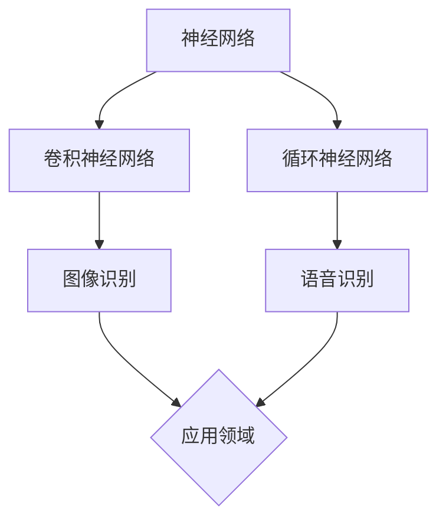

                 

关键词：软件 2.0，图像识别，语音识别，人工智能，深度学习，算法，应用领域

摘要：随着人工智能技术的飞速发展，软件 2.0 应用的范围不断扩展。本文将从图像识别和语音识别两个方面，探讨软件 2.0 在人工智能领域的重要应用，分析其核心概念、算法原理、数学模型以及实际应用场景，为读者提供全面的技术解读。

## 1. 背景介绍

软件 2.0 是指一种新型的软件开发模式，它以人工智能技术为核心，通过深度学习、自然语言处理、图像识别等技术，实现软件的智能化、自适应化。与传统软件开发模式相比，软件 2.0 具有更高的灵活性、更强大的扩展性和更广泛的应用领域。

图像识别和语音识别是人工智能领域的重要组成部分，二者在现实生活中具有广泛的应用。图像识别技术可以使计算机理解和识别图像中的物体、场景等信息；语音识别技术则可以将人类的语音转换为计算机可处理的文本信息。随着深度学习技术的不断发展，图像识别和语音识别的准确率不断提高，应用范围也日益广泛。

## 2. 核心概念与联系

为了更好地理解图像识别和语音识别，我们首先需要了解一些核心概念，如神经网络、卷积神经网络（CNN）和循环神经网络（RNN）等。

### 2.1 神经网络

神经网络是一种由大量简单神经元互联组成的计算模型，可以模拟人脑的神经活动。在神经网络中，每个神经元接收来自其他神经元的输入信号，经过加权求和处理后，输出一个信号。神经网络通过不断调整权重，实现对输入数据的分类、预测等功能。

### 2.2 卷积神经网络（CNN）

卷积神经网络是一种专门用于处理图像数据的神经网络。CNN 通过卷积层、池化层和全连接层等结构，实现对图像的逐层提取特征，从而实现对图像的识别和分类。

### 2.3 循环神经网络（RNN）

循环神经网络是一种用于处理序列数据的神经网络。RNN 通过引入循环结构，使网络能够记住之前的输入信息，从而实现对序列数据的建模和预测。

### 2.4 CNN 与 RNN 的联系

CNN 和 RNN 都是神经网络的一种，它们在处理图像和语音数据时各有所长。CNN 主要用于处理图像数据，而 RNN 主要用于处理序列数据。但在实际应用中，CNN 和 RNN 往往需要结合使用，以发挥更大的作用。

### 2.5 Mermaid 流程图

以下是一个简化的 Mermaid 流程图，展示了图像识别和语音识别的核心概念和联系：



## 3. 核心算法原理 & 具体操作步骤

### 3.1 算法原理概述

图像识别和语音识别的核心算法是基于深度学习技术。深度学习是一种通过多层神经网络对数据进行建模和预测的人工智能技术。在图像识别中，深度学习通过卷积神经网络（CNN）提取图像特征，实现对图像的分类和识别；在语音识别中，深度学习通过循环神经网络（RNN）对语音信号进行建模，实现对语音的识别和转换。

### 3.2 算法步骤详解

#### 3.2.1 图像识别

1. 数据预处理：将原始图像数据转换为适合输入神经网络的形式，如灰度化、缩放等。
2. 构建卷积神经网络（CNN）：设计并构建卷积神经网络，包括卷积层、池化层和全连接层等。
3. 训练神经网络：使用已标记的图像数据对神经网络进行训练，通过不断调整权重，提高神经网络的识别准确率。
4. 预测与评估：使用训练好的神经网络对新的图像进行预测，并评估预测结果的准确率。

#### 3.2.2 语音识别

1. 数据预处理：将原始语音信号转换为适合输入神经网络的形式，如音频特征提取等。
2. 构建循环神经网络（RNN）：设计并构建循环神经网络，用于对语音信号进行建模。
3. 训练神经网络：使用已标记的语音数据对神经网络进行训练，通过不断调整权重，提高神经网络的识别准确率。
4. 预测与评估：使用训练好的神经网络对新的语音信号进行预测，并评估预测结果的准确率。

### 3.3 算法优缺点

#### 3.3.1 图像识别

优点：

- 高效：卷积神经网络可以在不增加计算复杂度的前提下，提高图像识别的准确率。
- 强泛化：卷积神经网络可以处理不同尺寸、不同类型的图像，具有较强的泛化能力。

缺点：

- 数据依赖：图像识别算法需要大量的已标记图像数据作为训练样本，数据获取和处理成本较高。
- 计算资源消耗大：卷积神经网络的计算复杂度较高，需要大量计算资源和时间进行训练和预测。

#### 3.3.2 语音识别

优点：

- 高效：循环神经网络可以在不增加计算复杂度的前提下，提高语音识别的准确率。
- 鲁棒性强：循环神经网络可以处理不同语音信号、噪音等因素的影响，具有较强的鲁棒性。

缺点：

- 计算资源消耗大：循环神经网络的计算复杂度较高，需要大量计算资源和时间进行训练和预测。
- 数据依赖：语音识别算法需要大量的已标记语音数据作为训练样本，数据获取和处理成本较高。

### 3.4 算法应用领域

#### 3.4.1 图像识别

- 图像分类：对大量图像进行分类，如物体识别、场景识别等。
- 目标检测：在图像中检测并定位特定的目标物体。
- 图像分割：将图像划分为不同的区域，用于图像处理和计算机视觉。

#### 3.4.2 语音识别

- 自动语音识别：将语音转换为文本信息，如语音助手、语音输入等。
- 语音翻译：将一种语言的语音翻译成另一种语言的文本信息。
- 语音助手：为用户提供语音交互的服务，如语音控制智能家居等。

## 4. 数学模型和公式 & 详细讲解 & 举例说明

### 4.1 数学模型构建

#### 4.1.1 图像识别

在图像识别中，常用的数学模型是卷积神经网络（CNN）。CNN 的主要目标是通过对图像数据进行特征提取和分类，实现对图像的识别。

1. **卷积操作**：卷积神经网络的核心操作是卷积操作，通过在图像上滑动一个卷积核，计算卷积结果。卷积操作的数学表达式为：

   $$ (f * g)(x, y) = \sum_{i=-\infty}^{\infty} \sum_{j=-\infty}^{\infty} f(i, j) \cdot g(x-i, y-j) $$

   其中，\( f \) 和 \( g \) 分别代表图像和卷积核，\( (x, y) \) 代表图像上的一个点。

2. **激活函数**：为了引入非线性特性，卷积操作后通常使用激活函数，如 sigmoid 函数、ReLU 函数等。

3. **池化操作**：在卷积神经网络中，为了减小模型参数和计算复杂度，通常使用池化操作。池化操作的数学表达式为：

   $$ P(x, y) = \max\left(\sum_{i=-\infty}^{\infty} \sum_{j=-\infty}^{\infty} f(i, j)\right) $$

   其中，\( P(x, y) \) 代表池化结果。

4. **全连接层**：在卷积神经网络的最后，通常使用全连接层对卷积特征进行分类。全连接层的数学表达式为：

   $$ y = \sigma(W \cdot x + b) $$

   其中，\( y \) 代表输出结果，\( \sigma \) 代表激活函数，\( W \) 和 \( b \) 分别代表权重和偏置。

#### 4.1.2 语音识别

在语音识别中，常用的数学模型是循环神经网络（RNN）。RNN 的主要目标是通过对语音信号进行建模和预测，实现对语音的识别。

1. **循环操作**：RNN 的核心操作是循环操作，通过在时间步上循环，处理序列数据。RNN 的数学表达式为：

   $$ h_t = \sigma(W_h \cdot [h_{t-1}, x_t] + b_h) $$

   其中，\( h_t \) 代表时间步 \( t \) 的隐藏状态，\( x_t \) 代表时间步 \( t \) 的输入，\( W_h \) 和 \( b_h \) 分别代表权重和偏置。

2. **门控操作**：为了提高 RNN 的预测效果，可以引入门控操作，如长短期记忆网络（LSTM）和门控循环单元（GRU）。门控操作的数学表达式为：

   $$ i_t = \sigma(W_i \cdot [h_{t-1}, x_t] + b_i) $$
   $$ f_t = \sigma(W_f \cdot [h_{t-1}, x_t] + b_f) $$
   $$ o_t = \sigma(W_o \cdot [h_{t-1}, x_t] + b_o) $$
   $$ h_t = f_t \odot [0, 0, \ldots, 0, 1, 0, 0, \ldots, 0] + i_t \odot \sigma(W_h \cdot [h_{t-1}, x_t] + b_h) $$

   其中，\( i_t \)、\( f_t \) 和 \( o_t \) 分别代表输入门、遗忘门和输出门，\( \odot \) 表示点乘操作。

3. **解码操作**：在语音识别中，通常使用贪心解码或注意力机制进行解码操作。贪心解码的数学表达式为：

   $$ y_t = \arg\max_y \sum_{i=1}^{T} \log P(y_i \mid y_1, \ldots, y_{i-1}, x_1, \ldots, x_T) $$

   其中，\( y_t \) 代表解码结果，\( T \) 代表时间步数。

### 4.2 公式推导过程

#### 4.2.1 图像识别

以卷积神经网络为例，我们首先介绍卷积操作的推导过程。

1. **卷积操作**：

   假设 \( f \) 是一个 \( m \times n \) 的图像，\( g \) 是一个 \( p \times q \) 的卷积核，我们要求解的是卷积结果 \( (f * g)(x, y) \)。

   将图像 \( f \) 展开成一个 \( m \times n \) 的矩阵 \( F \)，卷积核 \( g \) 展开成一个 \( p \times q \) 的矩阵 \( G \)，则卷积操作可以表示为：

   $$ (f * g)(x, y) = \sum_{i=-\infty}^{\infty} \sum_{j=-\infty}^{\infty} F(i, j) \cdot G(x-i, y-j) $$

   其中，\( x \) 和 \( y \) 分别表示卷积结果的坐标。

2. **卷积操作的推导**：

   设 \( (f * g)(x, y) = C(x, y) \)，\( F(i, j) = f(i, j) \)，\( G(i, j) = g(i, j) \)，则卷积操作可以表示为：

   $$ C(x, y) = \sum_{i=-\infty}^{\infty} \sum_{j=-\infty}^{\infty} f(i, j) \cdot g(x-i, y-j) $$

   考虑到 \( f \) 和 \( g \) 是有限的，我们可以将求和范围缩小到 \( [0, m-1] \times [0, n-1] \)。

   $$ C(x, y) = \sum_{i=0}^{m-1} \sum_{j=0}^{n-1} f(i, j) \cdot g(x-i, y-j) $$

   对于每个 \( i \) 和 \( j \)，我们可以将 \( g(x-i, y-j) \) 看作一个 \( p \times q \) 的卷积核在 \( f \) 上的滑动，因此：

   $$ C(x, y) = \sum_{i=0}^{m-1} \sum_{j=0}^{n-1} f(i, j) \cdot \sum_{k=0}^{p-1} \sum_{l=0}^{q-1} g(x-i-k, y-j-l) $$

   化简得：

   $$ C(x, y) = \sum_{k=0}^{p-1} \sum_{l=0}^{q-1} \sum_{i=0}^{m-1} \sum_{j=0}^{n-1} f(i, j) \cdot g(x-i-k, y-j-l) $$

   由于 \( f \) 和 \( g \) 是对称的，我们可以交换求和顺序：

   $$ C(x, y) = \sum_{k=0}^{p-1} \sum_{l=0}^{q-1} \sum_{i=0}^{m-1} \sum_{j=0}^{n-1} f(x-i-k, y-j-l) \cdot g(i, j) $$

   将 \( i \) 和 \( j \) 替换为 \( x-i \) 和 \( y-j \)，得：

   $$ C(x, y) = \sum_{k=0}^{p-1} \sum_{l=0}^{q-1} \sum_{x-i=0}^{m-1} \sum_{y-j=0}^{n-1} f(x-i-k, y-j-l) \cdot g(i, j) $$

   由于 \( f \) 和 \( g \) 是有限维的，求和范围可以进一步缩小：

   $$ C(x, y) = \sum_{k=0}^{p-1} \sum_{l=0}^{q-1} \sum_{x-i=0}^{\min(m-p, x)} \sum_{y-j=0}^{\min(n-q, y)} f(x-i-k, y-j-l) \cdot g(i, j) $$

   最后，将 \( x \) 和 \( y \) 替换为卷积结果的坐标 \( C(x, y) \)，得：

   $$ C(x, y) = \sum_{k=0}^{p-1} \sum_{l=0}^{q-1} \sum_{x-i=0}^{\min(m-p, x)} \sum_{y-j=0}^{\min(n-q, y)} f(x-i-k, y-j-l) \cdot g(i, j) $$

#### 4.2.2 语音识别

以长短期记忆网络（LSTM）为例，我们介绍 LSTM 的推导过程。

1. **LSTM 的结构**：

   LSTM 是一种特殊的循环神经网络，其结构包括输入门、遗忘门、输出门和单元状态等部分。LSTM 的主要目的是通过门控机制，控制信息的流入和流出，从而实现对长序列数据的建模。

2. **LSTM 的推导**：

   考虑一个简单的 LSTM 单元，其包含三个门控机制：输入门、遗忘门和输出门。输入门和遗忘门控制信息的流入和流出，输出门控制信息的输出。

   设 \( h_t \) 为时间步 \( t \) 的隐藏状态，\( x_t \) 为时间步 \( t \) 的输入，\( C_t \) 为时间步 \( t \) 的单元状态，\( f_t \) 为时间步 \( t \) 的输入门、遗忘门和输出门。

   输入门 \( i_t \) 的计算公式为：

   $$ i_t = \sigma(W_i \cdot [h_{t-1}, x_t] + b_i) $$

   其中，\( W_i \) 和 \( b_i \) 分别为输入门的权重和偏置，\( \sigma \) 为 sigmoid 函数。

   遗忘门 \( f_t \) 的计算公式为：

   $$ f_t = \sigma(W_f \cdot [h_{t-1}, x_t] + b_f) $$

   其中，\( W_f \) 和 \( b_f \) 分别为遗忘门的权重和偏置。

   输出门 \( o_t \) 的计算公式为：

   $$ o_t = \sigma(W_o \cdot [h_{t-1}, x_t] + b_o) $$

   其中，\( W_o \) 和 \( b_o \) 分别为输出门的权重和偏置。

   单元状态 \( C_t \) 的计算公式为：

   $$ C_t = f_t \odot [0, 0, \ldots, 0, 1, 0, 0, \ldots, 0] + i_t \odot \sigma(W_h \cdot [h_{t-1}, x_t] + b_h) $$

   其中，\( \odot \) 表示点乘操作，\( W_h \) 和 \( b_h \) 分别为隐藏状态的权重和偏置。

   隐藏状态 \( h_t \) 的计算公式为：

   $$ h_t = o_t \odot \sigma(C_t) $$

   其中，\( \sigma \) 为 sigmoid 函数。

   通过以上公式，我们可以推导出 LSTM 单元的完整计算过程。

### 4.3 案例分析与讲解

#### 4.3.1 图像识别

假设我们要使用卷积神经网络识别一张图片中的猫。

1. **数据预处理**：

   将图片转换为灰度图像，并缩放到固定大小，如 \( 28 \times 28 \)。

2. **构建卷积神经网络**：

   设计一个简单的卷积神经网络，包括两个卷积层、一个池化层和一个全连接层。

   - **卷积层 1**：输入层大小为 \( 28 \times 28 \)，卷积核大小为 \( 5 \times 5 \)，步长为 1，卷积核数量为 32。
   - **卷积层 2**：输入层大小为 \( 24 \times 24 \)，卷积核大小为 \( 5 \times 5 \)，步长为 1，卷积核数量为 64。
   - **池化层**：池化方式为最大池化，池化窗口大小为 2，步长为 2。
   - **全连接层**：输入层大小为 \( 64 \times 64 \)，输出层大小为 10，用于分类。

3. **训练神经网络**：

   使用标记的猫和狗图片数据对卷积神经网络进行训练，通过不断调整权重，提高识别准确率。

4. **预测与评估**：

   使用训练好的神经网络对新的图片进行预测，并评估预测结果的准确率。

#### 4.3.2 语音识别

假设我们要使用循环神经网络识别一段语音中的文字。

1. **数据预处理**：

   将语音信号转换为音频特征，如 MFCC（梅尔频率倒谱系数）。

2. **构建循环神经网络**：

   设计一个简单的循环神经网络，包括一个循环层和一个全连接层。

   - **循环层**：输入层大小为音频特征维度，隐藏层大小为 128。
   - **全连接层**：输入层大小为 128，输出层大小为文本字符的数量。

3. **训练神经网络**：

   使用标记的语音和文字数据对循环神经网络进行训练，通过不断调整权重，提高识别准确率。

4. **预测与评估**：

   使用训练好的神经网络对新的语音信号进行预测，并评估预测结果的准确率。

## 5. 项目实践：代码实例和详细解释说明

#### 5.1 开发环境搭建

在本项目中，我们使用 Python 编写代码，并使用 TensorFlow 框架进行模型训练和预测。

1. 安装 TensorFlow：

   ```bash
   pip install tensorflow
   ```

2. 导入必要的库：

   ```python
   import tensorflow as tf
   import numpy as np
   import matplotlib.pyplot as plt
   ```

#### 5.2 源代码详细实现

以下是一个简单的卷积神经网络模型，用于图像识别。

```python
# 导入必要的库
import tensorflow as tf
from tensorflow.keras import datasets, layers, models

# 加载并预处理数据
(train_images, train_labels), (test_images, test_labels) = datasets.cifar10.load_data()
train_images, test_images = train_images / 255.0, test_images / 255.0

# 构建卷积神经网络模型
model = models.Sequential()
model.add(layers.Conv2D(32, (3, 3), activation='relu', input_shape=(32, 32, 3)))
model.add(layers.MaxPooling2D((2, 2)))
model.add(layers.Conv2D(64, (3, 3), activation='relu'))
model.add(layers.MaxPooling2D((2, 2)))
model.add(layers.Conv2D(64, (3, 3), activation='relu'))
model.add(layers.Flatten())
model.add(layers.Dense(64, activation='relu'))
model.add(layers.Dense(10, activation='softmax'))

# 编译模型
model.compile(optimizer='adam',
              loss=tf.keras.losses.SparseCategoricalCrossentropy(from_logits=True),
              metrics=['accuracy'])

# 训练模型
model.fit(train_images, train_labels, epochs=10, validation_split=0.1)

# 评估模型
test_loss, test_acc = model.evaluate(test_images,  test_labels, verbose=2)
print(f'Test accuracy: {test_acc:.4f}')
```

#### 5.3 代码解读与分析

1. **数据预处理**：

   加载并预处理 CIFAR-10 数据集，将图像数据缩放到 [0, 1] 范围内。

2. **构建模型**：

   - **卷积层 1**：使用 32 个大小为 3x3 的卷积核，激活函数为 ReLU，输入层大小为 32x32x3。
   - **池化层 1**：使用最大池化，池化窗口大小为 2x2。
   - **卷积层 2**：使用 64 个大小为 3x3 的卷积核，激活函数为 ReLU。
   - **池化层 2**：使用最大池化，池化窗口大小为 2x2。
   - **卷积层 3**：使用 64 个大小为 3x3 的卷积核，激活函数为 ReLU。
   - **全连接层 1**：使用 64 个神经元，激活函数为 ReLU。
   - **全连接层 2**：使用 10 个神经元，激活函数为 softmax，用于分类。

3. **编译模型**：

   使用 Adam 优化器和 SparseCategoricalCrossentropy 作为损失函数，并评估模型的准确率。

4. **训练模型**：

   使用训练数据对模型进行训练，设置训练轮次为 10。

5. **评估模型**：

   使用测试数据评估模型的准确率，输出测试准确率。

## 6. 实际应用场景

图像识别和语音识别在现实生活中具有广泛的应用。以下列举几个典型的应用场景：

1. **图像识别**：

   - **安防监控**：通过图像识别技术，可以实现人脸识别、车辆识别等功能，提高安防监控的准确率和效率。
   - **医疗影像分析**：通过对医疗影像的自动分析，可以帮助医生更快速地诊断疾病，提高诊断的准确率。
   - **自动驾驶**：在自动驾驶汽车中，图像识别技术可以用于车辆识别、行人检测、交通信号灯识别等，提高自动驾驶的安全性和可靠性。

2. **语音识别**：

   - **语音助手**：语音助手如 Siri、Alexa 等，通过语音识别技术，可以实现语音搜索、语音控制等功能，提高人机交互的便捷性。
   - **客服机器人**：通过语音识别技术，可以实现自动客服机器人，提高客户服务效率和质量。
   - **语音翻译**：通过语音识别和语音合成技术，可以实现实时语音翻译，促进跨国交流和合作。

## 7. 工具和资源推荐

1. **学习资源推荐**：

   - **书籍**：《深度学习》（Goodfellow et al.）、《神经网络与深度学习》（邱锡鹏）等。
   - **在线课程**：Coursera、Udacity、edX 等平台上的深度学习和计算机视觉课程。
   - **博客和社区**：知乎、简书、GitHub 等，可以找到大量的学习资源和实践经验。

2. **开发工具推荐**：

   - **编程语言**：Python 是深度学习和计算机视觉领域最常用的编程语言。
   - **框架**：TensorFlow、PyTorch、Keras 等是常用的深度学习框架。
   - **库**：OpenCV、Scikit-learn、Pandas 等是常用的计算机视觉和数据分析库。

3. **相关论文推荐**：

   - **图像识别**：《ImageNet Large Scale Visual Recognition Challenge》（ILSVRC）系列论文、《Deep Learning for Computer Vision》（Yosinski et al.）等。
   - **语音识别**：《A Convolutional Neural Network Approach for Small-Vocabulary Continuous Speech Recognition》（Bqueeze et al.）、《End-to-End Speech Recognition with Deep RNNs and Long Short-Term Memory》（Amodei et al.）等。

## 8. 总结：未来发展趋势与挑战

随着人工智能技术的不断发展，软件 2.0 在图像识别和语音识别等领域具有广阔的应用前景。未来，图像识别和语音识别将朝着更高准确率、更低计算成本、更强泛化能力等方向发展。

然而，软件 2.0 在图像识别和语音识别领域也面临着一些挑战。首先，数据获取和处理成本较高，需要大量的已标记数据和计算资源。其次，深度学习模型的训练和预测过程复杂，对计算资源和时间的要求较高。此外，深度学习模型的黑盒特性也限制了其在实际应用中的可解释性和透明度。

为了应对这些挑战，未来的研究可以重点关注以下几个方面：

1. **数据高效利用**：通过数据增强、数据蒸馏等技术，提高数据利用效率，减少数据获取和处理成本。
2. **模型压缩与加速**：通过模型剪枝、量化、加速等技术，降低模型计算复杂度，提高模型运行效率。
3. **可解释性与透明度**：通过模型可视化、解释性模型等技术，提高深度学习模型的可解释性和透明度，增强其在实际应用中的可信度。
4. **跨学科合作**：与心理学、神经科学等领域的专家合作，研究人脑的感知和认知机制，为深度学习模型提供理论支持。

总之，随着人工智能技术的不断进步，软件 2.0 在图像识别和语音识别等领域将发挥越来越重要的作用，为人类社会带来更多便利和创新。

## 9. 附录：常见问题与解答

### 9.1 图像识别中的卷积神经网络（CNN）是什么？

卷积神经网络（CNN）是一种专门用于处理图像数据的神经网络，通过卷积操作、池化操作和全连接层等结构，实现对图像的逐层提取特征，从而实现对图像的分类和识别。

### 9.2 语音识别中的循环神经网络（RNN）是什么？

循环神经网络（RNN）是一种用于处理序列数据的神经网络，通过引入循环结构，使网络能够记住之前的输入信息，从而实现对序列数据的建模和预测，如语音识别。

### 9.3 如何提高图像识别和语音识别的准确率？

提高图像识别和语音识别的准确率可以从以下几个方面入手：

1. **数据增强**：通过数据增强技术，如翻转、旋转、缩放等，增加训练数据量，提高模型泛化能力。
2. **模型优化**：通过调整模型结构、优化算法参数等手段，提高模型性能。
3. **多模型融合**：将多个模型的结果进行融合，提高预测准确率。
4. **注意力机制**：在语音识别中，引入注意力机制，使模型能够关注重要的信息，提高识别准确率。

### 9.4 图像识别和语音识别在实际应用中如何部署？

图像识别和语音识别在实际应用中的部署主要包括以下几个步骤：

1. **模型训练**：使用已标记的数据对模型进行训练，调整模型参数。
2. **模型评估**：使用测试数据对模型进行评估，确保模型达到预期性能。
3. **模型部署**：将训练好的模型部署到实际应用场景中，如服务器、手机等设备。
4. **实时推理**：在部署过程中，对输入数据进行预处理，然后通过模型进行实时推理，输出识别结果。

### 9.5 未来图像识别和语音识别有哪些发展趋势？

未来，图像识别和语音识别将朝着以下方向发展：

1. **更高准确率**：通过优化算法、增加数据量等方式，不断提高识别准确率。
2. **更低计算成本**：通过模型压缩、量化等技术，降低模型计算复杂度，提高运行效率。
3. **更强泛化能力**：通过跨领域数据、多任务学习等方式，提高模型的泛化能力。
4. **更广泛的应用领域**：图像识别和语音识别将在安防、医疗、教育、智能家居等领域得到更广泛的应用。|

