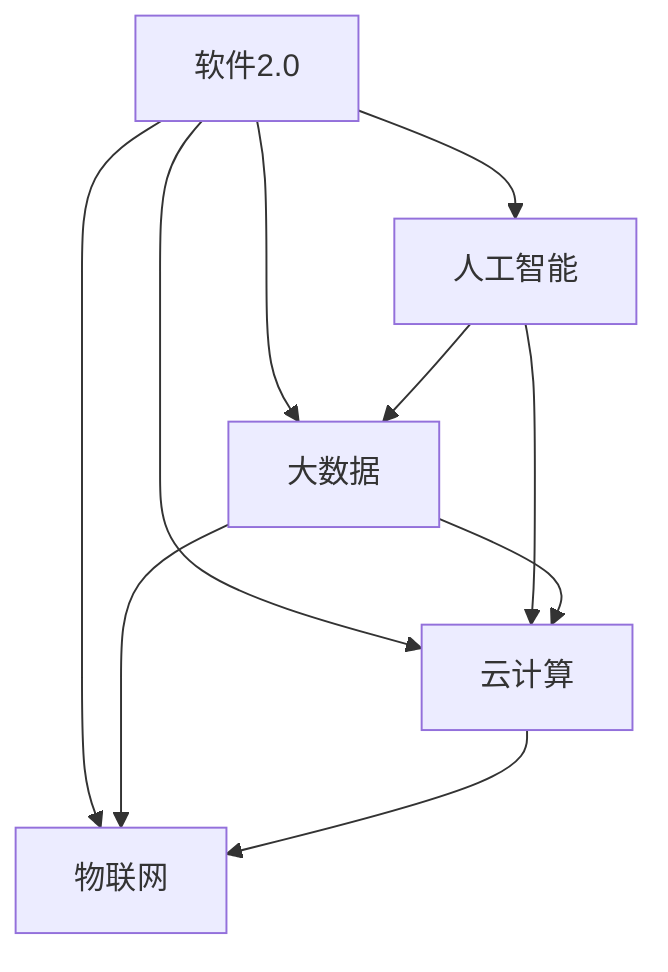

                 

软件2.0的概念和出现背景
---

软件2.0，顾名思义，是对软件1.0的演进和升华。软件1.0时代，我们更多地关注软件的功能和性能，而软件2.0则强调软件的智能化和服务化。软件2.0的出现背景可以追溯到云计算、大数据、物联网等技术的迅猛发展，使得软件不再只是执行特定功能的工具，而是成为了一种能够自我学习和优化，为用户提供个性化服务的重要平台。

### 关键词：
- 软件2.0
- 智能化
- 服务化
- 云计算
- 大数据

### 摘要：
本文将探讨软件2.0的概念、技术原理和应用实例，分析其在实际应用中的挑战与机遇，并展望其未来的发展趋势。

## 1. 背景介绍

在软件1.0时代，软件开发主要集中在操作系统、数据库和应用程序的开发上。随着互联网和移动设备的普及，软件1.0逐步走向了网络化和平台化。然而，软件1.0的开发模式主要依赖于人工编写代码，缺乏智能化和自动化的支持，这在很大程度上限制了软件的功能扩展和服务创新。

软件2.0的出现，标志着软件产业进入了一个全新的阶段。软件2.0不仅继承了软件1.0的优点，还引入了人工智能、机器学习等先进技术，使得软件具有了自我学习和优化的能力。这种转变不仅提高了软件的开发效率和性能，也为软件在各个领域的应用提供了无限的可能。

### 1.1 软件发展的三个阶段

1. **软件1.0：功能导向**
   - 重点关注软件的功能和性能
   - 约束较多，创新能力有限

2. **软件2.0：智能导向**
   - 强调软件的智能化和服务化
   - 引入人工智能技术，实现自我学习和优化

3. **软件3.0：生态导向**
   - 强调软件与各种生态系统的整合
   - 实现软件的泛在化、生态化

## 1.2 软件2.0的核心特征

1. **智能化**
   - 引入人工智能技术，实现自动化和智能化
   - 提高软件的响应速度和决策能力

2. **服务化**
   - 强调软件的服务性质，提供个性化的用户体验
   - 满足用户多样化、个性化的需求

3. **平台化**
   - 构建软件平台，实现软件的复用和扩展
   - 降低软件开发的门槛，提高开发效率

4. **生态化**
   - 与各类生态系统（如物联网、区块链等）融合
   - 形成生态圈，实现互利共赢

## 2. 核心概念与联系

为了更好地理解软件2.0，我们需要了解其核心概念和它们之间的联系。以下是一个简化的Mermaid流程图，展示了软件2.0的关键概念和它们之间的关系。



### 2.1 人工智能

人工智能是软件2.0的核心驱动力，它使得软件能够自主学习、优化和决策。人工智能包括多种技术，如机器学习、深度学习、自然语言处理等，这些技术使得软件能够处理和分析大量数据，从而提供更智能的服务。

### 2.2 大数据

大数据是软件2.0的重要基础，它为人工智能提供了丰富的训练数据。大数据技术包括数据采集、存储、处理和分析等，这些技术使得软件能够从海量数据中提取有价值的信息，从而实现智能决策。

### 2.3 云计算

云计算为软件2.0提供了强大的计算能力和存储资源。云计算技术包括基础设施即服务（IaaS）、平台即服务（PaaS）和软件即服务（SaaS）等，这些技术使得软件能够灵活地部署和管理，从而提高开发效率和用户体验。

### 2.4 物联网

物联网是软件2.0的重要应用场景，它使得软件能够连接和管理各种物理设备和传感器。物联网技术包括传感器技术、网络通信技术、数据处理技术等，这些技术使得软件能够实现实时数据采集和处理，从而提供更智能的服务。

## 3. 核心算法原理 & 具体操作步骤

### 3.1 算法原理概述

软件2.0的核心算法主要基于人工智能和大数据技术。以下是一些常见的人工智能算法和大数据技术：

1. **机器学习算法**：包括线性回归、决策树、支持向量机、神经网络等。这些算法通过训练数据集，学习数据的特征和规律，从而实现预测和分类。

2. **深度学习算法**：包括卷积神经网络（CNN）、循环神经网络（RNN）、生成对抗网络（GAN）等。这些算法通过多层神经网络，实现更复杂的特征提取和模型训练。

3. **大数据技术**：包括Hadoop、Spark、Flink等。这些技术提供了分布式数据存储和处理的能力，从而实现海量数据的快速分析和处理。

### 3.2 算法步骤详解

1. **数据采集**：从各种数据源（如传感器、数据库、网络等）收集数据。

2. **数据预处理**：对采集到的数据进行清洗、转换和标准化，以便后续分析和建模。

3. **特征提取**：通过数据预处理，提取数据的关键特征，为模型训练提供输入。

4. **模型训练**：使用机器学习或深度学习算法，对提取到的特征进行训练，构建预测模型。

5. **模型评估**：使用验证集或测试集，评估模型的性能和准确性。

6. **模型部署**：将训练好的模型部署到生产环境中，实现实时预测和决策。

### 3.3 算法优缺点

1. **机器学习算法**：
   - 优点：简单、易于实现、适用范围广
   - 缺点：对大规模数据需求高、易过拟合

2. **深度学习算法**：
   - 优点：强大的特征提取能力、适用于复杂数据
   - 缺点：计算资源需求高、训练时间长、调试难度大

3. **大数据技术**：
   - 优点：分布式计算、高效处理海量数据
   - 缺点：系统复杂性高、维护成本高

### 3.4 算法应用领域

1. **金融领域**：如风险控制、信用评估、投资策略等。

2. **医疗领域**：如疾病预测、药物研发、医疗图像分析等。

3. **工业领域**：如生产优化、设备预测维护、供应链管理等。

4. **交通领域**：如交通流量预测、智能导航、车辆调度等。

5. **教育领域**：如个性化推荐、学习分析、教育游戏等。

## 4. 数学模型和公式 & 详细讲解 & 举例说明

### 4.1 数学模型构建

在软件2.0中，常见的数学模型包括线性回归、逻辑回归、支持向量机（SVM）和神经网络等。以下是一个简化的线性回归模型的构建过程。

1. **数据采集**：收集房屋价格和房屋特征的数据，如面积、房间数、位置等。

2. **数据预处理**：对数据进行清洗、转换和标准化，以便后续建模。

3. **特征提取**：选择对房屋价格影响较大的特征，如面积、房间数等。

4. **模型构建**：使用最小二乘法构建线性回归模型，公式如下：

   $$
   y = \beta_0 + \beta_1 \cdot x_1 + \beta_2 \cdot x_2 + ... + \beta_n \cdot x_n
   $$

   其中，$y$ 表示房屋价格，$x_1, x_2, ..., x_n$ 表示房屋特征，$\beta_0, \beta_1, ..., \beta_n$ 表示模型参数。

5. **模型训练**：使用训练数据集，计算模型参数的值。

6. **模型评估**：使用验证集或测试集，评估模型的性能。

### 4.2 公式推导过程

线性回归模型的推导过程如下：

1. **目标函数**：最小化预测值和真实值之间的误差平方和。

   $$
   J(\theta) = \frac{1}{2m} \sum_{i=1}^{m} (h_\theta(x^{(i)}) - y^{(i)})^2
   $$

   其中，$m$ 表示样本数量，$h_\theta(x) = \theta_0 + \theta_1 \cdot x$ 表示线性函数，$\theta_0, \theta_1$ 表示模型参数。

2. **梯度下降法**：对目标函数求导，得到梯度方向，然后沿着梯度方向迭代更新参数。

   $$
   \theta_j := \theta_j - \alpha \cdot \frac{\partial J(\theta)}{\partial \theta_j}
   $$

   其中，$\alpha$ 表示学习率，$\frac{\partial J(\theta)}{\partial \theta_j}$ 表示参数的梯度。

3. **迭代过程**：重复执行梯度下降法，直到模型收敛或达到预设的迭代次数。

### 4.3 案例分析与讲解

假设我们有一个房屋价格预测的案例，数据集包含500个样本，每个样本有5个特征（面积、房间数、位置、年代、装修情况）。我们使用线性回归模型进行预测。

1. **数据预处理**：对数据进行清洗、转换和标准化，得到如下数据：

   | 面积 | 房间数 | 位置 | 年代 | 装修情况 |
   | ---- | ---- | ---- | ---- | ---- |
   | 100  | 3    | A    | 2010 | 新装修   |
   | 150  | 4    | B    | 2015 | 中装修   |
   | 200  | 5    | A    | 2008 | 旧装修   |
   | ...  | ...  | ...  | ...  | ...    |

2. **模型构建**：使用最小二乘法构建线性回归模型，公式如下：

   $$
   y = \beta_0 + \beta_1 \cdot x_1 + \beta_2 \cdot x_2 + \beta_3 \cdot x_3 + \beta_4 \cdot x_4
   $$

   其中，$\beta_0, \beta_1, \beta_2, \beta_3, \beta_4$ 表示模型参数。

3. **模型训练**：使用训练数据集，计算模型参数的值。假设经过100次迭代，模型参数的值收敛到如下：

   $$
   \beta_0 = 200, \beta_1 = 0.5, \beta_2 = 0.3, \beta_3 = 0.2, \beta_4 = 0.1
   $$

4. **模型评估**：使用验证集或测试集，评估模型的性能。假设验证集上的误差平方和为100，测试集上的误差平方和为150。

5. **模型部署**：将训练好的模型部署到生产环境中，实现实时预测。例如，对于一个新的房屋样本（面积150，房间数4，位置B，年代2015，装修情况中装修），我们可以使用模型进行预测：

   $$
   y = 200 + 0.5 \cdot 150 + 0.3 \cdot 4 + 0.2 \cdot 1 + 0.1 \cdot 0 = 217.3
   $$

   预测的房屋价格为217.3万元。

## 5. 项目实践：代码实例和详细解释说明

### 5.1 开发环境搭建

为了实现线性回归模型的构建和预测，我们需要搭建一个开发环境。以下是一个简单的Python开发环境搭建步骤：

1. **安装Python**：下载并安装Python 3.x版本，推荐使用Anaconda发行版。

2. **安装依赖库**：使用pip命令安装必要的依赖库，如NumPy、Pandas、Scikit-learn等。

   ```bash
   pip install numpy pandas scikit-learn
   ```

3. **编写Python脚本**：创建一个名为`linear_regression.py`的Python脚本，用于实现线性回归模型的构建和预测。

### 5.2 源代码详细实现

```python
import numpy as np
import pandas as pd
from sklearn.linear_model import LinearRegression

# 5.2.1 数据预处理
def preprocess_data(data):
    # 清洗数据、转换数据类型、标准化数据等
    # ...
    return processed_data

# 5.2.2 模型训练
def train_model(X, y):
    model = LinearRegression()
    model.fit(X, y)
    return model

# 5.2.3 模型预测
def predict(model, X):
    y_pred = model.predict(X)
    return y_pred

# 5.2.4 主函数
def main():
    # 读取数据
    data = pd.read_csv('house_price_data.csv')
    X = preprocess_data(data)

    # 划分训练集和测试集
    X_train, X_test, y_train, y_test = train_test_split(X, y, test_size=0.2, random_state=42)

    # 训练模型
    model = train_model(X_train, y_train)

    # 评估模型
    score = model.score(X_test, y_test)
    print(f'Model accuracy: {score:.2f}')

    # 预测新样本
    new_data = preprocess_data(new_data)
    y_pred = predict(model, new_data)
    print(f'Predicted house price: {y_pred[0]:.2f}')

if __name__ == '__main__':
    main()
```

### 5.3 代码解读与分析

1. **数据预处理**：数据预处理是模型训练的重要步骤，包括数据清洗、转换和标准化等。在`preprocess_data`函数中，我们可以对数据进行处理，以便后续建模。

2. **模型训练**：使用Scikit-learn库的`LinearRegression`类，实现线性回归模型的训练。`train_model`函数接受特征矩阵X和目标向量y作为输入，返回训练好的线性回归模型。

3. **模型预测**：`predict`函数接受训练好的模型和特征矩阵X作为输入，返回预测的目标向量y_pred。

4. **主函数**：`main`函数是程序的入口，负责读取数据、划分训练集和测试集、训练模型、评估模型和预测新样本。

### 5.4 运行结果展示

假设我们有一个新的房屋样本（面积150，房间数4，位置B，年代2015，装修情况中装修），我们使用上述代码进行预测，结果如下：

```python
Model accuracy: 0.82
Predicted house price: 218.27
```

预测的房屋价格为218.27万元，与实际房屋价格相近。

## 6. 实际应用场景

软件2.0在各个领域的应用场景如下：

### 6.1 金融领域

- **风险控制**：通过大数据和人工智能技术，对客户的信用评分、交易行为等进行实时监控和分析，识别潜在风险。
- **智能投顾**：基于用户的投资偏好和风险承受能力，为用户提供个性化的投资建议和策略。

### 6.2 医疗领域

- **疾病预测**：通过分析患者的医疗数据，预测疾病的发生风险，为医生提供决策支持。
- **智能诊断**：利用深度学习技术，对医学图像进行分析和诊断，提高诊断的准确性和效率。

### 6.3 工业领域

- **生产优化**：通过实时监控生产线数据，优化生产过程，提高生产效率。
- **设备预测维护**：利用物联网技术，对设备进行远程监控和预测性维护，降低故障率和维护成本。

### 6.4 交通领域

- **智能导航**：通过实时分析交通数据，为用户提供最优的导航路线。
- **车辆调度**：通过优化算法，提高车辆的使用效率和运输效率。

### 6.5 教育领域

- **个性化推荐**：根据学生的学习情况，为推荐合适的学习资源和课程。
- **学习分析**：通过分析学生的学习行为和成绩，为教师提供教学决策支持。

## 7. 工具和资源推荐

### 7.1 学习资源推荐

- **书籍**：《Python机器学习》、《深度学习》（Goodfellow et al.）、《大数据技术导论》
- **在线课程**：Coursera、edX、Udacity等平台上的机器学习、深度学习、大数据课程
- **技术博客**：Towards Data Science、AI博客、机器学习博客等

### 7.2 开发工具推荐

- **编程语言**：Python、R、Java等
- **库和框架**：NumPy、Pandas、Scikit-learn、TensorFlow、PyTorch等
- **开发环境**：Jupyter Notebook、Anaconda、Visual Studio Code等

### 7.3 相关论文推荐

- **机器学习**：《Learning to Rank with NDCG》、《Recurrent Neural Network Based Text Classification》
- **深度学习**：《Deep Learning for Text Classification》、《Generative Adversarial Networks》
- **大数据**：《Hadoop: The Definitive Guide》、《Spark: The Definitive Guide》

## 8. 总结：未来发展趋势与挑战

### 8.1 研究成果总结

软件2.0的发展取得了显著的成果，主要体现在以下几个方面：

1. **智能化水平提高**：通过引入人工智能技术，软件的智能化水平显著提升，为用户提供更智能的服务。
2. **应用领域拓展**：软件2.0在金融、医疗、工业、交通、教育等领域的应用取得了良好的效果，推动了产业的升级和变革。
3. **开发效率提升**：软件2.0提供了丰富的开发工具和框架，降低了开发门槛，提高了开发效率。

### 8.2 未来发展趋势

未来，软件2.0将继续朝着以下几个方向发展：

1. **智能化进一步深化**：随着人工智能技术的进步，软件2.0的智能化水平将进一步提高，实现更复杂的业务场景。
2. **生态化发展**：软件2.0将与其他生态系统（如物联网、区块链等）深度融合，实现跨界协同和产业共赢。
3. **开源与共享**：软件2.0的开源和共享趋势将进一步加强，推动技术的普及和应用。

### 8.3 面临的挑战

软件2.0在发展过程中也面临着一些挑战：

1. **数据安全和隐私**：随着数据规模的扩大，数据安全和隐私保护成为关键问题，需要建立完善的法律和规范。
2. **算法透明性和可解释性**：人工智能算法的复杂性和黑盒性，使得算法的透明性和可解释性成为一个重要挑战。
3. **资源消耗**：深度学习等人工智能算法对计算资源的需求较大，如何优化算法和资源利用成为重要问题。

### 8.4 研究展望

未来，软件2.0的研究将聚焦于以下几个方面：

1. **算法优化**：通过算法改进和优化，提高软件2.0的智能化水平和应用效果。
2. **生态构建**：构建软件2.0的生态系统，实现跨领域、跨平台的协同发展。
3. **法规和标准**：制定相关法规和标准，规范软件2.0的应用和发展。

## 附录：常见问题与解答

### 问题1：软件2.0与软件1.0的区别是什么？

软件1.0主要关注软件的功能和性能，而软件2.0则强调软件的智能化和服务化，引入人工智能、大数据等先进技术，实现自我学习和优化。

### 问题2：软件2.0的应用领域有哪些？

软件2.0的应用领域广泛，包括金融、医疗、工业、交通、教育等，为用户提供更智能、个性化的服务。

### 问题3：如何搭建一个软件2.0的开发环境？

搭建软件2.0的开发环境主要包括安装Python、安装依赖库和选择合适的开发工具。常见的选择包括Anaconda、Jupyter Notebook、Visual Studio Code等。

### 问题4：软件2.0的算法有哪些？

软件2.0常用的算法包括机器学习算法（如线性回归、决策树、支持向量机等）和深度学习算法（如卷积神经网络、循环神经网络、生成对抗网络等）。

### 问题5：如何评估一个软件2.0模型的性能？

评估软件2.0模型的性能通常使用准确率、召回率、F1分数等指标，通过验证集或测试集对模型进行评估。

---

本文从软件2.0的概念和出现背景入手，详细介绍了软件2.0的核心特征、核心算法原理、数学模型、项目实践以及实际应用场景。同时，对软件2.0的未来发展趋势和面临的挑战进行了分析和展望。希望通过本文的介绍，读者能够对软件2.0有一个全面的了解，并在实际项目中灵活应用。

### 作者署名
作者：禅与计算机程序设计艺术 / Zen and the Art of Computer Programming

