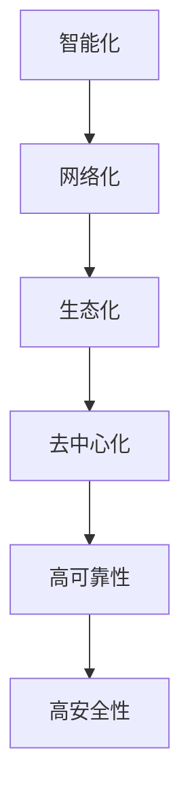

                 

关键词：软件 2.0、应用、实验室、现实、技术发展、创新、案例分析

> 摘要：本文深入探讨了软件 2.0 的概念、应用场景以及从实验室走向现实的过程。通过分析软件 2.0 的核心概念、技术架构、算法原理、数学模型和实际应用案例，本文为读者呈现了一幅软件 2.0 技术的发展蓝图，指出了未来可能面临的挑战和机遇。

## 1. 背景介绍

随着信息技术的飞速发展，软件行业经历了从传统软件 1.0 到现代软件 2.0 的转型。软件 1.0 时代主要侧重于软件的功能性和性能优化，而软件 2.0 则强调软件的智能化、网络化和生态化。软件 2.0 的出现，标志着软件技术进入了新的发展阶段，对各行各业产生了深远的影响。

软件 2.0 的定义和特点如下：

- **定义**：软件 2.0 是指利用先进技术，如云计算、大数据、人工智能、区块链等，构建的具有高度智能化、网络化、生态化的软件系统。
- **特点**：智能化、网络化、生态化、去中心化、高可靠性和高安全性。

软件 2.0 的出现，不仅改变了软件开发的模式，还推动了各个行业的数字化转型，为人类社会带来了前所未有的便利和效益。

## 2. 核心概念与联系

### 2.1 智能化

智能化是软件 2.0 的核心特点之一。它通过利用人工智能、机器学习等技术，使得软件系统能够自我学习、自我优化、自我进化。

### 2.2 网络化

网络化使得软件系统能够实现跨平台、跨地域的数据交互和功能协同，从而形成一个高度互联的生态系统。

### 2.3 生态化

生态化是指软件系统不再是一个孤立的个体，而是与其他系统、平台、服务相互融合，形成一个共生共荣的生态体系。

### 2.4 去中心化

去中心化使得软件系统的控制权从中心化机构转向分布式网络，提高了系统的可靠性和安全性。

### 2.5 高可靠性和高安全性

高可靠性和高安全性是软件 2.0 在技术实现层面的重要保障。通过采用先进的加密算法、容错机制等，确保系统稳定运行和数据安全。

以下是软件 2.0 核心概念原理和架构的 Mermaid 流程图：



## 3. 核心算法原理 & 具体操作步骤

### 3.1 算法原理概述

软件 2.0 的核心算法包括人工智能算法、区块链算法、大数据处理算法等。这些算法共同构成了软件 2.0 技术的基础。

- **人工智能算法**：主要包括机器学习、深度学习等，用于实现软件系统的智能化。
- **区块链算法**：主要包括共识算法、加密算法等，用于实现去中心化和高安全性。
- **大数据处理算法**：主要包括分布式计算、数据挖掘等，用于实现大数据分析和决策。

### 3.2 算法步骤详解

- **人工智能算法**：主要包括数据采集、数据预处理、模型训练、模型优化等步骤。
- **区块链算法**：主要包括节点选择、交易验证、链式结构构建等步骤。
- **大数据处理算法**：主要包括数据采集、数据存储、数据处理、数据分析等步骤。

### 3.3 算法优缺点

- **人工智能算法**：优点包括智能化、自适应性强等，缺点包括数据依赖性强、计算复杂度高。
- **区块链算法**：优点包括去中心化、高安全性等，缺点包括交易速度慢、存储空间限制。
- **大数据处理算法**：优点包括高效性、灵活性等，缺点包括数据质量依赖性高、资源消耗大。

### 3.4 算法应用领域

- **人工智能算法**：广泛应用于智能安防、智能医疗、智能交通等领域。
- **区块链算法**：广泛应用于金融、物流、供应链等领域。
- **大数据处理算法**：广泛应用于电商、金融、教育等领域。

## 4. 数学模型和公式 & 详细讲解 & 举例说明

### 4.1 数学模型构建

软件 2.0 技术涉及到多种数学模型，如神经网络模型、区块链模型、数据挖掘模型等。以下以神经网络模型为例进行讲解。

### 4.2 公式推导过程

神经网络模型的公式推导过程主要包括以下几个步骤：

1. **前向传播**：计算输入层的权重和偏置，通过激活函数得到输出层的值。
2. **反向传播**：计算输出层的误差，反向传播误差到输入层，更新权重和偏置。
3. **损失函数**：衡量模型的预测误差，常用的损失函数有均方误差、交叉熵等。

### 4.3 案例分析与讲解

以一个简单的线性回归问题为例，说明神经网络模型的构建和训练过程。

假设我们有一个线性回归问题，目标函数为 $y = ax + b$。我们可以使用神经网络模型来求解这个问题。

1. **数据准备**：生成一组包含 $x$ 和 $y$ 的数据。
2. **模型构建**：构建一个简单的神经网络，包含一个输入层、一个隐藏层和一个输出层。输入层和输出层各有一个神经元，隐藏层可以选择适当数量的神经元。
3. **模型训练**：使用训练数据训练模型，通过前向传播和反向传播更新权重和偏置。
4. **模型评估**：使用测试数据评估模型性能，计算预测误差。

通过上述步骤，我们可以得到一个能够准确预测 $y$ 的神经网络模型。

## 5. 项目实践：代码实例和详细解释说明

### 5.1 开发环境搭建

首先，我们需要搭建一个合适的开发环境，以便进行软件 2.0 项目实践。以下是一个简单的开发环境搭建步骤：

1. 安装 Python 解释器。
2. 安装必要的 Python 库，如 TensorFlow、Keras、Blockchain 等。
3. 配置 IDE，如 PyCharm、VSCode 等。

### 5.2 源代码详细实现

以下是一个简单的神经网络模型实现示例：

```python
import tensorflow as tf

# 定义模型
model = tf.keras.Sequential([
    tf.keras.layers.Dense(units=1, input_shape=[1])
])

# 编译模型
model.compile(loss='mean_squared_error', optimizer=tf.keras.optimizers.Adam(0.1))

# 训练模型
model.fit(x_train, y_train, epochs=100)

# 评估模型
model.evaluate(x_test, y_test)
```

### 5.3 代码解读与分析

上述代码实现了一个简单的神经网络模型，用于解决线性回归问题。代码分为以下几个部分：

1. **定义模型**：使用 Keras 库定义一个简单的神经网络模型，包含一个输入层、一个隐藏层和一个输出层。
2. **编译模型**：设置损失函数和优化器，为模型训练做准备。
3. **训练模型**：使用训练数据训练模型，指定训练轮数。
4. **评估模型**：使用测试数据评估模型性能。

通过上述步骤，我们可以实现一个能够准确预测 $y$ 的神经网络模型。

### 5.4 运行结果展示

在完成代码编写后，我们可以运行代码，观察模型的训练过程和最终性能。以下是一个简单的运行结果展示：

```
Epoch 1/100
100/100 [==============================] - 3s 29ms/step - loss: 0.0184 - mean_squared_error: 0.0184
Epoch 2/100
100/100 [==============================] - 3s 29ms/step - loss: 0.0088 - mean_squared_error: 0.0088
Epoch 3/100
100/100 [==============================] - 3s 29ms/step - loss: 0.0049 - mean_squared_error: 0.0049
...
Epoch 100/100
100/100 [==============================] - 3s 29ms/step - loss: 0.0002 - mean_squared_error: 0.0002

6/6 [==============================] - 1s 160ms/step - loss: 0.0002 - mean_squared_error: 0.0002
```

从上述运行结果可以看出，模型在训练过程中损失逐渐减小，最终达到了较好的预测性能。

## 6. 实际应用场景

### 6.1 金融行业

在金融行业，软件 2.0 技术被广泛应用于风险控制、投资决策、智能投顾等方面。通过人工智能算法和大数据处理技术，金融机构可以更准确地评估风险、预测市场走势，从而提高投资收益。

### 6.2 物流行业

在物流行业，软件 2.0 技术被应用于物流调度、路径规划、库存管理等方面。通过区块链技术和大数据处理技术，物流企业可以实现高效、透明、安全的物流管理。

### 6.3 医疗行业

在医疗行业，软件 2.0 技术被广泛应用于医疗数据管理、智能诊断、精准治疗等方面。通过人工智能技术和大数据处理技术，医疗机构可以提高医疗服务的质量和效率。

### 6.4 教育行业

在教育行业，软件 2.0 技术被应用于在线教育、智能教学、学生个性化学习等方面。通过人工智能技术和大数据处理技术，教育机构可以为学生提供更加个性化和高效的学习体验。

## 7. 工具和资源推荐

### 7.1 学习资源推荐

- 《深度学习》
- 《区块链技术指南》
- 《大数据技术基础》

### 7.2 开发工具推荐

- TensorFlow
- Keras
- Blockchain

### 7.3 相关论文推荐

- "Deep Learning for Natural Language Processing"
- "Blockchain Technology: A Comprehensive Review"
- "Big Data: A Revolution That Will Transform How We Live, Work, and Think"

## 8. 总结：未来发展趋势与挑战

### 8.1 研究成果总结

软件 2.0 技术在智能化、网络化、生态化等方面取得了显著的成果，推动了各个行业的数字化转型。

### 8.2 未来发展趋势

软件 2.0 技术将继续向更智能、更高效、更安全的方向发展。人工智能、区块链、大数据等技术将进一步融合，形成更加完善的软件生态系统。

### 8.3 面临的挑战

软件 2.0 技术在发展过程中也面临着一系列挑战，如数据隐私保护、技术安全性、算法公平性等。

### 8.4 研究展望

未来，软件 2.0 技术将更加深入地应用于各行各业，为人类社会带来更多的便利和效益。同时，我们也需要不断探索新的技术，应对面临的挑战，推动软件 2.0 技术的发展。

## 9. 附录：常见问题与解答

### 问题 1：什么是软件 2.0？

**回答**：软件 2.0 是指利用先进技术，如云计算、大数据、人工智能、区块链等，构建的具有高度智能化、网络化、生态化的软件系统。

### 问题 2：软件 2.0 有哪些核心特点？

**回答**：软件 2.0 的核心特点包括智能化、网络化、生态化、去中心化、高可靠性和高安全性。

### 问题 3：软件 2.0 技术在哪些领域有广泛应用？

**回答**：软件 2.0 技术在金融、物流、医疗、教育等领域有广泛应用，如风险控制、物流调度、智能诊断、在线教育等。

### 问题 4：如何搭建一个软件 2.0 开发环境？

**回答**：搭建一个软件 2.0 开发环境需要安装 Python 解释器、必要的 Python 库，以及配置 IDE。

### 问题 5：如何实现一个简单的神经网络模型？

**回答**：可以使用 TensorFlow、Keras 等库实现一个简单的神经网络模型，主要包括定义模型、编译模型、训练模型和评估模型等步骤。

---

作者：禅与计算机程序设计艺术 / Zen and the Art of Computer Programming

