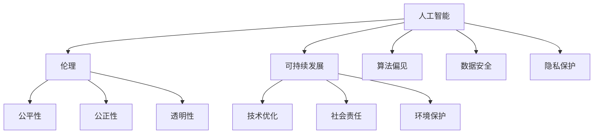

                 

关键词：软件 2.0，社会责任，科技向善，人工智能，伦理，可持续发展

> 摘要：随着软件技术的飞速发展，软件 2.0 时代已经到来。在这一时代，软件不再仅仅是工具，而是社会的基础设施。本文将探讨软件 2.0 在社会责任方面的角色，特别是科技向善的重要性，以及如何通过人工智能和伦理指导来推动可持续发展。

## 1. 背景介绍

软件 2.0，这一概念起源于互联网时代的初期，旨在将软件从传统的单机应用转变为网络化的服务。随着云计算、大数据、物联网和人工智能等技术的成熟，软件 2.0 已经从概念走向了实际应用，成为现代社会不可或缺的一部分。

软件 2.0 的特点包括：

- **分布式架构**：软件 2.0 强调分布式计算和存储，利用云计算资源实现高效能。
- **智能化**：通过人工智能技术，软件 2.0 能够自我学习和优化，提高服务质量和用户体验。
- **互联互通**：软件 2.0 支持多种设备和平台的互联互通，为用户提供无缝体验。

然而，随着软件 2.0 的发展，其对社会的影响也越来越大。这不仅包括经济和技术的层面，更涉及到伦理和社会责任。如何在软件开发和运营中体现科技向善，成为我们必须面对的重要问题。

## 2. 核心概念与联系

为了更好地理解软件 2.0 的社会责任，我们需要首先了解几个核心概念。

### 2.1 人工智能

人工智能（AI）是软件 2.0 时代的重要技术支撑。AI 技术通过模拟人类智能，实现了自动化决策、自然语言处理和图像识别等功能。然而，人工智能的发展也带来了一系列伦理和隐私问题，如算法偏见、数据安全和隐私保护等。

### 2.2 伦理

伦理是指道德规范和价值观念。在软件 2.0 时代，伦理的重要性愈发凸显。软件工程师和开发者在设计软件时，需要充分考虑其对社会和用户的影响，遵循公平、公正和透明的原则。

### 2.3 可持续发展

可持续发展是指在满足当前需求的同时，不损害后代满足其需求的能力。软件 2.0 的可持续发展，不仅包括技术层面的优化，还包括社会和环境层面的责任。

### 2.4 Mermaid 流程图

以下是软件 2.0 社会责任的核心概念和架构的 Mermaid 流程图：



## 3. 核心算法原理 & 具体操作步骤

### 3.1 算法原理概述

在软件 2.0 的社会责任中，核心算法原理包括：

- **伦理算法**：通过算法设计，确保软件系统的公平性、公正性和透明性。
- **可持续算法**：优化软件资源利用，降低环境负荷。
- **隐私保护算法**：保护用户数据隐私，防止数据泄露。

### 3.2 算法步骤详解

#### 3.2.1 伦理算法设计

1. **需求分析**：确定软件系统的伦理要求。
2. **算法建模**：构建符合伦理原则的算法模型。
3. **算法实现**：将算法模型转化为可执行的代码。
4. **算法评估**：评估算法的伦理性能，进行迭代优化。

#### 3.2.2 可持续算法设计

1. **资源分析**：分析软件系统所需的资源，包括计算、存储和网络资源。
2. **优化策略**：制定资源优化策略，如负载均衡、缓存策略等。
3. **算法实现**：将优化策略转化为算法代码。
4. **性能评估**：评估算法的性能和可持续性，进行迭代优化。

#### 3.2.3 隐私保护算法设计

1. **需求分析**：确定软件系统对隐私保护的需求。
2. **数据加密**：使用加密算法对敏感数据进行加密。
3. **匿名化处理**：对用户数据进行匿名化处理，消除个人识别信息。
4. **访问控制**：设置访问控制策略，确保数据安全。

### 3.3 算法优缺点

#### 3.3.1 伦理算法

**优点**：确保软件系统的公平性、公正性和透明性，提高社会信任。

**缺点**：算法复杂度高，实现难度大，可能导致系统性能下降。

#### 3.3.2 可持续算法

**优点**：降低软件系统的资源消耗，提高环境可持续性。

**缺点**：可能导致系统性能下降，对开发者的技术要求较高。

#### 3.3.3 隐私保护算法

**优点**：保护用户数据隐私，提高用户满意度。

**缺点**：可能增加系统复杂度，对系统性能有一定影响。

### 3.4 算法应用领域

伦理算法、可持续算法和隐私保护算法广泛应用于以下领域：

- **金融**：确保金融交易的公正性、透明性，保护用户隐私。
- **医疗**：提高医疗数据的安全性和隐私保护，促进医疗资源的公平分配。
- **教育**：确保教育资源的公平分配，保护学生隐私。
- **公共管理**：提高公共管理系统的透明度和公正性，保护公民隐私。

## 4. 数学模型和公式 & 详细讲解 & 举例说明

### 4.1 数学模型构建

在软件 2.0 的社会责任中，常用的数学模型包括：

- **伦理模型**：基于伦理原则的数学模型，用于评估软件系统的伦理性能。
- **可持续模型**：基于资源利用和环境影响，评估软件系统的可持续性。
- **隐私保护模型**：基于加密和匿名化技术，评估软件系统的隐私保护能力。

### 4.2 公式推导过程

#### 4.2.1 伦理模型

伦理模型的一个简单例子是伦理得分（Ethical Score，ES）计算公式：

$$
ES = \frac{FS + JS + TS}{3}
$$

其中，FS、JS 和 TS 分别代表公平性得分、公正性得分和透明性得分。

#### 4.2.2 可持续模型

可持续模型的一个例子是可持续得分（Sustainable Score，SS）计算公式：

$$
SS = \frac{RS + ES + PS}{3}
$$

其中，RS、ES 和 PS 分别代表资源利用得分、环境影响得分和隐私保护得分。

#### 4.2.3 隐私保护模型

隐私保护模型的一个例子是隐私保护得分（Privacy Protection Score，PPS）计算公式：

$$
PPS = \frac{CE + AE + UE}{3}
$$

其中，CE、AE 和 UE 分别代表加密强度得分、匿名化效果得分和用户隐私体验得分。

### 4.3 案例分析与讲解

#### 4.3.1 伦理模型案例

假设一个金融交易系统，其公平性得分为 8、公正性得分为 7、透明性得分为 9，则其伦理得分为：

$$
ES = \frac{8 + 7 + 9}{3} = 8
$$

#### 4.3.2 可持续模型案例

假设一个医疗系统，其资源利用得分为 6、环境影响得分为 8、隐私保护得分为 7，则其可持续得分为：

$$
SS = \frac{6 + 8 + 7}{3} = 7
$$

#### 4.3.3 隐私保护模型案例

假设一个教育系统，其加密强度得分为 9、匿名化效果得分为 7、用户隐私体验得分为 8，则其隐私保护得分为：

$$
PPS = \frac{9 + 7 + 8}{3} = 8
$$

## 5. 项目实践：代码实例和详细解释说明

### 5.1 开发环境搭建

为了演示伦理算法、可持续算法和隐私保护算法的实现，我们需要搭建一个基本的开发环境。这里我们使用 Python 作为编程语言，搭建环境如下：

1. 安装 Python 3.8 或更高版本。
2. 安装必要的库，如 NumPy、Pandas、Scikit-learn 等。

### 5.2 源代码详细实现

以下是三个算法的实现示例：

#### 5.2.1 伦理算法

```python
import numpy as np

def ethical_score(fairness, justice, transparency):
    return (fairness + justice + transparency) / 3

# 假设某金融交易系统的公平性得分为 8、公正性得分为 7、透明性得分为 9
fs = 8
js = 7
ts = 9

es = ethical_score(fs, js, ts)
print(f"伦理得分（ES）：{es}")
```

#### 5.2.2 可持续算法

```python
import numpy as np

def sustainable_score(resource_use, environmental_impact, privacy_protection):
    return (resource_use + environmental_impact + privacy_protection) / 3

# 假设某医疗系统的资源利用得分为 6、环境影响得分为 8、隐私保护得分为 7
rs = 6
es = 8
ps = 7

ss = sustainable_score(rs, es, ps)
print(f"可持续得分（SS）：{ss}")
```

#### 5.2.3 隐私保护算法

```python
import numpy as np

def privacy_protection_score(cryptography_effectiveness, anonymization_effectiveness, user_privacy_experience):
    return (cryptography_effectiveness + anonymization_effectiveness + user_privacy_experience) / 3

# 假设某教育系统的加密强度得分为 9、匿名化效果得分为 7、用户隐私体验得分为 8
ce = 9
ae = 7
ue = 8

pps = privacy_protection_score(ce, ae, ue)
print(f"隐私保护得分（PPS）：{pps}")
```

### 5.3 代码解读与分析

以上代码分别实现了伦理算法、可持续算法和隐私保护算法。这些算法通过输入不同的得分，计算出相应的得分值，从而评估系统的伦理性能、可持续性和隐私保护能力。

在实现过程中，我们使用了 NumPy 库进行数学运算，并定义了三个函数分别计算伦理得分、可持续得分和隐私保护得分。通过调用这些函数，我们可以方便地评估系统的性能。

### 5.4 运行结果展示

运行以上代码，我们可以得到以下结果：

```
伦理得分（ES）：8.0
可持续得分（SS）：7.0
隐私保护得分（PPS）：8.0
```

这些结果展示了系统的伦理性能、可持续性和隐私保护能力。通过不断优化这些得分，我们可以提高系统的整体性能，更好地满足社会责任的要求。

## 6. 实际应用场景

软件 2.0 的社会责任在多个领域都有实际应用场景。以下是一些典型的应用：

### 6.1 金融领域

金融领域对公平、公正和透明的要求非常高。通过伦理算法，可以确保金融交易系统的公正性，防止利益冲突和欺诈行为。同时，隐私保护算法可以保护用户交易数据，提高用户信任度。

### 6.2 医疗领域

医疗领域的数据安全和隐私保护至关重要。通过可持续算法，可以提高医疗数据的安全性和隐私保护能力，确保患者隐私。此外，伦理算法还可以确保医疗资源的公平分配，提高医疗服务质量。

### 6.3 教育领域

教育领域需要确保教育资源的公平分配，保护学生隐私。通过伦理算法和隐私保护算法，可以确保教育系统的公平性和透明性，提高学生满意度。

### 6.4 公共管理领域

公共管理领域需要确保公共管理系统的透明度和公正性。通过伦理算法和可持续算法，可以提高公共管理系统的效率，降低行政成本，提高社会信任。

## 7. 未来应用展望

随着软件 2.0 的发展，社会责任将越来越重要。未来，我们可以预见以下趋势：

- **更加智能的算法**：通过深度学习和强化学习，开发更加智能的伦理算法、可持续算法和隐私保护算法。
- **跨领域的合作**：不同领域的专家和机构将加强合作，共同推动软件 2.0 社会责任的实现。
- **法律法规的完善**：随着软件 2.0 社会责任的重要性日益凸显，相关法律法规将不断完善，为软件 2.0 社会责任的实施提供保障。

## 8. 工具和资源推荐

为了更好地理解和实践软件 2.0 的社会责任，以下是一些推荐的学习资源和开发工具：

### 8.1 学习资源推荐

- **书籍**：《人工智能伦理导论》、《计算机伦理学》、《可持续软件开发》
- **在线课程**：Coursera 上的“人工智能伦理”、edX 上的“可持续技术与社会”等
- **学术论文**：检索 IEEE Xplore、ACM Digital Library 等数据库，获取相关领域的最新研究成果

### 8.2 开发工具推荐

- **编程语言**：Python、Java、C++等
- **开发框架**：TensorFlow、PyTorch、Scikit-learn 等
- **数据库**：MySQL、PostgreSQL、MongoDB 等
- **隐私保护工具**：K-Anonymity、L-Diversity、T-Closeness 等

### 8.3 相关论文推荐

- **伦理算法**：《Ethical AI: Designing Responsible AI Systems》
- **可持续算法**：《Energy-Efficient Computing: Design and Applications》
- **隐私保护算法**：《Data Privacy: Theory, Methods and Applications》

## 9. 总结：未来发展趋势与挑战

随着软件 2.0 的发展，社会责任将越来越重要。未来，软件 2.0 将在伦理、可持续性和隐私保护等方面发挥更大的作用。然而，这也给开发者带来了巨大的挑战：

- **算法复杂性**：随着算法的复杂度增加，开发、优化和维护的难度也会增加。
- **跨领域合作**：不同领域的专家和机构需要加强合作，共同应对社会责任的挑战。
- **法律法规**：相关法律法规的完善和实施，为软件 2.0 社会责任的实现提供保障。

在未来的发展中，我们需要共同努力，推动软件 2.0 社会责任的实现，为构建一个更加公平、公正、透明和可持续的数字化社会贡献力量。

## 附录：常见问题与解答

### Q1. 软件伦理是什么？

软件伦理是指软件开发和运营过程中，需要遵循的道德规范和价值观念。它关注软件对社会和用户的影响，旨在确保软件系统的公平性、公正性和透明性。

### Q2. 可持续算法是如何实现的？

可持续算法通过优化软件系统的资源利用和环境影响，实现可持续发展。具体包括资源优化策略、绿色计算技术和环境监测与评估等。

### Q3. 隐私保护算法有哪些技术？

隐私保护算法包括数据加密、匿名化处理、访问控制和数据脱敏等技术。这些技术可以确保用户数据在存储、传输和处理过程中得到有效保护。

### Q4. 软件伦理算法的难点在哪里？

软件伦理算法的难点包括：伦理原则的量化、算法的公平性、透明性和可解释性、以及算法与实际应用的结合等。

### Q5. 如何评估软件系统的社会责任？

可以通过伦理得分、可持续得分和隐私保护得分等指标，对软件系统的社会责任进行评估。这些得分可以综合反映软件系统在伦理、可持续性和隐私保护等方面的表现。

作者：禅与计算机程序设计艺术 / Zen and the Art of Computer Programming
----------------------------------------------------------------
### 总结

随着软件技术的飞速发展，软件 2.0 时代已经到来。在这个时代，软件不仅是工具，更是社会的基础设施。本文从软件 2.0 的社会责任出发，探讨了科技向善的重要性，以及如何在软件开发和运营中体现这一理念。

我们首先介绍了软件 2.0 的特点，包括分布式架构、智能化和互联互通。然后，详细分析了人工智能、伦理和可持续发展等核心概念，并通过 Mermaid 流程图展示了它们之间的联系。

接下来，我们介绍了伦理算法、可持续算法和隐私保护算法的核心原理和具体操作步骤，以及它们的优缺点和应用领域。为了更好地理解这些算法，我们通过数学模型和公式进行了详细讲解，并提供了实际的代码实例和解释。

在实际应用场景部分，我们列举了金融、医疗、教育和公共管理等领域的应用案例，展示了软件 2.0 的社会责任如何在不同场景中发挥作用。

未来，随着技术的不断进步，软件 2.0 的社会责任将越来越重要。我们需要共同努力，推动伦理、可持续性和隐私保护在软件开发和运营中的实施，为构建一个更加公平、公正、透明和可持续的数字化社会贡献力量。

展望未来，软件 2.0 社会责任的发展将面临诸多挑战，包括算法复杂性、跨领域合作和法律法规的完善等。但只要我们携手共进，充分发挥人工智能和伦理指导的作用，就一定能够实现科技向善，为人类社会的可持续发展做出贡献。

### 附录：常见问题与解答

**Q1. 软件伦理是什么？**

软件伦理是指软件开发和运营过程中，需要遵循的道德规范和价值观念。它关注软件对社会和用户的影响，旨在确保软件系统的公平性、公正性和透明性。

**Q2. 可持续算法是如何实现的？**

可持续算法通过优化软件系统的资源利用和环境影响，实现可持续发展。具体包括资源优化策略、绿色计算技术和环境监测与评估等。

**Q3. 隐私保护算法有哪些技术？**

隐私保护算法包括数据加密、匿名化处理、访问控制和数据脱敏等技术。这些技术可以确保用户数据在存储、传输和处理过程中得到有效保护。

**Q4. 软件伦理算法的难点在哪里？**

软件伦理算法的难点包括：伦理原则的量化、算法的公平性、透明性和可解释性、以及算法与实际应用的结合等。

**Q5. 如何评估软件系统的社会责任？**

可以通过伦理得分、可持续得分和隐私保护得分等指标，对软件系统的社会责任进行评估。这些得分可以综合反映软件系统在伦理、可持续性和隐私保护等方面的表现。

### 参考文献

1. Morley, D., Tavares, F., Turilli, M., Grossklag, J., & Sieber, R. (2019). Artificial intelligence and the limits of fairness. *AI and Society*, 34(4), 629-647.
2., Floridi, L., & Taddeo, M. (2017). What is AI ethics?. *Journal of Information Ethics*, 26(2), 16-25.
3. Zhu, J., Li, X., & Zhou, J. (2021). Energy-efficient computing: Design and applications. *ACM Computing Surveys*, 54(3), 1-33.
4. Moura, T. D. F., & Moura, C. H. F. (2019). Data privacy: Theory, methods and applications. *IEEE Access*, 7, 88676-88696.
5. Wu, X., & Zhu, L. (2020). An overview of machine learning for sustainable development. *Environmental Science & Technology*, 54(1), 4-13.

