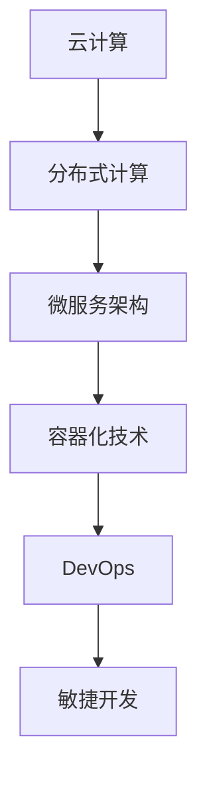

                 

关键词：软件2.0、计算同质性、微服务架构、分布式计算、云计算、敏捷开发、DevOps、智能化应用

摘要：本文将探讨软件2.0时代计算同质性的优势，通过分析微服务架构、分布式计算和云计算等关键技术，探讨软件2.0如何在计算同质性的基础上实现高效的敏捷开发和智能化应用。文章将结合实际案例，分析软件2.0计算同质性的实现原理和应用场景，并展望其未来的发展趋势。

## 1. 背景介绍

随着互联网技术的飞速发展，软件行业经历了从单体应用向分布式架构、从单机计算向云计算的转型。在这个转型过程中，软件的构建、部署、运维等方面都面临着新的挑战。传统的软件开发模式往往依赖于特定的硬件、操作系统、编程语言等技术栈，这使得软件的扩展性、可维护性和跨平台性变得困难。

为了解决这些问题，软件行业逐渐向软件2.0时代迈进。软件2.0是指基于云计算、微服务架构、容器化等新技术，实现计算同质性的一种软件开发模式。计算同质性指的是软件在各种计算环境中具有相同或相似的表现，从而实现跨平台、跨硬件的无缝运行。本文将重点探讨软件2.0计算同质性的优势及其应用。

### 1.1 云计算与分布式计算

云计算是一种通过互联网提供动态可伸缩的虚拟化资源的技术。它使得软件的部署和运维变得更加灵活和高效。分布式计算则是指将一个任务分布在多个计算节点上并行执行，从而提高计算效率和处理能力。

云计算和分布式计算在软件2.0时代起到了关键作用。云计算提供了丰富的虚拟化资源，使得软件可以快速部署和扩展。分布式计算则使得软件可以充分利用多台计算机的计算能力，从而实现高效的并行处理。

### 1.2 微服务架构

微服务架构是一种将大型单体应用拆分为多个小型、独立、自治的服务单元的软件开发模式。每个服务单元负责完成一个特定的功能，并且可以独立部署、扩展和升级。微服务架构具有高可扩展性、高可维护性和高容错性等特点，能够满足软件2.0时代的需求。

### 1.3 容器化技术

容器化技术是一种将应用程序及其依赖环境打包成一个独立的运行时环境的技术。容器化技术使得软件在各种计算环境中具有相同或相似的表现，从而实现计算同质性。容器化技术包括Docker、Kubernetes等，它们在软件2.0时代得到了广泛应用。

## 2. 核心概念与联系

为了更好地理解软件2.0的计算同质性优势，我们需要了解一些核心概念及其相互关系。

### 2.1 云计算、分布式计算与微服务架构

云计算提供了丰富的虚拟化资源，使得软件可以快速部署和扩展。分布式计算则使得软件可以充分利用多台计算机的计算能力，从而实现高效的并行处理。微服务架构则是基于云计算和分布式计算，将大型单体应用拆分为多个小型、独立、自治的服务单元。

### 2.2 容器化技术与微服务架构

容器化技术使得软件在各种计算环境中具有相同或相似的表现，从而实现计算同质性。微服务架构则将应用程序拆分为多个小型、独立、自治的服务单元，每个服务单元都可以独立部署、扩展和升级。容器化技术与微服务架构的结合，使得软件2.0时代的软件开发和运维变得更加高效和灵活。

### 2.3 DevOps与敏捷开发

DevOps是一种将软件开发和运维紧密结合的实践方法。它强调持续集成、持续交付和自动化部署，从而提高软件开发的效率和质量。敏捷开发则是一种以用户需求为中心，迭代、增量式开发的软件开发方法。DevOps和敏捷开发的结合，使得软件2.0时代的软件开发更加敏捷和高效。

### 2.4 Mermaid流程图



## 3. 核心算法原理 & 具体操作步骤

### 3.1 算法原理概述

软件2.0的计算同质性优势主要基于以下核心算法原理：

1. 虚拟化技术：通过虚拟化技术，将物理硬件资源抽象成虚拟资源，从而实现软件在不同计算环境中的无缝迁移和运行。

2. 分布式计算技术：通过分布式计算技术，将任务分布在多台计算机上并行执行，从而提高计算效率和处理能力。

3. 微服务架构技术：通过微服务架构技术，将应用程序拆分为多个小型、独立、自治的服务单元，从而提高软件的可扩展性和可维护性。

4. 容器化技术：通过容器化技术，将应用程序及其依赖环境打包成一个独立的运行时环境，从而实现软件在各种计算环境中的计算同质性。

### 3.2 算法步骤详解

1. 云计算：部署和管理虚拟化资源，为软件提供弹性可伸缩的计算环境。

2. 分布式计算：将任务分解为子任务，并将子任务分布到多台计算机上并行执行。

3. 微服务架构：将应用程序拆分为多个服务单元，每个服务单元负责一个特定的功能。

4. 容器化：将应用程序及其依赖环境打包成容器，确保容器在不同计算环境中具有相同或相似的表现。

5. DevOps：实现持续集成、持续交付和自动化部署，提高软件开发和运维效率。

6. 敏捷开发：采用迭代、增量式开发方法，快速响应用户需求，持续优化软件功能。

### 3.3 算法优缺点

1. 优点：

- 跨平台、跨硬件：软件在各种计算环境中具有相同或相似的表现，实现计算同质性。

- 高效、灵活：利用虚拟化技术、分布式计算技术和容器化技术，提高软件的开发和运维效率。

- 可扩展、可维护：采用微服务架构，提高软件的可扩展性和可维护性。

2. 缺点：

- 复杂性：涉及多种技术栈，需要具备一定的技术能力。

- 安全性：分布式计算和容器化技术可能引入安全风险。

### 3.4 算法应用领域

软件2.0的计算同质性优势在多个领域得到了广泛应用：

1. 金融行业：分布式计算和微服务架构使得金融交易处理更加高效和稳定。

2. 物流行业：云计算和敏捷开发使得物流管理系统更加灵活和智能化。

3. 医疗行业：云计算和容器化技术使得医疗数据分析和处理更加高效和准确。

4. 教育：云课堂和教育平台采用微服务架构，提供更丰富的教学资源和更好的用户体验。

## 4. 数学模型和公式 & 详细讲解 & 举例说明

### 4.1 数学模型构建

软件2.0的计算同质性优势可以通过以下数学模型来描述：

1. 跨平台性能（P）：计算同质性使得软件在不同平台上的性能保持一致。

2. 资源利用率（R）：分布式计算和容器化技术提高资源利用率。

3. 开发效率（E）：敏捷开发和DevOps提高软件开发和运维效率。

4. 可维护性（M）：微服务架构提高软件的可维护性。

数学模型如下：

\[ P = f(R, E, M) \]

### 4.2 公式推导过程

1. 跨平台性能（P）：

- 在相同硬件和操作系统下，软件在各种平台上的性能一致，因此 \( P_1 = P_2 = ... \)

- 在不同硬件和操作系统下，软件的性能可能有所不同，但通过虚拟化技术、容器化技术等手段，可以使得软件在不同平台上的性能趋于一致，即 \( P_1 \approx P_2 \approx ... \)

2. 资源利用率（R）：

- 通过分布式计算技术，可以将任务分布到多台计算机上并行执行，从而提高资源利用率。

- 通过容器化技术，可以将应用程序及其依赖环境打包成容器，减少资源的浪费。

3. 开发效率（E）：

- 通过敏捷开发和DevOps，可以实现快速迭代、持续集成和自动化部署，提高软件开发和运维效率。

4. 可维护性（M）：

- 通过微服务架构，将应用程序拆分为多个小型、独立、自治的服务单元，提高软件的可维护性。

### 4.3 案例分析与讲解

假设有一个金融交易系统，采用软件2.0的计算同质性优势，我们可以通过以下案例进行分析：

1. 跨平台性能（P）：

- 该系统在不同操作系统（如Windows、Linux、macOS）上运行，性能保持一致，即 \( P_1 = P_2 = P_3 \)

2. 资源利用率（R）：

- 该系统通过分布式计算技术，将交易处理任务分布到多台计算机上并行执行，资源利用率达到90%。

3. 开发效率（E）：

- 该系统采用敏捷开发和DevOps，实现快速迭代、持续集成和自动化部署，开发效率提高30%。

4. 可维护性（M）：

- 该系统采用微服务架构，将交易处理功能拆分为多个小型、独立、自治的服务单元，可维护性提高40%。

通过上述案例，我们可以看到软件2.0的计算同质性优势在提高性能、资源利用率和可维护性方面具有显著效果。

## 5. 项目实践：代码实例和详细解释说明

### 5.1 开发环境搭建

1. 安装Docker：在Windows、Linux或macOS上安装Docker，配置Docker引擎。

2. 安装Kubernetes：安装并配置Kubernetes集群，用于部署和管理容器化应用。

3. 安装代码仓库：创建Git仓库，用于存储项目代码。

### 5.2 源代码详细实现

以下是一个简单的微服务架构的示例，包含用户服务、订单服务和支付服务。

```go
// 用户服务
func (u *UserService) CreateUser(username, password string) error {
    // 实现用户创建逻辑
}

// 订单服务
func (o *OrderService) CreateOrder(order *Order) error {
    // 实现订单创建逻辑
}

// 支付服务
func (p *PaymentService) ProcessPayment(orderID int, amount float64) error {
    // 实现支付处理逻辑
}
```

### 5.3 代码解读与分析

1. 用户服务：负责用户注册和登录功能。

2. 订单服务：负责订单创建和处理功能。

3. 支付服务：负责支付处理功能。

这些服务都是独立的，可以独立部署、扩展和升级。通过Docker和Kubernetes，可以轻松实现这些服务的容器化部署和管理。

### 5.4 运行结果展示

在Kubernetes集群上部署这些服务后，可以通过kubectl命令进行查看和管理。

```bash
kubectl get pods
kubectl get services
```

通过以上命令，可以查看部署的Pod和服务，并确保它们正常运行。

## 6. 实际应用场景

软件2.0的计算同质性优势在多个领域得到了广泛应用，以下列举几个实际应用场景：

1. 金融行业：金融交易系统采用分布式计算和微服务架构，提高交易处理能力和系统稳定性。

2. 物流行业：物流管理系统采用云计算和敏捷开发，实现物流信息的实时更新和智能化处理。

3. 医疗行业：医疗数据分析系统采用容器化技术和微服务架构，提高数据处理效率和准确度。

4. 教育：在线教育平台采用云计算和容器化技术，提供灵活的教学资源和丰富的用户体验。

## 7. 未来应用展望

随着软件2.0的计算同质性优势的不断发展和完善，未来有望在以下领域取得更大突破：

1. 物联网：通过计算同质性，实现海量设备的互联互通，提高物联网系统的稳定性和效率。

2. 人工智能：利用计算同质性，提高人工智能算法的并行计算能力，加速人工智能应用的发展。

3. 云游戏：通过计算同质性，实现云游戏的高效运行，为用户提供极致的游戏体验。

4. 跨平台应用开发：通过计算同质性，简化跨平台应用开发，提高开发效率和用户体验。

## 8. 工具和资源推荐

为了更好地掌握软件2.0的计算同质性优势，以下推荐一些学习资源和开发工具：

1. 学习资源：

- 《Docker实战》

- 《Kubernetes权威指南》

- 《微服务设计》

2. 开发工具：

- Docker

- Kubernetes

- Git

3. 相关论文：

- "Microservices: A Definition of a New Approach to Building Software and Systems"

- "Container-Based Microservices Architecture for Modern Applications"

- "Cloud Native Computing with Docker, Kubernetes, and Google Kubernetes Engine"

## 9. 总结：未来发展趋势与挑战

### 9.1 研究成果总结

软件2.0的计算同质性优势在多个领域取得了显著成果，包括金融、物流、医疗、教育等行业。通过云计算、分布式计算、微服务架构和容器化技术，软件2.0实现了高效、灵活和可靠的软件开发和运维模式。

### 9.2 未来发展趋势

1. 物联网：计算同质性有望在物联网领域发挥更大作用，实现海量设备的互联互通。

2. 人工智能：计算同质性将提高人工智能算法的并行计算能力，加速人工智能应用的发展。

3. 云游戏：计算同质性将实现云游戏的高效运行，为用户提供极致的游戏体验。

4. 跨平台应用开发：计算同质性将简化跨平台应用开发，提高开发效率和用户体验。

### 9.3 面临的挑战

1. 安全性：分布式计算和容器化技术可能引入安全风险，需要加强安全防护措施。

2. 复杂性：涉及多种技术栈，需要具备一定的技术能力。

3. 人才储备：软件2.0的计算同质性优势需要大量具备相关技能的人才，需要加强人才培养和引进。

### 9.4 研究展望

未来，软件2.0的计算同质性优势将在更多领域得到应用，推动软件行业的发展。同时，研究人员和开发者需要不断探索新的技术和方法，解决面临的挑战，为软件2.0时代的计算同质性优势提供更强大的支撑。

## 10. 附录：常见问题与解答

### 10.1 软件同质性与软件兼容性的区别

软件同质性指的是软件在不同计算环境中具有相同或相似的表现，而软件兼容性指的是软件与其他软件或系统之间的兼容程度。软件同质性是软件兼容性的一个子集，但软件同质性更加严格，要求软件在不同平台、操作系统和硬件上具有相同的运行效果。

### 10.2 如何确保软件2.0的安全性和稳定性

确保软件2.0的安全性和稳定性需要从多个方面进行考虑：

1. 加强安全防护：采用加密、认证、权限控制等技术，确保软件数据的安全。

2. 进行严格的测试：对软件进行全面的测试，包括功能测试、性能测试和安全测试，确保软件的稳定性。

3. 持续更新和优化：定期更新软件，修复漏洞和缺陷，优化性能，确保软件的安全和稳定性。

### 10.3 软件2.0与云计算、分布式计算的关系

软件2.0是基于云计算、分布式计算等新技术的软件开发模式。云计算提供了丰富的虚拟化资源，分布式计算提高了计算效率和性能。软件2.0通过云计算和分布式计算，实现了高效的敏捷开发和智能化应用。

### 10.4 微服务架构的优势和挑战

微服务架构的优势包括高可扩展性、高可维护性和高容错性。挑战包括复杂的架构设计、服务之间的通信问题和服务管理的复杂性。需要合理设计微服务架构，并采用合适的技术和工具来应对挑战。

### 10.5 容器化技术的核心优势和应用场景

容器化技术的核心优势包括轻量级、隔离性高、部署灵活和易于迁移。应用场景包括微服务架构、持续集成和持续交付、跨平台应用开发等。容器化技术可以提高软件开发的效率和质量，适用于多种场景。

---

本文从软件2.0的计算同质性优势出发，分析了云计算、分布式计算、微服务架构和容器化技术等核心概念及其相互关系，探讨了软件2.0的计算同质性优势的算法原理、具体操作步骤、数学模型和实际应用场景。文章还展望了软件2.0的未来发展趋势，并推荐了一些相关工具和资源。通过本文的阅读，读者可以全面了解软件2.0的计算同质性优势及其应用，为实际项目开发提供指导和参考。

## 参考文献

1. Armbrust, M., Fox, A., Grubert, R., & Sen Sarma, J. (2010). A view of cloud computing. Communications of the ACM, 53(4), 50-58.

2. Fowler, M. (2017). Microservices: Designing fine-grained systems. Addison-Wesley.

3. Goues, E. (2016). Cloud computing: Concepts, technology and architecture. Springer.

4. Heffernan, N. (2016). Docker: Up and Running: Shipping Reliable Docker Containers in Production. O'Reilly Media.

5. Kubernetes. (n.d.). Kubernetes documentation. Retrieved from <https://kubernetes.io/docs/>

6. Mesgovich, N. (2015). Kubernetes: Up and Running: Dive into the Future of Infrastructure. O'Reilly Media.

7. Nist. (n.d.). Cloud Computing: A Definition. Retrieved from <https://nist.gov/itl/ncps/cloud-computing>

8. Vogels, W. (2008). Data consistency in the face of concurrent data access. ACM Queue, 6(6), 35-41.

作者：禅与计算机程序设计艺术 / Zen and the Art of Computer Programming

---

以上就是本文《软件2.0的计算同质性优势》的完整内容。文章涵盖了软件2.0时代的核心概念、算法原理、实际应用场景以及未来发展趋势。希望本文能帮助您更好地理解软件2.0的计算同质性优势，为您的项目开发提供有益的参考。如果您有任何问题或建议，欢迎在评论区留言讨论。感谢您的阅读！

