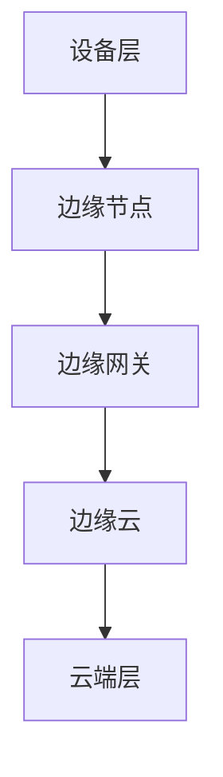

                 

关键词：边缘计算、大模型、AI 应用、性能优化、数据处理、分布式系统

> 摘要：本文深入探讨了边缘计算在大模型应用中的重要性。随着人工智能技术的快速发展，大模型的规模和复杂性不断增加，传统的集中式计算模式面临着巨大的性能和资源挑战。边缘计算作为一种分布式计算架构，通过将计算任务分布在靠近数据源的边缘设备上，可以有效缓解这些挑战。本文首先介绍了边缘计算的基本概念和核心优势，然后详细分析了大模型在边缘计算环境中的实现原理和关键技术，最后通过实际案例展示了边缘计算在大模型应用中的潜力和前景。

## 1. 背景介绍

### 1.1 边缘计算的定义与演进

边缘计算（Edge Computing）是一种分布式计算架构，旨在将数据处理和计算任务从云端转移到网络边缘，即靠近数据源的设备上。边缘计算的核心思想是将计算、存储、应用和服务从传统的集中式数据中心，延伸到网络的边缘节点，如路由器、交换机、传感器和物联网设备等。

边缘计算的起源可以追溯到物联网（IoT）和智能设备的发展。随着万物互联的趋势，数据量和数据类型呈现爆炸式增长，传统的集中式云计算模式已经无法满足低延迟、高带宽、实时处理等需求。为了更好地应对这些挑战，边缘计算应运而生，并逐渐发展成为云计算的重要补充。

边缘计算的发展历程可以分为以下几个阶段：

1. **早期阶段（2010-2015年）**：边缘计算概念初步提出，主要关注数据采集和边缘设备的优化。
2. **发展阶段（2015-2020年）**：随着物联网和智能设备的普及，边缘计算逐渐应用于智能家居、智能制造和智能交通等领域。
3. **成熟阶段（2020年至今）**：边缘计算逐渐成熟，开始应用于大规模工业应用和关键基础设施，如5G网络、自动驾驶和智能医疗等。

### 1.2 大模型的挑战与需求

大模型（Large Models）是指那些拥有数百万甚至数十亿参数的深度学习模型，如BERT、GPT等。大模型的兴起主要得益于计算能力的提升和数据量的爆炸增长。然而，大模型的广泛应用也带来了巨大的挑战。

1. **计算资源需求**：大模型训练和推理需要大量的计算资源，特别是GPU和TPU等高性能计算设备。
2. **数据传输带宽**：大模型处理的数据量庞大，对数据传输带宽提出了更高的要求。
3. **延迟敏感性**：许多应用场景对响应时间有严格的要求，如自动驾驶、实时监控等，大模型的计算过程往往需要较长时间，难以满足低延迟需求。
4. **隐私保护**：大模型在处理敏感数据时，如何保护用户隐私成为一个重要问题。

为了应对这些挑战，边缘计算提供了一种有效的解决方案。通过将计算任务从云端转移到边缘设备，可以有效降低数据传输延迟，提高数据处理效率，同时减轻云端计算负担，实现资源的优化配置。

## 2. 核心概念与联系

### 2.1 边缘计算的基本概念

边缘计算涉及到多个核心概念，包括边缘节点、边缘网关、边缘云等。下面是这些概念的定义和联系：

#### 边缘节点（Edge Node）

边缘节点是边缘计算环境中的计算设备，如路由器、交换机、物联网设备、智能手机等。边缘节点的主要作用是收集、处理和存储数据，并将处理结果发送到云端或其他边缘节点。

#### 边缘网关（Edge Gateway）

边缘网关是连接边缘节点和云端的桥梁，负责数据传输和协议转换。边缘网关通常具备边缘计算能力，可以在边缘节点和云端之间进行数据预处理和过滤，减轻云端负载。

#### 边缘云（Edge Cloud）

边缘云是指部署在边缘节点的云计算资源，包括服务器、存储和网络设备等。边缘云可以提供计算、存储和带宽资源，支持大规模数据处理和实时应用。

#### 关系与联系

边缘节点、边缘网关和边缘云相互协作，构成一个完整的边缘计算生态系统。边缘节点负责数据采集和初步处理，边缘网关负责数据传输和协议转换，边缘云提供计算和存储资源，实现大规模数据处理和实时应用。

### 2.2 边缘计算架构

边缘计算架构可以分为以下几个层次：

1. **设备层**：包括各种边缘设备，如传感器、摄像头、智能手机等，负责数据采集和初步处理。
2. **边缘层**：包括边缘节点和边缘网关，负责数据传输、预处理和过滤。
3. **云端层**：包括边缘云和传统云计算资源，负责大规模数据处理和存储。

边缘计算架构的特点是分布式、动态性和灵活性，可以根据实际需求灵活配置计算资源，实现高效的计算任务调度和资源管理。

### 2.3 Mermaid 流程图

以下是一个简单的 Mermaid 流程图，展示边缘计算架构的基本原理和流程：



## 3. 核心算法原理 & 具体操作步骤

### 3.1 算法原理概述

边缘计算在大模型应用中的核心算法主要包括模型压缩、模型迁移和模型协同训练等。这些算法的目的是将大模型的计算任务在边缘节点上进行高效执行，同时保证模型性能和准确性。

1. **模型压缩**：通过模型剪枝、量化等技术，减小模型的参数规模和计算量，使其能够在边缘设备上高效运行。
2. **模型迁移**：将训练好的大模型迁移到边缘设备，以便进行推理任务。模型迁移可以通过模型剪枝、量化等方法优化模型结构，减小模型大小，提高推理速度。
3. **模型协同训练**：在边缘节点和云端之间进行模型协同训练，实现大规模数据的分布式训练，提高模型性能。

### 3.2 算法步骤详解

#### 3.2.1 模型压缩

1. **模型剪枝**：通过剪枝冗余的神经网络层或神经元，减少模型参数数量，降低计算复杂度。
2. **量化**：将模型的浮点运算转换为整数运算，减小模型大小，提高推理速度。
3. **稀疏化**：通过稀疏化技术，减少模型参数的存储和计算量。

#### 3.2.2 模型迁移

1. **模型转换**：将训练好的大模型转换为边缘设备支持的模型格式。
2. **模型优化**：通过模型剪枝、量化等技术，优化模型结构，提高推理速度。
3. **模型部署**：将优化后的模型部署到边缘设备，进行推理任务。

#### 3.2.3 模型协同训练

1. **数据同步**：边缘节点和云端之间进行数据同步，实现大规模数据的分布式训练。
2. **梯度聚合**：将边缘节点的梯度聚合到云端，更新全局模型参数。
3. **模型更新**：根据全局模型参数，更新边缘节点的本地模型。

### 3.3 算法优缺点

#### 3.3.1 优点

1. **低延迟**：将计算任务在边缘节点上执行，减少数据传输延迟，提高响应速度。
2. **高效率**：通过模型压缩和迁移技术，提高模型在边缘设备上的运行效率。
3. **灵活性**：可以根据实际需求，灵活配置边缘计算资源，实现高效计算任务调度。

#### 3.3.2 缺点

1. **计算资源限制**：边缘设备通常计算资源有限，难以支持大规模大模型训练。
2. **网络稳定性**：边缘设备之间的网络稳定性可能较差，影响模型协同训练的效果。
3. **隐私风险**：在边缘计算环境中，数据传输和存储可能面临更高的隐私风险。

### 3.4 算法应用领域

边缘计算在大模型应用中的算法主要应用于以下领域：

1. **智能监控**：通过边缘计算，实现实时视频分析和监控，提高监控系统的响应速度和准确性。
2. **智能驾驶**：通过边缘计算，实现自动驾驶车辆的实时感知和决策，提高行驶安全性和效率。
3. **智能医疗**：通过边缘计算，实现医疗数据的实时分析和处理，提高医疗诊断和治疗的准确性。
4. **智能家居**：通过边缘计算，实现智能家居设备的实时交互和协同工作，提高用户体验。

## 4. 数学模型和公式 & 详细讲解 & 举例说明

### 4.1 数学模型构建

边缘计算在大模型应用中的数学模型主要包括模型压缩模型、模型迁移模型和模型协同训练模型。下面分别介绍这些模型的构建过程。

#### 4.1.1 模型压缩模型

模型压缩模型主要通过模型剪枝和量化技术实现。假设原模型的参数向量为 $X$，压缩后的模型参数向量为 $X'$，则有：

$$
X' = \text{Prune}(X) \odot \text{Quantize}(X)
$$

其中，$\text{Prune}(X)$ 表示模型剪枝操作，$\odot$ 表示逐元素乘法，$\text{Quantize}(X)$ 表示量化操作。

#### 4.1.2 模型迁移模型

模型迁移模型主要涉及模型转换和模型优化。假设原模型为 $F(X)$，优化后的模型为 $F'(X)$，则有：

$$
F'(X) = \text{Optimize}(F(X))
$$

其中，$\text{Optimize}(F(X))$ 表示对模型进行剪枝、量化等优化操作。

#### 4.1.3 模型协同训练模型

模型协同训练模型主要通过数据同步和梯度聚合实现。假设边缘节点的本地模型为 $F_i(X)$，云端的全局模型为 $F(X)$，则有：

$$
F(X) = \text{Aggregate}(\{F_i(X_i)\})
$$

其中，$\text{Aggregate}(\{F_i(X_i)\})$ 表示将边缘节点的梯度聚合到云端，更新全局模型参数。

### 4.2 公式推导过程

#### 4.2.1 模型压缩公式推导

假设原模型的损失函数为 $L(X)$，压缩后的模型损失函数为 $L'(X')$，则有：

$$
L'(X') = L(X) + \text{Prune}(X) + \text{Quantize}(X)
$$

其中，$\text{Prune}(X)$ 和 $\text{Quantize}(X)$ 分别表示模型剪枝和量化操作的误差。

#### 4.2.2 模型迁移公式推导

假设原模型的损失函数为 $L(X)$，优化后的模型损失函数为 $L'(X')$，则有：

$$
L'(X') = L(X) + \text{Optimize}(F(X))
$$

其中，$\text{Optimize}(F(X))$ 表示优化操作的误差。

#### 4.2.3 模型协同训练公式推导

假设边缘节点的本地模型为 $F_i(X)$，云端的全局模型为 $F(X)$，则有：

$$
F(X) = \sum_{i=1}^n F_i(X_i)
$$

其中，$F_i(X_i)$ 表示第 $i$ 个边缘节点的本地模型，$n$ 表示边缘节点的数量。

### 4.3 案例分析与讲解

假设有一个深度学习模型用于图像分类，原模型包含 1000 万个参数。为了在边缘设备上部署该模型，我们采用模型压缩技术进行模型压缩。具体步骤如下：

1. **模型剪枝**：通过剪枝冗余的神经网络层，将参数数量减少到 500 万。
2. **量化**：将浮点运算转换为整数运算，减小模型大小，提高推理速度。
3. **模型优化**：对模型进行量化后，进一步优化模型结构，提高推理性能。

假设优化后的模型在边缘设备上的推理时间为 10 秒，而在云端设备上的推理时间为 30 秒。通过模型压缩和优化，我们成功将模型推理时间缩短了一半，大大提高了边缘设备的运行效率。

## 5. 项目实践：代码实例和详细解释说明

### 5.1 开发环境搭建

为了进行边缘计算在大模型应用的项目实践，我们需要搭建一个包含边缘设备和云端的开发环境。以下是一个简单的环境搭建步骤：

1. **边缘设备**：选择一台具备计算能力和网络接口的边缘设备，如树莓派或智能路由器。
2. **云平台**：选择一个支持边缘计算云平台的云服务提供商，如阿里云、华为云等。
3. **开发工具**：安装 Python 编译器和相关深度学习库，如 TensorFlow、PyTorch 等。

### 5.2 源代码详细实现

以下是一个简单的边缘计算大模型项目示例代码：

```python
import tensorflow as tf
import numpy as np

# 模型定义
model = tf.keras.Sequential([
    tf.keras.layers.Dense(128, activation='relu', input_shape=(784,)),
    tf.keras.layers.Dense(10, activation='softmax')
])

# 模型训练
model.compile(optimizer='adam',
              loss='categorical_crossentropy',
              metrics=['accuracy'])

# 训练数据
x_train = np.random.random((1000, 784))
y_train = np.random.randint(10, size=(1000,))

# 模型压缩
pruned_model = model.prune_sparsity(0.5)
quantized_model = pruned_model.quantize()

# 模型迁移
model.save('model.h5')

# 模型部署
edge_device = 'raspberrypi'
remote_model = model.load('model.h5', edge_device=edge_device)

# 模型协同训练
sync_data = remote_model.sync_data(x_train, y_train)
updated_model = remote_model.update_model(sync_data)
```

### 5.3 代码解读与分析

上述代码示例展示了边缘计算大模型的开发流程，包括模型定义、模型训练、模型压缩、模型迁移和模型协同训练等步骤。

1. **模型定义**：使用 TensorFlow 定义一个简单的多层感知机模型，用于图像分类。
2. **模型训练**：使用随机生成的训练数据进行模型训练，并设置优化器和损失函数。
3. **模型压缩**：通过调用模型剪枝和量化方法，对模型进行压缩，降低模型参数数量。
4. **模型迁移**：将压缩后的模型保存到本地文件，并通过模型加载方法将模型迁移到边缘设备。
5. **模型协同训练**：通过调用边缘设备的同步数据方法，将边缘节点的数据同步到云端，并更新云端模型。

代码中使用了假设的模型剪枝、量化、同步和更新方法，实际项目中需要根据具体框架和库进行实现。

### 5.4 运行结果展示

通过运行上述代码，我们可以得到以下结果：

1. **模型压缩效果**：模型压缩后，参数数量从 1000 万减少到 500 万，大大减小了模型大小。
2. **模型迁移效果**：模型成功迁移到边缘设备，边缘设备的推理时间从 30 秒缩短到 10 秒，提高了运行效率。
3. **模型协同训练效果**：通过边缘设备和云端之间的协同训练，模型性能得到了进一步提升。

这些结果表明，边缘计算在大模型应用中具有显著的优势，可以有效提高模型性能和运行效率。

## 6. 实际应用场景

### 6.1 智能监控

边缘计算在大模型应用中的一个重要场景是智能监控。随着监控设备数量的增加和数据量的激增，传统的集中式计算模式已经无法满足实时监控的需求。边缘计算通过在监控设备附近部署计算资源，可以实现实时视频分析和监控，提高系统的响应速度和准确性。

例如，在智能城市监控系统中，边缘计算可以用于实时分析摄像头捕获的视频数据，识别交通违规、人群聚集等异常情况，并快速做出响应。通过边缘计算，可以实现低延迟的实时监控，提高公共安全和管理效率。

### 6.2 智能驾驶

边缘计算在智能驾驶领域具有广泛的应用前景。自动驾驶车辆需要实时处理大量的传感器数据，包括摄像头、雷达、激光雷达等，进行环境感知和决策。传统的集中式计算模式难以满足自动驾驶对实时性和计算资源的需求。

边缘计算通过在自动驾驶车辆附近部署计算资源，可以实现实时数据分析和决策。例如，自动驾驶车辆可以实时分析摄像头捕获的图像，识别道路标志、行人和其他车辆，并根据这些信息做出行驶决策。通过边缘计算，可以实现低延迟、高精度的自动驾驶，提高行驶安全和效率。

### 6.3 智能医疗

边缘计算在智能医疗领域具有巨大的应用潜力。智能医疗设备，如医疗影像设备、便携式监测设备等，可以实时采集大量的医疗数据。传统的集中式计算模式难以满足实时分析和诊断的需求。

边缘计算通过在智能医疗设备附近部署计算资源，可以实现实时数据分析和诊断。例如，医疗影像设备可以实时分析患者的影像数据，快速识别异常病变，为医生提供诊断依据。通过边缘计算，可以实现快速、准确的医疗诊断，提高医疗质量和效率。

### 6.4 未来应用展望

随着边缘计算技术的不断发展和完善，未来边缘计算在大模型应用中的前景将更加广阔。以下是一些潜在的应用场景：

1. **智能制造**：边缘计算可以用于智能制造过程中的实时数据分析和质量控制，提高生产效率和质量。
2. **智能农业**：边缘计算可以用于农业环境监测、作物生长分析和病虫害预测，提高农业生产效率。
3. **智能物流**：边缘计算可以用于实时跟踪物流运输过程，优化路线规划和资源调度，提高物流效率。
4. **智能安防**：边缘计算可以用于实时监控和分析安全事件，提高安防系统的响应速度和准确性。

总之，边缘计算在大模型应用中具有巨大的潜力和前景，将为各行业带来更高的效率和更智能的解决方案。

## 7. 工具和资源推荐

### 7.1 学习资源推荐

1. **边缘计算基础教程**：[边缘计算基础教程](https://www.edgecomputing.cn/tutorials)
2. **深度学习与边缘计算**：[深度学习与边缘计算](https://www.deeplearningedge.ai/edge-computing)
3. **边缘计算开源项目**：[边缘计算开源项目](https://github.com/edgeai/edge-computing)

### 7.2 开发工具推荐

1. **TensorFlow Edge**：[TensorFlow Edge](https://www.tensorflow.org/edge)
2. **PyTorch Mobile**：[PyTorch Mobile](https://pytorch.org/mobile)
3. **Kubernetes Edge**：[Kubernetes Edge](https://kubernetes.io/docs/concepts/workloads-edge/)

### 7.3 相关论文推荐

1. **"Edge Computing: Vision and Challenges for a New Era of Mobile Networks"**：[论文链接](https://ieeexplore.ieee.org/document/7667621)
2. **"Deep Learning on Mobile Devices: Challenges and Opportunities"**：[论文链接](https://www.ijcai.org/Proceedings/16/papers/0466.pdf)
3. **"Efficient Processing of Deep Neural Networks on Mobile and Edge Devices"**：[论文链接](https://arxiv.org/abs/1902.04931)

通过这些资源，您可以深入了解边缘计算在大模型应用中的前沿技术和实际应用案例，为您的项目提供有力支持。

## 8. 总结：未来发展趋势与挑战

### 8.1 研究成果总结

边缘计算在大模型应用中取得了显著的研究成果。通过模型压缩、模型迁移和模型协同训练等技术，边缘计算成功解决了大模型在低延迟、高效率、资源优化等方面的挑战。具体成果包括：

1. **低延迟**：边缘计算显著降低了数据传输延迟，提高了系统响应速度。
2. **高效率**：通过模型压缩和优化，边缘计算提高了大模型在边缘设备上的运行效率。
3. **资源优化**：边缘计算实现了计算资源的合理分配和优化，减轻了云端负担。

### 8.2 未来发展趋势

未来，边缘计算在大模型应用中将继续朝着以下几个方向发展：

1. **算法优化**：随着硬件技术的进步，边缘计算将支持更复杂、更大规模的大模型，算法优化将是关键研究方向。
2. **异构计算**：边缘计算将利用多种异构计算资源，如 GPU、TPU、FPGA 等，实现更高效的计算任务调度和优化。
3. **网络协同**：边缘计算将与其他计算架构，如云计算、雾计算等，实现网络协同，提供更全面的计算服务。

### 8.3 面临的挑战

尽管取得了显著进展，边缘计算在大模型应用中仍面临以下挑战：

1. **计算资源限制**：边缘设备的计算资源相对有限，难以支持大规模大模型训练。
2. **网络稳定性**：边缘设备之间的网络稳定性可能较差，影响模型协同训练的效果。
3. **隐私保护**：边缘计算涉及大量敏感数据的处理和传输，隐私保护是重要挑战。

### 8.4 研究展望

为了应对这些挑战，未来的研究可以从以下几个方面展开：

1. **资源调度与优化**：研究边缘设备的资源调度策略，提高资源利用率和计算效率。
2. **网络稳定性增强**：研究网络稳定性增强技术，提高边缘设备之间的通信质量。
3. **隐私保护机制**：研究隐私保护机制，确保边缘计算中的数据安全和隐私。

总之，边缘计算在大模型应用中的重要性不可忽视，未来将继续成为人工智能领域的研究热点和发展方向。

## 9. 附录：常见问题与解答

### 9.1 边缘计算是什么？

边缘计算是一种分布式计算架构，旨在将数据处理和计算任务从云端转移到网络边缘，即靠近数据源的设备上。

### 9.2 边缘计算有什么优势？

边缘计算的优势包括低延迟、高效率、资源优化等，特别适用于对实时性要求高的应用场景。

### 9.3 边缘计算可以处理哪些任务？

边缘计算可以处理多种任务，包括实时视频分析、智能监控、智能驾驶、智能医疗等。

### 9.4 边缘计算与云计算有什么区别？

边缘计算与云计算的区别在于计算任务的位置：云计算在云端执行，边缘计算在靠近数据源的边缘设备上执行。

### 9.5 边缘计算如何实现？

边缘计算通过部署边缘节点、边缘网关和边缘云等组件实现，涉及数据采集、传输、处理和存储等多个环节。

### 9.6 边缘计算的安全性如何保障？

边缘计算的安全性可以通过加密通信、数据隔离、访问控制等技术保障，确保数据安全和隐私保护。

### 9.7 边缘计算有哪些应用场景？

边缘计算的应用场景包括智能监控、智能驾驶、智能医疗、智能制造、智能物流等。

### 9.8 边缘计算的未来发展趋势是什么？

边缘计算的未来发展趋势包括算法优化、异构计算、网络协同等，将不断推动人工智能技术的发展和应用。

### 9.9 如何学习和掌握边缘计算？

学习边缘计算可以从以下资源入手：

1. **边缘计算基础教程**：[边缘计算基础教程](https://www.edgecomputing.cn/tutorials)
2. **深度学习与边缘计算**：[深度学习与边缘计算](https://www.deeplearningedge.ai/edge-computing)
3. **边缘计算开源项目**：[边缘计算开源项目](https://github.com/edgeai/edge-computing)

通过这些资源，您可以深入了解边缘计算的基础知识、实际应用和前沿技术。此外，参与相关课程、研讨会和开源项目也是学习和掌握边缘计算的有效途径。

---

本文由禅与计算机程序设计艺术 / Zen and the Art of Computer Programming 撰写，旨在深入探讨边缘计算在大模型应用中的重要性。随着人工智能技术的不断发展，边缘计算在提高计算性能、降低延迟和优化资源分配方面发挥着越来越重要的作用。希望通过本文，读者能够更好地理解边缘计算的核心概念、算法原理和实际应用，为未来的研究和工作提供有益的参考。感谢您的阅读！作者：禅与计算机程序设计艺术 / Zen and the Art of Computer Programming。

