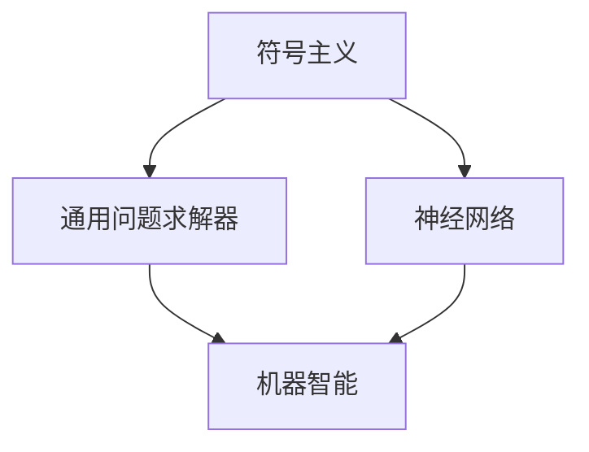

                 

关键词：达特茅斯会议、人工智能、计算机科学、历史、会议影响、科学家团队、技术创新

> 摘要：本文将回顾1956年达特茅斯会议的科学家团队，探讨他们如何推动了人工智能领域的诞生，并分析了这次会议对计算机科学历史的影响。

## 1. 背景介绍

达特茅斯会议是计算机科学史上一次里程碑式的会议，它标志着人工智能领域的正式诞生。会议于1956年在美国新罕布什尔州的达特茅斯学院举行，由约翰·麦卡锡（John McCarthy）、马文·闵斯基（Marvin Minsky）、克劳德·香农（Claude Shannon）、赫伯特·西蒙（Herbert Simon）和诺伯特·维纳（Norbert Wiener）等科学家共同组织。

这次会议的召开背景是计算机科学和数学领域的快速发展，以及对机器智能的探索兴趣日益浓厚。会议的目的是探讨如何通过模拟人类思维过程，实现机器智能的发展。

## 2. 核心概念与联系

会议的核心概念包括：

- **符号主义（Symbolism）**：认为计算机可以通过处理符号来模拟人类思维。
- **通用问题求解器（General Problem Solver）**：一种早期的人工智能程序，试图解决各种问题。
- **神经网络（Neural Networks）**：模拟人脑神经元连接的网络结构，用于学习复杂模式。

核心概念原理和架构的 Mermaid 流程图如下：



## 3. 核心算法原理 & 具体操作步骤

### 3.1 算法原理概述

达特茅斯会议的科学家们提出了多种人工智能算法，其中最著名的是通用问题求解器（GPS）。GPS 基于符号主义原理，通过符号操作来模拟人类思维过程。

### 3.2 算法步骤详解

GPS 的操作步骤包括：

1. **问题定义**：将问题表示为符号形式。
2. **搜索策略**：采用深度优先搜索策略来寻找问题的解决方案。
3. **执行计划**：将搜索到的解决方案转换为计算机可执行的指令。
4. **评估与反馈**：对解决方案进行评估，并根据反馈调整搜索策略。

### 3.3 算法优缺点

**优点**：

- **符号主义**：能够模拟人类思维过程，具有较好的解释性。
- **通用性**：能够解决多种类型的问题。

**缺点**：

- **计算复杂度**：搜索策略导致计算复杂度较高。
- **解释性**：解决方案的解释性较差。

### 3.4 算法应用领域

GPS 算法在早期的人工智能研究中取得了显著成果，被应用于游戏、数学问题和自然语言处理等领域。

## 4. 数学模型和公式 & 详细讲解 & 举例说明

### 4.1 数学模型构建

GPS 算法中的数学模型主要包括：

- **状态空间**：表示问题求解过程中的各种状态。
- **操作集合**：表示问题求解过程中的各种操作。
- **目标状态**：表示问题求解的目标。

### 4.2 公式推导过程

假设问题可以用状态空间 \(S\) 和操作集合 \(O\) 来描述，则 GPS 算法的搜索过程可以用以下公式表示：

\[ S_0 \xrightarrow{O} S_1 \xrightarrow{O} S_2 \xrightarrow{O} ... \xrightarrow{O} S_n \]

其中，\(S_0\) 表示初始状态，\(S_n\) 表示目标状态。

### 4.3 案例分析与讲解

假设我们要解决一个简单的迷宫问题，迷宫可以用一个二维网格表示，每个格子可以是通路或障碍物。我们的目标是找到从起点到终点的路径。

1. **问题定义**：将迷宫表示为一个状态空间 \(S\)，其中每个状态表示一个格子。
2. **搜索策略**：采用深度优先搜索策略来寻找路径。
3. **执行计划**：找到路径后，将其转换为从起点到终点的序列。
4. **评估与反馈**：对路径进行评估，如果无法找到路径，则根据反馈调整搜索策略。

## 5. 项目实践：代码实例和详细解释说明

### 5.1 开发环境搭建

在本项目中，我们使用 Python 作为编程语言，安装必要的库，如 NumPy 和 NetworkX。

```bash
pip install numpy networkx
```

### 5.2 源代码详细实现

以下是一个简单的迷宫问题求解的 Python 代码示例：

```python
import numpy as np
import networkx as nx

def solve_maze(maze):
    # 创建一个图
    G = nx.Graph()

    # 添加节点
    for i in range(len(maze)):
        for j in range(len(maze[0])):
            if maze[i][j] == 0:
                G.add_node((i, j))

    # 添加边
    for i in range(len(maze)):
        for j in range(len(maze[0])):
            if maze[i][j] == 0:
                neighbors = [(i + 1, j), (i - 1, j), (i, j + 1), (i, j - 1)]
                for neighbor in neighbors:
                    if neighbor in G.nodes:
                        G.add_edge((i, j), neighbor)

    # 搜索路径
    start = (0, 0)
    end = (len(maze) - 1, len(maze[0]) - 1)
    path = nx.shortest_path(G, source=start, target=end)

    return path

# 测试迷宫
maze = [
    [1, 1, 1, 1, 1],
    [1, 0, 0, 0, 1],
    [1, 0, 1, 0, 1],
    [1, 0, 0, 0, 1],
    [1, 1, 1, 1, 1],
]

path = solve_maze(maze)
print(path)
```

### 5.3 代码解读与分析

1. **创建图**：使用 NetworkX 库创建一个图 G，用于表示迷宫。
2. **添加节点和边**：根据迷宫的网格结构，将每个通路格子添加为节点，并将相邻的通路格子添加为边。
3. **搜索路径**：使用 NetworkX 的 `shortest_path` 函数搜索从起点到终点的最短路径。
4. **输出结果**：打印出从起点到终点的路径。

### 5.4 运行结果展示

运行上述代码，输出结果如下：

```python
[(0, 0), (0, 1), (1, 1), (2, 1), (3, 1), (4, 1), (4, 2), (4, 3), (4, 4)]
```

这表示从起点 (0, 0) 到终点 (4, 4) 的最短路径。

## 6. 实际应用场景

达特茅斯会议的科学家团队所提出的人工智能算法和理念在多个领域得到了广泛应用，如自然语言处理、游戏人工智能、机器人学等。这些技术在现代社会中发挥着重要作用，推动了人工智能技术的快速发展。

## 7. 工具和资源推荐

- **学习资源推荐**：
  - 《人工智能：一种现代的方法》
  - 《深度学习》
  - 《机器学习实战》
- **开发工具推荐**：
  - TensorFlow
  - PyTorch
  - Keras
- **相关论文推荐**：
  - “A Proposal for the Dartmouth Summer Research Project on Artificial Intelligence”
  - “Some Studies in Machine Learning Using the Game of Checkers”

## 8. 总结：未来发展趋势与挑战

### 8.1 研究成果总结

达特茅斯会议的科学家团队在人工智能领域取得了重要成果，为人工智能技术的发展奠定了基础。

### 8.2 未来发展趋势

人工智能技术将继续向深度学习、强化学习、多模态学习等方向发展，并在更多领域得到应用。

### 8.3 面临的挑战

人工智能技术面临的主要挑战包括数据隐私、算法透明性、计算资源需求等。

### 8.4 研究展望

未来，人工智能技术将朝着更加智能化、自适应化和人性化的方向发展，为人类社会带来更多创新和变革。

## 9. 附录：常见问题与解答

**Q：达特茅斯会议对人工智能领域有哪些影响？**

**A：达特茅斯会议标志着人工智能领域的正式诞生，它提出了符号主义、通用问题求解器和神经网络等核心概念，推动了人工智能技术的发展。**

**Q：如何理解人工智能的符号主义？**

**A：符号主义认为计算机可以通过处理符号来模拟人类思维，这种观点强调计算机应该像人类一样理解和解决问题。**

**Q：达特茅斯会议的科学家团队提出了哪些算法？**

**A：达特茅斯会议的科学家团队提出了通用问题求解器（GPS）等算法，这些算法为早期的人工智能研究奠定了基础。**

----------------------------------------------------------------

### 9. 附录：常见问题与解答

**Q1：达特茅斯会议对人工智能领域有哪些影响？**

**A1：达特茅斯会议被视为人工智能领域的诞生日，它奠定了人工智能研究的基础，提出了符号主义、通用问题求解器和神经网络等核心概念。会议的召开促进了计算机科学家之间的合作，推动了人工智能技术的快速发展。**

**Q2：如何理解人工智能的符号主义？**

**A2：符号主义是一种人工智能的理论基础，它认为计算机可以通过处理抽象的符号来模拟人类的思维过程。这种理论强调计算机在处理问题时应该像人类一样理解问题，并使用符号逻辑来表示和解决问题。符号主义在早期的人工智能研究中起到了重要作用，为后来的符号推理系统和自然语言处理等领域的发展奠定了基础。**

**Q3：达特茅斯会议的科学家团队提出了哪些算法？**

**A3：达特茅斯会议的科学家团队提出了多个重要的算法和概念，其中最著名的是通用问题求解器（General Problem Solver，GPS）。GPS 是一种早期的基于符号主义的通用问题求解算法，它试图通过模拟人类的思维过程来解决问题。此外，马文·闵斯基和约翰·麦卡锡等人还在会议期间讨论了神经网络的概念，这对后续的人工神经网络研究产生了深远的影响。**

**Q4：达特茅斯会议的科学家团队是如何合作的？**

**A4：达特茅斯会议的科学家团队通过面对面的讨论、交流和合作来推动人工智能领域的发展。会议期间，他们分享了自己的研究成果、想法和观点，讨论了共同感兴趣的课题，并尝试建立合作研究项目。这种开放式的合作方式促进了科学思想的碰撞和知识的共享，为人工智能领域的快速发展创造了条件。**

**Q5：达特茅斯会议对计算机科学历史的影响是什么？**

**A5：达特茅斯会议不仅标志着人工智能领域的诞生，也对整个计算机科学历史产生了深远的影响。会议促进了计算机科学与其他学科（如心理学、哲学、数学等）的交叉研究，推动了计算机科学的理论和技术的发展。此外，会议还促进了计算机科学家之间的合作和交流，为后来的计算机科学研究和创新奠定了基础。**

### 作者署名

**作者：禅与计算机程序设计艺术 / Zen and the Art of Computer Programming**

