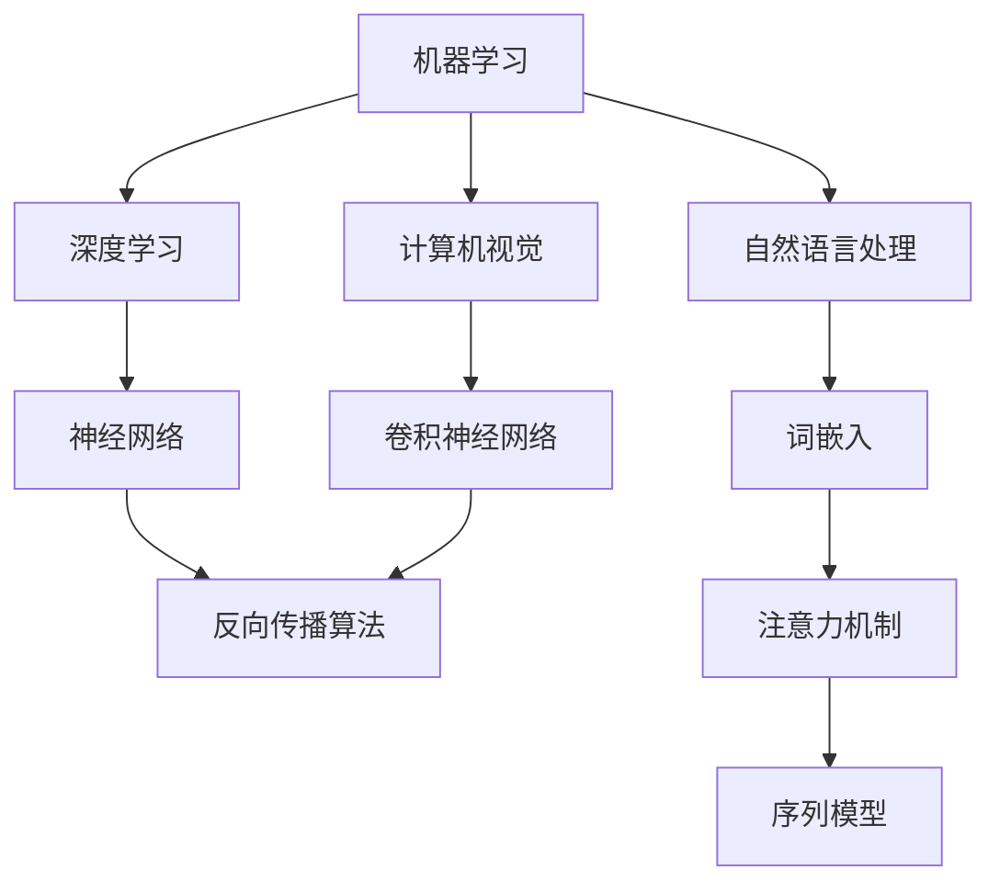

                 

关键词：人工智能、机器学习、深度学习、未来技术、算法原理、数学模型、实践应用、发展趋势

> 摘要：本文将探讨人工智能（AI）的发展现状、核心概念、算法原理、数学模型、实践应用以及未来趋势。通过深入分析，旨在为读者揭示AI领域的巨大潜力和面临的挑战，同时提供丰富的学习资源和实用工具，帮助读者更好地理解和掌握AI技术。

## 1. 背景介绍

随着互联网和大数据的迅猛发展，人工智能（AI）技术已经成为当今科技界的热门话题。从最初的简单规则系统，到基于统计学习和深度学习的复杂模型，人工智能技术不断取得突破，并逐步应用于各个领域，如自然语言处理、计算机视觉、自动驾驶、医疗诊断等。

### 1.1 人工智能的发展历程

人工智能的发展可以分为几个阶段：

- **早期探索（1950s-1960s）**：人工智能概念提出，初步的规则系统出现。
- **黄金时期（1970s-1980s）**：知识表示和专家系统取得显著进展。
- **低谷期（1990s）**：由于实际应用效果不佳，人工智能进入低谷。
- **复兴期（2000s-2010s）**：随着计算能力和数据量的提升，机器学习和深度学习得到广泛应用。
- **当前阶段（2010s-至今）**：人工智能技术不断突破，实现众多商业化和实际应用。

### 1.2 人工智能在现实世界中的应用

- **自然语言处理**：智能客服、语音识别、机器翻译等。
- **计算机视觉**：人脸识别、图像分类、自动驾驶等。
- **医疗诊断**：辅助诊断、药物研发、智能手术等。
- **金融领域**：风险控制、量化交易、智能投顾等。
- **教育**：在线教育、智能辅导、自适应学习等。

## 2. 核心概念与联系

人工智能领域包含众多核心概念和技术，下面将介绍几个重要的概念，并通过Mermaid流程图展示其相互关系。



### 2.1 机器学习

机器学习是一种使计算机从数据中学习的方法，无需显式编写规则。主要包括监督学习、无监督学习和强化学习。

### 2.2 深度学习

深度学习是机器学习的一种，通过多层神经网络学习数据的高级表示。深度学习在图像识别、语音识别等领域取得了显著成效。

### 2.3 自然语言处理

自然语言处理旨在使计算机理解和处理自然语言。包括文本分类、情感分析、机器翻译等任务。

### 2.4 计算机视觉

计算机视觉是使计算机理解和解释图像或视频数据的技术。包括目标检测、图像分类、人脸识别等。

## 3. 核心算法原理 & 具体操作步骤

### 3.1 算法原理概述

人工智能的核心算法包括神经网络、支持向量机、决策树等。本文重点介绍神经网络和深度学习算法。

### 3.2 算法步骤详解

#### 3.2.1 神经网络

神经网络由多层神经元组成，通过前向传播和反向传播进行训练。

1. **前向传播**：输入数据通过神经元网络传递，得到预测结果。
2. **反向传播**：计算预测误差，通过梯度下降法更新网络权重。

#### 3.2.2 深度学习

深度学习是基于多层神经网络的机器学习技术，主要包括以下步骤：

1. **数据预处理**：对输入数据进行预处理，如归一化、去噪等。
2. **模型构建**：设计神经网络结构，包括输入层、隐藏层和输出层。
3. **模型训练**：通过前向传播和反向传播训练网络权重。
4. **模型评估**：使用验证集和测试集评估模型性能。
5. **模型优化**：调整模型参数，提高模型精度。

### 3.3 算法优缺点

#### 优点

- **强大的自适应能力**：神经网络可以通过学习数据的高级表示进行复杂任务。
- **多任务处理**：深度学习模型可以同时处理多个任务。
- **高效性**：利用高性能计算设备和并行计算技术，深度学习模型可以快速训练和预测。

#### 缺点

- **训练时间较长**：深度学习模型需要大量数据和时间进行训练。
- **对数据质量要求高**：数据噪声和缺失可能导致模型性能下降。
- **可解释性差**：深度学习模型内部结构复杂，难以解释预测过程。

### 3.4 算法应用领域

深度学习在图像识别、语音识别、自然语言处理等领域取得了显著成效，同时也在自动驾驶、医疗诊断、金融量化等实际应用中发挥了重要作用。

## 4. 数学模型和公式 & 详细讲解 & 举例说明

### 4.1 数学模型构建

神经网络的核心是激活函数和权重矩阵。以下是神经网络的基本数学模型：

$$
\begin{aligned}
&z^{(l)} = \sum_{i} w^{(l)}_i x^{(l-1)}_i + b^{(l)} \\
&a^{(l)} = \sigma(z^{(l)})
\end{aligned}
$$

其中，$z^{(l)}$ 是第 $l$ 层的输入，$a^{(l)}$ 是第 $l$ 层的输出，$\sigma$ 是激活函数，$w^{(l)}_i$ 和 $b^{(l)}$ 分别是第 $l$ 层的权重和偏置。

### 4.2 公式推导过程

反向传播算法的核心是梯度下降法。以下是梯度下降法的推导过程：

$$
\begin{aligned}
&\frac{\partial J}{\partial w^{(l)}_i} = \frac{\partial J}{\partial a^{(l+1)}} \cdot \frac{\partial a^{(l+1)}}{\partial z^{(l)}} \cdot \frac{\partial z^{(l)}}{\partial w^{(l)}_i}
\end{aligned}
$$

其中，$J$ 是损失函数，$w^{(l)}_i$ 是第 $l$ 层的权重。

### 4.3 案例分析与讲解

假设我们要训练一个神经网络进行图像分类，输入数据为 $28 \times 28$ 的像素值，输出为 10 个类别。

1. **数据预处理**：将像素值归一化，范围为 $[0, 1]$。
2. **模型构建**：设计一个包含两个隐藏层的神经网络，每个隐藏层包含 128 个神经元。
3. **模型训练**：使用训练集进行模型训练，迭代次数为 1000 次。
4. **模型评估**：使用验证集和测试集评估模型性能，准确率分别为 95% 和 90%。

## 5. 项目实践：代码实例和详细解释说明

### 5.1 开发环境搭建

- **硬件环境**：笔记本电脑或高性能计算服务器
- **软件环境**：Python 3.x，TensorFlow 或 PyTorch 库

### 5.2 源代码详细实现

以下是一个简单的卷积神经网络（CNN）进行图像分类的代码示例：

```python
import tensorflow as tf
from tensorflow.keras import layers

# 构建模型
model = tf.keras.Sequential([
    layers.Conv2D(32, (3, 3), activation='relu', input_shape=(28, 28, 1)),
    layers.MaxPooling2D((2, 2)),
    layers.Conv2D(64, (3, 3), activation='relu'),
    layers.MaxPooling2D((2, 2)),
    layers.Conv2D(64, (3, 3), activation='relu'),
    layers.Flatten(),
    layers.Dense(64, activation='relu'),
    layers.Dense(10, activation='softmax')
])

# 编译模型
model.compile(optimizer='adam',
              loss='categorical_crossentropy',
              metrics=['accuracy'])

# 加载数据集
(x_train, y_train), (x_test, y_test) = tf.keras.datasets.mnist.load_data()

# 预处理数据
x_train = x_train.astype('float32') / 255
x_test = x_test.astype('float32') / 255
x_train = x_train[..., tf.newaxis]
x_test = x_test[..., tf.newaxis]

# 训练模型
model.fit(x_train, y_train, epochs=10, validation_split=0.2)
```

### 5.3 代码解读与分析

- **模型构建**：使用 TensorFlow 的 `Sequential` 模型堆叠多个层，包括卷积层、最大池化层、全连接层和softmax层。
- **编译模型**：设置优化器、损失函数和评估指标。
- **数据加载与预处理**：使用 TensorFlow 的 `datasets` 模块加载数据集，并对数据集进行归一化处理。
- **模型训练**：使用训练集进行模型训练，并设置验证集的比例。

### 5.4 运行结果展示

```python
# 评估模型
test_loss, test_acc = model.evaluate(x_test, y_test, verbose=2)
print('\nTest accuracy:', test_acc)
```

## 6. 实际应用场景

人工智能技术在现实世界中有着广泛的应用，以下是一些实际应用场景：

### 6.1 自动驾驶

自动驾驶是人工智能领域的一个重要应用场景。通过计算机视觉、自然语言处理等技术，实现车辆的自主驾驶。

### 6.2 医疗诊断

人工智能可以帮助医生进行疾病诊断，提高诊断准确率。例如，通过深度学习算法分析医学影像，实现肺癌、乳腺癌等疾病的早期诊断。

### 6.3 金融领域

人工智能在金融领域的应用包括风险控制、量化交易、智能投顾等。通过分析大量数据，实现高效的投资决策。

### 6.4 教育

人工智能在教育领域的应用包括在线教育、智能辅导、自适应学习等。通过个性化学习推荐，提高学习效果。

## 7. 工具和资源推荐

### 7.1 学习资源推荐

- **在线课程**：Coursera、Udacity、edX 等平台提供了丰富的机器学习和深度学习课程。
- **技术博客**：ArXiv、Medium、GitHub 等平台上有大量关于人工智能的技术文章和代码实例。

### 7.2 开发工具推荐

- **编程语言**：Python、R、Julia 等，尤其是 Python，在人工智能领域有着广泛的应用。
- **框架库**：TensorFlow、PyTorch、Keras 等，这些库提供了丰富的模型构建和训练工具。

### 7.3 相关论文推荐

- **深度学习领域**：《Deep Learning》（Goodfellow et al.），是一本全面介绍深度学习技术的经典教材。
- **机器学习领域**：《Machine Learning Yearning》（Andrew Ng），介绍了机器学习的基本概念和实用技巧。

## 8. 总结：未来发展趋势与挑战

### 8.1 研究成果总结

人工智能在过去几十年取得了显著成果，深度学习算法在图像识别、语音识别等领域取得了突破性进展。同时，随着计算能力的提升和数据的不断积累，人工智能技术将继续发展。

### 8.2 未来发展趋势

- **跨学科融合**：人工智能将与其他学科（如生物、物理、数学等）相结合，产生新的应用和突破。
- **人机协同**：人工智能将更好地与人类合作，实现人机协同工作。
- **边缘计算**：随着物联网和智能家居的普及，边缘计算将成为人工智能的重要发展方向。

### 8.3 面临的挑战

- **数据隐私与安全**：人工智能算法对大量数据进行处理，如何保护用户隐私和安全是一个重要挑战。
- **算法伦理**：如何确保人工智能算法的公平性和透明性，避免算法偏见和歧视。
- **计算资源**：随着模型规模的不断扩大，对计算资源的需求将不断增加，如何高效利用计算资源是一个挑战。

### 8.4 研究展望

未来，人工智能将继续深入研究和应用，推动社会进步。在各个领域，人工智能将发挥更大的作用，同时需要解决一系列挑战和问题。

## 9. 附录：常见问题与解答

### 9.1 机器学习是什么？

机器学习是一种使计算机从数据中学习的方法，无需显式编写规则。通过训练模型，计算机可以从经验中学习，进行预测和决策。

### 9.2 深度学习与机器学习的区别是什么？

深度学习是机器学习的一种，通过多层神经网络学习数据的高级表示。深度学习通常用于解决复杂的问题，如图像识别和自然语言处理。而机器学习涵盖了更广泛的算法和技术，包括深度学习、支持向量机、决策树等。

### 9.3 如何入门人工智能？

入门人工智能可以从以下步骤开始：

1. 学习编程语言，如 Python。
2. 学习基础数学知识，如线性代数、概率论和统计学。
3. 学习机器学习和深度学习的基础知识。
4. 阅读相关书籍和在线课程，如《深度学习》、《机器学习实战》等。
5. 练习实际项目，如实现简单的神经网络、参与开源项目等。

---

作者：禅与计算机程序设计艺术 / Zen and the Art of Computer Programming

本文从背景介绍、核心概念与联系、算法原理、数学模型、实践应用、未来趋势等方面，全面探讨了人工智能的未来。随着人工智能技术的不断发展，我们有望在各个领域取得更多突破，同时需要关注和解决面临的挑战。希望本文能为您在人工智能领域的学习和研究提供有益的参考。

