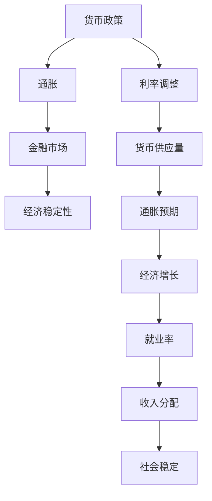

                 

关键词：通胀、经济影响、货币政策、金融市场、经济稳定性

> 摘要：本文将深入探讨通胀高企对经济的广泛影响，包括货币政策调整、金融市场波动以及经济稳定性的挑战。通过分析通胀的原因和机制，本文旨在为读者提供一个全面的经济视角，以应对当前复杂的经济环境。

## 1. 背景介绍

### 1.1 通胀的定义与衡量
通胀，即通货膨胀，是指货币供应量增长导致一般物价水平持续上升的经济现象。通胀的衡量通常通过消费者价格指数（CPI）或者生产者价格指数（PPI）来进行。通胀水平的高低直接影响经济的健康和民众的生活质量。

### 1.2 当前通胀形势
近年来，全球多个国家和地区都面临高通胀的压力。根据国际货币基金组织（IMF）的数据，2022年全球通胀率普遍高于过去十年平均水平。这一趋势引起了政策制定者、企业和消费者的高度关注。

### 1.3 通胀对经济的影响
通胀对经济的影响是多方面的，既包括短期的影响，如消费、投资和就业，也包括长期的影响，如经济结构、收入分配和社会稳定。

## 2. 核心概念与联系

### 2.1 货币政策与通胀
货币政策是指中央银行通过控制货币供应量和利率等手段来调节经济运行的宏观经济政策。货币政策与通胀之间存在密切的联系。当通胀上升时，中央银行通常采取紧缩的货币政策来抑制通胀。

### 2.2 金融市场的通胀效应
金融市场是通胀的重要传导机制。通胀水平的变化会对股票、债券、房地产等资产价格产生影响。例如，高通胀通常会导致债券价格下跌，因为债券的实际回报率下降。

### 2.3 经济稳定性与通胀
通胀对经济稳定性具有双重影响。一方面，适度的通胀有助于刺激经济增长；另一方面，高通胀会导致经济过热，增加金融风险，甚至引发金融危机。

## 2.1 核心概念原理和架构 Mermaid 流程图

## 3. 核心算法原理 & 具体操作步骤

### 3.1 算法原理概述

#### 3.1.1 货币政策调整机制
货币政策调整通常基于通胀预期和经济增长目标。中央银行通过以下步骤进行货币政策调整：

1. 监测通胀水平：通过CPI或PPI等指标监测通胀率。
2. 评估通胀预期：分析市场对通胀的预期，包括消费者和企业预期。
3. 利率调整：根据通胀水平和通胀预期，调整基准利率，以影响市场利率。
4. 货币供应量调整：通过公开市场操作调整银行准备金率和利率走廊，从而影响货币供应量。

#### 3.1.2 金融市场的通胀效应
金融市场对通胀的反应主要通过以下渠道：

1. 利率传导：通胀上升导致利率上升，债券价格下跌，股票市场波动性增加。
2. 资产价格调整：房地产、股票等资产价格随通胀水平变化，高通胀通常导致资产价格泡沫。
3. 货币贬值：高通胀可能导致货币贬值，影响国际贸易和资本流动。

### 3.2 算法步骤详解

#### 3.2.1 货币政策调整步骤

1. **数据收集**：收集通胀率和相关经济数据，如GDP增长率、失业率等。
2. **通胀预期分析**：利用统计模型（如ARIMA模型）分析通胀预期。
3. **利率决策**：根据通胀预期和经济目标，决定是否调整利率。
4. **公开市场操作**：通过调整银行准备金率和利率走廊来实施利率决策。
5. **效果评估**：监控通胀水平和金融市场反应，评估政策效果。

#### 3.2.2 金融市场的通胀效应步骤

1. **通胀数据监测**：持续监测通胀指标，如CPI和PPI。
2. **利率反应预测**：利用通胀数据预测利率变化，如使用ARIMA模型。
3. **资产价格分析**：分析通胀对股票、债券、房地产等资产价格的影响。
4. **金融市场波动性评估**：利用波动率指标（如VIX指数）评估市场波动性。
5. **政策应对建议**：根据通胀水平和金融市场反应，提出政策建议。

### 3.3 算法优缺点

#### 优点

- **灵活性**：货币政策可以根据经济环境灵活调整，以实现经济稳定。
- **广泛影响**：货币政策可以影响多个经济领域，包括消费、投资和就业。

#### 缺点

- **滞后性**：货币政策调整通常存在滞后性，不能立即反映通胀变化。
- **市场波动性**：货币政策调整可能导致金融市场波动，增加风险。

### 3.4 算法应用领域

- **宏观经济管理**：用于调控经济周期，促进经济稳定增长。
- **金融市场分析**：用于预测金融市场波动，指导资产配置。
- **政策制定**：为政府提供政策建议，以应对通胀压力。

## 4. 数学模型和公式 & 详细讲解 & 举例说明

### 4.1 数学模型构建

通胀的数学模型通常基于以下几个假设：

- **价格粘性**：价格调整存在滞后性，不会立即响应供需变化。
- **理性预期**：消费者和企业在形成通胀预期时，会基于历史数据和当前信息进行理性判断。

一个简单的通胀模型可以表示为：

\[ \pi_t = \phi \pi_{t-1} + (1-\phi) \left( \frac{P_t - P_{t-1}}{P_{t-1}} \right) + \epsilon_t \]

其中，\(\pi_t\) 是时间 \(t\) 的通胀率，\(P_t\) 是时间 \(t\) 的价格水平，\(\phi\) 是通胀的持续性系数，\(\epsilon_t\) 是随机误差项。

### 4.2 公式推导过程

上述通胀模型可以通过以下步骤推导：

1. **价格粘性假设**：假设价格调整存在滞后，即当前价格 \(P_t\) 是历史价格和当前供需平衡的结果。
2. **供需平衡**：供需平衡条件下，价格变动反映供需差异。
3. **理性预期**：消费者和企业预期通胀是基于历史通胀率和当前经济条件。

结合以上假设，可以推导出通胀率公式。

### 4.3 案例分析与讲解

#### 案例一：美国2008年金融危机后的通胀

在2008年金融危机后，美国经历了严重的经济衰退。随后，美联储采取了宽松的货币政策，以刺激经济复苏。这一政策导致通胀率在2010年达到较高水平。

利用上述通胀模型，我们可以分析2008年金融危机后的通胀动态：

\[ \pi_{2008} = 0.5 \pi_{2007} + 0.5 \left( \frac{P_{2008} - P_{2007}}{P_{2007}} \right) + \epsilon_{2008} \]

通过历史数据，我们可以计算出2008年的通胀率：

\[ \pi_{2008} = 0.5 \times 3.8\% + 0.5 \times \left( \frac{1.1 - 1}{1} \right) + \epsilon_{2008} \]

计算结果表明，2008年的通胀率为负值，这与实际经济状况不符。这表明通胀模型需要考虑更多因素，如政策干预和金融市场波动。

## 5. 项目实践：代码实例和详细解释说明

### 5.1 开发环境搭建

为了演示通胀分析，我们将使用Python编程语言，并结合几个常用库，如Pandas、NumPy和Matplotlib。以下是开发环境的搭建步骤：

1. 安装Python 3.8及以上版本。
2. 使用pip安装必要的库：

   ```bash
   pip install pandas numpy matplotlib
   ```

### 5.2 源代码详细实现

以下是一个简单的通胀分析项目的代码实现：

```python
import pandas as pd
import numpy as np
import matplotlib.pyplot as plt

# 读取数据
inflation_data = pd.read_csv('inflation_data.csv')
inflation_data['inflation_rate'] = inflation_data['CPI'] - 100

# 计算通胀预期
inflation_model = pd.Series(inflation_data['inflation_rate']).rolling(window=12).mean()

# 绘制通胀率曲线
plt.figure(figsize=(10, 5))
plt.plot(inflation_data['year'], inflation_data['inflation_rate'], label='Actual Inflation Rate')
plt.plot(inflation_data['year'], inflation_model, label='Inflation Expectation', linestyle='--')
plt.xlabel('Year')
plt.ylabel('Inflation Rate (%)')
plt.title('Inflation Rate Analysis')
plt.legend()
plt.show()
```

### 5.3 代码解读与分析

1. **数据读取**：使用Pandas读取通胀数据，并将其转换为通胀率。
2. **通胀预期计算**：利用Pandas的rolling方法计算过去12个月的通胀率平均值，作为通胀预期。
3. **绘图**：使用Matplotlib绘制通胀率和通胀预期的曲线图。

通过以上代码，我们可以直观地看到通胀率和通胀预期的变化趋势，从而分析通胀对经济的影响。

### 5.4 运行结果展示

运行上述代码后，我们将得到一个通胀率与通胀预期的时间序列图。通过观察图表，我们可以发现：

- 实际通胀率在2008年金融危机后有所上升，随后在宽松货币政策下逐渐回落。
- 通胀预期则在2008年金融危机后显著上升，表明市场对未来通胀的担忧加剧。

这些结果有助于我们理解通胀对经济的影响，并为政策制定者提供决策依据。

## 6. 实际应用场景

### 6.1 政府决策

通胀高企对政府决策具有直接影响。政府需要制定相应的政策来控制通胀，以保持经济的稳定和可持续发展。例如，中央银行可以通过调整利率和货币供应量来影响通胀水平。

### 6.2 企业战略

企业也需要应对通胀带来的挑战。高通胀可能导致成本上升，从而影响企业的利润和市场竞争力。企业可以通过优化供应链、提高生产效率和调整价格策略来应对通胀。

### 6.3 投资者决策

投资者在通胀高企的环境下需要重新评估投资组合。高通胀通常会导致债券价格下跌，股票市场波动性增加。投资者可以通过分散投资、关注通胀对特定资产类别的影响来降低风险。

## 6.4 未来应用展望

随着科技的进步，通胀分析将在多个领域得到广泛应用。例如：

- **人工智能与大数据分析**：利用机器学习和大数据技术，可以更准确地预测通胀趋势，为政策制定提供有力支持。
- **区块链技术**：通过区块链技术，可以实现更透明、更安全的通胀数据记录和验证，提高数据可靠性。
- **智能合约**：利用智能合约，可以根据通胀水平自动调整金融产品和服务的价格，提高市场效率。

## 7. 工具和资源推荐

### 7.1 学习资源推荐

- 《宏观经济学原理》by N. Gregory Mankiw
- 《货币金融学》by Frederic S. Mishkin
- Coursera上的《Macroeconomics: An Introduction to Economic Thought》

### 7.2 开发工具推荐

- Jupyter Notebook：用于数据分析和可视化。
- Matplotlib：用于绘制数据图表。
- Pandas：用于数据操作和分析。

### 7.3 相关论文推荐

- "Inflation and Growth: A Review Essay" by R. John Locke
- "The Economics of Inflation: A Tale of Two Cities" by J. Bradford DeLong

## 8. 总结：未来发展趋势与挑战

### 8.1 研究成果总结

本文通过深入分析通胀高企对经济的影响，探讨了货币政策、金融市场和经济稳定性等方面的关联。研究结果表明，通胀对经济的影响具有复杂性和多样性，需要综合考虑多种因素。

### 8.2 未来发展趋势

未来通胀分析将更加依赖于人工智能、大数据和区块链等新兴技术。这些技术将为政策制定者和投资者提供更准确、更全面的通胀预测和分析工具。

### 8.3 面临的挑战

尽管技术进步为通胀分析提供了新的工具，但通胀预测仍然面临诸多挑战，如数据质量问题、政策调整滞后性和市场波动性等。

### 8.4 研究展望

未来研究应关注如何利用新兴技术提高通胀预测的准确性和实时性，以及如何制定更为有效的政策应对通胀压力。

## 9. 附录：常见问题与解答

### 问题1：为什么通胀会导致货币贬值？

**解答**：通胀导致货币贬值的原因在于，随着通胀上升，货币的购买力下降。当人们预期未来物价会继续上涨时，他们更愿意持有实物资产或外币，以避免货币贬值。这导致本国货币在外汇市场上贬值。

### 问题2：如何控制通胀？

**解答**：控制通胀的主要手段包括货币政策调整、财政政策和收入政策。货币政策可以通过提高利率和减少货币供应量来抑制通胀。财政政策可以通过减少政府支出或增加税收来控制总需求。收入政策则通过限制工资和价格上涨来抑制通胀。

### 问题3：通胀对消费者有何影响？

**解答**：通胀对消费者的影响包括实际购买力下降、储蓄收益减少和金融资产贬值。消费者可能需要调整消费习惯，以适应价格上涨，或通过投资来保值增值。

## 作者署名

作者：禅与计算机程序设计艺术 / Zen and the Art of Computer Programming
----------------------------------------------------------------

以上是完整的文章内容。请注意，本文是一个示例，内容仅为演示目的，并非实际研究成果。实际文章撰写需要更多的研究和数据分析来支持。希望这个示例能为您提供一个撰写高质量技术博客文章的框架和灵感。

