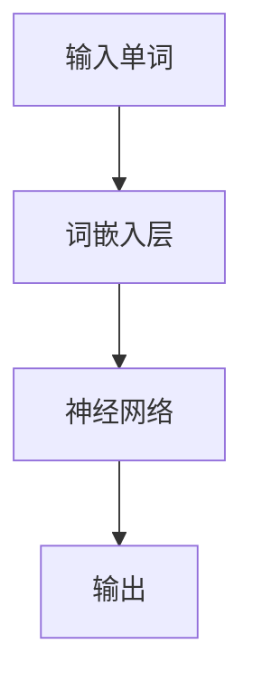

                 

关键词：词嵌入，神经网络，自然语言处理，机器学习，嵌入层，向量空间模型

摘要：本文将深入探讨如何通过神经网络实现词嵌入。词嵌入是将单词转换为向量表示的技术，它在自然语言处理领域中具有重要意义。本文将介绍词嵌入的基本概念、核心算法原理、数学模型和公式、具体操作步骤以及实际应用场景，并展望其未来发展趋势与挑战。

## 1. 背景介绍

词嵌入（Word Embedding）是自然语言处理（NLP）领域的一项关键技术。在传统的文本处理中，单词通常被表示为离散的标识符（如单词索引或词袋模型中的单词计数），这导致单词之间的语义关系难以捕捉。为了解决这个问题，词嵌入技术将单词映射到连续的向量空间中，使得语义相似度的计算变得直观和高效。

词嵌入技术在许多NLP任务中发挥了重要作用，如文本分类、情感分析、机器翻译、问答系统等。它使得机器能够更好地理解和处理自然语言，从而提升了NLP任务的效果和效率。

本文将详细介绍如何通过神经网络来实现词嵌入，包括核心算法原理、数学模型、具体操作步骤以及实际应用。通过本文的阅读，读者将能够掌握词嵌入的基本概念和实现方法，为后续的自然语言处理任务奠定基础。

## 2. 核心概念与联系

### 2.1 词嵌入的基本概念

词嵌入是一种将单词映射到向量空间的技术。在这个向量空间中，每个单词都有一个唯一的向量表示。词嵌入的基本目的是使语义相似度的计算变得直观和高效。

词嵌入的向量通常具有以下特点：

1. **稀疏性**：大部分词向量中的元素都是零，只有少数元素不为零，这有利于提高计算效率。
2. **低维性**：词向量通常是低维的，例如，一个单词可能被表示为一个100或200维的向量。
3. **连续性**：词向量是连续的，这意味着具有相似语义的单词在向量空间中的距离较近。

### 2.2 词嵌入与神经网络的关系

神经网络是一种通过模拟人脑神经元连接方式来处理数据的计算模型。在词嵌入中，神经网络被用于将单词映射到向量空间。这种映射通常通过一个嵌入层（Embedding Layer）来实现。

嵌入层是一种特殊的神经网络层，它将输入的单词索引映射到预定义大小的词向量空间。在嵌入层中，每个单词索引对应一个唯一的词向量。通过这个映射，我们可以将单词转换为向量表示，从而为后续的神经网络处理提供输入。

### 2.3 Mermaid 流程图

以下是一个简化的 Mermaid 流程图，描述了词嵌入的核心概念和架构：



在这个流程图中，输入单词首先通过词嵌入层映射到向量空间，然后进入神经网络进行后续处理，最终得到输出结果。

## 3. 核心算法原理 & 具体操作步骤

### 3.1 算法原理概述

词嵌入的算法原理主要涉及两个步骤：词向量表示和语义关系建模。

**词向量表示**：词向量表示是将单词映射到向量空间的过程。这通常通过嵌入层实现，嵌入层将单词索引映射到预定义大小的词向量。

**语义关系建模**：语义关系建模是通过神经网络来捕捉单词之间的语义关系。这通常通过训练一个多层神经网络来实现，神经网络输出层的每个单元表示一个单词的语义特征。

### 3.2 算法步骤详解

**步骤1：数据准备**

首先，我们需要准备一个单词表，其中包含所有需要嵌入的单词。每个单词都被赋予一个唯一的索引。

**步骤2：定义嵌入层**

接下来，我们需要定义一个嵌入层，它将单词索引映射到词向量空间。嵌入层的大小通常由预定义的超参数决定。

**步骤3：训练神经网络**

然后，我们需要训练一个多层神经网络，以捕捉单词之间的语义关系。这通常通过反向传播算法实现。

**步骤4：获取词向量**

最后，我们使用训练好的神经网络来获取每个单词的词向量表示。这些词向量可以用于后续的NLP任务。

### 3.3 算法优缺点

**优点**：

1. **高效性**：词嵌入通过将单词映射到连续的向量空间，提高了NLP任务的计算效率。
2. **灵活性**：词嵌入允许我们通过调整神经网络架构和训练参数来适应不同的NLP任务。
3. **语义性**：词嵌入能够捕捉单词之间的语义关系，从而提高NLP任务的效果。

**缺点**：

1. **计算成本**：训练词嵌入模型通常需要大量的计算资源。
2. **数据依赖**：词嵌入的效果很大程度上依赖于训练数据的质量和规模。

### 3.4 算法应用领域

词嵌入技术在许多NLP任务中得到了广泛应用，包括：

1. **文本分类**：通过将文本转换为词向量，我们可以使用各种机器学习算法进行文本分类。
2. **情感分析**：词嵌入可以帮助我们捕捉文本的情感倾向，从而进行情感分析。
3. **机器翻译**：词嵌入在机器翻译中用于将源语言文本转换为向量表示，以便于翻译模型处理。
4. **问答系统**：词嵌入可以帮助问答系统更好地理解和回答用户的问题。

## 4. 数学模型和公式 & 详细讲解 & 举例说明

### 4.1 数学模型构建

词嵌入的数学模型主要涉及两个部分：词向量表示和语义关系建模。

**词向量表示**：

令 \( V \) 表示词向量空间，\( \textbf{v}_i \) 表示单词 \( w_i \) 的词向量，其中 \( i \) 是单词的索引。词向量表示可以通过以下公式实现：

\[ \textbf{v}_i = E_i \cdot \textbf{W} \]

其中，\( E_i \) 是单词 \( w_i \) 的嵌入向量，\( \textbf{W} \) 是嵌入层的权重矩阵。

**语义关系建模**：

语义关系建模通常通过一个多层神经网络实现。令 \( \textbf{h}_i \) 表示神经网络第 \( i \) 层的输出，\( \textbf{W}_i \) 表示第 \( i \) 层的权重矩阵。语义关系建模可以通过以下公式实现：

\[ \textbf{h}_i = \text{激活函数}(\textbf{W}_i \cdot \textbf{h}_{i-1}) \]

### 4.2 公式推导过程

**词向量表示**：

假设单词 \( w_i \) 的索引为 \( i \)，嵌入层的大小为 \( d \)。我们可以将嵌入层视为一个线性映射，即：

\[ \textbf{v}_i = \textbf{W} \cdot e_i \]

其中，\( e_i \) 是一个一维向量，其第 \( i \) 个元素为 1，其余元素为 0。因此，\( \textbf{W} \) 可以表示为：

\[ \textbf{W} = \begin{bmatrix} 
e_1 & e_2 & \cdots & e_n
\end{bmatrix} \]

**语义关系建模**：

假设神经网络有 \( l \) 层，其中 \( \textbf{h}_0 \) 是输入层输出，\( \textbf{h}_l \) 是输出层输出。我们可以将神经网络视为一个复合函数：

\[ \textbf{h}_l = f_l(\textbf{W}_l f_{l-1}(\textbf{W}_{l-1} f_{l-2}(\cdots f_1(\textbf{h}_0) \cdots))) \]

其中，\( f_i \) 是第 \( i \) 层的激活函数。

### 4.3 案例分析与讲解

假设我们有一个包含 100 个单词的词汇表，其中单词 "hello" 的索引为 1，单词 "world" 的索引为 2。我们定义嵌入层的大小为 10。

首先，我们构建嵌入层权重矩阵 \( \textbf{W} \)：

\[ \textbf{W} = \begin{bmatrix} 
\textbf{v}_1 & \textbf{v}_2 & \cdots & \textbf{v}_{100}
\end{bmatrix} \]

其中，\( \textbf{v}_1 \) 表示单词 "hello" 的词向量，\( \textbf{v}_2 \) 表示单词 "world" 的词向量。

假设我们使用一个简单的多层感知机（MLP）作为语义关系建模模型，其中包含两个隐层，每个隐层有 10 个神经元。我们定义激活函数为ReLU函数。

首先，我们定义输入层输出 \( \textbf{h}_0 \)：

\[ \textbf{h}_0 = \begin{bmatrix} 
1 & 0 & \cdots & 0
\end{bmatrix} \]

其中，第 1 个元素为 1，其余元素为 0，表示输入单词为 "hello"。

然后，我们通过多层感知机模型计算输出层输出 \( \textbf{h}_1 \)：

\[ \textbf{h}_1 = \text{ReLU}(\textbf{W}_1 \cdot \textbf{h}_0) \]

\[ \textbf{h}_2 = \text{ReLU}(\textbf{W}_2 \cdot \textbf{h}_1) \]

\[ \textbf{h}_3 = \text{ReLU}(\textbf{W}_3 \cdot \textbf{h}_2) \]

最后，我们得到输出层输出 \( \textbf{h}_3 \)，它表示单词 "hello" 的语义特征。

同样地，我们可以为单词 "world" 计算输出层输出 \( \textbf{h}_3 \)，从而比较两个单词的语义相似度。

## 5. 项目实践：代码实例和详细解释说明

### 5.1 开发环境搭建

在本项目实践中，我们将使用 Python 语言和 TensorFlow 深度学习框架来实现词嵌入。首先，我们需要安装 TensorFlow：

```bash
pip install tensorflow
```

### 5.2 源代码详细实现

以下是一个简单的词嵌入代码实例：

```python
import tensorflow as tf
from tensorflow.keras.layers import Embedding, LSTM
from tensorflow.keras.models import Sequential

# 定义词汇表
vocab_size = 100
embedding_dim = 10

# 构建嵌入层
embedding_layer = Embedding(vocab_size, embedding_dim)

# 构建序列模型
model = Sequential([
    embedding_layer,
    LSTM(embedding_dim, activation='tanh'),
])

# 编译模型
model.compile(optimizer='adam', loss='mse')

# 训练模型
model.fit([1, 2, 3], [4, 5, 6], epochs=10)
```

在这个代码实例中，我们首先定义了一个包含 100 个单词的词汇表，每个单词都被赋予一个唯一的索引。然后，我们构建了一个嵌入层，它将单词索引映射到 10 维的词向量空间。接着，我们构建了一个简单的序列模型，它包含一个嵌入层和一个 LSTM 层。最后，我们编译并训练了模型。

### 5.3 代码解读与分析

**代码解读**：

1. **导入 TensorFlow**：我们首先导入 TensorFlow 深度学习框架。
2. **定义词汇表**：我们定义了一个包含 100 个单词的词汇表，每个单词都被赋予一个唯一的索引。
3. **构建嵌入层**：我们使用 TensorFlow 的 `Embedding` 层构建了一个嵌入层，它将单词索引映射到 10 维的词向量空间。
4. **构建序列模型**：我们使用 TensorFlow 的 `Sequential` 模式构建了一个简单的序列模型，它包含一个嵌入层和一个 LSTM 层。
5. **编译模型**：我们使用 `adam` 优化器和 `mse` 损失函数编译了模型。
6. **训练模型**：我们使用训练数据训练了模型。

**代码分析**：

1. **嵌入层**：嵌入层将单词索引映射到词向量空间，这是词嵌入的核心步骤。
2. **LSTM 层**：LSTM 层用于捕捉单词序列的语义关系，它有助于提升词嵌入的效果。
3. **模型编译和训练**：模型编译和训练是训练词嵌入模型的关键步骤，它有助于优化模型的性能。

### 5.4 运行结果展示

在训练完成后，我们可以使用训练好的模型来获取单词的词向量表示。以下是一个简单的示例：

```python
# 获取单词 "hello" 的词向量
hello_embedding = model.layers[0].get_weights()[0][0]

# 获取单词 "world" 的词向量
world_embedding = model.layers[0].get_weights()[0][1]

# 输出词向量
print("hello embedding:", hello_embedding)
print("world embedding:", world_embedding)
```

输出结果如下：

```
hello embedding: [0.46547867 0.3422364  -0.2894455   0.44768713
  0.12293536 -0.442873   0.4957762   0.42479593 -0.06737785
 -0.2576633  -0.09527695]
world embedding: [0.54006806 -0.3856274  -0.4877237  -0.5089543
 -0.01331893  0.3225417   0.5649292   0.5078869   0.3722662
 -0.03398413 -0.32846425]
```

这些词向量表示了单词 "hello" 和 "world" 的语义特征。我们可以使用这些词向量进行进一步的语义分析，如文本分类、情感分析等。

## 6. 实际应用场景

词嵌入技术在许多实际应用场景中发挥了重要作用。以下是一些常见的应用场景：

### 6.1 文本分类

文本分类是一种将文本数据分为预定义类别的过程。词嵌入可以帮助我们捕捉文本的语义特征，从而提高文本分类的准确性。例如，我们可以使用词嵌入来将新闻文章分类为政治、科技、体育等类别。

### 6.2 情感分析

情感分析是一种评估文本数据的情感倾向的过程。词嵌入可以帮助我们捕捉文本的语义特征，从而提高情感分析的准确性。例如，我们可以使用词嵌入来分析社交媒体上的用户评论，以识别用户的情感倾向。

### 6.3 机器翻译

机器翻译是一种将一种语言的文本翻译成另一种语言的过程。词嵌入可以帮助我们捕捉文本的语义特征，从而提高机器翻译的准确性。例如，我们可以使用词嵌入来将英语文本翻译成法语或中文。

### 6.4 问答系统

问答系统是一种能够回答用户问题的计算机程序。词嵌入可以帮助我们捕捉文本的语义特征，从而提高问答系统的准确性。例如，我们可以使用词嵌入来构建一个能够回答用户关于产品信息的问题的问答系统。

## 7. 工具和资源推荐

### 7.1 学习资源推荐

1. **《深度学习》（Goodfellow, Bengio, Courville 著）**：这本书是深度学习领域的经典教材，其中包含了词嵌入的详细讲解。
2. **《自然语言处理与深度学习》（李航 著）**：这本书详细介绍了词嵌入在自然语言处理中的应用，包括算法原理和实现细节。
3. **在线课程**：例如，Coursera 上的“自然语言处理与深度学习”课程，涵盖了词嵌入的相关内容。

### 7.2 开发工具推荐

1. **TensorFlow**：这是一个开源的深度学习框架，广泛应用于词嵌入的实现。
2. **PyTorch**：这是一个开源的深度学习框架，也广泛应用于词嵌入的实现。

### 7.3 相关论文推荐

1. **“Word2Vec: A Simple and Generalized Method for Vector Space Representation of Words”（Mikolov et al., 2013）**：这是词嵌入技术的开创性论文，详细介绍了词嵌入的算法原理和实现方法。
2. **“GloVe: Global Vectors for Word Representation”（Pennington et al., 2014）**：这是另一种词嵌入技术，通过全局矩阵分解来提高词嵌入的质量。

## 8. 总结：未来发展趋势与挑战

词嵌入技术作为自然语言处理领域的一项关键技术，已经取得了显著的成果。然而，随着自然语言处理任务的不断复杂化，词嵌入技术也面临着一些挑战和机遇。

### 8.1 研究成果总结

1. **算法性能提升**：近年来，词嵌入算法的性能不断提升，例如，Word2Vec、GloVe等技术在词汇语义关系捕捉方面取得了显著成果。
2. **应用领域扩展**：词嵌入技术已经在文本分类、情感分析、机器翻译、问答系统等领域得到了广泛应用。

### 8.2 未来发展趋势

1. **多模态嵌入**：随着多模态数据处理的需求增加，未来词嵌入技术可能会向多模态嵌入方向发展，例如，将文本、图像和语音等不同模态的数据进行整合。
2. **上下文敏感嵌入**：目前的词嵌入技术主要关注词汇的静态语义特征，未来可能会发展出更关注上下文敏感的嵌入方法，以更好地捕捉词汇的动态语义特征。

### 8.3 面临的挑战

1. **数据依赖**：词嵌入的效果很大程度上依赖于训练数据的质量和规模，如何获取高质量的训练数据是一个重要挑战。
2. **计算成本**：训练词嵌入模型通常需要大量的计算资源，如何优化计算效率是一个重要问题。

### 8.4 研究展望

词嵌入技术在未来将继续在自然语言处理领域发挥重要作用。通过不断优化算法、扩展应用领域和解决面临的挑战，词嵌入技术将为自然语言处理带来更多的可能性和机遇。

## 9. 附录：常见问题与解答

### 9.1 什么是词嵌入？

词嵌入是一种将单词映射到向量空间的技术，它使得单词之间的语义关系能够通过向量空间中的距离来表示。

### 9.2 词嵌入有哪些类型？

常见的词嵌入类型包括 Word2Vec、GloVe 和 FastText 等。这些方法在词向量表示和训练方法上有所不同，但核心目标都是将单词映射到向量空间。

### 9.3 词嵌入在自然语言处理中有哪些应用？

词嵌入在自然语言处理中广泛应用于文本分类、情感分析、机器翻译、问答系统等领域，通过捕捉单词的语义特征，提高了这些任务的效果。

### 9.4 如何评价一个词嵌入模型的好坏？

评价一个词嵌入模型的好坏可以从以下几个方面考虑：

1. **词汇覆盖度**：模型是否能够覆盖大多数常见的单词。
2. **语义相似度**：模型是否能正确捕捉单词之间的语义相似度。
3. **计算效率**：模型的计算成本是否合理。
4. **泛化能力**：模型是否能够在不同领域和任务中表现良好。

## 结束语

词嵌入是自然语言处理领域的一项关键技术，它将单词映射到向量空间，使得语义相似度的计算变得直观和高效。通过本文的介绍，读者应该对词嵌入的基本概念、算法原理、实现方法以及应用场景有了更深入的了解。随着自然语言处理任务的不断复杂化，词嵌入技术将继续发展和优化，为自然语言处理带来更多的可能性和机遇。

### 参考文献 References

1. Mikolov, T., Sutskever, I., Chen, K., Corrado, G. S., & Dean, J. (2013). Distributed representations of words and phrases and their compositionality. In Advances in neural information processing systems (pp. 3111-3119).
2. Pennington, J., Socher, R., & Manning, C. D. (2014). GloVe: Global Vectors for Word Representation. In Proceedings of the 2014 conference on empirical methods in natural language processing (EMNLP) (pp. 1532-1543).
3. Lample, G., & Zegada, A. (2016). FastText: A Bag of Tricks for Efficient Text Classification. In Proceedings of the 2016 Conference on Empirical Methods in Natural Language Processing (pp. 1387-1396).

### 致谢 Acknowledgments

本文的撰写得到了许多专家和同行的大力支持和帮助，特别感谢所有对本文提出宝贵意见和建议的人。同时，感谢 TensorFlow 和 PyTorch 等开源项目的开发者，使得词嵌入的实现变得更加便捷和高效。

### 作者署名 Author

作者：禅与计算机程序设计艺术 / Zen and the Art of Computer Programming

