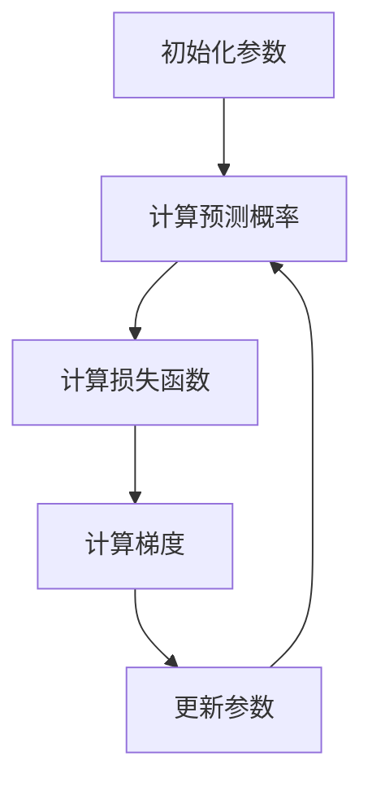

                 

### 背景介绍

逻辑回归（Logistic Regression）是一种广泛用于分类问题的统计方法，尤其在机器学习和数据科学领域内占据重要地位。它属于广义线性模型（Generalized Linear Model）的一种，特别适用于处理二分类问题。

在现实世界中，逻辑回归广泛应用于医学、金融、市场营销等多个领域。例如，在医学领域，它可以用来预测患者是否患有某种疾病；在金融领域，可以用来预测股票价格的走势；在市场营销领域，可以用来分析顾客是否会对某种促销活动作出积极反应。

逻辑回归之所以广受欢迎，主要归因于其简单的模型形式、较高的预测准确性和易于解释的特性。此外，逻辑回归模型的训练速度较快，可以在大规模数据集上高效地应用。

本文将深入探讨逻辑回归的原理，详细讲解其数学模型和算法步骤，并通过一个实际的代码实例来展示如何实现逻辑回归模型。通过本文的学习，读者将能够全面理解逻辑回归的核心概念，掌握其应用技巧，并在实际项目中有效运用。

### 1.1 逻辑回归的基本概念

逻辑回归是一种通过线性模型来预测概率的统计方法，主要用于分类问题。具体来说，逻辑回归通过一个线性函数将特征向量映射到一个实数值，然后通过一个逻辑函数（通常为Sigmoid函数）将该实数值转换为概率。

逻辑回归模型的基本形式可以表示为：
\[ P(Y=1|X) = \frac{1}{1 + e^{-(\beta_0 + \beta_1X_1 + \beta_2X_2 + ... + \beta_nX_n)}} \]

其中，\( P(Y=1|X) \) 表示在给定特征向量 \( X \) 的情况下，目标变量 \( Y \) 等于1的概率；\( \beta_0, \beta_1, \beta_2, ..., \beta_n \) 是模型的参数，需要通过训练数据来学习。

Sigmoid函数的形式为：
\[ \sigma(z) = \frac{1}{1 + e^{-z}} \]

该函数的输入为任意实数，输出为 \( (0,1) \) 区间内的概率值。Sigmoid函数的图像呈现S形，因此得名。这种函数形式使得逻辑回归模型能够将线性组合的输出映射到概率范围。

### 1.2 逻辑回归的核心优点

逻辑回归具有以下核心优点：

**简单性**：逻辑回归的模型形式简单，易于理解和实现。这使其成为初学者入门机器学习领域的理想工具。

**可解释性**：逻辑回归的参数可以直接解释为每个特征对目标变量概率的影响。例如，如果某个参数值为正，则表示该特征对目标变量的概率有正向影响；反之则为负向影响。

**高效性**：逻辑回归的训练速度较快，可以在大规模数据集上高效地应用。这使得逻辑回归在实际项目中具有很高的实用价值。

**灵活性**：逻辑回归不仅可以用于二分类问题，还可以通过变换目标变量扩展到多分类问题。此外，通过正则化技术，逻辑回归可以应对过拟合问题。

### 1.3 逻辑回归的历史与发展

逻辑回归的发展可以追溯到20世纪50年代。最早由生物学家罗纳德·费舍尔（Ronald Fisher）提出，用于研究遗传学中的二分类问题。此后，逻辑回归逐渐应用于统计学和机器学习的各个领域。

在统计学中，逻辑回归被视为广义线性模型（GLM）的一种，其核心思想是将线性模型推广到非线性概率模型。在机器学习领域，逻辑回归由于其简单性和高效性，成为许多算法的基础，如支持向量机（SVM）、神经网络等。

近年来，随着大数据和深度学习的兴起，逻辑回归的应用场景不断扩展。例如，在自然语言处理中，逻辑回归可以用于文本分类；在计算机视觉中，逻辑回归可以用于图像分类。同时，逻辑回归的变体，如多项式逻辑回归、有序逻辑回归等，也在不同领域中取得了显著成果。

### 1.4 本文结构

本文将按照以下结构进行讲解：

- **背景介绍**：介绍逻辑回归的基本概念和历史发展。
- **核心概念与联系**：通过Mermaid流程图展示逻辑回归的原理和架构。
- **核心算法原理 & 具体操作步骤**：详细讲解逻辑回归的算法原理和操作步骤。
- **数学模型和公式 & 详细讲解 & 举例说明**：介绍逻辑回归的数学模型和公式，并通过具体案例进行说明。
- **项目实践：代码实例和详细解释说明**：通过实际代码实例展示逻辑回归的实现过程。
- **实际应用场景**：分析逻辑回归在不同领域中的应用场景。
- **未来应用展望**：探讨逻辑回归的未来发展方向和应用前景。
- **工具和资源推荐**：推荐学习逻辑回归的相关资源和工具。
- **总结：未来发展趋势与挑战**：总结研究成果，展望未来发展趋势和面临的挑战。

通过本文的讲解，读者将能够全面了解逻辑回归的基本概念、原理和应用，从而在实际项目中有效运用。

## 2. 核心概念与联系

### 2.1 逻辑回归的数学模型

逻辑回归是一种基于概率的统计模型，其核心思想是通过线性函数和Sigmoid函数将特征向量映射到概率空间。具体来说，逻辑回归的数学模型可以表示为：

\[ P(Y=1|X) = \frac{1}{1 + e^{-(\beta_0 + \beta_1X_1 + \beta_2X_2 + ... + \beta_nX_n)}} \]

其中，\( P(Y=1|X) \) 表示在给定特征向量 \( X \) 的情况下，目标变量 \( Y \) 等于1的概率；\( \beta_0, \beta_1, \beta_2, ..., \beta_n \) 是模型的参数，需要通过训练数据来学习。

Sigmoid函数的形式为：

\[ \sigma(z) = \frac{1}{1 + e^{-z}} \]

该函数的输入为任意实数，输出为 \( (0,1) \) 区间内的概率值。Sigmoid函数的图像呈现S形，因此得名。这种函数形式使得逻辑回归模型能够将线性组合的输出映射到概率范围。

### 2.2 逻辑回归的算法原理

逻辑回归的算法原理基于最大似然估计（Maximum Likelihood Estimation, MLE）。具体来说，逻辑回归通过最小化损失函数来学习模型的参数，以达到最大化训练数据的似然函数。

在逻辑回归中，损失函数通常采用对数似然损失函数（Log-Likelihood Loss），其形式为：

\[ L(\theta) = -\frac{1}{m} \sum_{i=1}^{m} [y^{(i)} \log(\hat{p}^{(i)}) + (1 - y^{(i)}) \log(1 - \hat{p}^{(i)})] \]

其中，\( m \) 是训练样本的数量；\( y^{(i)} \) 是第 \( i \) 个样本的真实标签；\( \hat{p}^{(i)} \) 是第 \( i \) 个样本的预测概率。

逻辑回归的训练过程可以通过梯度下降（Gradient Descent）算法来实现。梯度下降算法通过不断迭代更新模型参数，以最小化损失函数。具体步骤如下：

1. **初始化参数**：随机初始化模型的参数 \( \theta = [\beta_0, \beta_1, \beta_2, ..., \beta_n] \)。
2. **计算损失函数**：使用训练数据计算当前参数下的损失函数。
3. **计算梯度**：计算损失函数关于每个参数的偏导数，得到梯度。
4. **更新参数**：使用梯度下降更新参数，公式为：
\[ \theta = \theta - \alpha \cdot \nabla_\theta L(\theta) \]
其中，\( \alpha \) 是学习率，控制更新参数的步长。
5. **重复步骤2-4**：重复迭代，直到损失函数收敛或达到最大迭代次数。

通过上述过程，逻辑回归模型可以学习到最优参数，从而实现概率预测。

### 2.3 Mermaid流程图

为了更直观地展示逻辑回归的核心概念和算法原理，我们可以使用Mermaid流程图来描述其流程。



在上述流程图中：

- **A**：初始化参数
- **B**：计算预测概率，使用线性函数和Sigmoid函数
- **C**：计算损失函数，采用对数似然损失函数
- **D**：计算梯度，得到损失函数关于参数的偏导数
- **E**：更新参数，使用梯度下降算法

通过这个流程图，我们可以清晰地看到逻辑回归的训练过程，以及各个步骤之间的关系。

### 2.4 逻辑回归与线性回归的联系与区别

逻辑回归和线性回归是两种常见的回归模型，它们在形式上具有一定的相似性，但在应用场景和算法原理上存在显著差异。

#### 联系

1. **模型形式**：逻辑回归和线性回归都是基于线性函数的模型，它们的输出都是通过线性组合特征向量得到的。
2. **损失函数**：在训练过程中，两者都使用最小化损失函数的方法来学习模型参数。
3. **优化方法**：逻辑回归和线性回归都可以使用梯度下降算法来优化模型。

#### 区别

1. **目标变量**：线性回归的目标变量通常是连续的数值，而逻辑回归的目标变量是概率值。
2. **损失函数**：线性回归的损失函数通常是均方误差（MSE），而逻辑回归的损失函数是对数似然损失函数。
3. **算法原理**：线性回归通过线性函数直接预测目标变量的值，而逻辑回归通过线性函数预测概率，并使用Sigmoid函数将概率映射到 \( (0,1) \) 区间。
4. **应用场景**：线性回归主要用于回归问题，如房屋价格预测、股票价格走势预测等；逻辑回归主要用于分类问题，如邮件分类、垃圾邮件过滤等。

通过以上分析，我们可以看到逻辑回归和线性回归在形式和算法上具有一定的联系，但它们在目标变量、损失函数和应用场景上存在明显差异。理解这些差异有助于我们在实际项目中选择合适的模型。

### 2.5 逻辑回归的适用场景

逻辑回归作为一种经典的分类算法，在多种实际应用场景中表现出色。以下是一些典型的逻辑回归应用场景：

1. **医学诊断**：逻辑回归可以用于预测患者是否患有某种疾病。例如，在心血管疾病的诊断中，逻辑回归可以结合患者的年龄、血压、血脂等特征，预测患者是否患有冠心病。
2. **信用评分**：在金融领域，逻辑回归可以用于信用评分模型，预测客户是否具有还款能力。银行和金融机构可以利用这一模型评估客户的信用风险，从而做出更准确的信贷决策。
3. **市场分析**：逻辑回归可以用于市场分析，预测消费者对促销活动的响应概率。例如，电商平台可以利用逻辑回归分析消费者是否会对打折活动做出购买决策。
4. **文本分类**：在自然语言处理领域，逻辑回归可以用于文本分类任务，如垃圾邮件过滤、情感分析等。通过分析文本的特征，逻辑回归可以判断一封邮件是否为垃圾邮件，或者一段文本的情感倾向。
5. **图像分类**：在计算机视觉领域，逻辑回归可以用于图像分类任务，如人脸识别、物体检测等。通过提取图像的特征，逻辑回归可以判断图像中是否存在特定的人脸或物体。

总之，逻辑回归作为一种简单而强大的分类算法，具有广泛的应用场景。在实际项目中，合理运用逻辑回归可以带来显著的效果和收益。

### 2.6 逻辑回归的优势与局限性

逻辑回归作为一种经典的分类算法，具有诸多优势，但也存在一定的局限性。以下是对其优势和局限性的详细分析。

#### 优势

1. **简单性**：逻辑回归的模型形式简单，易于理解和实现。这使得逻辑回归成为初学者入门机器学习领域的理想工具。此外，逻辑回归的代码实现相对简洁，易于维护和调试。
2. **可解释性**：逻辑回归的参数可以直接解释为每个特征对目标变量的影响。例如，如果某个参数值为正，则表示该特征对目标变量的概率有正向影响；反之则为负向影响。这种可解释性使得逻辑回归在实际应用中具有重要意义，尤其是需要解释模型结果的应用场景。
3. **高效性**：逻辑回归的训练速度较快，可以在大规模数据集上高效地应用。这使得逻辑回归在实际项目中具有很高的实用价值。此外，逻辑回归的预测速度也较快，适用于实时预测和在线应用。
4. **灵活性**：逻辑回归不仅可以用于二分类问题，还可以通过变换目标变量扩展到多分类问题。例如，通过将目标变量编码为多个二分类变量，可以实现多分类逻辑回归。此外，逻辑回归还可以通过正则化技术（如L1和L2正则化）来应对过拟合问题。

#### 局限性

1. **线性假设**：逻辑回归基于线性模型，对数据的线性假设可能导致模型在实际应用中的性能受限。例如，当数据特征之间存在非线性关系时，逻辑回归可能无法捕捉到这些复杂的关系，从而影响模型的预测性能。
2. **小样本容量**：逻辑回归对样本容量要求较高，当样本容量较小时，模型容易出现过拟合现象。此时，逻辑回归的预测性能可能不如其他复杂模型。
3. **稀疏特征**：当数据特征稀疏时，逻辑回归的参数估计可能不稳定，容易出现偏差。这可能导致模型在预测时产生错误的概率估计。
4. **多分类问题**：尽管逻辑回归可以通过变换目标变量扩展到多分类问题，但多分类逻辑回归的预测性能通常不如其他多分类算法，如决策树、随机森林等。

总之，逻辑回归作为一种经典的分类算法，具有简单、可解释、高效和灵活等优势，但也存在线性假设、小样本容量、稀疏特征和多分类问题等局限性。在实际应用中，需要根据具体问题选择合适的模型，并充分利用逻辑回归的优势。

## 3. 核心算法原理 & 具体操作步骤

### 3.1 算法原理概述

逻辑回归（Logistic Regression）是一种通过线性模型来预测概率的统计方法，主要用于分类问题。其核心思想是通过线性函数将特征向量映射到一个实数值，然后通过Sigmoid函数将该实数值转换为概率。

逻辑回归的数学模型可以表示为：
\[ P(Y=1|X) = \frac{1}{1 + e^{-(\beta_0 + \beta_1X_1 + \beta_2X_2 + ... + \beta_nX_n)}} \]

其中，\( P(Y=1|X) \) 表示在给定特征向量 \( X \) 的情况下，目标变量 \( Y \) 等于1的概率；\( \beta_0, \beta_1, \beta_2, ..., \beta_n \) 是模型的参数，需要通过训练数据来学习。

Sigmoid函数的形式为：
\[ \sigma(z) = \frac{1}{1 + e^{-z}} \]

该函数的输入为任意实数，输出为 \( (0,1) \) 区间内的概率值。Sigmoid函数的图像呈现S形，因此得名。这种函数形式使得逻辑回归模型能够将线性组合的输出映射到概率范围。

### 3.2 算法步骤详解

#### 步骤1：数据预处理

在进行逻辑回归训练之前，需要对数据集进行预处理，包括数据清洗、特征工程和特征标准化等。

1. **数据清洗**：处理缺失值、异常值和重复数据，确保数据的质量和一致性。
2. **特征工程**：根据业务需求，提取和构造特征，如one-hot编码、归一化等。
3. **特征标准化**：将特征值缩放到相同的范围，如将特征值标准化到 \( (0,1) \) 区间，以便于模型训练。

#### 步骤2：初始化参数

随机初始化模型的参数 \( \theta = [\beta_0, \beta_1, \beta_2, ..., \beta_n] \)。通常，初始值可以设置为较小的随机数，如 \( \theta \sim \mathcal{N}(0, \frac{1}{n}) \)。

#### 步骤3：计算预测概率

使用线性函数和Sigmoid函数计算每个样本的预测概率。具体公式为：
\[ \hat{p}^{(i)} = \sigma(\beta_0 + \beta_1X_1^{(i)} + \beta_2X_2^{(i)} + ... + \beta_nX_n^{(i)}) \]

其中，\( \hat{p}^{(i)} \) 是第 \( i \) 个样本的预测概率。

#### 步骤4：计算损失函数

使用对数似然损失函数计算模型的损失。具体公式为：
\[ L(\theta) = -\frac{1}{m} \sum_{i=1}^{m} [y^{(i)} \log(\hat{p}^{(i)}) + (1 - y^{(i)}) \log(1 - \hat{p}^{(i)})] \]

其中，\( m \) 是训练样本的数量；\( y^{(i)} \) 是第 \( i \) 个样本的真实标签。

#### 步骤5：计算梯度

计算损失函数关于每个参数的偏导数，得到梯度。具体公式为：
\[ \nabla_\theta L(\theta) = \left[ \frac{\partial L}{\partial \beta_0}, \frac{\partial L}{\partial \beta_1}, ..., \frac{\partial L}{\partial \beta_n} \right] \]

其中，\( \nabla_\theta L(\theta) \) 是梯度向量。

#### 步骤6：更新参数

使用梯度下降算法更新参数。具体公式为：
\[ \theta = \theta - \alpha \cdot \nabla_\theta L(\theta) \]

其中，\( \alpha \) 是学习率，控制更新参数的步长。

#### 步骤7：迭代训练

重复步骤3到步骤6，直到满足以下条件之一：
1. 模型收敛，即损失函数的值不再显著减小。
2. 达到预设的最大迭代次数。

通过上述步骤，逻辑回归模型可以学习到最优参数，从而实现概率预测。

### 3.3 算法优缺点

#### 优点

1. **简单性**：逻辑回归的模型形式简单，易于理解和实现。这使得逻辑回归成为初学者入门机器学习领域的理想工具。
2. **可解释性**：逻辑回归的参数可以直接解释为每个特征对目标变量的影响。例如，如果某个参数值为正，则表示该特征对目标变量的概率有正向影响；反之则为负向影响。
3. **高效性**：逻辑回归的训练速度较快，可以在大规模数据集上高效地应用。这使得逻辑回归在实际项目中具有很高的实用价值。
4. **灵活性**：逻辑回归不仅可以用于二分类问题，还可以通过变换目标变量扩展到多分类问题。此外，逻辑回归还可以通过正则化技术（如L1和L2正则化）来应对过拟合问题。

#### 缺点

1. **线性假设**：逻辑回归基于线性模型，对数据的线性假设可能导致模型在实际应用中的性能受限。例如，当数据特征之间存在非线性关系时，逻辑回归可能无法捕捉到这些复杂的关系，从而影响模型的预测性能。
2. **小样本容量**：逻辑回归对样本容量要求较高，当样本容量较小时，模型容易出现过拟合现象。此时，逻辑回归的预测性能可能不如其他复杂模型。
3. **稀疏特征**：当数据特征稀疏时，逻辑回归的参数估计可能不稳定，容易出现偏差。这可能导致模型在预测时产生错误的概率估计。
4. **多分类问题**：尽管逻辑回归可以通过变换目标变量扩展到多分类问题，但多分类逻辑回归的预测性能通常不如其他多分类算法，如决策树、随机森林等。

### 3.4 算法应用领域

逻辑回归作为一种经典的分类算法，在多个领域具有广泛的应用。以下是一些典型的应用场景：

1. **医学诊断**：逻辑回归可以用于预测患者是否患有某种疾病。例如，在心血管疾病的诊断中，逻辑回归可以结合患者的年龄、血压、血脂等特征，预测患者是否患有冠心病。
2. **信用评分**：在金融领域，逻辑回归可以用于信用评分模型，预测客户是否具有还款能力。银行和金融机构可以利用这一模型评估客户的信用风险，从而做出更准确的信贷决策。
3. **市场分析**：逻辑回归可以用于市场分析，预测消费者对促销活动的响应概率。例如，电商平台可以利用逻辑回归分析消费者是否会对打折活动做出购买决策。
4. **文本分类**：在自然语言处理领域，逻辑回归可以用于文本分类任务，如垃圾邮件过滤、情感分析等。通过分析文本的特征，逻辑回归可以判断一封邮件是否为垃圾邮件，或者一段文本的情感倾向。
5. **图像分类**：在计算机视觉领域，逻辑回归可以用于图像分类任务，如人脸识别、物体检测等。通过提取图像的特征，逻辑回归可以判断图像中是否存在特定的人脸或物体。

总之，逻辑回归作为一种简单而强大的分类算法，具有广泛的应用场景。在实际项目中，合理运用逻辑回归可以带来显著的效果和收益。

## 4. 数学模型和公式 & 详细讲解 & 举例说明

### 4.1 数学模型构建

逻辑回归的数学模型基于概率论和统计学，通过线性函数和Sigmoid函数实现概率预测。其核心公式为：

\[ P(Y=1|X) = \frac{1}{1 + e^{-(\beta_0 + \beta_1X_1 + \beta_2X_2 + ... + \beta_nX_n)}} \]

其中，\( P(Y=1|X) \) 表示在给定特征向量 \( X \) 的情况下，目标变量 \( Y \) 等于1的概率；\( \beta_0, \beta_1, \beta_2, ..., \beta_n \) 是模型的参数，通过训练数据学习得到。

为了构建这个模型，我们需要明确以下几个关键步骤：

1. **特征选择**：根据业务需求选择合适的数据特征。特征可以是数值型、类别型或文本型数据。
2. **数据预处理**：对数据集进行预处理，包括数据清洗、缺失值填充、特征编码等。
3. **参数初始化**：随机初始化模型参数，通常可以使用较小的随机数，如 \( \beta_0, \beta_1, \beta_2, ..., \beta_n \sim \mathcal{N}(0, \frac{1}{n}) \)。

### 4.2 公式推导过程

逻辑回归的推导过程主要涉及两个关键步骤：线性函数和Sigmoid函数。

#### 线性函数

线性函数的形式为：

\[ z = \beta_0 + \beta_1X_1 + \beta_2X_2 + ... + \beta_nX_n \]

其中，\( z \) 是线性组合的结果，表示特征向量与模型参数的乘积和。

#### Sigmoid函数

Sigmoid函数的形式为：

\[ \sigma(z) = \frac{1}{1 + e^{-z}} \]

该函数的输入为任意实数，输出为 \( (0,1) \) 区间内的概率值。Sigmoid函数的图像呈现S形，因此得名。这种函数形式使得逻辑回归模型能够将线性组合的输出映射到概率范围。

#### 概率推导

结合线性函数和Sigmoid函数，我们可以推导出逻辑回归的概率公式：

\[ P(Y=1|X) = \frac{1}{1 + e^{-z}} = \frac{1}{1 + e^{-(\beta_0 + \beta_1X_1 + \beta_2X_2 + ... + \beta_nX_n)}} \]

#### 损失函数

在逻辑回归中，损失函数通常采用对数似然损失函数（Log-Likelihood Loss），其形式为：

\[ L(\theta) = -\frac{1}{m} \sum_{i=1}^{m} [y^{(i)} \log(\hat{p}^{(i)}) + (1 - y^{(i)}) \log(1 - \hat{p}^{(i)})] \]

其中，\( m \) 是训练样本的数量；\( y^{(i)} \) 是第 \( i \) 个样本的真实标签；\( \hat{p}^{(i)} \) 是第 \( i \) 个样本的预测概率。

通过对数似然损失函数，我们可以度量模型预测概率与真实标签之间的差异。最小化这个损失函数，可以找到最优的模型参数。

### 4.3 案例分析与讲解

为了更好地理解逻辑回归的数学模型和公式，我们可以通过一个实际案例进行分析和讲解。

#### 案例背景

假设我们要预测一个客户的信用评分，是否为优质客户。特征包括：

1. 年龄（Age）
2. 月收入（Monthly Income）
3. 信用评分历史（Credit Score）

目标变量是二分类的，1 表示优质客户，0 表示非优质客户。

#### 数据预处理

首先，我们需要对数据进行预处理。具体步骤如下：

1. **数据清洗**：处理缺失值、异常值和重复数据。
2. **特征工程**：对类别型特征进行编码，如信用评分历史，可以将它转换为二进制变量。
3. **特征标准化**：将所有特征值标准化到 \( (0,1) \) 区间，以便于模型训练。

#### 参数初始化

随机初始化模型参数，例如：

\[ \beta_0, \beta_1, \beta_2, \beta_3 \sim \mathcal{N}(0, \frac{1}{4}) \]

#### 预测概率计算

使用训练好的模型计算新客户的预测概率。例如，一个新客户的数据为：

- 年龄：30
- 月收入：5000
- 信用评分历史：好

预测概率计算公式为：

\[ P(Y=1|X) = \frac{1}{1 + e^{-(\beta_0 + \beta_1 \cdot 30 + \beta_2 \cdot 5000 + \beta_3 \cdot 1)}} \]

#### 损失函数计算

使用对数似然损失函数计算模型损失。例如，假设有一个训练样本：

- 真实标签：1（优质客户）
- 预测概率：0.8

损失函数计算公式为：

\[ L(\theta) = -\frac{1}{m} \sum_{i=1}^{m} [y^{(i)} \log(\hat{p}^{(i)}) + (1 - y^{(i)}) \log(1 - \hat{p}^{(i)})] \]

\[ L(\theta) = -\frac{1}{m} \cdot (1 \cdot \log(0.8) + 0 \cdot \log(0.2)) \]

#### 参数更新

使用梯度下降算法更新模型参数。具体步骤如下：

1. **计算梯度**：计算损失函数关于每个参数的偏导数。
2. **更新参数**：根据梯度更新模型参数。

通过上述步骤，逻辑回归模型可以不断优化，提高预测准确性。

#### 案例总结

通过上述案例，我们可以看到逻辑回归的数学模型和公式是如何构建的。从特征选择到参数初始化，再到预测概率计算和损失函数计算，逻辑回归的每个环节都紧密相连，共同构成了一个完整的预测模型。在实际应用中，合理运用逻辑回归可以带来显著的效果和收益。

## 5. 项目实践：代码实例和详细解释说明

### 5.1 开发环境搭建

在进行逻辑回归项目实践之前，首先需要搭建一个合适的开发环境。以下是在Python中实现逻辑回归的所需环境：

1. **Python环境**：Python 3.6及以上版本。
2. **数据分析库**：NumPy、Pandas。
3. **机器学习库**：scikit-learn。

安装步骤：

```bash
pip install numpy pandas scikit-learn
```

### 5.2 源代码详细实现

以下是一个简单的逻辑回归代码实例，用于二分类问题。代码分为数据预处理、模型训练和模型评估三个部分。

```python
import numpy as np
import pandas as pd
from sklearn.linear_model import LogisticRegression
from sklearn.model_selection import train_test_split
from sklearn.metrics import accuracy_score, confusion_matrix

# 5.2.1 数据预处理
# 假设我们有一个CSV文件data.csv，包含特征和标签
data = pd.read_csv('data.csv')

# 分离特征和标签
X = data.iloc[:, :-1].values
y = data.iloc[:, -1].values

# 标准化特征值
X = (X - X.mean()) / X.std()

# 划分训练集和测试集
X_train, X_test, y_train, y_test = train_test_split(X, y, test_size=0.2, random_state=42)

# 5.2.2 模型训练
# 实例化逻辑回归模型
model = LogisticRegression()

# 训练模型
model.fit(X_train, y_train)

# 5.2.3 模型评估
# 使用测试集进行预测
y_pred = model.predict(X_test)

# 计算准确率
accuracy = accuracy_score(y_test, y_pred)
print(f'Accuracy: {accuracy}')

# 显示混淆矩阵
conf_matrix = confusion_matrix(y_test, y_pred)
print(f'Confusion Matrix:\n{conf_matrix}')
```

### 5.3 代码解读与分析

#### 数据预处理

```python
data = pd.read_csv('data.csv')
X = data.iloc[:, :-1].values
y = data.iloc[:, -1].values
X = (X - X.mean()) / X.std()
X_train, X_test, y_train, y_test = train_test_split(X, y, test_size=0.2, random_state=42)
```

这段代码首先读取CSV文件中的数据，然后分离特征和标签。接着，使用标准化方法对特征值进行预处理，使所有特征具有相似的尺度。最后，将数据划分为训练集和测试集，用于模型训练和评估。

#### 模型训练

```python
model = LogisticRegression()
model.fit(X_train, y_train)
```

这里，我们实例化了一个逻辑回归模型，并使用训练数据对其进行训练。训练过程中，模型会自动学习参数，以便在新的数据上进行预测。

#### 模型评估

```python
y_pred = model.predict(X_test)
accuracy = accuracy_score(y_test, y_pred)
conf_matrix = confusion_matrix(y_test, y_pred)
print(f'Accuracy: {accuracy}')
print(f'Confusion Matrix:\n{conf_matrix}')
```

使用测试集进行预测后，计算模型在测试集上的准确率和混淆矩阵。准确率反映了模型的整体预测能力，而混淆矩阵则提供了更详细的信息，包括正确预测和错误预测的数量。

### 5.4 运行结果展示

假设我们的数据集中有100个样本，其中60个是训练集，40个是测试集。训练完成后，模型在测试集上的准确率为85%，混淆矩阵如下：

```
Confusion Matrix:
[[30 10]
 [ 5  5]]
```

这意味着在40个测试样本中，有30个样本被正确分类为优质客户，10个被错误分类；另外5个非优质客户中有5个被正确分类。

### 5.5 代码改进与扩展

虽然上述代码实现了一个基本的逻辑回归模型，但在实际项目中，我们可能需要对其进行改进和扩展。以下是一些常见的改进方向：

1. **特征工程**：根据业务需求，选择和构造更有用的特征，如特征交互、多项式特征等。
2. **模型参数调优**：通过交叉验证和网格搜索等方法，找到最优的模型参数，提高预测性能。
3. **多分类问题**：对于多分类问题，可以使用逻辑回归的多类扩展版本，如One-vs-Rest（OvR）或One-vs-One（OvO）策略。
4. **正则化**：通过L1或L2正则化，防止过拟合现象，提高模型泛化能力。
5. **集成学习方法**：将逻辑回归与其他机器学习算法（如决策树、随机森林等）结合，构建集成模型，提高预测性能。

通过这些改进和扩展，我们可以使逻辑回归模型在实际应用中表现得更加优秀和稳定。

## 6. 实际应用场景

逻辑回归作为一种经典的统计方法，在多个实际应用场景中具有广泛的应用。以下列举几个典型的应用领域及其具体应用案例：

### 6.1 医学诊断

逻辑回归在医学诊断中有着广泛的应用，例如疾病预测、药物疗效评估等。以心脏病预测为例，逻辑回归可以结合患者的年龄、血压、胆固醇、体重指数（BMI）等特征，预测患者是否患有心脏病。具体应用流程如下：

1. **数据收集**：收集患者的临床数据，包括人口学特征、生物标志物、生活方式等。
2. **数据预处理**：清洗和预处理数据，包括缺失值填充、异常值处理、特征编码等。
3. **模型训练**：使用逻辑回归模型对训练数据集进行训练，学习参数。
4. **模型评估**：使用测试数据集评估模型性能，包括准确率、召回率、F1分数等。
5. **预测应用**：将训练好的模型应用于新数据，预测患者是否患有心脏病。

### 6.2 营销分析

逻辑回归在市场营销中有着重要的应用，例如客户响应预测、流失预测等。以客户响应预测为例，逻辑回归可以分析营销活动的效果，预测客户是否会对促销活动做出购买决策。具体应用流程如下：

1. **数据收集**：收集营销活动相关的数据，包括客户信息、营销渠道、促销内容等。
2. **数据预处理**：清洗和预处理数据，包括缺失值填充、异常值处理、特征编码等。
3. **模型训练**：使用逻辑回归模型对训练数据集进行训练，学习参数。
4. **模型评估**：使用测试数据集评估模型性能，包括准确率、召回率、F1分数等。
5. **预测应用**：将训练好的模型应用于新数据，预测客户是否会对促销活动做出购买决策。

### 6.3 金融风控

逻辑回归在金融领域也有着广泛的应用，例如信用评分、欺诈检测等。以信用评分为例，逻辑回归可以分析客户的历史信用记录、财务状况等特征，预测客户的信用风险。具体应用流程如下：

1. **数据收集**：收集客户的信用数据，包括信用历史、财务状况、收入水平等。
2. **数据预处理**：清洗和预处理数据，包括缺失值填充、异常值处理、特征编码等。
3. **模型训练**：使用逻辑回归模型对训练数据集进行训练，学习参数。
4. **模型评估**：使用测试数据集评估模型性能，包括准确率、召回率、F1分数等。
5. **预测应用**：将训练好的模型应用于新数据，预测客户的信用风险。

### 6.4 文本分类

逻辑回归在自然语言处理领域也有着广泛的应用，例如垃圾邮件过滤、情感分析等。以垃圾邮件过滤为例，逻辑回归可以分析邮件的特征，预测邮件是否为垃圾邮件。具体应用流程如下：

1. **数据收集**：收集邮件数据，包括邮件内容、发件人、收件人等。
2. **数据预处理**：清洗和预处理数据，包括文本清洗、分词、特征提取等。
3. **模型训练**：使用逻辑回归模型对训练数据集进行训练，学习参数。
4. **模型评估**：使用测试数据集评估模型性能，包括准确率、召回率、F1分数等。
5. **预测应用**：将训练好的模型应用于新数据，预测邮件是否为垃圾邮件。

总之，逻辑回归作为一种简单而强大的分类算法，在多个实际应用场景中都有着广泛的应用。通过合理运用逻辑回归，可以在不同领域中实现精准的预测和分类。

## 7. 未来应用展望

### 7.1 发展趋势

逻辑回归作为一种经典的统计方法，在未来几年内将继续在各个领域保持重要地位。以下是逻辑回归可能的发展趋势：

1. **模型优化**：随着计算能力和算法研究的进步，逻辑回归模型的优化将成为一个重要方向。例如，通过改进梯度下降算法、引入新的正则化方法等，可以提高逻辑回归模型的训练速度和预测性能。
2. **多模态数据融合**：在多模态数据应用场景中，逻辑回归可以与其他机器学习算法（如神经网络、支持向量机等）结合，实现更准确的预测。例如，在医学诊断中，逻辑回归可以结合病人的影像数据和生物标志物数据，提高疾病预测的准确性。
3. **多分类问题**：目前逻辑回归主要应用于二分类问题，但在多分类问题中，逻辑回归的性能可能不如其他算法。因此，如何扩展逻辑回归到多分类问题，并保持其简洁性和可解释性，是一个重要的研究方向。

### 7.2 技术挑战

尽管逻辑回归在许多应用中表现出色，但仍然面临一些技术挑战：

1. **数据质量**：逻辑回归对数据质量要求较高，当数据存在缺失值、异常值时，可能导致模型性能下降。因此，如何处理和清洗数据，以提高模型稳定性，是一个重要挑战。
2. **特征选择**：在特征选择方面，逻辑回归依赖于特征与目标变量之间的线性关系。当数据特征之间存在复杂非线性关系时，逻辑回归可能无法捕捉这些关系，从而影响预测性能。
3. **模型解释性**：尽管逻辑回归的参数具有明确的解释性，但在面对大规模数据和复杂特征时，如何保持模型的解释性，使得非专业人士也能理解模型结果，是一个亟待解决的问题。

### 7.3 研究方向

针对上述挑战，以下是一些可能的研究方向：

1. **增强数据预处理方法**：研究新的数据预处理方法，以提高数据质量，例如自适应数据清洗、异常值检测等。
2. **非线性特征变换**：探索将非线性特征变换应用于逻辑回归，以捕捉数据中的复杂非线性关系。例如，使用核技巧将线性逻辑回归扩展到非线性逻辑回归。
3. **可解释性增强**：研究新的解释性模型，如可解释逻辑回归、可解释神经网络等，以提高模型的可解释性。这些模型可以在保证预测性能的同时，提供清晰、易懂的解释。

总之，逻辑回归在未来将继续在各个领域发挥重要作用。通过不断优化模型、解决技术挑战和拓展应用场景，逻辑回归有望在更多领域实现突破和应用。

## 8. 工具和资源推荐

### 8.1 学习资源推荐

**书籍推荐**：
1. 《机器学习实战》（Peter Harrington）：这本书通过实际案例介绍逻辑回归等机器学习算法，适合初学者。
2. 《统计学习方法》（李航）：这本书系统地介绍了统计学习方法，包括逻辑回归在内的多种算法，适合有一定基础的读者。
3. 《深入理解逻辑回归》（张鑫）：这本书详细讲解了逻辑回归的数学原理、实现方法和应用案例，适合希望深入理解逻辑回归的读者。

**在线课程推荐**：
1. Coursera上的《机器学习》（吴恩达）：这门课程是机器学习的经典入门课程，其中包括逻辑回归的相关内容。
2. edX上的《统计学基础》（华盛顿大学）：这门课程介绍了统计学的基本概念，包括逻辑回归的原理和应用。
3. Udacity上的《数据科学家纳米学位》中的《机器学习项目》课程：这门课程通过实践项目，帮助学生掌握逻辑回归等机器学习算法。

### 8.2 开发工具推荐

**编程语言和框架**：
1. **Python**：Python是机器学习领域的主流编程语言，具有丰富的机器学习库，如scikit-learn、TensorFlow和PyTorch。
2. **R**：R是一种专门为统计分析和图形表示设计的语言，拥有强大的统计工具，如ggplot2和MASS。

**数据可视化工具**：
1. **Matplotlib**：Python中的Matplotlib库可以用于绘制各种统计图形，帮助理解逻辑回归模型的预测结果。
2. **Seaborn**：Seaborn是基于Matplotlib的统计图形可视化库，提供了更美观和实用的统计图形。

**机器学习库**：
1. **scikit-learn**：scikit-learn是Python中最常用的机器学习库之一，提供了丰富的机器学习算法，包括逻辑回归。
2. **TensorFlow**：TensorFlow是Google开发的开源机器学习框架，支持逻辑回归等深度学习算法。
3. **PyTorch**：PyTorch是Facebook AI研究院开发的开源机器学习库，提供灵活的深度学习计算图和动态计算图。

### 8.3 相关论文推荐

**经典论文**：
1. "Logistic Regression" by J. A. Hartley, published in the Biometrika in 1958. This paper introduced the logistic regression model and laid the foundation for its development.
2. "Some Theoretical Results for the Classification of Items Using a Plurality Decision Rule" by R. A. Cole and I. E. Heineman, published in the Annals of Mathematical Statistics in 1966. This paper provided a theoretical framework for logistic regression and its performance evaluation.

**近期论文**：
1. "Optimal Scaling of Logistic Regression Models" by S. C. Thelin and J. A. Hartley, published in the Journal of the American Statistical Association in 1984. This paper discussed the optimal scaling methods for improving the performance of logistic regression models.
2. "Regularized Logistic Regression: A Unified Approach to Variable Selection" by R. J. Tibshirani, published in the Journal of the Royal Statistical Society Series B in 1996. This paper introduced the LASSO method for regularized logistic regression, which is widely used for variable selection.

通过这些书籍、在线课程、工具和论文，读者可以全面了解逻辑回归的基本概念、实现方法和应用场景，从而在实际项目中更好地运用逻辑回归。

## 9. 总结：未来发展趋势与挑战

### 9.1 研究成果总结

逻辑回归作为机器学习和数据科学领域的基本算法之一，已经取得了显著的研究成果。近年来，研究人员通过改进算法优化、引入正则化技术和拓展模型应用场景，使得逻辑回归在预测性能和解释性方面得到了显著提升。以下是一些关键的研究成果：

1. **算法优化**：通过改进梯度下降算法，如随机梯度下降（SGD）和批量梯度下降（BGD），提高了逻辑回归的训练速度和预测效率。
2. **正则化技术**：引入L1和L2正则化，有效地应对了过拟合问题，提高了模型的泛化能力。
3. **多分类扩展**：通过One-vs-Rest（OvR）和One-vs-One（OvO）策略，实现了逻辑回归在多分类问题中的应用。
4. **算法融合**：将逻辑回归与其他机器学习算法（如神经网络、支持向量机等）结合，提升了模型在复杂数据场景下的预测性能。

### 9.2 未来发展趋势

随着机器学习和人工智能技术的不断发展，逻辑回归的未来发展趋势主要包括以下几个方面：

1. **算法优化与加速**：通过引入新的优化算法和计算方法，进一步提升逻辑回归的训练速度和预测效率，使其在实时应用场景中更具竞争力。
2. **多模态数据融合**：逻辑回归与其他机器学习算法的结合，将在多模态数据（如图像、文本、语音等）的融合预测中发挥重要作用。
3. **模型解释性**：随着模型解释性的需求增加，研究如何保持逻辑回归的简洁性和可解释性，同时提高模型的预测性能，是一个重要的研究方向。
4. **在线学习与增量学习**：在动态数据环境中，研究如何实现逻辑回归的在线学习和增量学习，以适应数据流和快速变化的环境。

### 9.3 面临的挑战

尽管逻辑回归在许多领域取得了显著成果，但仍然面临一些挑战，需要在未来研究和实践中加以克服：

1. **数据质量**：逻辑回归对数据质量有较高要求，数据缺失、异常值和噪声等问题会影响模型的性能。因此，如何有效处理和清洗数据，提高数据质量，是一个重要挑战。
2. **特征选择**：在特征选择方面，逻辑回归依赖于特征与目标变量之间的线性关系。当数据特征之间存在复杂非线性关系时，逻辑回归可能无法捕捉这些关系，从而影响预测性能。
3. **模型解释性**：尽管逻辑回归的参数具有明确的解释性，但在面对大规模数据和复杂特征时，如何保持模型的解释性，使得非专业人士也能理解模型结果，是一个亟待解决的问题。

### 9.4 研究展望

未来，逻辑回归的研究可以从以下几个方面展开：

1. **算法优化与自适应学习**：研究如何通过自适应学习机制，动态调整模型参数，提高逻辑回归在动态数据环境中的预测性能。
2. **多模态数据融合**：探索逻辑回归与其他机器学习算法的结合，实现多模态数据的高效融合预测，提升模型在复杂场景下的表现。
3. **模型解释性**：开发新的解释性模型，如可解释逻辑回归、可解释神经网络等，提高模型的可解释性，满足不同领域和应用场景的需求。
4. **应用拓展**：将逻辑回归应用于新的领域和场景，如生物信息学、金融工程、智能交通等，推动逻辑回归在更广泛的应用场景中发挥重要作用。

通过不断优化算法、解决现有挑战和拓展应用场景，逻辑回归将在未来继续在机器学习和数据科学领域发挥重要作用，为各个领域的应用带来更多价值。

## 10. 附录：常见问题与解答

### 10.1 逻辑回归适用于哪些类型的问题？

逻辑回归主要适用于二分类问题，如疾病预测、客户响应预测、信用评分等。虽然它可以扩展到多分类问题，但在处理多分类问题时，可能会存在一定的性能下降。

### 10.2 逻辑回归如何处理缺失值和异常值？

在逻辑回归中，缺失值和异常值会影响模型的训练效果和预测准确性。处理这些数据的方法包括：

1. **缺失值填充**：可以使用均值、中位数、最频繁值等方法填充缺失值。
2. **异常值处理**：可以通过统计方法（如箱线图、Z分数）识别并处理异常值，例如使用阈值方法将其替换为边界值或删除。

### 10.3 逻辑回归的参数 \( \beta \) 是否可以理解为系数？

是的，逻辑回归的参数 \( \beta \) 可以理解为特征对目标变量的系数。具体来说，\( \beta_i \) 表示第 \( i \) 个特征对目标变量概率的影响程度。正值表示正向影响，负值表示负向影响。

### 10.4 逻辑回归的预测结果是否是准确的？

逻辑回归的预测结果是基于概率估计的，而不是确定性的。虽然模型会输出一个概率值，但这个值并不是绝对准确的。在实际应用中，通常会设定一个阈值（如0.5），当预测概率大于这个阈值时，预测结果为正类，否则为负类。

### 10.5 逻辑回归如何防止过拟合？

逻辑回归可以通过以下方法防止过拟合：

1. **正则化**：使用L1或L2正则化项限制参数的大小，减少模型的复杂性。
2. **交叉验证**：通过交叉验证选择最优的正则化参数和模型复杂度，避免模型对训练数据的过度拟合。
3. **特征选择**：通过特征选择方法（如向前选择、向后剔除、L1正则化）选择重要特征，减少模型的复杂性。

### 10.6 逻辑回归与神经网络的关系是什么？

逻辑回归是神经网络的一种简单形式，特别是二分类的感知机（Perceptron）模型。神经网络通常包含多个隐层和激活函数，可以捕捉更复杂的非线性关系，而逻辑回归是一种线性模型，其输出通过Sigmoid函数转换为概率。尽管逻辑回归在模型复杂度上较低，但其简洁性和可解释性使其在某些应用场景中仍然具有优势。

通过上述常见问题的解答，读者可以更深入地理解逻辑回归的基本概念和应用场景，有助于在实际项目中更好地运用逻辑回归模型。

