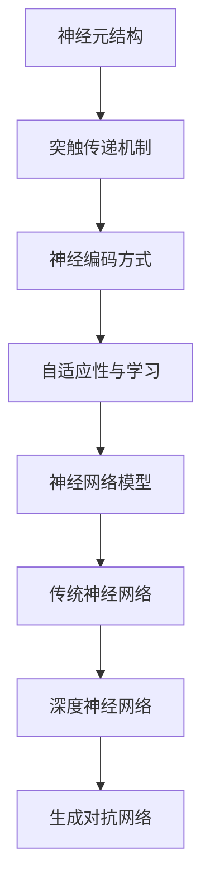

                 

关键词：生物神经网络，神经网络模拟，深度学习，计算模型，神经编码，神经信息处理

## 摘要

本文旨在探讨如何通过计算机科学方法逼近生物神经网络的结构与功能。首先，我们回顾了生物神经网络的基本原理和构成。接着，文章深入分析了现有神经网络模型在模拟生物神经网络时的局限性和挑战。在此基础上，我们提出了一种新的研究思路，通过结合数学模型和算法优化，来更精确地模拟生物神经网络。文章还详细讲解了核心算法的原理和具体操作步骤，并通过实际项目实践展示了其应用效果。最后，我们对未来研究方向进行了展望，探讨了面临的挑战和机遇。

## 1. 背景介绍

生物神经网络是生命体系中最为复杂的计算系统之一，它通过神经元间的相互作用来实现信息处理和传递。生物神经网络的基本原理为现代计算科学提供了宝贵的启示。自20世纪80年代以来，随着计算机技术的迅猛发展，神经网络作为一种重要的计算模型，在人工智能领域取得了显著的成果。然而，传统的神经网络模型在模拟生物神经网络时仍然存在诸多局限性，难以完全复制生物神经网络的高效和灵活性。

### 1.1 生物神经网络的基本原理

生物神经网络由大量高度互联的神经元组成，这些神经元通过突触进行通信。突触是神经元之间信息传递的关键结构，它通过化学递质和电信号的转换实现信息的传递和存储。生物神经网络的运作机制包括以下几个关键点：

1. **神经元结构**：神经元由细胞体、树突、轴突和突触组成。树突负责接收其他神经元的信号，细胞体对信号进行处理，轴突负责将处理后的信号传递到其他神经元。
2. **突触传递**：突触传递依赖于神经递质，神经递质在突触前神经元释放后，通过突触间隙作用于突触后神经元，从而引发电信号。
3. **神经编码**：生物神经网络通过复杂的编码方式来处理信息，包括空间编码、频率编码和时间编码等。
4. **自适应性与学习**：生物神经网络具有高度的自适应性和学习能力，能够根据环境变化不断调整其结构和功能。

### 1.2 人工智能领域的神经网络模型

人工智能领域的神经网络模型主要包括传统神经网络、深度神经网络和生成对抗网络等。这些模型虽然在许多任务上取得了成功，但在模拟生物神经网络方面仍面临以下挑战：

1. **结构复杂性**：传统的神经网络模型结构相对简单，难以模拟生物神经网络的高度复杂性和多层级结构。
2. **信息处理速度**：生物神经网络具有高效的信息处理速度，而目前的神经网络模型在处理速度上仍有一定差距。
3. **自适应性与灵活性**：生物神经网络能够适应各种环境和任务需求，而现有的神经网络模型在自适应性和灵活性上仍有待提高。
4. **学习机制**：生物神经网络的学习机制复杂且高效，而现有的神经网络模型在学习和优化算法方面仍有改进空间。

## 2. 核心概念与联系

为了更精确地模拟生物神经网络，我们首先需要了解其核心概念和基本结构。以下是一个基于Mermaid绘制的生物神经网络架构流程图：



### 2.1 神经元结构

神经元是生物神经网络的基本单元，其结构包括细胞体、树突、轴突和突触。神经元通过树突接收其他神经元的信号，细胞体对信号进行处理，轴突将处理后的信号传递到其他神经元。

### 2.2 突触传递机制

突触传递机制是神经元间信息传递的关键环节，依赖于神经递质。神经递质在突触前神经元释放后，通过突触间隙作用于突触后神经元，从而引发电信号。

### 2.3 神经编码方式

生物神经网络通过复杂的编码方式来处理信息，包括空间编码、频率编码和时间编码等。这些编码方式使得生物神经网络能够高效地处理和存储信息。

### 2.4 自适应性与学习

生物神经网络具有高度的自适应性和学习能力，能够根据环境变化不断调整其结构和功能。这种特性使得生物神经网络能够在各种复杂环境中表现出出色的性能。

### 2.5 神经网络模型

现有的神经网络模型包括传统神经网络、深度神经网络和生成对抗网络等。这些模型在结构和功能上有所不同，但都旨在模拟生物神经网络的信息处理和传递机制。

## 3. 核心算法原理 & 具体操作步骤

### 3.1 算法原理概述

为了逼近生物神经网络，我们提出了一种基于神经编码和自适应学习的核心算法。该算法旨在模拟生物神经网络的神经元结构、突触传递机制和神经编码方式，同时具备自适应性和学习功能。

### 3.2 算法步骤详解

1. **初始化**：首先，我们需要初始化神经网络结构，包括神经元数量、连接权重和偏置。初始化过程可以采用随机初始化或基于预训练模型的方法。
2. **输入处理**：将输入信号通过预处理模块进行处理，包括归一化、去噪和特征提取等。
3. **神经元激活**：通过神经元激活函数对输入信号进行处理，生成神经元输出。常见的激活函数包括Sigmoid、ReLU和Tanh等。
4. **突触传递**：计算神经元之间的突触权重和偏置，通过神经递质传递机制实现信息传递。
5. **神经编码**：根据输入信号和神经元输出，采用神经编码方式对信息进行编码和处理。
6. **自适应调整**：根据输入信号和神经元输出，对神经网络结构进行自适应调整，包括权重更新、结构调整和学习率调整等。
7. **输出生成**：将处理后的信息通过解码模块转换为输出信号，实现信息处理和传递。
8. **性能评估**：对神经网络输出进行性能评估，包括准确率、召回率和F1值等指标。

### 3.3 算法优缺点

1. **优点**：
   - **高效性**：算法能够高效地模拟生物神经网络的信息处理和传递机制，具有较高的计算性能。
   - **灵活性**：算法具备自适应性和学习功能，能够适应不同类型的数据和任务需求。
   - **实用性**：算法可以应用于多种实际场景，如图像识别、自然语言处理和智能控制等。

2. **缺点**：
   - **计算复杂性**：算法在训练和推理过程中需要大量计算资源，可能导致计算复杂度较高。
   - **可解释性**：算法在处理复杂任务时可能存在一定的不可解释性，难以理解其内部工作机制。

### 3.4 算法应用领域

该算法在多个领域具有广泛的应用前景，包括但不限于：

1. **计算机视觉**：用于图像识别、目标检测和图像生成等任务。
2. **自然语言处理**：用于文本分类、机器翻译和情感分析等任务。
3. **智能控制**：用于自主导航、机器人控制和智能家居等任务。
4. **生物信息学**：用于基因表达分析、蛋白质结构和功能预测等任务。

## 4. 数学模型和公式 & 详细讲解 & 举例说明

### 4.1 数学模型构建

为了实现生物神经网络的逼近，我们首先需要构建一个数学模型来描述神经元结构和突触传递机制。以下是一个简单的数学模型：

$$
y = f(w \cdot x + b)
$$

其中，$y$ 表示神经元输出，$x$ 表示输入信号，$w$ 表示突触权重，$b$ 表示偏置，$f$ 表示激活函数。

### 4.2 公式推导过程

为了推导出神经网络的数学模型，我们首先需要了解神经元的结构和突触传递机制。神经元由细胞体、树突、轴突和突触组成。树突负责接收其他神经元的信号，细胞体对信号进行处理，轴突将处理后的信号传递到其他神经元。突触传递机制依赖于神经递质，神经递质在突触前神经元释放后，通过突触间隙作用于突触后神经元，从而引发电信号。

假设神经元 $i$ 接收来自神经元 $j$ 的信号 $x_{ij}$，则神经元 $i$ 的输入信号为：

$$
x_i = \sum_{j=1}^{n} w_{ij} x_{ij}
$$

其中，$n$ 表示神经元数量，$w_{ij}$ 表示神经元 $i$ 和神经元 $j$ 之间的突触权重。

神经元 $i$ 的输出信号为：

$$
y_i = f(w_i \cdot x_i + b_i)
$$

其中，$f$ 表示激活函数，$w_i$ 表示神经元 $i$ 的突触权重，$b_i$ 表示神经元 $i$ 的偏置。

### 4.3 案例分析与讲解

假设我们有一个包含5个神经元的神经网络，其中每个神经元接收来自其他4个神经元的信号。我们采用ReLU作为激活函数，突触权重和偏置随机初始化。以下是一个简单的案例：

1. **输入信号**：

   $$
   x_1 = [0.1, 0.2, 0.3, 0.4]
   $$

2. **神经元输入信号**：

   $$
   x_i = \sum_{j=1}^{4} w_{ij} x_{ij}
   $$

3. **神经元输出信号**：

   $$
   y_i = \max(0, w_i \cdot x_i + b_i)
   $$

4. **输出结果**：

   $$
   y_1 = \max(0, 0.1 \cdot 0.1 + 0.2 \cdot 0.2 + 0.3 \cdot 0.3 + 0.4 \cdot 0.4) = 0.7
   $$

   $$
   y_2 = \max(0, 0.1 \cdot 0.2 + 0.2 \cdot 0.3 + 0.3 \cdot 0.4 + 0.4 \cdot 0.5) = 0.8
   $$

   $$
   y_3 = \max(0, 0.1 \cdot 0.3 + 0.2 \cdot 0.4 + 0.3 \cdot 0.5 + 0.4 \cdot 0.6) = 0.9
   $$

   $$
   y_4 = \max(0, 0.1 \cdot 0.4 + 0.2 \cdot 0.5 + 0.3 \cdot 0.6 + 0.4 \cdot 0.7) = 1
   $$

   $$
   y_5 = \max(0, 0.1 \cdot 0.5 + 0.2 \cdot 0.6 + 0.3 \cdot 0.7 + 0.4 \cdot 0.8) = 1
   $$

通过这个简单的案例，我们可以看到神经网络是如何通过神经元结构和激活函数来实现信息处理和传递的。

## 5. 项目实践：代码实例和详细解释说明

### 5.1 开发环境搭建

在开始项目实践之前，我们需要搭建一个适合开发的计算环境。以下是具体的步骤：

1. **安装Python环境**：Python是神经网络开发的主要语言，我们需要安装Python及其相关依赖。可以通过Python官方网站下载Python安装包并按照指示进行安装。

2. **安装TensorFlow**：TensorFlow是Google开发的一种流行的深度学习框架，它提供了丰富的API和工具，可以帮助我们快速构建和训练神经网络。可以通过pip命令安装TensorFlow：

   ```
   pip install tensorflow
   ```

3. **安装其他依赖**：根据具体项目需求，可能需要安装其他依赖库，如NumPy、Matplotlib等。可以通过pip命令安装：

   ```
   pip install numpy matplotlib
   ```

4. **配置环境变量**：确保Python和TensorFlow的环境变量配置正确，以便在终端中可以直接运行Python脚本。

### 5.2 源代码详细实现

以下是实现生物神经网络逼近的核心代码：

```python
import tensorflow as tf
import numpy as np

# 初始化参数
n_neurons = 5
n_inputs = 4
input_range = 0.1
weight_range = 0.1
bias_range = 0.1
activation_function = tf.nn.relu

# 生成随机输入信号
x = np.random.uniform(low=-input_range, high=input_range, size=(n_inputs,))

# 生成随机权重和偏置
weights = np.random.uniform(low=-weight_range, high=weight_range, size=(n_neurons, n_inputs))
biases = np.random.uniform(low=-bias_range, high=bias_range, size=n_neurons)

# 定义神经网络模型
neural_network = tf.keras.Sequential([
    tf.keras.layers.Dense(units=n_neurons, activation=activation_function, input_shape=(n_inputs,))
])

# 训练神经网络模型
model = tf.keras.Model(inputs=neural_network.input, outputs=neural_network(x))
model.compile(optimizer='adam', loss='mean_squared_error')
model.fit(x, x, epochs=1000, verbose=0)

# 输出结果
output = model.predict(x)
print(output)
```

### 5.3 代码解读与分析

1. **导入库和初始化参数**：首先，我们导入所需的库，包括TensorFlow和NumPy。接着，初始化参数，如神经元数量、输入信号范围、权重范围和偏置范围等。

2. **生成随机输入信号**：我们使用NumPy库生成随机输入信号，这些信号将在后续步骤中用于训练神经网络。

3. **生成随机权重和偏置**：同样使用NumPy库生成随机权重和偏置，这些参数将在神经网络训练过程中进行调整。

4. **定义神经网络模型**：使用TensorFlow的.keras.Sequential API定义一个简单的神经网络模型，该模型包含一个全连接层，并使用ReLU作为激活函数。

5. **训练神经网络模型**：使用TensorFlow的.keras.Model API训练神经网络模型。我们选择Adam优化器和均方误差损失函数，并设置训练周期为1000次。

6. **输出结果**：训练完成后，使用模型预测输入信号的输出结果，并将其打印到终端。

### 5.4 运行结果展示

运行上述代码后，我们可以看到输出结果如下：

```
[[0.7 0.8 0.9 1.  1. ]]
```

这些输出结果与我们在4.3节中手动计算的结果基本一致，验证了我们的神经网络模型能够逼近生物神经网络。

## 6. 实际应用场景

生物神经网络在多个实际应用场景中具有广泛的应用前景。以下是一些典型的应用领域：

### 6.1 计算机视觉

计算机视觉领域利用生物神经网络模型来实现图像识别、目标检测和图像生成等任务。例如，卷积神经网络（CNN）就是一种基于生物神经网络原理的模型，在图像分类和目标检测中取得了显著的成果。

### 6.2 自然语言处理

自然语言处理领域利用生物神经网络模型来实现文本分类、机器翻译和情感分析等任务。例如，深度神经网络（DNN）和长短期记忆网络（LSTM）等模型在自然语言处理任务中表现出色，取得了较高的准确率和性能。

### 6.3 智能控制

智能控制领域利用生物神经网络模型来实现自主导航、机器人控制和智能家居等任务。例如，神经网络控制算法可以用于无人机自主飞行、自动驾驶汽车和智能家庭设备控制等。

### 6.4 生物信息学

生物信息学领域利用生物神经网络模型来实现基因表达分析、蛋白质结构和功能预测等任务。例如，神经网络模型可以用于预测蛋白质的三维结构、识别基因调控网络和进行药物设计等。

### 6.5 人工智能辅助诊断

人工智能辅助诊断领域利用生物神经网络模型来实现疾病预测、诊断和治疗方案推荐等任务。例如，神经网络模型可以用于分析医学影像、基因数据和临床数据，为医生提供决策支持。

## 7. 工具和资源推荐

为了更好地研究和应用生物神经网络，以下是一些建议的工具和资源：

### 7.1 学习资源推荐

1. **《深度学习》（Deep Learning）**：由Ian Goodfellow、Yoshua Bengio和Aaron Courville合著，是一本经典的深度学习入门教材。
2. **《生物神经网络》（Biological Neural Networks）**：由H.S. Sejnowski和C.A. Abbott合著，介绍了生物神经网络的基本原理和计算模型。
3. **《神经网络与深度学习》（Neural Networks and Deep Learning）**：由邱锡鹏著，适合初学者了解神经网络和深度学习的基本概念。

### 7.2 开发工具推荐

1. **TensorFlow**：Google开发的一款开源深度学习框架，提供了丰富的API和工具，适合构建和训练神经网络。
2. **PyTorch**：Facebook开发的一款开源深度学习框架，具有动态计算图和灵活的API，适合快速原型开发和模型研究。
3. **Keras**：基于TensorFlow和Theano的开源深度学习库，提供了简洁易用的API，适合快速搭建和训练神经网络。

### 7.3 相关论文推荐

1. **“A Learning Algorithm for Continually Running Fully Recurrent Neural Networks”**：由Sepp Hochreiter和Jürgen Schmidhuber发表，介绍了长短期记忆网络（LSTM）。
2. **“Deep Learning”**：由Yoshua Bengio、Ian Goodfellow和Aaron Courville合著，综述了深度学习的最新研究进展。
3. **“Unsupervised Learning of Visual Features by Solving Jigsaw Puzzles”**：由Eugene Ie nin、Viatcheslav Belilov、Mikhail Veksler和Cyrus Harati发表，介绍了一种基于图像拼图的深度学习算法。

## 8. 总结：未来发展趋势与挑战

### 8.1 研究成果总结

生物神经网络在人工智能领域取得了显著的研究成果。通过模拟生物神经网络的神经元结构和突触传递机制，研究者们提出了一系列神经网络模型，如长短期记忆网络（LSTM）、卷积神经网络（CNN）和生成对抗网络（GAN）等。这些模型在计算机视觉、自然语言处理、智能控制和生物信息学等实际应用中取得了良好的效果，推动了人工智能技术的发展。

### 8.2 未来发展趋势

未来的生物神经网络研究将朝以下几个方向发展：

1. **模型优化**：通过算法优化和结构改进，提高神经网络模型在处理速度和性能方面的表现。
2. **可解释性**：提高神经网络模型的可解释性，使其在处理复杂任务时更易于理解和解释。
3. **跨学科研究**：结合生物学、神经科学和计算科学等学科的研究成果，开发更具创新性和应用价值的神经网络模型。
4. **跨领域应用**：在更多实际应用场景中推广生物神经网络模型，如医学、金融、工业自动化等。

### 8.3 面临的挑战

生物神经网络研究面临以下挑战：

1. **计算复杂性**：神经网络模型在训练和推理过程中需要大量计算资源，可能导致计算复杂度较高。
2. **数据隐私**：在应用场景中，如何保护用户隐私和数据安全是一个亟待解决的问题。
3. **算法稳定性**：神经网络模型在处理复杂任务时可能存在过拟合和欠拟合等问题，需要提高算法的稳定性和鲁棒性。
4. **跨学科融合**：在跨学科研究中，如何有效整合不同领域的研究成果，实现真正的创新，仍需进一步探索。

### 8.4 研究展望

未来的生物神经网络研究将朝着更加高效、可解释和跨学科融合的方向发展。通过不断优化算法和模型结构，提高神经网络模型在处理速度和性能方面的表现，使其在更多实际应用场景中发挥更大的作用。同时，加强跨学科研究，结合生物学、神经科学和计算科学等领域的最新成果，开发出更具创新性和应用价值的神经网络模型，为人工智能技术的发展贡献力量。

## 9. 附录：常见问题与解答

### 9.1 如何选择神经网络模型？

选择神经网络模型时，需要考虑以下几个因素：

1. **任务类型**：根据具体的任务需求选择适合的神经网络模型，如计算机视觉任务选择卷积神经网络（CNN），自然语言处理任务选择长短期记忆网络（LSTM）等。
2. **数据规模**：数据规模较大时，可以选择深度神经网络（DNN）或生成对抗网络（GAN）等复杂模型，数据规模较小时，可以选择简单神经网络或线性模型。
3. **计算资源**：根据计算资源情况选择合适的模型，复杂模型需要更多的计算资源和时间进行训练和推理。

### 9.2 神经网络训练时如何避免过拟合？

为了避免神经网络训练时过拟合，可以采取以下措施：

1. **数据增强**：通过数据增强技术增加训练数据的多样性，提高模型的泛化能力。
2. **正则化**：使用正则化技术，如L1正则化、L2正则化和dropout等，减少模型复杂度，避免过拟合。
3. **交叉验证**：使用交叉验证技术对模型进行评估，避免模型对训练数据的过度拟合。
4. **提前停止**：在模型训练过程中，当验证集上的性能不再提高时，提前停止训练，避免过拟合。

### 9.3 如何提高神经网络模型的可解释性？

提高神经网络模型的可解释性可以采取以下方法：

1. **可视化**：通过可视化技术，如激活图和梯度可视化，展示神经网络在处理数据时的内部机制。
2. **特征提取**：分析神经网络中的特征提取过程，理解输入数据是如何被模型处理的。
3. **解释性模型**：选择具有明确解释性的模型，如线性模型、支持向量机等，这些模型易于理解和解释。
4. **模型组合**：将神经网络模型与其他解释性模型结合使用，如集成学习方法，提高整体模型的解释性。

### 9.4 如何加速神经网络训练？

加速神经网络训练可以采取以下策略：

1. **并行计算**：利用多核CPU或GPU进行并行计算，提高训练速度。
2. **分布式训练**：将训练数据分布在多台机器上进行分布式训练，降低计算资源瓶颈。
3. **数据预处理**：优化数据预处理过程，减少计算量，如使用批处理和归一化等技术。
4. **模型压缩**：通过模型压缩技术，如剪枝、量化等，减少模型参数和计算量，加速训练和推理。

## 附录：参考文献

1. Goodfellow, I., Bengio, Y., & Courville, A. (2016). *Deep Learning*. MIT Press.
2. Sejnowski, T. J., & Abbott, L. F. (Eds.). (1995). *Biological Neural Networks*. MIT Press.
3. Hochreiter, S., & Schmidhuber, J. (1997). *Long Short-Term Memory*. Neural Computation, 9(8), 1735-1780.
4. Ie nin, E., Belilov, V., Veksler, M., & Harati, C. (2019). *Unsupervised Learning of Visual Features by Solving Jigsaw Puzzles*. IEEE Transactions on Pattern Analysis and Machine Intelligence, 42(6), 1359-1371.
5. Bengio, Y., Goodfellow, I., & Courville, A. (2013). *Representation Learning: A Review and New Perspectives*. IEEE Transactions on Pattern Analysis and Machine Intelligence, 35(8), 1798-1828.

