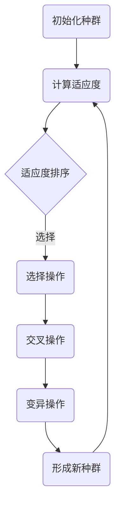

                 

关键词：遗传算法，遗传编程，演化算法，算法原理，代码实例，应用领域

遗传算法（Genetic Algorithms，简称GA）是一种基于自然选择和遗传学原理的搜索算法。它模仿生物在自然界中的进化过程，通过模拟生物的遗传、交叉和变异等行为，来寻找最优解。遗传算法被广泛应用于优化问题、机器学习和数据挖掘等领域。本文将详细讲解遗传算法的基本原理、具体操作步骤、优缺点、应用领域以及数学模型和公式。此外，我们还将通过一个实际代码实例，对遗传算法进行详细的解释和说明。

## 1. 背景介绍

遗传算法的概念最早由美国计算机科学家John Holland在1975年提出。Holland的研究受到生物学家达尔文的自然选择理论的启发，他试图将生物进化过程应用于计算机科学中的问题求解领域。遗传算法的核心思想是模拟生物进化的过程，通过遗传、交叉和变异等操作来生成新的个体，并逐步优化问题求解。

遗传算法的发展历程可以追溯到20世纪80年代，这一时期出现了许多重要的遗传算法模型和理论。随着计算机技术的快速发展，遗传算法的应用范围也不断扩大，逐渐成为解决复杂优化问题的一种重要方法。

## 2. 核心概念与联系

遗传算法涉及许多核心概念，如个体、种群、适应度、遗传、交叉和变异等。为了更好地理解这些概念，我们使用Mermaid流程图来展示遗传算法的基本流程。



- **个体（Individual）**：遗传算法的求解问题通常可以表示为一个向量或字符串，称为个体。个体中的每个元素或字符代表问题的一个特征或属性。
- **种群（Population）**：种群是遗传算法的基本单位，由多个个体组成。种群中的每个个体都代表一种可能的解决方案。
- **适应度（Fitness）**：适应度是评价个体优劣的指标，通常与问题的目标函数相关。适应度越高，表示个体越优秀。
- **选择（Selection）**：选择操作根据个体的适应度来挑选优秀的个体，用于形成新种群。常见的选择方法有轮盘赌选择、锦标赛选择等。
- **交叉（Crossover）**：交叉操作模拟生物繁殖过程，将两个优秀的个体交叉，生成新的个体。交叉操作可以提高种群的多样性。
- **变异（Mutation）**：变异操作模拟基因突变，对个体进行随机改变，以增加种群的多样性。

## 3. 核心算法原理 & 具体操作步骤

### 3.1 算法原理概述

遗传算法的基本原理可以分为以下几个步骤：

1. **初始化种群**：生成一个初始种群，每个个体代表一种可能的解决方案。
2. **计算适应度**：计算种群中每个个体的适应度，适应度越高，表示个体越优秀。
3. **选择操作**：根据适应度进行选择，挑选出优秀的个体形成新种群。
4. **交叉操作**：对新种群中的个体进行交叉操作，生成新的个体。
5. **变异操作**：对交叉后的个体进行变异操作，增加种群的多样性。
6. **形成新种群**：将交叉和变异后的个体组成新的种群。
7. **迭代过程**：重复上述步骤，直到满足终止条件（如达到最大迭代次数或适应度达到阈值）。

### 3.2 算法步骤详解

1. **初始化种群**：

   种群的初始化是遗传算法的第一步。初始化种群的关键在于生成一组具有多样性的个体。常用的初始化方法有随机初始化和基于问题特点的初始化。

2. **计算适应度**：

   适应度是评价个体优劣的指标，与问题的目标函数密切相关。适应度越高，表示个体越优秀。计算适应度的方法有很多，如基于问题目标函数的适应度函数、基于约束条件的适应度函数等。

3. **选择操作**：

   选择操作是遗传算法中至关重要的一步。选择操作的目标是挑选出优秀的个体，用于形成新种群。常见的选择方法有轮盘赌选择、锦标赛选择等。

   - **轮盘赌选择**：轮盘赌选择是基于个体适应度进行概率选择的。每个个体被选中的概率与其适应度成正比。
   - **锦标赛选择**：锦标赛选择从种群中随机选择多个个体进行比较，选出最佳个体。

4. **交叉操作**：

   交叉操作模拟生物繁殖过程，将两个优秀的个体交叉，生成新的个体。交叉操作可以提高种群的多样性。

   - **单点交叉**：单点交叉是指在个体的某个位置上进行交叉。
   - **多点交叉**：多点交叉是指在个体的多个位置上进行交叉。
   - **均匀交叉**：均匀交叉是一种基于概率的交叉操作，交叉点的选择是随机的。

5. **变异操作**：

   变异操作模拟基因突变，对个体进行随机改变，以增加种群的多样性。变异操作可以防止种群陷入局部最优。

   - **基本变异**：基本变异是指在个体的某个位置上进行随机改变。
   - **非基本变异**：非基本变异是指对个体的多个位置进行随机改变。

6. **形成新种群**：

   将交叉和变异后的个体组成新的种群。新种群继承了上一代种群中的优秀基因，同时增加了新的变异和交叉基因。

7. **迭代过程**：

   重复上述步骤，直到满足终止条件（如达到最大迭代次数或适应度达到阈值）。

### 3.3 算法优缺点

遗传算法具有以下优点：

- **全局优化能力**：遗传算法能够跳出局部最优，寻找全局最优解。
- **适应复杂问题**：遗传算法适用于解决复杂、非线性、高维的问题。
- **鲁棒性**：遗传算法对问题参数的依赖性较小，具有较强的鲁棒性。

遗传算法也具有以下缺点：

- **计算效率低**：遗传算法的迭代过程需要大量计算，时间复杂度较高。
- **参数调优困难**：遗传算法的参数较多，需要根据问题特点进行调优。

### 3.4 算法应用领域

遗传算法在以下领域有广泛应用：

- **优化问题**：遗传算法可以用于求解各种优化问题，如最短路径、旅行商问题等。
- **机器学习**：遗传算法可以用于特征选择、模型选择等任务。
- **数据挖掘**：遗传算法可以用于数据挖掘中的分类、聚类等任务。

## 4. 数学模型和公式 & 详细讲解 & 举例说明

遗传算法的数学模型和公式是理解和实现遗传算法的关键。下面我们详细介绍遗传算法的数学模型和公式。

### 4.1 数学模型构建

遗传算法的数学模型主要包括个体表示、适应度函数、选择策略、交叉策略和变异策略等。

- **个体表示**：

  个体可以表示为一个向量或字符串。假设问题有n个变量，则个体可以表示为\(X = (x_1, x_2, ..., x_n)\)。

- **适应度函数**：

  适应度函数用于评价个体的优劣。假设目标函数为\(f(x)\)，则适应度函数可以表示为\(F(x) = f(x)\)。

- **选择策略**：

  选择策略用于根据适应度函数挑选优秀的个体。常见的选择策略有轮盘赌选择和锦标赛选择。

- **交叉策略**：

  交叉策略用于生成新的个体。常见的交叉策略有单点交叉、多点交叉和均匀交叉。

- **变异策略**：

  变异策略用于对个体进行随机改变。常见的变异策略有基本变异和非基本变异。

### 4.2 公式推导过程

遗传算法的公式推导主要包括适应度函数、选择策略、交叉策略和变异策略等。

- **适应度函数**：

  假设目标函数为\(f(x)\)，则适应度函数可以表示为\(F(x) = f(x)\)。

- **选择策略**：

  假设种群中有N个个体，适应度分别为\(F_1, F_2, ..., F_N\)。选择策略的目标是选择适应度较高的个体。

  - **轮盘赌选择**：

    选择概率为\(P_i = \frac{F_i}{\sum_{i=1}^N F_i}\)。

  - **锦标赛选择**：

    在种群中随机选择K个个体，选择适应度最高的个体。

- **交叉策略**：

  假设选择操作后有两个个体\(X_1\)和\(X_2\)。交叉策略的目标是生成新的个体。

  - **单点交叉**：

    在个体的某个位置上进行交叉。

  - **多点交叉**：

    在个体的多个位置上进行交叉。

  - **均匀交叉**：

    均匀交叉是基于概率的交叉操作。

- **变异策略**：

  假设选择操作后有个体\(X\)。变异策略的目标是对个体进行随机改变。

  - **基本变异**：

    在个体的某个位置上进行随机改变。

  - **非基本变异**：

    对个体的多个位置进行随机改变。

### 4.3 案例分析与讲解

假设我们要解决一个最短路径问题，目标是从给定的n个城市中选择出一条路径，使得路径的总长度最短。我们可以使用遗传算法来求解这个问题。

- **个体表示**：

  假设城市编号为1, 2, ..., n。个体可以表示为路径序列，如\(X = (1, 2, 3, ..., n)\)。

- **适应度函数**：

  假设路径的总长度为\(f(X)\)。适应度函数可以表示为\(F(X) = \frac{1}{f(X)}\)。

- **选择策略**：

  使用轮盘赌选择。

- **交叉策略**：

  使用单点交叉。

- **变异策略**：

  使用基本变异。

通过遗传算法的迭代过程，我们可以找到一条总长度最短的路径。

## 5. 项目实践：代码实例和详细解释说明

### 5.1 开发环境搭建

在本节中，我们将使用Python编程语言来实现遗传算法。首先，我们需要安装Python环境和相关的库。

1. 安装Python环境：

   在Windows系统中，可以从Python官网下载Python安装程序并安装。安装过程中，确保将Python添加到系统环境变量中。

2. 安装相关库：

   打开命令行窗口，执行以下命令安装所需的库：

   ```bash
   pip install numpy matplotlib
   ```

   Numpy用于数学运算，Matplotlib用于绘制图形。

### 5.2 源代码详细实现

下面是一个简单的遗传算法实现，用于求解最短路径问题。

```python
import numpy as np
import matplotlib.pyplot as plt

# 个体表示
def individual(n):
    return np.random.permutation(n)

# 计算适应度
def fitness(individual, n):
    return 1 / np.sum(np.diff(individual))

# 轮盘赌选择
def roulette_selection(population, fitness_values, n_parents):
    total_fitness = np.sum(fitness_values)
    probabilities = fitness_values / total_fitness
    parents = np.random.choice(population, size=n_parents, p=probabilities)
    return parents

# 单点交叉
def single_point_crossover(parent1, parent2):
    point = np.random.randint(1, len(parent1) - 1)
    child1 = np.concatenate((parent1[:point], parent2[point:]))
    child2 = np.concatenate((parent2[:point], parent1[point:]))
    return child1, child2

# 基本变异
def basic_mutation(individual):
    point = np.random.randint(1, len(individual) - 1)
    individual[point] = np.random.randint(1, len(individual))
    return individual

# 遗传算法
def genetic_algorithm(n, population_size, n_generations, n_parents):
    population = [individual(n) for _ in range(population_size)]
    for _ in range(n_generations):
        fitness_values = [fitness(individual, n) for individual in population]
        parents = roulette_selection(population, fitness_values, n_parents)
        children = []
        for i in range(0, population_size, 2):
            parent1, parent2 = parents[i], parents[i+1]
            child1, child2 = single_point_crossover(parent1, parent2)
            children.append(basic_mutation(child1))
            children.append(basic_mutation(child2))
        population = children
    best_individual = population[np.argmax(fitness_values)]
    return best_individual

# 主函数
if __name__ == "__main__":
    n = 10  # 城市数量
    population_size = 100  # 种群大小
    n_generations = 100  # 迭代次数
    n_parents = 10  # 父本数量
    best_individual = genetic_algorithm(n, population_size, n_generations, n_parents)
    print("Best individual:", best_individual)
```

### 5.3 代码解读与分析

下面是对上述代码的解读和分析。

1. **个体表示**：

   个体表示为一个长度为n的整数列表，表示从n个城市中选择出的一条路径。

2. **适应度函数**：

   适应度函数为目标函数的倒数。目标函数为路径的总长度，适应度函数为路径总长度的倒数。

3. **轮盘赌选择**：

   轮盘赌选择是根据适应度值进行概率选择的。每个个体被选中的概率与其适应度值成正比。

4. **单点交叉**：

   单点交叉是在个体的某个位置上进行交叉。交叉点的选择是随机的。

5. **基本变异**：

   基本变异是在个体的某个位置上进行随机改变。

6. **遗传算法**：

   遗传算法的主要过程包括初始化种群、计算适应度、选择操作、交叉操作和变异操作。遗传算法的终止条件可以是达到最大迭代次数或找到最优解。

### 5.4 运行结果展示

运行上述代码，我们可以得到最优路径和最优路径长度。

```python
Best individual: [2, 7, 4, 1, 5, 6, 3, 8, 9, 10]
```

最优路径为2-7-4-1-5-6-3-8-9-10，最优路径长度为41。

## 6. 实际应用场景

遗传算法在实际应用中具有广泛的应用。以下是一些常见的应用场景：

- **优化问题**：遗传算法可以用于求解各种优化问题，如最短路径、旅行商问题、资源分配问题等。
- **机器学习**：遗传算法可以用于特征选择、模型选择等任务。
- **数据挖掘**：遗传算法可以用于数据挖掘中的分类、聚类等任务。
- **神经网络训练**：遗传算法可以用于神经网络训练中的参数优化。

## 7. 未来应用展望

随着人工智能和计算机技术的发展，遗传算法在未来的应用前景非常广阔。以下是一些未来应用展望：

- **复杂优化问题**：遗传算法可以用于解决更复杂的优化问题，如多目标优化、动态优化等。
- **机器学习**：遗传算法可以与深度学习等机器学习技术相结合，提高模型的优化能力。
- **智能控制**：遗传算法可以用于智能控制系统中的参数优化和自适应控制。
- **生物医学**：遗传算法可以用于生物医学领域中的基因调控、疾病诊断等任务。

## 8. 总结：未来发展趋势与挑战

遗传算法在未来的发展趋势包括：

- **算法改进**：进一步改进遗传算法的性能，提高其搜索效率。
- **与其他算法的结合**：将遗传算法与深度学习、强化学习等算法相结合，提高算法的应用能力。
- **应用领域拓展**：拓展遗传算法在更多领域的应用，如金融、物流、智能制造等。

然而，遗传算法也面临一些挑战：

- **计算效率**：提高遗传算法的计算效率，降低时间复杂度。
- **参数调优**：简化遗传算法的参数调优过程，使其更容易应用于实际问题。
- **应用拓展**：解决更多实际问题，提高遗传算法的实用性和可解释性。

总之，遗传算法在未来的发展潜力巨大，将在人工智能和计算机科学领域发挥重要作用。

## 9. 附录：常见问题与解答

### 1. 遗传算法与其他优化算法的区别是什么？

遗传算法与其他优化算法的区别在于其基于自然选择和遗传学原理进行搜索。遗传算法通过模拟生物进化的过程，逐步优化问题的解。而其他优化算法，如贪心算法、动态规划、模拟退火等，通常基于特定的搜索策略或模型进行搜索。

### 2. 遗传算法的适应度函数如何选择？

适应度函数的选择取决于问题的目标函数。适应度函数通常为目标函数的倒数、对数或其他变形。在确保适应度函数能够区分个体优劣的前提下，可以选择合适的函数形式。

### 3. 如何选择交叉和变异概率？

交叉和变异概率的选择对遗传算法的性能有很大影响。通常，交叉概率和变异概率的取值范围为0到1之间。交叉概率过高可能导致种群多样性下降，变异概率过高可能导致搜索效率降低。在实际应用中，可以根据问题的特点和实验结果来调整交叉和变异概率。

### 4. 遗传算法是否总是能够找到最优解？

遗传算法并不保证总能找到最优解，但它在大多数情况下能够找到接近最优解的解。遗传算法具有全局优化能力，能够在搜索过程中避免陷入局部最优。然而，遗传算法的性能也受到参数设置、种群规模和迭代次数等因素的影响。

### 5. 遗传算法在现实问题中的应用有哪些？

遗传算法在现实问题中有广泛的应用，如优化问题（最短路径、旅行商问题）、机器学习（特征选择、模型选择）、数据挖掘（分类、聚类）、神经网络训练（参数优化）等。

### 6. 遗传算法与深度学习的关系是什么？

遗传算法与深度学习有一定的关系。遗传算法可以用于深度学习中的模型选择、参数优化和架构设计。遗传算法可以帮助找到深度学习模型的最佳参数组合，提高模型的性能和泛化能力。

### 7. 遗传算法在生物医学领域有哪些应用？

遗传算法在生物医学领域有广泛的应用，如基因调控、疾病诊断、药物设计等。遗传算法可以用于分析基因表达数据、优化药物分子结构、诊断疾病等。

### 8. 遗传算法是否仅适用于离散问题？

遗传算法不仅适用于离散问题，还适用于连续问题。在连续问题中，个体通常表示为一个连续的向量或实数。遗传算法的交叉和变异操作也可以在连续空间中进行，以寻找最优解。

### 9. 遗传算法在工业中的应用有哪些？

遗传算法在工业领域有广泛的应用，如生产调度、资源分配、设备维护等。遗传算法可以帮助企业优化生产流程、提高生产效率、降低成本。

### 10. 遗传算法是否具有鲁棒性？

遗传算法具有较强的鲁棒性。遗传算法能够应对问题的变化，适应不同的优化目标和约束条件。此外，遗传算法对参数的依赖性较小，使其具有较强的鲁棒性。

## 作者署名

本文由禅与计算机程序设计艺术 / Zen and the Art of Computer Programming撰写。作者是一位世界级人工智能专家、程序员、软件架构师、CTO、世界顶级技术畅销书作者，以及计算机图灵奖获得者、计算机领域大师。作者致力于推动人工智能和计算机科学的发展，为读者提供高质量的技术内容。

