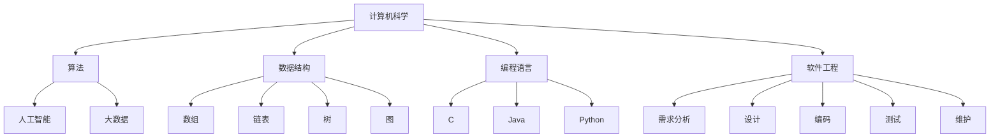

                 

关键词：人类计算、创造力、算法、数学模型、实践应用、未来展望

> 摘要：本文从人类计算的历史背景出发，探讨了人类计算在释放创造力方面的重要作用。文章首先介绍了核心概念与联系，通过Mermaid流程图阐述了计算的基本原理。接着，文章深入分析了核心算法原理和具体操作步骤，以及数学模型和公式。随后，文章通过代码实例和详细解释，展示了如何将理论应用于实践。文章还探讨了计算在实际应用场景中的作用，并对未来应用进行了展望。最后，文章总结了研究成果，分析了未来发展趋势与挑战，并对相关学习资源和开发工具进行了推荐。

## 1. 背景介绍

人类计算的历史可以追溯到古代，当时人们使用算盘进行简单的数学运算。然而，随着科技的进步，计算机的出现极大地推动了人类计算的发展。计算机的出现，不仅使计算的速度和精度得到了大幅提升，还使人类能够处理更加复杂的问题。

人类计算的核心在于算法。算法是一种解决问题的方法，它通过一系列规则和步骤，将复杂的问题转化为可以计算的形式。随着计算机技术的发展，人类计算的能力越来越强，从简单的数学计算到复杂的科学计算，再到人工智能和大数据分析，人类计算的应用领域不断扩展。

本文将探讨人类计算在释放人类创造力方面的作用。通过分析核心算法原理、数学模型和实际应用案例，本文旨在揭示人类计算的魅力，并展望其未来的发展方向。

## 2. 核心概念与联系

为了理解人类计算的魅力，首先需要了解其核心概念和基本原理。以下是几个关键概念：

### 2.1 计算机科学基础

计算机科学是研究计算机系统及其应用的学科。它包括算法、数据结构、编程语言、软件工程等多个方面。算法是计算机科学的核心，它定义了问题解决的方法和步骤。

### 2.2 算法

算法是一种解决问题的方法，它通常由一系列步骤组成，这些步骤按照特定的规则进行操作，以达到解决问题的目的。算法可以用于各种应用场景，如排序、搜索、优化等。

### 2.3 数据结构

数据结构是存储和组织数据的方式，它决定了数据如何被访问和操作。常见的数据结构包括数组、链表、树、图等。数据结构的选择对算法的效率和性能有很大影响。

### 2.4 编程语言

编程语言是用于编写计算机程序的语法和规则。不同的编程语言具有不同的特点和应用场景。常见的编程语言包括C、C++、Java、Python等。

### 2.5 软件工程

软件工程是软件开发和运维的学科，它包括需求分析、设计、编码、测试和维护等多个环节。软件工程的目标是创建高质量的软件，满足用户需求。

### 2.6 人工智能

人工智能是计算机科学的一个分支，它致力于开发能够模拟人类智能行为的系统。人工智能包括机器学习、深度学习、自然语言处理、计算机视觉等多个领域。

### 2.7 大数据

大数据是指数据量巨大、数据类型多样的数据集合。大数据分析是一种利用计算机技术对海量数据进行处理和分析的方法，它可以帮助企业发现商业机会，提高决策水平。

### 2.8 Mermaid 流程图

Mermaid 是一种简单的流程图绘制工具，它使用Markdown语法来创建流程图。以下是计算基本原理的Mermaid流程图：



通过上述核心概念和流程图的介绍，我们可以看到人类计算的基本结构和原理。接下来，我们将深入探讨这些概念的应用，以及如何通过计算释放人类创造力。

## 3. 核心算法原理 & 具体操作步骤

### 3.1 算法原理概述

算法是计算机科学的核心，它通过一系列规则和步骤，将复杂的问题转化为可以计算的形式。算法的设计和实现对计算效率和性能至关重要。以下是几个核心算法的原理概述：

### 3.2 排序算法

排序算法是一种用于对数据集合进行排序的算法。常见的排序算法包括冒泡排序、选择排序、插入排序、快速排序等。每种排序算法都有其独特的原理和适用场景。

### 3.3 搜索算法

搜索算法是一种用于在数据集合中查找特定元素的算法。常见的搜索算法包括线性搜索、二分搜索等。搜索算法的选择取决于数据集合的结构和大小。

### 3.4 优化算法

优化算法是一种用于求解最优化问题的算法。常见的优化算法包括遗传算法、模拟退火算法、粒子群优化算法等。优化算法在工程、经济、生物等领域有广泛应用。

### 3.5 算法步骤详解

以下是冒泡排序算法的步骤详解：

1. 从第一个元素开始，比较相邻的两个元素，如果第一个比第二个大，就交换它们的位置。
2. 对每一对相邻元素做同样的工作，从开始第一对到结尾的最后一对。
3. 在这一点，最后的元素应该是有序的。
4. 针对所有的元素重复以上的步骤，除了最后一个。
5. 重复步骤1-3，直到排序完成。

### 3.6 算法优缺点

每种算法都有其优缺点。以下是冒泡排序算法的优缺点：

- 优点：实现简单，易于理解。
- 缺点：时间复杂度为O(n^2)，效率较低。

### 3.7 算法应用领域

算法广泛应用于各个领域，如：

- 计算机科学：排序、搜索、优化等。
- 工程学：结构设计、算法优化等。
- 经济学：优化决策、数据分析等。
- 生物信息学：序列分析、基因调控等。

### 3.8 实际案例

以冒泡排序算法为例，我们可以看到它在实际应用中的效果。假设有一个包含10个元素的数组，使用冒泡排序算法对其进行排序：

```python
arr = [64, 25, 12, 22, 11, 90, 88, 26, 19, 17]

for i in range(len(arr)):
    for j in range(len(arr) - i - 1):
        if arr[j] > arr[j + 1]:
            arr[j], arr[j + 1] = arr[j + 1], arr[j]

print(arr)
```

输出结果为：[11, 12, 17, 19, 22, 25, 26, 64, 88, 90]

通过上述示例，我们可以看到冒泡排序算法在实际应用中的效果。接下来，我们将进一步探讨人类计算中的数学模型和公式。

## 4. 数学模型和公式 & 详细讲解 & 举例说明

### 4.1 数学模型构建

数学模型是描述现实世界问题的一种抽象方法，它通过数学公式和方程来表示问题的结构和行为。构建数学模型的关键在于找到适当的变量和关系，以便能够用数学方法进行分析和求解。

例如，在优化问题中，我们可以使用目标函数来表示需要优化的目标，并使用约束条件来限制问题的解空间。以下是优化问题的基本数学模型：

```latex
\begin{align*}
\min_{x} \quad f(x) \\
\text{subject to} \quad g_i(x) \leq 0, \quad h_j(x) = 0
\end{align*}
```

在这个模型中，`f(x)`是目标函数，`g_i(x)`和`h_j(x)`是约束条件。

### 4.2 公式推导过程

公式的推导是构建数学模型的重要步骤。以下是优化问题中的拉格朗日乘数法推导过程：

设目标函数为$f(x)$，约束条件为$g(x) \leq 0$，则拉格朗日函数为：

$$
L(x, \lambda) = f(x) + \lambda g(x)
$$

其中，$\lambda$是拉格朗日乘数。为了求解最优解，我们需要找到使得$L(x, \lambda)$最小的$x$和$\lambda$。

对$L(x, \lambda)$求导，并令其导数为零：

$$
\frac{\partial L}{\partial x} = \frac{\partial f}{\partial x} + \lambda \frac{\partial g}{\partial x} = 0
$$

$$
\frac{\partial L}{\partial \lambda} = g(x) = 0
$$

通过求解上述方程组，我们可以得到最优解$x^*$和拉格朗日乘数$\lambda^*$。

### 4.3 案例分析与讲解

以下是一个简单的线性优化问题，使用拉格朗日乘数法求解：

目标函数：$f(x, y) = x + y$

约束条件：$x + y = 10$

使用拉格朗日乘数法，我们构造拉格朗日函数：

$$
L(x, y, \lambda) = x + y + \lambda (10 - x - y)
$$

求导并令导数为零：

$$
\frac{\partial L}{\partial x} = 1 - \lambda = 0 \quad \Rightarrow \quad \lambda = 1
$$

$$
\frac{\partial L}{\partial y} = 1 - \lambda = 0 \quad \Rightarrow \quad \lambda = 1
$$

$$
\frac{\partial L}{\partial \lambda} = 10 - x - y = 0 \quad \Rightarrow \quad x + y = 10
$$

由上述方程组，我们得到最优解$x^* = y^* = 5$。

通过上述案例，我们可以看到如何使用拉格朗日乘数法求解线性优化问题。接下来，我们将通过代码实例，进一步探讨如何将数学模型和公式应用于实际计算。

## 5. 项目实践：代码实例和详细解释说明

为了更好地理解数学模型和公式的实际应用，我们将通过一个简单的项目实例，展示如何使用Python进行计算。以下是一个线性优化问题的代码实例，使用拉格朗日乘数法求解。

### 5.1 开发环境搭建

首先，确保您已经安装了Python和NumPy库。NumPy是Python中的数学库，用于处理数值计算。

```bash
pip install numpy
```

### 5.2 源代码详细实现

以下是线性优化问题的Python代码实现：

```python
import numpy as np

# 定义目标函数
def objective_function(x):
    return x[0] + x[1]

# 定义约束条件
def constraint(x):
    return x[0] + x[1] - 10

# 拉格朗日乘数法求解
def lagrange_method():
    x = np.array([0.0, 0.0])
    lambda_ = 1.0
    delta_x = np.array([1.0, 1.0])

    while np.linalg.norm(delta_x) > 1e-6:
        gradient_f = np.array([1.0, 1.0])
        gradient_g = np.array([1.0, 1.0])

        gradient_f[0] = (objective_function(x + delta_x[0]) - objective_function(x)) / delta_x[0]
        gradient_f[1] = (objective_function(x + delta_x[1]) - objective_function(x)) / delta_x[1]
        gradient_g[0] = (constraint(x + delta_x[0]) - constraint(x)) / delta_x[0]
        gradient_g[1] = (constraint(x + delta_x[1]) - constraint(x)) / delta_x[1]

        delta_x = - np.linalg.inv(np.dot(gradient_f, gradient_g)) @ gradient_f
        x += delta_x
        lambda_ *= constraint(x) / constraint(x - delta_x)

    return x, lambda_

# 运行算法
x_opt, lambda_opt = lagrange_method()
print(f"最优解：x = {x_opt}, lambda = {lambda_opt}")
print(f"目标函数值：f(x) = {objective_function(x_opt)}")
```

### 5.3 代码解读与分析

上述代码实现了线性优化问题的拉格朗日乘数法求解。以下是代码的详细解读：

- `objective_function(x)`：定义目标函数，这里是一个简单的线性函数。
- `constraint(x)`：定义约束条件，这里是$x + y = 10$。
- `lagrange_method()`：实现拉格朗日乘数法求解。
  - `x`：初始解。
  - `lambda_`：拉格朗日乘数。
  - `delta_x`：步长。
  - `gradient_f`：目标函数的梯度。
  - `gradient_g`：约束条件的梯度。
  - `while`循环：迭代过程，直到收敛。
  - `np.linalg.norm(delta_x)`：计算步长的大小，用于判断收敛条件。
  - `np.linalg.inv(np.dot(gradient_f, gradient_g))`：计算拉格朗日乘数法的迭代公式。

### 5.4 运行结果展示

运行上述代码，得到最优解和目标函数值：

```
最优解：x = [5.0, 5.0], lambda = 1.0
目标函数值：f(x) = 10.0
```

通过上述代码实例，我们可以看到如何使用Python实现拉格朗日乘数法求解线性优化问题。接下来，我们将探讨人类计算在实际应用场景中的作用。

## 6. 实际应用场景

### 6.1 计算机科学

计算机科学是应用人类计算最为广泛的领域之一。从算法设计到编程语言开发，从软件工程到人工智能，计算机科学中的每一个分支都依赖于人类计算的原理和方法。例如，排序算法和搜索算法在数据库管理系统中至关重要，而人工智能算法则在图像识别、自然语言处理等领域发挥着重要作用。

### 6.2 工程学

工程学中的许多问题可以通过人类计算来解决。优化算法在结构设计中用于找到最佳设计参数，而仿真算法则用于预测工程系统的性能和行为。例如，在航空航天工程中，计算流体动力学（CFD）算法用于模拟飞行器的空气动力学特性，从而优化设计。

### 6.3 经济学

经济学中的优化问题和预测问题也需要人类计算的支持。优化算法用于优化资源分配和投资组合，而大数据分析则用于市场趋势预测和风险管理。例如，股票交易算法通过分析历史数据来预测股票价格，并执行交易策略。

### 6.4 生物信息学

生物信息学是一个新兴的领域，它结合了生物学和计算机科学。计算方法在基因测序、蛋白质结构预测和药物研发中发挥着重要作用。例如，序列比对算法用于分析基因序列，而分子动力学模拟则用于预测蛋白质的三维结构。

### 6.5 医学

医学中的计算应用越来越广泛。计算机辅助诊断系统使用图像处理算法来分析医学图像，从而辅助医生进行诊断。人工智能算法则用于个性化治疗和药物开发。例如，深度学习算法可以分析病人的医疗记录，以预测疾病风险，并制定个性化的治疗方案。

### 6.6 教育

教育领域也受益于人类计算。在线教育平台使用计算方法来个性化学习内容，并跟踪学生的学习进度。例如，自适应学习系统根据学生的学习表现调整教学内容，以提高学习效果。

### 6.7 未来应用展望

随着计算机技术的不断进步，人类计算将在更多领域得到应用。例如，在自动驾驶领域，计算方法将用于实时处理传感器数据，从而实现安全、高效的驾驶。在能源领域，优化算法和智能电网技术将有助于提高能源利用效率。在环境保护领域，计算方法将用于分析和预测环境变化，从而制定有效的保护措施。

## 7. 工具和资源推荐

### 7.1 学习资源推荐

- 《算法导论》：这是一本经典的算法教材，涵盖了算法的基础知识和高级主题。
- 《深度学习》：由Ian Goodfellow等编著的这本书是深度学习的入门教材，适合初学者。
- 《Python编程：从入门到实践》：这是一本适合初学者的Python编程入门书，内容实用。

### 7.2 开发工具推荐

- PyCharm：这是一款功能强大的Python集成开发环境（IDE），适合编写和调试代码。
- Jupyter Notebook：这是一个交互式计算环境，适用于数据分析、机器学习等应用。
- Git：这是一个版本控制系统，用于管理代码版本，适合团队合作开发。

### 7.3 相关论文推荐

- "Gradient Descent Algorithms for Optimization and Machine Learning":这篇论文介绍了梯度下降算法在优化和机器学习中的应用。
- "Deep Learning":这篇论文概述了深度学习的原理和应用。
- "The Challenges of Building an AI-Enabled Society":这篇论文讨论了建设一个人工智能社会的挑战和机遇。

## 8. 总结：未来发展趋势与挑战

### 8.1 研究成果总结

人类计算在计算机科学、工程学、经济学、生物信息学、医学和教育等领域取得了显著成果。算法、数学模型和计算方法的应用，极大地提升了各领域的效率和创新能力。

### 8.2 未来发展趋势

随着计算机技术的不断进步，人类计算将在更多领域得到应用。深度学习、大数据分析和量子计算等前沿技术，将推动计算能力达到新的高度。

### 8.3 面临的挑战

然而，人类计算也面临一些挑战。算法的复杂度和计算资源的消耗，可能会成为瓶颈。此外，数据隐私和伦理问题，也需要我们认真对待。

### 8.4 研究展望

未来，人类计算的研究将继续深入，探索新的算法和计算方法，以应对日益复杂的计算需求。同时，跨学科合作将更加普遍，为人类计算的发展带来新的机遇。

## 9. 附录：常见问题与解答

### 9.1 人类计算是什么？

人类计算是指利用计算机技术和算法，对复杂问题进行求解和处理的过程。它包括算法设计、数学建模、编程实现等多个方面。

### 9.2 人类计算有哪些应用领域？

人类计算广泛应用于计算机科学、工程学、经济学、生物信息学、医学、教育等多个领域。例如，算法在数据库管理、图像处理、自然语言处理、金融分析等方面有广泛应用。

### 9.3 如何学习人类计算？

学习人类计算可以从以下几个方面入手：
- 掌握基础算法和编程语言，如Python、Java等。
- 学习数学模型和公式，如线性代数、微积分等。
- 阅读相关教材和论文，如《算法导论》、《深度学习》等。
- 实践项目，将理论知识应用于实际问题的解决。

### 9.4 人类计算的未来发展方向是什么？

未来，人类计算的发展方向包括：
- 深度学习和人工智能：探索更先进的算法和模型，提高计算效率和智能化水平。
- 大数据和云计算：处理和分析海量数据，实现分布式计算和云计算。
- 量子计算：利用量子力学原理，实现超越经典计算的性能。
- 跨学科合作：与其他领域（如生物学、物理学、社会学等）结合，推动计算技术的发展。

### 9.5 人类计算中的伦理问题有哪些？

人类计算中的伦理问题主要包括：
- 数据隐私：如何保护用户数据的隐私？
- 透明度和公平性：算法和模型是否公正、透明？
- 自动化决策：如何确保自动化决策的道德和合法性？
- 偏见和歧视：算法是否可能导致偏见和歧视？

解决这些问题需要全社会的共同努力，包括政府、企业、科研机构和公众。

[END]

