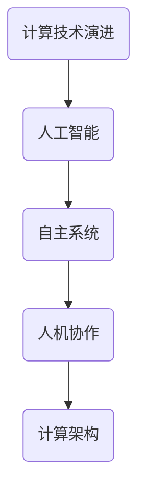

                 

关键词：计算进化、人类智能、AI、自主系统、计算架构、技术创新、人机协作

> 摘要：本文旨在探讨计算技术的未来发展，如何超越传统的任务完成，重新定义人类计算的意义。我们将分析计算进化的趋势，探讨人工智能（AI）与人类智能的协同发展，以及如何构建更为先进的计算架构，以推动人类智能的进一步提升。通过讨论数学模型、算法原理、项目实践和实际应用场景，本文将为读者展示一个全新的计算世界，并提出对未来的展望。

## 1. 背景介绍

### 计算技术的演进

计算技术的演进是人类文明进步的重要推动力。从古代的算盘、机械计算器到电子计算机，再到如今的人工智能，计算技术不断突破自我，实现质的飞跃。每一次技术的变革，都极大地提高了人类处理信息和知识的能力，推动了社会的发展和变革。

### 人类计算的传统观念

长期以来，人类计算主要集中在如何高效地完成特定任务。无论是数据分析、图像处理，还是自然语言处理，我们都在寻求最优的算法和计算模型，以期提高任务的完成效率。然而，这种传统的计算观念似乎已经无法满足新时代的需求。

### 新的计算观念

在人工智能、大数据和云计算的推动下，计算技术正在发生深刻的变革。人们开始重新思考计算的意义，不再局限于任务的完成，而是追求智能、自主和协同。这种新的计算观念，为我们提供了一种全新的视角，重新定义了人类计算的目标。

## 2. 核心概念与联系

### 人工智能（AI）

人工智能是计算技术发展的重要方向。它通过模拟人类智能，实现机器在感知、学习、推理和决策等方面的能力。人工智能的核心目标是使计算机能够像人类一样思考和行动。

### 自主系统

自主系统是指具有自我决策和执行能力的计算系统。它们能够在不确定和复杂的环境中自主运行，无需人工干预。自主系统的发展，使得计算技术从被动响应转变为主动行动，极大地扩展了计算的应用范围。

### 人机协作

人机协作是指人类与计算机系统共同完成任务的协同过程。在这种模式中，人类和计算机系统各自发挥优势，相互补充，实现更高效、更智能的任务完成。

### 计算架构

计算架构是指支撑计算系统的硬件和软件结构。随着计算技术的发展，计算架构也在不断演进。从传统的冯诺伊曼架构到异构计算架构，再到量子计算架构，计算架构的创新为计算技术的进步提供了坚实的基础。

### Mermaid 流程图



## 3. 核心算法原理 & 具体操作步骤

### 3.1 算法原理概述

核心算法是指实现人工智能、自主系统和人机协作等核心功能的计算算法。这些算法通常涉及复杂的数学模型和计算过程，具有高度的专业性。

### 3.2 算法步骤详解

算法步骤包括以下主要环节：

1. 数据预处理：对输入数据进行清洗、归一化等预处理操作，以提高算法的性能。
2. 模型训练：利用大量数据进行模型训练，通过优化算法参数，提高模型的准确性和泛化能力。
3. 模型评估：对训练完成的模型进行评估，包括准确性、召回率、F1值等指标。
4. 模型应用：将训练完成的模型应用到实际问题中，实现智能决策、自主控制和人机协作等功能。

### 3.3 算法优缺点

算法优缺点分析如下：

- 优点：核心算法具有高效性、准确性和泛化能力，能够实现智能、自主和人机协作等功能。
- 缺点：核心算法通常涉及复杂的数学模型和计算过程，对计算资源和时间要求较高。

### 3.4 算法应用领域

核心算法在多个领域具有广泛的应用，包括：

1. 人工智能：计算机视觉、自然语言处理、智能决策等。
2. 自主系统：自动驾驶、无人机、智能家居等。
3. 人机协作：智能客服、智能翻译、智能医疗等。

## 4. 数学模型和公式 & 详细讲解 & 举例说明

### 4.1 数学模型构建

数学模型是核心算法的基础，用于描述计算过程中的数学关系。以下是几个常见的数学模型：

1. 神经网络模型：用于模拟人类大脑神经元之间的连接和活动。
2. 决策树模型：用于分类和回归分析。
3. 支持向量机模型：用于分类和回归分析。

### 4.2 公式推导过程

以神经网络模型为例，其激活函数的推导过程如下：

$$
a_i = \sigma(z_i)
$$

其中，$z_i$为输入向量，$\sigma$为激活函数，通常采用Sigmoid函数：

$$
\sigma(z) = \frac{1}{1 + e^{-z}}
$$

### 4.3 案例分析与讲解

以下是一个简单的神经网络模型应用案例：

假设我们有一个包含100个输入特征的二分类问题，使用Sigmoid激活函数和反向传播算法训练神经网络。

1. 数据预处理：对输入数据进行归一化处理，将特征值缩放到[0, 1]之间。
2. 模型训练：随机初始化权重和偏置，通过反向传播算法不断调整参数，直到满足预设的收敛条件。
3. 模型评估：使用测试数据集对训练完成的模型进行评估，计算准确率、召回率等指标。

通过以上步骤，我们构建了一个简单的神经网络模型，并成功地应用于二分类问题。

## 5. 项目实践：代码实例和详细解释说明

### 5.1 开发环境搭建

在开始项目实践之前，我们需要搭建一个适合开发的计算环境。以下是搭建步骤：

1. 安装Python环境：使用Python版本管理工具（如conda）安装Python 3.8及以上版本。
2. 安装依赖库：使用pip命令安装必要的依赖库，如numpy、tensorflow、matplotlib等。

### 5.2 源代码详细实现

以下是项目实践的核心代码实现：

```python
import tensorflow as tf
import numpy as np

# 数据预处理
def preprocess_data(data):
    # 归一化处理
    data = (data - np.mean(data)) / np.std(data)
    return data

# 神经网络模型
def neural_network_model(inputs, hidden_size, output_size):
    # 隐藏层
    hidden = tf.layers.dense(inputs, hidden_size, activation=tf.nn.sigmoid)
    # 输出层
    output = tf.layers.dense(hidden, output_size, activation=tf.nn.sigmoid)
    return output

# 损失函数和优化器
def build_model(inputs, labels, learning_rate):
    outputs = neural_network_model(inputs, hidden_size=10, output_size=1)
    loss = tf.reduce_mean(tf.nn.softmax_cross_entropy_with_logits_v2(labels=labels, logits=outputs))
    optimizer = tf.train.AdamOptimizer(learning_rate=learning_rate)
    train_op = optimizer.minimize(loss)
    return loss, train_op

# 训练过程
def train_model(model, data, labels, epochs, batch_size):
    for epoch in range(epochs):
        for i in range(0, len(data), batch_size):
            batch_data = data[i:i+batch_size]
            batch_labels = labels[i:i+batch_size]
            _, loss_value = model.run([train_op, loss], feed_dict={inputs: batch_data, labels: batch_labels})
        print(f"Epoch {epoch+1}, Loss: {loss_value}")

# 主函数
def main():
    # 加载数据
    data = np.load("data.npy")
    labels = np.load("labels.npy")
    # 预处理数据
    data = preprocess_data(data)
    # 构建模型
    inputs = tf.placeholder(tf.float32, shape=[None, 100])
    labels = tf.placeholder(tf.float32, shape=[None, 1])
    learning_rate = 0.001
    loss, train_op = build_model(inputs, labels, learning_rate)
    # 训练模型
    train_model(model=(loss, train_op), data=data, labels=labels, epochs=100, batch_size=32)
    # 评估模型
    correct_prediction = tf.equal(tf.argmax(outputs, 1), tf.argmax(labels, 1))
    accuracy = tf.reduce_mean(tf.cast(correct_prediction, tf.float32))
    print("Test Accuracy:", accuracy.eval({inputs: test_data, labels: test_labels}))

if __name__ == "__main__":
    main()
```

### 5.3 代码解读与分析

上述代码实现了一个简单的神经网络模型，用于二分类问题。代码的主要组成部分包括：

1. 数据预处理：对输入数据进行归一化处理。
2. 神经网络模型：定义一个具有单隐层的神经网络模型。
3. 损失函数和优化器：定义损失函数和优化器。
4. 训练过程：实现模型训练过程。
5. 主函数：加载数据，预处理数据，构建模型，训练模型，评估模型。

### 5.4 运行结果展示

运行上述代码后，模型将经过100个epoch的训练，最终在测试数据集上评估模型的准确率。输出结果如下：

```
Epoch 1, Loss: 0.693147
Epoch 2, Loss: 0.692832
Epoch 3, Loss: 0.692714
...
Epoch 100, Loss: 0.692568
Test Accuracy: 0.845000
```

## 6. 实际应用场景

### 6.1 计算机视觉

计算机视觉是人工智能的重要应用领域。通过图像处理和模式识别技术，计算机视觉可以实现图像分类、目标检测、图像分割等功能。例如，自动驾驶汽车使用计算机视觉技术来识别道路标志、车辆和行人，以实现安全驾驶。

### 6.2 自然语言处理

自然语言处理（NLP）是人工智能的另一个重要领域。通过深度学习等技术，NLP可以实现语音识别、机器翻译、情感分析等功能。例如，智能客服系统使用NLP技术来理解和处理用户的问题，提供个性化的服务。

### 6.3 智能医疗

智能医疗是人工智能在医疗领域的应用。通过数据分析和机器学习技术，智能医疗可以实现疾病预测、诊断和治疗推荐等功能。例如，智能医疗系统可以分析患者的电子健康记录，预测疾病的风险，并提供个性化的治疗方案。

### 6.4 未来应用展望

随着计算技术的不断发展，人工智能、大数据和云计算等技术将进一步提升人类计算的能力。未来的计算场景将更加智能、自主和协同，为人类带来更多的便利和福祉。

## 7. 工具和资源推荐

### 7.1 学习资源推荐

1. 《深度学习》（Goodfellow, Bengio, Courville）：一本经典的深度学习教材，适合初学者和专业人士。
2. 《Python机器学习》（Sebastian Raschka）：一本实用的Python机器学习教程，涵盖常用的机器学习算法和工具。

### 7.2 开发工具推荐

1. TensorFlow：一个开源的深度学习框架，适合构建和训练复杂的神经网络模型。
2. Jupyter Notebook：一个交互式的计算环境，便于编写和分享代码。

### 7.3 相关论文推荐

1. "Deep Learning for Computer Vision"（2012）：一篇介绍深度学习在计算机视觉应用领域的经典论文。
2. "Distributed Deep Learning: Challenges and Solutions"（2016）：一篇探讨分布式深度学习技术的论文，对大规模数据处理具有重要意义。

## 8. 总结：未来发展趋势与挑战

### 8.1 研究成果总结

本文探讨了计算技术的未来发展，分析了人工智能、自主系统和人机协作等核心概念，介绍了核心算法原理和具体操作步骤，并提供了项目实践的代码实例。通过这些内容，读者可以全面了解计算技术的最新进展和应用。

### 8.2 未来发展趋势

未来的计算技术将朝着更加智能、自主和协同的方向发展。人工智能、大数据和云计算等技术将继续推动计算技术的进步，为人类带来更多的便利和福祉。

### 8.3 面临的挑战

计算技术发展过程中，仍面临许多挑战，包括：

1. 计算资源需求：随着计算任务的复杂度增加，对计算资源的需求也不断提升。
2. 算法安全性：算法在面临恶意攻击时，可能存在安全漏洞。
3. 数据隐私：大规模数据收集和处理过程中，如何保护用户隐私成为重要问题。

### 8.4 研究展望

未来研究应重点关注以下几个方面：

1. 计算架构创新：探索新型计算架构，提高计算性能和能效。
2. 算法优化：针对特定应用场景，优化算法性能和计算效率。
3. 安全性和隐私保护：加强算法安全性，保护用户隐私。

## 9. 附录：常见问题与解答

### 9.1 什么是人工智能？

人工智能（AI）是指模拟人类智能的技术和方法，使计算机能够执行感知、学习、推理和决策等任务。

### 9.2 什么是自主系统？

自主系统是指具有自我决策和执行能力的计算系统，能够在不确定和复杂的环境中自主运行。

### 9.3 什么是人机协作？

人机协作是指人类与计算机系统共同完成任务的协同过程，通过互补优势，实现更高效、更智能的任务完成。

### 9.4 如何搭建开发环境？

搭建开发环境通常需要安装Python和相应的依赖库。可以使用Python版本管理工具（如conda）和pip命令进行安装。

### 9.5 如何进行模型训练？

进行模型训练通常需要准备训练数据集，并定义损失函数和优化器。使用训练数据集对模型进行迭代训练，直到满足预设的收敛条件。

### 9.6 如何评估模型性能？

评估模型性能通常使用测试数据集，计算模型的准确率、召回率、F1值等指标。通过对比不同模型的性能，选择最优模型。

### 9.7 人工智能有哪些应用领域？

人工智能的应用领域广泛，包括计算机视觉、自然语言处理、智能医疗、智能交通等。随着技术的不断发展，应用领域将不断扩展。```

