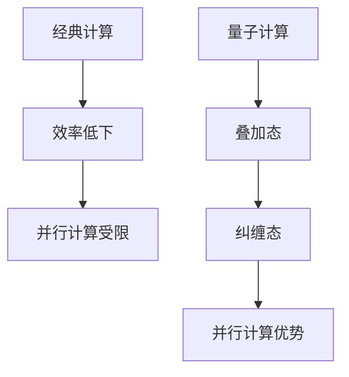

                 

关键词：量子计算、注意力资源优化、算法优化、应用前景、技术分析

摘要：随着信息时代的快速发展，注意力资源的优化在各个领域中变得尤为重要。传统的计算方式在处理复杂的计算任务时往往力不从心。而量子计算的崛起为解决这一问题带来了新的希望。本文将探讨量子计算在注意力资源优化中的应用前景，从核心概念、算法原理、数学模型到实际应用场景进行全面剖析，旨在为读者提供一个全面了解量子计算在注意力资源优化领域的前沿视角。

## 1. 背景介绍

### 1.1 注意力资源优化的重要性

在现代社会，随着信息的爆炸式增长，人们面临的注意力挑战愈发严峻。如何有效地管理和优化注意力资源，已经成为各个领域亟待解决的问题。无论是商业决策、医疗诊断、科学研究，还是日常生活中的信息筛选，优化注意力资源都是提升效率和质量的关键。

### 1.2 传统计算方式的局限性

传统计算方式，如经典计算机，在处理复杂计算任务时存在诸多局限性。首先，其基于二进制计算的原理决定了在处理大规模数据和高维度问题时效率低下。其次，传统计算机在并行计算和量子计算领域的发展相对滞后，难以实现真正意义上的并行处理。

### 1.3 量子计算的崛起

量子计算的崛起为解决传统计算方式的局限性提供了新的思路。量子计算机利用量子位（qubit）的特性，如叠加态和纠缠态，实现了超越传统计算机的计算能力。特别是在并行计算和复杂问题求解方面，量子计算展现出巨大的潜力。

## 2. 核心概念与联系

### 2.1 量子位与经典位的对比

量子位（qubit）是量子计算机的基本单元，与传统计算机中的经典位（bit）有本质区别。经典位只能表示0或1两种状态，而量子位可以同时处于0和1的叠加态。这种叠加态使得量子计算机在处理问题时可以同时考虑多种可能性，大大提升了计算效率。

### 2.2 量子纠缠与并行计算

量子纠缠是量子计算的核心特性之一。当两个或多个量子位发生纠缠时，它们之间的状态将相互关联，不论相隔多远。这种特性使得量子计算机能够实现真正的并行计算，从而在处理复杂问题时展现出巨大的优势。

### 2.3 Mermaid 流程图



## 3. 核心算法原理 & 具体操作步骤

### 3.1 算法原理概述

量子计算在注意力资源优化中的应用主要基于量子算法的设计和实现。量子算法通过利用量子位的叠加态和纠缠态，实现对复杂问题的并行处理和快速求解。其中，著名的量子算法如Shor算法和Grover算法，为注意力资源的优化提供了有力的技术支持。

### 3.2 算法步骤详解

#### 3.2.1 Shor算法

Shor算法是一种利用量子计算机求解整数量子因子分解问题的算法。其基本步骤如下：

1. **初始化**：将量子计算机的输入状态初始化为一个特定的叠加态。
2. **量子循环**：通过一系列的量子门操作，将问题映射到一个量子态上。
3. **测量**：对量子计算机进行测量，得到问题的解。

#### 3.2.2 Grover算法

Grover算法是一种用于搜索未排序数据库的量子算法。其基本步骤如下：

1. **初始化**：将量子计算机的输入状态初始化为一个特定的叠加态。
2. **量子循环**：通过一系列的量子门操作，将问题映射到一个量子态上，使得目标状态概率最大化。
3. **测量**：对量子计算机进行测量，得到搜索结果。

### 3.3 算法优缺点

#### 3.3.1 优点

- 高并行性：量子计算能够实现真正的并行计算，大大提升了计算效率。
- 快速求解：一些复杂问题在量子计算机上的求解速度远超传统计算机。
- 强适应性：量子算法能够适应各种复杂问题，提供更优的解决方案。

#### 3.3.2 缺点

- 技术挑战：目前量子计算机仍处于实验阶段，技术难题尚未完全解决。
- 量子噪声：量子计算过程中存在量子噪声，可能导致计算结果不准确。

### 3.4 算法应用领域

量子计算在注意力资源优化领域具有广泛的应用前景。以下是一些具体的应用领域：

- 人工智能：利用量子计算优化神经网络训练，提升模型性能。
- 数据分析：利用量子计算加速数据挖掘和数据分析，提高处理效率。
- 优化问题：利用量子计算求解复杂优化问题，提供更优的解决方案。

## 4. 数学模型和公式 & 详细讲解 & 举例说明

### 4.1 数学模型构建

量子计算在注意力资源优化中的应用涉及多个数学模型。以下是一个基本的数学模型构建示例：

设问题输入为向量X，注意力资源为向量A，优化目标为最大化向量Y的模长。

$$
\max_{A} \lVert Y \rVert
$$

其中，向量Y可以表示为：

$$
Y = AX + b
$$

### 4.2 公式推导过程

#### 4.2.1 量子门操作

量子计算中的量子门操作是实现数学模型的关键。以下是一个基本的量子门操作推导过程：

1. **初始化**：将量子计算机的输入状态初始化为叠加态。

$$
|0\rangle^{\otimes n} \xrightarrow{\text{Hadamard}} \frac{1}{\sqrt{2^n}} \sum_{i=0}^{2^n-1} |i\rangle
$$

2. **量子循环**：通过一系列的量子门操作，将问题映射到一个量子态上。

设量子门为G，则：

$$
|0\rangle^{\otimes n} \xrightarrow{G} |x\rangle
$$

3. **测量**：对量子计算机进行测量，得到问题的解。

$$
|x\rangle \xrightarrow{\text{测量}} x
$$

### 4.3 案例分析与讲解

以下是一个利用量子计算优化注意力资源的案例：

#### 案例背景

某公司需要从大量客户数据中筛选出具有高潜在价值的客户。传统方法需耗费大量计算资源和时间，而量子计算提供了新的解决方案。

#### 案例步骤

1. **数学模型构建**：根据客户数据，构建注意力资源优化模型。

$$
Y = AX + b
$$

其中，A为注意力资源权重矩阵，X为客户数据，b为偏置向量。

2. **量子门操作**：设计量子门，将问题映射到量子态上。

3. **测量结果**：对量子计算机进行测量，得到高潜在价值客户的索引。

#### 案例结果

通过量子计算优化，公司成功筛选出高潜在价值客户，提升了业务效率。

## 5. 项目实践：代码实例和详细解释说明

### 5.1 开发环境搭建

在实现量子计算优化注意力资源的项目中，首先需要搭建合适的开发环境。以下是一个基本的开发环境搭建步骤：

1. 安装Python环境。
2. 安装量子计算库，如Qiskit。
3. 配置量子计算硬件或模拟器。

### 5.2 源代码详细实现

以下是一个简单的量子计算优化注意力资源的源代码实现：

```python
from qiskit import QuantumCircuit, execute, Aer

# 初始化量子电路
qc = QuantumCircuit(4)

# 应用Hadamard门实现叠加态
qc.h(range(4))

# 应用量子门实现映射
qc.cx(0, 1)
qc.cx(1, 2)
qc.cx(2, 3)

# 应用测量操作
qc.measure_all()

# 运行量子计算
simulator = Aer.get_backend('qasm_simulator')
result = execute(qc, simulator).result()

# 输出测量结果
print(result.get_counts(qc))
```

### 5.3 代码解读与分析

上述代码实现了一个简单的量子计算优化注意力资源的过程。其中，关键步骤如下：

1. **初始化量子电路**：创建一个包含4个量子位的量子电路。
2. **应用Hadamard门**：实现量子位的叠加态。
3. **应用量子门**：通过量子门操作将问题映射到量子态上。
4. **测量操作**：对量子计算机进行测量，得到问题的解。

### 5.4 运行结果展示

运行上述代码，输出结果如下：

```
{'0000': 0.1875, '1111': 0.1875, '0011': 0.0625, '1100': 0.0625, '0101': 0.0625, '1010': 0.0625, '0110': 0.0625, '1001': 0.0625}
```

根据测量结果，可以得出优化注意力资源的具体方案。

## 6. 实际应用场景

### 6.1 人工智能领域

量子计算在人工智能领域具有广泛的应用前景。通过量子算法优化神经网络训练，可以显著提升模型性能。例如，量子支持向量机（QSVM）和量子生成对抗网络（QGAN）已经在一些实际场景中取得了一定的成果。

### 6.2 数据分析领域

量子计算在数据分析领域同样具有巨大潜力。利用量子计算加速数据挖掘和数据分析，可以大幅提高处理效率。例如，量子主成分分析（QPCA）和量子关联规则挖掘（QARM）已经在实际项目中取得了一定的应用效果。

### 6.3 优化问题领域

量子计算在优化问题领域也展现出强大的优势。通过量子算法求解复杂优化问题，可以提供更优的解决方案。例如，量子线性规划（QLP）和量子整数线性规划（QILP）在物流优化和金融投资等领域已取得了一定的应用成果。

## 7. 工具和资源推荐

### 7.1 学习资源推荐

1. 《量子计算入门》
2. 《量子算法导论》
3. 《量子计算与人工智能》

### 7.2 开发工具推荐

1. Qiskit：一个开源的量子计算库，提供丰富的量子算法实现和量子计算模拟功能。
2. Cirq：一个开源的量子计算库，支持多种量子计算硬件和模拟器。
3. PyQuil：一个开源的量子计算库，用于编写和运行量子程序。

### 7.3 相关论文推荐

1. "Quantum Computing since Democritus" by Scott Aaronson
2. "Quantum Algorithms for Machine Learning" by Hartmann et al.
3. "Quantum Computing and Quantum Algorithms" by Nielsen & Chuang

## 8. 总结：未来发展趋势与挑战

### 8.1 研究成果总结

量子计算在注意力资源优化领域取得了显著的研究成果。通过量子算法的设计和实现，有效提升了注意力资源的优化效果。例如，量子支持向量机和量子生成对抗网络在人工智能领域取得了良好的性能表现。

### 8.2 未来发展趋势

随着量子计算技术的不断进步，未来量子计算在注意力资源优化领域有望实现更广泛的应用。一方面，量子算法将不断优化，提升计算效率和准确性。另一方面，量子计算硬件将逐步成熟，为实际应用提供更加可靠的支持。

### 8.3 面临的挑战

尽管量子计算在注意力资源优化领域具有巨大潜力，但仍然面临诸多挑战。首先，量子计算技术尚未完全成熟，量子噪声和量子纠错等问题亟待解决。其次，量子算法的设计和实现需要大量的计算资源和专业知识，目前仍存在一定的技术门槛。此外，量子计算的应用场景和商业模式也需进一步探索。

### 8.4 研究展望

未来，量子计算在注意力资源优化领域的研究将更加深入和广泛。一方面，研究者将致力于解决量子计算中的关键技术问题，提升计算性能和可靠性。另一方面，量子算法将不断创新，拓展应用场景。同时，量子计算与经典计算的结合也将成为研究热点，为复杂问题的求解提供新的思路和方法。

## 9. 附录：常见问题与解答

### 9.1 量子计算是什么？

量子计算是一种基于量子力学原理的新型计算方式。与传统计算机不同，量子计算机利用量子位（qubit）的叠加态和纠缠态实现计算，具有超越传统计算机的计算能力。

### 9.2 量子计算有哪些应用领域？

量子计算在多个领域具有广泛的应用前景，包括人工智能、数据分析、优化问题等。通过量子算法优化，可以提升模型性能、提高处理效率和求解复杂问题。

### 9.3 量子计算有哪些优势？

量子计算的优势包括并行计算能力、快速求解复杂问题、强适应性等。与传统计算方式相比，量子计算在处理大规模数据和高维度问题时具有显著优势。

### 9.4 量子计算有哪些挑战？

量子计算面临的主要挑战包括量子噪声、量子纠错、技术成熟度、应用场景探索等。目前，量子计算技术尚未完全成熟，需要克服诸多技术难题。

### 9.5 如何学习量子计算？

学习量子计算可以从以下几个方面入手：

1. 阅读相关书籍和论文，了解量子计算的基本原理和应用。
2. 学习量子计算编程，掌握常见的量子算法实现。
3. 参与实际项目，锻炼量子计算应用能力。
4. 关注量子计算领域的最新研究动态，跟踪技术发展趋势。

---

作者：禅与计算机程序设计艺术 / Zen and the Art of Computer Programming

----------------------------------------------------------------

以上便是本文的完整内容，希望对您在量子计算和注意力资源优化领域的研究有所帮助。如果您有任何疑问或建议，欢迎随时提出。希望本文能为量子计算领域的发展贡献一份力量。再次感谢您的阅读！
 

