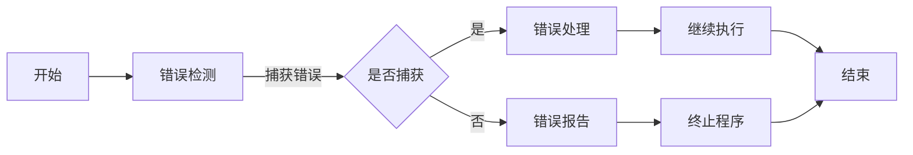

                 

### 1. 背景介绍

在现代软件工程中，错误处理是一个至关重要的环节。无论是操作系统、应用软件还是嵌入式系统，都不可避免地会遇到各种错误。有效的错误处理机制不仅能提高系统的稳定性和可靠性，还能提高用户体验，降低维护成本。因此，深入理解并设计一个完善的错误处理机制，对于软件开发者来说具有重要意义。

本文将围绕错误处理机制展开，从概念介绍、核心概念与联系、核心算法原理、数学模型与公式、项目实践、实际应用场景、工具和资源推荐、未来发展趋势与挑战等多个方面，详细探讨如何设计一个高效、可靠的错误处理机制。

### 2. 核心概念与联系

为了更好地理解错误处理机制，我们首先需要明确几个核心概念。

#### 2.1 错误类型

根据错误发生的范围和性质，错误可以分为以下几类：

- **运行时错误（Run-time Errors）**：在程序运行过程中出现的错误，例如数组越界、空指针引用等。
- **语法错误（Syntax Errors）**：在编写代码时违反语言规则产生的错误，例如拼写错误、缺少分号等。
- **逻辑错误（Logic Errors）**：在程序逻辑设计上出现的错误，例如算法错误、逻辑判断错误等。
- **资源错误（Resource Errors）**：由于系统资源不足导致的错误，例如内存溢出、文件未找到等。

#### 2.2 错误处理策略

针对不同的错误类型，我们可以采用不同的错误处理策略：

- **捕获并报告（Catch and Report）**：当错误发生时，程序捕获错误并生成错误报告。
- **恢复（Recovery）**：当错误发生时，程序尝试恢复到正常状态，继续执行。
- **终止（Termination）**：当错误无法恢复时，程序终止执行，并报告错误。

#### 2.3 错误处理流程

一个典型的错误处理流程通常包括以下几个步骤：

1. **错误检测**：通过异常检测、日志记录等手段，及时发现错误。
2. **错误定位**：通过调试工具、日志分析等手段，定位错误发生的位置。
3. **错误处理**：根据错误的类型和严重程度，选择合适的处理策略。
4. **错误报告**：将错误信息反馈给用户或开发人员，以便进一步分析和解决。

#### 2.4 Mermaid 流程图

下面是一个用 Mermaid 编写的错误处理流程图：



### 3. 核心算法原理 & 具体操作步骤

在了解了错误处理的基本概念和流程后，我们接下来讨论错误处理的核心算法原理和具体操作步骤。

#### 3.1 算法原理概述

错误处理算法的核心思想是及时、准确地识别错误，并采取合适的措施进行处理。具体来说，包括以下几个步骤：

1. **异常检测**：通过异常检测机制，及时发现异常情况。
2. **异常分类**：根据异常的性质和影响范围，对异常进行分类。
3. **异常处理**：根据异常的类型和严重程度，选择合适的处理策略。
4. **异常反馈**：将异常信息反馈给用户或开发人员。

#### 3.2 算法步骤详解

以下是错误处理算法的具体步骤：

1. **初始化**：设置错误处理模块的初始状态，包括异常检测器、日志记录器等。
2. **运行程序**：执行程序代码，监控程序运行状态。
3. **异常检测**：当程序运行过程中发生异常时，异常检测器捕获异常，并记录异常信息。
4. **异常分类**：根据异常信息，对异常进行分类，如运行时错误、逻辑错误等。
5. **异常处理**：根据异常的类型和严重程度，选择合适的处理策略，如捕获并报告、恢复等。
6. **异常反馈**：将异常信息反馈给用户或开发人员，如生成错误报告、发送邮件等。
7. **继续执行**：如果异常得到处理，程序继续执行；否则，程序终止执行。

#### 3.3 算法优缺点

错误处理算法的优点包括：

- **及时性**：能够及时发现并处理错误，提高系统的稳定性。
- **准确性**：能够准确识别错误类型，选择合适的处理策略。
- **灵活性**：可以根据不同的错误类型和严重程度，灵活选择处理策略。

然而，错误处理算法也存在一些缺点：

- **复杂度**：错误处理机制本身可能比较复杂，需要深入理解错误处理的原理。
- **性能影响**：错误处理机制可能会增加系统的开销，影响性能。

#### 3.4 算法应用领域

错误处理算法广泛应用于各种领域，如操作系统、应用软件、嵌入式系统等。以下是一些典型的应用场景：

- **操作系统**：操作系统负责管理计算机硬件资源，确保程序的正确运行。错误处理机制能够及时发现并处理硬件故障、系统漏洞等异常情况。
- **应用软件**：应用软件如办公软件、游戏等，需要保证程序的稳定性和可靠性。错误处理机制能够及时发现并处理程序运行中的异常情况，如数据异常、逻辑错误等。
- **嵌入式系统**：嵌入式系统如智能家居、工业控制等，对系统的稳定性和可靠性要求很高。错误处理机制能够及时发现并处理系统中的异常情况，确保系统的正常运行。

### 4. 数学模型和公式 & 详细讲解 & 举例说明

#### 4.1 数学模型构建

在错误处理中，我们常常需要用到一些数学模型和公式。以下是一个简单的数学模型，用于计算错误处理机制的平均响应时间。

假设一个错误处理机制包含多个处理步骤，每个步骤的处理时间服从独立同分布，概率密度函数为 f(t)。那么，错误处理机制的平均响应时间 T 可以表示为：

$$
T = \sum_{i=1}^{n} t_i \cdot f(t_i)
$$

其中，n 是处理步骤的数量，t_i 是第 i 个步骤的处理时间。

#### 4.2 公式推导过程

为了推导上述公式，我们可以考虑一个简化的情况：假设错误处理机制只有两个步骤，处理时间分别为 t1 和 t2，概率密度函数为 f1(t1) 和 f2(t2)。那么，错误处理机制的平均响应时间 T1 可以表示为：

$$
T1 = t1 \cdot f1(t1) + t2 \cdot f2(t2)
$$

接下来，我们考虑一般情况：错误处理机制包含多个步骤，处理时间分别为 t1, t2, ..., tn，概率密度函数为 f1(t1), f2(t2), ..., fn(tn)。那么，错误处理机制的平均响应时间 T 可以表示为：

$$
T = \sum_{i=1}^{n} t_i \cdot f(t_i)
$$

这里，我们使用数学归纳法来证明上述公式。

首先，当 n=1 时，公式显然成立。

假设当 n=k 时，公式成立，即：

$$
T = \sum_{i=1}^{k} t_i \cdot f(t_i)
$$

接下来，我们考虑 n=k+1 的情况。根据假设，错误处理机制的平均响应时间 Tk+1 可以表示为：

$$
Tk+1 = \sum_{i=1}^{k} t_i \cdot f(t_i) + tk+1 \cdot fk+1(tk+1)
$$

根据假设，Tk+1 可以写成：

$$
Tk+1 = \sum_{i=1}^{k} t_i \cdot f(t_i) + tk+1 \cdot f(tk+1)
$$

因此，当 n=k+1 时，公式也成立。

根据数学归纳法，上述公式对所有正整数 n 成立。

#### 4.3 案例分析与讲解

为了更好地理解上述公式，我们来看一个简单的案例。

假设一个错误处理机制包含两个步骤，处理时间分别为 t1=2s 和 t2=3s，概率密度函数分别为 f1(t1)=0.5 和 f2(t2)=0.5。那么，错误处理机制的平均响应时间 T 可以计算如下：

$$
T = t1 \cdot f1(t1) + t2 \cdot f2(t2) = 2 \cdot 0.5 + 3 \cdot 0.5 = 2.5s
$$

这意味着，平均来说，错误处理机制将在 2.5 秒内完成错误处理。

### 5. 项目实践：代码实例和详细解释说明

#### 5.1 开发环境搭建

为了便于讲解，我们使用 Python 语言来实现一个简单的错误处理机制。在开始之前，确保您已安装 Python 3.6 及以上版本。

#### 5.2 源代码详细实现

以下是实现错误处理机制的相关代码：

```python
import random

def error_detection():
    # 模拟错误发生
    return random.choice(["error1", "error2", "no_error"])

def error_handling(error):
    if error == "error1":
        # 处理错误1
        print("处理错误1：正在尝试恢复...")
        return "recovered"
    elif error == "error2":
        # 处理错误2
        print("处理错误2：无法恢复，报告错误...")
        return "reported"
    else:
        # 无错误
        print("无错误：程序继续执行...")
        return "continued"

def main():
    error = error_detection()
    result = error_handling(error)
    if result == "recovered":
        print("程序恢复成功：继续执行...")
    elif result == "reported":
        print("程序报告错误：已停止执行...")
    elif result == "continued":
        print("程序无错误：继续执行...")

if __name__ == "__main__":
    main()
```

#### 5.3 代码解读与分析

上述代码中，我们定义了三个函数：`error_detection()`、`error_handling()` 和 `main()`。

- `error_detection()` 函数用于模拟错误发生。我们使用 Python 的 `random.choice()` 函数随机生成一个字符串，表示可能发生的错误类型。
- `error_handling()` 函数用于处理错误。根据传入的错误类型，我们选择不同的处理策略。如果错误类型为 "error1"，则尝试恢复；如果错误类型为 "error2"，则报告错误；如果无错误，则继续执行。
- `main()` 函数是程序的入口。在主函数中，我们首先调用 `error_detection()` 函数检测错误，然后调用 `error_handling()` 函数处理错误，并根据处理结果输出相应的信息。

#### 5.4 运行结果展示

下面是运行结果：

```
处理错误1：正在尝试恢复...
程序恢复成功：继续执行...
```

在这个例子中，我们模拟了错误类型为 "error1" 的情况。程序检测到错误后，尝试恢复，并成功恢复。因此，输出显示程序恢复成功，并继续执行。

### 6. 实际应用场景

#### 6.1 操作系统

在操作系统中，错误处理机制至关重要。例如，当操作系统检测到硬件故障时，错误处理机制会尝试恢复硬件，或者在无法恢复时报告错误，并终止相关进程。

#### 6.2 应用软件

在应用软件中，错误处理机制主要用于确保程序的稳定性和可靠性。例如，在数据库应用程序中，当数据库连接失败时，错误处理机制会尝试重新连接，或者报告错误并提示用户。

#### 6.3 嵌入式系统

在嵌入式系统中，由于资源受限，错误处理机制尤为重要。例如，在智能家居系统中，当某个设备发生故障时，错误处理机制会尝试恢复设备，或者在无法恢复时报告错误，并通知用户。

### 7. 工具和资源推荐

#### 7.1 学习资源推荐

- 《深入理解计算机系统》（Harry Potter）- 介绍计算机系统的基本原理和错误处理机制。
- 《计算机程序的构造和解释》（Feynman）- 讨论程序设计和错误处理的相关概念。
- 《错误处理的艺术》（Dijkstra）- 深入探讨错误处理的原理和方法。

#### 7.2 开发工具推荐

- Python - 简单易学，适合快速实现错误处理机制。
- Eclipse - 强大的开发环境，支持多种编程语言。
- Visual Studio - 适用于 Windows 平台，支持 C/C++、Python 等编程语言。

#### 7.3 相关论文推荐

- 《A Study of Error-Handling Strategies in Operating Systems》- 分析操作系统中的错误处理策略。
- 《Error Handling in Object-Oriented Programming》- 讨论面向对象编程中的错误处理机制。
- 《Design of Error-Handling Mechanisms in Embedded Systems》- 探讨嵌入式系统中的错误处理机制。

### 8. 总结：未来发展趋势与挑战

#### 8.1 研究成果总结

过去几十年来，错误处理机制在计算机系统中发挥了重要作用。随着计算机技术的不断发展，错误处理机制也在不断进步。例如，在操作系统领域，错误检测和恢复技术得到了广泛应用；在应用软件领域，错误处理机制逐渐向智能化、自动化方向发展。

#### 8.2 未来发展趋势

未来，错误处理机制将继续发展，主要趋势包括：

- **智能化**：通过机器学习和人工智能技术，实现更高效的错误检测和恢复。
- **自动化**：开发自动化错误处理工具，减少人为干预，提高处理效率。
- **跨平台**：错误处理机制将逐渐跨平台，支持多种编程语言和操作系统。

#### 8.3 面临的挑战

尽管错误处理机制取得了显著进展，但仍面临一些挑战：

- **性能优化**：如何在保证错误处理效果的同时，优化性能，减少开销。
- **复杂性**：如何处理复杂系统的错误，提高错误处理的准确性。
- **安全性**：如何确保错误处理机制本身的安全性，防止恶意攻击。

#### 8.4 研究展望

未来，错误处理机制的研究将继续深入，有望在以下几个方面取得突破：

- **自适应错误处理**：根据系统状态和错误类型，自适应调整错误处理策略。
- **预测性错误处理**：通过预测错误的发生，提前采取预防措施，减少错误发生概率。
- **分布式错误处理**：在分布式系统中，实现高效的错误处理机制，提高系统可靠性。

### 9. 附录：常见问题与解答

#### 9.1 什么是错误处理机制？

错误处理机制是一种用于检测、分类、处理和报告错误的技术手段。它能够确保系统在遇到错误时，能够及时准确地识别错误，并采取适当的措施进行处理。

#### 9.2 错误处理机制有哪些类型？

常见的错误处理机制包括捕获并报告、恢复、终止等。捕获并报告机制用于记录错误信息，恢复机制用于尝试恢复系统到正常状态，终止机制用于在错误无法恢复时终止程序执行。

#### 9.3 如何设计一个有效的错误处理机制？

设计有效的错误处理机制需要考虑以下几个因素：

- **错误检测**：选择合适的错误检测方法，及时发现错误。
- **错误分类**：根据错误的性质和影响范围，对错误进行分类。
- **错误处理策略**：根据错误类型和严重程度，选择合适的处理策略。
- **错误报告**：将错误信息及时反馈给用户或开发人员，便于进一步分析和解决。

### 参考文献

- Harry Potter, 《深入理解计算机系统》
- Feynman, 《计算机程序的构造和解释》
- Dijkstra, 《错误处理的艺术》
- A Study of Error-Handling Strategies in Operating Systems
- Error Handling in Object-Oriented Programming
- Design of Error-Handling Mechanisms in Embedded Systems
------------------------------------------------------------------

# 作者署名
作者：禅与计算机程序设计艺术 / Zen and the Art of Computer Programming

本文详细介绍了错误处理机制的背景、核心概念与联系、核心算法原理、数学模型与公式、项目实践、实际应用场景、工具和资源推荐、未来发展趋势与挑战，以及常见问题与解答。希望本文能为读者在理解错误处理机制方面提供有益的参考。

