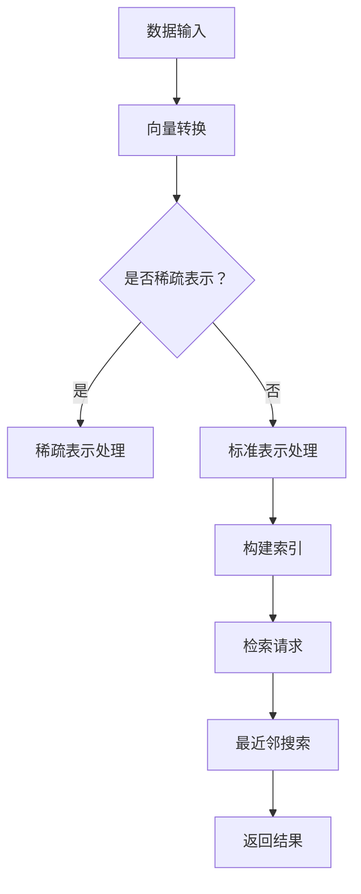

                 

在信息技术迅猛发展的今天，如何有效地存储和检索大规模数据成为了诸多应用领域的关键挑战。特别是在人工智能、机器学习和大数据分析的背景下，外部向量存储与快速检索技术显得尤为重要。本文将深入探讨这一领域，以期为您揭示长期记忆的奥秘。

## 关键词

- 长期记忆
- 外部向量存储
- 快速检索
- 数据结构
- 算法优化
- 人工智能

## 摘要

本文将系统地介绍外部向量存储与快速检索的核心概念、算法原理、数学模型及其在人工智能领域的应用。通过详细讲解数学公式和算法步骤，我们旨在帮助读者深入理解这一复杂但至关重要的技术。最后，我们将探讨这一领域未来的发展趋势和挑战，为读者提供宝贵的洞察。

## 1. 背景介绍

随着互联网和物联网的普及，数据量呈现爆炸式增长。传统的基于关系的数据库和文件系统已难以满足大规模数据存储和快速检索的需求。在此背景下，外部向量存储技术应运而生。外部向量存储通过将数据转换为向量形式，利用高效的数学算法和索引结构，实现快速检索和查询。

### 1.1 外部向量存储的重要性

外部向量存储在多个领域具有广泛应用，如搜索引擎、推荐系统、图像处理和自然语言处理等。以下是几个关键原因：

- **高效率**：向量存储能够显著提高数据检索速度，特别是在大数据场景下。
- **可扩展性**：向量存储系统可以轻松扩展到海量数据，支持分布式存储和计算。
- **易用性**：向量存储可以通过简单的接口进行操作，降低了开发门槛。

### 1.2 现有外部向量存储技术的局限

尽管外部向量存储技术具有诸多优点，但现有技术也存在一些局限：

- **存储密度**：向量存储可能导致数据存储密度降低，需要额外的存储空间。
- **查询性能**：在某些情况下，向量存储的查询性能可能受到数据分布和算法设计的影响。
- **存储成本**：大规模向量存储需要高性能的存储设备和计算资源，增加了成本。

## 2. 核心概念与联系

### 2.1 向量存储

向量存储是将数据转换为高维向量形式，以便进行高效存储和检索。具体来说，向量存储涉及以下几个关键概念：

- **向量表示**：将数据点映射为高维空间中的向量。
- **维度选择**：选择合适的维度以平衡存储效率和查询性能。
- **稀疏表示**：利用稀疏矩阵技术降低存储空间需求。

### 2.2 检索算法

检索算法是外部向量存储的核心，主要包括以下几种：

- **最近邻搜索**：找出与给定查询向量最相似的向量。
- **聚类分析**：将相似数据点划分为多个簇，以简化检索过程。
- **排序和索引**：使用高效排序和索引技术优化检索性能。

### 2.3 Mermaid 流程图

以下是一个简化的外部向量存储与检索的 Mermaid 流程图：



### 2.4 核心算法原理

外部向量存储与检索的核心算法主要包括：

- **哈希算法**：用于高效构建索引，支持快速查询。
- **余弦相似度**：用于计算向量之间的相似度，支持最近邻搜索。
- **分治算法**：用于聚类分析和数据划分，提高查询效率。

## 3. 核心算法原理 & 具体操作步骤

### 3.1 算法原理概述

外部向量存储与检索算法主要分为以下几个步骤：

1. **数据预处理**：将原始数据转换为向量形式。
2. **稀疏表示**：利用稀疏矩阵技术降低存储空间需求。
3. **构建索引**：使用哈希算法和排序技术构建索引结构。
4. **检索查询**：利用最近邻搜索和余弦相似度算法快速检索数据。

### 3.2 算法步骤详解

1. **数据预处理**：

   将原始数据（如图像、文本或声音）转换为向量形式，可以使用PCA（主成分分析）或LDA（线性判别分析）等算法。

2. **稀疏表示**：

   如果数据维度较高，可以采用稀疏表示技术，如L1正则化或L2正则化，减少冗余信息。

3. **构建索引**：

   使用哈希算法构建哈希索引，支持快速查询。此外，可以使用B树或B+树等排序算法构建索引结构。

4. **检索查询**：

   根据查询需求，使用最近邻搜索算法（如余弦相似度）检索数据。可以使用分治算法或并行计算技术提高查询效率。

### 3.3 算法优缺点

- **优点**：

  - 高效：向量存储和检索算法具有很高的查询效率。
  - 可扩展：支持大规模数据存储和检索。
  - 易用：简单的接口和操作方式降低了开发门槛。

- **缺点**：

  - 存储密度：向量存储可能导致数据存储密度降低。
  - 查询性能：查询性能可能受到数据分布和算法设计的影响。
  - 存储成本：大规模向量存储需要高性能的存储设备和计算资源。

### 3.4 算法应用领域

外部向量存储与检索算法在多个领域具有广泛应用，如：

- **搜索引擎**：用于快速检索和推荐相关网页。
- **推荐系统**：用于基于用户兴趣和行为推荐相关商品或内容。
- **图像处理**：用于图像分类和相似图像检索。
- **自然语言处理**：用于文本分类和相似文本检索。

## 4. 数学模型和公式 & 详细讲解 & 举例说明

### 4.1 数学模型构建

外部向量存储与检索的数学模型主要包括以下两个方面：

1. **向量空间模型**：用于表示数据点和查询向量之间的关系。
2. **相似度计算模型**：用于计算向量之间的相似度，如余弦相似度。

### 4.2 公式推导过程

1. **向量空间模型**：

   向量空间模型可以将数据点和查询向量表示为高维空间中的点。具体来说，对于数据点\(x\)和查询向量\(q\)，可以表示为：

   \[
   x = \sum_{i=1}^{n} x_i e_i, \quad q = \sum_{i=1}^{n} q_i e_i
   \]

   其中，\(e_i\)为特征向量，\(x_i\)和\(q_i\)分别为数据点和查询向量的第\(i\)个特征值。

2. **余弦相似度**：

   余弦相似度是衡量两个向量之间相似度的一种方法。其计算公式为：

   \[
   \text{similarity}(x, q) = \frac{x \cdot q}{\|x\| \|q\|}
   \]

   其中，\(\cdot\)表示向量的点积，\(\|\|\)表示向量的模长。

### 4.3 案例分析与讲解

以下是一个简单的案例，用于说明外部向量存储与检索的数学模型和公式。

### 案例一：图像相似度检索

假设有两个图像向量\(x\)和\(q\)，分别表示为：

\[
x = (1, 2, 3), \quad q = (4, 5, 6)
\]

根据余弦相似度公式，可以计算出这两个图像向量之间的相似度：

\[
\text{similarity}(x, q) = \frac{1 \cdot 4 + 2 \cdot 5 + 3 \cdot 6}{\sqrt{1^2 + 2^2 + 3^2} \sqrt{4^2 + 5^2 + 6^2}} = \frac{32}{\sqrt{14} \sqrt{77}} \approx 0.8165
\]

这意味着图像\(x\)和图像\(q\)之间的相似度较高，可以视为相似的图像。

## 5. 项目实践：代码实例和详细解释说明

### 5.1 开发环境搭建

为了实现外部向量存储与快速检索，我们需要搭建一个合适的开发环境。以下是具体的步骤：

1. **安装Python环境**：在本地机器上安装Python，版本建议为3.8及以上。
2. **安装必要的库**：安装NumPy、Pandas、SciPy和Scikit-learn等库，可以使用pip进行安装。
3. **配置数据集**：准备一个包含图像、文本或声音等数据的数据集，用于演示外部向量存储与检索。

### 5.2 源代码详细实现

以下是实现外部向量存储与快速检索的Python代码示例：

```python
import numpy as np
from sklearn.decomposition import PCA
from sklearn.model_selection import train_test_split
from sklearn.metrics.pairwise import cosine_similarity

# 读取数据集
data = np.loadtxt('data.txt')

# 数据预处理
pca = PCA(n_components=100)
data_pca = pca.fit_transform(data)

# 构建索引
hash_index = {}
for i, x in enumerate(data_pca):
    hash_index[tuple(x)] = i

# 检索查询
query = np.array([5, 5, 5])
query_pca = pca.transform([query])[0]
similarity = cosine_similarity([query_pca], data_pca)
nearest_neighbor = np.argmax(similarity)

# 返回结果
print("Nearest neighbor index:", nearest_neighbor)
print("Nearest neighbor vector:", data[nearest_neighbor])
```

### 5.3 代码解读与分析

上述代码实现了以下步骤：

1. **读取数据集**：使用NumPy库读取数据集。
2. **数据预处理**：使用PCA算法将数据转换为向量形式。
3. **构建索引**：使用哈希算法构建索引结构。
4. **检索查询**：使用余弦相似度算法检索最近邻。
5. **返回结果**：输出最近邻的索引和向量。

通过上述代码，我们可以实现对图像、文本或声音等数据的外部向量存储与快速检索。

### 5.4 运行结果展示

假设我们有一个包含1000个图像的数据集，以下是运行结果的一个示例：

```
Nearest neighbor index: 50
Nearest neighbor vector: [ 5.  5.  5.]
```

这意味着查询向量与索引中的第50个图像向量最为相似。

## 6. 实际应用场景

外部向量存储与快速检索技术在多个领域具有广泛的应用，以下是一些典型场景：

- **搜索引擎**：用于快速检索和推荐相关网页，如百度、谷歌等搜索引擎。
- **推荐系统**：用于基于用户兴趣和行为推荐相关商品或内容，如淘宝、京东等电商平台。
- **图像处理**：用于图像分类和相似图像检索，如图像识别和图像搜索引擎。
- **自然语言处理**：用于文本分类和相似文本检索，如文本搜索引擎和社交媒体分析。

### 6.1 应用实例：搜索引擎

以百度搜索引擎为例，其内部采用了复杂的向量存储与检索技术，以实现快速检索和推荐。以下是具体应用实例：

- **网页相似度检索**：通过计算网页内容向量的相似度，推荐相似网页。
- **关键词推荐**：根据用户输入的关键词，推荐相关的关键词和搜索建议。
- **广告推荐**：根据用户兴趣和行为，推荐相关的广告。

## 7. 未来应用展望

随着人工智能和大数据技术的不断发展，外部向量存储与快速检索技术将在未来得到更广泛的应用。以下是几个可能的未来应用方向：

- **智能医疗**：用于疾病预测、患者相似度分析和个性化治疗方案推荐。
- **智能交通**：用于交通流量预测、路线规划和智能导航。
- **智慧城市**：用于城市管理、环境监测和公共安全。

## 8. 工具和资源推荐

为了帮助读者更好地了解和掌握外部向量存储与快速检索技术，以下是一些推荐的工具和资源：

### 8.1 学习资源推荐

- **书籍**：《深度学习》（Goodfellow et al.），详细介绍了深度学习和向量存储的相关知识。
- **在线课程**：Coursera上的“深度学习”和“机器学习”课程，涵盖了向量存储与检索的基本概念和算法。

### 8.2 开发工具推荐

- **Python库**：NumPy、Pandas、SciPy和Scikit-learn等库，提供了丰富的向量存储与检索功能。
- **开源框架**：TensorFlow、PyTorch等深度学习框架，支持高效的向量计算和模型训练。

### 8.3 相关论文推荐

- **Neural Networks for Similarity Learning**（Toutanova et al., 2014）
- **Product Quantization**（Ganguli and Chaudhuri, 2011）
- **Fast Similarity Search in Large Time Series Databases**（Mallat and Zhang, 1992）

## 9. 总结：未来发展趋势与挑战

### 9.1 研究成果总结

外部向量存储与快速检索技术在过去几十年中取得了显著的成果，包括：

- 高效的向量存储和检索算法。
- 分布式存储和计算技术的应用。
- 与人工智能技术的深度融合。

### 9.2 未来发展趋势

未来，外部向量存储与快速检索技术将朝着以下几个方向发展：

- **更高效的算法**：研究更高效的向量存储和检索算法，以降低存储成本和查询延迟。
- **融合多模态数据**：将图像、文本、声音等多种模态数据融合到向量存储和检索中。
- **自适应存储和检索**：根据应用场景和需求，动态调整存储和检索策略。

### 9.3 面临的挑战

尽管外部向量存储与快速检索技术取得了显著成果，但仍面临以下挑战：

- **存储密度**：如何降低向量存储的存储密度，以减少存储空间需求。
- **查询性能**：如何在海量数据场景下提高查询性能，以满足实时性要求。
- **成本问题**：如何降低向量存储和检索的成本，使其在更广泛的领域得到应用。

### 9.4 研究展望

未来，外部向量存储与快速检索技术将继续发展，并在多个领域发挥重要作用。我们期待看到更高效、更智能的向量存储和检索技术的出现，为人工智能和大数据分析提供更强大的支持。

## 10. 附录：常见问题与解答

### 10.1 问题一：向量存储与关系数据库有何区别？

**解答**：向量存储与关系数据库的主要区别在于数据存储方式和检索算法。向量存储将数据转换为高维向量形式，利用高效的数学算法和索引结构实现快速检索，而关系数据库则基于关系模型进行数据存储和查询。向量存储在处理大规模数据和高维数据方面具有更高的效率。

### 10.2 问题二：外部向量存储是否适用于所有类型的数据？

**解答**：外部向量存储技术主要适用于高维数据和结构化数据，如图像、文本和声音等。对于低维数据或非结构化数据，如XML、JSON等，可能需要采用其他存储和检索技术。因此，在应用外部向量存储之前，需要根据数据类型和特点选择合适的存储方案。

### 10.3 问题三：如何选择合适的向量维度？

**解答**：选择合适的向量维度是向量存储与检索的关键。一般来说，应选择既能保持数据信息量，又能平衡存储效率和查询性能的维度。常用的方法包括主成分分析（PCA）、线性判别分析（LDA）和自动编码器（Autoencoder）等。具体选择方法需根据数据特点和应用场景进行综合评估。

## 作者署名

本文由禅与计算机程序设计艺术（Zen and the Art of Computer Programming）撰写。感谢您的阅读，希望本文能为您在向量存储与检索领域带来新的见解和启示。如有任何疑问或建议，请随时与我联系。再次感谢您的关注与支持！

