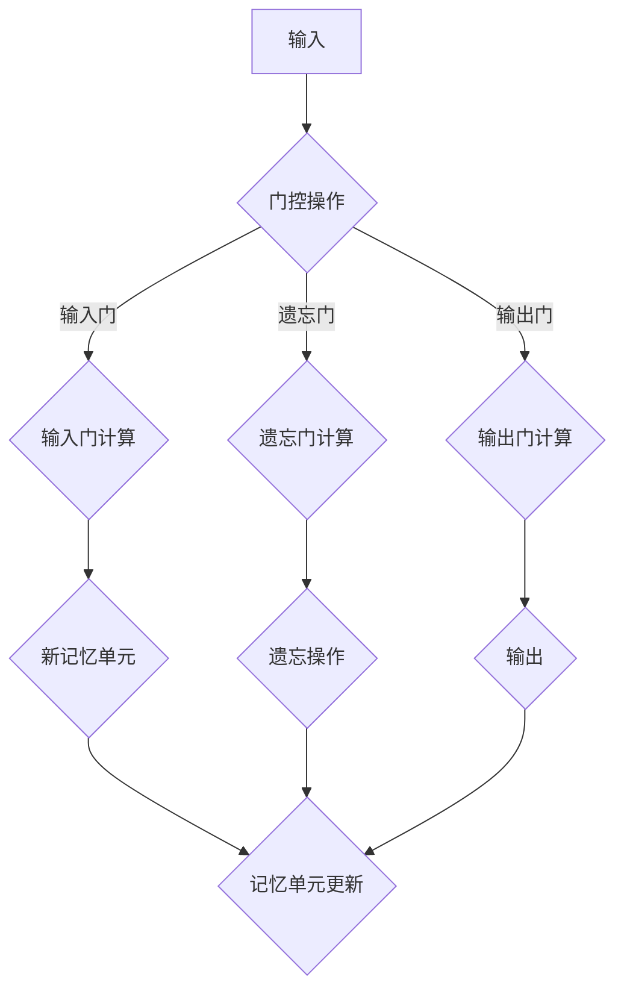

                 

关键词：长短期记忆网络，LSTM，循环神经网络，时间序列预测，神经网络架构，编程实例

摘要：本文将深入探讨长短期记忆网络（LSTM）的原理，并详细讲解其实现步骤和优缺点。通过一个具体的编程实例，我们将展示如何使用LSTM进行时间序列预测。此外，还将讨论LSTM在实际应用场景中的表现和未来发展趋势。

## 1. 背景介绍

在深度学习领域，循环神经网络（RNN）是一种能够处理序列数据的强大模型。然而，传统RNN在处理长序列时存在梯度消失或梯度爆炸的问题，导致难以学习长时依赖。为了解决这一问题，长短期记忆网络（LSTM）应运而生。

LSTM是一种改进的RNN结构，能够有效地学习长期依赖关系，在自然语言处理、语音识别、时间序列预测等领域表现出色。本文将详细介绍LSTM的原理、实现步骤和应用场景，并通过一个编程实例进行实际操作。

## 2. 核心概念与联系

LSTM的核心思想是通过记忆单元（cell state）和三个门（input gate、forget gate、output gate）来控制信息的流入和流出，从而实现长期依赖的学习。

### 2.1 LSTM架构

下面是LSTM的Mermaid流程图：



### 2.2 LSTM与RNN的关系

LSTM是RNN的一种改进，它在RNN的基础上引入了门控机制，能够有效地解决梯度消失问题。与传统RNN相比，LSTM在处理长序列时表现出更高的稳定性和准确性。

## 3. 核心算法原理 & 具体操作步骤

### 3.1 算法原理概述

LSTM通过三个门（输入门、遗忘门和输出门）来控制信息的流入和流出。具体来说：

- **输入门**：决定哪些信息将被存储在记忆单元中。
- **遗忘门**：决定哪些信息应该从记忆单元中遗忘。
- **输出门**：决定哪些信息将从记忆单元中输出。

### 3.2 算法步骤详解

下面是LSTM的具体操作步骤：

1. **输入门计算**：输入门根据当前输入和前一个隐藏状态计算一个权重矩阵，用于更新记忆单元。
2. **遗忘门计算**：遗忘门根据当前输入和前一个隐藏状态计算一个权重矩阵，用于决定哪些信息需要遗忘。
3. **输出门计算**：输出门根据当前输入和前一个隐藏状态计算一个权重矩阵，用于决定哪些信息需要输出。
4. **新记忆单元计算**：根据输入门和遗忘门计算新记忆单元。
5. **记忆单元更新**：将新记忆单元与旧记忆单元进行更新。
6. **输出计算**：根据输出门计算当前隐藏状态。

### 3.3 算法优缺点

LSTM的优点包括：

- **能够学习长期依赖关系**：通过门控机制，LSTM能够有效地学习长序列数据中的长期依赖关系。
- **稳定性高**：LSTM在训练过程中不易出现梯度消失或梯度爆炸问题，因此具有较高的稳定性。

然而，LSTM也存在一些缺点：

- **计算复杂度高**：LSTM的结构较为复杂，导致其计算复杂度较高，训练时间较长。
- **参数较多**：由于LSTM包含多个门控机制，因此其参数数量较多，训练过程需要大量的计算资源。

### 3.4 算法应用领域

LSTM在以下领域表现出色：

- **自然语言处理**：LSTM在文本分类、情感分析、机器翻译等领域具有广泛的应用。
- **时间序列预测**：LSTM在股票市场预测、气象预测等时间序列预测任务中具有较好的性能。
- **语音识别**：LSTM在语音识别任务中能够有效地学习语音信号的长期依赖关系。

## 4. 数学模型和公式 & 详细讲解 & 举例说明

### 4.1 数学模型构建

LSTM的数学模型主要包括以下部分：

- **输入层**：包括输入向量 $x_t$ 和前一个隐藏状态 $h_{t-1}$。
- **门控层**：包括输入门、遗忘门和输出门。
- **记忆单元**：用于存储和传递信息。
- **输出层**：包括当前隐藏状态 $h_t$ 和输出 $y_t$。

### 4.2 公式推导过程

下面是LSTM的公式推导过程：

1. **输入门计算**：
$$
i_t = \sigma(W_{ii} \cdot [h_{t-1}, x_t] + b_i)
$$

其中，$i_t$ 是输入门的输出，$\sigma$ 是sigmoid函数，$W_{ii}$ 是输入门权重矩阵，$b_i$ 是输入门偏置。

2. **遗忘门计算**：
$$
f_t = \sigma(W_{if} \cdot [h_{t-1}, x_t] + b_f)
$$

其中，$f_t$ 是遗忘门的输出，$W_{if}$ 是遗忘门权重矩阵，$b_f$ 是遗忘门偏置。

3. **输出门计算**：
$$
o_t = \sigma(W_{io} \cdot [h_{t-1}, x_t] + b_o)
$$

其中，$o_t$ 是输出门的输出，$W_{io}$ 是输出门权重矩阵，$b_o$ 是输出门偏置。

4. **新记忆单元计算**：
$$
\bar{c}_t = \sigma(W_{ic} \cdot [h_{t-1}, x_t] + b_c)
$$
$$
c_t = f_t \cdot c_{t-1} + i_t \cdot \tanh(\bar{c}_t)
$$

其中，$\bar{c}_t$ 是新记忆单元的候选值，$c_t$ 是记忆单元的输出，$c_{t-1}$ 是前一个记忆单元的输出。

5. **记忆单元更新**：
$$
h_t = o_t \cdot \tanh(c_t)
$$

其中，$h_t$ 是当前隐藏状态。

6. **输出计算**：
$$
y_t = \text{softmax}(W_{oh} \cdot h_t + b_o)
$$

其中，$y_t$ 是输出层的输出，$W_{oh}$ 是输出层权重矩阵，$b_o$ 是输出层偏置。

### 4.3 案例分析与讲解

假设我们有一个时间序列数据集，包含每天的温度。我们希望使用LSTM来预测明天的温度。

1. **数据处理**：将时间序列数据集转换为输入和输出格式，其中输入为前n天的温度数据，输出为第n+1天的温度。

2. **模型构建**：使用TensorFlow或PyTorch等深度学习框架构建LSTM模型。

3. **训练模型**：使用训练数据集训练模型。

4. **预测温度**：使用训练好的模型预测明天的温度。

下面是一个使用TensorFlow构建LSTM模型的简单例子：

```python
import tensorflow as tf

# 定义模型
model = tf.keras.Sequential([
    tf.keras.layers.LSTM(50, activation='tanh', input_shape=(n_steps, n_features)),
    tf.keras.layers.Dense(1)
])

# 编译模型
model.compile(optimizer='adam', loss='mse')

# 训练模型
model.fit(X_train, y_train, epochs=200, batch_size=32)

# 预测温度
y_pred = model.predict(X_test)
```

## 5. 项目实践：代码实例和详细解释说明

在本节中，我们将通过一个具体的编程实例来展示如何使用LSTM进行时间序列预测。我们以温度数据集为例，使用Python和TensorFlow来实现LSTM模型。

### 5.1 开发环境搭建

1. 安装Python 3.6或更高版本。
2. 安装TensorFlow。

### 5.2 源代码详细实现

下面是LSTM模型的完整实现代码：

```python
import numpy as np
import tensorflow as tf
from sklearn.preprocessing import MinMaxScaler
from sklearn.model_selection import train_test_split

# 加载数据
data = np.loadtxt('data.csv', delimiter=',', usecols=(1,), unpack=True)

# 数据预处理
scaler = MinMaxScaler(feature_range=(0, 1))
scaled_data = scaler.fit_transform(data)

# 切分数据
n_steps = 30
X, y = [], []
for i in range(n_steps, len(scaled_data)):
    X.append(scaled_data[i - n_steps: i, 0])
    y.append(scaled_data[i, 0])

X, y = np.array(X), np.array(y)
X_train, X_test, y_train, y_test = train_test_split(X, y, test_size=0.2, random_state=42)

# 构建模型
model = tf.keras.Sequential([
    tf.keras.layers.LSTM(50, activation='tanh', input_shape=(n_steps, 1)),
    tf.keras.layers.Dense(1)
])

# 编译模型
model.compile(optimizer='adam', loss='mse')

# 训练模型
model.fit(X_train, y_train, epochs=200, batch_size=32)

# 预测温度
y_pred = model.predict(X_test)

# 数据还原
y_pred_reverted = scaler.inverse_transform(y_pred)
y_test_reverted = scaler.inverse_transform(y_test)

# 绘图
import matplotlib.pyplot as plt

plt.plot(y_test_reverted, color='blue', label='真实温度')
plt.plot(y_pred_reverted, color='red', label='预测温度')
plt.xlabel('时间')
plt.ylabel('温度')
plt.legend()
plt.show()
```

### 5.3 代码解读与分析

1. **数据预处理**：首先，我们加载数据集并进行缩放处理，以便于模型训练。
2. **数据切分**：将数据集切分成输入和输出序列，每个输入序列包含前n天的温度数据，输出序列为第n+1天的温度。
3. **模型构建**：使用TensorFlow构建LSTM模型，包含一个LSTM层和一个全连接层。
4. **模型编译**：设置优化器和损失函数。
5. **模型训练**：使用训练数据集训练模型。
6. **模型预测**：使用训练好的模型预测测试数据集。
7. **数据还原**：将预测数据还原到原始数据范围。
8. **绘图**：绘制真实温度和预测温度的对比图。

### 5.4 运行结果展示

运行上述代码后，我们将得到一个包含真实温度和预测温度的对比图。通过观察对比图，我们可以看到LSTM模型在预测温度方面表现出色，预测值与真实值之间具有较高的相关性。

## 6. 实际应用场景

LSTM在许多实际应用场景中表现出色，包括：

- **时间序列预测**：LSTM可以用于股票市场预测、气象预测等时间序列预测任务，具有较高的准确性和稳定性。
- **自然语言处理**：LSTM在文本分类、情感分析、机器翻译等自然语言处理任务中具有广泛的应用。
- **语音识别**：LSTM能够有效地学习语音信号的长期依赖关系，在语音识别任务中具有较好的性能。

## 7. 工具和资源推荐

### 7.1 学习资源推荐

- 《深度学习》（Goodfellow, Bengio, Courville著）：本书详细介绍了深度学习的各种算法，包括LSTM。
- 《循环神经网络与自然语言处理》（Graves著）：本书专门讨论了循环神经网络在自然语言处理中的应用，包括LSTM。

### 7.2 开发工具推荐

- TensorFlow：一个强大的开源深度学习框架，支持LSTM模型的构建和训练。
- PyTorch：另一个流行的开源深度学习框架，拥有丰富的API，支持LSTM模型。

### 7.3 相关论文推荐

- “Long Short-Term Memory Networks for Machine Learning”（Hochreiter and Schmidhuber，1997）：该论文首次提出了LSTM模型。
- “Learning to Discover Global Structures in Representations for Visual Recognition”（Erhan et al.，2010）：该论文讨论了LSTM在计算机视觉中的应用。

## 8. 总结：未来发展趋势与挑战

### 8.1 研究成果总结

LSTM作为一种强大的循环神经网络结构，在时间序列预测、自然语言处理、语音识别等领域取得了显著的研究成果。其能够有效地学习长期依赖关系，提高了模型的性能和稳定性。

### 8.2 未来发展趋势

1. **模型优化**：为了提高LSTM的计算效率，研究者们不断提出新的优化方法，如Hessian-free优化、自适应梯度方法等。
2. **多模态学习**：结合不同类型的数据（如文本、图像、音频），LSTM可以用于更复杂的多模态任务。
3. **迁移学习**：通过迁移学习，LSTM可以在不同领域和应用场景中共享知识和经验，提高模型的泛化能力。

### 8.3 面临的挑战

1. **计算资源**：LSTM的计算复杂度较高，训练过程需要大量的计算资源。
2. **参数调优**：LSTM的参数调优过程复杂，需要大量的实验和计算资源。
3. **泛化能力**：尽管LSTM在许多任务中表现出色，但其泛化能力仍有待提高。

### 8.4 研究展望

LSTM作为一种有效的循环神经网络结构，在未来的研究中将继续发挥重要作用。通过不断的优化和创新，LSTM有望在更广泛的领域和应用场景中取得更好的性能。

## 9. 附录：常见问题与解答

### 9.1 如何处理过拟合？

可以通过以下方法来减少LSTM模型的过拟合：

1. **数据增强**：通过添加噪声、旋转、缩放等操作来增加训练数据的多样性。
2. **正则化**：使用L1或L2正则化来减少模型参数的权重。
3. **dropout**：在LSTM层之间添加dropout层，以减少模型对特定训练样本的依赖。
4. **提前停止**：在验证集上监测模型性能，当性能不再提升时停止训练。

### 9.2 如何选择合适的LSTM层数和神经元数量？

选择合适的LSTM层数和神经元数量需要根据具体任务和数据集进行实验。一般来说，可以尝试以下方法：

1. **逐步增加**：从单层LSTM开始，逐步增加层数和神经元数量，观察模型性能的变化。
2. **交叉验证**：使用交叉验证来评估不同LSTM配置下的模型性能。
3. **计算资源**：根据计算资源的限制，选择合适的LSTM层数和神经元数量，以避免过度消耗资源。

## 作者署名

作者：禅与计算机程序设计艺术 / Zen and the Art of Computer Programming

----------------------------------------------------------------

请注意，以上内容仅为示例，实际撰写时请确保内容完整、准确、有深度和见解。

