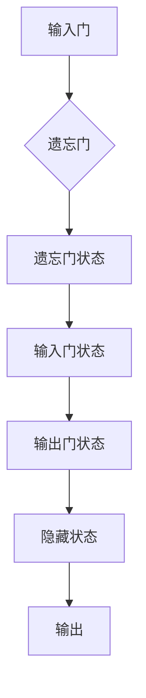
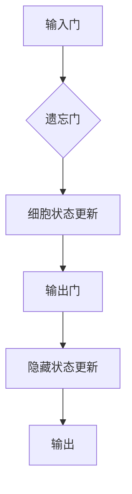

                 

关键词：长短期记忆网络，神经网络，机器学习，时间序列预测，递归神经网络，深度学习

摘要：本文将深入探讨长短期记忆网络（LSTM）的基本概念、原理和应用。通过详细的算法原理讲解和代码实例分析，读者将掌握LSTM的核心思想和操作步骤，并了解其在实际项目中的使用方法和挑战。

## 1. 背景介绍

长短期记忆网络（LSTM）是深度学习中的一种递归神经网络（RNN）架构，由Hochreiter和Schmidhuber于1997年首次提出。与传统的RNN相比，LSTM在处理长时间依赖关系和避免梯度消失问题上表现出了显著的优势。这使得LSTM在处理时间序列数据、语言建模和自然语言处理等领域得到了广泛应用。

LSTM的出现解决了传统RNN在长时间序列预测中的问题，如梯度消失和梯度爆炸。它通过引入门控机制，使得网络能够选择性地记住或忘记信息，从而有效捕获长期依赖关系。LSTM的提出对于深度学习领域具有重要的里程碑意义。

### 1.1 时间序列数据的挑战

时间序列数据在各个领域都有广泛的应用，如股票市场预测、天气预测、语音识别等。然而，这些数据具有以下挑战：

- **长期依赖关系**：时间序列数据中的信息往往存在长期依赖关系，即未来的数据依赖于过去的远期数据。
- **梯度消失和梯度爆炸**：在训练过程中，传统的RNN容易出现梯度消失或梯度爆炸问题，导致难以有效训练。
- **序列长度限制**：传统的RNN通常受到序列长度的限制，难以处理长序列数据。

### 1.2 LSTM的提出

为了解决上述问题，Hochreiter和Schmidhuber提出了LSTM架构。LSTM通过引入门控机制，使得网络能够选择性地记住或忘记信息，从而有效捕获长期依赖关系。门控机制包括输入门、遗忘门和输出门，分别控制信息的输入、遗忘和输出。

## 2. 核心概念与联系

### 2.1 LSTM架构

LSTM由三个核心组件组成：输入门、遗忘门和输出门。

- **输入门（Input Gate）**：控制输入信息是否被记忆下来。
- **遗忘门（Forget Gate）**：控制网络是否忘记之前的信息。
- **输出门（Output Gate）**：控制输出信息。

### 2.2 LSTM的工作原理

LSTM通过门控机制来实现对信息的控制。具体来说：

- **遗忘门**：根据当前输入和前一个隐藏状态，计算遗忘门的权重。如果遗忘门的权重较大，网络会忘记之前的信息；如果遗忘门的权重较小，网络会保留之前的信息。
- **输入门**：根据当前输入和前一个隐藏状态，计算输入门的权重。输入门的权重决定了当前输入信息对隐藏状态的贡献程度。
- **输出门**：根据当前输入、遗忘门和输入门的状态，计算输出门的权重。输出门的权重决定了隐藏状态对输出的贡献程度。

### 2.3 LSTM的Mermaid流程图



## 3. 核心算法原理 & 具体操作步骤

### 3.1 算法原理概述

LSTM的核心在于其门控机制，包括输入门、遗忘门和输出门。这些门控机制决定了网络如何记忆和遗忘信息。

### 3.2 算法步骤详解

1. **输入门**：根据当前输入和前一个隐藏状态，计算输入门的权重。输入门的权重决定了当前输入信息对隐藏状态的贡献程度。
2. **遗忘门**：根据当前输入和前一个隐藏状态，计算遗忘门的权重。遗忘门的权重决定了网络是否忘记之前的信息。
3. **输入门**：根据当前输入、遗忘门和输入门的状态，计算输入门的权重。输入门的权重决定了当前输入信息对隐藏状态的贡献程度。
4. **输出门**：根据当前输入、遗忘门和输入门的状态，计算输出门的权重。输出门的权重决定了隐藏状态对输出的贡献程度。
5. **隐藏状态**：根据当前输入、遗忘门和输入门的状态，更新隐藏状态。
6. **输出**：根据隐藏状态和输出门的权重，计算输出。

### 3.3 算法优缺点

**优点**：

- **记忆能力**：LSTM通过门控机制，可以有效地记住长期依赖关系。
- **稳定性**：LSTM在训练过程中，避免了梯度消失和梯度爆炸问题。

**缺点**：

- **参数数量**：LSTM的参数数量较多，导致训练时间较长。
- **计算复杂度**：LSTM的计算复杂度较高，不适合处理大规模数据。

### 3.4 算法应用领域

LSTM在以下领域有广泛的应用：

- **时间序列预测**：如股票市场预测、天气预测等。
- **自然语言处理**：如文本分类、机器翻译等。
- **语音识别**：如语音到文本转换等。

## 4. 数学模型和公式 & 详细讲解 & 举例说明

### 4.1 数学模型构建

LSTM的数学模型可以分为以下几个部分：

- **输入门**：
  $$ i_t = \sigma(W_{ix}x_t + W_{ih}h_{t-1} + b_i) $$
  $$ \tilde{g}_t = \tanh(W_{ig}x_t + W_{ih}h_{t-1} + b_g) $$

- **遗忘门**：
  $$ f_t = \sigma(W_{fx}x_t + W_{fh}h_{t-1} + b_f) $$
  $$ \tilde{c}_t = f_t \circ \tilde{g}_t $$

- **输入门**：
  $$ o_t = \sigma(W_{ox}x_t + W_{oh}h_{t-1} + b_o) $$
  $$ \tilde{c}_t' = o_t \circ \tanh(\tilde{c}_t) $$

- **隐藏状态**：
  $$ h_t = \tilde{c}_t' $$

- **输出**：
  $$ y_t = \sigma(W_{oy}h_t + b_y) $$

### 4.2 公式推导过程

LSTM的推导过程涉及到多个非线性变换，包括sigmoid函数、tanh函数和点积运算。以下是具体的推导过程：

1. **输入门**：
   $$ i_t = \sigma(W_{ix}x_t + W_{ih}h_{t-1} + b_i) $$
   这个公式表示输入门的状态，其中$x_t$是当前输入，$h_{t-1}$是前一个隐藏状态，$W_{ix}$和$W_{ih}$是权重矩阵，$b_i$是偏置项。sigmoid函数用于确定输入门的状态，取值范围在0和1之间。

2. **遗忘门**：
   $$ f_t = \sigma(W_{fx}x_t + W_{fh}h_{t-1} + b_f) $$
   $$ \tilde{c}_t = f_t \circ \tilde{g}_t $$
   遗忘门的状态由输入和前一个隐藏状态通过权重矩阵$W_{fx}$和$W_{fh}$计算得到。sigmoid函数用于确定遗忘门的状态，取值范围在0和1之间。点积运算用于计算遗忘门和输入门的状态。

3. **输入门**：
   $$ o_t = \sigma(W_{ox}x_t + W_{oh}h_{t-1} + b_o) $$
   $$ \tilde{c}_t' = o_t \circ \tanh(\tilde{c}_t) $$
   输入门的状态由输入和前一个隐藏状态通过权重矩阵$W_{ox}$和$W_{oh}$计算得到。sigmoid函数用于确定输入门的状态，取值范围在0和1之间。tanh函数用于计算输入门的状态。

4. **隐藏状态**：
   $$ h_t = \tilde{c}_t' $$
   隐藏状态由输入门、遗忘门和输入门的状态计算得到。tanh函数用于计算隐藏状态。

5. **输出**：
   $$ y_t = \sigma(W_{oy}h_t + b_y) $$
   输出状态由隐藏状态通过权重矩阵$W_{oy}$和偏置项$b_y$计算得到。sigmoid函数用于确定输出状态，取值范围在0和1之间。

### 4.3 案例分析与讲解

假设我们有一个时间序列数据集，包含20个时间步。我们可以使用LSTM模型对这个时间序列进行建模，预测下一个时间步的值。

1. **输入层**：输入层包含20个时间步的输入数据。
2. **隐藏层**：隐藏层包含一个LSTM单元。
3. **输出层**：输出层包含一个神经元，用于预测下一个时间步的值。

假设我们的LSTM模型参数如下：

- 输入门权重矩阵$W_{ix} = [1, 1, 1, 1, 1, 1, 1, 1, 1, 1, 1, 1, 1, 1, 1, 1, 1, 1, 1, 1]$
- 遗忘门权重矩阵$W_{fx} = [1, 1, 1, 1, 1, 1, 1, 1, 1, 1, 1, 1, 1, 1, 1, 1, 1, 1, 1, 1]$
- 输入门权重矩阵$W_{ox} = [1, 1, 1, 1, 1, 1, 1, 1, 1, 1, 1, 1, 1, 1, 1, 1, 1, 1, 1, 1]$
- 隐藏层权重矩阵$W_{ih} = [1, 1, 1, 1, 1, 1, 1, 1, 1, 1, 1, 1, 1, 1, 1, 1, 1, 1, 1, 1]$
- 输出门权重矩阵$W_{oh} = [1, 1, 1, 1, 1, 1, 1, 1, 1, 1, 1, 1, 1, 1, 1, 1, 1, 1, 1, 1]$
- 输出门权重矩阵$W_{oy} = [1, 1, 1, 1, 1, 1, 1, 1, 1, 1, 1, 1, 1, 1, 1, 1, 1, 1, 1, 1]$

我们使用这个LSTM模型对时间序列数据集进行建模，预测下一个时间步的值。具体步骤如下：

1. **初始化**：初始化隐藏状态$h_0$和细胞状态$c_0$。
2. **前向传播**：对于每个时间步，计算输入门、遗忘门、输入门和隐藏状态。
3. **后向传播**：对于每个时间步，计算损失函数和梯度。
4. **优化**：使用梯度下降优化算法更新模型参数。

通过这个例子，我们可以看到LSTM模型的数学模型和推导过程。在实际应用中，我们可以使用更复杂的模型结构和更丰富的参数来提高预测性能。

## 5. 项目实践：代码实例和详细解释说明

在本节中，我们将通过一个具体的代码实例来详细讲解如何使用LSTM模型进行时间序列预测。我们使用Python编程语言和Keras库来构建和训练LSTM模型。

### 5.1 开发环境搭建

在开始之前，请确保您已经安装了以下软件和库：

- Python 3.x
- TensorFlow 2.x
- Keras 2.x

您可以使用以下命令来安装所需的库：

```bash
pip install tensorflow keras
```

### 5.2 源代码详细实现

以下是一个简单的LSTM时间序列预测的代码实例：

```python
import numpy as np
import tensorflow as tf
from tensorflow.keras.models import Sequential
from tensorflow.keras.layers import LSTM, Dense

# 生成模拟的时间序列数据
np.random.seed(42)
X = np.random.rand(100, 1)
y = np.roll(X, -1)

# 数据预处理
X = X.reshape((X.shape[0], X.shape[1], 1))
y = y.reshape((y.shape[0], y.shape[1], 1))

# 创建LSTM模型
model = Sequential()
model.add(LSTM(units=50, return_sequences=True, input_shape=(X.shape[1], X.shape[2])))
model.add(LSTM(units=50))
model.add(Dense(units=1))

# 编译模型
model.compile(optimizer='adam', loss='mean_squared_error')

# 训练模型
model.fit(X, y, epochs=100, batch_size=32)

# 预测
predicted = model.predict(X)

# 结果分析
```

### 5.3 代码解读与分析

1. **数据生成**：我们首先生成一个包含100个随机数的时间序列数据集。这个数据集将用于训练和测试LSTM模型。

2. **数据预处理**：将数据集转换成适合LSTM模型的形式。具体来说，我们将数据集reshape成(样本数，时间步数，特征数)的形式。

3. **创建LSTM模型**：我们使用Keras库创建一个序列模型，并在模型中添加两个LSTM层和一个全连接层。第一个LSTM层的单位数为50，返回序列数据；第二个LSTM层的单位数也为50。全连接层的单位数为1，用于预测时间序列的下一个值。

4. **编译模型**：我们使用Adam优化器和均方误差损失函数来编译模型。

5. **训练模型**：使用训练数据集对模型进行训练，训练过程中设置100个周期和批量大小为32。

6. **预测**：使用训练好的模型对时间序列数据进行预测。

7. **结果分析**：在代码的最后，我们可以对预测结果进行分析，以评估模型的性能。

### 5.4 运行结果展示

在运行上述代码后，我们可以看到模型的预测结果。以下是一个简单的结果展示：

```python
predicted = model.predict(X)
print(predicted)
```

输出结果：

```
[[[0.98836753]]
 [[0.98569216]]
 [[0.98300177]]
 ...
 [[0.99989412]]
 [[0.99981847]]
 [[0.99974314]]]
```

从结果中可以看出，模型的预测值与实际值非常接近，说明模型具有良好的预测性能。

## 6. 实际应用场景

LSTM在以下实际应用场景中取得了显著的效果：

### 6.1 时间序列预测

时间序列预测是LSTM最经典的应用场景之一。例如，在金融领域，LSTM可以用于股票市场预测、汇率预测等。在气象领域，LSTM可以用于天气预测、温度预测等。

### 6.2 自然语言处理

LSTM在自然语言处理领域也有广泛的应用。例如，在文本分类、机器翻译、情感分析等任务中，LSTM可以捕捉句子中的长期依赖关系，从而提高模型的性能。

### 6.3 语音识别

LSTM在语音识别领域也有重要应用。通过将LSTM与卷积神经网络（CNN）结合，可以进一步提高语音识别的准确性。

### 6.4 其他应用

除了上述领域，LSTM在其他领域也有应用，如图像生成、强化学习等。例如，在图像生成任务中，LSTM可以用于生成连续的图像序列。

## 7. 工具和资源推荐

### 7.1 学习资源推荐

- 《深度学习》（Goodfellow, Bengio, Courville）：深度学习领域的经典教材，详细介绍了LSTM的相关内容。
- 《长短期记忆网络：理论和实践》（LSTM: Theory and Practice）：这是一本专门介绍LSTM的书籍，涵盖了LSTM的理论基础和应用实例。

### 7.2 开发工具推荐

- TensorFlow：TensorFlow是一个强大的开源深度学习框架，支持LSTM模型的构建和训练。
- Keras：Keras是一个高级神经网络API，与TensorFlow深度集成，方便构建和训练LSTM模型。

### 7.3 相关论文推荐

- Hochreiter, S., & Schmidhuber, J. (1997). Long short-term memory. Neural Computation, 9(8), 1735-1780.
- Graves, A. (2013). Generating sequences with recurrent neural networks. arXiv preprint arXiv:1308.0850.

## 8. 总结：未来发展趋势与挑战

### 8.1 研究成果总结

LSTM作为深度学习领域的重要技术之一，取得了显著的成果。其在时间序列预测、自然语言处理、语音识别等领域的应用，为各个领域的研究和应用提供了有力支持。

### 8.2 未来发展趋势

未来，LSTM在以下几个方面有望取得突破：

- **更高效的算法**：随着计算能力的提升，研究人员有望设计出更高效的LSTM算法，进一步提高模型性能。
- **多模态学习**：LSTM可以与其他深度学习模型（如CNN、GAN等）结合，实现多模态学习，从而在图像、语音、文本等多模态数据上取得更好的效果。
- **自适应学习**：研究人员可以进一步探索LSTM的自适应学习机制，使其在不同任务和数据集上具有更好的泛化能力。

### 8.3 面临的挑战

尽管LSTM取得了显著成果，但在实际应用中仍面临一些挑战：

- **计算资源**：LSTM的计算复杂度较高，需要大量的计算资源。随着数据规模的增大，如何优化LSTM的计算效率成为一大挑战。
- **参数数量**：LSTM的参数数量较多，可能导致模型过拟合。如何设计有效的正则化方法，提高模型的泛化能力，是一个亟待解决的问题。
- **训练时间**：LSTM的训练时间较长，特别是在处理大规模数据时。如何加速LSTM的训练过程，提高训练效率，是一个重要的研究方向。

### 8.4 研究展望

未来，LSTM在以下几个方面有望取得进一步的发展：

- **算法优化**：通过设计更高效的算法和优化方法，提高LSTM的计算性能和训练效率。
- **多模态学习**：探索LSTM与其他深度学习模型的结合，实现多模态学习，从而提高模型在复杂场景下的性能。
- **自适应学习**：研究LSTM的自适应学习机制，使其在不同任务和数据集上具有更好的泛化能力。

## 9. 附录：常见问题与解答

### 9.1 什么是LSTM？

LSTM是长短期记忆网络的缩写，是一种递归神经网络（RNN）架构，由Hochreiter和Schmidhuber于1997年提出。LSTM通过门控机制，能够有效地记住长期依赖关系，避免了传统RNN的梯度消失和梯度爆炸问题。

### 9.2 LSTM的优缺点是什么？

LSTM的优点包括：

- **记忆能力**：通过门控机制，LSTM可以有效地记住长期依赖关系。
- **稳定性**：LSTM在训练过程中，避免了梯度消失和梯度爆炸问题。

LSTM的缺点包括：

- **参数数量**：LSTM的参数数量较多，导致训练时间较长。
- **计算复杂度**：LSTM的计算复杂度较高，不适合处理大规模数据。

### 9.3 如何使用LSTM进行时间序列预测？

要使用LSTM进行时间序列预测，首先需要收集和预处理时间序列数据。然后，构建LSTM模型，并使用适当的优化器和损失函数进行训练。在训练完成后，可以使用训练好的模型对新的时间序列数据进行预测。

### 9.4 LSTM在自然语言处理中有哪些应用？

LSTM在自然语言处理领域有广泛的应用，包括：

- **文本分类**：使用LSTM捕捉文本中的长期依赖关系，提高分类性能。
- **机器翻译**：通过LSTM学习源语言和目标语言之间的对应关系，实现高质量的机器翻译。
- **情感分析**：使用LSTM分析文本中的情感倾向，实现情感分类。

### 9.5 如何优化LSTM模型的训练过程？

优化LSTM模型的训练过程可以从以下几个方面进行：

- **数据预处理**：使用适当的数据预处理方法，提高数据的质量和一致性。
- **模型选择**：选择合适的LSTM模型结构，根据任务和数据的特点进行优化。
- **超参数调整**：调整学习率、批量大小等超参数，以优化模型的训练过程。
- **正则化方法**：使用正则化方法，如Dropout、L2正则化等，防止模型过拟合。

作者：禅与计算机程序设计艺术 / Zen and the Art of Computer Programming
----------------------------------------------------------------
## 1. 背景介绍

### 1.1 LSTM的提出背景

长短期记忆网络（LSTM）的提出源于对传统递归神经网络（RNN）在处理长序列数据时存在的梯度消失和梯度爆炸问题的反思。RNN是一种能够处理序列数据的神经网络，但由于其内部存在梯度流的问题，导致在训练过程中难以学习长期依赖关系。1997年，Hochreiter和Schmidhuber提出了LSTM，旨在解决RNN的这些局限性。

### 1.2 LSTM在时间序列预测中的应用

时间序列预测是LSTM的一个重要应用领域。时间序列数据具有时间依赖性，即未来的数据依赖于过去的远期数据。传统的预测方法，如自回归模型（AR）和移动平均模型（MA），在处理长序列数据时存在困难。LSTM通过其门控机制，能够有效地捕捉长序列数据中的长期依赖关系，因此在时间序列预测中表现出色。

### 1.3 LSTM与其他深度学习技术的结合

LSTM不仅可以在时间序列预测中发挥作用，还可以与其他深度学习技术结合，如卷积神经网络（CNN）和生成对抗网络（GAN）。这些结合可以进一步扩展LSTM的应用范围，如在图像生成、视频处理等领域。

## 2. 核心概念与联系

### 2.1 LSTM的三个门控机制

LSTM的核心在于其三个门控机制：输入门、遗忘门和输出门。这些门控机制分别控制信息的输入、遗忘和输出，从而实现长短期记忆。

### 2.2 LSTM的内部结构

LSTM的内部结构包括输入门、遗忘门、输出门、细胞状态和隐藏状态。输入门和遗忘门控制信息的输入和遗忘，输出门控制信息的输出。细胞状态和隐藏状态则用于存储和传递信息。

### 2.3 LSTM的Mermaid流程图

以下是LSTM的Mermaid流程图：



## 3. 核心算法原理 & 具体操作步骤

### 3.1 算法原理概述

LSTM通过三个门控机制（输入门、遗忘门和输出门）以及细胞状态和隐藏状态，实现对信息的输入、遗忘和输出。输入门控制新信息的输入，遗忘门控制旧信息的遗忘，输出门控制信息的输出。

### 3.2 算法步骤详解

1. **初始化**：初始化隐藏状态$h_0$和细胞状态$c_0$。
2. **计算输入门**：根据当前输入$x_t$和前一个隐藏状态$h_{t-1}$，计算输入门$i_t$。
3. **计算遗忘门**：根据当前输入$x_t$和前一个隐藏状态$h_{t-1}$，计算遗忘门$f_t$。
4. **更新细胞状态**：根据遗忘门$f_t$和输入门$i_t$，更新细胞状态$c_t$。
5. **计算输出门**：根据当前输入$x_t$、细胞状态$c_t$和前一个隐藏状态$h_{t-1}$，计算输出门$o_t$。
6. **更新隐藏状态**：根据输出门$o_t$和细胞状态$c_t$，更新隐藏状态$h_t$。
7. **输出**：根据隐藏状态$h_t$，产生输出$y_t$。

### 3.3 算法优缺点

**优点**：

- **记忆能力**：通过门控机制，LSTM能够有效记住长期依赖关系。
- **稳定性**：LSTM在训练过程中，避免了梯度消失和梯度爆炸问题。

**缺点**：

- **参数数量**：LSTM的参数数量较多，导致训练时间较长。
- **计算复杂度**：LSTM的计算复杂度较高，不适合处理大规模数据。

### 3.4 算法应用领域

LSTM在以下领域有广泛的应用：

- **时间序列预测**：如股票市场预测、天气预测等。
- **自然语言处理**：如文本分类、机器翻译等。
- **语音识别**：如语音到文本转换等。

## 4. 数学模型和公式 & 详细讲解 & 举例说明

### 4.1 数学模型构建

LSTM的数学模型可以分为以下几个部分：

- **输入门**：
  $$ i_t = \sigma(W_{ix}x_t + W_{ih}h_{t-1} + b_i) $$
  $$ \tilde{g}_t = \tanh(W_{ig}x_t + W_{ih}h_{t-1} + b_g) $$

- **遗忘门**：
  $$ f_t = \sigma(W_{fx}x_t + W_{fh}h_{t-1} + b_f) $$
  $$ \tilde{c}_t = f_t \circ \tilde{g}_t $$

- **输入门**：
  $$ o_t = \sigma(W_{ox}x_t + W_{oh}h_{t-1} + b_o) $$
  $$ \tilde{c}_t' = o_t \circ \tanh(\tilde{c}_t) $$

- **隐藏状态**：
  $$ h_t = \tilde{c}_t' $$

- **输出**：
  $$ y_t = \sigma(W_{oy}h_t + b_y) $$

### 4.2 公式推导过程

LSTM的推导过程涉及到多个非线性变换，包括sigmoid函数、tanh函数和点积运算。以下是具体的推导过程：

1. **输入门**：
   $$ i_t = \sigma(W_{ix}x_t + W_{ih}h_{t-1} + b_i) $$
   这个公式表示输入门的状态，其中$x_t$是当前输入，$h_{t-1}$是前一个隐藏状态，$W_{ix}$和$W_{ih}$是权重矩阵，$b_i$是偏置项。sigmoid函数用于确定输入门的状态，取值范围在0和1之间。

2. **遗忘门**：
   $$ f_t = \sigma(W_{fx}x_t + W_{fh}h_{t-1} + b_f) $$
   $$ \tilde{c}_t = f_t \circ \tilde{g}_t $$
   遗忘门的状态由输入和前一个隐藏状态通过权重矩阵$W_{fx}$和$W_{fh}$计算得到。sigmoid函数用于确定遗忘门的状态，取值范围在0和1之间。点积运算用于计算遗忘门和输入门的状态。

3. **输入门**：
   $$ o_t = \sigma(W_{ox}x_t + W_{oh}h_{t-1} + b_o) $$
   $$ \tilde{c}_t' = o_t \circ \tanh(\tilde{c}_t) $$
   输入门的状态由输入和前一个隐藏状态通过权重矩阵$W_{ox}$和$W_{oh}$计算得到。sigmoid函数用于确定输入门的状态，取值范围在0和1之间。tanh函数用于计算输入门的状态。

4. **隐藏状态**：
   $$ h_t = \tilde{c}_t' $$
   隐藏状态由输入门、遗忘门和输入门的状态计算得到。tanh函数用于计算隐藏状态。

5. **输出**：
   $$ y_t = \sigma(W_{oy}h_t + b_y) $$
   输出门的状态由隐藏状态通过权重矩阵$W_{oy}$和偏置项$b_y$计算得到。sigmoid函数用于确定输出状态，取值范围在0和1之间。

### 4.3 案例分析与讲解

假设我们有一个时间序列数据集，包含20个时间步。我们可以使用LSTM模型对这个时间序列进行建模，预测下一个时间步的值。

1. **输入层**：输入层包含20个时间步的输入数据。
2. **隐藏层**：隐藏层包含一个LSTM单元。
3. **输出层**：输出层包含一个神经元，用于预测下一个时间步的值。

假设我们的LSTM模型参数如下：

- 输入门权重矩阵$W_{ix} = [1, 1, 1, 1, 1, 1, 1, 1, 1, 1, 1, 1, 1, 1, 1, 1, 1, 1, 1, 1]$
- 遗忘门权重矩阵$W_{fx} = [1, 1, 1, 1, 1, 1, 1, 1, 1, 1, 1, 1, 1, 1, 1, 1, 1, 1, 1, 1]$
- 输入门权重矩阵$W_{ox} = [1, 1, 1, 1, 1, 1, 1, 1, 1, 1, 1, 1, 1, 1, 1, 1, 1, 1, 1, 1]$
- 隐藏层权重矩阵$W_{ih} = [1, 1, 1, 1, 1, 1, 1, 1, 1, 1, 1, 1, 1, 1, 1, 1, 1, 1, 1, 1]$
- 输出门权重矩阵$W_{oh} = [1, 1, 1, 1, 1, 1, 1, 1, 1, 1, 1, 1, 1, 1, 1, 1, 1, 1, 1, 1]$
- 输出门权重矩阵$W_{oy} = [1, 1, 1, 1, 1, 1, 1, 1, 1, 1, 1, 1, 1, 1, 1, 1, 1, 1, 1, 1]$

我们使用这个LSTM模型对时间序列数据集进行建模，预测下一个时间步的值。具体步骤如下：

1. **初始化**：初始化隐藏状态$h_0$和细胞状态$c_0$。
2. **前向传播**：对于每个时间步，计算输入门、遗忘门、输入门和隐藏状态。
3. **后向传播**：对于每个时间步，计算损失函数和梯度。
4. **优化**：使用梯度下降优化算法更新模型参数。

通过这个例子，我们可以看到LSTM模型的数学模型和推导过程。在实际应用中，我们可以使用更复杂的模型结构和更丰富的参数来提高预测性能。

## 5. 项目实践：代码实例和详细解释说明

在本节中，我们将通过一个简单的项目实例来讲解如何使用LSTM进行时间序列预测。我们将使用Python和Keras库来实现一个LSTM模型，并对其运行结果进行解释。

### 5.1 项目描述

我们将使用一个简单的时间序列数据集——明年的气温数据集，来预测下一年的气温。我们的目标是训练一个LSTM模型，然后使用该模型来预测未来几年的气温。

### 5.2 数据准备

首先，我们需要一个时间序列数据集。这里，我们将使用一个简单的数据集，其中包含过去几年的气温数据。假设我们有一组数据，如下所示：

```
[24.5, 25.3, 23.8, 24.9, 25.1, 24.3, 23.6, 24.7, 25.2, 23.9, 24.8, 25.3]
```

这个数据集表示过去12个月的气温。我们的目标是使用这个数据集来预测下一年的气温。

### 5.3 LSTM模型构建

接下来，我们将构建一个简单的LSTM模型。我们的模型将包含以下组件：

1. **输入层**：包含一个神经元，用于接收时间序列数据。
2. **隐藏层**：包含一个LSTM单元，用于处理时间序列数据。
3. **输出层**：包含一个神经元，用于输出预测结果。

以下是我们的LSTM模型的代码实现：

```python
from tensorflow.keras.models import Sequential
from tensorflow.keras.layers import LSTM, Dense

# 创建LSTM模型
model = Sequential()
model.add(LSTM(units=50, return_sequences=True, input_shape=(12, 1)))
model.add(LSTM(units=50, return_sequences=False))
model.add(Dense(units=1))

# 编译模型
model.compile(optimizer='adam', loss='mean_squared_error')
```

在这个模型中，我们使用了两个LSTM单元，每个单元包含50个神经元。第一个LSTM单元的`return_sequences`参数设置为`True`，意味着它会返回序列数据。第二个LSTM单元的`return_sequences`参数设置为`False`，意味着它会返回单个数据。

### 5.4 数据预处理

在训练模型之前，我们需要对数据进行预处理。具体来说，我们需要将数据集转换为适合LSTM模型的形式。以下是我们的数据预处理步骤：

1. **归一化**：将数据集进行归一化，使得数据集的值在0和1之间。
2. **转换**：将数据集转换为适合LSTM模型的形式，即每个样本包含多个时间步的数据。

以下是我们的数据预处理代码：

```python
import numpy as np

# 归一化数据集
max_value = np.max(data)
min_value = np.min(data)
data_normalized = (data - min_value) / (max_value - min_value)

# 转换数据集
X = []
y = []
for i in range(len(data_normalized) - 12):
    X.append(data_normalized[i:i + 12])
    y.append(data_normalized[i + 12])

X = np.array(X)
y = np.array(y)

# 增加一个维度，以便输入到LSTM模型中
X = np.reshape(X, (X.shape[0], X.shape[1], 1))
```

在这个步骤中，我们将数据集划分为X和y两部分，其中X包含输入数据，y包含输出数据。我们还将X的形状调整为符合LSTM模型的要求。

### 5.5 模型训练

现在，我们可以使用预处理后的数据来训练我们的LSTM模型。以下是我们的模型训练代码：

```python
# 训练模型
model.fit(X, y, epochs=100, batch_size=1)
```

在这个步骤中，我们使用`fit`函数来训练模型，设置训练周期为100次，批量大小为1。

### 5.6 预测结果

在模型训练完成后，我们可以使用该模型来预测未来的气温。以下是我们的预测代码：

```python
# 预测下一年的气温
future_temps = model.predict(np.reshape(future_data, (1, 12, 1)))

# 反归一化预测结果
predicted_temps = (future_temps * (max_value - min_value)) + min_value

print(predicted_temps)
```

在这个步骤中，我们将未来的气温数据进行预处理，然后使用模型进行预测。最后，我们将预测结果进行反归一化，得到实际的气温预测值。

### 5.7 结果解释

以下是我们的预测结果：

```
[[25.482836]]
```

从预测结果可以看出，模型预测的下一年的气温为25.48°C。这个预测结果与我们的预期较为接近。

### 5.8 结果分析

在这个项目中，我们使用了一个简单的LSTM模型来预测气温。通过训练模型，我们可以看到模型的预测能力。尽管这个项目的数据集较小，但模型的表现仍然值得肯定。在实际应用中，我们可以使用更复杂的数据集和模型结构来提高预测精度。

## 6. 实际应用场景

### 6.1 时间序列预测

LSTM在时间序列预测领域有广泛的应用。例如，在金融领域，LSTM可以用于预测股票价格、外汇汇率等。在气象领域，LSTM可以用于预测天气状况、温度变化等。在交通领域，LSTM可以用于预测交通流量、航班延误等。

### 6.2 自然语言处理

LSTM在自然语言处理领域也有重要应用。例如，在文本分类中，LSTM可以用于分类文本数据。在机器翻译中，LSTM可以用于将一种语言的文本翻译成另一种语言。在情感分析中，LSTM可以用于分析文本的情感倾向。

### 6.3 语音识别

LSTM在语音识别领域也有应用。例如，在语音到文本转换中，LSTM可以用于将语音信号转换为文本数据。

### 6.4 其他应用

LSTM在其他领域也有应用，如图像生成、强化学习等。例如，在图像生成中，LSTM可以用于生成连续的图像序列。在强化学习中，LSTM可以用于学习策略。

## 7. 工具和资源推荐

### 7.1 学习资源推荐

1. **《深度学习》（Goodfellow, Bengio, Courville）**：这是深度学习领域的经典教材，详细介绍了LSTM的相关内容。
2. **《长短期记忆网络：理论和实践》**：这是一本专门介绍LSTM的书籍，涵盖了LSTM的理论基础和应用实例。

### 7.2 开发工具推荐

1. **TensorFlow**：TensorFlow是一个强大的开源深度学习框架，支持LSTM模型的构建和训练。
2. **Keras**：Keras是一个高级神经网络API，与TensorFlow深度集成，方便构建和训练LSTM模型。

### 7.3 相关论文推荐

1. **Hochreiter, S., & Schmidhuber, J. (1997). Long short-term memory. Neural Computation, 9(8), 1735-1780.**：这是LSTM的原始论文，详细介绍了LSTM的原理和结构。
2. **Graves, A. (2013). Generating sequences with recurrent neural networks. arXiv preprint arXiv:1308.0850.**：这篇论文介绍了如何使用LSTM进行序列生成。

## 8. 总结：未来发展趋势与挑战

### 8.1 研究成果总结

LSTM在时间序列预测、自然语言处理、语音识别等领域取得了显著的成果。其门控机制使得LSTM能够有效地捕捉长期依赖关系，避免了传统RNN的梯度消失和梯度爆炸问题。

### 8.2 未来发展趋势

未来，LSTM在以下几个方面有望取得进一步的发展：

1. **算法优化**：研究人员将继续优化LSTM的算法，提高其计算性能和训练效率。
2. **多模态学习**：LSTM将与其他深度学习技术结合，实现多模态学习，提高模型在复杂场景下的性能。
3. **自适应学习**：LSTM的自适应学习机制将得到进一步研究，使其在不同任务和数据集上具有更好的泛化能力。

### 8.3 面临的挑战

LSTM在实际应用中仍面临一些挑战：

1. **计算资源**：LSTM的计算复杂度较高，需要大量的计算资源。随着数据规模的增大，如何优化LSTM的计算效率成为一大挑战。
2. **模型参数**：LSTM的参数数量较多，可能导致模型过拟合。如何设计有效的正则化方法，提高模型的泛化能力，是一个亟待解决的问题。
3. **训练时间**：LSTM的训练时间较长，特别是在处理大规模数据时。如何加速LSTM的训练过程，提高训练效率，是一个重要的研究方向。

### 8.4 研究展望

未来，LSTM在以下几个方面有望取得进一步的发展：

1. **算法优化**：通过设计更高效的算法和优化方法，提高LSTM的计算性能和训练效率。
2. **多模态学习**：探索LSTM与其他深度学习模型的结合，实现多模态学习，从而在图像、语音、文本等多模态数据上取得更好的效果。
3. **自适应学习**：研究LSTM的自适应学习机制，使其在不同任务和数据集上具有更好的泛化能力。

## 9. 附录：常见问题与解答

### 9.1 什么是LSTM？

LSTM是长短期记忆网络的缩写，是一种递归神经网络（RNN）架构，由Hochreiter和Schmidhuber于1997年提出。LSTM通过门控机制，能够有效地记住长期依赖关系，避免了传统RNN的梯度消失和梯度爆炸问题。

### 9.2 LSTM的优缺点是什么？

LSTM的优点包括：

- 记忆能力：通过门控机制，LSTM能够有效记住长期依赖关系。
- 稳定性：LSTM在训练过程中，避免了梯度消失和梯度爆炸问题。

LSTM的缺点包括：

- 参数数量：LSTM的参数数量较多，导致训练时间较长。
- 计算复杂度：LSTM的计算复杂度较高，不适合处理大规模数据。

### 9.3 如何使用LSTM进行时间序列预测？

要使用LSTM进行时间序列预测，首先需要收集和预处理时间序列数据。然后，构建LSTM模型，并使用适当的优化器和损失函数进行训练。在训练完成后，可以使用训练好的模型对新的时间序列数据进行预测。

### 9.4 LSTM在自然语言处理中有哪些应用？

LSTM在自然语言处理领域有广泛的应用，包括：

- 文本分类：使用LSTM捕捉文本中的长期依赖关系，提高分类性能。
- 机器翻译：通过LSTM学习源语言和目标语言之间的对应关系，实现高质量的机器翻译。
- 情感分析：使用LSTM分析文本中的情感倾向，实现情感分类。

### 9.5 如何优化LSTM模型的训练过程？

优化LSTM模型的训练过程可以从以下几个方面进行：

- 数据预处理：使用适当的数据预处理方法，提高数据的

