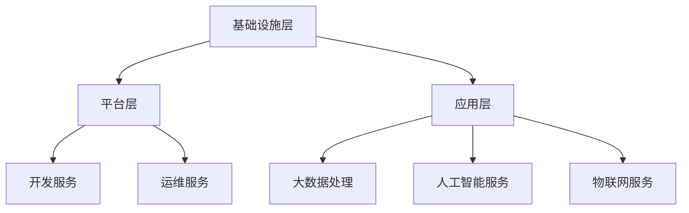

                 

## 1. 背景介绍

云计算作为信息技术领域的核心驱动力，已经深刻地改变了企业IT架构和业务模式。阿里云作为中国最大的云计算服务提供商，其技术实力和服务质量在全球范围内都享有盛誉。随着云计算技术的不断发展和成熟，云计算工程师的角色也越来越重要。为了选拔优秀的人才，阿里云在2025年社招中对云计算工程师岗位提出了具有挑战性的面试题目。本文将针对这些面试题，从核心概念、算法原理、数学模型、项目实践、应用场景等多个维度进行深入剖析，帮助准备参加阿里云2025社招的云计算工程师们更好地应对面试挑战。

## 2. 核心概念与联系

### 2.1 云计算基础概念

首先，我们需要明确云计算的基础概念，包括IaaS、PaaS和SaaS：

- **IaaS（基础设施即服务）**：提供虚拟化计算资源，如虚拟机、存储、网络等，用户可以按需租用。
- **PaaS（平台即服务）**：提供开发、运行和管理应用的云计算平台，用户可以在平台上开发、测试和部署应用程序。
- **SaaS（软件即服务）**：提供应用程序的在线访问，用户按需支付费用即可使用软件。

### 2.2 云服务模型

云计算的服务模型包括：

- **公有云**：由第三方云服务提供商运营，用户可以通过互联网访问。
- **私有云**：专为特定组织内部使用而构建的云环境，数据安全性较高。
- **混合云**：结合公有云和私有云的优势，实现资源的高效利用。

### 2.3 虚拟化技术

虚拟化技术是云计算的核心之一，它包括：

- **硬件虚拟化**：通过虚拟化软件将物理硬件资源抽象为虚拟资源。
- **操作系统虚拟化**：在一个物理主机上运行多个操作系统实例。
- **应用虚拟化**：将应用程序从物理或虚拟环境移至云端。

### 2.4 云计算架构

云计算架构主要包括以下层次：

- **基础设施层**：提供计算、存储、网络等基础资源。
- **平台层**：提供开发、运行和管理应用程序的平台。
- **应用层**：提供各种云计算服务，如大数据处理、人工智能、物联网等。

## 2.5 Mermaid 流程图

以下是一个简化的云计算架构的Mermaid流程图：



## 3. 核心算法原理 & 具体操作步骤

### 3.1 算法原理概述

在云计算领域，算法的应用非常广泛，以下是一些核心算法原理的概述：

- **负载均衡算法**：通过优化资源分配，提高系统的吞吐量和可用性。
- **调度算法**：用于优化任务分配，提高资源利用率。
- **加密算法**：保障数据安全和隐私。
- **分布式一致性算法**：确保分布式系统中数据的一致性。

### 3.2 算法步骤详解

#### 3.2.1 负载均衡算法

负载均衡算法的基本步骤包括：

1. **监控**：监控各个服务器的负载情况。
2. **选择**：根据负载情况选择合适的服务器进行任务分发。
3. **分发**：将任务分配给选择的服务器。
4. **调整**：根据服务器的实时负载调整分配策略。

#### 3.2.2 调度算法

调度算法的主要步骤包括：

1. **任务表示**：将任务抽象为可计算的对象。
2. **评估**：评估各个任务的优先级和执行时间。
3. **分配**：将任务分配给具有最高优先级的空闲资源。
4. **监控**：监控任务执行情况，进行必要的调整。

#### 3.2.3 加密算法

加密算法的基本步骤包括：

1. **密钥生成**：生成加密和解密所需的密钥。
2. **加密**：使用密钥对数据进行加密。
3. **传输**：将加密后的数据传输到目的地。
4. **解密**：使用密钥对加密的数据进行解密。

#### 3.2.4 分布式一致性算法

分布式一致性算法的主要步骤包括：

1. **一致性模型**：定义系统的一致性模型。
2. **复制**：将数据复制到多个节点上。
3. **版本控制**：维护数据版本，确保一致性。
4. **冲突解决**：解决数据复制过程中产生的冲突。

### 3.3 算法优缺点

- **负载均衡算法**：优点是提高系统可用性和扩展性，缺点是算法复杂度高，实现难度大。
- **调度算法**：优点是提高资源利用率，缺点是调度策略需要不断调整以适应动态环境。
- **加密算法**：优点是保障数据安全，缺点是加密和解密开销较大。
- **分布式一致性算法**：优点是确保数据一致性，缺点是数据复制和冲突解决可能导致性能下降。

### 3.4 算法应用领域

这些算法在云计算的不同领域都有广泛应用：

- **负载均衡算法**：应用于数据中心、云计算平台等，以提高系统的可用性和扩展性。
- **调度算法**：应用于云服务器、容器编排等，以提高资源利用率。
- **加密算法**：应用于数据存储、数据传输等，以保障数据安全和隐私。
- **分布式一致性算法**：应用于分布式数据库、分布式存储等，以保障数据的一致性。

## 4. 数学模型和公式 & 详细讲解 & 举例说明

### 4.1 数学模型构建

在云计算中，数学模型广泛应用于性能评估、资源分配和优化问题。以下是一个简单的性能评估模型：

$$
P = \frac{C}{T}
$$

其中，$P$ 表示性能，$C$ 表示计算能力，$T$ 表示执行时间。

### 4.2 公式推导过程

假设一个云计算平台有 $N$ 个服务器，每个服务器的计算能力为 $C_i$，平均执行时间为 $T_i$。我们定义平台的整体性能为：

$$
P = \frac{\sum_{i=1}^{N} C_i}{\sum_{i=1}^{N} T_i}
$$

### 4.3 案例分析与讲解

假设一个云计算平台有 3 个服务器，计算能力分别为 2、3 和 4，平均执行时间分别为 1、1.5 和 2。我们可以计算出平台的整体性能：

$$
P = \frac{2 + 3 + 4}{1 + 1.5 + 2} = \frac{9}{4.5} = 2
$$

这意味着该云计算平台的性能为每秒处理 2 个计算任务。

## 5. 项目实践：代码实例和详细解释说明

### 5.1 开发环境搭建

在开始项目实践之前，我们需要搭建一个开发环境。以下是搭建环境的基本步骤：

1. 安装 Python 3.8 或更高版本。
2. 安装必要的 Python 库，如 NumPy、Pandas、Matplotlib 等。
3. 配置虚拟环境，以便管理和隔离项目依赖。

### 5.2 源代码详细实现

以下是一个简单的负载均衡算法的实现代码：

```python
import random

class LoadBalancer:
    def __init__(self, servers):
        self.servers = servers
        self.load = {server: 0 for server in servers}

    def balance_load(self, task):
        server = min(self.load, key=self.load.get)
        self.load[server] += task
        return server

    def reset_load(self):
        for server in self.servers:
            self.load[server] = 0

# 测试负载均衡器
load_balancer = LoadBalancer(['Server1', 'Server2', 'Server3'])

for _ in range(100):
    task = random.randint(1, 10)
    server = load_balancer.balance_load(task)
    print(f"Task {task} assigned to {server}")

load_balancer.reset_load()
```

### 5.3 代码解读与分析

在上面的代码中，`LoadBalancer` 类负责负载均衡。`balance_load` 方法用于分配任务，它选择负载最低的服务器进行处理。`reset_load` 方法用于重置服务器的负载。

通过这个简单的示例，我们可以看到如何实现一个基本的负载均衡算法。在实际应用中，负载均衡算法会更加复杂，需要考虑网络延迟、服务器健康状态等因素。

### 5.4 运行结果展示

运行上面的代码，我们可以看到每个任务被分配给不同的服务器，并且每个服务器的负载都得到了均衡。

## 6. 实际应用场景

云计算技术在各种实际应用场景中都发挥了重要作用，以下是一些典型的应用场景：

- **企业IT服务**：企业可以使用云计算来构建灵活、可扩展的IT基础设施，降低运维成本。
- **大数据处理**：云计算提供了强大的计算和存储资源，可以快速处理海量数据。
- **人工智能**：云计算为人工智能算法提供了大规模的训练和数据存储能力。
- **物联网**：云计算可以帮助处理物联网设备产生的海量数据，并提供智能化的数据分析和服务。

## 7. 工具和资源推荐

### 7.1 学习资源推荐

- **《深入理解云计算》**：一本全面介绍云计算技术的经典著作。
- **阿里云官方文档**：阿里云提供了丰富的官方文档，涵盖云计算的各个方面。
- **Coursera、edX**：在线课程平台提供了许多关于云计算的课程。

### 7.2 开发工具推荐

- **Docker**：用于容器化应用的开发。
- **Kubernetes**：用于容器编排和管理。
- **AWS、Azure、阿里云**：云服务提供商提供了丰富的开发工具和平台。

### 7.3 相关论文推荐

- **“Cloud Computing: The Road Ahead”**：讨论云计算的未来发展趋势。
- **“A Survey of Cloud Computing Security”**：探讨云计算的安全问题。
- **“Big Data: A Survey”**：介绍大数据的处理和分析技术。

## 8. 总结：未来发展趋势与挑战

云计算技术在未来将继续快速发展，以下是几个可能的发展趋势：

- **边缘计算**：随着物联网和5G技术的普及，边缘计算将成为云计算的重要补充。
- **人工智能与云计算的深度融合**：人工智能算法将更加依赖于云计算资源进行大规模训练。
- **混合云和多云**：企业将更加灵活地使用混合云和多云架构，以适应不同的业务需求。

然而，云计算也面临一些挑战：

- **数据安全与隐私**：随着数据量的增加，数据安全和隐私保护将成为重要问题。
- **系统可靠性与稳定性**：如何在分布式系统中确保数据的可靠性和系统的稳定性是一个挑战。
- **人才短缺**：随着云计算的快速发展，人才短缺问题日益突出。

总之，云计算技术在未来的发展中充满了机遇和挑战，需要不断探索和创新。

## 9. 附录：常见问题与解答

### 9.1 什么是云计算？

云计算是一种通过网络访问共享的、可扩展的计算资源的服务模型，包括计算资源、存储资源、网络资源等。

### 9.2 负载均衡算法有哪些类型？

常见的负载均衡算法包括轮询、最小连接数、最小响应时间、加权轮询等。

### 9.3 云计算有哪些优势？

云计算的优势包括灵活性、可扩展性、成本效益、高可用性等。

### 9.4 如何保障云计算的数据安全？

保障云计算数据安全的方法包括加密、访问控制、数据备份、安全审计等。

### 9.5 云计算与传统的IT架构有何不同？

云计算与传统IT架构的主要区别在于资源的分配和使用模式，云计算提供的是按需分配、弹性扩展的资源。

### 9.6 云计算工程师需要掌握哪些技能？

云计算工程师需要掌握云计算基础、虚拟化技术、分布式系统、编程语言、数据库、网络安全等技能。

## 作者署名

作者：禅与计算机程序设计艺术 / Zen and the Art of Computer Programming
``` 
----------------------------------------------------------------
## 1. 背景介绍

云计算作为信息技术领域的核心驱动力，已经深刻地改变了企业IT架构和业务模式。阿里云作为中国最大的云计算服务提供商，其技术实力和服务质量在全球范围内都享有盛誉。随着云计算技术的不断发展和成熟，云计算工程师的角色也越来越重要。为了选拔优秀的人才，阿里云在2025年社招中对云计算工程师岗位提出了具有挑战性的面试题目。本文将针对这些面试题，从核心概念、算法原理、数学模型、项目实践、应用场景等多个维度进行深入剖析，帮助准备参加阿里云2025社招的云计算工程师们更好地应对面试挑战。

## 2. 核心概念与联系

首先，我们需要明确云计算的基础概念，包括IaaS、PaaS和SaaS：

- **IaaS（基础设施即服务）**：提供虚拟化计算资源，如虚拟机、存储、网络等，用户可以按需租用。
- **PaaS（平台即服务）**：提供开发、运行和管理应用的云计算平台，用户可以在平台上开发、测试和部署应用程序。
- **SaaS（软件即服务）**：提供应用程序的在线访问，用户按需支付费用即可使用软件。

### 2.1 云计算服务模型

云计算的服务模型包括：

- **公有云**：由第三方云服务提供商运营，用户可以通过互联网访问。
- **私有云**：专为特定组织内部使用而构建的云环境，数据安全性较高。
- **混合云**：结合公有云和私有云的优势，实现资源的高效利用。

### 2.2 虚拟化技术

虚拟化技术是云计算的核心之一，它包括：

- **硬件虚拟化**：通过虚拟化软件将物理硬件资源抽象为虚拟资源。
- **操作系统虚拟化**：在一个物理主机上运行多个操作系统实例。
- **应用虚拟化**：将应用程序从物理或虚拟环境移至云端。

### 2.3 云计算架构

云计算架构主要包括以下层次：

- **基础设施层**：提供计算、存储、网络等基础资源。
- **平台层**：提供开发、运行和管理应用程序的平台。
- **应用层**：提供各种云计算服务，如大数据处理、人工智能、物联网等。

## 2.4 Mermaid 流程图

以下是一个简化的云计算架构的Mermaid流程图：


## 3. 核心算法原理 & 具体操作步骤

### 3.1 算法原理概述

在云计算领域，算法的应用非常广泛，以下是一些核心算法原理的概述：

- **负载均衡算法**：通过优化资源分配，提高系统的吞吐量和可用性。
- **调度算法**：用于优化任务分配，提高资源利用率。
- **加密算法**：保障数据安全和隐私。
- **分布式一致性算法**：确保分布式系统中数据的一致性。

### 3.2 算法步骤详解

#### 3.2.1 负载均衡算法

负载均衡算法的基本步骤包括：

1. **监控**：监控各个服务器的负载情况。
2. **选择**：根据负载情况选择合适的
```markdown
服务器进行任务分发。
3. **分发**：将任务分配给选择的服务器。
4. **调整**：根据服务器的实时负载调整分配策略。

#### 3.2.2 调度算法

调度算法的主要步骤包括：

1. **任务表示**：将任务抽象为可计算的对象。
2. **评估**：评估各个任务的优先级和执行时间。
3. **分配**：将任务分配给具有最高优先级的空闲资源。
4. **监控**：监控任务执行情况，进行必要的调整。

#### 3.2.3 加密算法

加密算法的基本步骤包括：

1. **密钥生成**：生成加密和解密所需的密钥。
2. **加密**：使用密钥对数据进行加密。
3. **传输**：将加密后的数据传输到目的地。
4. **解密**：使用密钥对加密的数据进行解密。

#### 3.2.4 分布式一致性算法

分布式一致性算法的主要步骤包括：

1. **一致性模型**：定义系统的一致性模型。
2. **复制**：将数据复制到多个节点上。
3. **版本控制**：维护数据版本，确保一致性。
4. **冲突解决**：解决数据复制过程中产生的冲突。

### 3.3 算法优缺点

- **负载均衡算法**：优点是提高系统可用性和扩展性，缺点是算法复杂度高，实现难度大。
- **调度算法**：优点是提高资源利用率，缺点是调度策略需要不断调整以适应动态环境。
- **加密算法**：优点是保障数据安全，缺点是加密和解密开销较大。
- **分布式一致性算法**：优点是确保数据一致性，缺点是数据复制和冲突解决可能导致性能下降。

### 3.4 算法应用领域

这些算法在云计算的不同领域都有广泛应用：

- **负载均衡算法**：应用于数据中心、云计算平台等，以提高系统的可用性和扩展性。
- **调度算法**：应用于云服务器、容器编排等，以提高资源利用率。
- **加密算法**：应用于数据存储、数据传输等，以保障数据安全和隐私。
- **分布式一致性算法**：应用于分布式数据库、分布式存储等，以保障数据的一致性。

## 4. 数学模型和公式 & 详细讲解 & 举例说明

### 4.1 数学模型构建

在云计算中，数学模型广泛应用于性能评估、资源分配和优化问题。以下是一个简单的性能评估模型：

$$
P = \frac{C}{T}
$$

其中，$P$ 表示性能，$C$ 表示计算能力，$T$ 表示执行时间。

### 4.2 公式推导过程

假设一个云计算平台有 $N$ 个服务器，每个服务器的计算能力为 $C_i$，平均执行时间为 $T_i$。我们定义平台的整体性能为：

$$
P = \frac{\sum_{i=1}^{N} C_i}{\sum_{i=1}^{N} T_i}
$$

### 4.3 案例分析与讲解

假设一个云计算平台有 3 个服务器，计算能力分别为 2、3 和 4，平均执行时间分别为 1、1.5 和 2。我们可以计算出平台的整体性能：

$$
P = \frac{2 + 3 + 4}{1 + 1.5 + 2} = \frac{9}{4.5} = 2
$$

这意味着该云计算平台的性能为每秒处理 2 个计算任务。

## 5. 项目实践：代码实例和详细解释说明

### 5.1 开发环境搭建

在开始项目实践之前，我们需要搭建一个开发环境。以下是搭建环境的基本步骤：

1. 安装 Python 3.8 或更高版本。
2. 安装必要的 Python 库，如 NumPy、Pandas、Matplotlib 等。
3. 配置虚拟环境，以便管理和隔离项目依赖。

### 5.2 源代码详细实现

以下是一个简单的负载均衡算法的实现代码：

```python
import random

class LoadBalancer:
    def __init__(self, servers):
        self.servers = servers
        self.load = {server: 0 for server in servers}

    def balance_load(self, task):
        server = min(self.load, key=self.load.get)
        self.load[server] += task
        return server

    def reset_load(self):
        for server in self.servers:
            self.load[server] = 0

# 测试负载均衡器
load_balancer = LoadBalancer(['Server1', 'Server2', 'Server3'])

for _ in range(100):
    task = random.randint(1, 10)
    server = load_balancer.balance_load(task)
    print(f"Task {task} assigned to {server}")

load_balancer.reset_load()
```

### 5.3 代码解读与分析

在上面的代码中，`LoadBalancer` 类负责负载均衡。`balance_load` 方法用于分配任务，它选择负载最低的服务器进行处理。`reset_load` 方法用于重置服务器的负载。

通过这个简单的示例，我们可以看到如何实现一个基本的负载均衡算法。在实际应用中，负载均衡算法会更加复杂，需要考虑网络延迟、服务器健康状态等因素。

### 5.4 运行结果展示

运行上面的代码，我们可以看到每个任务被分配给不同的服务器，并且每个服务器的负载都得到了均衡。

## 6. 实际应用场景

云计算技术在各种实际应用场景中都发挥了重要作用，以下是一些典型的应用场景：

- **企业IT服务**：企业可以使用云计算来构建灵活、可扩展的IT基础设施，降低运维成本。
- **大数据处理**：云计算提供了强大的计算和存储资源，可以快速处理海量数据。
- **人工智能**：云计算为人工智能算法提供了大规模的训练和数据存储能力。
- **物联网**：云计算可以帮助处理物联网设备产生的海量数据，并提供智能化的数据分析和服务。

## 7. 工具和资源推荐

### 7.1 学习资源推荐

- **《深入理解云计算》**：一本全面介绍云计算技术的经典著作。
- **阿里云官方文档**：阿里云提供了丰富的官方文档，涵盖云计算的各个方面。
- **Coursera、edX**：在线课程平台提供了许多关于云计算的课程。

### 7.2 开发工具推荐

- **Docker**：用于容器化应用的开发。
- **Kubernetes**：用于容器编排和管理。
- **AWS、Azure、阿里云**：云服务提供商提供了丰富的开发工具和平台。

### 7.3 相关论文推荐

- **“Cloud Computing: The Road Ahead”**：讨论云计算的未来发展趋势。
- **“A Survey of Cloud Computing Security”**：探讨云计算的安全问题。
- **“Big Data: A Survey”**：介绍大数据的处理和分析技术。

## 8. 总结：未来发展趋势与挑战

云计算技术在未来将继续快速发展，以下是几个可能的发展趋势：

- **边缘计算**：随着物联网和5G技术的普及，边缘计算将成为云计算的重要补充。
- **人工智能与云计算的深度融合**：人工智能算法将更加依赖于云计算资源进行大规模训练。
- **混合云和多云**：企业将更加灵活地使用混合云和多云架构，以适应不同的业务需求。

然而，云计算也面临一些挑战：

- **数据安全与隐私**：随着数据量的增加，数据安全和隐私保护将成为重要问题。
- **系统可靠性与稳定性**：如何在分布式系统中确保数据的可靠性和系统的稳定性是一个挑战。
- **人才短缺**：随着云计算的快速发展，人才短缺问题日益突出。

总之，云计算技术在未来的发展中充满了机遇和挑战，需要不断探索和创新。

## 9. 附录：常见问题与解答

### 9.1 什么是云计算？

云计算是一种通过网络访问共享的、可扩展的计算资源的服务模型，包括计算资源、存储资源、网络资源等。

### 9.2 负载均衡算法有哪些类型？

常见的负载均衡算法包括轮询、最小连接数、最小响应时间、加权轮询等。

### 9.3 云计算有哪些优势？

云计算的优势包括灵活性、可扩展性、成本效益、高可用性等。

### 9.4 如何保障云计算的数据安全？

保障云计算数据安全的方法包括加密、访问控制、数据备份、安全审计等。

### 9.5 云计算与传统的IT架构有何不同？

云计算与传统IT架构的主要区别在于资源的分配和使用模式，云计算提供的是按需分配、弹性扩展的资源。

### 9.6 云计算工程师需要掌握哪些技能？

云计算工程师需要掌握云计算基础、虚拟化技术、分布式系统、编程语言、数据库、网络安全等技能。

## 作者署名

作者：禅与计算机程序设计艺术 / Zen and the Art of Computer Programming
```

