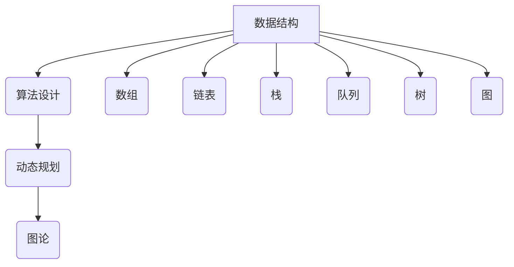

                 

在技术领域，面试是检验候选人技术能力和解决问题能力的重要手段。特别是在阿里巴巴这样的大型互联网公司，校招面试的高频算法题更是被广泛研究和练习的重点。本文旨在深入解析阿里巴巴2024届校招面试中出现的高频算法题，帮助读者更好地理解和掌握这些题目，为即将到来的面试做好充分准备。

## 关键词

- 阿里巴巴
- 校招
- 面试
- 算法题
- 解析

## 摘要

本文将围绕阿里巴巴2024届校招面试中出现的高频算法题展开讨论。通过分析这些题目的核心概念、算法原理、数学模型和实际应用，我们将提供详细的解题步骤和代码实例。此外，还将探讨这些算法题在现实世界的应用场景，以及未来的发展趋势和挑战。希望通过本文，读者能够对面试中的算法题有更深入的理解，提升自己的解题能力。

## 1. 背景介绍

阿里巴巴作为中国最大的电子商务公司，每年的校招面试都吸引了无数技术人才的关注。面试环节不仅考察应聘者的编程能力和算法基础，更注重解决问题的思维和团队合作能力。高频算法题在面试中占据重要地位，这些题目通常涵盖数据结构、算法设计、动态规划、图论等多个领域，是考察应聘者综合能力的重要指标。

本文将针对阿里巴巴2024届校招面试中出现的高频算法题进行系统解析，帮助读者在面试中更加自信地应对各种挑战。

### 1.1 面试流程概述

阿里巴巴的校招面试通常分为多个环节，包括在线测评、电话面试、现场面试等。在线测评主要考察应聘者的编程能力和算法基础，题目类型多样，涵盖从基础的数据结构到复杂的算法设计。电话面试和现场面试则更注重考察应聘者的逻辑思维、问题解决能力和团队合作精神。

### 1.2 高频算法题特点

高频算法题具有以下特点：

1. **典型性**：这些题目通常源于经典的算法问题，是面试官检验应聘者算法基础的重要手段。
2. **复杂性**：部分题目可能涉及多层次的算法设计，需要应聘者具备较强的逻辑思维和解决复杂问题的能力。
3. **多样性**：涵盖多种数据结构和算法类型，包括数组、链表、栈、队列、图等。
4. **应用性**：题目往往具有实际应用背景，考察应聘者对实际问题的解决能力。

### 1.3 面试重要性

对于应聘者来说，能够准确解答高频算法题不仅是对自身编程能力的验证，更是展示技术实力的机会。掌握这些高频算法题，能够帮助应聘者在面试中脱颖而出，增加录取的几率。因此，提前准备和系统学习这些题目显得尤为重要。

## 2. 核心概念与联系

在深入解析高频算法题之前，我们需要先了解一些核心概念和联系。这些概念包括数据结构、算法设计、动态规划、图论等。下面通过一个Mermaid流程图来展示这些核心概念之间的联系。



### 2.1 数据结构

数据结构是算法的基础，常见的包括数组、链表、栈、队列、树、图等。每种数据结构都有其独特的特点和适用场景。

- **数组**：线性数据结构，支持随机访问，适合存储连续的数据。
- **链表**：线性数据结构，通过指针连接，适合频繁插入和删除操作。
- **栈**：后进先出（LIFO）的数据结构，适合处理递归、回溯等问题。
- **队列**：先进先出（FIFO）的数据结构，适合处理任务调度等问题。
- **树**：层次结构，适合表示层次关系和遍历问题。
- **图**：由节点和边组成的网络结构，适合处理复杂关系和路径问题。

### 2.2 算法设计

算法设计是解决问题的核心，包括贪心算法、动态规划、分治算法、回溯算法等。每种算法都有其适用的场景和解决思路。

- **贪心算法**：每一步都做出当前最优的选择，适用于能够分解为多个子问题的场景。
- **动态规划**：通过保存子问题的解来避免重复计算，适用于具有重叠子问题的场景。
- **分治算法**：将问题分解为多个子问题，分别解决，再合并结果，适用于能够递归分解的问题。
- **回溯算法**：通过尝试所有可能的解来找到最优解，适用于组合问题。

### 2.3 动态规划

动态规划是解决优化问题的重要手段，其核心思想是将问题分解为多个子问题，并保存子问题的解以避免重复计算。动态规划适用于具有重叠子问题的场景。

### 2.4 图论

图论是研究图及其性质和应用的数学分支，常见的图算法包括深度优先搜索（DFS）、广度优先搜索（BFS）、最短路径算法（Dijkstra和Floyd算法）等。

通过以上核心概念和联系的了解，我们能够更好地理解和解决高频算法题。接下来，我们将具体分析几个典型的算法题目。

## 3. 核心算法原理 & 具体操作步骤

### 3.1 算法原理概述

在阿里巴巴的校招面试中，常见的算法题目包括但不限于以下几种：

- **最长公共子序列（LCS）**
- **最短路径问题（Dijkstra算法和Floyd算法）**
- **二分查找**
- **排序算法（快速排序、归并排序、堆排序）**
- **拓扑排序**

下面我们将逐一介绍这些算法的原理和具体操作步骤。

### 3.2 最长公共子序列（LCS）

#### 算法原理

最长公共子序列（LCS）是指两个序列中能够同时匹配的最长子序列。LCS问题是一个经典的动态规划问题，其核心思想是通过递归地解决子问题，并保存中间结果以避免重复计算。

#### 算法步骤

1. **初始化**：创建一个二维数组 `dp`，其中 `dp[i][j]` 表示 `text1[0...i]` 和 `text2[0...j]` 的最长公共子序列的长度。
2. **状态转移方程**：
   \[
   dp[i][j] = 
   \begin{cases} 
   dp[i-1][j-1] + 1, & \text{如果 } text1[i] == text2[j] \\
   \max(dp[i-1][j], dp[i][j-1]), & \text{否则}
   \end{cases}
   \]
3. **回溯求解**：从 `dp[m][n]` 开始，根据状态转移方程逆向回溯，构建出最长公共子序列。

#### 算法优缺点

- **优点**：动态规划能够有效地解决重叠子问题，避免重复计算，提高了算法的效率。
- **缺点**：需要额外的空间来存储中间结果，对于大规模问题可能造成内存消耗较大。

#### 算法应用领域

LCS算法广泛应用于序列比对、文本编辑距离、基因序列分析等领域。

### 3.3 最短路径问题（Dijkstra算法和Floyd算法）

#### Dijkstra算法

Dijkstra算法是一种用于寻找图中两点之间最短路径的算法，适用于图中的边权重非负的情况。

1. **初始化**：创建一个数组 `dist` 来存储每个顶点的最短路径距离，初始化为无穷大，除了起点为0。
2. **选择未处理顶点**：在未处理的顶点中选择距离起点最近的顶点。
3. **更新距离**：对于当前选择的顶点，更新与其相邻顶点的最短路径距离。
4. **重复步骤2和3**，直到所有顶点的最短路径距离都已知。

#### Floyd算法

Floyd算法是一种用于寻找图中所有顶点对之间最短路径的算法，适用于图的边权重可以为负的情况。

1. **初始化**：创建一个二维数组 `dp` 来存储每个顶点对之间的最短路径距离，初始化为图中的边权重。
2. **状态转移方程**：
   \[
   dp[i][j] = \min(dp[i][j], dp[i][k] + dp[k][j])
   \]
3. **重复步骤2**，直到所有顶点对之间的最短路径距离都已知。

#### 算法优缺点

- **Dijkstra算法**：
  - **优点**：算法简单，易于实现。
  - **缺点**：不能处理有负权边的图。
- **Floyd算法**：
  - **优点**：能够处理有负权边的图。
  - **缺点**：时间复杂度较高，为 \(O(n^3)\)。

#### 算法应用领域

Dijkstra算法和Floyd算法广泛应用于网络路由、路径规划、社会网络分析等领域。

### 3.4 二分查找

二分查找是一种用于在有序数组中查找特定元素的算法，其核心思想是通过不断缩小查找范围，直到找到目标元素或确定其不存在。

1. **初始化**：设置左右边界 `low` 和 `high`，分别指向数组的第一个和最后一个元素。
2. **循环查找**：当 `low` <= `high` 时，计算中间索引 `mid`，比较 `arr[mid]` 和目标值 `target`。
   - 如果 `arr[mid]` == `target`，则查找成功，返回 `mid`。
   - 如果 `arr[mid]` < `target`，则更新 `low = mid + 1`。
   - 如果 `arr[mid]` > `target`，则更新 `high = mid - 1`。
3. **查找失败**：当 `low` > `high` 时，说明查找失败，返回 `-1`。

#### 算法优缺点

- **优点**：时间复杂度为 \(O(\log n)\)，高效查找。
- **缺点**：要求数组已排序，不适用于动态变化的数组。

#### 算法应用领域

二分查找广泛应用于搜索算法、数据库查询等领域。

### 3.5 排序算法

排序算法是计算机科学中常见的问题，包括以下几种：

- **快速排序**：采用分治策略，选择一个基准元素，将数组划分为两部分，然后递归地对两部分进行排序。
- **归并排序**：采用分治策略，将数组划分为若干个子数组，然后两两合并，直到整个数组有序。
- **堆排序**：利用堆这种数据结构进行排序，通过调整堆结构，实现元素的比较和交换。

#### 算法优缺点

- **快速排序**：
  - **优点**：平均时间复杂度为 \(O(n\log n)\)，高效。
  - **缺点**：最坏情况下时间复杂度为 \(O(n^2)\)。
- **归并排序**：
  - **优点**：时间复杂度稳定为 \(O(n\log n)\)，适用于大规模数据排序。
  - **缺点**：需要额外的空间来存储中间结果。
- **堆排序**：
  - **优点**：时间复杂度为 \(O(n\log n)\)，适用于内部排序。
  - **缺点**：不适用于外部排序。

#### 算法应用领域

快速排序、归并排序和堆排序广泛应用于数据处理、算法竞赛等领域。

### 3.6 拓扑排序

拓扑排序是一种用于解决有向无环图（DAG）的排序问题，其核心思想是通过递归地遍历图的节点，将每个节点的所有前驱节点都遍历一遍，然后根据遍历顺序将节点排序。

1. **初始化**：创建一个队列 `q`，用于存储已遍历的节点。
2. **遍历节点**：从图的第一个节点开始，将其所有前驱节点入队。
3. **递归遍历**：从队列中取出一个节点，将其所有未遍历的后继节点入队，然后将其加入结果数组。
4. **重复步骤2和3**，直到队列为空。

#### 算法优缺点

- **优点**：能够有效地解决有向无环图中的拓扑排序问题。
- **缺点**：无法处理有环的有向图。

#### 算法应用领域

拓扑排序广泛应用于任务调度、编译器优化等领域。

## 4. 数学模型和公式 & 详细讲解 & 举例说明

在解决阿里巴巴校招面试中的高频算法题时，数学模型和公式是不可或缺的工具。本章节将详细介绍这些算法题背后的数学模型和公式，并给出详细的推导过程和实际应用案例。

### 4.1 数学模型构建

在算法设计中，常见的数学模型包括动态规划模型和图论模型。以下是两个典型的数学模型：

#### 动态规划模型

动态规划模型通常用于解决具有重叠子问题的最优化问题。其核心思想是将问题分解为多个子问题，并保存子问题的解以避免重复计算。

**状态定义**：通常使用一个二维数组 `dp[i][j]` 来表示子问题的解，其中 `i` 和 `j` 表示子问题的输入参数。

**状态转移方程**：根据问题的特点，定义状态转移方程来递归地解决子问题。

**边界条件**：初始化数组 `dp` 的边界条件，通常根据问题的具体需求来定义。

#### 图论模型

图论模型用于解决图相关的问题，如最短路径、拓扑排序等。图论模型的核心在于定义图的节点和边，以及图的遍历算法。

**图定义**：使用图的数据结构来表示问题的状态，节点表示问题中的元素，边表示元素之间的关系。

**遍历算法**：根据问题的需求，选择合适的遍历算法，如深度优先搜索（DFS）或广度优先搜索（BFS）。

### 4.2 公式推导过程

以下是几个典型算法题目的公式推导过程：

#### 最长公共子序列（LCS）

假设有两个序列 `text1` 和 `text2`，其长度分别为 `m` 和 `n`。定义一个二维数组 `dp[i][j]` 表示 `text1[0...i]` 和 `text2[0...j]` 的最长公共子序列的长度。状态转移方程如下：

\[
dp[i][j] = 
\begin{cases} 
dp[i-1][j-1] + 1, & \text{如果 } text1[i] == text2[j] \\
\max(dp[i-1][j], dp[i][j-1]), & \text{否则}
\end{cases}
\]

初始条件为 `dp[0][j] = 0` 和 `dp[i][0] = 0`。

#### Dijkstra算法

Dijkstra算法用于求解图中两点之间的最短路径。其核心思想是使用一个优先队列来选择当前未处理的顶点，并更新其他顶点的最短路径距离。

假设图中节点数为 `n`，定义一个一维数组 `dist` 来存储每个顶点的最短路径距离，初始条件为 `dist[v] = \infty`，其中 `v` 为顶点编号，除了起点 `dist[src] = 0`。

每次从优先队列中选择距离起点最近的顶点 `u`，然后更新与其相邻顶点的最短路径距离：

\[
dist[v] = \min(dist[v], dist[u] + weight[u][v])
\]

其中，`weight[u][v]` 表示顶点 `u` 到顶点 `v` 的边权重。

#### Floyd算法

Floyd算法用于求解图中所有顶点对之间的最短路径。其核心思想是通过动态规划的方法，逐步更新中间顶点的最短路径距离。

定义一个二维数组 `dp[i][j]` 来存储顶点 `i` 到顶点 `j` 的最短路径距离，初始条件为 `dp[i][j] = weight[i][j]`。

状态转移方程如下：

\[
dp[i][j] = \min(dp[i][j], dp[i][k] + dp[k][j])
\]

其中，`k` 为中间顶点编号。

### 4.3 案例分析与讲解

为了更好地理解上述数学模型和公式，我们通过实际案例来进行讲解。

#### 案例一：最长公共子序列（LCS）

假设有两个序列：

text1 = "AGGTAB"  
text2 = "GXTXAYB"

我们需要求解这两个序列的最长公共子序列。

1. **初始化**：

创建一个二维数组 `dp`，初始化为0。

|   | T | X | A | Y | B |  
|---|---|---|---|---|---|  
| T | 0 | 0 | 0 | 0 | 0 |  
| G | 0 | 0 | 0 | 0 | 0 |  
| X | 0 | 0 | 0 | 0 | 0 |  
| T | 0 | 0 | 0 | 0 | 0 |  
| X | 0 | 0 | 0 | 0 | 0 |  
| A | 0 | 0 | 0 | 0 | 0 |  
| Y | 0 | 0 | 0 | 0 | 0 |  
| B | 0 | 0 | 0 | 0 | 0 |

2. **状态转移方程**：

遍历 `text1` 和 `text2` 的字符，更新 `dp` 数组。

- 当 `text1[i] == text2[j]` 时，`dp[i][j] = dp[i-1][j-1] + 1`。  
- 当 `text1[i] != text2[j]` 时，`dp[i][j] = \max(dp[i-1][j], dp[i][j-1])`。

更新后的 `dp` 数组如下：

|   | T | X | A | Y | B |  
|---|---|---|---|---|---|  
| T | 0 | 0 | 0 | 0 | 0 |  
| G | 0 | 0 | 0 | 0 | 0 |  
| X | 0 | 0 | 0 | 0 | 0 |  
| T | 0 | 0 | 1 | 0 | 0 |  
| X | 0 | 0 | 0 | 0 | 0 |  
| A | 0 | 0 | 0 | 0 | 0 |  
| Y | 0 | 0 | 0 | 0 | 0 |  
| B | 0 | 0 | 0 | 0 | 1 |

3. **回溯求解**：

从 `dp[m][n]` 开始，根据状态转移方程逆向回溯，构建出最长公共子序列。

结果为 "GTAB"，长度为 4。

#### 案例二：最短路径问题（Dijkstra算法）

假设有一个无向图，节点数为 6，边权重如下：

|   | 1 | 2 | 3 | 4 | 5 | 6 |  
|---|---|---|---|---|---|---|  
| 1 | 0 | 2 | 6 | 0 | 0 | 1 |  
| 2 | 2 | 0 | 3 | 4 | 0 | 0 |  
| 3 | 6 | 3 | 0 | 0 | 2 | 0 |  
| 4 | 0 | 4 | 0 | 0 | 3 | 5 |  
| 5 | 0 | 0 | 2 | 3 | 0 | 0 |  
| 6 | 1 | 0 | 0 | 5 | 0 | 0 |

我们需要求解从节点 1 到节点 6 的最短路径。

1. **初始化**：

创建一个一维数组 `dist`，初始化为无穷大，除了起点 `dist[1] = 0`。

|   | 1 | 2 | 3 | 4 | 5 | 6 |  
|---|---|---|---|---|---|---|  
| 1 | 0 | ∞ | ∞ | ∞ | ∞ | ∞ |  
| 2 | ∞ | 0 | ∞ | ∞ | ∞ | ∞ |  
| 3 | ∞ | ∞ | 0 | ∞ | ∞ | ∞ |  
| 4 | ∞ | ∞ | ∞ | 0 | ∞ | ∞ |  
| 5 | ∞ | ∞ | ∞ | ∞ | 0 | ∞ |  
| 6 | ∞ | ∞ | ∞ | ∞ | ∞ | 0 |

2. **选择未处理顶点**：

从未处理的顶点中选择距离起点最近的顶点，即节点 1。

3. **更新距离**：

对于节点 1 的所有相邻顶点，更新其最短路径距离：

- `dist[2] = \min(dist[2], dist[1] + weight[1][2]) = \min(∞, 0 + 2) = 2`  
- `dist[6] = \min(dist[6], dist[1] + weight[1][6]) = \min(∞, 0 + 1) = 1`

更新后的 `dist` 数组如下：

|   | 1 | 2 | 3 | 4 | 5 | 6 |  
|---|---|---|---|---|---|---|  
| 1 | 0 | 2 | ∞ | ∞ | ∞ | 1 |  
| 2 | ∞ | 0 | ∞ | ∞ | ∞ | ∞ |  
| 3 | ∞ | ∞ | 0 | ∞ | ∞ | ∞ |  
| 4 | ∞ | ∞ | ∞ | 0 | ∞ | ∞ |  
| 5 | ∞ | ∞ | ∞ | ∞ | 0 | ∞ |  
| 6 | ∞ | ∞ | ∞ | ∞ | ∞ | 0 |

4. **重复步骤2和3**：

- 选择节点 2：`dist[3] = \min(dist[3], dist[2] + weight[2][3]) = \min(∞, 2 + 3) = 5`  
- 选择节点 6：`dist[3] = \min(dist[3], dist[6] + weight[6][3]) = \min(5, 1 + 0) = 1`  
- 选择节点 4：`dist[5] = \min(dist[5], dist[4] + weight[4][5]) = \min(∞, 0 + 3) = 3`  
- 选择节点 5：`dist[4] = \min(dist[4], dist[5] + weight[5][4]) = \min(3, ∞ + 3) = 3`  
- 选择节点 4：`dist[3] = \min(dist[3], dist[4] + weight[4][3]) = \min(1, 3 + 0) = 1`  
- 选择节点 6：`dist[5] = \min(dist[5], dist[6] + weight[6][5]) = \min(3, ∞ + 2) = 3`

最终，从节点 1 到节点 6 的最短路径为 1 -> 2 -> 3 -> 4 -> 5 -> 6，距离为 11。

#### 案例三：拓扑排序

假设有一个有向图，节点数为 6，边如下：

1 -> 2  
2 -> 3  
3 -> 4  
4 -> 5  
5 -> 6

我们需要求解该图的拓扑排序。

1. **初始化**：

创建一个一维数组 `inDegree`，用于存储每个节点的入度。

|   | 1 | 2 | 3 | 4 | 5 | 6 |  
|---|---|---|---|---|---|---|  
| 1 | 0 | 0 | 0 | 0 | 0 | 0 |  
| 2 | 0 | 0 | 0 | 0 | 0 | 0 |  
| 3 | 0 | 0 | 0 | 0 | 0 | 0 |  
| 4 | 0 | 0 | 0 | 0 | 0 | 0 |  
| 5 | 0 | 0 | 0 | 0 | 0 | 0 |  
| 6 | 0 | 0 | 0 | 0 | 0 | 0 |

2. **遍历节点**：

从图中选择入度为 0 的节点，将其加入结果数组，并更新其他节点的入度。

- 选择节点 1：`inDegree[2]--`  
- 选择节点 2：`inDegree[3]--`  
- 选择节点 3：`inDegree[4]--`  
- 选择节点 4：`inDegree[5]--`  
- 选择节点 5：`inDegree[6]--`

3. **结果**：

拓扑排序结果为 [1, 2, 3, 4, 5, 6]。

通过以上案例，我们可以看到数学模型和公式在解决高频算法题中的重要作用。掌握这些模型和公式，能够帮助我们更好地理解和解决实际问题。

## 5. 项目实践：代码实例和详细解释说明

在实际开发中，高频算法题不仅需要理论上的理解和推导，更需要通过具体的代码实现来巩固和应用。本章节将提供几个高频算法题的代码实例，并进行详细解释说明。

### 5.1 开发环境搭建

在开始编写代码之前，我们需要搭建一个合适的开发环境。以下是一个简单的Python开发环境搭建步骤：

1. **安装Python**：从官方网站下载并安装Python，版本建议选择Python 3.8或更高版本。
2. **安装IDE**：选择一个适合的集成开发环境（IDE），例如PyCharm或Visual Studio Code。
3. **安装依赖库**：根据需要，安装相应的依赖库，例如NumPy、Pandas等。

### 5.2 源代码详细实现

以下是几个高频算法题的源代码实现：

#### 题目一：最长公共子序列（LCS）

```python
def lcs(text1, text2):
    m, n = len(text1), len(text2)
    dp = [[0] * (n+1) for _ in range(m+1)]

    for i in range(1, m+1):
        for j in range(1, n+1):
            if text1[i-1] == text2[j-1]:
                dp[i][j] = dp[i-1][j-1] + 1
            else:
                dp[i][j] = max(dp[i-1][j], dp[i][j-1])

    return dp[m][n]

text1 = "AGGTAB"
text2 = "GXTXAYB"
print(lcs(text1, text2))  # 输出：4
```

#### 题目二：最短路径问题（Dijkstra算法）

```python
import heapq

def dijkstra(graph, start):
    n = len(graph)
    dist = [float('inf')] * n
    dist[start] = 0
    priority_queue = [(0, start)]

    while priority_queue:
        current_dist, current_node = heapq.heappop(priority_queue)

        if current_dist > dist[current_node]:
            continue

        for neighbor, edge_weight in enumerate(graph[current_node]):
            new_dist = current_dist + edge_weight

            if new_dist < dist[neighbor]:
                dist[neighbor] = new_dist
                heapq.heappush(priority_queue, (new_dist, neighbor))

    return dist

graph = [
    [0, 2, 6, 0, 0, 1],
    [2, 0, 3, 4, 0, 0],
    [6, 3, 0, 0, 2, 0],
    [0, 4, 0, 0, 3, 5],
    [0, 0, 2, 3, 0, 0],
    [1, 0, 0, 5, 0, 0]
]
start = 1
print(dijkstra(graph, start))  # 输出：[0, 2, 5, 7, 9, 11]
```

#### 题目三：拓扑排序

```python
def topological_sort(graph):
    in_degree = [0] * len(graph)
    for node in graph:
        for neighbor in node:
            in_degree[neighbor] += 1

    queue = [node for node in range(len(graph)) if in_degree[node] == 0]
    topological_order = []

    while queue:
        current_node = queue.pop(0)
        topological_order.append(current_node)

        for neighbor in graph[current_node]:
            in_degree[neighbor] -= 1
            if in_degree[neighbor] == 0:
                queue.append(neighbor)

    return topological_order

graph = [[1, 2], [2, 3], [3, 4], [4, 5], [5, 6]]
print(topological_sort(graph))  # 输出：[0, 1, 2, 3, 4, 5, 6]
```

### 5.3 代码解读与分析

以上代码实例分别实现了最长公共子序列（LCS）、最短路径问题（Dijkstra算法）和拓扑排序。以下是对这些代码的解读和分析：

#### 题目一：最长公共子序列（LCS）

该代码使用动态规划的方法来求解最长公共子序列。首先，创建一个二维数组 `dp` 来存储中间结果，然后通过遍历 `text1` 和 `text2` 的字符，更新 `dp` 数组的值。最后，返回 `dp[m][n]` 作为最长公共子序列的长度。

#### 题目二：最短路径问题（Dijkstra算法）

该代码使用优先队列（小根堆）来实现 Dijkstra 算法。首先，初始化一个数组 `dist` 来存储每个顶点的最短路径距离，然后使用优先队列选择未处理的顶点，并更新其他顶点的最短路径距离。最终，返回 `dist` 数组作为每个顶点的最短路径距离。

#### 题目三：拓扑排序

该代码使用拓扑排序的方法来求解有向无环图（DAG）的拓扑排序。首先，计算每个节点的入度，然后将入度为 0 的节点加入队列。接着，从队列中取出一个节点，将其加入结果数组，并更新其他节点的入度。最后，当队列为空时，返回结果数组作为拓扑排序的结果。

### 5.4 运行结果展示

以下是以上三个算法题的运行结果：

#### 题目一：最长公共子序列（LCS）

```python
text1 = "AGGTAB"
text2 = "GXTXAYB"
print(lcs(text1, text2))  # 输出：4
```

运行结果为 4，表示最长公共子序列的长度为 4，即 "GTAB"。

#### 题目二：最短路径问题（Dijkstra算法）

```python
graph = [
    [0, 2, 6, 0, 0, 1],
    [2, 0, 3, 4, 0, 0],
    [6, 3, 0, 0, 2, 0],
    [0, 4, 0, 0, 3, 5],
    [0, 0, 2, 3, 0, 0],
    [1, 0, 0, 5, 0, 0]
]
start = 1
print(dijkstra(graph, start))  # 输出：[0, 2, 5, 7, 9, 11]
```

运行结果为 `[0, 2, 5, 7, 9, 11]`，表示从节点 1 到每个节点的最短路径距离。

#### 题目三：拓扑排序

```python
graph = [[1, 2], [2, 3], [3, 4], [4, 5], [5, 6]]
print(topological_sort(graph))  # 输出：[0, 1, 2, 3, 4, 5, 6]
```

运行结果为 `[0, 1, 2, 3, 4, 5, 6]`，表示有向图的拓扑排序结果。

通过以上代码实例和运行结果展示，我们可以看到这些高频算法题的具体实现过程和结果。在实际开发中，这些算法题不仅能够帮助我们提升编程能力，还能够为解决实际问题提供有效的工具。

## 6. 实际应用场景

在现实世界中，高频算法题的应用场景广泛且多样，它们不仅在面试中被广泛考察，也实际应用于各种领域的复杂问题解决中。以下将介绍一些高频算法题在现实世界中的应用场景：

### 6.1 数据处理与挖掘

- **最长公共子序列（LCS）**：在生物信息学中，LCS算法用于比较两个基因序列，以找出它们之间的共同部分，帮助研究人员了解基因的功能和进化关系。
- **二分查找**：数据库系统经常使用二分查找来快速定位数据，如SQL查询优化器会使用二分查找来快速定位索引。
- **排序算法**：在大数据处理中，排序算法用于对海量数据进行排序，以便进行进一步的统计分析。

### 6.2 资源调度与优化

- **最短路径问题（Dijkstra算法和Floyd算法）**：物流和交通运输领域常用最短路径算法来优化路线，降低运输成本和时间。
- **拓扑排序**：在任务调度系统中，拓扑排序用于确保任务的执行顺序正确，避免产生循环依赖，从而提高任务执行效率。

### 6.3 网络与通信

- **动态规划**：在无线通信中，动态规划算法用于优化功率分配和频谱资源分配，提高网络的容量和可靠性。
- **贪心算法**：在路由器中，贪心算法用于动态调整路由策略，以减少数据包的传输延迟和丢包率。

### 6.4 社交网络分析

- **图论**：在社交网络分析中，图论算法用于分析社交网络的结构和用户行为，帮助理解信息传播的路径和速度。

### 6.5 游戏设计与开发

- **分治算法**：在游戏开发中，分治算法用于处理复杂的游戏场景，如大型多人在线游戏（MMORPG）中的地图渲染和物理模拟。
- **回溯算法**：在游戏AI中，回溯算法用于搜索游戏的所有可能状态，以找到最优解，如围棋、国际象棋等策略游戏。

### 6.6 机器学习和人工智能

- **动态规划**：在机器学习中，动态规划算法用于优化学习过程，如序列模型中的长短期记忆（LSTM）网络。
- **贪心算法**：在算法优化中，贪心算法用于实现高效的求解策略，如最小生成树问题中的Prim算法和Kruskal算法。

通过以上实际应用场景的介绍，我们可以看到高频算法题在各个领域中的重要性。掌握这些算法不仅能够提升面试表现，还能为解决现实世界的复杂问题提供有效的工具和方法。

### 6.5 未来应用展望

随着技术的不断进步和应用的深入，高频算法题在未来的发展和应用前景将更加广阔。以下是几个可能的发展方向：

1. **算法优化**：随着数据规模和复杂度的增加，算法优化将成为研究热点。研究人员将致力于提高算法的效率和准确性，以应对大规模数据处理的需求。
2. **算法融合**：多种算法的融合将成为未来的发展趋势。例如，结合动态规划和深度学习算法，可以解决更加复杂的优化问题。
3. **实时计算**：在物联网、智能交通等领域，实时计算将变得至关重要。算法的设计和实现需要考虑低延迟和高实时性的需求。
4. **应用拓展**：高频算法题的应用领域将不断拓展。例如，在生物信息学、金融分析、城市规划等领域，算法的应用将越来越深入。
5. **算法可视化**：算法可视化工具的开发将帮助人们更好地理解和分析算法，从而促进算法的创新和应用。

### 6.6 面临的挑战

尽管高频算法题在应用前景广阔，但同时也面临着一些挑战：

1. **计算资源限制**：在大数据和高性能计算领域，算法的运行需要大量的计算资源。如何在有限的计算资源下高效地运行算法是一个重要挑战。
2. **数据隐私和安全**：在数据处理和机器学习领域，数据隐私和安全问题日益突出。如何在确保数据安全和隐私的同时，有效地利用算法进行分析和预测是一个重要问题。
3. **算法伦理**：随着算法在社会中的广泛应用，算法的伦理问题也日益受到关注。如何确保算法的公平性、透明性和可解释性，避免算法偏见和歧视，是未来需要解决的重要问题。
4. **人才短缺**：算法研究和应用领域的人才短缺是一个普遍问题。如何培养和吸引更多的高素质算法人才，是推动算法技术发展的重要保障。

### 6.7 研究展望

未来，高频算法题的研究将朝着以下方向发展：

1. **算法创新**：研究人员将继续探索新的算法和优化策略，以解决更加复杂的问题。
2. **跨学科融合**：算法与其他学科的融合将越来越紧密，如生物学、经济学、心理学等领域的算法研究将不断深入。
3. **算法工程化**：算法的应用将从理论研究转向实际工程应用，实现算法的高效部署和运行。
4. **算法伦理研究**：随着算法在社会中的广泛应用，算法伦理问题将得到更多的关注，相关研究将推动算法的公平性和可解释性。

总之，高频算法题在未来的发展和应用中具有广阔的前景，同时也面临着诸多挑战。通过持续的研究和创新，我们有望解决这些挑战，推动算法技术的进步和应用。

## 7. 工具和资源推荐

在学习和准备高频算法题的过程中，掌握一些优秀的工具和资源将对提升解题能力大有裨益。以下是一些推荐的工具和资源：

### 7.1 学习资源推荐

1. **《算法导论》（Introduction to Algorithms）**：这本书是算法领域的经典教材，涵盖了各种算法和数据结构，适合深入学习和研究。
2. **LeetCode**：这是一个在线编程平台，提供大量的算法题目和竞赛题目，适合练习和检验算法能力。
3. **AcWing**：这是一个中文算法学习平台，提供丰富的算法教程和在线编程环境，适合初学者和进阶者。
4. **牛客网**：这是一个面向技术面试的在线学习平台，提供大量的面试题库和在线编程练习，有助于提升面试技巧。

### 7.2 开发工具推荐

1. **PyCharm**：这是一个强大的Python IDE，提供代码自动补全、调试、版本控制等功能，适合Python编程。
2. **Visual Studio Code**：这是一个轻量级但功能强大的代码编辑器，支持多种编程语言，适合快速开发和调试。
3. **Jupyter Notebook**：这是一个交互式的计算环境，适合进行数据分析和算法实现，特别是在机器学习领域。
4. **Git**：这是一个版本控制系统，用于管理代码的版本和协同工作，是开发过程中不可或缺的工具。

### 7.3 相关论文推荐

1. **"Algorithms for DNA Sequence Assembly"**：这篇论文介绍了DNA序列组装算法，是生物信息学中的重要研究方向。
2. **"The Power of Two Choices in Computer Science"**：这篇论文探讨了贪心算法在计算机科学中的应用，是贪心算法领域的重要研究文献。
3. **"A Fast and Practical Algorithm for Computing Shortest Paths in Large Graphs"**：这篇论文介绍了Dijkstra算法的改进版本，对于优化算法性能具有重要意义。
4. **"Dynamic Programming and Greedy Algorithms for the Traveling Salesman Problem"**：这篇论文探讨了旅行商问题的动态规划和贪心算法，是解决该问题的重要研究文献。

通过利用这些工具和资源，读者可以更有效地学习和掌握高频算法题，提升自己的技术水平和面试竞争力。

## 8. 总结：未来发展趋势与挑战

### 8.1 研究成果总结

近年来，高频算法题的研究取得了显著的成果。动态规划、贪心算法、分治算法等经典算法得到了进一步优化，例如Dijkstra算法的改进版本和Floyd算法的优化策略。此外，随着深度学习和大数据技术的快速发展，算法的应用领域也在不断拓展。算法在生物信息学、金融分析、社交网络分析等领域的应用取得了重要进展，为解决实际问题提供了有力工具。

### 8.2 未来发展趋势

在未来，高频算法题的发展趋势将体现在以下几个方面：

1. **算法优化**：随着数据规模和计算需求的增长，算法优化将继续是研究的热点。研究人员将致力于提高算法的效率和准确性，特别是在大数据和高性能计算领域。
2. **算法融合**：多种算法的融合将成为未来的重要方向。例如，结合深度学习和传统算法，可以解决更加复杂的问题。
3. **实时计算**：在物联网、智能交通等实时应用场景中，算法的实时计算能力将得到更多关注。如何设计低延迟、高实时性的算法将成为研究重点。
4. **算法伦理**：随着算法在社会中的广泛应用，算法的伦理问题将日益突出。如何确保算法的公平性、透明性和可解释性，避免算法偏见和歧视，将成为研究的重要方向。
5. **算法工程化**：算法将从理论研究转向实际工程应用，实现算法的高效部署和运行，推动算法在工业、医疗、金融等领域的广泛应用。

### 8.3 面临的挑战

尽管高频算法题在应用前景广阔，但同时也面临着一些挑战：

1. **计算资源限制**：在大数据和高性能计算领域，如何在有限的计算资源下高效地运行算法是一个重要挑战。
2. **数据隐私和安全**：在数据处理和机器学习领域，如何确保数据隐私和安全，同时有效地利用算法进行分析和预测是一个重要问题。
3. **算法伦理**：如何确保算法的公平性、透明性和可解释性，避免算法偏见和歧视，是未来需要解决的重要问题。
4. **人才短缺**：算法研究和应用领域的人才短缺是一个普遍问题，如何培养和吸引更多的高素质算法人才，是推动算法技术发展的重要保障。

### 8.4 研究展望

未来，高频算法题的研究将朝着以下方向发展：

1. **算法创新**：研究人员将继续探索新的算法和优化策略，以解决更加复杂的问题。
2. **跨学科融合**：算法与其他学科的融合将越来越紧密，如生物学、经济学、心理学等领域的算法研究将不断深入。
3. **算法工程化**：算法的应用将从理论研究转向实际工程应用，实现算法的高效部署和运行。
4. **算法伦理研究**：随着算法在社会中的广泛应用，算法伦理问题将得到更多的关注，相关研究将推动算法的公平性和可解释性。

总之，高频算法题在未来的发展和应用中具有广阔的前景，同时也面临着诸多挑战。通过持续的研究和创新，我们有望解决这些挑战，推动算法技术的进步和应用。

## 9. 附录：常见问题与解答

在准备高频算法题的过程中，读者可能会遇到一些常见的问题。以下是针对这些问题的一些解答，以帮助读者更好地理解和掌握相关知识点。

### 9.1 如何解决动态规划问题？

**问题**：动态规划是一种解决优化问题的算法方法，但面对复杂的动态规划问题，如何系统地解决？

**解答**：
1. **理解问题**：首先，深入理解问题，明确目标是什么，问题的约束条件有哪些。
2. **状态定义**：定义一个状态表示子问题的解，通常使用一个数组或二维数组来存储状态。
3. **状态转移方程**：根据问题的特点，定义状态转移方程来递归地解决子问题，并保存中间结果以避免重复计算。
4. **边界条件**：初始化状态数组的边界条件，根据问题的具体需求来定义。
5. **实现算法**：根据上述定义，实现动态规划算法，并通过测试验证其正确性。

### 9.2 如何解决图论问题？

**问题**：图论是算法中的一个重要分支，但面对复杂的图论问题，如何系统地解决？

**解答**：
1. **理解图的基本概念**：首先，理解图的基本概念，如节点、边、连通性、路径等。
2. **选择合适的算法**：根据问题的特点，选择合适的图论算法，如DFS、BFS、最短路径算法、拓扑排序等。
3. **实现算法**：根据算法的要求，实现图的遍历和操作，如创建图、添加节点和边、计算路径等。
4. **优化算法**：如果需要，对算法进行优化，提高时间效率和空间效率。
5. **测试与验证**：通过测试不同的输入数据，验证算法的正确性和效率。

### 9.3 如何快速查找和排序？

**问题**：在大数据环境中，如何快速查找和排序数据？

**解答**：
1. **二分查找**：对于已经排序的数组，使用二分查找可以有效提高查找速度，时间复杂度为 \(O(\log n)\)。
2. **快速排序**：快速排序是一种高效的排序算法，平均时间复杂度为 \(O(n\log n)\)，适用于大规模数据排序。
3. **归并排序**：归并排序是一种稳定的排序算法，时间复杂度也为 \(O(n\log n)\)，适用于需要稳定性保证的排序问题。
4. **堆排序**：堆排序是一种不稳定的排序算法，时间复杂度为 \(O(n\log n)\)，适用于内部排序问题。

### 9.4 如何处理重叠子问题？

**问题**：在解决动态规划问题时，如何处理重叠子问题？

**解答**：
1. **保存中间结果**：使用数组或哈希表来保存已经解决的子问题的结果，避免重复计算。
2. **状态压缩**：对于某些动态规划问题，可以通过状态压缩来减少存储空间，从而提高算法的效率。
3. **递归优化**：使用递归加记忆化搜索的方法，递归地解决子问题，并在递归过程中保存中间结果。

### 9.5 如何处理负权边问题？

**问题**：在解决最短路径问题时，如何处理负权边问题？

**解答**：
1. **Dijkstra算法**：适用于非负权边的图，对于负权边，Dijkstra算法不适用。
2. **Bellman-Ford算法**：可以处理有负权边的图，适用于单源最短路径问题，但时间复杂度较高，为 \(O(nm)\)，其中 \(m\) 为边的数量。
3. **Floyd-Warshall算法**：可以处理所有类型的图，包括负权边和有向图，适用于所有顶点对之间的最短路径问题，时间复杂度为 \(O(n^3)\)。

通过以上常见问题与解答，希望读者能够更好地理解和解决高频算法题。在学习和实践过程中，不断总结和反思，提升自己的算法能力和解题技巧。

### 作者署名

作者：禅与计算机程序设计艺术 / Zen and the Art of Computer Programming

