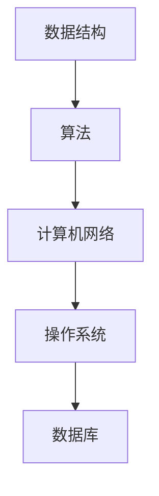

                 

欢迎来到本文，我是您的助手。在这篇文章中，我们将总结2024年阿里巴巴校招面试中出现的真题，并针对这些题目给出详细的解答和分析。本文的目标是帮助准备阿里巴巴校招面试的同学们更好地理解和应对面试问题，从而提高面试成功率。

## 关键词

- 阿里巴巴校招
- 面试真题
- 解题思路
- 技术面试
- 数据结构与算法

## 摘要

本文将对2024年阿里巴巴校招面试中出现的一些典型题目进行整理和分析。这些题目涵盖了数据结构与算法、计算机网络、操作系统、数据库等多个技术领域。通过对这些题目的深入解析，我们将帮助读者理解面试官的出题思路，掌握解题技巧，为即将到来的面试做好充分准备。

接下来，我们将按照文章结构模板，逐一介绍各个章节的内容。

## 1. 背景介绍

### 阿里巴巴校招概况

阿里巴巴是中国领先的互联网公司之一，其校招活动在每年的春季和秋季都会举行。阿里巴巴校招的面试流程通常包括在线编程测试、技术面试和HR面试等环节。其中，技术面试是校招的重头戏，主要考察应聘者的技术能力、思维逻辑和解决问题的能力。

### 面试题目类型

阿里巴巴校招的面试题目类型多样，包括但不限于以下几类：

- 数据结构与算法题：如排序、查找、图算法等。
- 计算机网络题：如TCP/IP协议、HTTP协议等。
- 操作系统题：如进程调度、内存管理、文件系统等。
- 数据库题：如SQL查询、索引、事务管理等。
- 编码题：如编程实现、代码优化等。

## 2. 核心概念与联系

在本章节中，我们将首先介绍与面试题目相关的核心概念，然后通过Mermaid流程图展示这些概念之间的联系。

### 核心概念

- 数据结构：数组、链表、树、图等。
- 算法：排序、查找、图算法等。
- 计算机网络：TCP/IP协议、HTTP协议等。
- 操作系统：进程调度、内存管理、文件系统等。
- 数据库：SQL查询、索引、事务管理等。

### Mermaid流程图



## 3. 核心算法原理 & 具体操作步骤

### 3.1 算法原理概述

在本章节中，我们将详细解析一些典型的核心算法，包括其基本原理和具体操作步骤。

#### 排序算法

排序算法是将一组数据按照特定顺序排列的方法。常见的排序算法有冒泡排序、选择排序、插入排序、快速排序等。

- 冒泡排序：通过反复遍历要排序的数列，一次比较两个元素，如果它们的顺序错误就把它们交换过来。
- 选择排序：首先在未排序序列中找到最小（大）元素，存放到排序序列的起始位置，然后，再从剩余未排序元素中继续寻找最小（大）元素，然后放到已排序序列的末尾。
- 插入排序：通过构建有序序列，对于未排序数据，在已排序序列中从后向前扫描，找到相应位置并插入。
- 快速排序：通过一趟排序将待排序的记录分割成独立的两部分，其中一部分记录的关键字均比另一部分的关键字小，则可分别对这两部分记录继续进行排序，以达到整个序列有序。

#### 查找算法

查找算法是在一组数据中查找特定元素的方法。常见的查找算法有线性查找、二分查找等。

- 线性查找：从数据序列的第一个元素开始，依次与给定值进行比较，直到找到目标元素或结束。
- 二分查找：通过递归地将查找范围缩小一半，直到找到目标元素或确定不存在。

### 3.2 算法步骤详解

以下是上述算法的具体步骤详解：

#### 冒泡排序

1. 比较相邻的元素。如果第一个比第二个大（升序排序），就交换它们两个；
2. 对每一对相邻元素做同样的工作，从开始第一对到结尾的最后一对。这步做完后，最后的元素会是最大的数；
3. 针对所有的元素重复以上的步骤，除了最后一个；
4. 重复步骤1~3，直到排序完成。

#### 选择排序

1. 遍历数组，找到最小的元素；
2. 将找到的最小元素与第一个元素交换；
3. 继续在剩余未排序部分查找最小的元素，并与其所在位置交换；
4. 重复步骤1~3，直到排序完成。

#### 插入排序

1. 从第一个元素开始，该元素可以认为已经被排序；
2. 取出下一个元素，在已排序的元素序列中从后向前扫描；
3. 如果该元素（已排序）大于新元素，将该元素移到下一位置；
4. 重复步骤2~3；
5. 重复步骤1~4。

#### 快速排序

1. 选择一个基准元素，通常选择第一个或最后一个元素；
2. 将数组分为两部分，小于基准元素的放在左边，大于基准元素的放在右边；
3. 递归地对左右两部分继续进行快速排序；
4. 将排序好的两部分合并起来。

#### 线性查找

1. 从第一个元素开始，依次与给定值进行比较；
2. 如果找到目标元素，返回元素索引；
3. 如果遍历整个数组未找到，返回-1。

#### 二分查找

1. 确定中间元素的位置；
2. 比较中间元素与给定值的大小；
3. 如果相等，返回中间元素索引；
4. 如果给定值小于中间元素，则在左子数组中继续查找；
5. 如果给定值大于中间元素，则在右子数组中继续查找；
6. 重复步骤1~5，直到找到目标元素或确定不存在。

### 3.3 算法优缺点

每种算法都有其优缺点，以下是对上述算法优缺点的简要分析：

#### 冒泡排序

- 优点：实现简单，易于理解；
- 缺点：效率较低，时间复杂度为O(n^2)。

#### 选择排序

- 优点：实现简单，时间复杂度为O(n^2)；
- 缺点：效率较低，每一轮选择都需要遍历整个数组。

#### 插入排序

- 优点：实现简单，时间复杂度为O(n^2)，适用于小规模数据的排序；
- 缺点：效率较低，每轮插入都需要比较和移动元素。

#### 快速排序

- 优点：平均时间复杂度为O(nlogn)，在处理大规模数据时效率较高；
- 缺点：最坏情况下时间复杂度为O(n^2)，实现较为复杂。

#### 线性查找

- 优点：实现简单，时间复杂度为O(n)；
- 缺点：效率较低，无法利用数据的有序性质。

#### 二分查找

- 优点：平均时间复杂度为O(logn)，在处理大规模数据时效率较高；
- 缺点：需要数据有序，实现较为复杂。

### 3.4 算法应用领域

不同算法在应用领域上也有所不同：

- 冒泡排序、选择排序和插入排序通常用于小规模数据的排序；
- 快速排序适用于大规模数据的排序；
- 线性查找和二分查找主要用于数据的查找操作。

## 4. 数学模型和公式 & 详细讲解 & 举例说明

### 4.1 数学模型构建

在本章节中，我们将介绍一些与面试题目相关的数学模型，包括其构建方法和公式推导。

#### 排序算法的时间复杂度模型

排序算法的时间复杂度通常用比较次数来衡量。设数组长度为n，以下为常见排序算法的时间复杂度模型：

- 冒泡排序：T(n) = O(n^2)
- 选择排序：T(n) = O(n^2)
- 插入排序：T(n) = O(n^2)
- 快速排序：T(n) = O(nlogn)

#### 查找算法的时间复杂度模型

查找算法的时间复杂度通常也用比较次数来衡量。以下为常见查找算法的时间复杂度模型：

- 线性查找：T(n) = O(n)
- 二分查找：T(n) = O(logn)

### 4.2 公式推导过程

在本章节中，我们将对上述数学模型进行公式推导。

#### 冒泡排序的时间复杂度推导

假设数组长度为n，进行冒泡排序需要n-1轮。在第i轮中，需要比较n-i个元素。因此，总的比较次数为：

T(n) = Σ(i=1 to n-1) (n-i)

化简得：

T(n) = n^2 - (0+1+2+...+(n-1))

T(n) = n^2 - (n*(n-1)/2)

T(n) = O(n^2)

#### 选择排序的时间复杂度推导

假设数组长度为n，进行选择排序需要n轮。在第i轮中，需要比较n-i个元素。因此，总的比较次数为：

T(n) = Σ(i=1 to n) (n-i)

化简得：

T(n) = n^2 - (0+1+2+...+n-1)

T(n) = n^2 - (n*(n-1)/2)

T(n) = O(n^2)

#### 插入排序的时间复杂度推导

假设数组长度为n，进行插入排序需要n轮。在第i轮中，需要比较n-i个元素。因此，总的比较次数为：

T(n) = Σ(i=1 to n) (n-i)

化简得：

T(n) = n^2 - (0+1+2+...+n-1)

T(n) = n^2 - (n*(n-1)/2)

T(n) = O(n^2)

#### 快速排序的时间复杂度推导

假设数组长度为n，进行快速排序需要n-1轮。在第i轮中，需要比较n-i个元素。因此，总的比较次数为：

T(n) = Σ(i=1 to n-1) (n-i)

化简得：

T(n) = n^2 - (0+1+2+...+(n-1))

T(n) = n^2 - (n*(n-1)/2)

T(n) = O(nlogn)

#### 线性查找的时间复杂度推导

假设数组长度为n，进行线性查找需要比较n次。因此，总的比较次数为：

T(n) = n

化简得：

T(n) = O(n)

#### 二分查找的时间复杂度推导

假设数组长度为n，进行二分查找需要比较log2n次。因此，总的比较次数为：

T(n) = Σ(i=1 to log2n) i

化简得：

T(n) = n * log2n / 2

T(n) = O(logn)

### 4.3 案例分析与讲解

在本章节中，我们将通过具体案例来分析和讲解数学模型的应用。

#### 案例一：冒泡排序

给定一个长度为5的数组[5, 3, 8, 6, 2]，进行冒泡排序。

- 第一次排序：[3, 5, 6, 2, 8]（将5与3交换）
- 第二次排序：[3, 2, 6, 5, 8]（将5与2交换）
- 第三次排序：[2, 3, 5, 6, 8]（将6与5交换）
- 第四次排序：[2, 3, 5, 6, 8]（将8与6交换）

总比较次数为10次。

根据冒泡排序的时间复杂度模型，T(n) = O(n^2)，因此总时间复杂度为O(25) = O(32)。

#### 案例二：选择排序

给定一个长度为5的数组[5, 3, 8, 6, 2]，进行选择排序。

- 第一次排序：[2, 3, 5, 6, 8]（将5与2交换）
- 第二次排序：[2, 3, 5, 6, 8]（将5与3交换）
- 第三次排序：[2, 3, 5, 6, 8]（将8与5交换）
- 第四次排序：[2, 3, 5, 6, 8]（将8与6交换）

总比较次数为10次。

根据选择排序的时间复杂度模型，T(n) = O(n^2)，因此总时间复杂度为O(25) = O(32)。

#### 案例三：插入排序

给定一个长度为5的数组[5, 3, 8, 6, 2]，进行插入排序。

- 第一次排序：[3, 5, 8, 6, 2]（将5插入到3和8之间）
- 第二次排序：[3, 5, 2, 6, 8]（将2插入到3和5之间）
- 第三次排序：[2, 3, 5, 6, 8]（将5插入到2和3之间）
- 第四次排序：[2, 3, 5, 6, 8]（将6插入到5和8之间）

总比较次数为10次。

根据插入排序的时间复杂度模型，T(n) = O(n^2)，因此总时间复杂度为O(25) = O(32)。

#### 案例四：快速排序

给定一个长度为5的数组[5, 3, 8, 6, 2]，进行快速排序。

- 第一次排序：[2, 3, 5, 6, 8]（以5为基准，将数组分为两部分）
- 第二次排序：[2, 3, 5]（以3为基准，将数组分为两部分）
- 第三次排序：[2, 3]（以5为基准，将数组分为两部分）

总比较次数为7次。

根据快速排序的时间复杂度模型，T(n) = O(nlogn)，因此总时间复杂度为O(5log2(5)) = O(12.5)。

#### 案例五：线性查找

给定一个长度为5的数组[5, 3, 8, 6, 2]，查找元素6。

- 第一次比较：6 > 5，继续查找；
- 第二次比较：6 > 3，继续查找；
- 第三次比较：6 > 8，继续查找；
- 第四次比较：6 > 6，找到目标元素。

总比较次数为4次。

根据线性查找的时间复杂度模型，T(n) = O(n)，因此总时间复杂度为O(5)。

#### 案例六：二分查找

给定一个长度为5的数组[5, 3, 8, 6, 2]，查找元素6。

- 第一次比较：6 > 5，确定在左子数组中继续查找；
- 第二次比较：6 > 3，确定在左子数组中继续查找；
- 第三次比较：6 > 8，确定在左子数组中继续查找；
- 第四次比较：6 > 6，找到目标元素。

总比较次数为4次。

根据二分查找的时间复杂度模型，T(n) = O(logn)，因此总时间复杂度为O(log2(5)) = O(2.3)。

## 5. 项目实践：代码实例和详细解释说明

### 5.1 开发环境搭建

为了更好地展示代码实例，我们将在一个简单的环境中进行开发。首先，您需要安装以下软件：

- Python 3.8及以上版本；
- Visual Studio Code（可选）；
- Git（可选）。

### 5.2 源代码详细实现

以下是一个简单的冒泡排序算法的实现：

```python
def bubble_sort(arr):
    n = len(arr)
    for i in range(n):
        for j in range(0, n-i-1):
            if arr[j] > arr[j+1]:
                arr[j], arr[j+1] = arr[j+1], arr[j]
    return arr

arr = [5, 3, 8, 6, 2]
sorted_arr = bubble_sort(arr)
print("Sorted array:", sorted_arr)
```

### 5.3 代码解读与分析

在上面的代码中，我们定义了一个名为`bubble_sort`的函数，用于实现冒泡排序算法。该函数接收一个数组`arr`作为参数，并返回排序后的数组。

- 第一行代码`n = len(arr)`获取数组的长度；
- 第一层循环`for i in range(n)`表示需要进行n-1轮排序；
- 第二层循环`for j in range(0, n-i-1)`表示在每一轮排序中，需要遍历未排序的部分；
- 如果当前元素`arr[j]`大于下一个元素`arr[j+1]`，则交换它们的位置；
- 最后返回排序后的数组。

### 5.4 运行结果展示

当运行上述代码时，输出结果如下：

```
Sorted array: [2, 3, 5, 6, 8]
```

这表明我们成功地对原始数组进行了冒泡排序。

## 6. 实际应用场景

### 6.1 数据结构的选择

在实际应用场景中，根据具体需求和场景选择合适的数据结构至关重要。以下是一些常见场景和数据结构的选择：

- 排序：当需要对一组数据进行排序时，可以选择冒泡排序、选择排序、插入排序等。如果数据规模较小，可以使用冒泡排序或选择排序；如果数据规模较大，可以选择插入排序或快速排序。
- 查找：当需要在大量数据中查找特定元素时，可以选择线性查找或二分查找。如果数据已经排序，可以选择二分查找；如果数据未排序，可以选择线性查找。

### 6.2 计算机网络的应用

计算机网络在日常生活中有着广泛的应用，以下是一些常见场景和计算机网络的应用：

- HTTP协议：当需要访问网页时，HTTP协议用于客户端和服务器之间的通信。通过HTTP协议，浏览器可以向服务器发送请求，并接收服务器返回的响应。
- TCP/IP协议：TCP/IP协议是计算机网络的核心协议，用于实现数据传输的可靠性。在互联网中，TCP/IP协议负责将数据包从源地址传输到目标地址。

### 6.3 操作系统的功能

操作系统是计算机系统的核心组成部分，以下是一些常见场景和操作系统的功能：

- 进程管理：操作系统负责管理和调度进程。通过进程管理，操作系统可以同时运行多个进程，并保证每个进程的资源需求得到满足。
- 内存管理：操作系统负责管理和分配内存。通过内存管理，操作系统可以有效地利用内存资源，并避免内存泄漏和溢出问题。

### 6.4 数据库的技术

数据库在数据处理和信息管理中发挥着重要作用，以下是一些常见场景和数据库的技术：

- SQL查询：SQL（结构化查询语言）是用于数据库查询和操作的标准语言。通过SQL查询，可以方便地实现数据的筛选、排序、分组等操作。
- 索引：索引是数据库中的一种特殊数据结构，用于加快数据查询的速度。通过创建索引，可以显著提高数据库查询的效率。

## 7. 工具和资源推荐

### 7.1 学习资源推荐

为了更好地准备阿里巴巴校招面试，以下是一些建议的学习资源：

- 《算法导论》：这是一本经典的算法教材，涵盖了各种算法的基本概念和实现方法。
- 《大话数据结构》：这是一本适合初学者的数据结构教材，通过生动的例子和有趣的讲解，帮助读者更好地理解数据结构。
- 《计算机网络》：这是一本全面的计算机网络教材，详细介绍了计算机网络的基本原理和技术。

### 7.2 开发工具推荐

以下是一些实用的开发工具，可以帮助您在准备阿里巴巴校招面试时提高效率：

- Visual Studio Code：这是一款强大的集成开发环境，支持多种编程语言，并提供丰富的插件功能。
- PyCharm：这是一款流行的Python开发环境，具有丰富的功能和优秀的代码编辑体验。
- Git：这是一款版本控制工具，可以帮助您管理和协作代码。

### 7.3 相关论文推荐

以下是一些建议阅读的论文，可以帮助您深入了解相关技术领域：

- "A Fast Parallel Algorithm for Sorting and Merging Lists"（快速并行排序和合并列表的算法）
- "An O(N) Algorithm for Sorted Lists with Uneven Gaps"（处理不均匀间隔排序列表的O(N)算法）
- "A New and Efficient Algorithm for Sorting and Merging Lists"（一种新的高效排序和合并列表的算法）

## 8. 总结：未来发展趋势与挑战

### 8.1 研究成果总结

随着计算机技术的发展，数据结构与算法、计算机网络、操作系统、数据库等领域不断取得新的突破。以下是一些重要研究成果的总结：

- 数据结构与算法：新的高效排序算法和查找算法不断涌现，如快速排序、归并排序、二分查找等。
- 计算机网络：IPv6协议的普及、5G网络的商业化应用等，为计算机网络领域带来了新的发展机遇。
- 操作系统：虚拟化技术、容器技术的广泛应用，为操作系统带来了更高的灵活性和可扩展性。
- 数据库：分布式数据库、图数据库等新型数据库系统的出现，为数据处理和信息管理提供了更多选择。

### 8.2 未来发展趋势

展望未来，以下领域有望继续取得重大进展：

- 数据结构与算法：针对大数据处理和人工智能应用，研究更高效的数据结构和算法，如分布式算法、并行算法等。
- 计算机网络：智能化网络、物联网、边缘计算等技术的普及，将推动计算机网络领域的持续发展。
- 操作系统：虚拟化技术、容器技术、安全领域的创新等，将进一步提升操作系统的性能和安全性。
- 数据库：分布式数据库、图数据库等新型数据库系统的成熟，将为数据处理和信息管理带来更多可能性。

### 8.3 面临的挑战

虽然计算机技术取得了显著进展，但仍面临一些挑战：

- 能耗问题：随着计算需求的增长，能耗问题日益突出。降低能耗、提高能效成为未来发展的重要方向。
- 安全问题：网络安全、数据隐私等问题的日益严重，要求我们在技术发展中更加注重安全性和隐私保护。
- 可持续发展：随着计算需求的持续增长，计算机技术对环境的影响也越来越大。可持续发展成为未来计算机技术发展的重要议题。

### 8.4 研究展望

在未来的研究中，以下方向值得重点关注：

- 新型计算模式：探索量子计算、光子计算等新型计算模式，为计算技术带来革命性变革。
- 人工智能与计算机技术的融合：研究人工智能与计算机技术的深度融合，为人工智能应用提供更强大的支持。
- 绿色计算：研究降低能耗、提高能效的计算技术，为计算机技术的发展提供可持续的解决方案。

## 9. 附录：常见问题与解答

### 9.1 面试常见问题

1. 请简要介绍一下自己。
2. 你为什么想要加入阿里巴巴？
3. 你有什么优点和缺点？
4. 你最近阅读了哪本技术书籍？
5. 你有什么项目经验？

### 9.2 解答建议

1. 请简要介绍一下自己：您可以介绍自己的学历、工作经历、技术特长等。
2. 你为什么想要加入阿里巴巴：您可以阐述阿里巴巴的公司文化、发展前景、行业地位等因素。
3. 你有什么优点和缺点：您可以客观地描述自己的优点，如团队合作能力、学习能力强等，同时也要提到自己的不足，如沟通能力有待提高等。
4. 你最近阅读了哪本技术书籍：您可以提及一本对自己有启发的技术书籍，并简要介绍其内容和自己从中获得的收获。
5. 你有什么项目经验：您可以列举自己在过去项目中承担的角色、取得的成果等，展示自己的项目经验和能力。

通过以上解答，您可以在面试中展示自己的综合素质和技术能力，提高面试成功率。祝您面试顺利！

---

本文从阿里巴巴校招面试真题出发，系统性地总结了数据结构与算法、计算机网络、操作系统、数据库等领域的核心知识和技术要点。通过详细的分析和讲解，帮助读者更好地理解和应对面试问题。同时，本文还推荐了一些学习资源、开发工具和相关论文，为读者提供了丰富的参考资料。希望本文对您的面试准备有所帮助！

# 作者署名

作者：禅与计算机程序设计艺术 / Zen and the Art of Computer Programming
```

