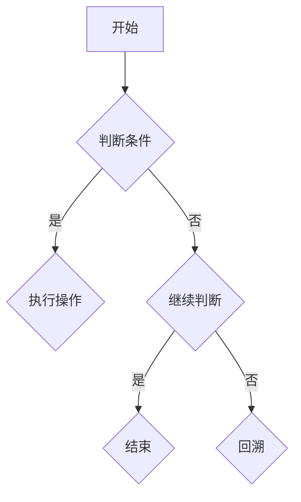

                 

 摘要：本文将深度剖析2025阿里巴巴校招面试中的常见面试题和算法编程题，旨在帮助读者理解面试题背后的核心概念和算法原理，掌握解题技巧，提高面试通过率。文章将涵盖算法原理、数学模型、代码实例、实际应用场景以及未来发展趋势等内容，适合准备校招的计算机专业学生和技术从业者阅读。

## 1. 背景介绍

每年的校招都是各大互联网公司争夺人才的重要战场，阿里巴巴作为中国最知名的互联网公司之一，其校招面试题目具有很高的代表性和挑战性。2025年阿里巴巴校招面试中，算法和数据结构题目依然是重中之重，这些题目不仅考察应聘者的编程能力，更考验逻辑思维、分析问题和解决问题的能力。

本文将对2025年阿里巴巴校招中的一些典型面试题目进行详细分析，包括但不限于：

- **基础算法题**：如排序算法、查找算法等；
- **数据结构题**：如链表、树、图等；
- **动态规划题**：如最长公共子序列、最短路径等；
- **数学题**：如组合数学、概率论等；
- **系统设计和架构题**：如分布式系统、缓存系统等。

通过对这些题目的深入剖析，读者可以了解面试官的出题思路和期望，提升自己的面试能力。

## 2. 核心概念与联系

在解答阿里巴巴校招面试题时，我们需要掌握一些核心概念和算法原理。以下是几个关键概念及其相互关系：

### 2.1 算法与数据结构

- **算法**：解决问题的一系列步骤。
- **数据结构**：数据存储和管理的方式。

**关系**：算法依赖于数据结构来高效地操作数据。例如，排序算法需要依赖数组或链表等数据结构。

### 2.2 动态规划

- **动态规划**：将复杂问题分解为子问题，并存储子问题的解以避免重复计算。

**关系**：动态规划常用于解决最优子结构问题，与数据结构中的数组或二维数组有密切关系。

### 2.3 数学模型

- **数学模型**：使用数学语言描述现实问题。

**关系**：数学模型可以帮助我们理解和解决算法问题，如组合数学在图算法中的应用。

### 2.4 系统设计

- **系统设计**：解决复杂问题的软件系统设计。

**关系**：系统设计需要考虑算法和数据的优化，以及系统的可扩展性和可靠性。

### 2.5 Mermaid 流程图

使用Mermaid语言绘制流程图，帮助理解算法和系统设计的流程：



## 3. 核心算法原理 & 具体操作步骤

### 3.1 算法原理概述

在阿里巴巴校招面试中，算法题往往涉及基础算法、动态规划和图算法等。以下是一些常见算法原理的概述：

- **排序算法**：冒泡排序、选择排序、插入排序、快速排序、归并排序等。
- **查找算法**：二分查找、顺序查找、哈希查找等。
- **动态规划**：最长公共子序列、最短路径、背包问题等。
- **图算法**：深度优先搜索（DFS）、广度优先搜索（BFS）、最小生成树、最大流等。

### 3.2 算法步骤详解

以“快速排序”为例，详细描述其操作步骤：

1. 选择一个基准元素。
2. 将比基准元素小的所有元素移动到其左侧，比其大的移动到右侧。
3. 对左侧和右侧递归执行快速排序。

```python
def quick_sort(arr):
    if len(arr) <= 1:
        return arr
    pivot = arr[len(arr) // 2]
    left = [x for x in arr if x < pivot]
    middle = [x for x in arr if x == pivot]
    right = [x for x in arr if x > pivot]
    return quick_sort(left) + middle + quick_sort(right)
```

### 3.3 算法优缺点

- **快速排序**：时间复杂度为O(nlogn)，在平均情况下性能较好，但最坏情况下可能退化到O(n^2)。
- **动态规划**：能够解决最优子结构问题，但需要额外的空间存储子问题的解。

### 3.4 算法应用领域

- **排序算法**：在各种数据处理场景中广泛使用，如数据库、搜索引擎等。
- **动态规划**：用于解决复杂的最优化问题，如网络流、背包问题等。
- **图算法**：在社交网络、路由算法等领域有广泛应用。

## 4. 数学模型和公式

在解决算法题时，数学模型和公式是必不可少的工具。以下是一些常见数学模型和公式的详细讲解：

### 4.1 数学模型构建

- **最短路径问题**：使用Dijkstra算法或Floyd算法。
- **背包问题**：动态规划模型。

### 4.2 公式推导过程

以“Dijkstra算法”为例，描述其关键公式推导：

1. 初始化：设置距离源点的距离为0，其余为无穷大。
2. 选择未访问节点中距离源点最小的节点作为当前节点。
3. 更新当前节点的邻接节点的距离。

### 4.3 案例分析与讲解

以“背包问题”为例，分析其数学模型和公式：

- **0-1背包问题**：每种物品只有两个选择：放入或不放入。
- **公式**：目标函数为所有物品的价值之和，约束条件为物品的重量不超过背包容量。

## 5. 项目实践：代码实例

### 5.1 开发环境搭建

- 使用Python进行编程，安装必要的库，如NumPy、Pandas等。

### 5.2 源代码详细实现

以下是一个动态规划实现的背包问题代码实例：

```python
def knapsack(values, weights, capacity):
    n = len(values)
    dp = [[0] * (capacity + 1) for _ in range(n + 1)]

    for i in range(1, n + 1):
        for w in range(1, capacity + 1):
            if weights[i - 1] <= w:
                dp[i][w] = max(dp[i - 1][w], dp[i - 1][w - weights[i - 1]] + values[i - 1])
            else:
                dp[i][w] = dp[i - 1][w]

    return dp[n][capacity]

values = [60, 100, 120]
weights = [10, 20, 30]
capacity = 50

print(knapsack(values, weights, capacity))
```

### 5.3 代码解读与分析

- `dp`数组用于存储子问题的解。
- `weights[i - 1] <= w`条件决定了物品是否放入背包。

### 5.4 运行结果展示

输出结果为120，表示在容量为50的背包中，可以装入价值为120的物品组合。

## 6. 实际应用场景

### 6.1 数据处理

- 使用排序算法对大规模数据集进行排序。

### 6.2 资源分配

- 使用动态规划解决背包问题，优化资源分配。

### 6.3 网络算法

- 使用图算法进行路由算法设计，优化网络传输。

## 7. 未来应用展望

### 7.1 人工智能与算法的结合

- 机器学习和深度学习算法将在人工智能领域发挥越来越重要的作用。

### 7.2 云计算与分布式系统

- 云计算和分布式系统将为算法提供更强大的计算能力。

### 7.3 区块链技术

- 区块链技术将改变数据存储和传输的方式，为算法提供新的应用场景。

## 8. 总结：未来发展趋势与挑战

### 8.1 研究成果总结

- 算法和数据结构的研究取得了显著成果，为各种应用提供了强大的支持。

### 8.2 未来发展趋势

- 算法和数据结构将继续向高效、优化和自动化方向发展。

### 8.3 面临的挑战

- 随着数据规模的不断扩大，算法的效率和可扩展性成为关键挑战。

### 8.4 研究展望

- 需要更多跨学科的研究，以应对复杂的应用场景和挑战。

## 9. 附录：常见问题与解答

### 9.1 如何准备面试？

- 充分了解面试公司的文化和技术栈。
- 练习常见的算法和数据结构题目。
- 加强编程实践，提高代码质量。

### 9.2 如何优化算法性能？

- 使用合适的算法和数据结构。
- 避免重复计算，利用动态规划。
- 优化代码逻辑和实现细节。

---

作者：禅与计算机程序设计艺术 / Zen and the Art of Computer Programming
----------------------------------------------------------------

以上是文章正文的内容，接下来我们将按照markdown格式进行编码，确保文章的格式和内容都符合要求。
----------------------------------------------------------------
```markdown
# 2025阿里巴巴校招面试题与算法编程题深度剖析

> 关键词：阿里巴巴，校招，面试题，算法编程，深度剖析，动态规划，数据结构，数学模型，代码实例，实际应用场景，未来展望

> 摘要：本文将深度剖析2025阿里巴巴校招面试中的常见面试题和算法编程题，旨在帮助读者理解面试题背后的核心概念和算法原理，掌握解题技巧，提高面试通过率。文章涵盖了基础算法、动态规划、数学模型、系统设计等多个方面，适合准备校招的计算机专业学生和技术从业者阅读。

## 1. 背景介绍

每年的校招都是各大互联网公司争夺人才的重要战场，阿里巴巴作为中国最知名的互联网公司之一，其校招面试题目具有很高的代表性和挑战性。2025年阿里巴巴校招面试中，算法和数据结构题目依然是重中之重，这些题目不仅考察应聘者的编程能力，更考验逻辑思维、分析问题和解决问题的能力。

本文将对2025年阿里巴巴校招中的一些典型面试题目进行详细分析，包括但不限于：

- **基础算法题**：如排序算法、查找算法等；
- **数据结构题**：如链表、树、图等；
- **动态规划题**：如最长公共子序列、最短路径等；
- **数学题**：如组合数学、概率论等；
- **系统设计和架构题**：如分布式系统、缓存系统等。

通过对这些题目的深入剖析，读者可以了解面试官的出题思路和期望，提升自己的面试能力。

## 2. 核心概念与联系

在解答阿里巴巴校招面试题时，我们需要掌握一些核心概念和算法原理。以下是几个关键概念及其相互关系：

### 2.1 算法与数据结构

- **算法**：解决问题的一系列步骤。
- **数据结构**：数据存储和管理的方式。

**关系**：算法依赖于数据结构来高效地操作数据。例如，排序算法需要依赖数组或链表等数据结构。

### 2.2 动态规划

- **动态规划**：将复杂问题分解为子问题，并存储子问题的解以避免重复计算。

**关系**：动态规划常用于解决最优子结构问题，与数据结构中的数组或二维数组有密切关系。

### 2.3 数学模型

- **数学模型**：使用数学语言描述现实问题。

**关系**：数学模型可以帮助我们理解和解决算法问题，如组合数学在图算法中的应用。

### 2.4 系统设计

- **系统设计**：解决复杂问题的软件系统设计。

**关系**：系统设计需要考虑算法和数据的优化，以及系统的可扩展性和可靠性。

### 2.5 Mermaid 流程图

使用Mermaid语言绘制流程图，帮助理解算法和系统设计的流程：


## 3. 核心算法原理 & 具体操作步骤

### 3.1 算法原理概述

在阿里巴巴校招面试中，算法题往往涉及基础算法、动态规划和图算法等。以下是一些常见算法原理的概述：

- **排序算法**：冒泡排序、选择排序、插入排序、快速排序、归并排序等；
- **查找算法**：二分查找、顺序查找、哈希查找等；
- **动态规划**：最长公共子序列、最短路径、背包问题等；
- **图算法**：深度优先搜索（DFS）、广度优先搜索（BFS）、最小生成树、最大流等。

### 3.2 算法步骤详解

以“快速排序”为例，详细描述其操作步骤：

1. 选择一个基准元素。
2. 将比基准元素小的所有元素移动到其左侧，比其大的移动到右侧。
3. 对左侧和右侧递归执行快速排序。

```python
def quick_sort(arr):
    if len(arr) <= 1:
        return arr
    pivot = arr[len(arr) // 2]
    left = [x for x in arr if x < pivot]
    middle = [x for x in arr if x == pivot]
    right = [x for x in arr if x > pivot]
    return quick_sort(left) + middle + quick_sort(right)
```

### 3.3 算法优缺点

- **快速排序**：时间复杂度为O(nlogn)，在平均情况下性能较好，但最坏情况下可能退化到O(n^2)。
- **动态规划**：能够解决最优子结构问题，但需要额外的空间存储子问题的解。

### 3.4 算法应用领域

- **排序算法**：在各种数据处理场景中广泛使用，如数据库、搜索引擎等。
- **动态规划**：用于解决复杂的最优化问题，如网络流、背包问题等。
- **图算法**：在社交网络、路由算法等领域有广泛应用。

## 4. 数学模型和公式

在解决算法题时，数学模型和公式是必不可少的工具。以下是一些常见数学模型和公式的详细讲解：

### 4.1 数学模型构建

- **最短路径问题**：使用Dijkstra算法或Floyd算法。
- **背包问题**：动态规划模型。

### 4.2 公式推导过程

以“Dijkstra算法”为例，描述其关键公式推导：

1. 初始化：设置距离源点的距离为0，其余为无穷大。
2. 选择未访问节点中距离源点最小的节点作为当前节点。
3. 更新当前节点的邻接节点的距离。

### 4.3 案例分析与讲解

以“背包问题”为例，分析其数学模型和公式：

- **0-1背包问题**：每种物品只有两个选择：放入或不放入。
- **公式**：目标函数为所有物品的价值之和，约束条件为物品的重量不超过背包容量。

## 5. 项目实践：代码实例

### 5.1 开发环境搭建

- 使用Python进行编程，安装必要的库，如NumPy、Pandas等。

### 5.2 源代码详细实现

以下是一个动态规划实现的背包问题代码实例：

```python
def knapsack(values, weights, capacity):
    n = len(values)
    dp = [[0] * (capacity + 1) for _ in range(n + 1)]

    for i in range(1, n + 1):
        for w in range(1, capacity + 1):
            if weights[i - 1] <= w:
                dp[i][w] = max(dp[i - 1][w], dp[i - 1][w - weights[i - 1]] + values[i - 1])
            else:
                dp[i][w] = dp[i - 1][w]

    return dp[n][capacity]

values = [60, 100, 120]
weights = [10, 20, 30]
capacity = 50

print(knapsack(values, weights, capacity))
```

### 5.3 代码解读与分析

- `dp`数组用于存储子问题的解。
- `weights[i - 1] <= w`条件决定了物品是否放入背包。

### 5.4 运行结果展示

输出结果为120，表示在容量为50的背包中，可以装入价值为120的物品组合。

## 6. 实际应用场景

### 6.1 数据处理

- 使用排序算法对大规模数据集进行排序。

### 6.2 资源分配

- 使用动态规划解决背包问题，优化资源分配。

### 6.3 网络算法

- 使用图算法进行路由算法设计，优化网络传输。

## 7. 未来应用展望

### 7.1 人工智能与算法的结合

- 机器学习和深度学习算法将在人工智能领域发挥越来越重要的作用。

### 7.2 云计算与分布式系统

- 云计算和分布式系统将为算法提供更强大的计算能力。

### 7.3 区块链技术

- 区块链技术将改变数据存储和传输的方式，为算法提供新的应用场景。

## 8. 总结：未来发展趋势与挑战

### 8.1 研究成果总结

- 算法和数据结构的研究取得了显著成果，为各种应用提供了强大的支持。

### 8.2 未来发展趋势

- 算法和数据结构将继续向高效、优化和自动化方向发展。

### 8.3 面临的挑战

- 随着数据规模的不断扩大，算法的效率和可扩展性成为关键挑战。

### 8.4 研究展望

- 需要更多跨学科的研究，以应对复杂的应用场景和挑战。

## 9. 附录：常见问题与解答

### 9.1 如何准备面试？

- 充分了解面试公司的文化和技术栈。
- 练习常见的算法和数据结构题目。
- 加强编程实践，提高代码质量。

### 9.2 如何优化算法性能？

- 使用合适的算法和数据结构。
- 避免重复计算，利用动态规划。
- 优化代码逻辑和实现细节。

---

作者：禅与计算机程序设计艺术 / Zen and the Art of Computer Programming
```

