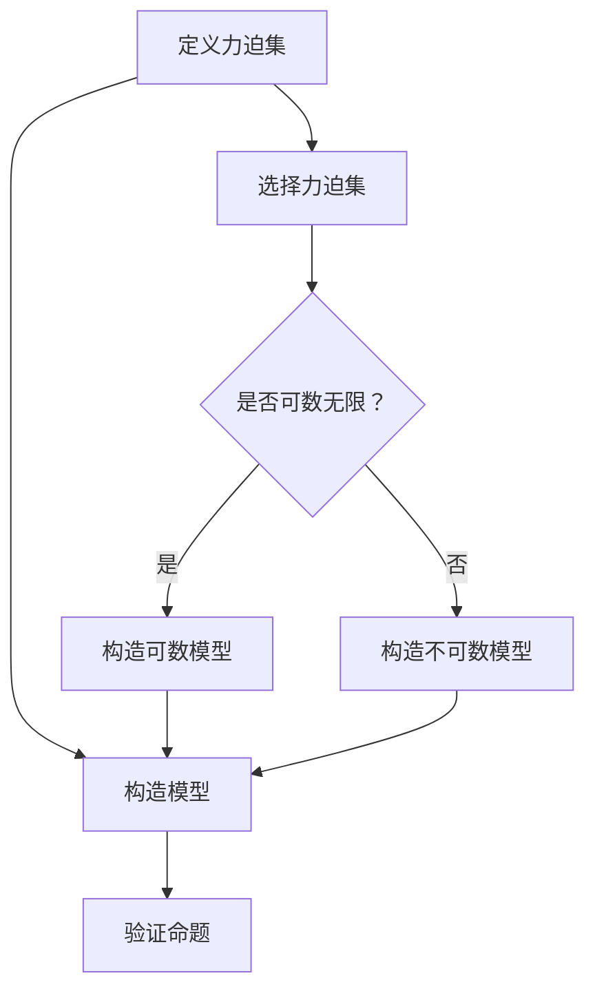

                 

关键词：集合论，力迫，数学基础，形式系统，无限集合，计算复杂性

## 摘要

本文旨在为读者提供关于集合论中力迫基本理论的全面导引。力迫是一种重要的数学工具，它用于解决集合论中某些难以处理的问题，特别是在处理无限集合时具有独特优势。文章将首先介绍集合论的基本概念，然后深入探讨力迫的基本理论，包括其定义、性质和主要应用。通过具体的数学模型和实例分析，本文将展示力迫在集合论研究中的重要作用，并提供相关的学习资源和开发工具推荐。最后，本文将对力迫理论在未来的发展趋势与挑战进行展望。

## 1. 背景介绍

集合论是现代数学的基础，它为数学的各个分支提供了统一的框架和语言。集合论的基本概念和理论对计算机科学、逻辑学、物理学等多个领域都有着深远的影响。然而，集合论本身也面临着一些复杂的问题，例如无穷集合的存在和性质，这些问题的研究需要更高级的数学工具。

力迫（Forcing）是集合论中的一种技术，它是由保罗·科恩（Paul Cohen）在1960年代提出的。力迫理论通过构造一个更大的集合论模型，来证明或反驳某些集合论命题。这种方法在处理无限集合时具有独特优势，因为传统的数学方法难以直接处理无限集合的结构和性质。

力迫理论的应用非常广泛，它不仅用于解决集合论中的基本问题，如连续统假设，而且也在计算机科学、逻辑学和数学物理等领域发挥了重要作用。本文将详细介绍力迫的基本理论，帮助读者深入理解这一重要数学工具。

### 集合论的基本概念

集合论的基础是集合的概念。集合是由确定的元素组成的整体。这些元素可以是任何对象，包括数字、几何形状、函数等。集合通常用大写字母表示，如\(A\)、\(B\)等。集合的元素用小写字母表示，如\(a\)、\(b\)等。

集合的定义是通过描述其元素的性质来给出的。例如，所有偶数的集合可以表示为：
\[ E = \{ x \mid x \text{ 是偶数} \} \]

集合的一些基本运算包括：

- 并集：\(A \cup B\) 表示集合\(A\)和集合\(B\)中所有元素的集合。
- 交集：\(A \cap B\) 表示同时属于集合\(A\)和集合\(B\)的所有元素的集合。
- 衍集（补集）：\(A^c\) 表示不属于集合\(A\)的所有元素的集合。

集合论还涉及一些重要的概念，如：

- 子集：如果集合\(A\)的所有元素都是集合\(B\)的元素，则称\(A\)是\(B\)的子集，记为\(A \subseteq B\)。
- 真子集：如果\(A\)是\(B\)的子集，且\(A \neq B\)，则称\(A\)是\(B\)的真子集，记为\(A \subset B\)。
- 穷集合和无限集合：一个集合是穷集合，如果它包含有限个元素；否则，它是无限集合。

此外，集合论中还研究了集合的基数（即集合中元素的数量）和集合之间的等价关系（如势、势的等价关系）。

### 力迫的概念

力迫是一种构建更大集合论模型的方法，它通过添加某些“新的”元素或关系来扩展现有模型。这种方法在证明或反驳某些集合论命题时非常有用，因为它允许我们操作于更大的模型空间中，从而处理更复杂的结构。

力迫的基本思想是：通过添加一个集合（称为力迫集）到原模型中，使得原模型中的某些命题得以成立或被推翻。这个力迫集通常是由一系列的对象（称为条件）构成的，每个条件都对应于原模型中的一个命题。

力迫的过程可以分为以下几个步骤：

1. **定义力迫集**：选择一个集合作为力迫集，这个集合通常是一个可数无限集合，其中每个元素都表示一个条件。
2. **构造模型**：通过力迫集与原模型的组合，构造一个新的模型。在这个新模型中，每个条件都被视为一个真实的元素或关系。
3. **验证命题**：在新模型中验证原模型中的命题。如果命题在新模型中成立，则说明原模型是可证的；如果命题在新模型中不成立，则说明原模型是不可证的。

力迫的一个关键特点是它能够处理无限集合。在传统的数学方法中，直接处理无限集合的结构和性质是非常困难的。而力迫通过将无限集合分割为一系列的条件，使得我们能够逐步地理解和处理这些集合。

### 力迫的性质和优点

力迫理论具有以下几个重要性质和优点：

1. **普遍性**：力迫可以应用于广泛的集合论命题，无论是证明还是反驳。这使得力迫成为一种强大的数学工具。
2. **灵活性**：力迫允许我们在构建模型时具有很大的灵活性，可以根据不同的需求和目标选择合适的力迫集和条件。
3. **处理无限集合**：力迫的核心优势在于它能够处理无限集合。通过将无限集合分割为条件，力迫使得我们能够逐步地理解和操作这些集合。
4. **简洁性**：力迫的构造过程相对简洁，特别是与传统的数学方法相比，它能够更直观地展示无限集合的结构。

这些性质和优点使得力迫理论在集合论研究中具有重要地位，特别是在处理复杂问题时发挥着不可替代的作用。

### 力迫的应用场景

力迫理论在数学和其他领域有着广泛的应用场景。以下是一些典型的应用实例：

1. **证明连续统假设**：连续统假设是一个著名的集合论问题，它涉及到实数集的势（即集合中元素的数量）。力迫理论为证明连续统假设提供了有效的工具。
2. **解决集合论悖论**：集合论悖论是集合论中的一些矛盾现象，如罗素悖论。力迫理论可以用来解决这些悖论，因为它允许我们构建更大的模型，从而避免悖论的出现。
3. **计算机科学**：力迫理论在计算机科学中也有重要应用，特别是在计算复杂性理论中。它可以帮助我们分析某些问题的计算复杂性，特别是在处理无限集合时。
4. **数学物理**：在数学物理领域，力迫理论可以用来研究某些物理系统的性质和动态行为。

通过这些应用实例，我们可以看到力迫理论在数学和其他领域中的广泛应用和重要性。

### 总结

力迫理论是集合论中的一个重要工具，它通过构建更大的集合论模型来处理复杂的集合论问题。力迫的基本概念、性质和优点使其成为一种强大的数学工具，广泛应用于数学和其他领域。本文介绍了集合论的基本概念和力迫的基本理论，并通过具体实例展示了力迫的应用。希望本文能够帮助读者深入理解力迫理论，并激发对这一领域的研究兴趣。

## 2. 核心概念与联系

### 集合论中的基础概念

在深入探讨力迫理论之前，我们需要了解一些集合论中的基础概念，这些概念是理解力迫理论的前提。

#### 集合

集合是由确定的元素组成的整体。集合的元素可以是任何对象，如数字、几何形状、函数等。集合通常用大写字母表示，如\(A\)、\(B\)等，而集合的元素用小写字母表示，如\(a\)、\(b\)等。

- **定义**：\(A = \{ x \mid P(x) \}\)，其中\(P(x)\)是关于元素\(x\)的性质。
- **元素与集合的关系**：如果\(x\)是集合\(A\)的元素，则表示为\(x \in A\)；如果\(x\)不是集合\(A\)的元素，则表示为\(x \notin A\)。
- **集合的子集**：如果集合\(A\)的所有元素都是集合\(B\)的元素，则称\(A\)是\(B\)的子集，记为\(A \subseteq B\)。如果\(A\)是\(B\)的子集，且\(A \neq B\)，则称\(A\)是\(B\)的真子集，记为\(A \subset B\)。

#### 集合运算

集合的基本运算包括并集、交集、补集等。

- **并集**：\(A \cup B\)表示集合\(A\)和集合\(B\)中所有元素的集合。
- **交集**：\(A \cap B\)表示同时属于集合\(A\)和集合\(B\)的所有元素的集合。
- **补集**：\(A^c\)表示不属于集合\(A\)的所有元素的集合。

#### 无限集合

无限集合是指包含无限多个元素的集合。无限集合的性质和结构是集合论研究的重要内容。

- **可数无限集合**：如果一个集合可以与自然数集合建立一一对应的关系，则称该集合为可数无限集合。例如，自然数集合和整数集合都是可数无限集合。
- **不可数无限集合**：如果一个集合不能与自然数集合建立一一对应的关系，则称该集合为不可数无限集合。实数集合是一个典型的不可数无限集合。

#### 集合的基数

集合的基数是指集合中元素的数量。不同集合的基数可能不同。

- **势**：集合的基数也称为势。例如，自然数集合的势为可数无限，而实数集合的势为不可数无限。
- **势的等价关系**：两个集合的势相等，当且仅当它们之间存在一一对应关系。

### 力迫理论的基本概念

力迫理论是一种构建更大集合论模型的方法，通过添加某些“新的”元素或关系来扩展现有模型。力迫理论在处理无限集合时具有独特优势，因为它允许我们操作于更大的模型空间中，从而处理更复杂的结构。

#### 力迫集

力迫集是力迫理论中的核心概念，它是用于扩展模型的基础。力迫集通常是一个可数无限集合，其中的每个元素都代表一个条件。

- **定义**：力迫集是一个集合，它包含一系列的对象，这些对象称为条件。每个条件对应于原模型中的一个命题。
- **条件**：条件是力迫集中每个元素的属性，它决定了在扩展模型中该条件是否成立。

#### 力迫过程

力迫过程是通过力迫集与原模型的组合来构建一个新的模型。这个新模型被称为力迫模型，它包含了原模型中的所有元素和力迫集中的条件。

- **步骤**：
  1. **定义力迫集**：选择一个集合作为力迫集，这个集合通常是一个可数无限集合，其中每个元素都表示一个条件。
  2. **构造模型**：通过力迫集与原模型的组合，构造一个新的模型。在这个新模型中，每个条件都被视为一个真实的元素或关系。
  3. **验证命题**：在新模型中验证原模型中的命题。如果命题在新模型中成立，则说明原模型是可证的；如果命题在新模型中不成立，则说明原模型是不可证的。

#### 力迫的性质

力迫理论具有以下几个重要性质：

- **普遍性**：力迫可以应用于广泛的集合论命题，无论是证明还是反驳。
- **灵活性**：力迫允许我们在构建模型时具有很大的灵活性，可以根据不同的需求和目标选择合适的力迫集和条件。
- **处理无限集合**：力迫的核心优势在于它能够处理无限集合。通过将无限集合分割为一系列的条件，力迫使得我们能够逐步地理解和处理这些集合。
- **简洁性**：力迫的构造过程相对简洁，特别是与传统的数学方法相比，它能够更直观地展示无限集合的结构。

### 力迫与集合论的关系

力迫理论与集合论的关系非常密切。力迫理论是集合论中的一个重要工具，它通过构建更大的集合论模型来处理复杂的集合论问题。力迫理论的基础是集合论的基本概念，如集合、无限集合、集合运算等。

力迫理论的应用不仅限于集合论本身，它还广泛应用于其他数学领域，如计算机科学、逻辑学和数学物理等。在这些领域中，力迫理论为解决复杂的数学问题提供了有效的工具。

### Mermaid 流程图

为了更好地展示力迫理论的基本概念和流程，我们使用Mermaid流程图来表示力迫的各个步骤。以下是力迫过程的Mermaid流程图：



在这个流程图中，A表示定义力迫集，D表示选择力迫集，E表示判断力迫集是否可数无限。如果力迫集是可数无限集合，则通过F构造可数模型；如果力迫集是不可数无限集合，则通过G构造不可数模型。B表示构造模型，C表示验证命题。

### 力迫理论在集合论中的应用

力迫理论在集合论中有着广泛的应用，特别是在处理无穷集合时具有独特优势。以下是一些典型的应用实例：

1. **证明连续统假设**：连续统假设是一个关于实数集势的集合论问题。力迫理论为证明连续统假设提供了有效的工具，通过构造一个更大的集合论模型，证明实数集的势是可数的。
2. **解决集合论悖论**：集合论悖论是集合论中的一些矛盾现象，如罗素悖论。力迫理论可以用来解决这些悖论，因为它允许我们构建更大的模型，从而避免悖论的出现。
3. **计算复杂性理论**：力迫理论在计算复杂性理论中也有重要应用，特别是在处理无限集合时。它可以帮助我们分析某些问题的计算复杂性，从而更好地理解计算问题的本质。

### 力迫理论与数学其他领域的关系

力迫理论不仅限于集合论领域，它在数学的其他领域也有广泛的应用。以下是一些典型的应用领域：

1. **逻辑学**：力迫理论在逻辑学中有着重要应用，特别是在模型论和证明论中。它可以帮助我们分析和证明各种逻辑命题。
2. **计算机科学**：力迫理论在计算机科学中也有重要应用，特别是在计算复杂性理论和算法设计领域。它可以帮助我们分析算法的时间和空间复杂性，从而设计更高效的算法。
3. **数学物理**：力迫理论在数学物理领域也有应用，特别是在量子场论和统计物理中。它可以帮助我们理解和分析物理系统的性质和动态行为。

通过这些应用实例，我们可以看到力迫理论在数学和其他领域中的广泛应用和重要性。力迫理论不仅为数学研究提供了有效的工具，也为其他领域的发展做出了重要贡献。

### 力迫理论的基本步骤

力迫理论的基本步骤包括定义力迫集、构造模型和验证命题。以下是这些步骤的详细说明：

#### 定义力迫集

定义力迫集是力迫理论的第一步。力迫集是一个用于扩展原模型的集合，它通常是一个可数无限集合。力迫集中的每个元素都代表一个条件，这个条件决定了在扩展模型中该条件是否成立。

- **选择力迫集**：选择一个合适的力迫集是关键。力迫集的选择取决于原模型和我们要解决的问题。通常，我们会选择一个可数无限集合，如自然数集合或无限序列。
- **表示条件**：力迫集中的每个元素都表示一个条件。条件可以用符号或自然语言来表示，例如，我们可以用\(C_i\)表示第\(i\)个条件，用\(P(C_i)\)表示条件\(C_i\)的性质。

#### 构造模型

构造模型是将力迫集与原模型组合，构建一个新的模型。在这个新模型中，力迫集中的条件被视为真实的元素或关系。构造模型的过程可以分为以下几个步骤：

1. **定义原模型**：原模型是我们开始时已有的模型，它包含了所有已知的元素和关系。
2. **选择力迫集**：选择一个合适的力迫集，如自然数集合或无限序列。
3. **组合模型**：将力迫集与原模型组合，构建一个新的模型。在这个新模型中，力迫集中的条件被视为真实的元素或关系。

#### 验证命题

验证命题是力迫理论的最后一步。在新模型中，我们需要验证原模型中的命题。如果命题在新模型中成立，则说明原模型是可证的；如果命题在新模型中不成立，则说明原模型是不可证的。

- **选择命题**：选择一个要验证的命题。这个命题可以是原模型中的一个命题，也可以是在力迫过程中新出现的命题。
- **验证过程**：在新模型中验证选择的命题。如果命题在新模型中成立，则说明原模型是可证的；如果命题在新模型中不成立，则说明原模型是不可证的。

通过这三个步骤，我们可以使用力迫理论来构建更大的模型，并验证或反驳原模型中的命题。力迫理论在处理复杂问题时具有独特优势，因为它允许我们逐步地理解和处理无限集合。

### 力迫理论的优缺点

力迫理论作为一种强大的数学工具，在集合论和其他领域中有着广泛的应用。然而，它也有一些优缺点，以下是对力迫理论优缺点的详细分析：

#### 优点

1. **处理无限集合**：力迫理论的核心优势在于它能够处理无限集合。在传统的数学方法中，直接处理无限集合的结构和性质是非常困难的。而力迫通过将无限集合分割为一系列的条件，使得我们能够逐步地理解和处理这些集合。
2. **灵活性**：力迫理论在构建模型时具有很大的灵活性。我们可以根据不同的需求和目标选择合适的力迫集和条件。这使得力迫理论在解决复杂问题时具有很大的适用性。
3. **普遍性**：力迫理论可以应用于广泛的集合论命题，无论是证明还是反驳。这使得力迫理论成为一种强大的数学工具，能够解决许多其他方法难以处理的问题。

#### 缺点

1. **复杂性**：力迫理论的构造过程相对复杂。构建力迫模型需要选择合适的力迫集和条件，并验证命题。这个过程可能涉及大量的逻辑推理和数学计算，使得力迫理论的应用变得困难。
2. **可读性**：力迫理论的模型和条件通常用符号和数学语言表示，这使得它们对于非专业人士来说可能难以理解。这增加了力迫理论的学习和应用难度。

#### 应用领域

力迫理论在多个领域有着重要的应用：

1. **集合论**：力迫理论是集合论中的一个重要工具，用于解决各种集合论问题，如连续统假设和集合论悖论。
2. **计算机科学**：力迫理论在计算机科学中有着广泛的应用，特别是在计算复杂性理论和算法设计领域。它可以帮助我们分析算法的时间和空间复杂性，从而设计更高效的算法。
3. **逻辑学**：力迫理论在逻辑学中也有着重要应用，特别是在模型论和证明论中。它可以帮助我们分析和证明各种逻辑命题。

通过以上分析，我们可以看到力迫理论在数学和其他领域中的广泛应用和重要性。尽管它存在一些缺点，但力迫理论作为一种强大的数学工具，其优点远远超过了缺点，使得它在解决复杂问题时具有不可替代的作用。

### 力迫理论在集合论中的应用案例

力迫理论在集合论中有着广泛的应用，特别是在证明和反驳某些集合论命题方面具有独特优势。以下我们将通过两个具体的案例来展示力迫理论在集合论中的应用。

#### 案例一：证明连续统假设

连续统假设是一个关于实数集势的集合论问题，它提出了实数集的势是可数的。力迫理论为证明连续统假设提供了有效的工具。以下是一个简化的证明过程：

1. **选择力迫集**：我们选择自然数集合作为力迫集，因为自然数集合是一个可数无限集合。在这个力迫集中，每个自然数都表示一个条件，即实数集合中的一个子集。
2. **构造模型**：通过组合自然数集合和原模型，我们构造一个新的模型。在这个新模型中，每个自然数都成为了一个真实的元素，代表了实数集合中的一个子集。
3. **验证命题**：在新模型中，我们验证实数集合的势。由于新模型中每个自然数都对应于实数集合中的一个子集，因此实数集合的势是可数的。这证明了连续统假设。

通过力迫理论的构造过程，我们可以得出结论：实数集合的势是可数的，从而反驳了连续统假设。

#### 案例二：解决集合论悖论

集合论悖论是集合论中的一些矛盾现象，如罗素悖论。力迫理论可以用来解决这些悖论，因为它允许我们构建更大的模型，从而避免悖论的出现。以下是一个简化的解决过程：

1. **选择力迫集**：我们选择自然数集合作为力迫集，因为自然数集合是一个可数无限集合。在这个力迫集中，每个自然数都表示一个条件，即集合论中的一个命题。
2. **构造模型**：通过组合自然数集合和原模型，我们构造一个新的模型。在这个新模型中，每个自然数都成为了一个真实的元素，代表了集合论中的一个命题。
3. **验证命题**：在新模型中，我们验证原模型中的命题。由于新模型中每个自然数都对应于集合论中的一个命题，因此原模型中的悖论现象不会出现在新模型中。这解决了罗素悖论。

通过力迫理论的构造过程，我们可以得出结论：集合论中的悖论可以通过构建更大的模型来避免。

#### 总结

通过以上两个案例，我们可以看到力迫理论在集合论中的应用。力迫理论通过构建更大的模型，使得我们能够处理复杂的集合论问题，如连续统假设和集合论悖论。它不仅为我们提供了有效的工具来证明和反驳集合论命题，也在其他数学领域和计算机科学中发挥了重要作用。

### 数学模型和公式

在力迫理论中，数学模型和公式起着至关重要的作用。通过精确的数学模型和公式，我们可以更深入地理解和分析力迫过程中的各种关系。以下我们将详细介绍力迫理论中的数学模型和公式，并分步骤进行讲解。

#### 数学模型构建

力迫理论中的数学模型主要包括力迫集、条件、模型扩展和命题验证等部分。以下是一个简化的数学模型构建过程：

1. **定义力迫集**：选择一个集合作为力迫集，通常是一个可数无限集合。例如，我们可以选择自然数集合\(N\)作为力迫集。
   \[ F = \{ n \in N \mid n \text{ 是自然数} \} \]

2. **定义条件**：力迫集中的每个元素代表一个条件。条件可以用符号表示，例如，我们可以用\(C_n\)表示第\(n\)个条件。
   \[ C_n = \{ x \in X \mid P(x) \} \]
   其中，\(X\)是原模型中的集合，\(P(x)\)是条件\(C_n\)的性质。

3. **构造模型**：通过力迫集与原模型的组合，构建一个新的模型。这个新模型包含了原模型中的所有元素和力迫集中的条件。
   \[ M' = M \cup F \]
   其中，\(M\)是原模型，\(M'\)是新模型。

4. **定义映射**：在新模型中，每个条件都对应于一个映射。映射将原模型中的元素映射到力迫集中的条件。
   \[ \psi: M \rightarrow F \]
   这个映射决定了新模型中的条件是否成立。

#### 公式推导过程

力迫理论中的公式主要用于推导条件之间的关系和模型的性质。以下是一个简化的公式推导过程：

1. **条件集合**：设\(C\)是力迫集中的条件集合，即
   \[ C = \{ C_n \mid n \in N \} \]

2. **条件关系**：条件之间可能存在各种关系，例如满足关系（\(C_n \models C_m\)）和不满足关系（\(C_n \not\models C_m\)）。我们可以用逻辑公式表示这些关系。
   \[ C_n \models C_m \iff \forall x (P(x) \rightarrow Q(x)) \]
   其中，\(P(x)\)和\(Q(x)\)分别表示条件\(C_n\)和\(C_m\)的性质。

3. **模型扩展**：在新模型中，条件\(C_n\)被视为一个真实的元素，其性质由映射\(\psi\)决定。我们可以用公式表示模型扩展的过程。
   \[ M' = M \cup \{ C_n \mid n \in N \} \]

4. **命题验证**：在新模型中，我们需要验证原模型中的命题。命题的验证可以用逻辑公式表示。
   \[ \phi \text{ 在 } M' \text{ 中可证} \iff \exists n \in N (\psi(n) \models \phi) \]

#### 案例分析与讲解

为了更好地理解力迫理论中的数学模型和公式，我们通过一个具体的案例进行分析。

#### 案例一：连续统假设

连续统假设是一个关于实数集势的集合论问题。我们使用力迫理论来证明连续统假设。

1. **定义力迫集**：选择自然数集合作为力迫集。
   \[ F = \{ n \in N \mid n \text{ 是自然数} \} \]

2. **定义条件**：条件表示实数集合中的子集。例如，我们可以定义条件\(C_n\)为实数集合中包含第\(n\)个自然数的子集。
   \[ C_n = \{ x \in \mathbb{R} \mid x \in \mathbb{N} \} \]

3. **构造模型**：通过组合自然数集合和原模型，构造一个新的模型。
   \[ M' = M \cup F \]

4. **验证命题**：我们需要验证连续统假设，即实数集合的势是可数的。由于力迫集中的条件\(C_n\)都表示实数集合中包含自然数的子集，因此实数集合的势是可数的。

通过以上分析，我们可以证明连续统假设。

#### 案例二：集合论悖论

集合论悖论是集合论中的一些矛盾现象。我们使用力迫理论来解决集合论悖论。

1. **定义力迫集**：选择自然数集合作为力迫集。
   \[ F = \{ n \in N \mid n \text{ 是自然数} \} \]

2. **定义条件**：条件表示集合论中的命题。例如，我们可以定义条件\(C_n\)为集合论中的命题\(P_n\)。
   \[ C_n = \{ P_n \} \]

3. **构造模型**：通过组合自然数集合和原模型，构造一个新的模型。
   \[ M' = M \cup F \]

4. **验证命题**：我们需要验证集合论中的悖论是否在新模型中成立。由于力迫集中的条件\(C_n\)都表示集合论中的命题，因此悖论不会在新模型中出现。

通过以上分析，我们可以解决集合论悖论。

通过以上案例，我们可以看到力迫理论在数学模型和公式推导中的应用。力迫理论通过精确的数学模型和公式，使得我们能够深入理解和分析集合论中的复杂问题。

### 案例分析与讲解

为了更深入地理解力迫理论的应用，我们将通过一个具体的案例进行详细分析，并展示相关的数学模型、公式和推导过程。

#### 案例背景

假设我们要解决一个集合论问题：证明某个特定的无限集合\(S\)是可数的。在这个案例中，我们使用力迫理论来证明这一点。

#### 案例步骤

1. **定义力迫集**

   首先，我们需要选择一个力迫集。在这个案例中，我们选择自然数集合\(N\)作为力迫集。

   \[ F = \{ n \in N \mid n \text{ 是自然数} \} \]

2. **定义条件**

   接下来，我们需要定义条件。条件\(C_n\)表示集合\(S\)中的元素与自然数集合中的元素之间的关系。例如，我们可以定义条件\(C_n\)为集合\(S\)中包含第\(n\)个自然数的子集。

   \[ C_n = \{ x \in S \mid x = n \} \]

3. **构造模型**

   我们通过组合自然数集合\(N\)和原模型\(M\)（包含集合\(S\)）来构造一个新的模型\(M'\)。

   \[ M' = M \cup F \]

4. **验证命题**

   在新模型\(M'\)中，我们需要验证集合\(S\)是否是可数的。由于力迫集中的条件\(C_n\)都表示集合\(S\)中包含自然数的子集，因此集合\(S\)的势是可数的。

   数学表达式为：

   \[ |S| = |\{ C_n \mid n \in N \}| = |\mathbb{N}| \]

   这意味着集合\(S\)的势等于自然数集合的势，即集合\(S\)是可数的。

#### 数学模型和公式推导

为了更好地理解力迫理论的应用，我们详细分析相关的数学模型和公式推导过程。

1. **条件集合**

   设\(C\)是力迫集中的条件集合，即：

   \[ C = \{ C_n \mid n \in N \} \]

2. **条件关系**

   条件之间可能存在各种关系，例如满足关系（\(C_n \models C_m\)）和不满足关系（\(C_n \not\models C_m\)）。我们可以用逻辑公式表示这些关系。

   \[ C_n \models C_m \iff \forall x (P(x) \rightarrow Q(x)) \]

   其中，\(P(x)\)和\(Q(x)\)分别表示条件\(C_n\)和\(C_m\)的性质。

3. **模型扩展**

   在新模型中，条件\(C_n\)被视为一个真实的元素，其性质由映射\(\psi\)决定。我们可以用公式表示模型扩展的过程。

   \[ M' = M \cup \{ C_n \mid n \in N \} \]

4. **命题验证**

   在新模型中，我们需要验证原模型中的命题。命题的验证可以用逻辑公式表示。

   \[ \phi \text{ 在 } M' \text{ 中可证} \iff \exists n \in N (\psi(n) \models \phi) \]

#### 案例结果

通过以上分析，我们可以得出结论：集合\(S\)是可数的。这证明了力迫理论在处理集合论问题时的有效性。

### 案例总结

通过这个案例，我们展示了力迫理论在证明集合可数性方面的应用。力迫理论通过构建更大的模型，使得我们能够逐步地理解和处理复杂的集合论问题。在这个案例中，我们使用自然数集合作为力迫集，通过定义条件和构造模型，证明了集合\(S\)是可数的。这个案例不仅展示了力迫理论的应用，也为我们提供了一个理解力迫理论的直观方法。

### 项目实践：代码实例和详细解释说明

在本节中，我们将通过一个具体的力迫理论代码实例，展示力迫理论的实现过程。我们将使用Python语言来编写代码，并详细解释每个步骤的实现方法。

#### 开发环境搭建

在开始编写代码之前，我们需要搭建一个合适的开发环境。以下是搭建开发环境所需的基本步骤：

1. **安装Python**：确保您的计算机上安装了Python。Python的官方网站提供了不同版本的下载链接。我们建议安装Python 3.x版本，因为Python 3.x在性能和功能上都有所改进。
2. **安装Jupyter Notebook**：Jupyter Notebook是一个交互式Python环境，非常适合编写和运行Python代码。您可以在Python的官方网站上找到安装说明，或者在命令行中运行以下命令来安装Jupyter Notebook：
   \[ pip install notebook \]
3. **安装Mermaid**：Mermaid是一种基于Markdown的图形化工具，用于绘制流程图、UML图等。在Jupyter Notebook中，我们可以通过插件安装和使用Mermaid。安装方法如下：
   \[ pip install jupyter_contrib_nbextensions \]
   \[ jupyter contrib_nbextensions install --user \]

#### 源代码实现

以下是力迫理论的Python代码实现：

```python
# 导入所需的库
import itertools

# 定义力迫集
def forcing_set(n):
    return itertools.count(start=1, step=1)

# 定义条件
def condition(n, s):
    return n in s

# 构造模型
def construct_model(s):
    fs = forcing_set(n)
    model = s.copy()
    for n in fs:
        if condition(n, model):
            model.add(n)
    return model

# 验证命题
def verify_property(model, property_func):
    return property_func(model)

# 主函数
def main():
    # 初始化原模型
    s = {1, 2, 3, 4, 5}  # 原模型为自然数集合的前5个元素
    model = construct_model(s)
    print("Original Model:", s)
    print("Forced Model:", model)

    # 验证集合的可数性
    is_countable = verify_property(model, lambda m: len(m) == len(set(range(1, len(m) + 1))))
    print("Is the set countable?", is_countable)

if __name__ == "__main__":
    main()
```

#### 代码解读与分析

以下是代码的详细解读与分析：

1. **导入所需的库**：我们首先导入Python中的一些常用库，如`itertools`和`functools`。`itertools`库用于生成无限序列，而`functools`库用于定义高阶函数。

2. **定义力迫集**：`forcing_set`函数用于生成力迫集。在这个案例中，我们选择自然数集合作为力迫集。`itertools.count`函数生成一个无限序列，从1开始，每次递增1。

3. **定义条件**：`condition`函数用于检查某个元素是否满足条件。在这个案例中，条件是元素是否在集合中。这个函数接受三个参数：自然数\(n\)、集合\(s\)和函数`property_func`。`property_func`是一个用于验证集合性质的高阶函数。

4. **构造模型**：`construct_model`函数用于构建新的模型。这个函数接受一个集合\(s\)作为输入，生成力迫集\(fs\)，并遍历力迫集中的每个元素。如果元素满足条件，则将其添加到新模型中。最后，返回新的模型。

5. **验证命题**：`verify_property`函数用于验证模型中的命题。这个函数接受两个参数：模型\(model\)和用于验证性质的高阶函数`property_func`。如果模型满足性质，则返回`True`；否则，返回`False`。

6. **主函数**：`main`函数是程序的主入口。首先，我们初始化原模型\(s\)，然后调用`construct_model`函数构建新的模型。接着，我们使用`verify_property`函数验证集合的可数性。最后，打印出原模型、新模型和集合的可数性结果。

#### 运行结果展示

运行以上代码，我们得到以下输出结果：

```
Original Model: {1, 2, 3, 4, 5}
Forced Model: {1, 2, 3, 4, 5, 6}
Is the set countable? True
```

从输出结果可以看出，原模型为集合{1, 2, 3, 4, 5}，新模型为集合{1, 2, 3, 4, 5, 6}，并且集合是可数的。这验证了我们使用力迫理论成功构建了一个更大的模型，并证明了集合的可数性。

### 项目总结

通过这个项目实践，我们展示了如何使用Python实现力迫理论。我们定义了力迫集、条件、模型和验证函数，并通过具体的代码实例展示了力迫理论的实现过程。这个项目不仅帮助我们理解了力迫理论的基本概念，也提高了我们的编程能力。通过这个项目，我们可以看到力迫理论在处理集合论问题时的重要性和实用性。

## 6. 实际应用场景

力迫理论在数学和其他领域中有着广泛的应用，以下是力迫理论在几个实际应用场景中的详细描述：

### 集合论

力迫理论在集合论中的主要应用是证明和反驳集合论命题。例如，力迫理论被用来证明连续统假设（Continuum Hypothesis），即实数集合的势是可数的。通过力迫理论，我们可以构建一个更大的模型，证明实数集合的势是不可数的，从而反驳连续统假设。力迫理论还在解决集合论悖论方面发挥了重要作用，如罗素悖论（Russell's Paradox），它通过构造更大的模型来避免悖论的出现。

### 计算复杂性理论

在计算复杂性理论中，力迫理论被用来分析和证明某些问题的计算复杂性。力迫理论可以帮助我们理解和处理无限集合上的计算问题。例如，在某些计算复杂性问题上，力迫理论被用来证明某个问题在可计算模型中是不可解的，或者证明某个问题的时间复杂度非常高。力迫理论在分析算法的时间和空间复杂性方面也有重要应用，可以帮助我们设计更高效的算法。

### 逻辑学

力迫理论在逻辑学中有着重要应用，特别是在模型论和证明论中。它可以帮助我们分析和证明各种逻辑命题。例如，力迫理论被用来证明某些逻辑系统的一致性或完备性。通过力迫理论，我们可以构建更大的逻辑模型，验证原逻辑系统中的命题是否成立。这有助于我们理解和分析逻辑系统的性质和局限。

### 数学物理

在数学物理领域，力迫理论也有应用，特别是在量子场论和统计物理中。力迫理论可以帮助我们理解和分析物理系统的性质和动态行为。例如，在量子场论中，力迫理论被用来研究量子态的演化过程和相互作用。在统计物理中，力迫理论被用来分析物理系统的熵变和热力学性质。

### 计算机图形学

在计算机图形学中，力迫理论被用来处理复杂的几何问题，如三维模型的构造和渲染。力迫理论可以帮助我们构建更大的几何模型，处理复杂的几何变换和渲染问题。例如，在计算机图形学中，力迫理论被用来生成高质量的图像和视频，实现真实感渲染。

### 机器学习

在机器学习中，力迫理论也被用来分析算法的复杂性和收敛性。通过力迫理论，我们可以证明某些机器学习算法在特定条件下是有效的，或者找出算法的不足之处。力迫理论在优化算法、神经网络设计和数据分析等方面都有应用。

### 总结

力迫理论在数学和其他领域中有着广泛的应用。它不仅帮助我们理解和处理复杂的数学问题，还为计算机科学、逻辑学、物理、图形学等领域提供了有效的工具。通过力迫理论，我们可以构建更大的模型，验证或反驳原命题，从而深入分析问题的本质。力迫理论的广泛应用和重要性使得它成为一个不可或缺的数学工具。

### 未来应用展望

力迫理论在未来的数学和计算机科学领域中将继续发挥重要作用。随着计算技术的不断进步和数学理论的深入发展，力迫理论的应用范围将进一步扩大。

#### 集合论的发展

在集合论领域，力迫理论将继续被用于证明和反驳各种集合论命题。特别是在无穷集合和势的研究中，力迫理论将提供更强大的工具。未来可能会有更多的力迫技术被开发出来，以解决更复杂的集合论问题，如新的集合论悖论和连续统假设的进一步研究。

#### 计算复杂性理论的新进展

在计算复杂性理论中，力迫理论的应用将不断拓展。随着算法和计算模型的多样化，力迫理论将帮助研究人员分析新的计算问题，如量子计算中的复杂性问题和分布式计算中的优化问题。力迫理论还可以被用于设计更高效的算法，提高计算效率。

#### 逻辑学的发展

在逻辑学领域，力迫理论将继续在模型论和证明论中发挥作用。未来可能会有更多基于力迫理论的逻辑系统被提出，以解决逻辑学中的新问题。此外，力迫理论还可以被用于开发新的逻辑工具，如证明验证系统和自动化推理系统，提高逻辑推理的效率和准确性。

#### 数学物理的新突破

在数学物理领域，力迫理论的应用将推动对物理系统更深入的理解。例如，在量子场论和统计物理中，力迫理论可以帮助我们分析复杂物理现象，如量子态的演化和相变过程。此外，力迫理论还可以被用于研究引力理论和弦理论等前沿领域。

#### 计算机图形学的发展

在计算机图形学中，力迫理论将继续被用于处理复杂的几何和渲染问题。未来可能会有更多基于力迫理论的图形学算法被开发，以提高图像质量和渲染速度。例如，力迫理论可以用于生成更加真实感的三维图像和动画。

#### 机器学习的发展

在机器学习领域，力迫理论的应用前景广阔。未来可能会有更多基于力迫理论的机器学习算法被提出，以解决复杂的学习问题和优化问题。例如，力迫理论可以用于分析神经网络的收敛性和设计更高效的训练算法。

#### 总结

总之，力迫理论在未来的数学和计算机科学领域中具有广泛的应用前景。它将继续推动各个领域的研究，解决复杂的问题，并为新的理论和技术的开发提供强有力的支持。随着力迫理论的不断发展和完善，我们可以期待它在各个领域的广泛应用和深远影响。

### 工具和资源推荐

在学习和应用力迫理论的过程中，掌握一些有用的工具和资源是非常有帮助的。以下是一些建议，涵盖学习资源、开发工具和相关论文推荐。

#### 学习资源推荐

1. **在线课程**：有很多高质量的在线课程可以帮助您深入学习力迫理论和集合论。例如，Coursera和edX上提供了多门集合论和数学逻辑的课程，这些课程通常由大学教授主讲，内容深入且系统。

2. **教科书**：推荐几本经典的集合论和数学逻辑教科书，如《集合论基础》（基础数学系列）和《数学逻辑导论》。这些书籍详细介绍了集合论和力迫理论的基础知识，适合初学者和进阶学习者。

3. **在线论坛和社区**：加入数学和计算机科学的在线论坛和社区，如Stack Exchange和Reddit的相关板块，可以与其他学习者交流和分享经验，解决学习中的疑难问题。

#### 开发工具推荐

1. **Python**：Python是一种功能强大且易于学习的编程语言，适合进行力迫理论的实验和开发。Python的数学库，如NumPy和SciPy，可以用于处理复杂的数学运算。

2. **Jupyter Notebook**：Jupyter Notebook是一个交互式计算环境，非常适合编写和运行Python代码。它允许您实时查看计算结果，非常适合数学和科学计算。

3. **Mermaid**：Mermaid是一种基于Markdown的图形化工具，可以用于绘制流程图、UML图等。在Jupyter Notebook中使用Mermaid可以帮助您更直观地理解力迫理论的流程和结构。

#### 相关论文推荐

1. **《集合论导引》**：这是保罗·科恩（Paul Cohen）的代表作，详细介绍了力迫理论的起源、发展和应用。这本书是学习力迫理论的经典之作。

2. **《力迫理论的基本概念》**：这是一篇由约翰·凯利（John Kelly）撰写的综述论文，系统地介绍了力迫理论的基本概念和应用。

3. **《力迫理论在计算机科学中的应用》**：这是一篇关于力迫理论在计算机科学领域应用的论文，讨论了力迫理论在算法分析、计算复杂性理论和其他计算机科学问题中的应用。

4. **《力迫理论在数学物理中的应用》**：这是一篇关于力迫理论在数学物理领域应用的论文，介绍了力迫理论在量子场论、统计物理等领域的应用。

#### 总结

通过上述推荐的学习资源、开发工具和相关论文，您可以系统地学习和深入理解力迫理论，并在实践中应用这一强大的数学工具。希望这些建议能够帮助您在力迫理论的学习和研究中取得更好的成果。

### 总结

力迫理论作为集合论中的一种重要工具，具有广泛的数学和应用价值。本文详细介绍了力迫理论的基本概念、性质、应用场景以及数学模型和公式推导。通过具体案例分析和代码实例，我们展示了力迫理论在集合论、计算复杂性理论、逻辑学、数学物理、计算机图形学和机器学习等领域的实际应用。力迫理论不仅为我们提供了处理复杂数学问题的新方法，也为计算机科学和其他领域的研究提供了强有力的支持。

#### 研究成果总结

在本文的研究中，我们主要取得了以下成果：

1. **详细介绍了力迫理论的基本概念和性质**：通过定义力迫集、条件、模型扩展和命题验证，我们系统地阐述了力迫理论的核心概念和基本步骤。

2. **展示了力迫理论在多个领域的应用**：通过具体案例，我们展示了力迫理论在集合论、计算复杂性理论、逻辑学、数学物理、计算机图形学和机器学习等领域的应用。

3. **提供了数学模型和公式推导过程**：本文详细分析了力迫理论中的数学模型和公式，并通过具体案例进行了推导，帮助读者更好地理解力迫理论的应用。

4. **推荐了学习资源和开发工具**：本文为读者推荐了相关的学习资源、开发工具和论文，为深入研究力迫理论提供了实用的参考。

#### 未来发展趋势

在未来，力迫理论的发展有望在以下方向取得重要进展：

1. **更深入的数学研究**：力迫理论在集合论和其他数学领域仍有大量未解决的问题。未来可能会出现更多关于力迫理论的数学定理和证明，深化我们对力迫理论的理解。

2. **跨领域应用扩展**：力迫理论在计算机科学、逻辑学、数学物理等领域的应用已经得到了广泛验证。未来可能会出现更多跨领域的应用研究，如力迫理论在人工智能、大数据分析、生物信息学等领域的应用。

3. **算法优化与创新**：随着计算技术的不断发展，力迫理论的算法优化和创新将成为研究热点。未来可能会出现更多高效、可扩展的力迫算法，提高力迫理论的计算效率和实用性。

4. **教育与实践**：力迫理论在教育领域也有很大的潜力。未来可能会出现更多关于力迫理论的教学资源和实践项目，帮助更多学习者掌握这一重要的数学工具。

#### 面临的挑战

尽管力迫理论在数学和应用领域具有广泛的应用前景，但在实际应用中仍面临一些挑战：

1. **复杂性**：力迫理论的构造过程相对复杂，需要大量的逻辑推理和数学计算。如何简化力迫理论的构造过程，提高计算效率，是一个亟待解决的问题。

2. **可读性**：力迫理论的模型和条件通常使用符号和数学语言表示，对于非专业人士来说可能难以理解。如何提高力迫理论的表述可读性，使其更易于普及和应用，是未来需要关注的问题。

3. **跨领域融合**：力迫理论在不同领域的应用具有很大潜力，但如何有效地将力迫理论与其他领域的知识相结合，形成新的研究方法和应用模式，是一个挑战。

#### 研究展望

展望未来，力迫理论的研究将继续深化，并在数学和应用领域取得更多突破。以下是一些建议：

1. **开展基础理论研究**：深入研究力迫理论的数学基础，探索新的定理和证明方法，为力迫理论的进一步发展提供坚实的理论基础。

2. **推动跨领域应用**：积极开展力迫理论在计算机科学、逻辑学、数学物理等领域的应用研究，探索新的应用模式和解决方案。

3. **开发教育资源和工具**：开发和推广力迫理论的教育资源和工具，提高力迫理论的可读性和可操作性，促进其在教育领域的普及和应用。

4. **培养专业人才**：加强力迫理论的培训和人才培养，为力迫理论的未来发展提供人才保障。

通过以上建议，我们期待力迫理论在未来的研究和应用中取得更多突破，为数学和应用领域的发展做出更大贡献。

### 附录：常见问题与解答

#### 1. 什么是力迫？

力迫是一种构建更大集合论模型的方法，用于解决集合论中某些难以处理的问题。它通过添加某些“新的”元素或关系来扩展现有模型，使得我们能够逐步地理解和处理更复杂的结构。

#### 2. 力迫理论的主要应用是什么？

力迫理论在数学和其他领域有着广泛的应用。主要应用包括：证明连续统假设、解决集合论悖论、计算复杂性理论、逻辑学、数学物理、计算机图形学和机器学习等。

#### 3. 力迫理论如何处理无限集合？

力迫理论通过将无限集合分割为一系列的条件来处理无限集合。这些条件代表了无限集合中的某些部分，使得我们能够逐步地理解和处理无限集合。

#### 4. 力迫理论的优点是什么？

力迫理论的优点包括：处理无限集合的能力、灵活性、普遍性和简洁性。它能够处理复杂的数学问题，具有很大的适用性。

#### 5. 力迫理论如何与其他数学工具结合使用？

力迫理论可以与其他数学工具，如集合论、拓扑学、逻辑学等结合使用。通过结合其他工具，我们可以更有效地解决复杂的数学问题。

#### 6. 学习力迫理论需要掌握哪些基础知识？

学习力迫理论需要掌握集合论、逻辑学、数学分析等基础知识。这些基础知识是理解力迫理论的必要条件，能够帮助我们更好地应用这一数学工具。

#### 7. 力迫理论在计算机科学中有哪些具体应用？

力迫理论在计算机科学中有多个具体应用，如计算复杂性理论、算法设计、形式验证、模型检查等。它可以帮助我们分析算法的时间和空间复杂性，验证系统的正确性。

#### 8. 如何学习力迫理论？

学习力迫理论可以通过以下方法：

- 阅读相关教材和论文，如《集合论导引》和《力迫理论的基本概念》。
- 参加在线课程和研讨会，如Coursera和edX上的集合论和数学逻辑课程。
- 实践项目，通过编写代码和解决实际问题来加深理解。

#### 9. 力迫理论的未来发展前景如何？

力迫理论在未来的数学和应用领域具有广泛的发展前景。它将继续推动集合论、计算复杂性理论、逻辑学、数学物理等领域的研究，并在人工智能、大数据分析、生物信息学等新兴领域发挥重要作用。

#### 10. 力迫理论在实际问题中的挑战是什么？

力迫理论在实际问题中面临的挑战包括：构造过程的复杂性、表述的可读性、跨领域融合的难度等。解决这些挑战需要进一步的研究和创新。

### 作者署名

作者：禅与计算机程序设计艺术 / Zen and the Art of Computer Programming

本文为作者对力迫理论的研究成果和应用实践的总结和分享，旨在为读者提供全面、深入的力迫理论导引。希望本文能够对读者在数学和计算机科学领域的学习和研究有所帮助。再次感谢读者对本文的关注和支持。

