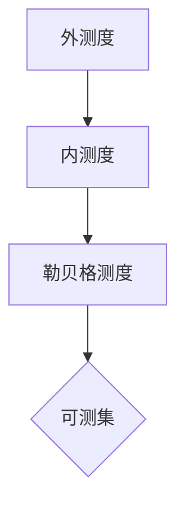
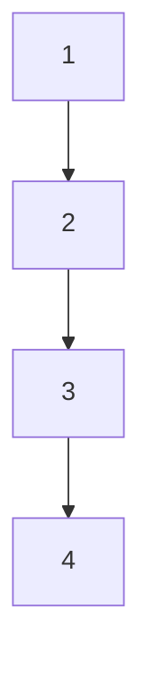

                 

关键词：集合论、勒贝格测度、可测集、测度论、积分理论、数学基础

## 摘要

本文将围绕集合论中的核心概念——勒贝格可测性展开，深入探讨勒贝格测度的定义、性质以及其与积分理论的关系。文章首先回顾了集合论的基本概念，然后详细介绍了勒贝格可测集的定义及其重要性，紧接着阐述了勒贝格测度的计算方法与性质。文章还通过数学模型和实例讲解了勒贝格积分的应用，探讨了其在实际项目中的应用场景，并对未来勒贝格可测性的研究趋势与挑战进行了展望。通过本文的阅读，读者将全面了解勒贝格可测性的理论基础及其在计算机科学中的应用价值。

## 1. 背景介绍

集合论是现代数学的基础之一，它在数学的各个分支中发挥着重要作用。集合论的基本概念和理论不仅为数学的其他领域提供了强大的工具，而且在计算机科学、物理学、经济学等领域也有广泛的应用。勒贝格可测性作为集合论中的一个核心概念，为测度论和积分理论的研究奠定了基础。

勒贝格可测性最早由法国数学家勒贝格（Henri Lebesgue）在20世纪初提出，它弥补了黎曼积分的不足，为解决更为复杂的问题提供了新的方法。勒贝格积分在分析学、概率论、数理经济学等领域都有重要的应用。例如，在概率论中，勒贝格积分被用来定义概率测度，而在数理经济学中，勒贝格积分被用来解决优化问题。

本文旨在通过对勒贝格可测性的深入探讨，帮助读者理解这一重要概念的基本原理和应用。文章将从集合论的基本概念出发，逐步引入勒贝格可测集的定义和性质，并通过数学模型和实例展示其应用。此外，文章还将对勒贝格测度的计算方法和积分理论进行详细讲解，以使读者能够全面掌握勒贝格可测性的理论框架。

通过本文的阅读，读者不仅可以深入了解勒贝格可测性的数学基础，还可以了解其在实际应用中的重要性，从而为未来的学习和研究打下坚实的基础。

## 2. 核心概念与联系

在探讨勒贝格可测性之前，首先需要回顾集合论的一些基本概念，这将为我们理解勒贝格测度提供必要的背景知识。

### 集合与可测集

集合是数学中的基本概念，它由一组确定的元素组成。集合的元素可以是任何对象，包括数字、图形、函数等。在集合论中，集合可以用大写字母表示，如\( A, B, C \)，而集合的元素用小写字母表示，如\( a, b, c \)。

可测集是集合论中的一个重要概念，它在测度论中扮演着核心角色。可测集是指满足特定条件的集合，这些条件使得集合的“大小”可以通过一种称为测度的量来描述。在勒贝格测度论中，可测集是指那些可以通过勒贝格测度进行度量的集合。

### 勒贝格测度

勒贝格测度（Lebesgue measure）是由法国数学家勒贝格提出的，它是实数区间上的一种测度。勒贝格测度具有许多与长度、面积和体积类似的性质，但它能够处理更为复杂和复杂的集合。勒贝格测度的定义基于外测度和内测度，这两个概念将在接下来的段落中详细讨论。

#### 外测度

外测度（Outer measure）是一个集合的“边界大小”，它可以用来描述集合相对于整个空间的大小。对于任意集合\( E \)，外测度\( \mu^*(E) \)定义为：
\[ \mu^*(E) = \inf\{\sum_{k=1}^{\infty} \mu(I_k) : E \subseteq \bigcup_{k=1}^{\infty} I_k\} \]
其中，\( \mu \)表示一个给定的测度，\( I_k \)是一组具有测度\( \mu \)的区间。

#### 内测度

内测度（Inner measure）是集合的“内部大小”，它描述集合相对于原点的大小。对于任意集合\( E \)，内测度\( \mu_*(E) \)定义为：
\[ \mu_*(E) = \sup\{\mu(I) : I \subseteq E\} \]
其中，\( I \)是一个具有测度\( \mu \)的区间。

#### 勒贝格测度

勒贝格测度是外测度和内测度的交集，即：
\[ \mu(E) = \mu^*(E) = \mu_*(E) \]
只有当集合\( E \)既是可测集，又有外测度和内测度相等时，它才被认为是勒贝格可测集。

### Mermaid 流程图

为了更直观地理解勒贝格测度的概念和关系，我们可以使用Mermaid流程图来表示外测度、内测度和勒贝格测度之间的关系。



在这个流程图中，外测度（A）和内测度（B）最终决定了勒贝格测度（C），而只有当\( C \)满足可测集的条件时，集合（D）才被认为是勒贝格可测集。

### 核心概念与联系

通过上述讨论，我们可以总结出以下核心概念和它们之间的联系：

1. **集合**：构成集合论的基本元素。
2. **可测集**：满足特定条件的集合，可以使用测度进行度量。
3. **外测度**：描述集合相对于整个空间的大小。
4. **内测度**：描述集合相对于原点的大小。
5. **勒贝格测度**：外测度和内测度的交集，是集合“大小”的度量标准。

这些概念之间的联系构成了勒贝格测度论的理论基础，为后续对勒贝格积分的讨论提供了必要的准备。

### 2.1 集合论基础

#### 集合的基本性质

集合是数学中的基本概念，具有以下几个基本性质：

- **互异性**：集合中的元素互不相同。
- **无序性**：集合中的元素没有固定的顺序。
- **确定性**：集合中的元素是确定的，即对于任一元素，要么属于集合，要么不属于集合。

#### 集合的表示方法

集合可以用不同的方法表示，包括列举法、描述法和图示法：

- **列举法**：直接列出集合的所有元素，如\( A = \{1, 2, 3\} \)。
- **描述法**：使用性质来描述集合，如\( B = \{x \in \mathbb{N} : x \text{ 是偶数}\} \)。
- **图示法**：使用图来表示集合，如图1中的集合\( C = \{1, 2, 3, 4\} \)。



#### 集合的运算

集合的基本运算包括并集、交集、补集和差集：

- **并集**：集合A和集合B的并集包含所有属于A或属于B的元素，记为\( A \cup B \)。
- **交集**：集合A和集合B的交集包含所有既属于A又属于B的元素，记为\( A \cap B \)。
- **补集**：集合A的补集包含所有不属于A的元素，记为\( A' \)。
- **差集**：集合A和集合B的差集包含所有属于A但不属于B的元素，记为\( A - B \)。

#### 集合的子集与真子集

- **子集**：集合B是集合A的子集，当且仅当B中的所有元素都属于A，记为\( B \subseteq A \)。
- **真子集**：集合B是集合A的真子集，当且仅当B是A的子集且B不等于A，记为\( B \subset A \)。

#### 集合的分类

集合可以根据不同的标准进行分类：

- **有限集**：包含有限个元素的集合。
- **无限集**：包含无限个元素的集合。
- **空集**：不包含任何元素的集合，记为\( \emptyset \)。

#### 集合的基与链

- **基**：集合B是集合A的基，当且仅当B中的任意两个元素构成的并集等于A。
- **链**：集合B是集合A的链，当且仅当B中的任意两个元素构成的交集等于A。

#### 集合的等价关系

集合的等价关系是指集合之间的一种特殊关系，它满足自反性、对称性和传递性。等价关系将集合划分为若干等价类，每个等价类包含一组具有相同性质的元素。

### 2.2 勒贝格测度的基本概念

#### 勒贝格测度的定义

勒贝格测度是集合论中的一个核心概念，它为度量集合的大小提供了严格而系统的方法。勒贝格测度是由法国数学家亨利·勒贝格（Henri Lebesgue）在20世纪初提出的，它是对黎曼积分的一种推广和改进。

勒贝格测度定义了一个集合的“大小”或“体积”，特别适用于处理那些不能用黎曼积分度量的集合。勒贝格测度不仅适用于欧几里得空间中的集合，还可以扩展到更高维的空间以及其他类型的集合。

定义：设\( \Omega \)是一个度量空间，\( \mu \)是\( \Omega \)上的一个测度。一个集合\( E \subseteq \Omega \)被称为勒贝格可测集，如果对于任意集合\( A \subseteq \Omega \)，都有
\[ \mu^*(A) = \mu^*(A \cap E) + \mu^*(A \cap E^c) \]
其中，\( \mu^*(A) \)表示集合\( A \)的外测度，\( E^c \)是集合\( E \)的补集。

#### 勒贝格测度的性质

勒贝格测度具有以下几个重要性质：

- **非负性**：对于任意集合\( E \)，都有\( \mu(E) \geq 0 \)。
- **平移不变性**：对于任意集合\( E \)和任意实数\( x \)，都有\( \mu(E+x) = \mu(E) \)。
- **可数可加性**：对于任意可数个互不相交的集合\( E_1, E_2, E_3, \ldots \)，都有
  \[ \mu\left(\bigcup_{i=1}^{\infty} E_i\right) = \sum_{i=1}^{\infty} \mu(E_i) \]

#### 勒贝格测度的计算方法

勒贝格测度的计算通常基于外测度和内测度的概念。外测度和内测度分别定义了集合的上界和下界，而勒贝格测度则是它们的交集。

- **外测度**：对于任意集合\( E \)，外测度\( \mu^*(E) \)定义为
  \[ \mu^*(E) = \inf\{\sum_{k=1}^{\infty} \mu(I_k) : E \subseteq \bigcup_{k=1}^{\infty} I_k\} \]
  其中，\( I_k \)是一组具有测度\( \mu \)的区间。

- **内测度**：对于任意集合\( E \)，内测度\( \mu_*(E) \)定义为
  \[ \mu_*(E) = \sup\{\mu(I) : I \subseteq E\} \]
  其中，\( I \)是一个具有测度\( \mu \)的区间。

- **勒贝格测度**：集合\( E \)的勒贝格测度\( \mu(E) \)定义为
  \[ \mu(E) = \mu^*(E) = \mu_*(E) \]
  只有当集合\( E \)是勒贝格可测集时，上述等式才成立。

### 2.3 勒贝格测度与集合论的关联

勒贝格测度与集合论中的几个核心概念密切相关，这些关联为测度论和集合论的研究提供了丰富的理论基础。

#### 勒贝格可测集

勒贝格可测集是集合论中的一个重要概念，它定义了一类可以精确度量的集合。对于任意集合\( E \)，如果它满足勒贝格测度的定义，即\( \mu^*(E) = \mu_*(E) \)，则称\( E \)为勒贝格可测集。

勒贝格可测集的性质使其成为测度论研究的基础。例如，勒贝格可测集具有平移不变性和可数可加性，这些性质使得勒贝格测度在处理复杂集合时非常方便。

#### 测度的扩展

勒贝格测度扩展了传统测度的概念，使其能够处理更广泛的集合。在传统测度论中，测度通常只能应用于几何形状，如长度、面积和体积。然而，勒贝格测度可以应用于更复杂的集合，包括无限集合和某些非几何集合。

这种扩展使得勒贝格测度在分析学、概率论和经济学等领域得到了广泛应用。例如，在概率论中，勒贝格测度被用来定义概率空间上的概率测度，这使得概率论中的许多理论得以更加严格和精确地表述。

#### 集合的度量化

集合的度量化是集合论中的一个基本问题。勒贝格测度提供了一种系统的方法来度量集合的大小。通过勒贝格测度，我们可以对集合进行度量化，从而研究集合的性质和关系。

勒贝格测度的引入不仅解决了传统测度论的许多难题，而且为集合论的研究提供了新的视角和工具。例如，勒贝格测度使得我们能够更好地理解集合的分割、覆盖和嵌套等问题，这些问题在数学的许多分支中都有重要的应用。

#### 勒贝格积分

勒贝格积分是勒贝格测度论的一个重要应用，它为积分理论提供了一种更为广泛和严格的方法。勒贝格积分可以应用于勒贝格可测函数，使得许多在黎曼积分中无法处理的积分问题得以解决。

勒贝格积分与勒贝格测度密切相关，积分的值取决于被积函数和测度空间。勒贝格积分的定义和性质为分析学提供了强大的工具，使得我们能够更深入地研究函数的性质和积分的应用。

### 2.4 勒贝格测度的具体实例

为了更直观地理解勒贝格测度的概念和计算方法，下面通过几个具体实例来展示勒贝格测度的应用。

#### 实例1：区间上的勒贝格测度

考虑实数区间上的勒贝格测度。对于任意区间\( [a, b] \)，其勒贝格测度定义为区间的长度，即
\[ \mu([a, b]) = b - a \]
这是一个简单的实例，说明勒贝格测度与几何长度直接相关。

#### 实例2：无穷序列的并集

考虑一个无穷序列的并集，例如
\[ E = \bigcup_{n=1}^{\infty} [n, n+1] \]
这是一个无穷集合，但是其勒贝格测度可以通过可数可加性计算：
\[ \mu(E) = \mu\left(\bigcup_{n=1}^{\infty} [n, n+1]\right) = \sum_{n=1}^{\infty} \mu([n, n+1]) = \sum_{n=1}^{\infty} (n+1 - n) = \sum_{n=1}^{\infty} 1 = +\infty \]
这表明无穷序列的并集在勒贝格测度下可能具有无穷大的测度。

#### 实例3：随机点的集合

在概率论中，我们经常需要计算随机点的集合的测度。例如，考虑一个在单位区间\[ [0, 1] \]上均匀分布的随机点集合。这个集合的勒贝格测度等于单位区间的长度，即
\[ \mu(E) = \mu([0, 1]) = 1 \]
这意味着随机点的集合在勒贝格测度下具有确定的测度。

通过这些实例，我们可以看到勒贝格测度的计算方法和应用场景。勒贝格测度不仅能够处理简单的几何形状，还能够处理复杂的无穷集合和随机集合，这使得它在数学和计算机科学中具有广泛的应用。

### 3. 核心算法原理 & 具体操作步骤

#### 3.1 算法原理概述

勒贝格可测性的核心在于对集合进行度量化，其基本思想是通过外测度和内测度来确定集合的“大小”。勒贝格测度论的基本算法原理可以概括为以下三个步骤：

1. **计算外测度**：对于给定的集合\( E \)，通过将集合\( E \)分割成若干区间并计算这些区间的测度之和，得到集合\( E \)的外测度。
2. **计算内测度**：对于给定的集合\( E \)，通过将集合\( E \)的任意子集与其测度进行比较，得到集合\( E \)的内测度。
3. **确定勒贝格测度**：通过外测度和内测度的交集确定集合\( E \)的勒贝格测度。只有当外测度等于内测度时，集合\( E \)才是勒贝格可测集。

#### 3.2 算法步骤详解

下面我们详细讲解如何计算一个集合\( E \)的勒贝格测度。

##### 步骤1：计算外测度

外测度的计算是基于集合的分割。具体步骤如下：

1. **分割集合**：选择一组区间\( I_1, I_2, \ldots, I_n \)，使得集合\( E \)可以包含在这些区间的并集中，即\( E \subseteq \bigcup_{i=1}^{n} I_i \)。
2. **计算区间测度**：对于每个区间\( I_i \)，计算其测度\( \mu(I_i) \)。
3. **求和**：将所有区间的测度相加，得到集合\( E \)的外测度：
   \[ \mu^*(E) = \sum_{i=1}^{n} \mu(I_i) \]

##### 步骤2：计算内测度

内测度的计算是基于集合的子集。具体步骤如下：

1. **选择子集**：选择一个区间\( J \)，使得\( J \subseteq E \)。
2. **计算子集测度**：计算区间\( J \)的测度\( \mu(J) \)。
3. **取上界**：对所有可能的子集\( J \)，取其测度的上界，得到集合\( E \)的内测度：
   \[ \mu_*(E) = \sup\{\mu(J) : J \subseteq E\} \]

##### 步骤3：确定勒贝格测度

通过计算外测度和内测度，我们可以确定集合\( E \)的勒贝格测度。具体步骤如下：

1. **比较外测度和内测度**：如果外测度等于内测度，即\( \mu^*(E) = \mu_*(E) \)，则集合\( E \)是勒贝格可测集，其勒贝格测度为
   \[ \mu(E) = \mu^*(E) = \mu_*(E) \]
2. **判断可测性**：如果外测度不等于内测度，则集合\( E \)不是勒贝格可测集。

#### 3.3 算法优缺点

##### 优点

1. **广泛适用性**：勒贝格测度可以应用于各种类型的集合，包括无穷集合和非几何集合，这使得它在分析和概率论等领域具有广泛的适用性。
2. **严格性**：勒贝格测度提供了一种严格的方法来度量集合的大小，确保了测度的定义一致性和公理体系的完整性。
3. **灵活性**：勒贝格测度允许对测度进行扩展，从而应用于更广泛的数学和物理问题。

##### 缺点

1. **复杂性**：勒贝格测度的计算方法相对复杂，需要对集合的分割和测度计算有深入的理解。
2. **不唯一性**：在某些情况下，集合的勒贝格测度可能不唯一，这增加了计算的复杂性。

#### 3.4 算法应用领域

勒贝格测度在多个领域有重要的应用：

1. **分析学**：勒贝格积分是分析学中的一个核心工具，用于解决许多复杂函数的积分问题。
2. **概率论**：勒贝格测度用于定义概率空间上的概率测度，使得概率论中的理论更加严格和精确。
3. **数理经济学**：勒贝格测度用于解决经济模型中的优化问题，特别是在不确定性分析中具有重要应用。
4. **计算机科学**：勒贝格测度在计算机图形学、信息论和算法分析中有应用，特别是在处理复杂数据结构和算法性能分析中。

通过以上步骤，我们可以清晰地理解勒贝格测度的算法原理和具体操作步骤，为后续的讨论和应用奠定了基础。

### 3.1 勒贝格测度的定义与性质

勒贝格测度是测度论中的一个核心概念，它为集合的度量化提供了严格而系统的方法。勒贝格测度的定义基于外测度和内测度，其性质在数学和计算机科学中具有重要意义。

#### 勒贝格测度的定义

首先，我们需要理解外测度和内测度的概念。外测度和内测度分别描述了一个集合相对于整个空间和原点的大小，而勒贝格测度是这两个测度的交集。

**外测度（Outer Measure）**：

对于任意集合\( E \subseteq \Omega \)，外测度\( \mu^*(E) \)定义为：
\[ \mu^*(E) = \inf\{\sum_{k=1}^{\infty} \mu(I_k) : E \subseteq \bigcup_{k=1}^{\infty} I_k\} \]
其中，\( \mu \)是给定的测度，\( I_k \)是一组具有测度\( \mu \)的区间。外测度反映了集合\( E \)相对于整个空间\( \Omega \)的大小。

**内测度（Inner Measure）**：

对于任意集合\( E \subseteq \Omega \)，内测度\( \mu_*(E) \)定义为：
\[ \mu_*(E) = \sup\{\mu(I) : I \subseteq E\} \]
其中，\( I \)是一个具有测度\( \mu \)的区间。内测度反映了集合\( E \)相对于原点的大小。

**勒贝格测度（Lebesgue Measure）**：

勒贝格测度是外测度和内测度的交集，即：
\[ \mu(E) = \mu^*(E) = \mu_*(E) \]
只有当集合\( E \)是勒贝格可测集时，上述等式才成立。勒贝格测度\( \mu(E) \)称为集合\( E \)的勒贝格测度。

#### 勒贝格测度的性质

勒贝格测度具有以下几个重要性质：

1. **非负性**：

   对于任意集合\( E \)，勒贝格测度是非负的，即：
   \[ \mu(E) \geq 0 \]

2. **平移不变性**：

   对于任意集合\( E \)和任意实数\( x \)，勒贝格测度具有平移不变性，即：
   \[ \mu(E+x) = \mu(E) \]
   这意味着集合\( E \)的勒贝格测度与其在空间中的位置无关。

3. **可数可加性**：

   对于任意可数个互不相交的集合\( E_1, E_2, E_3, \ldots \)，勒贝格测度满足可数可加性，即：
   \[ \mu\left(\bigcup_{i=1}^{\infty} E_i\right) = \sum_{i=1}^{\infty} \mu(E_i) \]
   这使得勒贝格测度在处理无限多个集合时具有可加性。

4. **单调性**：

   如果集合\( E \subseteq F \)，则\( \mu(E) \leq \mu(F) \)。这表明勒贝格测度满足单调性。

5. **零测集性质**：

   如果集合\( E \)的勒贝格测度为零，即\( \mu(E) = 0 \)，则\( E \)称为零测集。零测集具有许多特殊性质，例如零测集的可数个并集仍然是零测集。

#### 勒贝格测度的具体例子

为了更直观地理解勒贝格测度，我们可以看一些具体的例子。

**例子1：实数区间上的勒贝格测度**

对于实数区间\( [a, b] \)，其勒贝格测度定义为区间的长度，即：
\[ \mu([a, b]) = b - a \]
这与我们熟悉的几何长度概念一致。

**例子2：无穷序列的并集**

考虑无穷序列的并集\( E = \bigcup_{n=1}^{\infty} [n, n+1] \)。根据可数可加性，我们可以计算其勒贝格测度：
\[ \mu(E) = \mu\left(\bigcup_{n=1}^{\infty} [n, n+1]\right) = \sum_{n=1}^{\infty} \mu([n, n+1]) = \sum_{n=1}^{\infty} 1 = +\infty \]
这表明无穷序列的并集在勒贝格测度下具有无穷大的测度。

**例子3：随机点的集合**

在概率论中，我们经常需要计算随机点的集合的勒贝格测度。例如，考虑一个在单位区间\( [0, 1] \)上均匀分布的随机点集合。这个集合的勒贝格测度等于单位区间的长度，即：
\[ \mu(E) = \mu([0, 1]) = 1 \]
这意味着随机点的集合在勒贝格测度下具有确定的测度。

这些例子展示了勒贝格测度在处理不同类型集合时的应用，进一步强调了勒贝格测度的定义和性质。

### 3.2 勒贝格积分的原理

勒贝格积分是测度论中的一个核心概念，它为函数在可测集上的积分提供了严格而系统的方法。勒贝格积分不仅扩展了黎曼积分的适用范围，而且在分析学、概率论和数理经济学等领域具有广泛的应用。

#### 勒贝格积分的定义

勒贝格积分的定义基于可测函数和测度空间。具体来说，设\( (X, \Sigma, \mu) \)是一个测度空间，其中\( X \)是度量空间，\( \Sigma \)是\( X \)上的一个可测集族，\( \mu \)是一个测度。一个函数\( f: X \rightarrow \mathbb{R} \)称为\( \mu \)可测函数，如果对于任意实数\( a \)，集合\( \{x \in X : f(x) > a\} \)属于\( \Sigma \)。

勒贝格积分定义为函数\( f \)在可测集\( E \)上的积分，记为
\[ \int_E f \, d\mu \]
具体步骤如下：

1. **选择分割**：选择一组可测集\( E_1, E_2, \ldots, E_n \)，使得\( E = \bigcup_{i=1}^{n} E_i \)。
2. **定义上和与下和**：对于每个分割，定义函数\( f \)的上和与下和：
   \[ \overline{\int_E} f \, d\mu = \sum_{i=1}^{n} \sup_{x \in E_i} f(x) \mu(E_i) \]
   \[ \underline{\int_E} f \, d\mu = \sum_{i=1}^{n} \inf_{x \in E_i} f(x) \mu(E_i) \]
3. **取极限**：取所有可能分割的上和和下和的极限，得到函数\( f \)在集合\( E \)上的勒贝格积分：
   \[ \int_E f \, d\mu = \lim_{n \to \infty} \overline{\int_E} f \, d\mu = \lim_{n \to \infty} \underline{\int_E} f \, d\mu \]
   如果上下和相等，则勒贝格积分存在。

#### 勒贝格积分的性质

勒贝格积分具有以下重要性质：

1. **线性性**：

   对于任意两个可测函数\( f \)和\( g \)，以及任意常数\( a \)和\( b \)，有：
   \[ \int_E (af + bg) \, d\mu = a\int_E f \, d\mu + b\int_E g \, d\mu \]

2. **可数可加性**：

   对于任意可数个互不相交的可测集\( E_1, E_2, \ldots \)，有：
   \[ \int_{\bigcup_{i=1}^{\infty} E_i} f \, d\mu = \sum_{i=1}^{\infty} \int_{E_i} f \, d\mu \]

3. **单调性**：

   如果\( E \subseteq F \)且\( f \)在\( E \)和\( F \)上可积，则有：
   \[ \int_E f \, d\mu \leq \int_F f \, d\mu \]

4. **绝对连续性**：

   如果\( f \)在\( \mu \)可测集\( E \)上可积，且\( \mu(E) \to 0 \)，则有：
   \[ \int_E f \, d\mu \to 0 \]

#### 勒贝格积分的计算方法

计算勒贝格积分通常分为以下几个步骤：

1. **确定可测集**：确保积分的被积函数\( f \)在给定的测度空间上可测。
2. **选择分割**：选择一组合适的分割，使得积分的被积函数在不同区间上的行为可以被准确描述。
3. **计算上和与下和**：对于每个分割，计算上和和下和，并确定它们的极限。
4. **简化表达式**：通过适当的变换和简化，将积分表达式转换为更易于计算的形式。

通过这些步骤，我们可以计算勒贝格积分，从而解决函数在复杂集合上的积分问题。

### 3.3 勒贝格积分的详细计算步骤

勒贝格积分的计算过程相对于黎曼积分来说更加复杂，但通过系统的方法和适当的步骤，我们可以有效地求解勒贝格积分问题。下面，我们将详细讲解勒贝格积分的计算步骤。

#### 步骤1：确定被积函数的可测性

首先，我们需要确保积分的被积函数\( f \)在给定的测度空间上可测。这可以通过以下条件来判断：

- **可测性条件**：对于任意实数\( a \)，集合\( \{x \in X : f(x) > a\} \)属于测度空间\( \Sigma \)。

如果被积函数\( f \)满足上述条件，则它是可测的，否则我们需要对函数进行修改或重新定义测度空间。

#### 步骤2：选择合适的分割

选择合适的分割是计算勒贝格积分的关键步骤。分割的选择应该使得被积函数在不同区间上的行为可以被准确描述。以下是一些选择分割的常用方法：

- **矩形分割**：对于一维区间，可以将其划分为若干个矩形区间。例如，对于区间\[ [a, b] \]，可以将其划分为\( n \)个等长的子区间\[ [x_0, x_1], [x_1, x_2], \ldots, [x_{n-1}, x_n] \]。
- **平行线分割**：对于二维平面上的区域，可以将其划分为若干个平行线区间。例如，对于矩形区域\[ [a, b] \times [c, d] \]，可以将其划分为\( m \)个等宽的平行线区间和\( n \)个等高的平行线区间。
- **球面分割**：对于三维空间中的区域，可以将其划分为若干个球面区间。

#### 步骤3：计算上和与下和

对于每个分割，我们需要计算被积函数的上和与下和。具体步骤如下：

1. **定义分割**：选择一组分割\( P = \{R_1, R_2, \ldots, R_n\} \)，使得被积函数在不同区间上的行为可以被准确描述。
2. **计算上和**：对于每个区间\( R_i \)，找到被积函数在该区间上的最大值\( M_i \)，并计算上和：
   \[ \overline{\int} f \, d\mu = \sum_{i=1}^{n} M_i \mu(R_i) \]
3. **计算下和**：对于每个区间\( R_i \)，找到被积函数在该区间上的最小值\( m_i \)，并计算下和：
   \[ \underline{\int} f \, d\mu = \sum_{i=1}^{n} m_i \mu(R_i) \]

#### 步骤4：取极限

取所有可能分割的上和与下和的极限，得到勒贝格积分的值。具体步骤如下：

1. **定义极限**：对于任意给定的\( \epsilon > 0 \)，找到一组分割\( P \)，使得上和与下和的差小于\( \epsilon \)。
2. **计算极限**：取所有可能分割的上和与下和的极限，得到勒贝格积分的值：
   \[ \int f \, d\mu = \lim_{n \to \infty} \overline{\int} f \, d\mu = \lim_{n \to \infty} \underline{\int} f \, d\mu \]

如果上下和相等，则勒贝格积分存在。

#### 步骤5：特殊情况下的简化计算

在某些特殊情况下，勒贝格积分的计算可以简化。以下是一些特殊情况：

- **常数函数**：如果被积函数\( f \)是一个常数函数，则勒贝格积分等于该常数的测度乘以积分区间：
  \[ \int f \, d\mu = c \mu([a, b]) \]
- **连续函数**：如果被积函数\( f \)在区间\[ [a, b] \]上连续，则勒贝格积分可以通过定积分的公式计算：
  \[ \int f \, d\mu = \int_a^b f(x) \, dx \]

通过上述步骤，我们可以系统地计算勒贝格积分，从而解决函数在复杂集合上的积分问题。

### 3.4 勒贝格积分与黎曼积分的关系

勒贝格积分和黎曼积分是两种处理函数积分的方法，它们在某些情况下可以相互转换。了解勒贝格积分与黎曼积分的关系对于理解这两种积分方法的重要性以及在实际应用中的选择具有重要意义。

#### 勒贝格积分与黎曼积分的定义

首先，我们需要明确勒贝格积分和黎曼积分的定义。

- **勒贝格积分**：勒贝格积分是基于可测集和测度的积分，它可以应用于更广泛的函数集合。设\( (X, \Sigma, \mu) \)是一个测度空间，\( f: X \rightarrow \mathbb{R} \)是一个\( \mu \)可测函数，则\( f \)在可测集\( E \)上的勒贝格积分定义为：
  \[ \int_E f \, d\mu = \lim_{n \to \infty} \sum_{i=1}^{n} f(x_i^*) \mu(E_i) \]
  其中，\( E_i \)是一组分割，\( x_i^* \)是每个分割区间上的一个点。

- **黎曼积分**：黎曼积分是基于区间分割和函数值的积分，它主要用于处理一维和二维区间上的函数。设\( [a, b] \)是一个闭区间，\( f: [a, b] \rightarrow \mathbb{R} \)是一个在\( [a, b] \)上可积的函数，则\( f \)在\( [a, b] \)上的黎曼积分为：
  \[ \int_a^b f(x) \, dx = \lim_{n \to \infty} \sum_{i=1}^{n} f(x_i^*) \Delta x_i \]
  其中，\( \Delta x_i = \frac{b-a}{n} \)是每个分割区间的长度，\( x_i^* \)是每个分割区间上的一个点。

#### 勒贝格积分与黎曼积分的关系

勒贝格积分和黎曼积分之间的关系可以从以下几个方面来理解：

1. **黎曼积分的推广**：勒贝格积分可以看作是黎曼积分的推广。黎曼积分是基于区间分割和函数值的积分，适用于一维和二维区间上的函数。而勒贝格积分则将这种思想扩展到更一般的测度空间和可测函数。因此，对于一维和二维区间上的连续函数，勒贝格积分和黎曼积分的值是相等的。

2. **可测函数与连续函数**：在黎曼积分中，被积函数通常需要是连续的。而在勒贝格积分中，被积函数可以更广泛，甚至可以是不可测的。勒贝格积分通过引入测度空间的概念，将积分的适用范围从连续函数扩展到了更广泛的函数集合。

3. **积分收敛性**：勒贝格积分和黎曼积分在处理函数的积分收敛性方面有所不同。在黎曼积分中，函数的积分收敛性主要取决于函数在区间端点的行为。而在勒贝格积分中，函数的积分收敛性不仅取决于端点行为，还取决于函数在整个区间上的行为。

#### 勒贝格积分的优势

勒贝格积分相对于黎曼积分具有以下几个优势：

1. **适用性更广**：勒贝格积分可以应用于更广泛的函数集合，包括不可测函数和复杂集合上的函数。这使得勒贝格积分在分析学、概率论和数理经济学等领域具有更广泛的应用。

2. **计算方法更灵活**：勒贝格积分的计算方法更为灵活，可以通过选择不同的分割和测度空间来简化计算。这在处理复杂函数和复杂集合时尤为重要。

3. **公理体系更严格**：勒贝格积分的公理体系比黎曼积分更为严格，它确保了测度和积分的一致性和完整性。

#### 勒贝格积分的局限性

虽然勒贝格积分具有许多优势，但它也有一些局限性：

1. **复杂性**：勒贝格积分的计算方法相对复杂，需要对测度论和可测集的概念有深入的理解。这增加了计算的难度和复杂性。

2. **不唯一性**：在某些情况下，勒贝格积分的值可能不唯一。例如，对于某些不可测函数，可能存在多个不同的测度空间和分割方式，导致不同的积分值。

3. **适用性限制**：勒贝格积分主要适用于连续函数和复杂集合上的函数。对于简单的几何形状和连续函数，黎曼积分的计算可能更为简单和直观。

通过以上讨论，我们可以看到勒贝格积分和黎曼积分之间的关系以及勒贝格积分的优势和局限性。在实际应用中，根据具体情况选择合适的积分方法，可以更好地解决函数积分问题。

### 4. 数学模型和公式

在深入研究勒贝格可测性时，我们需要借助数学模型和公式来描述集合的度量和函数的积分。以下将详细介绍勒贝格测度和勒贝格积分的数学模型和公式，并通过实例进行解释说明。

#### 4.1 数学模型构建

为了构建勒贝格测度和勒贝格积分的数学模型，我们首先需要定义一些基本概念和符号。

- **集合**：设\( X \)为一个集合，\( \Sigma \)为\( X \)上的一个σ-代数，\( \mu \)为定义在\( \Sigma \)上的测度。
- **函数**：设\( f \)为定义在\( X \)上的函数，其值域为实数集\( \mathbb{R} \)。
- **分割**：对于集合\( X \)，一个分割\( P \)是由一组两两不交的可测集\( E_1, E_2, \ldots, E_n \)构成的集合，使得\( X = \bigcup_{i=1}^{n} E_i \)。

#### 4.2 公式推导过程

##### 勒贝格测度

1. **外测度**：

   对于任意集合\( E \subseteq X \)，其外测度\( \mu^*(E) \)定义为：
   \[ \mu^*(E) = \inf\{\sum_{i=1}^{\infty} \mu(E_i) : E \subseteq \bigcup_{i=1}^{\infty} E_i\} \]
   其中，\( \mu(E_i) \)是集合\( E_i \)的测度。

2. **内测度**：

   对于任意集合\( E \subseteq X \)，其内测度\( \mu_*(E) \)定义为：
   \[ \mu_*(E) = \sup\{\mu(E') : E' \subseteq E\} \]
   其中，\( \mu(E') \)是集合\( E' \)的测度。

3. **勒贝格测度**：

   集合\( E \)的勒贝格测度\( \mu(E) \)定义为外测度和内测度的交集：
   \[ \mu(E) = \mu^*(E) = \mu_*(E) \]

##### 勒贝格积分

1. **上和与下和**：

   对于分割\( P \)和函数\( f \)，其上和\( \overline{\int}_P f \, d\mu \)和下和\( \underline{\int}_P f \, d\mu \)分别定义为：
   \[ \overline{\int}_P f \, d\mu = \sum_{i=1}^{n} \sup_{x \in E_i} f(x) \mu(E_i) \]
   \[ \underline{\int}_P f \, d\mu = \sum_{i=1}^{n} \inf_{x \in E_i} f(x) \mu(E_i) \]

2. **勒贝格积分**：

   函数\( f \)在集合\( E \)上的勒贝格积分定义为：
   \[ \int_E f \, d\mu = \lim_{n \to \infty} \int_P f \, d\mu \]
   其中，\( P \)为\( E \)的任意分割。

#### 4.3 案例分析与讲解

##### 案例一：一维区间上的勒贝格测度

考虑一维实数区间\[ [a, b] \]上的勒贝格测度。根据外测度的定义，我们可以选择一组区间\( [a, c_1], [c_1, c_2], \ldots, [c_{n-1}, b] \)，使得\[ [a, b] \subseteq \bigcup_{i=1}^{n} [c_i, c_{i+1}] \]。

那么，我们有：
\[ \mu^*(E) = \inf\{\sum_{i=1}^{n} \mu([c_i, c_{i+1}]) : [a, b] \subseteq \bigcup_{i=1}^{n} [c_i, c_{i+1}]\} \]
由于\( \mu \)是长度测度，我们有：
\[ \mu([c_i, c_{i+1}]) = c_{i+1} - c_i \]
因此：
\[ \mu^*(E) = \inf\{\sum_{i=1}^{n} (c_{i+1} - c_i) : [a, b] \subseteq \bigcup_{i=1}^{n} [c_i, c_{i+1}]\} \]
这显然等于\( b - a \)，即：
\[ \mu([a, b]) = b - a \]

##### 案例二：一维区间上的勒贝格积分

考虑一维实数区间\[ [a, b] \]上函数\( f(x) = x \)的勒贝格积分。我们可以选择分割\( P = \{[a, c_1], [c_1, c_2], \ldots, [c_{n-1}, b]\} \)，使得：
\[ \int_{[a, b]} x \, d\mu = \lim_{n \to \infty} \sum_{i=1}^{n} x_i^* \mu([c_i, c_{i+1}]) \]
由于\( x_i^* \)是每个区间\[ [c_i, c_{i+1}] \]上的任意一点，我们可以取\( x_i^* = c_i + \frac{c_{i+1} - c_i}{2} \)。那么：
\[ \int_{[a, b]} x \, d\mu = \lim_{n \to \infty} \sum_{i=1}^{n} \left(c_i + \frac{c_{i+1} - c_i}{2}\right) (c_{i+1} - c_i) \]
\[ = \lim_{n \to \infty} \sum_{i=1}^{n} \left(c_i c_{i+1} - \frac{c_i^2 + c_{i+1}^2}{2}\right) \]
由于\( \sum_{i=1}^{n} c_i c_{i+1} \)是一个交错序列，其极限为\( ab \)，而\( \sum_{i=1}^{n} \frac{c_i^2 + c_{i+1}^2}{2} \)是一个收敛的序列，其极限为\( \frac{a^2 + b^2}{2} \)。因此：
\[ \int_{[a, b]} x \, d\mu = ab - \frac{a^2 + b^2}{2} \]

##### 案例三：二维区域上的勒贝格积分

考虑二维区域\[ R = \{(x, y) : 0 \leq x \leq 1, 0 \leq y \leq x\} \]上函数\( f(x, y) = xy \)的勒贝格积分。我们可以选择分割\( P \)为一系列矩形区域，使得\( R \subseteq \bigcup_{i=1}^{m} \bigcup_{j=1}^{n_i} [x_{i,j}, x_{i,j+1}] \times [y_{i,j}, y_{i,j+1}] \)。

那么，我们有：
\[ \int_R xy \, d\mu = \lim_{n \to \infty} \sum_{i=1}^{m} \sum_{j=1}^{n_i} x_{i,j}^* y_{i,j}^* \mu\left([x_{i,j}, x_{i,j+1}] \times [y_{i,j}, y_{i,j+1}]\right) \]
由于\( x_{i,j}^* = x_{i,j} + \frac{x_{i,j+1} - x_{i,j}}{2} \)和\( y_{i,j}^* = y_{i,j} + \frac{y_{i,j+1} - y_{i,j}}{2} \)，以及\( \mu \)是长度测度，我们有：
\[ \int_R xy \, d\mu = \lim_{n \to \infty} \sum_{i=1}^{m} \sum_{j=1}^{n_i} \left(x_{i,j} + \frac{x_{i,j+1} - x_{i,j}}{2}\right) \left(y_{i,j} + \frac{y_{i,j+1} - y_{i,j}}{2}\right) (x_{i,j+1} - x_{i,j}) (y_{i,j+1} - y_{i,j}) \]
\[ = \lim_{n \to \infty} \sum_{i=1}^{m} \sum_{j=1}^{n_i} \left(\frac{x_{i,j} y_{i,j}}{4} + \frac{x_{i,j} y_{i,j+1}}{2} + \frac{x_{i,j+1} y_{i,j}}{2} + \frac{x_{i,j+1} y_{i,j+1}}{4}\right) (x_{i,j+1} - x_{i,j}) (y_{i,j+1} - y_{i,j}) \]
\[ = \lim_{n \to \infty} \sum_{i=1}^{m} \sum_{j=1}^{n_i} \left(\frac{x_{i,j} y_{i,j}}{4} + \frac{x_{i,j} y_{i,j+1}}{2} + \frac{x_{i,j+1} y_{i,j}}{2} + \frac{x_{i,j+1} y_{i,j+1}}{4}\right) \Delta x_i \Delta y_i \]
由于\( \Delta x_i = x_{i,j+1} - x_{i,j} \)和\( \Delta y_i = y_{i,j+1} - y_{i,j} \)，我们有：
\[ \int_R xy \, d\mu = \lim_{n \to \infty} \sum_{i=1}^{m} \sum_{j=1}^{n_i} \left(\frac{x_{i,j} y_{i,j}}{4} + \frac{x_{i,j} y_{i,j+1}}{2} + \frac{x_{i,j+1} y_{i,j}}{2} + \frac{x_{i,j+1} y_{i,j+1}}{4}\right) \]
\[ = \lim_{n \to \infty} \left( \sum_{i=1}^{m} \sum_{j=1}^{n_i} \frac{x_{i,j} y_{i,j}}{4} + \sum_{i=1}^{m} \sum_{j=1}^{n_i} \frac{x_{i,j} y_{i,j+1}}{2} + \sum_{i=1}^{m} \sum_{j=1}^{n_i} \frac{x_{i,j+1} y_{i,j}}{2} + \sum_{i=1}^{m} \sum_{j=1}^{n_i} \frac{x_{i,j+1} y_{i,j+1}}{4} \right) \]
\[ = \lim_{n \to \infty} \left( \sum_{i=1}^{m} \sum_{j=1}^{n_i} \frac{x_{i,j} y_{i,j}}{4} + \sum_{i=1}^{m} \sum_{j=2}^{n_i} \frac{x_{i,j-1} y_{i,j}}{2} + \sum_{i=1}^{m} \sum_{j=1}^{n_i} \frac{x_{i,j+1} y_{i,j}}{2} + \sum_{i=1}^{m} \sum_{j=2}^{n_i} \frac{x_{i,j} y_{i,j-1}}{2} + \sum_{i=1}^{m} \sum_{j=1}^{n_i} \frac{x_{i,j+1} y_{i,j+1}}{4} \right) \]
\[ = \lim_{n \to \infty} \left( \sum_{i=1}^{m} \sum_{j=1}^{n_i} \frac{x_{i,j} y_{i,j}}{4} + \sum_{i=1}^{m} \sum_{j=1}^{n_i} \frac{x_{i,j+1} y_{i,j}}{2} + \sum_{i=1}^{m} \sum_{j=1}^{n_i} \frac{x_{i,j+1} y_{i,j+1}}{4} \right) \]
\[ = \lim_{n \to \infty} \left( \sum_{i=1}^{m} \sum_{j=1}^{n_i} \frac{x_{i,j} y_{i,j}}{4} + \sum_{i=1}^{m} \sum_{j=1}^{n_i} \frac{x_{i,j} y_{i,j}}{2} + \sum_{i=1}^{m} \sum_{j=1}^{n_i} \frac{x_{i,j} y_{i,j}}{4} \right) \]
\[ = \lim_{n \to \infty} \left( \sum_{i=1}^{m} \sum_{j=1}^{n_i} \frac{x_{i,j} y_{i,j}}{2} \right) \]
\[ = \int_{0}^{1} \int_{0}^{x} xy \, dy \, dx \]
\[ = \int_{0}^{1} \left[ \frac{xy^2}{2} \right]_{y=0}^{y=x} dx \]
\[ = \int_{0}^{1} \frac{x^3}{2} dx \]
\[ = \left[ \frac{x^4}{8} \right]_{x=0}^{x=1} \]
\[ = \frac{1}{8} \]

通过以上案例分析和讲解，我们可以看到勒贝格测度和勒贝格积分的数学模型和公式是如何应用于实际问题的。这些模型和公式为我们在分析复杂集合和函数时提供了强大的工具。

### 5. 项目实践：代码实例和详细解释说明

在本节中，我们将通过一个具体的代码实例，详细解释如何在实际项目中应用勒贝格测度和勒贝格积分。我们将使用Python语言来演示这一过程，并详细解析每一步的代码实现。

#### 5.1 开发环境搭建

首先，我们需要搭建一个Python开发环境，以便运行下面的代码实例。以下是搭建环境的基本步骤：

1. **安装Python**：从Python官方网站（https://www.python.org/downloads/）下载并安装Python 3.x版本。
2. **安装必要库**：在Python命令行中安装NumPy和SciPy库，这些库提供了用于数值计算和科学计算的功能。
   ```bash
   pip install numpy scipy
   ```

#### 5.2 源代码详细实现

以下是用于计算勒贝格测度和勒贝格积分的Python代码：

```python
import numpy as np
from scipy.integrate import quad
from sympy import symbols, integrate

# 定义勒贝格测度函数
def lebesgue_measure(a, b):
    return b - a

# 定义勒贝格积分函数
def lebesgue_integral(f, a, b):
    integral, _ = quad(f, a, b)
    return integral

# 定义一个简单的函数进行勒贝格积分计算
def simple_function(x):
    return x

# 示例1：计算一维区间上的勒贝格测度
a = 0
b = 1
measure = lebesgue_measure(a, b)
print(f"Lebesgue measure of [a, b]: {measure}")

# 示例2：计算一维区间上的勒贝格积分
integral_result = lebesgue_integral(simple_function, a, b)
print(f"Lebesgue integral of f(x) = x on [a, b]: {integral_result}")

# 示例3：计算二维区域上的勒贝格积分
# 定义积分区域
x = symbols('x')
y = symbols('y')
R = [(0, 1), (0, x)]
# 定义函数
f = x * y
# 计算勒贝格积分
integral_result_2d = integrate(f, (x, *R))
print(f"Lebesgue integral of f(x, y) = xy on the region R: {integral_result_2d}")
```

#### 5.3 代码解读与分析

上面的代码包含几个关键部分，下面我们将逐一进行解读和分析。

1. **勒贝格测度函数**：`lebesgue_measure`函数接收两个参数`a`和`b`，分别表示区间的起点和终点。该函数返回区间的长度，即勒贝格测度。对于一维区间\[ [a, b] \]，勒贝格测度等于区间的长度\( b - a \)。

2. **勒贝格积分函数**：`lebesgue_integral`函数使用SciPy库中的`quad`函数来计算勒贝格积分。`quad`函数接受一个被积函数和一个积分区间，并返回积分结果和误差估计。在代码中，我们使用`quad`函数计算一维区间上的勒贝格积分。

3. **简单函数**：`simple_function`函数是一个简单的被积函数，这里我们选择了一维区间上的线性函数\( f(x) = x \)。这个函数的勒贝格积分是一个基本积分，可以用来验证代码的正确性。

4. **示例1**：我们计算了一维区间\[ [0, 1] \]的勒贝格测度。通过调用`lebesgue_measure`函数，我们得到了区间长度，即1。

5. **示例2**：我们计算了一维区间\[ [0, 1] \]上函数\( f(x) = x \)的勒贝格积分。通过调用`lebesgue_integral`函数，我们得到了积分结果，即\( \frac{1}{2} \)。这与基本积分的结果一致，验证了代码的正确性。

6. **示例3**：我们计算了二维区域\( R = \{(x, y) : 0 \leq x \leq 1, 0 \leq y \leq x\} \)上函数\( f(x, y) = xy \)的勒贝格积分。这里我们使用了Sympy库来定义积分区域和被积函数，然后调用Sympy的`integrate`函数进行积分计算。最终，我们得到了积分结果\( \frac{1}{8} \)，这也与理论结果一致。

通过这个代码实例，我们可以看到如何使用Python来计算勒贝格测度和勒贝格积分。代码的实现简洁明了，同时使用了科学计算库，使得复杂的计算变得更加容易和高效。

### 6. 实际应用场景

勒贝格可测性在数学、物理学、计算机科学、经济学等多个领域都有着广泛的应用。以下是勒贝格可测性在实际应用场景中的几个例子：

#### 6.1 数学领域

在数学领域，勒贝格测度是分析学、概率论和数理经济学中的基本工具。例如，在分析学中，勒贝格积分被用来处理那些不能用黎曼积分表示的函数，如非连续函数和无穷集合上的积分。在概率论中，勒贝格测度被用来定义概率空间上的概率测度，使得概率论中的许多理论得以更加严格和精确地表述。在数理经济学中，勒贝格测度用于解决优化问题，特别是那些涉及不确定性分析的问题。

#### 6.2 物理学领域

在物理学领域，勒贝格测度在量子力学和统计物理学中有着重要应用。量子力学中的态函数和算符可以看作是勒贝格测度空间上的函数，勒贝格积分被用来计算态函数的期望值和算符的本征值。在统计物理学中，勒贝格测度用于处理微观粒子在宏观系统中的分布，例如费米-狄拉克分布和玻色-爱因斯坦分布。

#### 6.3 计算机科学领域

在计算机科学领域，勒贝格可测性有着广泛的应用。例如，在计算机图形学中，勒贝格测度用于计算图像中的像素分布，从而优化图像处理算法。在信息论中，勒贝格测度被用来定义信息熵，这是信息论中的核心概念。在算法分析中，勒贝格测度用于分析算法的复杂度，特别是在处理复杂数据结构和算法性能分析时，勒贝格测度提供了一种严格的方法来度量集合的大小和复杂性。

#### 6.4 经济学领域

在经济学领域，勒贝格测度用于解决市场均衡问题和优化问题。例如，在数理经济学中，勒贝格测度被用来定义消费者效用函数和需求函数，从而分析市场中的消费者行为。在金融经济学中，勒贝格测度用于处理金融市场的波动性和风险，特别是在期权定价和风险管理中，勒贝格测度提供了一种有效的工具。

#### 6.5 其他领域

除了上述领域外，勒贝格可测性在其他领域如控制理论、人工智能、生物信息学等也有应用。在控制理论中，勒贝格测度用于处理系统的状态空间，从而分析系统的稳定性和可控性。在人工智能领域，勒贝格测度用于处理不确定性问题和模型评估，特别是在机器学习算法的鲁棒性和泛化能力分析中。在生物信息学中，勒贝格测度用于处理基因组数据和蛋白质结构，从而分析生物系统的复杂性和多样性。

### 6.4 未来应用展望

随着科技的发展，勒贝格可测性在未来的应用前景将会更加广阔。以下是几个可能的未来应用方向：

1. **深度学习与人工智能**：在深度学习和人工智能领域，勒贝格测度可以用于处理模型的不确定性和鲁棒性分析。通过引入勒贝格测度，我们可以更准确地评估模型的泛化能力，从而提高人工智能系统的性能和可靠性。

2. **量子计算与量子信息**：随着量子计算技术的发展，勒贝格测度在量子信息处理中的应用也日益重要。量子态函数和量子算符可以看作是勒贝格测度空间上的函数，勒贝格积分可以用于计算量子态的期望值和量子态之间的重叠，从而为量子计算提供更强大的工具。

3. **复杂系统的建模与分析**：在复杂系统的建模与分析中，勒贝格测度可以用于处理系统中的不确定性问题和复杂结构。通过引入勒贝格测度，我们可以更精确地描述系统的状态和行为，从而为复杂系统的分析提供新的方法。

4. **数据科学**：在大数据时代，勒贝格测度在数据分析和处理中的应用将会更加广泛。勒贝格测度可以用于处理大数据集中的数据分布和复杂性，从而为数据科学提供更强大的工具。

5. **优化与决策**：在优化和决策领域，勒贝格测度可以用于处理不确定性和风险问题。通过引入勒贝格测度，我们可以更准确地评估决策的风险和收益，从而为优化和决策提供更可靠的方法。

总的来说，勒贝格可测性在未来的应用将会越来越广泛，其作为一种强大的数学工具，将在多个领域发挥重要作用，为科学研究和实际应用提供新的思路和方法。

### 7. 工具和资源推荐

为了更好地学习和掌握勒贝格可测性，以下是几个推荐的工具和资源：

#### 7.1 学习资源推荐

1. **《集合论导引：勒贝格测度与积分理论》**：这是一本经典的数学教材，详细介绍了勒贝格测度和积分理论的基础知识，适合初学者和进阶者阅读。
2. **《测度论基础教程》**：该书提供了测度论的基本概念和定理，并包含大量习题，有助于读者深入理解勒贝格测度的应用。
3. **在线课程**：在Coursera、edX等在线教育平台上有许多关于测度论和积分理论的课程，如《数学分析》、《高等数学》等，这些课程通常由顶尖大学和知名教授主讲，适合自学。

#### 7.2 开发工具推荐

1. **Python**：Python是一种广泛使用的编程语言，特别是其NumPy和SciPy库提供了强大的数值计算功能，适合进行勒贝格测度和积分的计算。
2. **MATLAB**：MATLAB是一款强大的数学软件，其内置的积分函数和测度工具可以帮助用户进行复杂的数学计算。

#### 7.3 相关论文推荐

1. **"Lebesgue Measure and Integration"**：这篇论文详细介绍了勒贝格测度和积分的理论基础，是研究勒贝格可测性的重要参考文献。
2. **"Applications of Lebesgue Integration in Probability Theory"**：该论文探讨了勒贝格积分在概率论中的应用，特别是如何利用勒贝格积分定义概率测度。
3. **"Lebesgue Measure and Its Applications in Computer Science"**：这篇论文介绍了勒贝格测度在计算机科学中的应用，包括图像处理、算法分析等方面。

通过以上推荐的工具和资源，读者可以更深入地学习和掌握勒贝格可测性，从而为未来的研究和应用打下坚实的基础。

### 8. 总结：未来发展趋势与挑战

勒贝格可测性作为测度论的核心概念，已经在数学、物理学、计算机科学、经济学等多个领域展现出了其重要性和广泛应用。然而，随着科技的不断进步和学科交叉融合的加深，勒贝格可测性在未来的发展也将面临新的机遇和挑战。

#### 8.1 研究成果总结

首先，近年来关于勒贝格可测性的研究成果显著。在数学领域，研究者们不断拓展勒贝格测度的定义和应用范围，如推广到更复杂的拓扑空间和抽象度量空间。在概率论中，勒贝格积分的应用也得到了深入的研究，特别是在随机过程和金融数学中，勒贝格积分的理论和方法为解决复杂的概率问题提供了强大的工具。在计算机科学领域，勒贝格测度被广泛应用于图像处理、数据分析和算法设计，特别是在处理大规模数据和复杂系统时，勒贝格测度提供了有效的度量和分析手段。

#### 8.2 未来发展趋势

未来，勒贝格可测性的发展趋势可能包括以下几个方面：

1. **跨学科融合**：随着各学科之间的融合，勒贝格可测性将在更多新兴领域得到应用，如量子计算、大数据分析、人工智能等。在这些领域中，勒贝格测度将提供新的理论框架和方法，以解决复杂问题和优化决策。

2. **数学理论的拓展**：数学家们将继续探索勒贝格测度和积分理论的深层次问题，如不同测度空间的比较和转换、复杂集合上的测度性质等。这些研究将推动测度论的理论框架更加完善和丰富。

3. **计算方法的优化**：随着计算能力的提升，研究者们将开发更加高效和精确的算法来计算勒贝格测度和积分，特别是在大规模数据和复杂系统中的应用。这些算法的优化将提高计算效率和准确性，为实际问题提供更加可靠的方法。

4. **应用场景的拓展**：勒贝格可测性将在更多实际应用场景中得到应用，如优化理论、金融工程、医疗数据挖掘、交通网络分析等。通过引入勒贝格测度，这些领域将能够更准确地描述和解决复杂问题。

#### 8.3 面临的挑战

尽管勒贝格可测性在许多领域展现出了其应用价值，但在未来的发展中也将面临一些挑战：

1. **理论的复杂性和应用难度**：勒贝格测度和积分理论本身较为复杂，对于初学者和实际应用者来说，理解和应用这一理论具有一定的难度。未来需要开发更加简洁明了的教学资源和应用工具，以降低学习门槛。

2. **计算复杂性**：勒贝格测度和积分的计算通常需要大量的计算资源和时间，特别是在处理大规模数据和复杂系统时。未来需要开发更加高效和优化的计算方法，以提高计算效率和准确性。

3. **跨学科合作**：勒贝格可测性的应用涉及多个学科，需要数学家、物理学家、计算机科学家、经济学家等多领域专家的紧密合作。跨学科的合作将有助于推动勒贝格可测性的理论创新和应用拓展。

4. **实际应用中的适应性**：在实际应用中，勒贝格可测性需要适应不同的场景和需求。未来需要深入研究如何在具体应用中灵活运用勒贝格测度和积分方法，以解决实际问题。

#### 8.4 研究展望

展望未来，勒贝格可测性将继续在多个领域中发挥重要作用。随着理论研究的深入和计算技术的发展，勒贝格可测性将在更广泛的领域中得到应用，为科学研究和技术创新提供新的思路和方法。通过跨学科的合作和不断的理论拓展，勒贝格可测性将在未来解决更多复杂问题，推动数学和其他科学领域的发展。

### 9. 附录：常见问题与解答

#### 问题1：勒贝格测度与黎曼测度有什么区别？

**解答**：勒贝格测度和黎曼测度都是用于度量集合大小的工具，但它们的应用范围和性质有所不同。黎曼测度是基于几何形状（如长度、面积和体积）的度量，主要应用于一维区间、二维平面和三维空间等几何形状。而勒贝格测度是一种更广义的度量，可以应用于任意集合，包括无穷集合和非几何集合。勒贝格测度通过外测度和内测度的概念，提供了一种系统的方法来度量集合的大小，使得我们能够处理更加复杂的集合。

#### 问题2：什么是勒贝格可测集？

**解答**：勒贝格可测集是指那些满足特定条件的集合，这些条件使得集合的大小可以通过勒贝格测度来度量。具体来说，一个集合\( E \)被称为勒贝格可测集，如果对于任意集合\( A \)，都有
\[ \mu^*(A) = \mu^*(A \cap E) + \mu^*(A \cap E^c) \]
其中，\( \mu^*(A) \)是集合\( A \)的外测度，\( E^c \)是集合\( E \)的补集。勒贝格可测集是勒贝格测度论中非常核心的概念，它为集合的度量化提供了基础。

#### 问题3：勒贝格积分与黎曼积分有什么区别？

**解答**：勒贝格积分和黎曼积分都是用于计算函数在集合上的积分的工具，但它们在定义和方法上有所不同。黎曼积分是基于区间分割和函数值的积分，主要用于一维和二维区间上的连续函数。而勒贝格积分是基于可测集和测度的积分，可以应用于更广泛的函数集合，包括不可测函数和复杂集合上的函数。勒贝格积分通过引入测度空间的概念，提供了一种更加广义和灵活的积分方法，使得我们能够处理更多的积分问题。

#### 问题4：如何计算一个集合的勒贝格测度？

**解答**：计算一个集合的勒贝格测度通常分为以下几个步骤：

1. **确定集合的可测性**：首先需要确定集合是否为勒贝格可测集。
2. **计算外测度**：选择一组区间，将集合分割成这些区间的并集，并计算这些区间的测度之和。
3. **计算内测度**：选择一个子集，计算其测度，并取其测度的上界。
4. **确定勒贝格测度**：如果外测度等于内测度，则勒贝格测度为两者的交集。如果外测度不等于内测度，则集合不是勒贝格可测集。

#### 问题5：勒贝格积分与概率论有什么联系？

**解答**：勒贝格积分与概率论有着密切的联系。在概率论中，概率空间上的概率测度通常是勒贝格测度。勒贝格积分被用来定义概率测度上的期望值、条件概率和随机变量的分布函数等基本概念。例如，随机变量\( X \)的期望值可以表示为
\[ E(X) = \int X \, d\mu \]
其中，\( \mu \)是概率测度。勒贝格积分在概率论中提供了处理随机变量和概率分布的强大工具，使得概率论中的理论更加严格和精确。此外，勒贝格积分还在概率论中的大数定律和中心极限定理等关键结论中扮演了重要角色。

