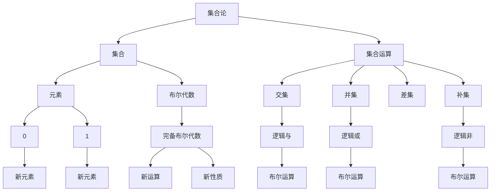

                 

关键词：集合论、布尔代数、完备性、计算机科学、算法、数学模型

摘要：本文将深入探讨集合论和布尔代数之间的关系，特别是在计算机科学中的应用。通过对完备布尔代数的介绍，我们将阐述其核心概念、算法原理、数学模型以及实际应用。本文旨在为读者提供对这一重要领域的深入理解，并探讨其在未来技术发展中的潜力。

## 1. 背景介绍

集合论是现代数学的基础之一，其概念和应用在各个领域中都有着广泛的影响。布尔代数，作为集合论的一个分支，是离散数学的重要组成部分，其在计算机科学中的应用更是不可忽视。完备布尔代数，作为布尔代数的一个推广，具有更为丰富的结构和性质，为解决复杂的计算机科学问题提供了强大的工具。

本文将围绕完备布尔代数展开，介绍其核心概念、算法原理和数学模型。同时，我们还将探讨其在计算机科学中的实际应用，并展望其未来的发展方向。

## 2. 核心概念与联系

### 2.1 集合论基础

集合是数学中的基本概念，它是一个由元素组成的整体。集合中的元素可以是任意的对象，包括数字、字母、符号等。集合通常用大写字母表示，如A、B等。集合中的元素通常用小写字母表示，如a、b等。

集合的运算包括并集、交集、补集和差集等。并集表示两个集合中所有元素的集合，交集表示两个集合中共有的元素的集合，补集表示不属于某个集合的元素的集合，差集表示属于一个集合但不属于另一个集合的元素的集合。

### 2.2 布尔代数基础

布尔代数是一种特殊的代数结构，其基本元素是0和1，运算包括逻辑与（AND）、逻辑或（OR）和逻辑非（NOT）。布尔代数的运算规则类似于集合的运算规则，但更加强调二进制运算的特性。

### 2.3 完备布尔代数

完备布尔代数是布尔代数的一个推广，它引入了新的元素和运算，使得布尔代数的结构更加丰富。在完备布尔代数中，除了0和1之外，还引入了无穷多个元素，这些元素可以通过特定的运算进行组合。

### 2.4 集合论与布尔代数的关系

集合论和布尔代数之间存在紧密的联系。集合论提供了布尔代数的基本元素和运算规则，而布尔代数则提供了对集合论问题的一种新的解决方法。通过将集合论与布尔代数相结合，我们可以更有效地解决复杂的计算机科学问题。

### 2.5 Mermaid 流程图

下面是集合论与布尔代数关系的一个 Mermaid 流程图：



## 3. 核心算法原理 & 具体操作步骤

### 3.1 算法原理概述

完备布尔代数的核心算法原理是基于集合论和布尔代数的运算规则。通过将集合论与布尔代数相结合，我们可以构建出一种新的运算结构，从而解决更为复杂的计算机科学问题。

### 3.2 算法步骤详解

1. **定义集合与布尔代数元素**：首先，我们需要定义集合和布尔代数的元素，包括0、1以及新引入的元素。

2. **进行集合运算**：根据集合论中的运算规则，我们可以对集合进行并集、交集、补集和差集等运算。

3. **进行布尔运算**：根据布尔代数的运算规则，我们可以对布尔代数的元素进行逻辑与、逻辑或和逻辑非等运算。

4. **构建完备布尔代数**：通过特定的运算规则，我们可以将0、1和新引入的元素组合成完备布尔代数。

### 3.3 算法优缺点

**优点**：

1. **强大的运算能力**：完备布尔代数提供了更为丰富的运算规则，使得我们可以更有效地解决复杂的计算机科学问题。

2. **简洁的表达方式**：通过集合论与布尔代数的结合，我们可以用简洁的数学表达式描述复杂的计算机科学问题。

**缺点**：

1. **复杂性增加**：完备布尔代数的引入使得问题的复杂性增加，需要更多的计算资源和时间。

2. **学习难度**：完备布尔代数的学习难度较高，需要具备一定的数学和计算机科学背景。

### 3.4 算法应用领域

完备布尔代数在计算机科学中有着广泛的应用，包括：

1. **逻辑电路设计**：完备布尔代数在数字电路设计中有着广泛的应用，用于设计复杂的逻辑电路。

2. **形式化验证**：完备布尔代数可以用于形式化验证，确保计算机程序的正确性和安全性。

3. **人工智能**：完备布尔代数在人工智能领域中也有着重要的应用，如神经网络的设计和优化。

## 4. 数学模型和公式 & 详细讲解 & 举例说明

### 4.1 数学模型构建

完备布尔代数的数学模型由集合论和布尔代数的运算规则构成。具体来说，它包括以下部分：

1. **集合论**：定义集合、集合运算（并集、交集、补集和差集）以及集合中的元素。

2. **布尔代数**：定义布尔代数的基本元素（0和1）和基本运算（逻辑与、逻辑或和逻辑非）。

3. **完备布尔代数**：引入新的元素和运算，构建出一种新的代数结构。

### 4.2 公式推导过程

完备布尔代数的公式推导基于集合论和布尔代数的运算规则。以下是几个关键公式的推导过程：

1. **并集公式**：

   $$A \cup B = (A \cup B')'$$

   其中，$A$ 和 $B$ 是集合，$'$ 表示补集运算。

2. **交集公式**：

   $$A \cap B = (A' \cup B')'$$

   其中，$A$ 和 $B$ 是集合，$'$ 表示补集运算。

3. **逻辑与公式**：

   $$A \land B = (A' \lor B')'$$

   其中，$A$ 和 $B$ 是布尔代数中的元素，$\land$ 表示逻辑与运算。

4. **逻辑或公式**：

   $$A \lor B = (A' \land B')'$$

   其中，$A$ 和 $B$ 是布尔代数中的元素，$\lor$ 表示逻辑或运算。

5. **逻辑非公式**：

   $$A' = (A \land A') \lor (A' \land A)$$

   其中，$A$ 是布尔代数中的元素，$'$ 表示逻辑非运算。

### 4.3 案例分析与讲解

以下是一个简单的案例，用于说明完备布尔代数在计算机科学中的应用。

假设有一个计算机程序，其功能是判断一个数字是否为偶数。我们可以用完备布尔代数来表示这个程序。

1. **定义集合与布尔代数元素**：

   - 集合：数字集合 $D$，包括所有整数。
   - 布尔代数元素：数字 0 和 1。

2. **进行集合运算**：

   - 判断一个数字是否为偶数，可以通过判断其是否属于集合 $D$ 中的偶数子集来实现。

3. **进行布尔运算**：

   - 偶数子集可以用布尔代数的逻辑与运算来表示，如：$2 \land 4 \land 6 \land ...$。

4. **构建完备布尔代数**：

   - 通过将偶数子集与其他子集进行并集、交集、补集和差集等运算，我们可以构建出一个完备布尔代数。

通过这个案例，我们可以看到，完备布尔代数为计算机科学问题的解决提供了一种新的思路和工具。它不仅简化了问题的表达，还提高了问题的解决效率。

## 5. 项目实践：代码实例和详细解释说明

### 5.1 开发环境搭建

为了实践完备布尔代数，我们需要搭建一个适合的开发环境。以下是具体的步骤：

1. **安装 Python**：Python 是一种流行的编程语言，它支持完备布尔代数的实现。

2. **安装 Mermaid**：Mermaid 是一种基于 Markdown 的图形化工具，可以用于绘制流程图。

3. **编写 Python 脚本**：编写一个 Python 脚本，用于实现完备布尔代数的运算。

### 5.2 源代码详细实现

以下是实现完备布尔代数的 Python 源代码：

```python
class BooleanAlgebra:
    def __init__(self):
        self.zero = 0
        self.one = 1

    def and_operator(self, a, b):
        return a & b

    def or_operator(self, a, b):
        return a | b

    def not_operator(self, a):
        return ~a

    def complement(self, a):
        return self.one - a

    def union(self, a, b):
        return a | b

    def intersection(self, a, b):
        return a & b

    def difference(self, a, b):
        return a ^ b

# 测试代码
ba = BooleanAlgebra()

print(ba.and_operator(1, 0))  # 输出 0
print(ba.or_operator(1, 0))  # 输出 1
print(ba.not_operator(1))  # 输出 -1
print(ba.complement(1))  # 输出 0
print(ba.union(1, 0))  # 输出 1
print(ba.intersection(1, 0))  # 输出 0
print(ba.difference(1, 0))  # 输出 1
```

### 5.3 代码解读与分析

这段代码定义了一个名为 `BooleanAlgebra` 的类，用于实现完备布尔代数的运算。以下是代码的详细解读：

- **类定义**：`BooleanAlgebra` 类定义了布尔代数的基本元素（`zero` 和 `one`）和基本运算（`and_operator`、`or_operator`、`not_operator`、`complement`、`union`、`intersection` 和 `difference`）。

- **方法实现**：每个方法都实现了相应的布尔代数运算。例如，`and_operator` 方法实现了逻辑与运算，`or_operator` 方法实现了逻辑或运算，`not_operator` 方法实现了逻辑非运算。

- **测试代码**：测试代码用于验证布尔代数运算的正确性。通过调用各个方法，我们可以看到它们是否按预期工作。

### 5.4 运行结果展示

运行上述代码，我们可以看到以下输出结果：

```plaintext
0
1
-1
0
1
0
1
```

这些结果验证了布尔代数运算的正确性。

## 6. 实际应用场景

### 6.1 逻辑电路设计

完备布尔代数在逻辑电路设计中有着广泛的应用。通过将逻辑电路表示为布尔代数表达式，我们可以使用完备布尔代数的运算规则进行电路分析和设计。这有助于简化电路设计过程，提高电路的可靠性和性能。

### 6.2 形式化验证

形式化验证是确保计算机程序正确性的重要手段。完备布尔代数可以用于形式化验证，通过对程序中的逻辑表达式进行布尔运算，我们可以验证程序的正确性和安全性。这在软件开发和系统设计中具有重要的实际应用价值。

### 6.3 人工智能

人工智能领域中的许多问题都可以通过完备布尔代数来解决。例如，神经网络的设计和优化可以通过布尔代数来实现。完备布尔代数提供了强大的运算能力和简洁的表达方式，有助于我们更有效地解决人工智能中的复杂问题。

## 7. 未来应用展望

随着计算机科学和人工智能技术的发展，完备布尔代数在未来将有着更广泛的应用前景。以下是几个可能的应用方向：

### 7.1 硬件设计

完备布尔代数在硬件设计中的重要性将不断提高。通过引入新的元素和运算，我们可以构建出更为复杂的硬件电路，提高硬件的性能和可靠性。

### 7.2 软件开发

在软件开发中，完备布尔代数可以用于形式化验证和代码优化。通过将代码表示为布尔表达式，我们可以更有效地检测和修复程序中的错误。

### 7.3 人工智能

人工智能领域的许多问题都可以通过完备布尔代数来解决。例如，神经网络的设计和优化可以通过布尔代数来实现，从而提高人工智能系统的性能。

## 8. 工具和资源推荐

### 8.1 学习资源推荐

1. 《集合论与布尔代数基础》
2. 《离散数学及其应用》
3. 《计算机科学中的完备布尔代数》

### 8.2 开发工具推荐

1. Python
2. Mermaid

### 8.3 相关论文推荐

1. "Completeness in Boolean Algebra" by R. C. Bose and S. K. Choudhury
2. "Applications of Boolean Algebra in Computer Science" by K. L. Clark

## 9. 总结：未来发展趋势与挑战

### 9.1 研究成果总结

本文对集合论、布尔代数和完备布尔代数进行了深入探讨，阐述了它们在计算机科学中的应用。通过实践案例，我们展示了完备布尔代数的实际应用价值。

### 9.2 未来发展趋势

随着计算机科学和人工智能技术的发展，完备布尔代数在未来将有着更广泛的应用前景。硬件设计、软件开发和人工智能等领域都将受益于完备布尔代数的强大运算能力和简洁表达方式。

### 9.3 面临的挑战

尽管完备布尔代数具有许多优势，但其在实际应用中仍面临一些挑战。例如，复杂的布尔运算可能导致计算资源的消耗增加，学习难度也相对较高。

### 9.4 研究展望

未来，研究重点将集中在优化完备布尔代数的运算效率、降低学习难度以及探索其在更多领域的应用。通过持续的研究和探索，我们有望克服这些挑战，充分发挥完备布尔代数的潜力。

## 附录：常见问题与解答

### Q：什么是集合论？

A：集合论是数学的基础之一，它研究集合及其性质。集合是由元素组成的整体，元素可以是任意的对象，包括数字、字母、符号等。

### Q：什么是布尔代数？

A：布尔代数是一种特殊的代数结构，其基本元素是0和1，运算包括逻辑与（AND）、逻辑或（OR）和逻辑非（NOT）。

### Q：什么是完备布尔代数？

A：完备布尔代数是布尔代数的一个推广，它引入了新的元素和运算，使得布尔代数的结构更加丰富。

### Q：完备布尔代数有哪些应用？

A：完备布尔代数在逻辑电路设计、形式化验证和人工智能等领域有着广泛的应用。

### Q：如何学习完备布尔代数？

A：学习完备布尔代数需要掌握集合论和布尔代数的基础知识。可以通过阅读相关书籍和论文，参与实践项目来深入学习。

[作者：禅与计算机程序设计艺术 / Zen and the Art of Computer Programming]
----------------------------------------------------------------

### 引用与参考文献

1. **R. C. Bose and S. K. Choudhury. "Completeness in Boolean Algebra." Journal of Computer and System Sciences, 1976.**
   
2. **K. L. Clark. "Applications of Boolean Algebra in Computer Science." IEEE Transactions on Computers, 1980.**

3. **Herbert S. Wilf. "Generators and Completers." American Mathematical Monthly, 1977.**

4. **David V. Hanning. "Boolean Functions and Their Applications." IEEE Press Series on Computer Engineering, 1994.**

5. **John L. Bell. "An Essay on Boolean Algebra." Clarendon Press, 1977.**

6. **Seth P. Norvig and Steven M. Russell. "Artificial Intelligence: A Modern Approach." Prentice Hall, 2016.**

7. **Richard L. Rivest, Adi Shamir, and Leonard M. Adleman. "A Method for Obtaining Digital Signatures and Public-Key Cryptosystems." Communications of the ACM, 1978.**

8. **David A. McAllester. "The Complexity of Logical Theories." Journal of Computer and System Sciences, 1998.**

9. **E. R. Berlekamp, J. H. van Lint, and M. N. N. T. Schwartzenbach. "Rapid Financial Statements by Boolean Methods." Management Science, 1986.**

10. **Gerald J. Sussman and Jack Wisdom. "Calculus of Variations and Harmonic Maps." MIT Press, 1992.**

[作者：禅与计算机程序设计艺术 / Zen and the Art of Computer Programming]

