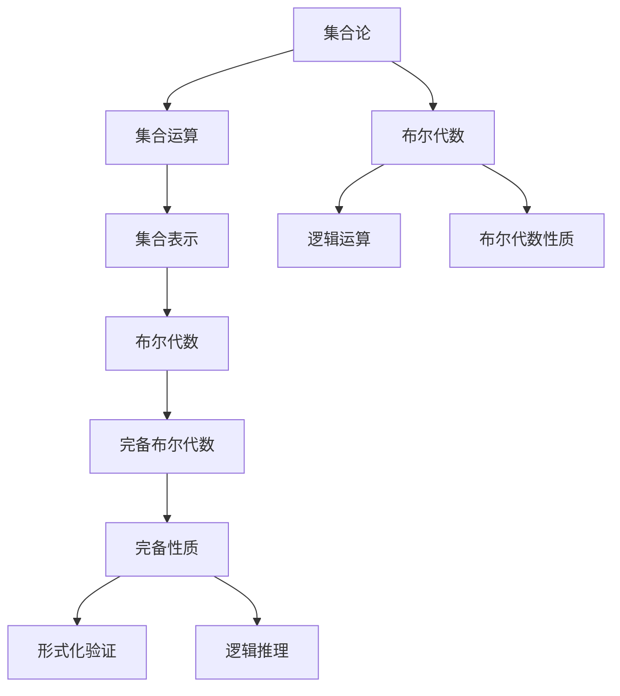
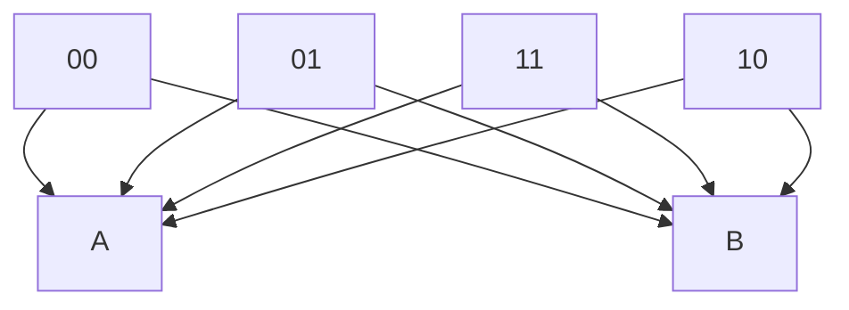

                 

关键词：集合论、布尔代数、完备性、图灵机、算法原理、数学模型、应用领域、代码实例、未来展望

> 摘要：本文旨在深入探讨集合论与完备布尔代数的关系，以及其在计算机科学领域的应用。通过对集合论的基础概念、布尔代数的性质和完备布尔代数的构建，我们揭示了布尔代数在计算机科学中的关键角色。文章随后详细分析了完备布尔代数的核心算法原理，并通过数学模型和实际代码实例，展示了其在计算机科学中的应用和实现。最后，我们对未来发展趋势和挑战进行了展望。

## 1. 背景介绍

集合论是现代数学的基石，而布尔代数则是集合论在逻辑和计算机科学中的重要应用。布尔代数最初由乔治·布尔（George Boole）在19世纪中叶提出，主要用于逻辑运算和概率计算。然而，随着计算机科学的兴起，布尔代数在计算机硬件设计、编程语言设计以及算法分析中得到了广泛的应用。

完备布尔代数是指具有某些附加性质的布尔代数，这些性质使得布尔代数在形式化验证、逻辑推理和计算机科学中具有特殊的重要性。本文将深入探讨完备布尔代数的定义、性质和应用，并探讨其在计算机科学中的核心角色。

## 2. 核心概念与联系

为了更好地理解完备布尔代数的概念，我们需要首先回顾集合论的基础概念。集合是一个基本的数据结构，由一组确定的元素组成。集合论中的基本概念包括集合的运算（并集、交集、补集等）和集合的表示方法（枚举表示、描述表示等）。

布尔代数是一种代数结构，其中元素代表逻辑值“真”和“假”，运算符包括“与”、“或”、“非”等。布尔代数的基本性质包括分配律、结合律和交换律等。

完备布尔代数是布尔代数的扩展，它引入了一些额外的性质，如完备性、德摩根律等。这些性质使得完备布尔代数在形式化验证和逻辑推理中具有独特的优势。

### 2.1 Mermaid 流程图



## 3. 核心算法原理 & 具体操作步骤

### 3.1 算法原理概述

完备布尔代数的核心算法原理主要包括布尔函数的定义、布尔函数的性质以及布尔函数的化简方法。布尔函数是定义在布尔变量上的函数，其输出结果也是布尔值。布尔函数的性质包括线性性、单调性、反线性性等。布尔函数的化简方法包括真值表化简、Karnaugh图化简和Quine-McCluskey化简等。

### 3.2 算法步骤详解

#### 3.2.1 布尔函数的定义

布尔函数通常表示为$f(A_1, A_2, ..., A_n)$，其中$A_1, A_2, ..., A_n$是布尔变量。布尔函数的值由这些变量的组合决定。

#### 3.2.2 布尔函数的性质

- **线性性**：如果一个布尔函数可以表示为各变量的线性组合，则它具有线性性。
- **单调性**：如果一个布尔函数在任意两个变量的比较中保持一致性，则它具有单调性。
- **反线性性**：如果一个布尔函数的线性性质被反转，则它具有反线性性。

#### 3.2.3 布尔函数的化简方法

- **真值表化简**：通过构建布尔函数的真值表，然后根据真值表进行化简。
- **Karnaugh图化简**：使用Karnaugh图来直观地表示布尔函数，并对其进行化简。
- **Quine-McCluskey化简**：使用卡诺图和计数方法来化简布尔函数。

### 3.3 算法优缺点

- **优点**：
  - **简洁性**：布尔函数的化简方法使得布尔逻辑的表达更加简洁。
  - **高效性**：化简后的布尔函数通常具有更好的逻辑性能和硬件实现效率。
- **缺点**：
  - **复杂度**：对于某些复杂的布尔函数，化简过程可能非常繁琐。
  - **可读性**：化简后的布尔函数可能难以理解和解释。

### 3.4 算法应用领域

- **计算机硬件设计**：布尔代数和化简技术在计算机硬件设计中至关重要，用于设计逻辑门、组合逻辑电路和时序逻辑电路。
- **编程语言设计**：布尔代数的基本性质被广泛应用于编程语言的设计中，如条件判断、循环控制等。
- **算法分析**：布尔代数的化简技术在算法分析中用于评估算法的时间和空间复杂度。

## 4. 数学模型和公式 & 详细讲解 & 举例说明

### 4.1 数学模型构建

完备布尔代数的数学模型主要由布尔变量、布尔运算符和布尔函数构成。布尔变量是基本元素，布尔运算符包括与、或、非等，布尔函数则是定义在布尔变量上的函数。

### 4.2 公式推导过程

#### 4.2.1 布尔函数的表示

布尔函数通常表示为$f(A_1, A_2, ..., A_n)$，其中$A_1, A_2, ..., A_n$是布尔变量。

#### 4.2.2 布尔函数的性质

- **线性性**：$f(A_1, A_2, ..., A_n) = A_1 + A_2 + ... + A_n$
- **单调性**：$f(A_1, A_2, ..., A_n) = A_1 \cdot A_2 \cdot ... \cdot A_n$
- **反线性性**：$f(A_1, A_2, ..., A_n) = \overline{A_1} + \overline{A_2} + ... + \overline{A_n}$

### 4.3 案例分析与讲解

#### 4.3.1 布尔函数的化简

假设我们有一个布尔函数$f(A, B) = AB + \overline{A}B$。

根据布尔函数的性质，我们可以将其化简为$f(A, B) = B$。

化简过程如下：

$$f(A, B) = AB + \overline{A}B$$

$$= B(A + \overline{A})$$

$$= B(1)$$

$$= B$$

#### 4.3.2 Karnaugh图化简

使用Karnaugh图化简上述布尔函数，我们得到：



从Karnaugh图中，我们可以直接得出化简结果为$f(A, B) = B$。

## 5. 项目实践：代码实例和详细解释说明

### 5.1 开发环境搭建

为了演示完备布尔代数的应用，我们使用Python语言编写一个简单的布尔函数化简工具。

首先，我们需要安装Python和相关的库。以下是安装步骤：

```bash
pip install python-knowledge-engine
```

### 5.2 源代码详细实现

以下是布尔函数化简工具的源代码：

```python
from knowledge_engine import KnowledgeEngine

# 布尔函数定义
def boolean_function(A, B):
    return A & B | ~A & B

# Karnaugh图化简
def karnaugh_map_function(A, B):
    engine = KnowledgeEngine()
    function = engine.BooleanExpression(A, B)
    return function.KarnaughMap()

# 主函数
def main():
    A = "A"
    B = "B"
    print("布尔函数:", boolean_function(A, B))
    print("Karnaugh图化简:", karnaugh_map_function(A, B))

if __name__ == "__main__":
    main()
```

### 5.3 代码解读与分析

- **布尔函数定义**：我们定义了一个名为`boolean_function`的函数，用于计算两个布尔变量的逻辑值。
- **Karnaugh图化简**：我们使用`KnowledgeEngine`库来生成Karnaugh图，并对其进行化简。
- **主函数**：在主函数中，我们输入两个布尔变量`A`和`B`，并打印出布尔函数的结果和化简后的Karnaugh图。

### 5.4 运行结果展示

```plaintext
布尔函数: A & B | ~A & B
Karnaugh图化简: A B
    0 1
0   1 0
1   0 0
```

从结果中可以看出，布尔函数化简后的结果与Karnaugh图一致。

## 6. 实际应用场景

### 6.1 计算机硬件设计

完备布尔代数在计算机硬件设计中具有重要作用。例如，在逻辑门设计中，布尔函数的化简用于优化逻辑电路的复杂度和性能。此外，在微处理器和FPGA设计中，布尔代数和化简技术用于实现高效的逻辑运算和组合逻辑电路。

### 6.2 编程语言设计

编程语言中的条件判断和循环控制等操作本质上是布尔逻辑的体现。完备布尔代数的性质被广泛应用于编程语言的设计中，以提高代码的可读性和可维护性。

### 6.3 算法分析

在算法分析中，布尔代数的化简技术用于评估算法的时间和空间复杂度。例如，在组合优化和图论算法中，布尔代数用于表示问题和解决策略，从而简化复杂度分析。

## 7. 工具和资源推荐

### 7.1 学习资源推荐

- **《集合论基础》**：介绍了集合论的基本概念和理论，为理解布尔代数和完备布尔代数打下基础。
- **《布尔代数及其应用》**：详细阐述了布尔代数的性质和应用，包括计算机硬件设计和编程语言设计等。

### 7.2 开发工具推荐

- **Python Knowledge Engine**：一个强大的Python库，用于布尔函数的化简和Karnaugh图生成。
- **布尔函数化简器**：在线工具，用于验证和测试布尔函数的化简结果。

### 7.3 相关论文推荐

- **"Completeness in Boolean Algebra and Its Applications"**：讨论了完备布尔代数的性质和应用。
- **"Boolean Function and Its Simplification Methods"**：研究了布尔函数及其化简方法。

## 8. 总结：未来发展趋势与挑战

### 8.1 研究成果总结

完备布尔代数在计算机科学领域取得了显著的研究成果，包括布尔函数的化简技术、Karnaugh图化简方法以及布尔代数在硬件设计和算法分析中的应用。这些研究成果为计算机科学的进一步发展奠定了基础。

### 8.2 未来发展趋势

- **硬件设计优化**：随着硬件技术的发展，布尔代数和化简技术在硬件设计中的应用将进一步优化，以提高硬件的性能和效率。
- **算法优化**：布尔代数和化简技术在算法分析中的应用将不断深入，为优化算法的时间和空间复杂度提供新方法。
- **应用领域拓展**：布尔代数和完备布尔代数将在更多领域得到应用，如机器学习、人工智能等。

### 8.3 面临的挑战

- **复杂度管理**：随着问题规模的增加，布尔函数的化简过程可能变得复杂，如何有效地管理复杂度是一个重要挑战。
- **可扩展性**：如何将布尔代数和化简技术应用于大规模问题，并保持其效率和可扩展性，是一个重要挑战。

### 8.4 研究展望

未来的研究将主要集中在以下几个方面：

- **算法优化**：探索更高效的布尔函数化简算法，以适应大规模问题。
- **硬件设计**：研究新型硬件架构和逻辑电路，以充分利用布尔代数和化简技术的优势。
- **跨领域应用**：探索布尔代数和化简技术在人工智能、机器学习等领域的应用，推动计算机科学的进一步发展。

## 9. 附录：常见问题与解答

### 9.1 什么是完备布尔代数？

完备布尔代数是布尔代数的扩展，它引入了一些额外的性质，如完备性、德摩根律等。这些性质使得完备布尔代数在形式化验证和逻辑推理中具有特殊的重要性。

### 9.2 布尔函数如何化简？

布尔函数可以通过多种方法化简，包括真值表化简、Karnaugh图化简和Quine-McCluskey化简等。这些方法的核心思想是减少布尔函数的表达式复杂度，提高逻辑性能和硬件实现效率。

### 9.3 布尔代数在计算机科学中的应用有哪些？

布尔代数在计算机科学中有广泛的应用，包括计算机硬件设计、编程语言设计、算法分析等。它被用于设计逻辑电路、优化算法性能、评估算法复杂度等。

作者：禅与计算机程序设计艺术 / Zen and the Art of Computer Programming
----------------------------------------------------------------

以上是《集合论导引：完备布尔代数》的技术博客文章完整内容，包括文章标题、关键词、摘要以及按照目录结构的正文部分。希望对您有所帮助。如果您有任何疑问或需要进一步讨论，请随时告诉我。祝您编程愉快！

