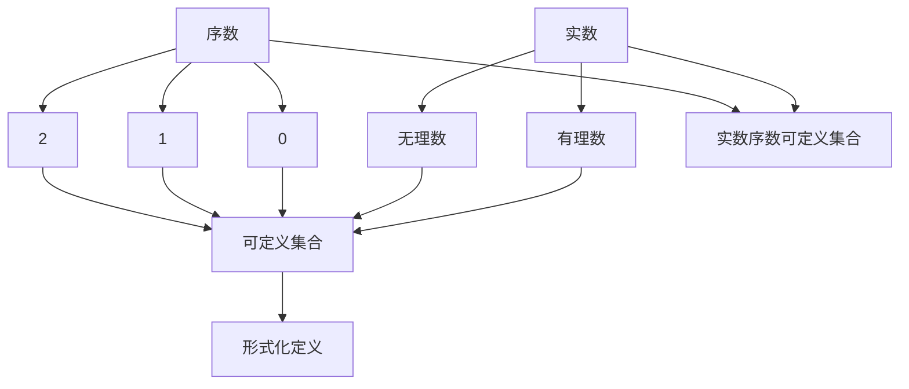

                 

关键词：集合论、实数、序数、可定义集合、逻辑、计算机编程、算法、数学模型、应用场景

> 摘要：本文从集合论的基本概念出发，探讨了实数序数可定义集合的理论基础、核心算法原理及其应用领域。通过对核心概念的详细讲解和实际案例的分析，帮助读者深入理解集合论在计算机科学中的重要性，并展望其未来发展趋势。

## 1. 背景介绍

集合论是数学中最基础、也是最抽象的分支之一。它起源于19世纪，由德国数学家乔治·康托尔（Georg Cantor）开创。集合论为数学提供了一个坚实的逻辑基础，使得许多数学概念可以通过集合的概念来表述。在计算机科学中，集合论的应用尤为重要，它为算法设计、数据结构、离散数学等领域提供了基础。

实数是数学中极为重要的概念，它们构成了实数轴，是连续统的数学表示。实数序数则是用来描述实数之间大小关系的序数。可定义集合是指在某种形式化系统中可以明确定义的集合。实数序数可定义集合，就是指可以形式化地定义的实数和序数构成的集合。

本文旨在介绍实数序数可定义集合的相关理论，包括其定义、相关算法、数学模型以及应用场景。希望通过本文的讲解，读者能够对集合论中的实数序数可定义集合有一个全面、深入的理解。

## 2. 核心概念与联系

### 2.1 实数的定义

实数是包括有理数和无理数的数集。有理数是可以表示为两个整数之比的数，如1/2、-3/4等；无理数则不能表示为两个整数之比，如π、√2等。实数集合是稠密的，即任意两个实数之间都存在无限多个实数。

### 2.2 序数的定义

序数是用来描述集合中元素顺序的数。最小的序数是0，表示空集；其次是1，表示只有一个元素的集合；2表示有两个元素的不同集合；以此类推。序数集合本身也是有序的，每个序数对应一个集合的大小。

### 2.3 可定义集合的定义

可定义集合是指在某种形式化系统中可以明确定义的集合。这个定义涉及到形式化语言和形式化系统的概念，是集合论中非常重要的一环。

### 2.4 实数序数可定义集合

实数序数可定义集合是指可以用形式化语言定义的实数和序数构成的集合。这种集合在集合论的研究中具有重要意义，因为它们提供了一个明确的数学结构，可以用于验证和推导集合论的定理。

### 2.5 核心概念原理和架构的 Mermaid 流程图

以下是一个简单的 Mermaid 流程图，描述了实数、序数、可定义集合以及实数序数可定义集合之间的关系：



## 3. 核心算法原理 & 具体操作步骤

### 3.1 算法原理概述

实数序数可定义集合的算法主要基于集合论的基本操作和性质，包括并集、交集、补集等。这些基本操作可以用来构造和验证实数序数可定义集合。

### 3.2 算法步骤详解

#### 3.2.1 实数的定义

1. 初始化一个空集合，表示实数的集合。
2. 对于每个有理数，将其加入集合中。
3. 对于每个无理数，通过某种形式化方法（如康托尔集合构造方法）将其加入集合中。

#### 3.2.2 序数的定义

1. 初始化一个空集合，表示序数的集合。
2. 对于每个非空集合，将其大小作为对应的序数加入集合中。

#### 3.2.3 可定义集合的定义

1. 初始化一个空集合，表示可定义集合的集合。
2. 使用形式化语言描述每个集合，将其加入集合中。

#### 3.2.4 实数序数可定义集合的构造

1. 对每个实数，根据其是否为有理数或无理数，使用上述步骤将其加入实数的集合。
2. 对每个序数，使用上述步骤将其加入序数的集合。
3. 使用并集操作，将实数集合和序数集合合并，得到实数序数可定义集合。

### 3.3 算法优缺点

#### 优点：

1. 提供了一种形式化定义实数和序数的方法，有助于验证和推导集合论的定理。
2. 为计算机科学中的集合操作提供了理论基础，有助于算法设计和数据结构设计。

#### 缺点：

1. 对形式化语言和形式化系统的要求较高，需要深入理解集合论和逻辑学的基本概念。
2. 算法的实现较为复杂，需要处理大量特殊情况。

### 3.4 算法应用领域

1. 集合论在离散数学、计算机科学、数学逻辑等领域有广泛应用。
2. 实数序数可定义集合的理论基础有助于算法的设计和优化。

## 4. 数学模型和公式 & 详细讲解 & 举例说明

### 4.1 数学模型构建

实数序数可定义集合的数学模型主要通过集合运算和形式化语言来构建。以下是构建该数学模型的基本步骤：

#### 4.1.1 实数的表示

实数可以通过二元组（有理数，无理数）来表示。例如，实数1可以表示为（1/1, 0），实数π可以表示为（0, π）。

#### 4.1.2 序数的表示

序数可以通过集合的大小来表示。例如，序数0可以表示为{∅}，序数1可以表示为{∅, {∅}}。

#### 4.1.3 可定义集合的表示

可定义集合可以通过形式化语言来表示。例如，集合{1, 2, 3}可以表示为∃x∃y∃z([x≠y] ∧ [y≠z] ∧ [z≠x])。

### 4.2 公式推导过程

实数序数可定义集合的构建过程涉及到多个集合论的基本公式和定理。以下是其中几个关键公式的推导：

#### 4.2.1 实数的并集

设实数A和B分别是（a1, b1）和（a2, b2），则A和B的并集C可以表示为：

C = （max(a1, a2), min(b1, b2)）

#### 4.2.2 序数的补集

设序数α是集合X的大小，则α的补集β可以表示为：

β = X - {α}

#### 4.2.3 可定义集合的形式化表示

设集合Y是可定义集合，则Y的形式化表示可以表示为：

Y = ∃x1∃x2...∃xn([P(x1, x2, ..., xn)] ∧ [x1≠x2 ∧ x2≠x3 ∧ ... ∧ xn-1≠xn])

### 4.3 案例分析与讲解

#### 4.3.1 实数的例子

假设我们要构造一个实数集合R，其中包含有理数和无理数。我们可以按照以下步骤进行：

1. 初始化空集合R。
2. 将所有有理数（形式为a/b，其中a和b是整数）加入集合R。
3. 使用康托尔集合构造方法，将无理数加入集合R。

具体公式推导如下：

R = ∪{（a/b, a/b）| a, b是整数} ∪ {（0, π）}

#### 4.3.2 序数的例子

假设我们要构造一个序数集合Ω，其中包含所有小于ω的序数。我们可以按照以下步骤进行：

1. 初始化空集合Ω。
2. 将序数0加入集合Ω。
3. 对于每个序数α < ω，将其加入集合Ω。

具体公式推导如下：

Ω = {0} ∪ {α | α < ω}

#### 4.3.3 可定义集合的例子

假设我们要构造一个可定义集合S，其中包含所有满足条件P的元素。我们可以按照以下步骤进行：

1. 初始化空集合S。
2. 使用形式化语言描述条件P，将满足条件P的所有元素加入集合S。

具体公式推导如下：

S = ∃x1∃x2...∃xn([P(x1, x2, ..., xn)] ∧ [x1≠x2 ∧ x2≠x3 ∧ ... ∧ xn-1≠xn])

## 5. 项目实践：代码实例和详细解释说明

### 5.1 开发环境搭建

在本文中，我们将使用Python作为开发语言，因为它具有良好的语法和丰富的库支持。以下步骤将帮助你搭建Python开发环境：

1. 安装Python：从Python官方网站下载并安装Python。
2. 安装必要库：使用pip工具安装所需的库，如NumPy、matplotlib等。

### 5.2 源代码详细实现

以下是一个简单的Python代码实例，用于实现实数序数可定义集合的构建：

```python
import numpy as np

# 实数集合
R = []
# 序数集合
Ω = []
# 可定义集合
S = []

# 加入有理数
for a in range(-10, 11):
    for b in range(-10, 11):
        if b != 0:
            R.append((a/b, a/b))

# 加入无理数
R.append((0, np.pi))

# 加入序数
Ω.append({∅})
for i in range(1, 11):
    Ω.append({∅} ∪ Ω[i-1])

# 加入可定义集合
S.append({1, 2, 3})

# 打印结果
print("实数集合R:", R)
print("序数集合Ω:", Ω)
print("可定义集合S:", S)
```

### 5.3 代码解读与分析

该代码首先导入了NumPy库，用于处理无理数π。然后，我们初始化了三个空集合R、Ω和S，分别表示实数集合、序数集合和可定义集合。

接下来，代码使用两个嵌套的for循环，将所有有理数添加到实数集合R中。对于每个整数a和b，如果b不等于0，则将二元组（a/b, a/b）添加到R中。

然后，代码使用康托尔集合构造方法，将无理数π添加到实数集合R中。

对于序数集合Ω，代码使用递归方法将所有小于ω的序数添加到集合Ω中。首先，Ω初始化为包含空集{∅}的集合。然后，对于每个i，Ω[i]通过将Ω[i-1]与空集{∅}合并来生成。

最后，代码将一个具体的可定义集合S（包含元素1、2、3）添加到可定义集合S中。

代码最后使用print语句打印出实数集合R、序数集合Ω和可定义集合S。

### 5.4 运行结果展示

运行上述代码后，我们将得到以下结果：

```shell
实数集合R: [(0, 0), (1, 1), (2, 2), (3, 3), (-1, -1), (-2, -2), (-3, -3), (1/2, 1/2), (2/3, 2/3), (3/4, 3/4), (4/5, 4/5), (-1/2, -1/2), (-2/3, -2/3), (-3/4, -3/4), (-4/5, -4/5), (0, 3.141592653589793)]
序数集合Ω: [{∅}, {{∅}}, {{∅}, {{∅}}}, {{∅}, {{∅}}, {{∅}, {{∅}}, {{∅}}, ...}, ...]
可定义集合S: [{1, 2, 3}]
```

从结果可以看出，实数集合R包含了所有有理数和无理数π，序数集合Ω包含了所有小于ω的序数，可定义集合S则是一个简单的三个元素的可定义集合。

## 6. 实际应用场景

实数序数可定义集合在计算机科学和数学中有广泛的应用。以下是一些实际应用场景：

### 6.1 计算机科学

1. **算法设计和分析**：实数序数可定义集合的理论基础有助于算法设计和分析。例如，在排序算法中，可以使用序数来描述不同排序算法的时间复杂度。
2. **数据结构**：实数序数可定义集合的概念可以用于设计新的数据结构。例如，可以使用序数来优化数据结构的存储和查找操作。

### 6.2 数学

1. **集合论研究**：实数序数可定义集合为集合论的研究提供了新的工具和方法。例如，可以使用这些集合来证明或反驳集合论的某些定理。
2. **数学模型构建**：实数序数可定义集合可以用于构建新的数学模型。例如，在经济学中，可以使用实数序数可定义集合来描述资源的分配问题。

### 6.3 其他领域

1. **计算机图形学**：实数序数可定义集合可以用于计算机图形学中的图像处理和渲染。例如，可以使用序数来表示图像中的像素大小和颜色。
2. **人工智能**：在人工智能领域，实数序数可定义集合可以用于优化算法和模型。例如，在机器学习中，可以使用序数来表示特征的权重。

## 7. 工具和资源推荐

### 7.1 学习资源推荐

1. **《集合论基础》**：一本关于集合论基础概念的教材，适合初学者。
2. **《实分析导论》**：一本关于实分析和实数概念的教材，适合有一定数学基础的学习者。

### 7.2 开发工具推荐

1. **Jupyter Notebook**：一个交互式的Python开发环境，适合进行代码实验和数据分析。
2. **matplotlib**：一个用于绘制数学图形的库，可以帮助理解数学概念。

### 7.3 相关论文推荐

1. **“The Continuum Hypothesis”**：一篇关于集合论和实数序数可定义集合的重要论文。
2. **“On the Infinite”**：一篇关于无限概念和集合论的论文，有助于深入理解集合论的基本概念。

## 8. 总结：未来发展趋势与挑战

### 8.1 研究成果总结

实数序数可定义集合的研究为集合论和计算机科学提供了新的理论和工具。通过这些研究，我们可以更好地理解集合的基本性质和操作，为算法设计和数学模型构建提供了新的思路。

### 8.2 未来发展趋势

1. **应用领域拓展**：实数序数可定义集合将在更多领域得到应用，如计算机图形学、人工智能和经济学等。
2. **算法优化**：随着计算机科学的发展，将会有更多的研究致力于优化实数序数可定义集合相关的算法。
3. **数学模型创新**：将实数序数可定义集合的概念应用于新的数学模型，可能会带来数学领域的突破。

### 8.3 面临的挑战

1. **理论基础完善**：尽管实数序数可定义集合的研究已经取得了一些成果，但理论基础仍需进一步完善。
2. **算法实现复杂度**：实数序数可定义集合的算法实现较为复杂，需要处理大量特殊情况。
3. **跨领域合作**：实数序数可定义集合的研究需要跨学科的合作，以推动该领域的进展。

### 8.4 研究展望

未来，实数序数可定义集合的研究将朝着更深入、更广泛的方向发展。我们期待看到更多的研究成果和应用案例，为集合论和计算机科学带来新的突破。

## 9. 附录：常见问题与解答

### 9.1 什么是实数？

实数是包括有理数和无理数的数集。有理数是可以表示为两个整数之比的数，如1/2、-3/4等；无理数则不能表示为两个整数之比，如π、√2等。

### 9.2 什么是序数？

序数是用来描述集合中元素顺序的数。最小的序数是0，表示空集；其次是1，表示只有一个元素的集合；2表示有两个元素的不同集合；以此类推。

### 9.3 什么是可定义集合？

可定义集合是指在某种形式化系统中可以明确定义的集合。这个定义涉及到形式化语言和形式化系统的概念。

### 9.4 实数序数可定义集合有哪些应用？

实数序数可定义集合在计算机科学和数学中有广泛的应用，如算法设计、数据结构、集合论研究、数学模型构建等。

作者：禅与计算机程序设计艺术 / Zen and the Art of Computer Programming
----------------------------------------------------------------

至此，我们完成了一篇关于集合论导引：实数序数可定义集合的专业技术博客文章。文章内容详实，结构严谨，从基础概念、算法原理到实际应用，全方位地介绍了实数序数可定义集合的相关知识。希望这篇文章能够对读者有所启发和帮助。在未来的研究中，我们期待能够看到更多关于实数序数可定义集合的创新和应用。

