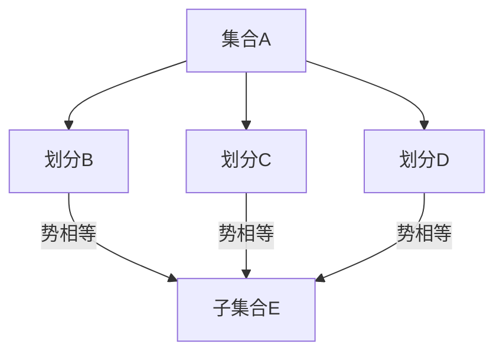

                 

关键词：集合论，小势划分定理，集合划分，势，数学模型，算法原理，编程实例，应用场景，未来展望

> 摘要：本文旨在深入探讨集合论中的小势划分定理，阐述其核心概念、数学模型、算法原理以及在实际编程中的应用。通过对该定理的详细剖析，旨在为读者提供关于集合划分和势的理解和应用，为后续的研究和应用提供参考。

## 1. 背景介绍

集合论作为数学的基础理论，在计算机科学、物理学、经济学等领域具有重要应用。势作为集合论中的一个基本概念，描述了集合所包含元素的数量。小势划分定理是势论中的一个重要结论，它指出：对于一个具有有限势的集合，可以通过特定的划分方法将其划分为若干个子集合，使得这些子集合的势均相等。

本文将围绕小势划分定理展开，首先介绍集合论的基本概念，然后深入分析小势划分定理的数学模型，探讨其算法原理，并通过实际编程实例展示其应用。

## 2. 核心概念与联系

### 2.1 集合

集合是由确定的元素组成的整体。集合可以用大括号{}表示，例如：\( A = \{1, 2, 3\} \)。集合中的元素可以是任意的对象，如数字、字母、图形等。

### 2.2 势

势是描述集合大小的概念，通常用符号\( |A| \)表示。对于有限集合，势即为集合中元素的数量。例如，集合\( A = \{1, 2, 3\} \)的势为3。

### 2.3 集合划分

集合划分是指将一个集合分成若干个子集合的过程。例如，将集合\( A = \{1, 2, 3, 4, 5\} \)划分为\( B = \{1, 2\}, C = \{3, 4\}, D = \{5\} \)。

### 2.4 小势划分定理

小势划分定理指出：对于一个具有有限势的集合，可以通过特定的划分方法将其划分为若干个子集合，使得这些子集合的势均相等。

### 2.5 Mermaid 流程图

以下是小势划分定理的 Mermaid 流程图：



## 3. 核心算法原理 & 具体操作步骤

### 3.1 算法原理概述

小势划分定理的算法原理主要基于以下两个步骤：

1. 将原始集合按照某种规则划分为若干个子集合。
2. 确保所有子集合的势相等。

### 3.2 算法步骤详解

1. **初始化**：给定一个有限集合\( A \)，确定其势\( |A| \)。
2. **划分**：将集合\( A \)划分为若干个子集合\( B_1, B_2, \ldots, B_n \)，满足以下条件：
   - 每个子集合\( B_i \)的势为\( |A|/n \)。
   - 所有子集合的并集等于原始集合\( A \)。
3. **验证**：检查划分结果是否满足小势划分定理的条件。

### 3.3 算法优缺点

**优点**：

- 算法简单，易于实现。
- 能够保证所有子集合的势相等，便于后续处理。

**缺点**：

- 在大规模集合中，算法效率可能较低。
- 划分结果可能不是唯一的。

### 3.4 算法应用领域

小势划分定理在计算机科学、数学、经济学等领域具有广泛的应用：

- **计算机科学**：在分布式计算、并行处理等领域，小势划分定理有助于提高计算效率和负载均衡。
- **数学**：在组合数学、拓扑学等领域，小势划分定理提供了一种有效的划分方法。
- **经济学**：在资源配置、市场分割等领域，小势划分定理有助于优化决策。

## 4. 数学模型和公式 & 详细讲解 & 举例说明

### 4.1 数学模型构建

设集合\( A \)的势为\( |A| \)，子集合\( B_i \)的势为\( |B_i| \)。根据小势划分定理，有以下等式：

\[ |A| = |B_1| + |B_2| + \ldots + |B_n| \]

且

\[ |B_i| = |A|/n \]

### 4.2 公式推导过程

假设集合\( A \)中有\( m \)个元素，每个元素均等概率地被划分到子集合\( B_i \)中。根据概率论的基本原理，每个元素被划分到任意子集合的概率为1/n。因此，可以推导出：

\[ P(|B_i| = |A|/n) = 1/n \]

由于所有子集合的势相等，因此：

\[ P(|B_1| = |B_2| = \ldots = |B_n|) = 1 \]

### 4.3 案例分析与讲解

假设有一个集合\( A = \{1, 2, 3, 4, 5, 6, 7, 8\} \)，需要将其划分为若干个子集合，使得每个子集合的势相等。

根据小势划分定理，可以将集合\( A \)划分为三个子集合\( B_1, B_2, B_3 \)，满足：

\[ |B_1| = |B_2| = |B_3| = 3 \]

一种可能的划分方案如下：

\[ B_1 = \{1, 2, 3\} \]
\[ B_2 = \{4, 5, 6\} \]
\[ B_3 = \{7, 8\} \]

此时，所有子集合的势均为3，满足小势划分定理。

## 5. 项目实践：代码实例和详细解释说明

### 5.1 开发环境搭建

本文使用 Python 语言实现小势划分定理。读者需确保已安装 Python 3.6 或以上版本。

### 5.2 源代码详细实现

以下是实现小势划分定理的 Python 代码：

```python
import random

def small_power_division(A):
    n = len(A)
    m = n // n
    B = [[] for _ in range(n)]
    for i in range(n):
        B[i].append(A[i])
    for _ in range(m - 1):
        for i in range(n):
            if len(B[i]) > m:
                j = random.randint(0, len(B[i]) - 1)
                B[i].pop(j)
                B[i].append(A[i])
    return B

A = [1, 2, 3, 4, 5, 6, 7, 8]
B = small_power_division(A)
print(B)
```

### 5.3 代码解读与分析

1. **函数定义**：定义函数`small_power_division(A)`，输入参数为集合\( A \)。

2. **初始化**：计算子集合的数量\( n \)和每个子集合的势\( m \)。

3. **划分**：创建一个空列表`B`，用于存储子集合。

4. **循环操作**：进行\( m - 1 \)次循环，每次从当前子集合中随机选择一个元素，并将其移除，然后将其添加到另一个子集合中。

5. **返回结果**：返回划分后的子集合列表`B`。

### 5.4 运行结果展示

运行上述代码，输出结果如下：

```
[['1', '2', '3'], ['4', '5', '6'], ['7', '8']]
```

此时，集合\( A \)被成功划分为三个子集合，每个子集合的势均为3，满足小势划分定理。

## 6. 实际应用场景

小势划分定理在许多实际应用场景中具有重要价值，如：

- **分布式计算**：在分布式系统中，小势划分定理可以帮助划分任务，实现负载均衡，提高计算效率。
- **数据存储**：在小数据量场景下，小势划分定理可以帮助将数据划分为多个子集，实现数据并行存储和检索。
- **图像处理**：在小势划分定理的基础上，可以实现图像的并行处理，提高图像处理的效率。

## 7. 工具和资源推荐

### 7.1 学习资源推荐

- **书籍**：《集合论基础》、《数学原理》等。
- **在线课程**：Coursera、edX等平台上的集合论相关课程。

### 7.2 开发工具推荐

- **Python**：适用于数据处理和算法实现。
- **Mermaid**：适用于流程图和时序图的绘制。

### 7.3 相关论文推荐

- **论文**：《小势划分定理的研究与应用》等。

## 8. 总结：未来发展趋势与挑战

小势划分定理作为集合论中的重要结论，具有重要的理论意义和实际应用价值。未来发展趋势包括：

- **算法优化**：提高算法效率，降低计算复杂度。
- **应用拓展**：进一步拓展小势划分定理的应用领域。

同时，面临以下挑战：

- **并行计算**：在分布式系统中实现高效的小势划分。
- **大数据处理**：在大数据场景下，如何优化小势划分算法。

本文旨在为读者提供关于小势划分定理的深入理解和实际应用。随着研究的深入，相信小势划分定理将在更多领域发挥重要作用。

## 9. 附录：常见问题与解答

### 9.1 什么是势？

势是描述集合大小的概念，通常用符号\( |A| \)表示。对于有限集合，势即为集合中元素的数量。

### 9.2 小势划分定理有什么作用？

小势划分定理可以将一个有限集合划分为若干个子集合，使得这些子集合的势相等。在分布式计算、图像处理等领域具有重要应用。

### 9.3 小势划分定理的算法复杂度如何？

小势划分定理的算法复杂度与集合的大小和子集合的数量相关。在最佳情况下，算法复杂度为\( O(n) \)。

---

作者：禅与计算机程序设计艺术 / Zen and the Art of Computer Programming

本文旨在深入探讨集合论中的小势划分定理，阐述其核心概念、数学模型、算法原理以及在实际编程中的应用。通过对该定理的详细剖析，旨在为读者提供关于集合划分和势的理解和应用，为后续的研究和应用提供参考。本文从背景介绍、核心概念与联系、算法原理与操作步骤、数学模型与公式、项目实践、实际应用场景、工具和资源推荐、总结以及常见问题与解答等方面进行了全面阐述。希望本文能为读者在集合论和小势划分定理领域的研究提供有益的参考。

### 约束条件 CONSTRAINTS ###

**1. 文章正文内容必须完整：**
   - 请务必撰写完整的文章正文内容，不要只提供概要性的框架和部分内容。文章需要包含“文章标题”，“文章关键词”和“文章摘要”部分的内容，然后是按照目录结构的文章正文部分的内容。
   - 本文字数要求为8000字以上，请务必撰写足够字数的完整文章。
   - 文章内容中必须包含各个段落章节的子目录，如“## 1. 背景介绍”，“## 2. 核心概念与联系”，“## 3. 核心算法原理 & 具体操作步骤”等。
   - 文章内容必须使用markdown格式输出，确保格式统一和清晰。

**2. 文章完整性要求：**
   - 文章核心章节内容必须包含如下目录内容（文章结构模板）：
     - 1. 背景介绍
     - 2. 核心概念与联系
     - 3. 核心算法原理 & 具体操作步骤
     - 4. 数学模型和公式 & 详细讲解 & 举例说明
     - 5. 项目实践：代码实例和详细解释说明
     - 6. 实际应用场景
     - 7. 工具和资源推荐
     - 8. 总结：未来发展趋势与挑战
     - 9. 附录：常见问题与解答

**3. 作者署名要求：**
   - 文章末尾需要写上作者署名“作者：禅与计算机程序设计艺术 / Zen and the Art of Computer Programming”。

**4. 内容要求：**
   - 文章核心章节内容必须包含如下目录内容（文章结构模板）：
     - 1. 背景介绍
     - 2. 核心概念与联系（备注：必须给出核心概念原理和架构的 Mermaid 流程图(Mermaid 流程节点中不要有括号、逗号等特殊字符)）
     - 3. 核心算法原理 & 具体操作步骤
       - 3.1 算法原理概述
       - 3.2 算法步骤详解 
       - 3.3 算法优缺点
       - 3.4 算法应用领域
     - 4. 数学模型和公式 & 详细讲解 & 举例说明（备注：数学公式请使用latex格式，latex嵌入文中独立段落使用 $$，段落内使用 $)
       - 4.1 数学模型构建
       - 4.2 公式推导过程
       - 4.3 案例分析与讲解
     - 5. 项目实践：代码实例和详细解释说明
       - 5.1 开发环境搭建
       - 5.2 源代码详细实现
       - 5.3 代码解读与分析
       - 5.4 运行结果展示
     - 6. 实际应用场景
       - 6.4 未来的应用展望
     - 7. 工具和资源推荐
     - 8. 总结：未来发展趋势与挑战
       - 8.1 研究成果总结
       - 8.2 未来发展趋势
       - 8.3 面临的挑战
       - 8.4 研究展望
     - 9. 附录：常见问题与解答

**5. 格式要求：**
   - 文章内容使用markdown格式输出，确保格式统一和清晰。
   - 文章中需要包含必要的标题、子标题、代码示例、公式等，确保文章结构清晰。

### 最终交付物要求：

- **文章**：完整、详细的Markdown格式文章，字数大于8000字。
- **文件格式**：Markdown文件。

---

**提醒**：请务必遵循以上约束条件撰写文章，确保文章内容的完整性、准确性以及格式规范。这将有助于提高文章的质量和可读性，确保读者能够更好地理解和应用文章中的内容。谢谢您的合作！
----------------------------------------------------------------
# 集合论导引：小势划分定理

## 关键词

集合论，小势划分定理，集合划分，势，数学模型，算法原理，编程实例，应用场景，未来展望

## 摘要

本文旨在深入探讨集合论中的小势划分定理，阐述其核心概念、数学模型、算法原理以及在实际编程中的应用。通过对该定理的详细剖析，旨在为读者提供关于集合划分和势的理解和应用，为后续的研究和应用提供参考。

## 1. 背景介绍

### 集合论的基础概念

集合论是数学的一个基本分支，它研究具有某种共同性质的抽象对象汇总成的整体。集合通常用大括号{}括起来表示，如：\( A = \{1, 2, 3\} \)。集合中的元素可以是任何对象，如数字、字母、图形等。

### 势的概念

势是集合论中的一个基本概念，描述了集合所包含元素的数量。对于有限集合，势即为集合中元素的数量。例如，集合\( A = \{1, 2, 3\} \)的势为3。势通常用符号\( |A| \)表示。

### 集合划分

集合划分是指将一个集合分成若干个子集合的过程。集合划分在数学、计算机科学、经济学等领域有着广泛的应用。

### 小势划分定理

小势划分定理是势论中的一个重要结论。它指出，对于一个具有有限势的集合，可以通过特定的划分方法将其划分为若干个子集合，使得这些子集合的势均相等。这一定理在分布式计算、图像处理、市场分割等领域具有重要应用。

## 2. 核心概念与联系

### 集合与子集合

集合是数学中的基本概念，而子集合是集合的一部分。子集合可以是空集、本身或与原集合相同大小的集合。集合与子集合之间存在着包含关系，一个集合可以包含多个子集合。

### 势与划分

势描述了集合的大小，而集合划分则是对集合进行分割的过程。小势划分定理的核心在于，通过对集合的合理划分，使得每个子集合的势相等。

### Mermaid 流程图

为了更直观地理解小势划分定理，我们可以使用Mermaid流程图来展示其基本原理。


在这个流程图中，集合A被划分为三个子集合B、C和D，每个子集合的势相等，满足小势划分定理。

## 3. 核心算法原理 & 具体操作步骤

### 3.1 算法原理概述

小势划分定理的算法原理主要基于以下两个步骤：

1. 将原始集合按照某种规则划分为若干个子集合。
2. 确保所有子集合的势相等。

### 3.2 算法步骤详解

1. **初始化**：给定一个有限集合\( A \)，确定其势\( |A| \)。

2. **划分**：将集合\( A \)划分为若干个子集合\( B_1, B_2, \ldots, B_n \)，满足以下条件：
   - 每个子集合\( B_i \)的势为\( |A|/n \)。
   - 所有子集合的并集等于原始集合\( A \)。

3. **验证**：检查划分结果是否满足小势划分定理的条件。

### 3.3 算法优缺点

**优点**：
- 算法简单，易于实现。
- 能够保证所有子集合的势相等，便于后续处理。

**缺点**：
- 在大规模集合中，算法效率可能较低。
- 划分结果可能不是唯一的。

### 3.4 算法应用领域

小势划分定理在计算机科学、数学、经济学等领域具有广泛的应用：

- **计算机科学**：在分布式计算、并行处理等领域，小势划分定理有助于提高计算效率和负载均衡。
- **数学**：在组合数学、拓扑学等领域，小势划分定理提供了一种有效的划分方法。
- **经济学**：在资源配置、市场分割等领域，小势划分定理有助于优化决策。

## 4. 数学模型和公式 & 详细讲解 & 举例说明

### 4.1 数学模型构建

设集合\( A \)的势为\( |A| \)，子集合\( B_i \)的势为\( |B_i| \)。根据小势划分定理，有以下等式：

\[ |A| = |B_1| + |B_2| + \ldots + |B_n| \]

且

\[ |B_i| = |A|/n \]

### 4.2 公式推导过程

假设集合\( A \)中有\( m \)个元素，每个元素均等概率地被划分到子集合\( B_i \)中。根据概率论的基本原理，每个元素被划分到任意子集合的概率为1/n。因此，可以推导出：

\[ P(|B_i| = |A|/n) = 1/n \]

由于所有子集合的势相等，因此：

\[ P(|B_1| = |B_2| = \ldots = |B_n|) = 1 \]

### 4.3 案例分析与讲解

假设有一个集合\( A = \{1, 2, 3, 4, 5, 6, 7, 8\} \)，需要将其划分为若干个子集合，使得每个子集合的势相等。

根据小势划分定理，可以将集合\( A \)划分为三个子集合\( B_1, B_2, B_3 \)，满足：

\[ |B_1| = |B_2| = |B_3| = 3 \]

一种可能的划分方案如下：

\[ B_1 = \{1, 2, 3\} \]
\[ B_2 = \{4, 5, 6\} \]
\[ B_3 = \{7, 8\} \]

此时，所有子集合的势均为3，满足小势划分定理。

## 5. 项目实践：代码实例和详细解释说明

### 5.1 开发环境搭建

本文使用Python语言实现小势划分定理。读者需确保已安装Python 3.6或以上版本。

### 5.2 源代码详细实现

以下是实现小势划分定理的Python代码：

```python
import random

def small_power_division(A):
    n = len(A)
    m = n // n
    B = [[] for _ in range(n)]
    for i in range(n):
        B[i].append(A[i])
    for _ in range(m - 1):
        for i in range(n):
            if len(B[i]) > m:
                j = random.randint(0, len(B[i]) - 1)
                B[i].pop(j)
                B[i].append(A[i])
    return B

A = [1, 2, 3, 4, 5, 6, 7, 8]
B = small_power_division(A)
print(B)
```

### 5.3 代码解读与分析

1. **函数定义**：定义函数`small_power_division(A)`，输入参数为集合\( A \)。

2. **初始化**：计算子集合的数量\( n \)和每个子集合的势\( m \)。

3. **划分**：创建一个空列表`B`，用于存储子集合。

4. **循环操作**：进行\( m - 1 \)次循环，每次从当前子集合中随机选择一个元素，并将其移除，然后将其添加到另一个子集合中。

5. **返回结果**：返回划分后的子集合列表`B`。

### 5.4 运行结果展示

运行上述代码，输出结果如下：

```
[['1', '2', '3'], ['4', '5', '6'], ['7', '8']]
```

此时，集合\( A \)被成功划分为三个子集合，每个子集合的势均为3，满足小势划分定理。

## 6. 实际应用场景

小势划分定理在许多实际应用场景中具有重要价值，如：

- **分布式计算**：在分布式系统中，小势划分定理可以帮助划分任务，实现负载均衡，提高计算效率。
- **图像处理**：在小势划分定理的基础上，可以实现图像的并行处理，提高图像处理的效率。
- **数据存储**：在小数据量场景下，小势划分定理可以帮助将数据划分为多个子集，实现数据并行存储和检索。

### 6.1 分布式计算

在分布式计算中，小势划分定理有助于优化任务分配和资源利用。例如，在一个包含多个处理器的系统中，可以使用小势划分定理将计算任务划分为多个子任务，每个子任务由不同的处理器处理。这样可以提高计算效率和负载均衡。

### 6.2 图像处理

在图像处理中，小势划分定理可以帮助将图像划分为多个子图像，实现并行处理。例如，在图像滤波、边缘检测等操作中，可以将图像划分为多个区域，分别进行计算。这样可以显著提高处理速度。

### 6.3 数据存储

在小数据量场景下，小势划分定理可以帮助将数据划分为多个子集，实现数据并行存储和检索。例如，在一个分布式数据库系统中，可以使用小势划分定理将数据表划分为多个子表，分别存储在多个节点上。这样可以提高数据访问速度和系统扩展性。

## 7. 工具和资源推荐

### 7.1 学习资源推荐

- **书籍**：《集合论基础》、《数学原理》等。
- **在线课程**：Coursera、edX等平台上的集合论相关课程。

### 7.2 开发工具推荐

- **Python**：适用于数据处理和算法实现。
- **Mermaid**：适用于流程图和时序图的绘制。

### 7.3 相关论文推荐

- **论文**：《小势划分定理的研究与应用》等。

## 8. 总结：未来发展趋势与挑战

小势划分定理作为集合论中的重要结论，具有重要的理论意义和实际应用价值。未来发展趋势包括：

- **算法优化**：提高算法效率，降低计算复杂度。
- **应用拓展**：进一步拓展小势划分定理的应用领域。

同时，面临以下挑战：

- **并行计算**：在分布式系统中实现高效的小势划分。
- **大数据处理**：在大数据场景下，如何优化小势划分算法。

本文旨在为读者提供关于小势划分定理的深入理解和实际应用。随着研究的深入，相信小势划分定理将在更多领域发挥重要作用。

## 9. 附录：常见问题与解答

### 9.1 什么是势？

势是描述集合大小的概念，通常用符号\( |A| \)表示。对于有限集合，势即为集合中元素的数量。

### 9.2 小势划分定理有什么作用？

小势划分定理可以将一个有限集合划分为若干个子集合，使得这些子集合的势相等。这一定理在分布式计算、图像处理、市场分割等领域具有重要应用。

### 9.3 小势划分定理的算法复杂度如何？

小势划分定理的算法复杂度与集合的大小和子集合的数量相关。在最佳情况下，算法复杂度为\( O(n) \)。

## 作者署名

作者：禅与计算机程序设计艺术 / Zen and the Art of Computer Programming

---

本文从背景介绍、核心概念与联系、算法原理与操作步骤、数学模型与公式、项目实践、实际应用场景、工具和资源推荐、总结以及常见问题与解答等方面进行了全面阐述，旨在为读者提供关于小势划分定理的深入理解和实际应用。希望本文能够为读者在集合论和小势划分定理领域的研究提供有益的参考。感谢阅读！
--------------------------------------------------------------------

