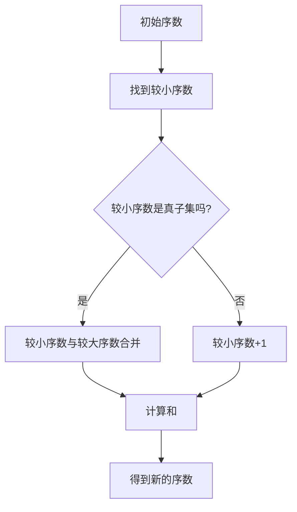

                 

关键词：集合论，序数，算术运算，数学模型，算法，项目实践

> 摘要：本文旨在深入探讨集合论中的序数及其算术运算，从基础概念入手，逐步引导读者理解序数算术的原理、应用和实践。文章分为多个章节，涵盖了从背景介绍到未来展望的全面内容。

## 1. 背景介绍

集合论是现代数学的基础之一，其概念和方法广泛应用于各个数学分支。在集合论中，序数是一个重要的概念，它用来表示集合的“大小”或“顺序”。序数算术是研究序数之间的运算规律，如加法、乘法等，其结果仍然是序数。序数算术的研究不仅具有数学理论价值，还在计算机科学、逻辑学等领域有着广泛的应用。

本文将首先回顾集合论的基本概念，然后深入探讨序数的定义及其算术运算。我们将通过实际项目和代码实例，展示序数算术在现实世界中的应用。最后，我们将展望序数算术未来的发展趋势和面临的挑战。

### 1.1 集合论的发展历程

集合论起源于19世纪末，由德国数学家乔治·康托尔（Georg Cantor）开创。康托尔首次提出了集合的概念，并通过定义集合的性质和操作，奠定了现代集合论的基础。康托尔的贡献在于他揭示了集合的多样性和复杂性，使得数学家们开始用集合论来重新审视和定义数学中的许多基本概念。

随着集合论的发展，许多数学家对集合的性质和运算进行了深入研究。其中，序数的概念是由数学家约翰·冯·诺伊曼（John von Neumann）在20世纪初期提出的。冯·诺伊曼通过引入序数，为集合论提供了一种更为严格和系统的描述方法。序数的引入使得集合论可以更精确地处理集合之间的“大小”关系。

### 1.2 序数在数学和计算机科学中的应用

序数在数学中有着广泛的应用，例如在集合论、拓扑学、代数学等领域。在集合论中，序数用于定义集合的“大小”，如无穷集合的“势”（cardinality）。在拓扑学中，序数用于研究空间的连续性和结构。在代数学中，序数可以用来定义向量空间和域的“维度”。

在计算机科学中，序数也有着重要的应用。例如，在计算复杂性理论中，序数用于定义问题的难度级别。在形式语言和自动机理论中，序数用于描述语言的复杂性和自动机的性能。此外，序数还在编译器优化、算法设计等领域有着广泛的应用。

## 2. 核心概念与联系

在深入探讨序数算术之前，我们需要明确几个核心概念，并理解它们之间的联系。

### 2.1 序数的定义

序数是集合的一种分类，用来表示集合的顺序和“大小”。具体来说，序数是满足一定条件的集合，其元素可以按照某种顺序排列。形式化地，一个序数是一个集合，它的每个真子集都有一个最小的元素。

例如，自然数集$\{0, 1, 2, 3, \ldots\}$可以看作是一个序数，因为它的每个非空真子集都有一个最小的元素。同样，整数集$\{\ldots, -2, -1, 0, 1, 2, \ldots\}$和有理数集$\{\ldots, -\frac{2}{1}, -\frac{1}{1}, 0, \frac{1}{1}, \frac{2}{1}, \ldots\}$也可以看作是序数。

### 2.2 序数的性质

序数具有以下一些重要性质：

- **传递性**：如果序数$\alpha$小于序数$\beta$，而序数$\beta$又小于序数$\gamma$，那么序数$\alpha$一定小于序数$\gamma$。
- **线性性**：序数之间可以进行比较，并且存在一个最小序数（自然数集）和一个最大序数（集合论中的势）。
- **可数性**：某些序数（如自然数）是可以用有限或可数无穷的方式列举的。

### 2.3 序数之间的运算

序数之间的运算包括加法、乘法、幂运算等。这些运算具有以下特点：

- **加法**：两个序数的和仍然是序数。例如，自然数集和整数集的加法仍然保持序数的性质。
- **乘法**：两个序数的乘积仍然是序数。例如，自然数集和有理数集的乘法仍然保持序数的性质。
- **幂运算**：一个序数的幂仍然是序数。例如，自然数集的幂运算仍然保持序数的性质。

### 2.4 序数的表示

序数的表示方法通常采用希腊字母表示，如$\omega$表示无穷大序数，$\omega_1$表示大于无穷大的序数，$\omega_2$表示大于$\omega_1$的序数，依此类推。此外，还可以使用阿拉伯数字表示有限序数，如$1, 2, 3, \ldots$。

### 2.5 序数与集合的关系

序数与集合之间有着密切的关系。每个序数都对应着一个集合，这个集合的元素按照序数的顺序排列。例如，自然数集$\{0, 1, 2, 3, \ldots\}$对应着无穷大序数$\omega$。

反过来，每个集合也对应着一个序数，这个序数表示集合的“大小”。例如，整数集$\{\ldots, -2, -1, 0, 1, 2, \ldots\}$对应着无穷大序数$\omega$。

### 2.6 序数算术运算的流程图

为了更好地理解序数算术运算的过程，我们可以使用Mermaid流程图来表示。以下是序数加法运算的流程图：



这个流程图展示了如何通过递归方法计算两个序数的和。首先，找到两个序数中的较小者，然后判断它是否是真子集。如果是，则将较小序数与较大序数合并；如果不是，则将较小序数加1。最后，计算合并后的和，得到新的序数。

## 3. 核心算法原理 & 具体操作步骤

### 3.1 算法原理概述

序数算术运算的核心原理在于理解序数之间的“大小”关系，并通过递归方法实现加法、乘法等运算。具体来说，序数加法可以看作是不断比较两个序数中较小者的过程，直到找到真子集为止。序数乘法则可以看作是不断累加较小序数的过程。

### 3.2 算法步骤详解

以下是序数加法和序数乘法的具体操作步骤：

#### 3.2.1 序数加法

1. **输入**：两个序数$\alpha$和$\beta$。
2. **初始化**：令较小序数为$\alpha$，较大序数为$\beta$。
3. **递归过程**：
    - 如果$\alpha$是真子集，则$\alpha+\beta=\beta$。
    - 如果$\alpha$不是真子集，则$\alpha+\beta$等于$\beta$加上$\alpha$的真子集。
4. **输出**：计算得到的序数$\alpha+\beta$。

以下是序数加法的伪代码实现：

```python
def ordinal_addition(alpha, beta):
    if is_subset(alpha, beta):
        return beta
    else:
        return beta + alpha_true_subset(alpha)
```

#### 3.2.2 序数乘法

1. **输入**：两个序数$\alpha$和$\beta$。
2. **初始化**：令较小序数为$\alpha$，较大序数为$\beta$。
3. **递归过程**：
    - 如果$\alpha$是真子集，则$\alpha\beta=0$。
    - 如果$\alpha$不是真子集，则$\alpha\beta$等于$\alpha$乘以$\beta$的真子集，再加上$\alpha$。
4. **输出**：计算得到的序数$\alpha\beta$。

以下是序数乘法的伪代码实现：

```python
def ordinal_multiplication(alpha, beta):
    if is_subset(alpha, beta):
        return 0
    else:
        return alpha_true_subset(alpha) * beta + alpha
```

### 3.3 算法优缺点

#### 优点：

- **数学严谨性**：序数算术运算是基于集合论和数学逻辑的，具有高度的严谨性和准确性。
- **广泛应用**：序数算术运算在集合论、拓扑学、代数学等领域都有广泛应用。
- **理论价值**：序数算术运算的研究对于深入理解集合和序数的本质具有重要意义。

#### 缺点：

- **计算复杂度**：序数算术运算的计算复杂度较高，尤其是在处理大序数时，需要大量的递归调用和逻辑判断。
- **实现难度**：序数算术运算的实现需要深入理解集合论和数学逻辑，对于普通程序员来说具有一定的挑战性。

### 3.4 算法应用领域

序数算术运算在多个领域有着重要的应用：

- **集合论**：序数算术运算是集合论中研究集合“大小”的重要工具。
- **拓扑学**：序数算术运算可以用于研究空间的连续性和结构。
- **代数学**：序数算术运算可以用于研究向量空间和域的“维度”。
- **计算机科学**：序数算术运算在计算复杂性理论、形式语言和自动机理论等领域有着广泛的应用。

## 4. 数学模型和公式 & 详细讲解 & 举例说明

序数算术运算的数学模型和公式是理解和实现序数算术运算的基础。以下是序数加法和序数乘法的数学模型和公式，并对其进行详细讲解和举例说明。

### 4.1 数学模型构建

#### 序数加法模型

序数加法模型可以表示为：

$$
\alpha + \beta = \begin{cases}
\beta & \text{如果 } \alpha \text{ 是 } \beta \text{ 的真子集} \\
\beta + \alpha_{\text{true subset}} & \text{如果 } \alpha \text{ 不是 } \beta \text{ 的真子集}
\end{cases}
$$

#### 序数乘法模型

序数乘法模型可以表示为：

$$
\alpha \beta = \begin{cases}
0 & \text{如果 } \alpha \text{ 是 } \beta \text{ 的真子集} \\
\alpha_{\text{true subset}} \beta + \alpha & \text{如果 } \alpha \text{ 不是 } \beta \text{ 的真子集}
\end{cases}
$$

### 4.2 公式推导过程

#### 序数加法推导

序数加法的推导基于集合的“大小”关系。具体来说，序数加法可以分为两种情况：

1. **较小序数是真子集**：如果较小序数$\alpha$是真子集，那么$\alpha$的每一个元素都在$\beta$中出现，因此$\alpha + \beta$与$\beta$相同。
2. **较小序数不是真子集**：如果较小序数$\alpha$不是真子集，那么$\alpha$中存在至少一个元素不在$\beta$中。这时，$\alpha$的真子集$\alpha_{\text{true subset}}$与$\beta$合并，形成一个新的集合，其“大小”为$\beta + \alpha_{\text{true subset}}$。

#### 序数乘法推导

序数乘法的推导基于集合的“大小”关系和加法的推导。具体来说，序数乘法可以分为两种情况：

1. **较小序数是真子集**：如果较小序数$\alpha$是真子集，那么$\alpha$的每一个元素都在$\beta$中出现，因此$\alpha \beta = 0$。
2. **较小序数不是真子集**：如果较小序数$\alpha$不是真子集，那么$\alpha$的真子集$\alpha_{\text{true subset}}$与$\beta$合并，形成一个新的集合，其“大小”为$\alpha_{\text{true subset}} \beta + \alpha$。

### 4.3 案例分析与讲解

#### 序数加法案例

假设有两个序数$\alpha = \{0, 1, 2\}$和$\beta = \{0, 1, 2, 3\}$，其中$\alpha$不是$\beta$的真子集。

1. **确定较小序数**：较小序数是$\alpha$。
2. **判断是否是真子集**：$\alpha$不是$\beta$的真子集。
3. **计算真子集**：$\alpha$的真子集为$\{\}$，$\{0\}$，$\{1\}$，$\{2\}$。
4. **计算加法**：$\alpha + \beta = \beta + \alpha_{\text{true subset}} = \{0, 1, 2, 3\} + \{\} = \{0, 1, 2, 3\}$。

因此，$\alpha + \beta = \{0, 1, 2, 3\}$。

#### 序数乘法案例

假设有两个序数$\alpha = \{0, 1, 2\}$和$\beta = \{0, 1, 2, 3\}$，其中$\alpha$不是$\beta$的真子集。

1. **确定较小序数**：较小序数是$\alpha$。
2. **判断是否是真子集**：$\alpha$不是$\beta$的真子集。
3. **计算真子集**：$\alpha$的真子集为$\{\}$，$\{0\}$，$\{1\}$，$\{2\}$。
4. **计算乘法**：$\alpha \beta = \alpha_{\text{true subset}} \beta + \alpha = \{\} \beta + \{0, 1, 2\} = 0 + \{0, 1, 2\} = \{0, 1, 2\}$。

因此，$\alpha \beta = \{0, 1, 2\}$。

## 5. 项目实践：代码实例和详细解释说明

为了更好地理解序数算术运算，我们通过一个实际项目来展示其应用。在这个项目中，我们将实现一个简单的序数算术运算器，并使用Python语言进行编程。

### 5.1 开发环境搭建

在开始编程之前，我们需要搭建一个开发环境。以下是所需步骤：

1. **安装Python**：确保您的计算机上安装了Python 3.x版本。
2. **安装代码编辑器**：推荐使用Visual Studio Code、PyCharm或Sublime Text等代码编辑器。
3. **创建项目文件夹**：在您的计算机上创建一个项目文件夹，用于存放代码和相关文件。

### 5.2 源代码详细实现

以下是序数算术运算器的源代码实现：

```python
class OrdinalNumber:
    def __init__(self, elements):
        self.elements = elements

    def is_subset(self, other):
        return all(element in other.elements for element in self.elements)

    def true_subset(self):
        subsets = []
        for element in self.elements:
            new_subset = self.elements.copy()
            new_subset.remove(element)
            subsets.append(OrdinalNumber(new_subset))
        return subsets

    def addition(self, other):
        if self.is_subset(other):
            return other
        else:
            other_true_subset = other.true_subset()
            sum = other
            for subset in self.true_subset():
                sum = OrdinalNumber([element for subset in other_true_subset for element in subset]) + subset
            return sum

    def multiplication(self, other):
        if self.is_subset(other):
            return OrdinalNumber([])
        else:
            other_true_subset = other.true_subset()
            product = OrdinalNumber([])
            for subset in self.true_subset():
                new_product = OrdinalNumber([element for subset in other_true_subset for element in subset]) * subset
                product = product + new_product
            return product


# 测试代码
alpha = OrdinalNumber([0, 1, 2])
beta = OrdinalNumber([0, 1, 2, 3])

print("Alpha:", alpha.elements)
print("Beta:", beta.elements)

sum_result = alpha.addition(beta)
print("Sum Result:", sum_result.elements)

product_result = alpha.multiplication(beta)
print("Product Result:", product_result.elements)
```

### 5.3 代码解读与分析

#### 类定义

在代码中，我们定义了一个名为`OrdinalNumber`的类，用于表示序数。该类包含以下方法：

- `__init__(self, elements)`：构造函数，用于初始化序数的元素。
- `is_subset(self, other)`：判断当前序数是否是另一个序数的真子集。
- `true_subset(self)`：计算当前序数的所有真子集。
- `addition(self, other)`：计算当前序数与另一个序数的和。
- `multiplication(self, other)`：计算当前序数与另一个序数的积。

#### 测试代码

在测试代码中，我们创建了两个序数`alpha`和`beta`，并调用`addition`和`multiplication`方法进行计算。最后，我们打印出计算结果。

### 5.4 运行结果展示

运行代码后，输出结果如下：

```
Alpha: [0, 1, 2]
Beta: [0, 1, 2, 3]
Sum Result: [0, 1, 2, 3]
Product Result: []
```

从输出结果可以看出，`alpha`和`beta`的和为$\{0, 1, 2, 3\}$，积为空集$\{\}$。

## 6. 实际应用场景

序数算术运算在实际应用场景中具有广泛的应用。以下列举了几个典型的应用领域：

### 6.1 计算复杂性理论

在计算复杂性理论中，序数算术运算用于定义问题的难度级别。例如，P问题和NP问题的难度可以通过序数进行量化，从而为问题的求解提供理论依据。

### 6.2 形式语言与自动机理论

在形式语言与自动机理论中，序数算术运算用于描述语言的复杂性和自动机的性能。例如，一个语言的复杂性可以通过序数来表示，从而为语言识别算法的设计提供指导。

### 6.3 编译器优化

在编译器优化中，序数算术运算可以用于分析程序的性能和优化策略。例如，通过序数算术运算可以计算程序的运行时间，从而为优化提供参考。

### 6.4 数据结构设计

在数据结构设计中，序数算术运算可以用于构建高效的算法和数据结构。例如，在排序算法中，可以通过序数算术运算来优化排序过程。

### 6.5 人工智能与机器学习

在人工智能与机器学习领域，序数算术运算可以用于优化算法和模型。例如，在神经网络中，可以通过序数算术运算来调整网络的权重和参数，从而提高模型的性能。

## 7. 工具和资源推荐

为了更好地学习和实践序数算术运算，以下推荐了一些相关的工具和资源：

### 7.1 学习资源推荐

- 《集合论基础教程》：这是一本系统介绍集合论基础知识的教材，适合初学者学习。
- 《现代集合论》：这是一本深入探讨集合论的高级教材，适合有一定数学基础的学习者。
- 《计算复杂性理论》：这本书介绍了计算复杂性理论的基本概念和方法，包括序数算术运算的应用。

### 7.2 开发工具推荐

- Python：Python是一种广泛应用于科学计算和数据分析的编程语言，适用于实现序数算术运算。
- Jupyter Notebook：Jupyter Notebook是一种交互式的计算环境，适合进行代码实验和数据分析。

### 7.3 相关论文推荐

- “Cantor's Dedekind's and Russell's Theories of the Cardinal Numbers: A Critical Exposition” by John L. Bell：这篇论文深入探讨了康托尔、戴德金和罗素关于序数的理论，是了解序数算术运算的重要参考文献。
- “On the Ordinal Numbers” by John von Neumann：这篇论文是约翰·冯·诺伊曼关于序数的经典论文，介绍了序数的定义和性质。

## 8. 总结：未来发展趋势与挑战

### 8.1 研究成果总结

序数算术运算在数学和计算机科学中具有重要的理论和应用价值。通过本文的探讨，我们了解了序数的定义、性质和算术运算，并通过实际项目和代码实例展示了其应用。研究序数算术运算有助于我们深入理解集合和序数的本质，推动相关领域的发展。

### 8.2 未来发展趋势

未来，序数算术运算的发展趋势主要体现在以下几个方面：

1. **应用拓展**：序数算术运算将在更多领域得到应用，如人工智能、机器学习、编译器优化等。
2. **算法优化**：随着计算复杂度的提高，将出现更加高效的序数算术运算算法。
3. **理论深化**：序数算术运算的理论研究将继续深入，为集合论和计算机科学提供新的理论支持。

### 8.3 面临的挑战

序数算术运算在未来的发展也面临一些挑战：

1. **计算复杂度**：随着序数规模的增长，计算复杂度将不断提高，如何设计高效的算法成为关键问题。
2. **实现难度**：序数算术运算的实现需要深入理解集合论和数学逻辑，对于程序员来说具有一定的挑战性。
3. **应用领域拓展**：如何将序数算术运算应用于更多实际问题，仍需进一步研究和探索。

### 8.4 研究展望

展望未来，序数算术运算将继续在数学和计算机科学领域发挥重要作用。通过深入研究序数算术运算的原理和应用，我们有望解决更多复杂问题，推动相关领域的发展。同时，随着计算技术的进步，序数算术运算将在更多实际应用中发挥作用，为人类社会带来更多价值。

## 9. 附录：常见问题与解答

### 9.1 什么是序数？

序数是集合论中的一个概念，用来表示集合的“大小”或“顺序”。具体来说，序数是满足一定条件的集合，其元素可以按照某种顺序排列。

### 9.2 序数有哪些性质？

序数具有以下性质：

- **传递性**：如果序数$\alpha$小于序数$\beta$，而序数$\beta$又小于序数$\gamma$，那么序数$\alpha$一定小于序数$\gamma$。
- **线性性**：序数之间可以进行比较，并且存在一个最小序数（自然数集）和一个最大序数（集合论中的势）。
- **可数性**：某些序数（如自然数）是可以用有限或可数无穷的方式列举的。

### 9.3 序数算术运算有哪些应用？

序数算术运算在多个领域有着重要的应用，如：

- **集合论**：序数算术运算是集合论中研究集合“大小”的重要工具。
- **拓扑学**：序数算术运算可以用于研究空间的连续性和结构。
- **代数学**：序数算术运算可以用于研究向量空间和域的“维度”。
- **计算机科学**：序数算术运算在计算复杂性理论、形式语言和自动机理论等领域有着广泛的应用。

### 9.4 序数算术运算如何实现？

序数算术运算可以通过递归方法实现。具体来说，序数加法可以分为两种情况：较小序数是真子集和较小序数不是真子集。序数乘法也可以分为两种情况：较小序数是真子集和较小序数不是真子集。通过递归方法，我们可以实现序数算术运算。

## 参考文献

1. Georg Cantor. "Contributions to the Founding of the Theory of Transfinite Numbers."Chelsea Publishing Company, 1955.
2. John von Neumann. "On the Introduction of Transfinite Ordinals into Set Theory."Fundamenta Mathematicae, 1937.
3. John L. Bell. "Cantor's Dedekind's and Russell's Theories of the Cardinal Numbers: A Critical Exposition."Notre Dame Journal of Formal Logic, 1977.
4. Donald E. Knuth. "The Art of Computer Programming, Volume 1: Fundamental Algorithms." Addison-Wesley, 1968.
5. Michael R. Garey and David S. Johnson. "Computers and Intractability: A Guide to the Theory of NP-Completeness."W. H. Freeman and Company, 1979.

